### Resultados EP1 - Ghost

### Bitácora
1. Se intentó instalar Ghost 1.8.1 bajando el .zip del release de GitHub. No funcionó intuitivamente.
2. Se utilizó Ghost CLI para realizar la instalación local.
3. Se creó la cuenta de administrador
4. Se revisaron las funcionalidades disponibles en la página y el administrador de la página, buscando posibles errores.
5. Se corrió un reporte Lighthouse sobre el home de la página.
6. Se eliminaron los posts que vienen por defecto.
7. Se creo una prueba de cypress para la creación, actualización y eliminación de un post.
8. Se ejecutaron las pruebas

### Instalación desde el zip
Inicialmente se intentó instalar Ghost desde el zip que se referencia en https://ghost.org/developers/ ([v1.8.1](https://github.com/TryGhost/Ghost/releases/download/1.8.1/Ghost-1.8.1.zip)). Sin embargo, [la página](https://docs.ghost.org/v1.0.0/docs/getting-started-guide) no ofrece instrucciones de instalación usando el zip. Se intentó instalar haciendo lo intuitivo sobre un paquete NPM, hacer `npm install` en el directorio raíz. Luego de realizar la instalación, se intentó correr el index.js con `node index.js`, pero esto botó error. Se decidió utilizar una [instalación con el Ghost CLI](https://docs.ghost.org/v1.0.0/docs/install-local#section-install-ghost-cli) entonces.

### Instalación con Ghost CLI
Se instaló el Ghost CLI utilizando el comando `npm install -g ghost-cli`:

Se procedió a instalar ghost en un directorio vacío con el comando `ghost instal local`:

Funcionando:

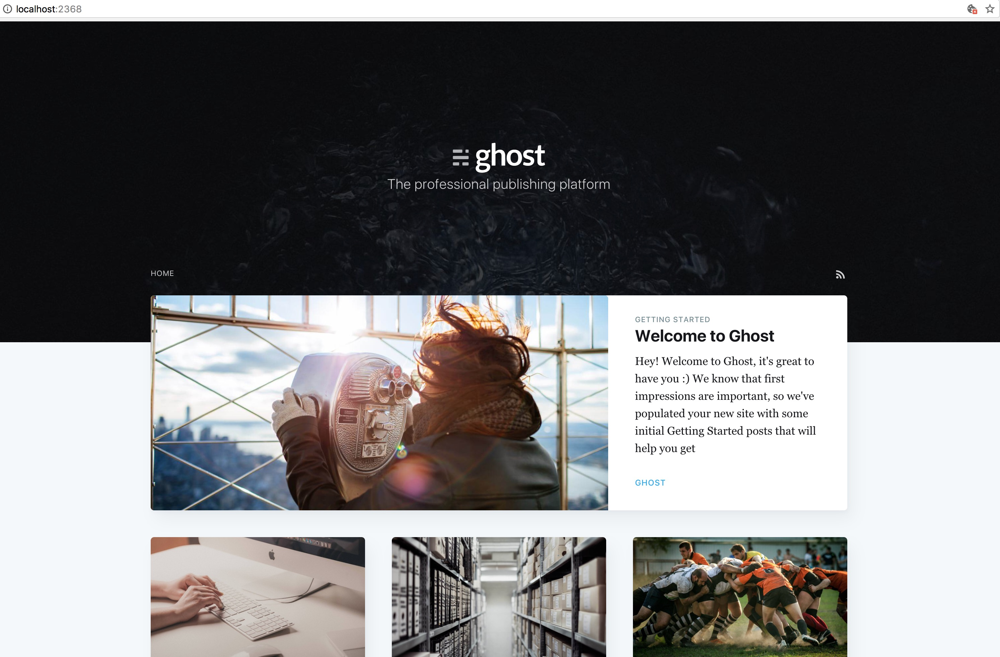

Posterior a la instalación, se configuró el usuario admin:

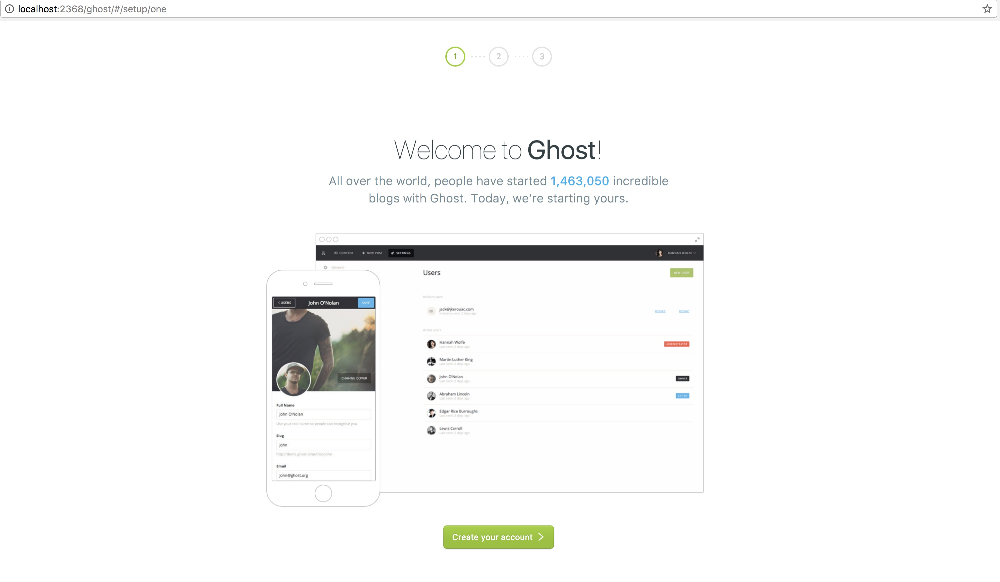

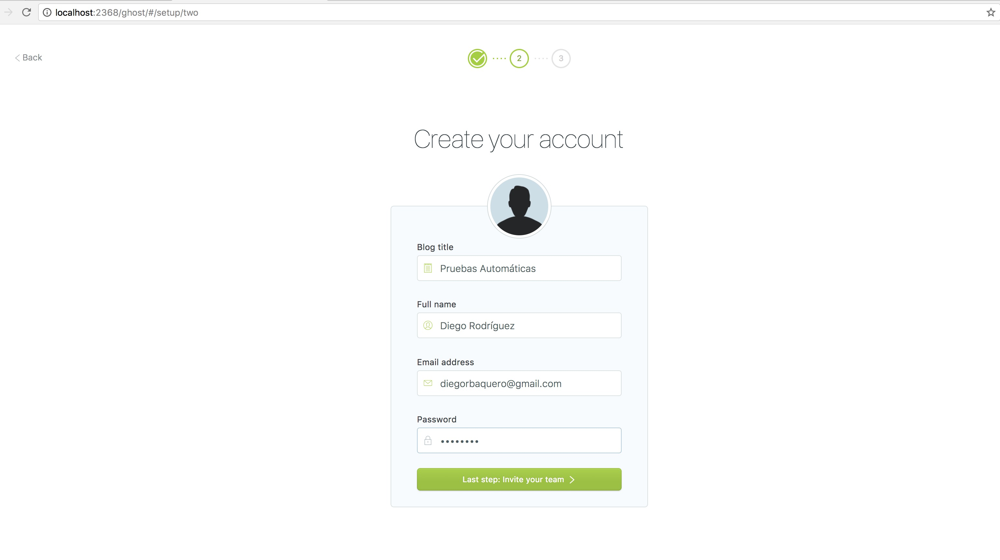

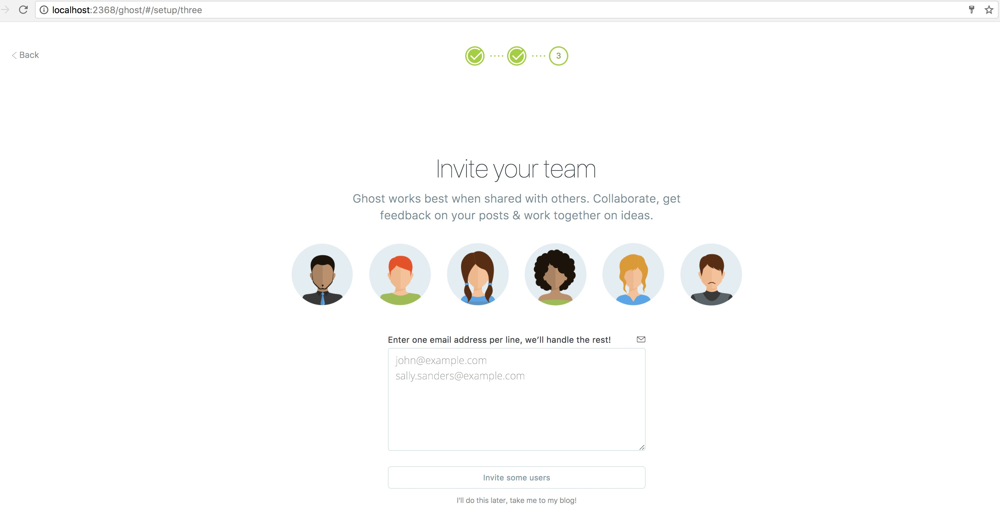

### Exploración interfaz

Admin principal/vista de posts:

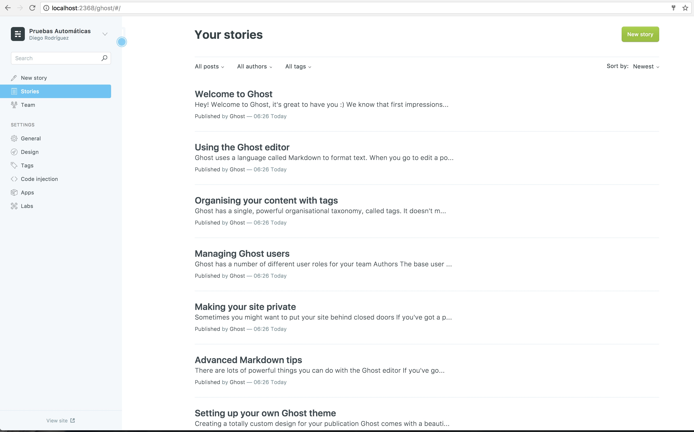

Nuevo post:

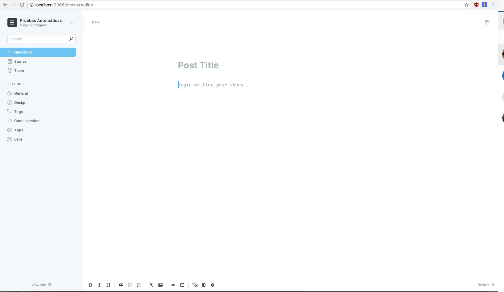

Team:

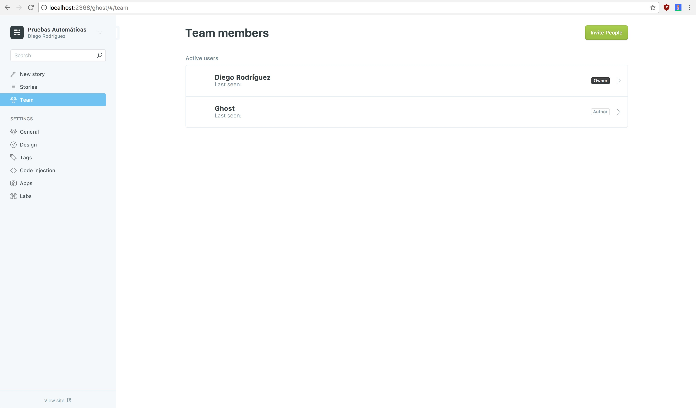

**Configuración:**

General

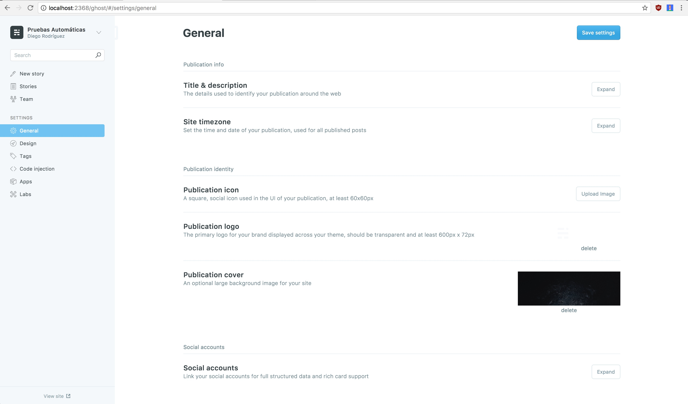

Diseño

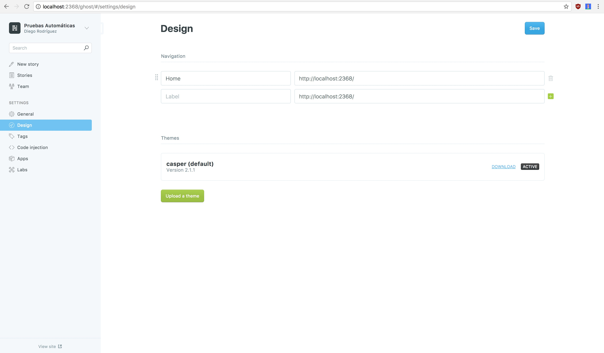

Tags

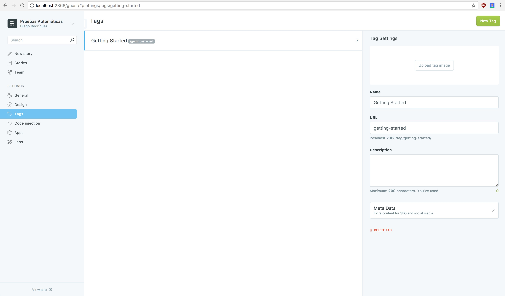

Code injection

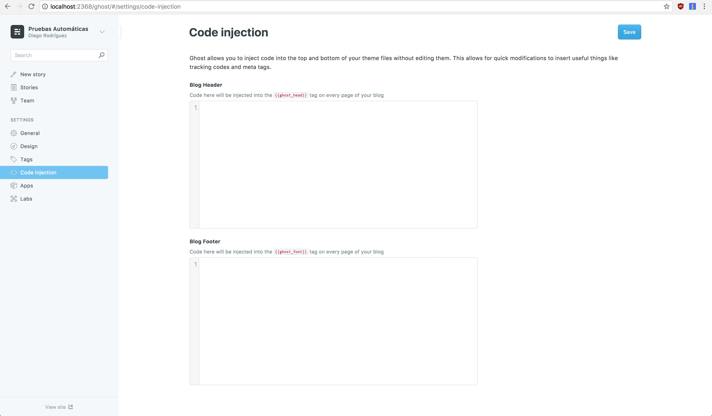

Apps

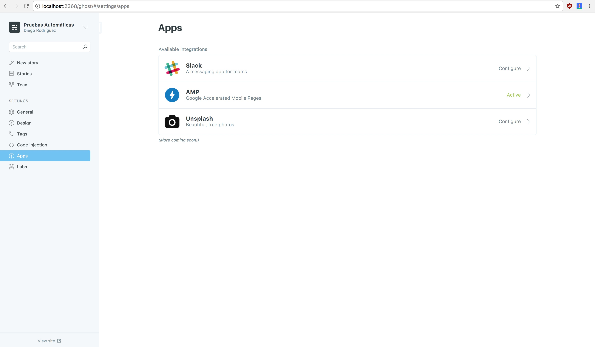

Labs

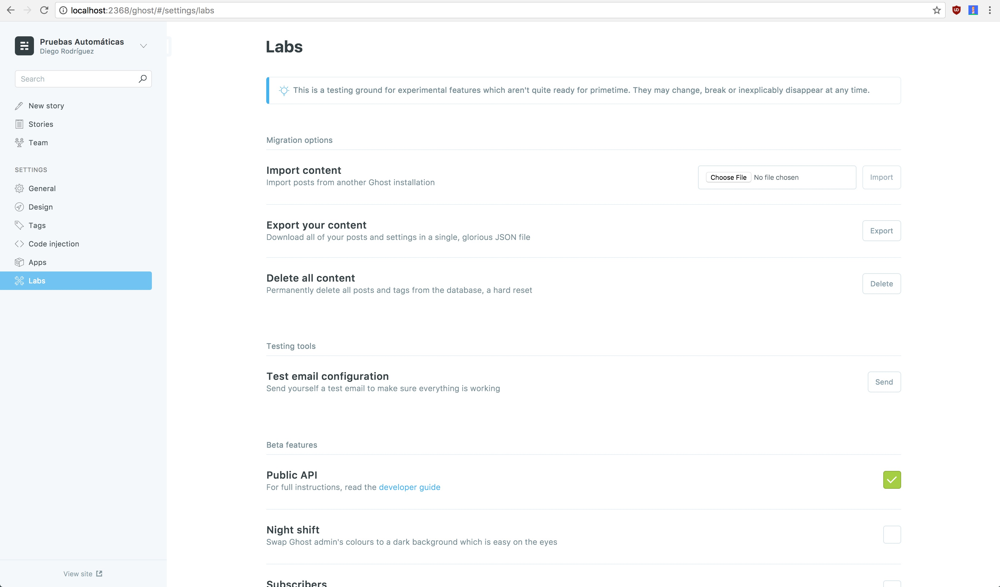

### Reporte Lighthouse

En el siguiente link se encuentra el reporte de Lighthouse realizado sobre el Home del blog:
[Reporte Lighhouse](Reporte_Lighthouse.pdf)

Como podemos ver del reporte:
- Ghost no es una aplicación web progressiva. No registra un service worker y no funciona offline
- Las imagenes que venían con los post por defecto se pueden optimizar bastante (hasta un 64%)

### Pruebas Cypress

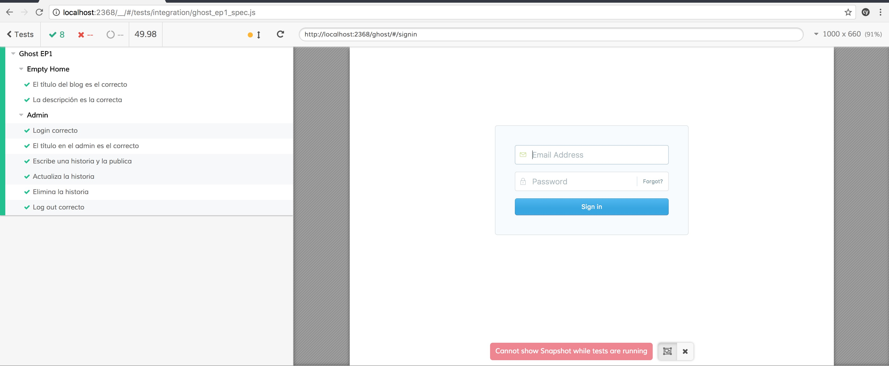

### Fallas/defectos encontrados
- Los "pasos" para "instalar" Ghost desde la página principal, donde se descarga el ZIP no llevaron a nada. La intuitividad llevó a un error.
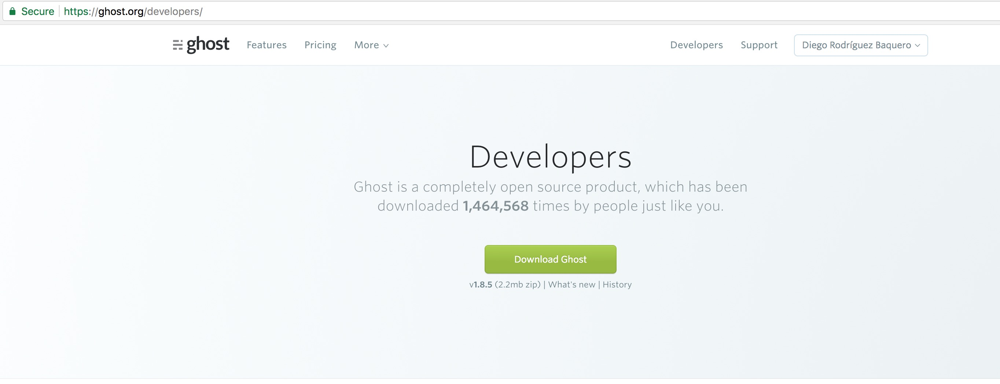
- Cypress *crasheó* al utilizar la variable `Cypress.$` (jQuery) en una de la pruebas.
- El textarea del contenido de un post a veces no se vuelve el elemento *focused* al hacer click sobre el *"Code Mirror"*:
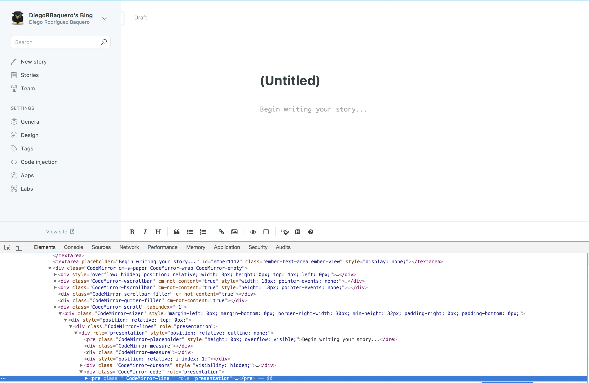
El elemento inspeccionado es el pre, el textarea está más arriba.
