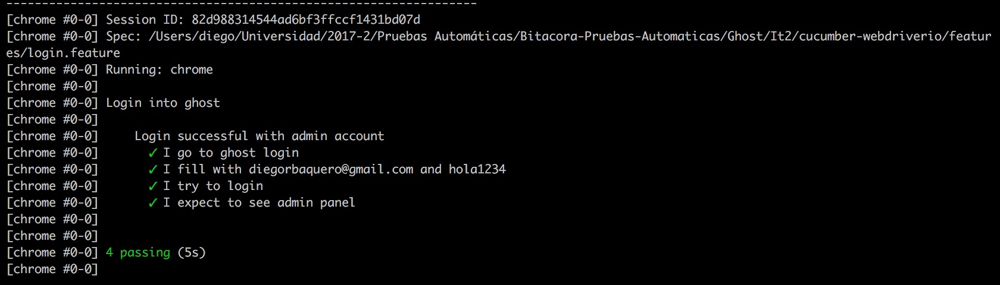

# Resultados EP1 - WordPress

### Bitácora
1. Se instaló la última versión de Ghost y se configuró
1. Se actualizó el test e2e de cypress y se corrió
1. Se creó un ripper test con cypress y se probó para el home y el admin
1. Se creó un fuzz test con gremlins, se probó en el home y el admin.
1. Se duplicó la configuración para funcionar en chrome y firefox
1. Se documentó las pruebas de cypress y gremlins
1. Se creó un script de carga genérico de apache benchmark (ab) para load testing
1. Se creó un script para correr varios test de ab con diferentes parámetros
1. Se creó un script que guarda los logs de ab
1. Se documentó los resultados de ab
1. Se creo un feature de login de cucumber-webdriverio
1. Se corrió y verificó su funcionamiento
1. Se documentó la prueba

### Cypress

##### End to end

##### Ripper Cypress Home

##### Ripper Cypress Completo con admin

### Gremlins

Gremlins solo funciona en aplicaciones SPA, por lo que si se sale de la página actual se genera error, ya que el script de gremlins deja de existir.

### Apache Benchmark

En el [log](apache-benchmark/results.log) se puede ver que el máximo de peticiones por segundo que soporta Ghost corriendo localmente en el macbook Pro es de 20 peticiones por segundo.
Por otro lado, Ghost no soporta los tests de 500 y 1000 conexiones concurrentes, pero sí de 200, por lo que se puede asumir que tiene un límite cercano a 256 conexiones.
Se degrada demasiado rápido, con 20 conexiones concurrentes el tiempo de respuesta ya es de más de un segundo. Con 50 conexiones concurrentes pasa a 2.5 segundos, que supera el límite sugerido por Google.

Se utilizó Keep Alive y se permitió respuestas gzip y deflate para acercarse a la realidad de un cliente browser.

Las pruebas se corrieron 20 veces.

##### Resultado

### Cucumber-WebdriverIO

Se creó una pequeña prueba de hacer login y se definieron sus pasos. El login satisfactorio:

### Fallas/defectos encontrados
- Ghost (CLI): Hubo una falla al instalar el nuevo blog. El CLI de Ghost pedía yarn, más no es obligatorio tenerlo. Al reinstalar el CLI funcionó como debía
- Gremlins: Si una aplicación no es un SPA, al cargar otra URL, se pierde gremlins y genera error
- Ghost: No soporta 500 conexiones concurrentes de GETs sencillos al home (con KeepAlive)