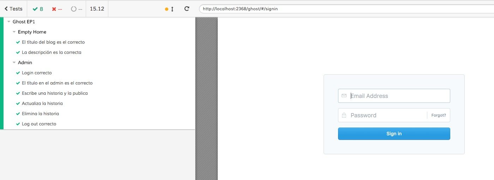

# Resultados EP1 - WordPress

### Bitácora
1. Se instaló la última versión de Ghost y se configuró
1. Se actualizó el test e2e de cypress y se corrió
1. Se creó un ripper test con cypress y se probó para el home y el admin
1. Se creó un fuzz test con gremlins, se probó en el home y el admin.
1. Se duplicó la configuración para funcionar en chrome y firefox
1. Se documentó las pruebas de cypress y gremlins

### Cypress

##### End to end

##### Ripper Cypress Home

##### Ripper Cypress Completo con admin

### Gremlins

Gremlins solo funciona en aplicaciones SPA, por lo que si se sale de la página actual se genera error, ya que el script de gremlins deja de existir.

##### Resultado

### Fallas/defectos encontrados
- Ghost (CLI): Hubo una falla al instalar el nuevo blog. El CLI de Ghost pedía yarn, más no es obligatorio tenerlo. Al reinstalar el CLI funcionó como debía
- Gremlins: Si una aplicación no es un SPA, al cargar otra URL, se pierde gremlins y genera error