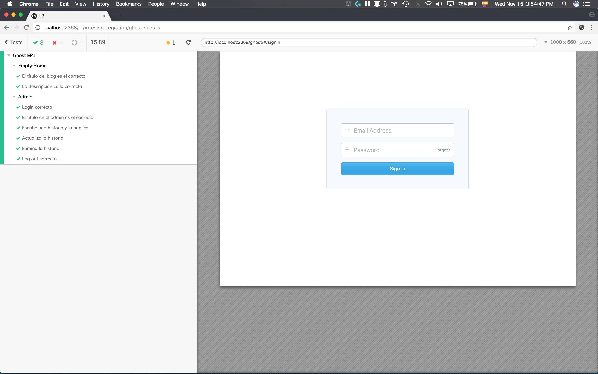
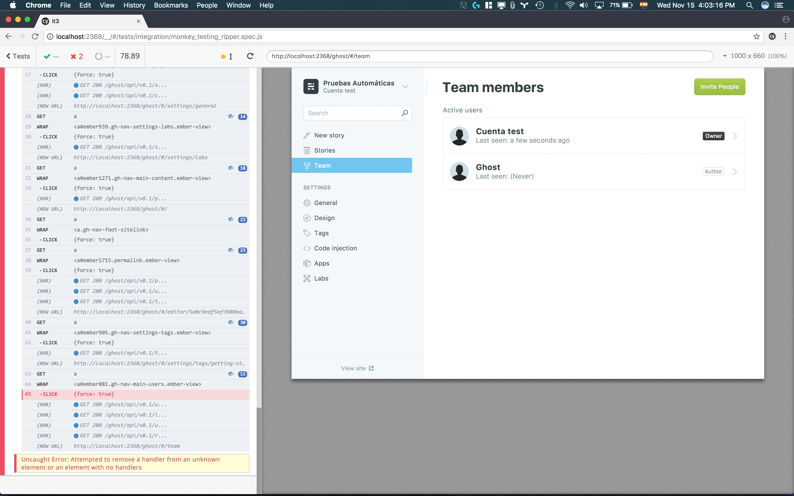
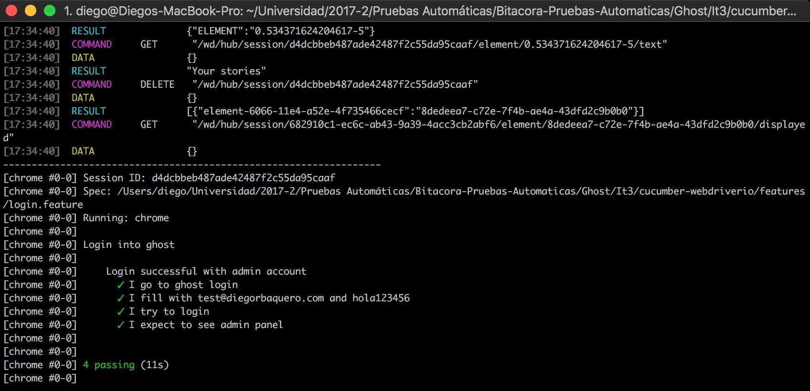
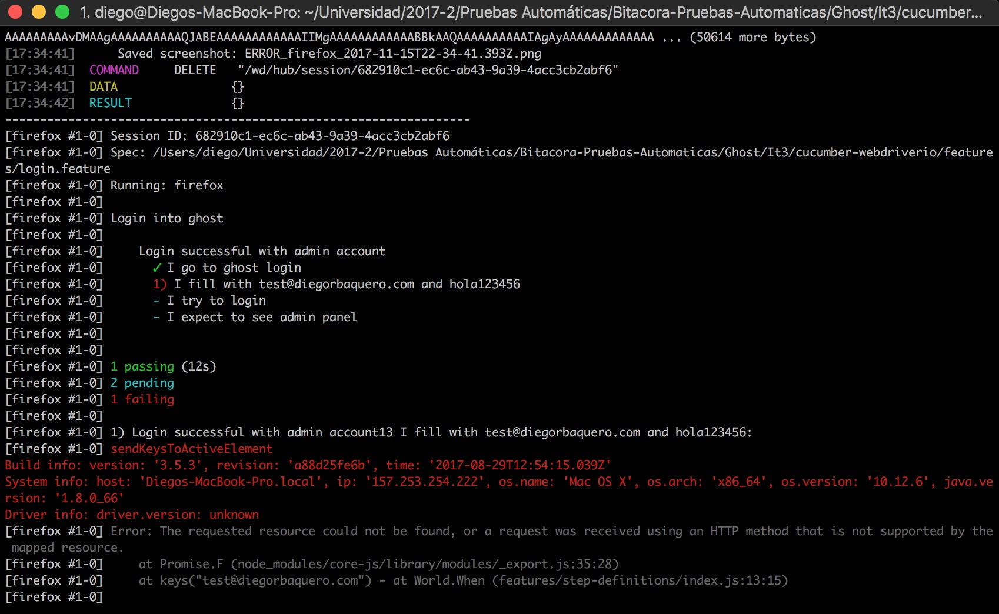
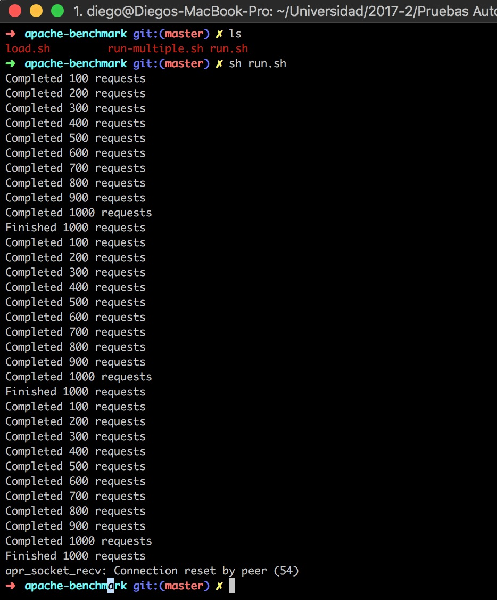

# Resultados EP1 - WordPress

### Bitácora
1. Se instaló la última versión de Ghost y se configuró
1. Se actualizó el test e2e de cypress y se corrió
1. Se actualizó el ripper test con cypress y se probó para el home y el admin
1. Se documentó las pruebas de cypress
1. Se actualizó la prueba de cucumber y se corrió
1. Se documentó la prueba de cucumber
1. Se corrió el script de carga genérico de apache benchmark (ab) para load testing
1. Se corrió el script para correr varios test de ab con diferentes parámetros
1. Se corrió el script que guarda los logs de ab
1. Se documentó los resultados de ab
1. Se realizaron tres entrevista como pruebas de usabilidad
1. Se documentaron las entrevistas

### Cypress

Fue necesario cambiar la contraseña en los tests ya que ahora está bien restringida la mínima longitud de contraseña a 10 caracteres (se arregló desde la versión anterior).

- La prueba de integración corrió muy bien 10 ejecuciones sin ningún problema.
  
- La prueba de ripper para front funcionó bien en 20 ejecuciones
- La prueba de ripper para back fallaba en la mayoría de veces por el siguiente error:
  

### Cucumber-WebdriverIO

Se corrió prueba de hacer login. La prueba fue satisfactoria en Chrome Headless:

La prueba falló en Firefox (Quantum)

### Apache Benchmark

En el [log](apache-benchmark/results.log) se pueden ver los resultados. Se evidencia que el desempeño fue degradado en todos los tests. El más notorio fue con 10 clientes haciendo 100 peticiones. EN la iteración 2 se hacían 18 req/s, en esta, solo se llego a 8 req/s. Se mantuvo el último log. Curiosamente sí corrió con 500 clientes, murió con 1000. El equipo de Ghost hizo un cambio en el máximo número de clientes concurrentes de 256 a 512.

Se utilizó Keep Alive y se permitió respuestas gzip y deflate para acercarse a la realidad de un cliente browser.

Las pruebas se corrieron 20 veces.

### Usabilidad y UX

**Guía**

- Siempre mencionar todo lo que se piensa, positivo y negativo.
- Navegar el home aleatoriamente.
- Ir a un post y compartirlo
- Navegar el home aleatoriamente.
- Crear un post
- Ver correo de bienvenida

1. Primera entrevista: Estudiante hombre de ingeniería de sistemas de 5to semestre. No le gusta trabajar con frontend.

Principal (front)
- Sugerencia: Botón de volver mas grande, en el menú, el botón de home.
- Es Bacano la barrita de progreso de lectura en la parte de arriba con la oportunidad de compartir a redes sociales
- Es chévere que soporte markdown.

Admin (back)
- El setup es muy fácil y estético, es bueno que se force una contraseña larga.
- El tutorial guiado con los puntos azules es novedoso, sobre todo por la animación que guía al ojo.
- Menú de filtrado chévere.
- No se entiende en general si es la configuración del blog o artículos.
- "Apps no sé entiende bien qué es, plugins?""
- Esta chévere el editor y la forma de cambiar “las vainas”

El correo que llega de bienvenida está sencillo y no envían el texto plano de la contraseña, bien!

2. Estudiante hombre de ingeniería de civil

Principal (front)
- Todas las cajas son iguales, no hay forma de darle relevancia
- Donde iría el menú? Falta un panel de navegación
- Es bonito
- Es sencillo

Admin (back)
- Es muy limpio el tema
- Fácil de entender y navegar, no muchas opciones

- El correo tiene lo necesario

3. Estudiante mujer de biología de séptimo semestre, 22 años

Principal (front)
- No hay que entrar
- Es bonito
- Se puede devolver fácilmente al home

Admin (back)
- Es raro llegar a la vista doble donde se ve el código de del contenido, debería ser más obvio. (Markdown compilado)
- No queda muy claro cual es la vista de entrada en el admin.
- Falta algo que dijera “ayuda” o un tutorial por página.

- El correo es muy claro, no gusta el "xoxo", sería bueno un link para publicar el primer post, un tutorial o "busca inspiración con estos blogs..."

##### Generalidades

- Es una plataforma sencilla, limpia y bonita
- La navegación no es tan intuitiva de entrada pero fácil de usar cuando se conoce
- Debería existir la forma de mostrar contenido relevante, más grande.
- No es tan claro algunas cosas: ¿qué son las apps? ¿El tab general es de qué, configuración, se entra ahí?
- Es chévere que maneje las últimas tecnologías

### Fallas/defectos encontrados
- La prueba de ripper testing falló en su mayoría porque los algunos elementos se mostraban mientras cargaba la página pero se ocultaba al terminar de cargar.
- No soporta más de 512 conexiones concurrentes de GETs sencillos al home (con KeepAlive).
- El desempeño se vio afectado desde la última versión.
