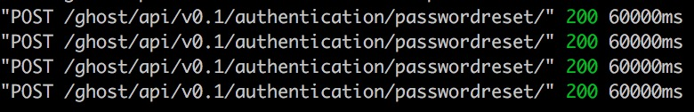
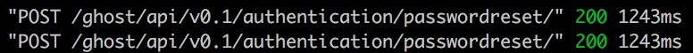

### Resultados EP1 - Quill

### Bitácora
1. Se intentó instalar el emulador de Android en un Macbook Pro. Sin embargo, después de varios intentos se procedió a usar un dispositivo viejo.
2. Se bajó la aplicación en el dispositivo y se instaló
3. La funcionalidad del dispositivo requiere un blog de Ghost funcional accesible desde internet, por lo que se instaló en https://blog.diegorbaquero.com
4. Tras instalarlo y configurarlo, la contraseña del admin fue olvidada, por lo que se intentó recuperar, pero ocurría un timeout en el proceso.
5. Se investigó el problema y se corrigió, cambiando la configuracióin de envío de correos a un SMTP propio.
6. Se corrió la aplicación con el blog previamente instalado y se exploró, tomando capturas de pantalla y buscando errores/fallas.

### Instalación blog

### Timeout recuperar contraseña

En la siguiente imagen se evidencia el timeout del Ghost al intentar recuperar la contraseña. Esto es output del comando `ghost log`:

En la siguiente imagen se evidencia la operación normal después de haber arreglado el problema:

### Fallas/defectos encontrados
- El blog de Ghost instalado hacía timeout al intentar recuperar la contraseña. Aunque esto no es un defecto de la app, es importante mencionarlo.
- En un celular pequeño, como lo es el Huawei Y330, se muy fácil hacer *log out* de Quill por error.
