# Reporte Pruebas Cruzadas 1

Este reporte contiene las pruebas cruzadas del grupo 9 (José Miguel Suarez y Camilo Escobar Velásquez). 

## Consideraciones
Teniendo en cuenta el presupuesto de ingenieros (1), de las [tres aplicaciones](https://gitlab.com/MISO4208/Bitacora/wikis/Selecci%C3%B3n-Aplicaciones) seleccionadas, se harán pruebas cruzadas sobre dos de esas: [Tell Form](https://www.tellform.com/) ([GitHub](https://github.com/tellform/tellform)) y [Mileage](https://f-droid.org/packages/com.evancharlton.mileage/) ([GitHub](https://github.com/evancharlton/android-mileage)).

## Instrucciones pruebas cruzadas
No se encontraron las instrucciones para pruebas cruzadas en [Repositorio](https://gitlab.com/MISO4208/) o [Wiki](https://gitlab.com/MISO4208/Bitacora/wikis/home)

## Pruebas cruzadas Tell Form
Para la instalación local de Tell Form era necesario tener Docker. Por lo que se instaló con Homebrew. Una vez instalado la aplicación, se corrió y quedó en la barra, esta instaló el CLI en la primera ejecución.

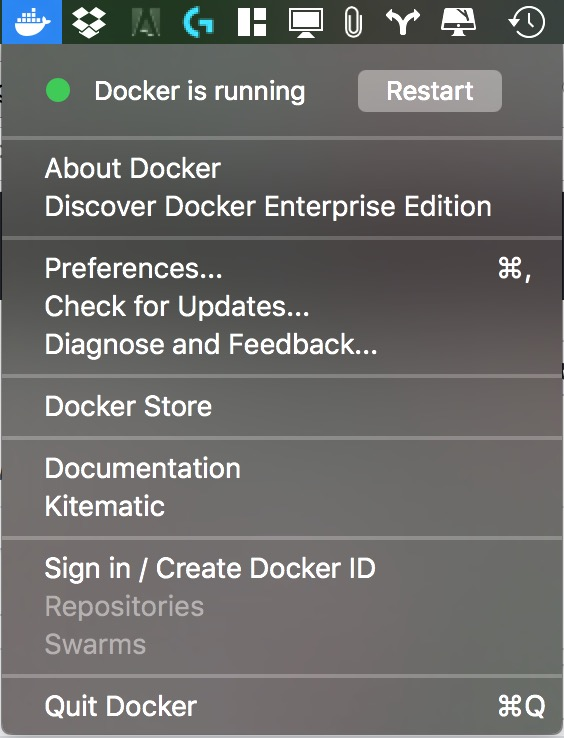

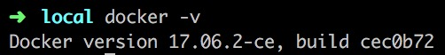

Siguiendo las [intrucciones en la página de TellForm sobre la instalación con Docker](https://www.tellform.com/install_docker), se instaló MongoDB, Redis y Tell Form:

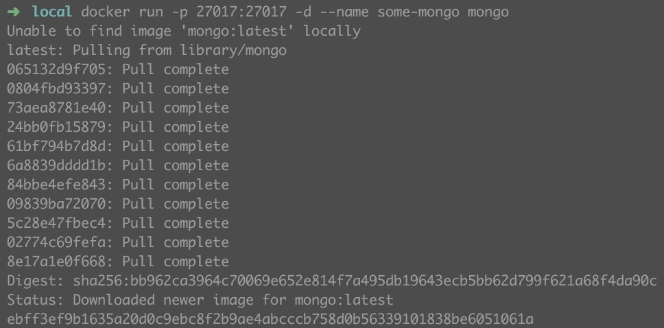

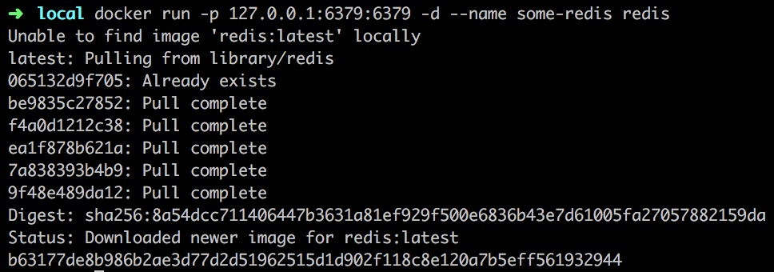

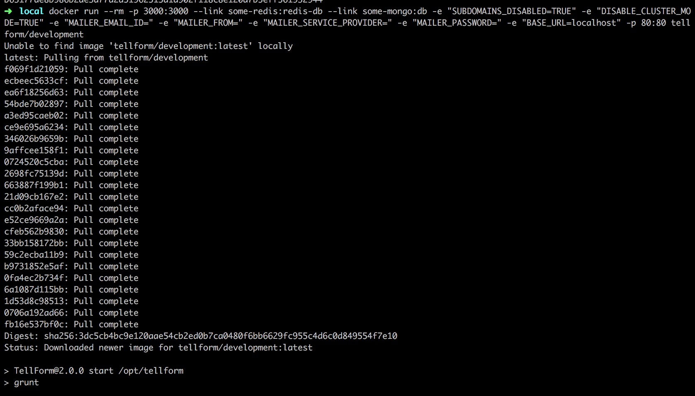
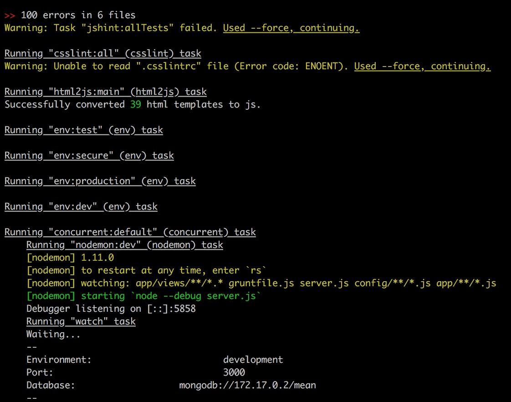

Screen inicial:

Con un correo "xxxx@" se hace validación en el cliente:
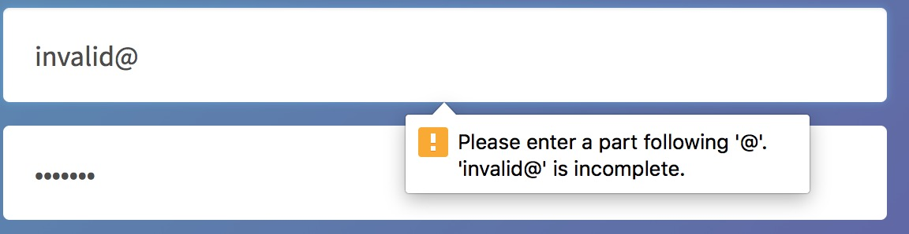
Pero si se agrega un dominio sin extensión se realiza validación en backend:
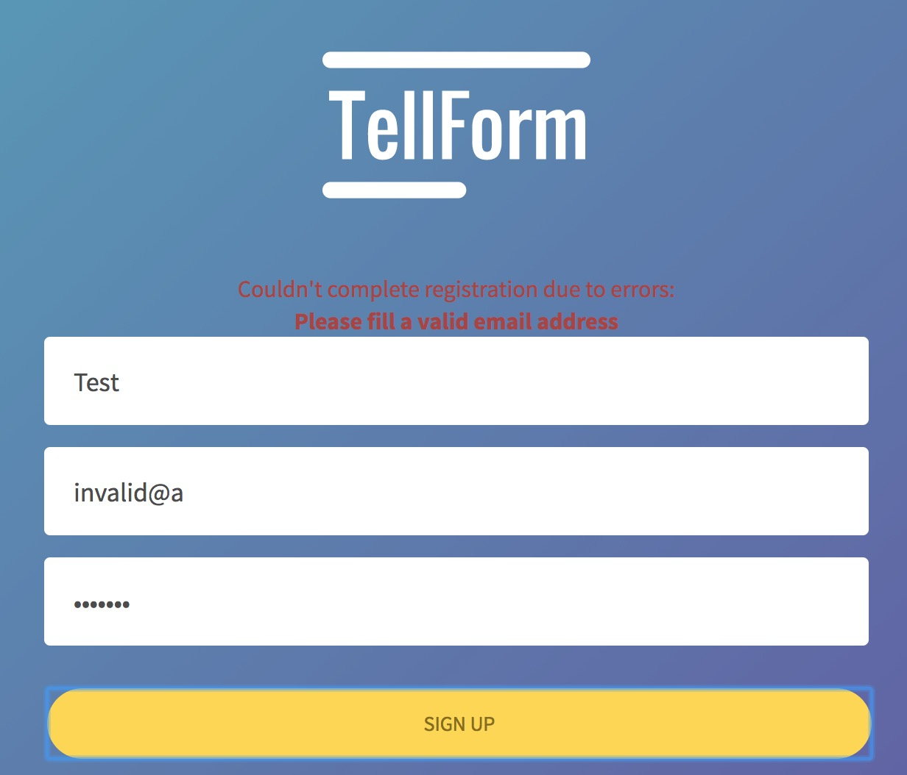

**Es importante aclarar que se utilizó de usuario "test", el correo test@diegorbaquero.com y la contraseña "a", por lo que no puso problema**

El link de validación no tiene el puerto:
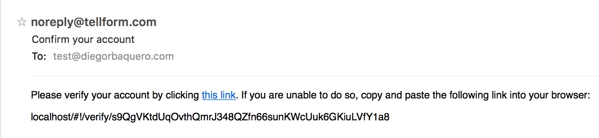
Por lo que ocurre este error
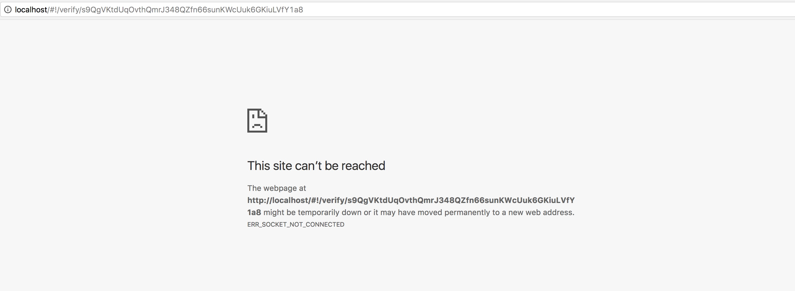
Al agregar el puerto:
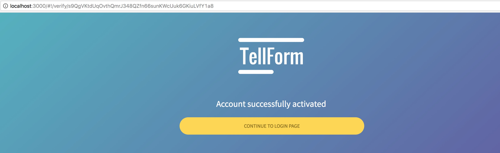

Al intentar hacer login con correo y contraseña ("a"):
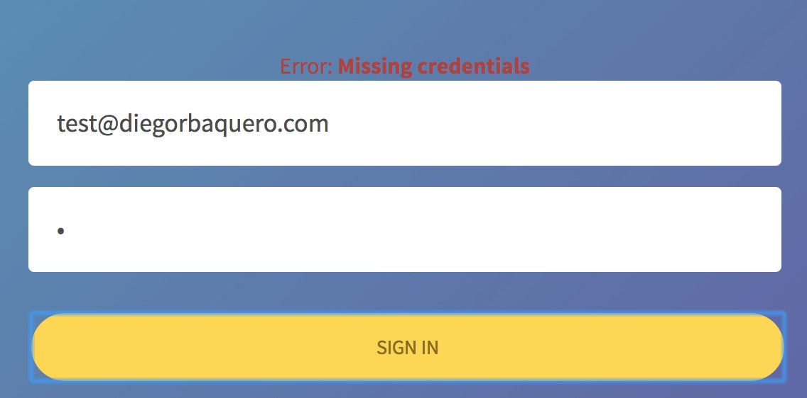

**Se creó otra cuenta con usuario diego, diego@diegorbaquero.com y contraseña "hola"**

Al intentar visualizar una encuesta se utiliza el dominio "diego.local", por lo que no funciona:
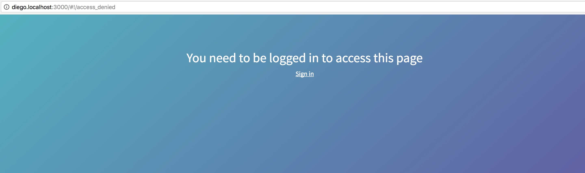
Sin embargo, se marca como si ya hubiera una respuesta:
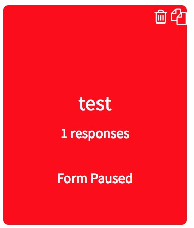
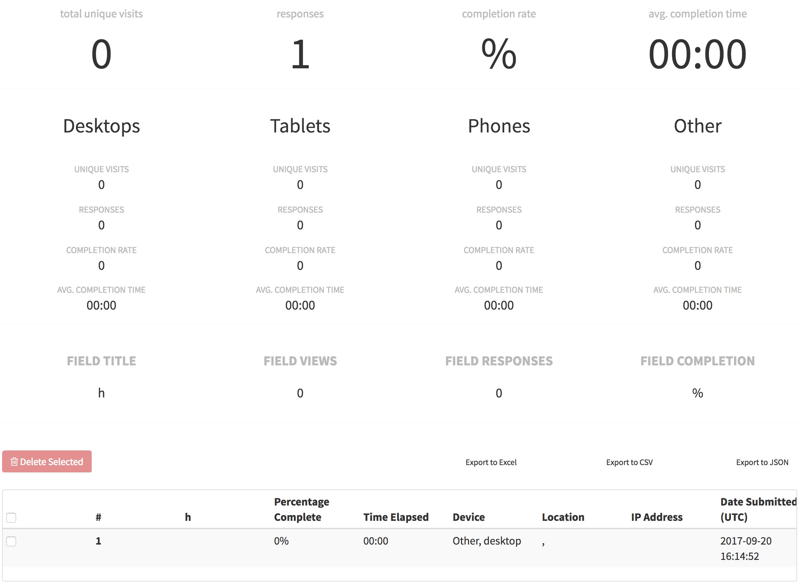

El link de compartir está mal en todas partes:
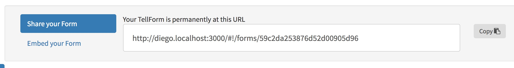

Se puede seleccionar ambas opciones en un un option button:
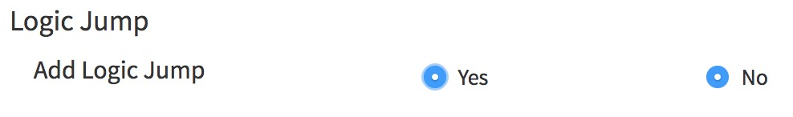

Hay varios errores que se ven desde consola:
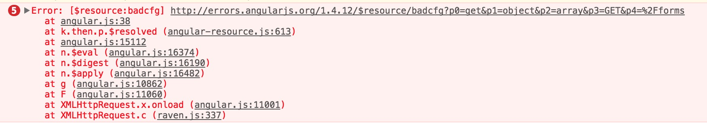
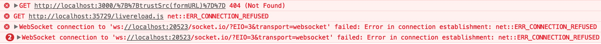

No guarda, no se muestra mensaje de error, se ve un 500 en Dev Tools con las rutas completas de los archivos:
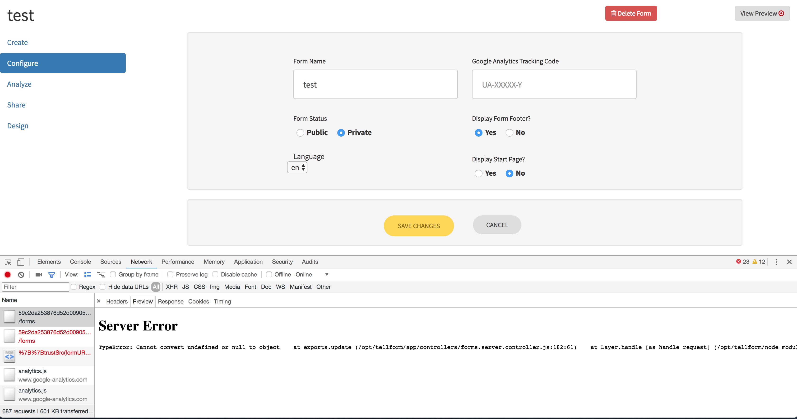
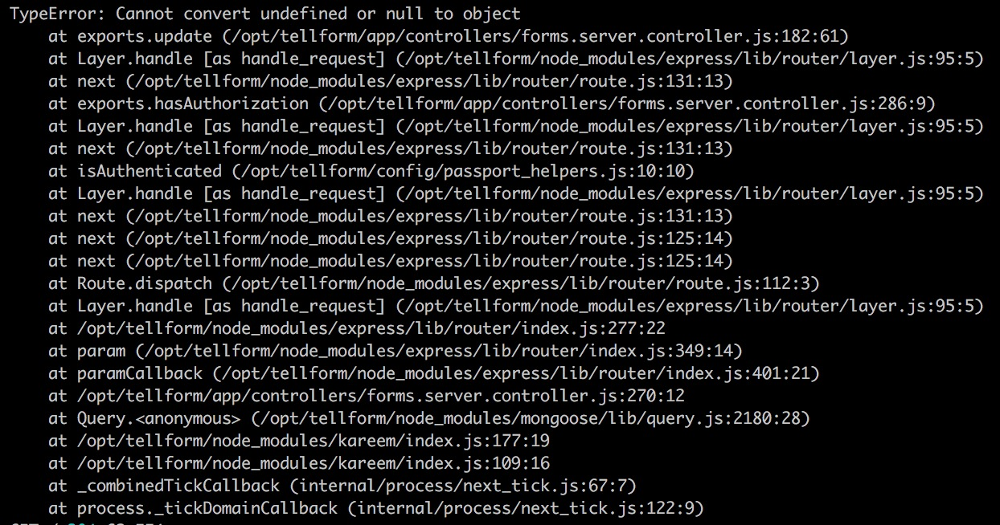

Permitió cambiar el usuario a esta cadena:
`diegorbaquerohola123queesestohahahahahaadsoifoasasdkfhasdfasdgsdfgsdfgasdfghgfdsasdfgfdsasdfghgfdsasdfgfdsasdfghgfdsasdfghgfdsasdfghgfdsasdfghgfdsasdfghjhgfdsasdfghgfdsadiegorbaquerohola123queesestohahahahahaadsoifoasasdkfhasdfasdgsdfgsdfgasdfghgfdsasdfgfdsasdfghgfdsasdfgfdsasdfghgfdsasdfghgfdsasdfghgfdsasdfghgfdsasdfghjhgfdsasdfghgfdsadiegorbaquerohola123queesestohahahahahaadsoifoasasdkfhasdfasdgsdfgsdfgasdfghgfdsasdfgfdsasdfghgfdsasdfgfdsasdfghgfdsasdfghgfdsasdfghgfdsasdfghgfdsasdfghjhgfdsasdfghgfdsa`
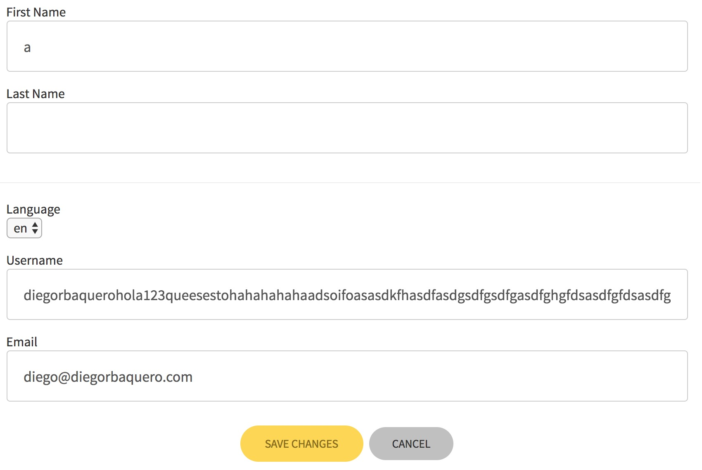

Permitió poner una contraseña de 1 caracter:
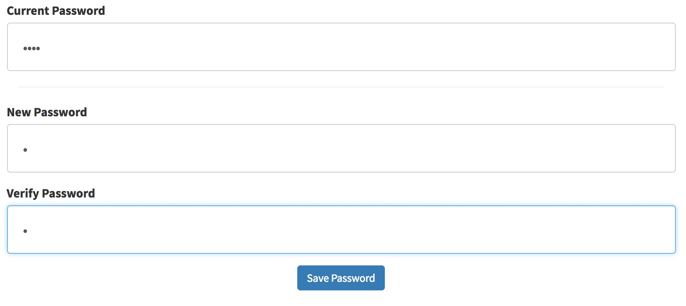

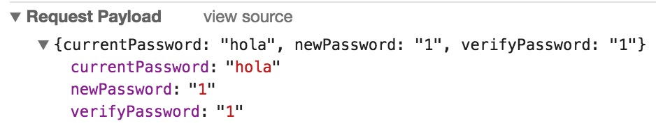
Y luego no permita hacer login:
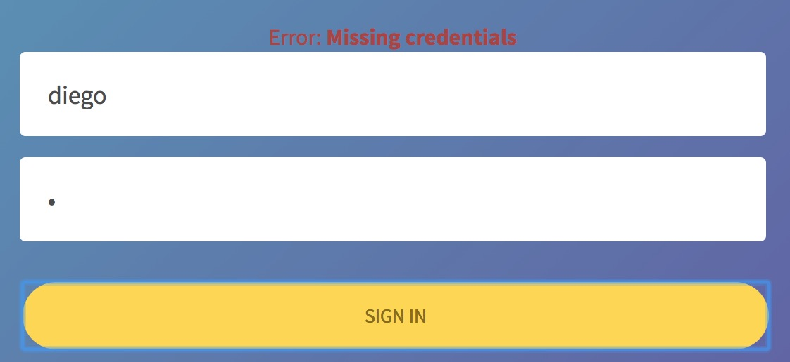

Al hacer restore con un usuario no existe y luego uno sí existente, no se borra el anterior mensaje de error:
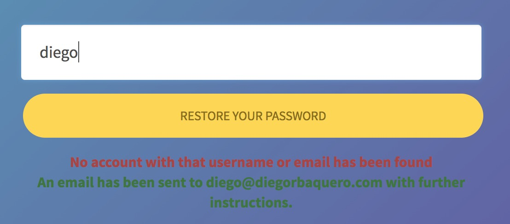

## Pruebas cruzadas Mileage

## Conclusiones/Discusión
- Tell Form tiene bastantes errores que podría mejorar. Está usando una versión vieja de angular (1.4). Permitir campos muy grandes da paso a un ataque donde se llene la base de datos. Si aceptan una contraseña tan corta (que no deberián), deberían aceptarla para hacer login; aunque realmente deberían pedir una longitud mínima. Los errores se muestran completos en la respuesta (Aunque puede ser porque es un ambiente dev)
