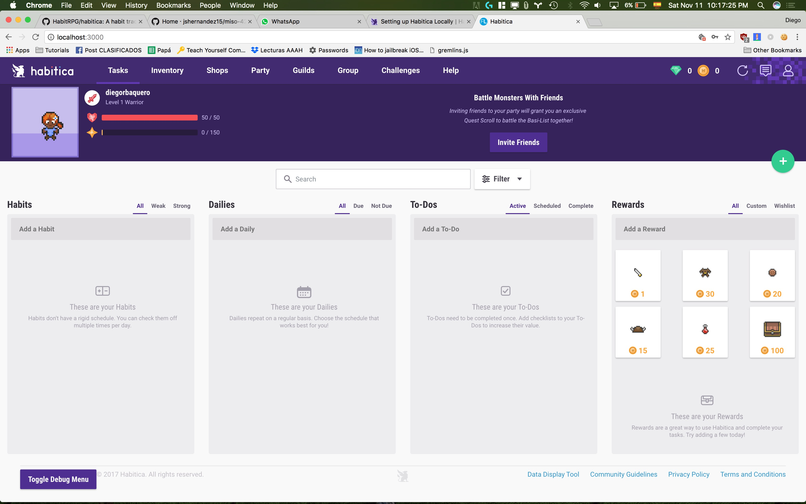
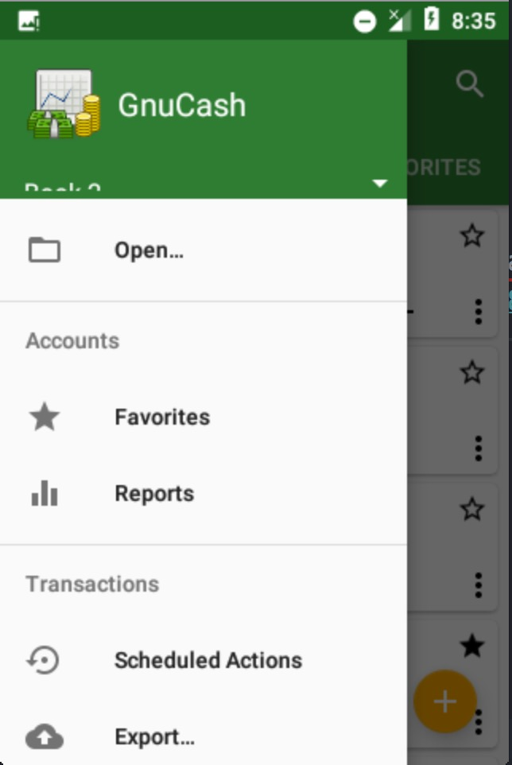

# Reporte Pruebas Cruzadas 2

Este reporte contiene las pruebas cruzadas del grupo 9 (José Miguel Suarez y Camilo Escobar Velásquez).

## Consideraciones
Teniendo en cuenta el presupuesto de personal (1), de las [tres aplicaciones](https://github.com/jshernandez15/miso-4208) seleccionadas, se harán pruebas cruzadas sobre dos de esas: [Habitica](https://habitica.com/) ([GitHub](https://github.com/HabitRPG/habitica)) y [GNU Cash](https://play.google.com/store/apps/details?id=org.gnucash.android&hl=es) ([GitHub](https://github.com/codinguser/gnucash-android)).

## Presupuesto
- Macbook Pro
- Android SDK y demás
- 6 horas

## Instrucciones pruebas cruzadas
No se encontraron las instrucciones para pruebas cruzadas en [Repositorio](https://github.com/jshernandez15/miso-4208) o [Wiki](https://github.com/jshernandez15/miso-4208/wiki)

## Pruebas cruzadas Habitica

Se instaló Habitica siguiente la instrucciones de http://habitica.wikia.com/wiki/Setting_up_Habitica_Locally. Se configuró una cuenta:




Se utilizó el [bookmarklet de gremlins.js](http://habitica.wikia.com/wiki/Setting_up_Habitica_Locally) para correr gremlin.js por 1 hora. No hubo ningún tipo de error/crash

Se corrió el suite de pruebas de Habitica:

<details>
 <summary>Ver más</summary>
 ➜  habitica git:(develop) ✗ npm test

> habitica@4.10.0 test /Users/diego/Universidad/2017-2/Pruebas Automáticas/Bitacora-Pruebas-Automaticas/PC2/habitica
> npm run lint && gulp test && gulp apidoc


> habitica@4.10.0 lint /Users/diego/Universidad/2017-2/Pruebas Automáticas/Bitacora-Pruebas-Automaticas/PC2/habitica
> eslint --ext .js,.vue .


/Users/diego/Universidad/2017-2/Pruebas Automáticas/Bitacora-Pruebas-Automaticas/PC2/habitica/test/api/v3/integration/dataexport/GET-export_avatar-memberId.html.test.js
  7:1  warning  Unexpected skipped mocha test  mocha/no-skipped-tests

/Users/diego/Universidad/2017-2/Pruebas Automáticas/Bitacora-Pruebas-Automaticas/PC2/habitica/test/api/v3/integration/dataexport/GET-export_history.csv.test.js
  11:3  warning  Unexpected skipped mocha test  mocha/no-skipped-tests

/Users/diego/Universidad/2017-2/Pruebas Automáticas/Bitacora-Pruebas-Automaticas/PC2/habitica/test/api/v3/integration/dataexport/GET-export_userdata.xml.test.js
  11:3  warning  Unexpected skipped mocha test  mocha/no-skipped-tests

/Users/diego/Universidad/2017-2/Pruebas Automáticas/Bitacora-Pruebas-Automaticas/PC2/habitica/test/api/v3/integration/groups/POST-groups_groupId_leave.js
  130:7  warning  Unexpected pending mocha test  mocha/no-pending-tests
  131:7  warning  Unexpected pending mocha test  mocha/no-pending-tests

/Users/diego/Universidad/2017-2/Pruebas Automáticas/Bitacora-Pruebas-Automaticas/PC2/habitica/test/api/v3/integration/groups/POST-groups_invite.test.js
  368:5  warning  Unexpected skipped mocha test  mocha/no-skipped-tests

/Users/diego/Universidad/2017-2/Pruebas Automáticas/Bitacora-Pruebas-Automaticas/PC2/habitica/test/api/v3/integration/payments/paypal/GET-payments_paypal_subscribe_success.test.js
  23:3  warning  Unexpected skipped mocha test  mocha/no-skipped-tests

/Users/diego/Universidad/2017-2/Pruebas Automáticas/Bitacora-Pruebas-Automaticas/PC2/habitica/test/api/v3/integration/qrcodes/GET-qrcodes_user.test.js
  9:1  warning  Unexpected skipped mocha test  mocha/no-skipped-tests

/Users/diego/Universidad/2017-2/Pruebas Automáticas/Bitacora-Pruebas-Automaticas/PC2/habitica/test/api/v3/integration/tags/GET-tags_id.test.js
  19:3  warning  Unexpected pending mocha test  mocha/no-pending-tests

/Users/diego/Universidad/2017-2/Pruebas Automáticas/Bitacora-Pruebas-Automaticas/PC2/habitica/test/api/v3/integration/tasks/challenges/DELETE-tasks_id_challenge_challengeId.test.js
  99:5  warning  Unexpected skipped mocha test  mocha/no-skipped-tests

/Users/diego/Universidad/2017-2/Pruebas Automáticas/Bitacora-Pruebas-Automaticas/PC2/habitica/test/api/v3/integration/tasks/GET-tasks_id.test.js
  38:5  warning  Unexpected pending mocha test  mocha/no-pending-tests

/Users/diego/Universidad/2017-2/Pruebas Automáticas/Bitacora-Pruebas-Automaticas/PC2/habitica/test/api/v3/integration/tasks/GET-tasks_user.test.js
  155:3  warning  Unexpected skipped mocha test  mocha/no-skipped-tests
  182:3  warning  Unexpected skipped mocha test  mocha/no-skipped-tests
  208:3  warning  Unexpected skipped mocha test  mocha/no-skipped-tests

/Users/diego/Universidad/2017-2/Pruebas Automáticas/Bitacora-Pruebas-Automaticas/PC2/habitica/test/api/v3/integration/tasks/groups/tags/DELETE-group_tasks_taskId_tags_tagId.test.js
  7:1  warning  Unexpected skipped mocha test  mocha/no-skipped-tests

/Users/diego/Universidad/2017-2/Pruebas Automáticas/Bitacora-Pruebas-Automaticas/PC2/habitica/test/api/v3/integration/tasks/groups/tags/POST-tasks_taskId_tags.test.js
  7:1  warning  Unexpected skipped mocha test  mocha/no-skipped-tests

/Users/diego/Universidad/2017-2/Pruebas Automáticas/Bitacora-Pruebas-Automaticas/PC2/habitica/test/api/v3/integration/tasks/POST-tasks_id_score_direction.test.js
  140:5  warning  Unexpected pending mocha test  mocha/no-pending-tests
  142:5  warning  Unexpected pending mocha test  mocha/no-pending-tests
  225:5  warning  Unexpected pending mocha test  mocha/no-pending-tests
  227:5  warning  Unexpected pending mocha test  mocha/no-pending-tests
  301:5  warning  Unexpected pending mocha test  mocha/no-pending-tests
  303:5  warning  Unexpected pending mocha test  mocha/no-pending-tests

/Users/diego/Universidad/2017-2/Pruebas Automáticas/Bitacora-Pruebas-Automaticas/PC2/habitica/test/api/v3/integration/user/auth/GET-auth_reset-password-set-new-one.js
  14:1  warning  Unexpected skipped mocha test  mocha/no-skipped-tests

/Users/diego/Universidad/2017-2/Pruebas Automáticas/Bitacora-Pruebas-Automaticas/PC2/habitica/test/api/v3/integration/user/auth/POST-register_local.test.js
  76:7  warning  Unexpected skipped mocha test  mocha/no-skipped-tests

/Users/diego/Universidad/2017-2/Pruebas Automáticas/Bitacora-Pruebas-Automaticas/PC2/habitica/test/api/v3/integration/user/buy/POST-user_buy_armoire.test.js
  38:3  warning  Unexpected skipped mocha test  mocha/no-skipped-tests

/Users/diego/Universidad/2017-2/Pruebas Automáticas/Bitacora-Pruebas-Automaticas/PC2/habitica/test/api/v3/integration/user/POST-user_class_cast_spellId.test.js
  247:3  warning  Unexpected pending mocha test  mocha/no-pending-tests
  248:3  warning  Unexpected pending mocha test  mocha/no-pending-tests
  249:3  warning  Unexpected pending mocha test  mocha/no-pending-tests
  250:3  warning  Unexpected pending mocha test  mocha/no-pending-tests
  251:3  warning  Unexpected pending mocha test  mocha/no-pending-tests
  252:3  warning  Unexpected pending mocha test  mocha/no-pending-tests
  253:3  warning  Unexpected pending mocha test  mocha/no-pending-tests

/Users/diego/Universidad/2017-2/Pruebas Automáticas/Bitacora-Pruebas-Automaticas/PC2/habitica/test/api/v3/unit/libs/cron.test.js
   258:5  warning  Unexpected skipped mocha test  mocha/no-skipped-tests
  1107:5  warning  Unexpected skipped mocha test  mocha/no-skipped-tests
  1112:5  warning  Unexpected skipped mocha test  mocha/no-skipped-tests

/Users/diego/Universidad/2017-2/Pruebas Automáticas/Bitacora-Pruebas-Automaticas/PC2/habitica/test/api/v3/unit/libs/payments/group-plans/group-payments-create.test.js
  513:3  warning  Unexpected pending mocha test  mocha/no-pending-tests
  514:3  warning  Unexpected pending mocha test  mocha/no-pending-tests

/Users/diego/Universidad/2017-2/Pruebas Automáticas/Bitacora-Pruebas-Automaticas/PC2/habitica/test/api/v3/unit/libs/pushNotifications.js
  90:3  warning  Unexpected skipped mocha test  mocha/no-skipped-tests

/Users/diego/Universidad/2017-2/Pruebas Automáticas/Bitacora-Pruebas-Automaticas/PC2/habitica/test/client/unit/specs/store/actions/tasks.js
  12:5  warning  Unexpected skipped mocha test  mocha/no-skipped-tests
  39:5  warning  Unexpected skipped mocha test  mocha/no-skipped-tests

/Users/diego/Universidad/2017-2/Pruebas Automáticas/Bitacora-Pruebas-Automaticas/PC2/habitica/test/common/count.js
  131:8  warning  Unexpected skipped mocha test  mocha/no-skipped-tests

/Users/diego/Universidad/2017-2/Pruebas Automáticas/Bitacora-Pruebas-Automaticas/PC2/habitica/test/common/fns/updateStats.test.js
  171:5  warning  Unexpected skipped mocha test  mocha/no-skipped-tests

/Users/diego/Universidad/2017-2/Pruebas Automáticas/Bitacora-Pruebas-Automaticas/PC2/habitica/test/common/libs/taskClasses.test.js
  41:5  warning  Unexpected pending mocha test  mocha/no-pending-tests

/Users/diego/Universidad/2017-2/Pruebas Automáticas/Bitacora-Pruebas-Automaticas/PC2/habitica/test/common/ops/buy/buyGear.js
  100:5  warning  Unexpected skipped mocha test  mocha/no-skipped-tests
  115:5  warning  Unexpected skipped mocha test  mocha/no-skipped-tests

/Users/diego/Universidad/2017-2/Pruebas Automáticas/Bitacora-Pruebas-Automaticas/PC2/habitica/test/common/ops/unlock.js
  58:3  warning  Unexpected skipped mocha test  mocha/no-skipped-tests

✖ 46 problems (0 errors, 46 warnings)

[22:25:57] Using gulpfile ~/Universidad/2017-2/Pruebas Automáticas/Bitacora-Pruebas-Automaticas/PC2/habitica/gulpfile.js
[22:25:57] Starting 'test'...
[22:25:57] Starting 'test:sanity'...

> habitica@4.10.0 test:sanity /Users/diego/Universidad/2017-2/Pruebas Automáticas/Bitacora-Pruebas-Automaticas/PC2/habitica
> istanbul cover --dir coverage/sanity --report lcovonly node_modules/mocha/bin/_mocha -- test/sanity --recursive


  Locales files
    ✓ do not contain duplicates of any keys (62ms)

  Use Proper Babel Paths
    ✓ uses proper babel files in website/server


  2 passing (201ms)

No coverage information was collected, exit without writing coverage information
[22:26:00] Finished 'test:sanity' after 3.08 s
[22:26:00] Starting 'build'...
[22:26:00] Finished 'build' after 71 μs
[22:26:00] Starting 'test:prepare:build'...
[22:26:00] Finished 'test:prepare:build' after 31 μs
[22:26:00] Starting 'test:content'...

> habitica@4.10.0 test:content /Users/diego/Universidad/2017-2/Pruebas Automáticas/Bitacora-Pruebas-Automaticas/PC2/habitica
> istanbul cover --dir coverage/content --report lcovonly node_modules/mocha/bin/_mocha -- test/content --recursive

2017-11-12T03:26:17.495Z - error: Error: Slack url is required
    at new IncomingWebhook (/Users/diego/Universidad/2017-2/Pruebas Automáticas/Bitacora-Pruebas-Automaticas/PC2/habitica/node_modules/@slack/client/lib/clients/incoming-webhook/client.js:25:11)
    at Object.<anonymous> (/Users/diego/Universidad/2017-2/Pruebas Automáticas/Bitacora-Pruebas-Automaticas/PC2/habitica/website/server/libs/slack.js:1:9613)
    at Module._compile (module.js:635:30)
    at Module.replacementCompile (/Users/diego/Universidad/2017-2/Pruebas Automáticas/Bitacora-Pruebas-Automaticas/PC2/habitica/node_modules/append-transform/index.js:58:13)
    at loader (/Users/diego/Universidad/2017-2/Pruebas Automáticas/Bitacora-Pruebas-Automaticas/PC2/habitica/node_modules/babel-register/lib/node.js:144:5)
    at require.extensions.(anonymous function) (/Users/diego/Universidad/2017-2/Pruebas Automáticas/Bitacora-Pruebas-Automaticas/PC2/habitica/node_modules/babel-register/lib/node.js:154:7)
    at Object.<anonymous> (/Users/diego/Universidad/2017-2/Pruebas Automáticas/Bitacora-Pruebas-Automaticas/PC2/habitica/node_modules/append-transform/index.js:62:4)
    at Module.load (module.js:554:32)
    at tryModuleLoad (module.js:497:12)
    at Function.Module._load (module.js:489:3)
    at Module.require (module.js:579:17)
    at require (internal/module.js:11:18)
    at Object.<anonymous> (/Users/diego/Universidad/2017-2/Pruebas Automáticas/Bitacora-Pruebas-Automaticas/PC2/habitica/website/server/libs/payments.js:1:53766)
    at Module._compile (module.js:635:30)
    at Module.replacementCompile (/Users/diego/Universidad/2017-2/Pruebas Automáticas/Bitacora-Pruebas-Automaticas/PC2/habitica/node_modules/append-transform/index.js:58:13)
    at loader (/Users/diego/Universidad/2017-2/Pruebas Automáticas/Bitacora-Pruebas-Automaticas/PC2/habitica/node_modules/babel-register/lib/node.js:144:5)
    at require.extensions.(anonymous function) (/Users/diego/Universidad/2017-2/Pruebas Automáticas/Bitacora-Pruebas-Automaticas/PC2/habitica/node_modules/babel-register/lib/node.js:154:7)
    at Object.<anonymous> (/Users/diego/Universidad/2017-2/Pruebas Automáticas/Bitacora-Pruebas-Automaticas/PC2/habitica/node_modules/append-transform/index.js:62:4)
    at Module.load (module.js:554:32)
    at tryModuleLoad (module.js:497:12)
    at Function.Module._load (module.js:489:3)
    at Module.require (module.js:579:17)
    at require (internal/module.js:11:18)
    at Object.<anonymous> (/Users/diego/Universidad/2017-2/Pruebas Automáticas/Bitacora-Pruebas-Automaticas/PC2/habitica/website/server/models/group.js:3:1077)
    at Module._compile (module.js:635:30)
    at Module.replacementCompile (/Users/diego/Universidad/2017-2/Pruebas Automáticas/Bitacora-Pruebas-Automaticas/PC2/habitica/node_modules/append-transform/index.js:58:13)
    at loader (/Users/diego/Universidad/2017-2/Pruebas Automáticas/Bitacora-Pruebas-Automaticas/PC2/habitica/node_modules/babel-register/lib/node.js:144:5)
    at require.extensions.(anonymous function) (/Users/diego/Universidad/2017-2/Pruebas Automáticas/Bitacora-Pruebas-Automaticas/PC2/habitica/node_modules/babel-register/lib/node.js:154:7)
    at Object.<anonymous> (/Users/diego/Universidad/2017-2/Pruebas Automáticas/Bitacora-Pruebas-Automaticas/PC2/habitica/node_modules/append-transform/index.js:62:4)
    at Module.load (module.js:554:32)
    at tryModuleLoad (module.js:497:12)
    at Function.Module._load (module.js:489:3)
    at Module.require (module.js:579:17)
    at require (internal/module.js:11:18)
    at Object.<anonymous> (/Users/diego/Universidad/2017-2/Pruebas Automáticas/Bitacora-Pruebas-Automaticas/PC2/habitica/website/server/models/user/methods.js:1:27861)
    at Module._compile (module.js:635:30)
    at Module.replacementCompile (/Users/diego/Universidad/2017-2/Pruebas Automáticas/Bitacora-Pruebas-Automaticas/PC2/habitica/node_modules/append-transform/index.js:58:13)
    at loader (/Users/diego/Universidad/2017-2/Pruebas Automáticas/Bitacora-Pruebas-Automaticas/PC2/habitica/node_modules/babel-register/lib/node.js:144:5)
    at require.extensions.(anonymous function) (/Users/diego/Universidad/2017-2/Pruebas Automáticas/Bitacora-Pruebas-Automaticas/PC2/habitica/node_modules/babel-register/lib/node.js:154:7)
    at Object.<anonymous> (/Users/diego/Universidad/2017-2/Pruebas Automáticas/Bitacora-Pruebas-Automaticas/PC2/habitica/node_modules/append-transform/index.js:62:4)
    at Module.load (module.js:554:32)
    at tryModuleLoad (module.js:497:12)
    at Function.Module._load (module.js:489:3)
    at Module.require (module.js:579:17)
    at require (internal/module.js:11:18)
    at Object.<anonymous> (/Users/diego/Universidad/2017-2/Pruebas Automáticas/Bitacora-Pruebas-Automaticas/PC2/habitica/website/server/models/user/index.js:1:4240)
    at Module._compile (module.js:635:30)
    at Module.replacementCompile (/Users/diego/Universidad/2017-2/Pruebas Automáticas/Bitacora-Pruebas-Automaticas/PC2/habitica/node_modules/append-transform/index.js:58:13)
    at loader (/Users/diego/Universidad/2017-2/Pruebas Automáticas/Bitacora-Pruebas-Automaticas/PC2/habitica/node_modules/babel-register/lib/node.js:144:5)
    at require.extensions.(anonymous function) (/Users/diego/Universidad/2017-2/Pruebas Automáticas/Bitacora-Pruebas-Automaticas/PC2/habitica/node_modules/babel-register/lib/node.js:154:7)
    at Object.<anonymous> (/Users/diego/Universidad/2017-2/Pruebas Automáticas/Bitacora-Pruebas-Automaticas/PC2/habitica/node_modules/append-transform/index.js:62:4)
    at Module.load (module.js:554:32)
    at tryModuleLoad (module.js:497:12)
    at Function.Module._load (module.js:489:3)
    at Module.require (module.js:579:17)
    at require (internal/module.js:11:18)
    at Object.<anonymous> (/Users/diego/Universidad/2017-2/Pruebas Automáticas/Bitacora-Pruebas-Automaticas/PC2/habitica/test/helpers/common.helper.js:4:1)
    at Module._compile (module.js:635:30)
    at Module.replacementCompile (/Users/diego/Universidad/2017-2/Pruebas Automáticas/Bitacora-Pruebas-Automaticas/PC2/habitica/node_modules/append-transform/index.js:58:13)
    at loader (/Users/diego/Universidad/2017-2/Pruebas Automáticas/Bitacora-Pruebas-Automaticas/PC2/habitica/node_modules/babel-register/lib/node.js:144:5)
    at require.extensions.(anonymous function) (/Users/diego/Universidad/2017-2/Pruebas Automáticas/Bitacora-Pruebas-Automaticas/PC2/habitica/node_modules/babel-register/lib/node.js:154:7)
    at Object.<anonymous> (/Users/diego/Universidad/2017-2/Pruebas Automáticas/Bitacora-Pruebas-Automaticas/PC2/habitica/node_modules/append-transform/index.js:62:4)
    at Module.load (module.js:554:32)
    at tryModuleLoad (module.js:497:12)
    at Function.Module._load (module.js:489:3)
    at Module.require (module.js:579:17)
    at require (internal/module.js:11:18)
    at Object.<anonymous> (/Users/diego/Universidad/2017-2/Pruebas Automáticas/Bitacora-Pruebas-Automaticas/PC2/habitica/test/content/time-travelers.test.js:1:1)
    at Module._compile (module.js:635:30)
    at Module.replacementCompile (/Users/diego/Universidad/2017-2/Pruebas Automáticas/Bitacora-Pruebas-Automaticas/PC2/habitica/node_modules/append-transform/index.js:58:13)
    at loader (/Users/diego/Universidad/2017-2/Pruebas Automáticas/Bitacora-Pruebas-Automaticas/PC2/habitica/node_modules/babel-register/lib/node.js:144:5)
    at require.extensions.(anonymous function) (/Users/diego/Universidad/2017-2/Pruebas Automáticas/Bitacora-Pruebas-Automaticas/PC2/habitica/node_modules/babel-register/lib/node.js:154:7)
    at Object.<anonymous> (/Users/diego/Universidad/2017-2/Pruebas Automáticas/Bitacora-Pruebas-Automaticas/PC2/habitica/node_modules/append-transform/index.js:62:4)
    at Module.load (module.js:554:32)
    at tryModuleLoad (module.js:497:12)
    at Function.Module._load (module.js:489:3)
    at Module.require (module.js:579:17)
    at require (internal/module.js:11:18)
    at /Users/diego/Universidad/2017-2/Pruebas Automáticas/Bitacora-Pruebas-Automaticas/PC2/habitica/node_modules/mocha/lib/mocha.js:231:27
    at Array.forEach (<anonymous>)

  eggs

    at Mocha.loadFiles (/Users/diego/Universidad/2017-2/Pruebas Automáticas/Bitacora-Pruebas-Automaticas/PC2/habitica/node_modules/mocha/lib/mocha.js:228:14)
    at Mocha.run (/Users/diego/Universidad/2017-2/Pruebas Automáticas/Bitacora-Pruebas-Automaticas/PC2/habitica/node_modules/mocha/lib/mocha.js:514:10)
    at Object.<anonymous> (/Users/diego/Universidad/2017-2/Pruebas Automáticas/Bitacora-Pruebas-Automaticas/PC2/habitica/node_modules/mocha/bin/_mocha:480:18)
    at Module._compile (module.js:635:30)
    at Module.replacementCompile (/Users/diego/Universidad/2017-2/Pruebas Automáticas/Bitacora-Pruebas-Automaticas/PC2/habitica/node_modules/append-transform/index.js:58:13)
    at Module._extensions..js (module.js:646:10)
    at Object.<anonymous> (/Users/diego/Universidad/2017-2/Pruebas Automáticas/Bitacora-Pruebas-Automaticas/PC2/habitica/node_modules/append-transform/index.js:62:4)
    at Module.load (module.js:554:32)
    at tryModuleLoad (module.js:497:12)
    at Function.Module._load (module.js:489:3)
    at Function.Module.runMain (module.js:676:10)
    at runFn (/Users/diego/Universidad/2017-2/Pruebas Automáticas/Bitacora-Pruebas-Automaticas/PC2/habitica/node_modules/istanbul/lib/command/cover.js:126:16)
    at /Users/diego/Universidad/2017-2/Pruebas Automáticas/Bitacora-Pruebas-Automaticas/PC2/habitica/node_modules/istanbul/lib/command/cover.js:146:9
    at /Users/diego/Universidad/2017-2/Pruebas Automáticas/Bitacora-Pruebas-Automaticas/PC2/habitica/node_modules/istanbul-api/lib/run-cover.js:197:16
    at /Users/diego/Universidad/2017-2/Pruebas Automáticas/Bitacora-Pruebas-Automaticas/PC2/habitica/node_modules/istanbul-api/lib/file-matcher.js:69:16
    at /Users/diego/Universidad/2017-2/Pruebas Automáticas/Bitacora-Pruebas-Automaticas/PC2/habitica/node_modules/istanbul-api/node_modules/async/dist/async.js:1126:9
    at /Users/diego/Universidad/2017-2/Pruebas Automáticas/Bitacora-Pruebas-Automaticas/PC2/habitica/node_modules/istanbul-api/node_modules/async/dist/async.js:473:16
    at iteratorCallback (/Users/diego/Universidad/2017-2/Pruebas Automáticas/Bitacora-Pruebas-Automaticas/PC2/habitica/node_modules/istanbul-api/node_modules/async/dist/async.js:1050:13)
    at /Users/diego/Universidad/2017-2/Pruebas Automáticas/Bitacora-Pruebas-Automaticas/PC2/habitica/node_modules/istanbul-api/node_modules/async/dist/async.js:958:16
    at /Users/diego/Universidad/2017-2/Pruebas Automáticas/Bitacora-Pruebas-Automaticas/PC2/habitica/node_modules/istanbul-api/node_modules/async/dist/async.js:1123:13
    at LOOP (fs.js:1745:14)
    at _combinedTickCallback (internal/process/next_tick.js:131:7)
    at process._tickCallback (internal/process/next_tick.js:180:9)
{ fullError: {} }
(node:11082) DeprecationWarning: Mongoose: mpromise (mongoose's default promise library) is deprecated, plug in your own promise library instead: http://mongoosejs.com/docs/promises.html
    all
      ✓ is a combination of drop and quest eggs
      ✓ contains basic information about each egg (91ms)

  FAQ Locales
    Questions
      ✓ has a valid questions
      ✓ has a valid ios answers
      ✓ has a valid web answers
    Still Need Help Message
      ✓ has a valid ios message
      ✓ has a valid web message

  Gear
    weapon
      base weapons
        ✓ have a value of at least 0 for each stat
        ✓ have a purchase value of at least 0
        ✓ has a canBuy function
        ✓ have valid translation strings for text and notes
        ✓ has a set attribue
      warrior weapons
        ✓ have a value of at least 0 for each stat
        ✓ have a purchase value of at least 0
        ✓ has a canBuy function
        ✓ have valid translation strings for text and notes
        ✓ has a set attribue
      rogue weapons
        ✓ have a value of at least 0 for each stat
        ✓ have a purchase value of at least 0
        ✓ has a canBuy function
        ✓ have valid translation strings for text and notes
        ✓ has a set attribue
      wizard weapons
        ✓ have a value of at least 0 for each stat
        ✓ have a purchase value of at least 0
        ✓ has a canBuy function
        ✓ have valid translation strings for text and notes
        ✓ has a set attribue
      healer weapons
        ✓ have a value of at least 0 for each stat
        ✓ have a purchase value of at least 0
        ✓ has a canBuy function
        ✓ have valid translation strings for text and notes
        ✓ has a set attribue
      special weapons
        ✓ have a value of at least 0 for each stat
        ✓ have a purchase value of at least 0
        ✓ has a canBuy function
        ✓ have valid translation strings for text and notes (58ms)
        ✓ has a set attribue
      mystery weapons
        ✓ have a value of at least 0 for each stat
        ✓ have a purchase value of at least 0
        ✓ has a canBuy function
        ✓ have valid translation strings for text and notes
        ✓ has a set attribue
      armoire weapons
        ✓ have a value of at least 0 for each stat
        ✓ have a purchase value of at least 0
        ✓ has a canBuy function
        ✓ have valid translation strings for text and notes
        ✓ has a set attribue
    armor
      base armors
        ✓ have a value of at least 0 for each stat
        ✓ have a purchase value of at least 0
        ✓ has a canBuy function
        ✓ have valid translation strings for text and notes
        ✓ has a set attribue
      warrior armors
        ✓ have a value of at least 0 for each stat
        ✓ have a purchase value of at least 0
        ✓ has a canBuy function
        ✓ have valid translation strings for text and notes
        ✓ has a set attribue
      rogue armors
        ✓ have a value of at least 0 for each stat
        ✓ have a purchase value of at least 0
        ✓ has a canBuy function
        ✓ have valid translation strings for text and notes
        ✓ has a set attribue
      wizard armors
        ✓ have a value of at least 0 for each stat
        ✓ have a purchase value of at least 0
        ✓ has a canBuy function
        ✓ have valid translation strings for text and notes
        ✓ has a set attribue
      healer armors
        ✓ have a value of at least 0 for each stat
        ✓ have a purchase value of at least 0
        ✓ has a canBuy function
        ✓ have valid translation strings for text and notes
        ✓ has a set attribue
      special armors
        ✓ have a value of at least 0 for each stat
        ✓ have a purchase value of at least 0
        ✓ has a canBuy function
        ✓ have valid translation strings for text and notes (78ms)
        ✓ has a set attribue
      mystery armors
        ✓ have a value of at least 0 for each stat
        ✓ have a purchase value of at least 0
        ✓ has a canBuy function
        ✓ have valid translation strings for text and notes
        ✓ has a set attribue
      armoire armors
        ✓ have a value of at least 0 for each stat
        ✓ have a purchase value of at least 0
        ✓ has a canBuy function
        ✓ have valid translation strings for text and notes (41ms)
        ✓ has a set attribue
    head
      base heads
        ✓ have a value of at least 0 for each stat
        ✓ have a purchase value of at least 0
        ✓ has a canBuy function
        ✓ have valid translation strings for text and notes
        ✓ has a set attribue
      warrior heads
        ✓ have a value of at least 0 for each stat
        ✓ have a purchase value of at least 0
        ✓ has a canBuy function
        ✓ have valid translation strings for text and notes
        ✓ has a set attribue
      rogue heads
        ✓ have a value of at least 0 for each stat
        ✓ have a purchase value of at least 0
        ✓ has a canBuy function
        ✓ have valid translation strings for text and notes
        ✓ has a set attribue
      wizard heads
        ✓ have a value of at least 0 for each stat
        ✓ have a purchase value of at least 0
        ✓ has a canBuy function
        ✓ have valid translation strings for text and notes
        ✓ has a set attribue
      healer heads
        ✓ have a value of at least 0 for each stat
        ✓ have a purchase value of at least 0
        ✓ has a canBuy function
        ✓ have valid translation strings for text and notes
        ✓ has a set attribue
      special heads
        ✓ have a value of at least 0 for each stat
        ✓ have a purchase value of at least 0
        ✓ has a canBuy function
        ✓ have valid translation strings for text and notes (71ms)
        ✓ has a set attribue
      mystery heads
        ✓ have a value of at least 0 for each stat
        ✓ have a purchase value of at least 0
        ✓ has a canBuy function
        ✓ have valid translation strings for text and notes
        ✓ has a set attribue
      armoire heads
        ✓ have a value of at least 0 for each stat
        ✓ have a purchase value of at least 0
        ✓ has a canBuy function
        ✓ have valid translation strings for text and notes
        ✓ has a set attribue
    shield
      base shields
        ✓ have a value of at least 0 for each stat
        ✓ have a purchase value of at least 0
        ✓ has a canBuy function
        ✓ have valid translation strings for text and notes
        ✓ has a set attribue
      warrior shields
        ✓ have a value of at least 0 for each stat
        ✓ have a purchase value of at least 0
        ✓ has a canBuy function
        ✓ have valid translation strings for text and notes
        ✓ has a set attribue
      rogue shields
        ✓ have a value of at least 0 for each stat
        ✓ have a purchase value of at least 0
        ✓ has a canBuy function
        ✓ have valid translation strings for text and notes
        ✓ has a set attribue
      wizard shields
        ✓ have a value of at least 0 for each stat
        ✓ have a purchase value of at least 0
        ✓ has a canBuy function
        ✓ have valid translation strings for text and notes
        ✓ has a set attribue
      healer shields
        ✓ have a value of at least 0 for each stat
        ✓ have a purchase value of at least 0
        ✓ has a canBuy function
        ✓ have valid translation strings for text and notes
        ✓ has a set attribue
      special shields
        ✓ have a value of at least 0 for each stat
        ✓ have a purchase value of at least 0
        ✓ has a canBuy function
        ✓ have valid translation strings for text and notes (49ms)
        ✓ has a set attribue
      mystery shields
        ✓ have a value of at least 0 for each stat
        ✓ have a purchase value of at least 0
        ✓ has a canBuy function
        ✓ have valid translation strings for text and notes
        ✓ has a set attribue
      armoire shields
        ✓ have a value of at least 0 for each stat
        ✓ have a purchase value of at least 0
        ✓ has a canBuy function
        ✓ have valid translation strings for text and notes
        ✓ has a set attribue
    back
      base backs
        ✓ have a value of at least 0 for each stat
        ✓ have a purchase value of at least 0
        ✓ has a canBuy function
        ✓ have valid translation strings for text and notes
        ✓ has a set attribue
      mystery backs
        ✓ have a value of at least 0 for each stat
        ✓ have a purchase value of at least 0
        ✓ has a canBuy function
        ✓ have valid translation strings for text and notes
        ✓ has a set attribue
      special backs
        ✓ have a value of at least 0 for each stat
        ✓ have a purchase value of at least 0
        ✓ has a canBuy function
        ✓ have valid translation strings for text and notes
        ✓ has a set attribue
    body
      base bodys
        ✓ have a value of at least 0 for each stat
        ✓ have a purchase value of at least 0
        ✓ has a canBuy function
        ✓ have valid translation strings for text and notes
        ✓ has a set attribue
      mystery bodys
        ✓ have a value of at least 0 for each stat
        ✓ have a purchase value of at least 0
        ✓ has a canBuy function
        ✓ have valid translation strings for text and notes
        ✓ has a set attribue
      special bodys
        ✓ have a value of at least 0 for each stat
        ✓ have a purchase value of at least 0
        ✓ has a canBuy function
        ✓ have valid translation strings for text and notes
        ✓ has a set attribue
    headAccessory
      base headAccessorys
        ✓ have a value of at least 0 for each stat
        ✓ have a purchase value of at least 0
        ✓ has a canBuy function
        ✓ have valid translation strings for text and notes
        ✓ has a set attribue
      special headAccessorys
        ✓ have a value of at least 0 for each stat
        ✓ have a purchase value of at least 0
        ✓ has a canBuy function
        ✓ have valid translation strings for text and notes
        ✓ has a set attribue
      mystery headAccessorys
        ✓ have a value of at least 0 for each stat
        ✓ have a purchase value of at least 0
        ✓ has a canBuy function
        ✓ have valid translation strings for text and notes
        ✓ has a set attribue
      armoire headAccessorys
        ✓ have a value of at least 0 for each stat
        ✓ have a purchase value of at least 0
        ✓ has a canBuy function
        ✓ have valid translation strings for text and notes
        ✓ has a set attribue
    eyewear
      base eyewears
        ✓ have a value of at least 0 for each stat
        ✓ have a purchase value of at least 0
        ✓ has a canBuy function
        ✓ have valid translation strings for text and notes
        ✓ has a set attribue
      special eyewears
        ✓ have a value of at least 0 for each stat
        ✓ have a purchase value of at least 0
        ✓ has a canBuy function
        ✓ have valid translation strings for text and notes
        ✓ has a set attribue
      mystery eyewears
        ✓ have a value of at least 0 for each stat
        ✓ have a purchase value of at least 0
        ✓ has a canBuy function
        ✓ have valid translation strings for text and notes
        ✓ has a set attribue
      armoire eyewears
        ✓ have a value of at least 0 for each stat
        ✓ have a purchase value of at least 0
        ✓ has a canBuy function
        ✓ have valid translation strings for text and notes
        ✓ has a set attribue
    backer gear
      armor_special_0
        ✓ canOwn returns true if user has a backer tier of 45 or higher
        ✓ canOwn returns true if user already owns the item
        ✓ canOwn returns true if user has previously owned the item
        ✓ canOwn returns false if user does not have tier requirement and did not previously own the item
      armor_special_2
        ✓ canOwn returns true if user has a backer tier of 300 or higher
        ✓ canOwn returns true if user already owns the item
        ✓ canOwn returns true if user has previously owned the item
        ✓ canOwn returns false if user does not have tier requirement and did not previously own the item
      head_special_0
        ✓ canOwn returns true if user has a backer tier of 45 or higher
        ✓ canOwn returns true if user already owns the item
        ✓ canOwn returns true if user has previously owned the item
        ✓ canOwn returns false if user does not have tier requirement and did not previously own the item
      head_special_2
        ✓ canOwn returns true if user has a backer tier of 300 or higher
        ✓ canOwn returns true if user already owns the item
        ✓ canOwn returns true if user has previously owned the item
        ✓ canOwn returns false if user does not have tier requirement and did not previously own the item
      weapon_special_0
        ✓ canOwn returns true if user has a backer tier of 70 or higher
        ✓ canOwn returns true if user already owns the item
        ✓ canOwn returns true if user has previously owned the item
        ✓ canOwn returns false if user does not have tier requirement and did not previously own the item
      weapon_special_2
        ✓ canOwn returns true if user has a backer tier of 300 or higher
        ✓ canOwn returns true if user already owns the item
        ✓ canOwn returns true if user has previously owned the item
        ✓ canOwn returns false if user does not have tier requirement and did not previously own the item
      weapon_special_3
        ✓ canOwn returns true if user has a backer tier of 300 or higher
        ✓ canOwn returns true if user already owns the item
        ✓ canOwn returns true if user has previously owned the item
        ✓ canOwn returns false if user does not have tier requirement and did not previously own the item
    contributor gear
      armor_special_1
        ✓ canOwn returns true if user has a contributor tier of 2 or higher
        ✓ canOwn returns true if user already owns the item
        ✓ canOwn returns true if user has previously owned the item
        ✓ canOwn returns false if user does not have tier requirement and did not previously own the item
      head_special_1
        ✓ canOwn returns true if user has a contributor tier of 3 or higher
        ✓ canOwn returns true if user already owns the item
        ✓ canOwn returns true if user has previously owned the item
        ✓ canOwn returns false if user does not have tier requirement and did not previously own the item
      shield_special_1
        ✓ canOwn returns true if user has a contributor tier of 5 or higher
        ✓ canOwn returns true if user already owns the item
        ✓ canOwn returns true if user has previously owned the item
        ✓ canOwn returns false if user does not have tier requirement and did not previously own the item
      weapon_special_1
        ✓ canOwn returns true if user has a contributor tier of 4 or higher
        ✓ canOwn returns true if user already owns the item
        ✓ canOwn returns true if user has previously owned the item
        ✓ canOwn returns false if user does not have tier requirement and did not previously own the item
      hammer of bug smashing
        ✓ canOwn returns true if user has a critical flag on their contributor object
        ✓ canOwn returns true if user already owns the item
        ✓ canOwn returns true if user has previously owned the item
        ✓ canOwn returns false if user does not have tier requirement and did not previously own the item

  hatchingPotions
    all
      ✓ is a combination of drop and premium potions
      ✓ contains basic information about each potion

  Mystery Sets
    ✓ has a valid text string

  stable
    dropPets
      ✓ contains a pet for each drop potion * each drop egg
    questPets
      ✓ contains a pet for each drop potion * each quest egg
    premiumPets
      ✓ contains a pet for each premium potion * each drop egg
    specialPets
      ✓ each value is a valid translation string
    dropMounts
      ✓ contains a mount for each drop potion * each drop egg
    questMounts
      ✓ contains a mount for each drop potion * each quest egg
    premiumMounts
      ✓ contains a mount for each premium potion * each drop egg
    specialMounts
      ✓ each value is a valid translation string
    petInfo
      ✓ contains an entry for all pets
      ✓ contains basic information about each pet (128ms)
    mountInfo
      ✓ contains an entry for all mounts
      ✓ contains basic information about each mount (113ms)

  time-travelers store
    ✓ removes owned sets from the time travelers store
    ✓ removes unopened mystery item sets from the time travelers store

  Translator
    ✓ returns error message if string is not properly formatted
    ✓ returns an error message if string does not exist


  304 passing (2s)


=============================== Coverage summary ===============================
Statements   : 28.55% ( 1805/6323 )
Branches     : 3.21% ( 124/3866 )
Functions    : 14.52% ( 152/1047 )
Lines        : 30.87% ( 1793/5808 )
================================================================================
[22:26:21] Finished 'test:content' after 21 s
[22:26:21] Starting 'build'...
[22:26:21] Finished 'build' after 20 μs
[22:26:21] Starting 'test:prepare:build'...
[22:26:21] Finished 'test:prepare:build' after 2.54 μs
[22:26:21] Starting 'test:common'...

> habitica@4.10.0 test:common /Users/diego/Universidad/2017-2/Pruebas Automáticas/Bitacora-Pruebas-Automaticas/PC2/habitica
> istanbul cover --dir coverage/common --report lcovonly node_modules/mocha/bin/_mocha -- test/common --recursive

2017-11-12T03:26:33.717Z - error: Error: Slack url is required
    at new IncomingWebhook (/Users/diego/Universidad/2017-2/Pruebas Automáticas/Bitacora-Pruebas-Automaticas/PC2/habitica/node_modules/@slack/client/lib/clients/incoming-webhook/client.js:25:11)
    at Object.<anonymous> (/Users/diego/Universidad/2017-2/Pruebas Automáticas/Bitacora-Pruebas-Automaticas/PC2/habitica/website/server/libs/slack.js:1:9613)
    at Module._compile (module.js:635:30)
    at Module.replacementCompile (/Users/diego/Universidad/2017-2/Pruebas Automáticas/Bitacora-Pruebas-Automaticas/PC2/habitica/node_modules/append-transform/index.js:58:13)
    at loader (/Users/diego/Universidad/2017-2/Pruebas Automáticas/Bitacora-Pruebas-Automaticas/PC2/habitica/node_modules/babel-register/lib/node.js:144:5)
    at require.extensions.(anonymous function) (/Users/diego/Universidad/2017-2/Pruebas Automáticas/Bitacora-Pruebas-Automaticas/PC2/habitica/node_modules/babel-register/lib/node.js:154:7)
    at Object.<anonymous> (/Users/diego/Universidad/2017-2/Pruebas Automáticas/Bitacora-Pruebas-Automaticas/PC2/habitica/node_modules/append-transform/index.js:62:4)
    at Module.load (module.js:554:32)
    at tryModuleLoad (module.js:497:12)
    at Function.Module._load (module.js:489:3)
    at Module.require (module.js:579:17)
    at require (internal/module.js:11:18)
    at Object.<anonymous> (/Users/diego/Universidad/2017-2/Pruebas Automáticas/Bitacora-Pruebas-Automaticas/PC2/habitica/website/server/libs/payments.js:1:53766)
    at Module._compile (module.js:635:30)
    at Module.replacementCompile (/Users/diego/Universidad/2017-2/Pruebas Automáticas/Bitacora-Pruebas-Automaticas/PC2/habitica/node_modules/append-transform/index.js:58:13)
    at loader (/Users/diego/Universidad/2017-2/Pruebas Automáticas/Bitacora-Pruebas-Automaticas/PC2/habitica/node_modules/babel-register/lib/node.js:144:5)
    at require.extensions.(anonymous function) (/Users/diego/Universidad/2017-2/Pruebas Automáticas/Bitacora-Pruebas-Automaticas/PC2/habitica/node_modules/babel-register/lib/node.js:154:7)
    at Object.<anonymous> (/Users/diego/Universidad/2017-2/Pruebas Automáticas/Bitacora-Pruebas-Automaticas/PC2/habitica/node_modules/append-transform/index.js:62:4)
    at Module.load (module.js:554:32)
    at tryModuleLoad (module.js:497:12)
    at Function.Module._load (module.js:489:3)
    at Module.require (module.js:579:17)
    at require (internal/module.js:11:18)
    at Object.<anonymous> (/Users/diego/Universidad/2017-2/Pruebas Automáticas/Bitacora-Pruebas-Automaticas/PC2/habitica/website/server/models/group.js:3:1077)
    at Module._compile (module.js:635:30)
    at Module.replacementCompile (/Users/diego/Universidad/2017-2/Pruebas Automáticas/Bitacora-Pruebas-Automaticas/PC2/habitica/node_modules/append-transform/index.js:58:13)
    at loader (/Users/diego/Universidad/2017-2/Pruebas Automáticas/Bitacora-Pruebas-Automaticas/PC2/habitica/node_modules/babel-register/lib/node.js:144:5)
    at require.extensions.(anonymous function) (/Users/diego/Universidad/2017-2/Pruebas Automáticas/Bitacora-Pruebas-Automaticas/PC2/habitica/node_modules/babel-register/lib/node.js:154:7)
    at Object.<anonymous> (/Users/diego/Universidad/2017-2/Pruebas Automáticas/Bitacora-Pruebas-Automaticas/PC2/habitica/node_modules/append-transform/index.js:62:4)
    at Module.load (module.js:554:32)
    at tryModuleLoad (module.js:497:12)
    at Function.Module._load (module.js:489:3)
    at Module.require (module.js:579:17)
    at require (internal/module.js:11:18)
    at Object.<anonymous> (/Users/diego/Universidad/2017-2/Pruebas Automáticas/Bitacora-Pruebas-Automaticas/PC2/habitica/website/server/models/user/methods.js:1:27861)
    at Module._compile (module.js:635:30)
    at Module.replacementCompile (/Users/diego/Universidad/2017-2/Pruebas Automáticas/Bitacora-Pruebas-Automaticas/PC2/habitica/node_modules/append-transform/index.js:58:13)
    at loader (/Users/diego/Universidad/2017-2/Pruebas Automáticas/Bitacora-Pruebas-Automaticas/PC2/habitica/node_modules/babel-register/lib/node.js:144:5)
    at require.extensions.(anonymous function) (/Users/diego/Universidad/2017-2/Pruebas Automáticas/Bitacora-Pruebas-Automaticas/PC2/habitica/node_modules/babel-register/lib/node.js:154:7)
    at Object.<anonymous> (/Users/diego/Universidad/2017-2/Pruebas Automáticas/Bitacora-Pruebas-Automaticas/PC2/habitica/node_modules/append-transform/index.js:62:4)
    at Module.load (module.js:554:32)
    at tryModuleLoad (module.js:497:12)
    at Function.Module._load (module.js:489:3)
    at Module.require (module.js:579:17)
    at require (internal/module.js:11:18)
    at Object.<anonymous> (/Users/diego/Universidad/2017-2/Pruebas Automáticas/Bitacora-Pruebas-Automaticas/PC2/habitica/website/server/models/user/index.js:1:4240)
    at Module._compile (module.js:635:30)
    at Module.replacementCompile (/Users/diego/Universidad/2017-2/Pruebas Automáticas/Bitacora-Pruebas-Automaticas/PC2/habitica/node_modules/append-transform/index.js:58:13)
    at loader (/Users/diego/Universidad/2017-2/Pruebas Automáticas/Bitacora-Pruebas-Automaticas/PC2/habitica/node_modules/babel-register/lib/node.js:144:5)
    at require.extensions.(anonymous function) (/Users/diego/Universidad/2017-2/Pruebas Automáticas/Bitacora-Pruebas-Automaticas/PC2/habitica/node_modules/babel-register/lib/node.js:154:7)
    at Object.<anonymous> (/Users/diego/Universidad/2017-2/Pruebas Automáticas/Bitacora-Pruebas-Automaticas/PC2/habitica/node_modules/append-transform/index.js:62:4)
    at Module.load (module.js:554:32)
    at tryModuleLoad (module.js:497:12)
    at Function.Module._load (module.js:489:3)
    at Module.require (module.js:579:17)
    at require (internal/module.js:11:18)
    at Object.<anonymous> (/Users/diego/Universidad/2017-2/Pruebas Automáticas/Bitacora-Pruebas-Automaticas/PC2/habitica/test/helpers/common.helper.js:4:1)
    at Module._compile (module.js:635:30)
    at Module.replacementCompile (/Users/diego/Universidad/2017-2/Pruebas Automáticas/Bitacora-Pruebas-Automaticas/PC2/habitica/node_modules/append-transform/index.js:58:13)
    at loader (/Users/diego/Universidad/2017-2/Pruebas Automáticas/Bitacora-Pruebas-Automaticas/PC2/habitica/node_modules/babel-register/lib/node.js:144:5)
    at require.extensions.(anonymous function) (/Users/diego/Universidad/2017-2/Pruebas Automáticas/Bitacora-Pruebas-Automaticas/PC2/habitica/node_modules/babel-register/lib/node.js:154:7)
    at Object.<anonymous> (/Users/diego/Universidad/2017-2/Pruebas Automáticas/Bitacora-Pruebas-Automaticas/PC2/habitica/node_modules/append-transform/index.js:62:4)
    at Module.load (module.js:554:32)
    at tryModuleLoad (module.js:497:12)
    at Function.Module._load (module.js:489:3)
    at Module.require (module.js:579:17)
    at require (internal/module.js:11:18)
    at Object.<anonymous> (/Users/diego/Universidad/2017-2/Pruebas Automáticas/Bitacora-Pruebas-Automaticas/PC2/habitica/test/common/fns/autoAllocate.test.js:2:1)
    at Module._compile (module.js:635:30)
    at Module.replacementCompile (/Users/diego/Universidad/2017-2/Pruebas Automáticas/Bitacora-Pruebas-Automaticas/PC2/habitica/node_modules/append-transform/index.js:58:13)
    at loader (/Users/diego/Universidad/2017-2/Pruebas Automáticas/Bitacora-Pruebas-Automaticas/PC2/habitica/node_modules/babel-register/lib/node.js:144:5)
    at require.extensions.(anonymous function) (/Users/diego/Universidad/2017-2/Pruebas Automáticas/Bitacora-Pruebas-Automaticas/PC2/habitica/node_modules/babel-register/lib/node.js:154:7)
    at Object.<anonymous> (/Users/diego/Universidad/2017-2/Pruebas Automáticas/Bitacora-Pruebas-Automaticas/PC2/habitica/node_modules/append-transform/index.js:62:4)
    at Module.load (module.js:554:32)
    at tryModuleLoad (module.js:497:12)
    at Function.Module._load (module.js:489:3)
    at Module.require (module.js:579:17)
    at require (internal/module.js:11:18)
    at /Users/diego/Universidad/2017-2/Pruebas Automáticas/Bitacora-Pruebas-Automaticas/PC2/habitica/node_modules/mocha/lib/mocha.js:231:27
    at Array.forEach (<anonymous>

  count
)
    at Mocha.loadFiles (/Users/diego/Universidad/2017-2/Pruebas Automáticas/Bitacora-Pruebas-Automaticas/PC2/habitica/node_modules/mocha/lib/mocha.js:228:14)
    at Mocha.run (/Users/diego/Universidad/2017-2/Pruebas Automáticas/Bitacora-Pruebas-Automaticas/PC2/habitica/node_modules/mocha/lib/mocha.js:514:10)
    at Object.<anonymous> (/Users/diego/Universidad/2017-2/Pruebas Automáticas/Bitacora-Pruebas-Automaticas/PC2/habitica/node_modules/mocha/bin/_mocha:480:18)
    at Module._compile (module.js:635:30)
    at Module.replacementCompile (/Users/diego/Universidad/2017-2/Pruebas Automáticas/Bitacora-Pruebas-Automaticas/PC2/habitica/node_modules/append-transform/index.js:58:13)
    at Module._extensions..js (module.js:646:10)
    at Object.<anonymous> (/Users/diego/Universidad/2017-2/Pruebas Automáticas/Bitacora-Pruebas-Automaticas/PC2/habitica/node_modules/append-transform/index.js:62:4)
    at Module.load (module.js:554:32)
    at tryModuleLoad (module.js:497:12)
    at Function.Module._load (module.js:489:3)
    at Function.Module.runMain (module.js:676:10)
    at runFn (/Users/diego/Universidad/2017-2/Pruebas Automáticas/Bitacora-Pruebas-Automaticas/PC2/habitica/node_modules/istanbul/lib/command/cover.js:126:16)
    at /Users/diego/Universidad/2017-2/Pruebas Automáticas/Bitacora-Pruebas-Automaticas/PC2/habitica/node_modules/istanbul/lib/command/cover.js:146:9
    at /Users/diego/Universidad/2017-2/Pruebas Automáticas/Bitacora-Pruebas-Automaticas/PC2/habitica/node_modules/istanbul-api/lib/run-cover.js:197:16
    at /Users/diego/Universidad/2017-2/Pruebas Automáticas/Bitacora-Pruebas-Automaticas/PC2/habitica/node_modules/istanbul-api/lib/file-matcher.js:69:16
    at /Users/diego/Universidad/2017-2/Pruebas Automáticas/Bitacora-Pruebas-Automaticas/PC2/habitica/node_modules/istanbul-api/node_modules/async/dist/async.js:1126:9
    at /Users/diego/Universidad/2017-2/Pruebas Automáticas/Bitacora-Pruebas-Automaticas/PC2/habitica/node_modules/istanbul-api/node_modules/async/dist/async.js:473:16
    at iteratorCallback (/Users/diego/Universidad/2017-2/Pruebas Automáticas/Bitacora-Pruebas-Automaticas/PC2/habitica/node_modules/istanbul-api/node_modules/async/dist/async.js:1050:13)
    at /Users/diego/Universidad/2017-2/Pruebas Automáticas/Bitacora-Pruebas-Automaticas/PC2/habitica/node_modules/istanbul-api/node_modules/async/dist/async.js:958:16
    at /Users/diego/Universidad/2017-2/Pruebas Automáticas/Bitacora-Pruebas-Automaticas/PC2/habitica/node_modules/istanbul-api/node_modules/async/dist/async.js:1123:13
    at LOOP (fs.js:1745:14)
    at _combinedTickCallback (internal/process/next_tick.js:131:7)
    at process._tickCallback (internal/process/next_tick.js:180:9)
{ fullError: {} }
(node:11085) DeprecationWarning: Mongoose: mpromise (mongoose's default promise library) is deprecated, plug in your own promise library instead: http://mongoosejs.com/docs/promises.html
    beastMasterProgress
      ✓ returns 0 if no pets
      ✓ counts drop pets
      ✓ does not count quest pets
      ✓ does not count pets hatched with premium potions
      ✓ does not count special pets
      ✓ counts drop pets that have been raised to a mount
      ✓ does not counts drop pets that have been released
    mountMasterProgress
      ✓ returns 0 if no mounts
      ✓ counts drop mounts
      ✓ does not count premium mounts
      ✓ does not count quest mounts
      ✓ does not count special mounts
      ✓ only counts drop mounts that are currently owned
    remainingGearInSet
      ✓ counts remaining gear based on set
      - includes previously owned items in count (https: //github.com/HabitRPG/habitrpg/issues/5624#issuecomment-124018717)
    dropPetsCurrentlyOwned
      ✓ counts drop pets owned
      ✓ does not count pets that have been raised to mounts
      ✓ does not count quest pets
      ✓ does not count special pets
    questsOfCategory
      ✓ counts user quest scrolls of a particular category

  shared.fns.autoAllocate
    flat allocation mode
      ✓ increases the lowest stat
    task based allocation mode
      ✓ increases highest training stat
      ✓ increases strength if no stat can be suggested
      ✓ resets training object
    class based allocation mode
      ✓ increases stats based on class preference
    invalid alocation mode
      ✓ increases strenth

  crit
    ✓ computes

  shared.fns.handleTwoHanded
    ✓ uses "messageTwoHandedUnequip" message if item is a shield and current weapon is two handed (and sets the user's weapon to the base one)
    ✓ uses "messageTwoHandedEquip" message if item is two handed and currentShield exists but is not "shield_base_0" (and sets the user's shield to the base one)

  shared.fns.predictableRandom
    ✓ returns a number
    ✓ returns the same value when user.stats is the same and no seed is passed
    ✓ returns a different value when user.stats is not the same and no seed is passed
    ✓ returns the same value when the same seed is passed
    ✓ returns a different value when a different seed is passed

  common.fns.randomDrop
Deprecation warning: moment().zone is deprecated, use moment().utcOffset instead. http://momentjs.com/guides/#/warnings/zone/
Arguments:
Error
    at Moment.zone (/Users/diego/Universidad/2017-2/Pruebas Automáticas/Bitacora-Pruebas-Automaticas/PC2/habitica/node_modules/moment/moment.js:324:94)
    at sanitizeOptions (/Users/diego/Universidad/2017-2/Pruebas Automáticas/Bitacora-Pruebas-Automaticas/PC2/habitica/website/common/script/cron.js:10:502)
    at daysSince (/Users/diego/Universidad/2017-2/Pruebas Automáticas/Bitacora-Pruebas-Automaticas/PC2/habitica/website/common/script/cron.js:19:289)
    at randomDrop (/Users/diego/Universidad/2017-2/Pruebas Automáticas/Bitacora-Pruebas-Automaticas/PC2/habitica/website/common/script/fns/randomDrop.js:12:1188)
    at Context.<anonymous> (/Users/diego/Universidad/2017-2/Pruebas Automáticas/Bitacora-Pruebas-Automaticas/PC2/habitica/test/common/fns/randomDrop.test.js:27:5)
    at callFn (/Users/diego/Universidad/2017-2/Pruebas Automáticas/Bitacora-Pruebas-Automaticas/PC2/habitica/node_modules/mocha/lib/runnable.js:348:21)
    at Test.Runnable.run (/Users/diego/Universidad/2017-2/Pruebas Automáticas/Bitacora-Pruebas-Automaticas/PC2/habitica/node_modules/mocha/lib/runnable.js:340:7)
    at Runner.runTest (/Users/diego/Universidad/2017-2/Pruebas Automáticas/Bitacora-Pruebas-Automaticas/PC2/habitica/node_modules/mocha/lib/runner.js:443:10)
    at /Users/diego/Universidad/2017-2/Pruebas Automáticas/Bitacora-Pruebas-Automaticas/PC2/habitica/node_modules/mocha/lib/runner.js:549:12
    at next (/Users/diego/Universidad/2017-2/Pruebas Automáticas/Bitacora-Pruebas-Automaticas/PC2/habitica/node_modules/mocha/lib/runner.js:361:14)
    at /Users/diego/Universidad/2017-2/Pruebas Automáticas/Bitacora-Pruebas-Automaticas/PC2/habitica/node_modules/mocha/lib/runner.js:371:7
    at next (/Users/diego/Universidad/2017-2/Pruebas Automáticas/Bitacora-Pruebas-Automaticas/PC2/habitica/node_modules/mocha/lib/runner.js:295:14)
    at /Users/diego/Universidad/2017-2/Pruebas Automáticas/Bitacora-Pruebas-Automaticas/PC2/habitica/node_modules/mocha/lib/runner.js:334:7
    at done (/Users/diego/Universidad/2017-2/Pruebas Automáticas/Bitacora-Pruebas-Automaticas/PC2/habitica/node_modules/mocha/lib/runnable.js:295:5)
    at callFn (/Users/diego/Universidad/2017-2/Pruebas Automáticas/Bitacora-Pruebas-Automaticas/PC2/habitica/node_modules/mocha/lib/runnable.js:366:7)
    at Hook.Runnable.run (/Users/diego/Universidad/2017-2/Pruebas Automáticas/Bitacora-Pruebas-Automaticas/PC2/habitica/node_modules/mocha/lib/runnable.js:340:7)
    at next (/Users/diego/Universidad/2017-2/Pruebas Automáticas/Bitacora-Pruebas-Automaticas/PC2/habitica/node_modules/mocha/lib/runner.js:309:10)
    at Immediate.<anonymous> (/Users/diego/Universidad/2017-2/Pruebas Automáticas/Bitacora-Pruebas-Automaticas/PC2/habitica/node_modules/mocha/lib/runner.js:339:5)
    at runCallback (timers.js:789:20)
    at tryOnImmediate (timers.js:751:5)
    at processImmediate [as _immediateCallback] (timers.js:722:5)
    ✓ drops an item for the user.party.quest.progress
    drops enabled
      ✓ does nothing if user.items.lastDrop.count is exceeded
      ✓ drops something when the task is a todo
      ✓ drops something when the task is a habit
      ✓ drops something when the task is a daily
      ✓ drops something when the task is a reward
      ✓ drops food
      ✓ drops eggs
      drops hatching potion
        ✓ drops a very rare potion
        ✓ drops a rare potion
        ✓ drops an uncommon potion
        ✓ drops a common potion

  common.fns.statsComputed
    ✓ returns the same result if called directly, through user.fns.statsComputed, or user._statsComputed
    ✓ returns default values
    ✓ calculates stat bonuses for equipment
    ✓ calculates stat bonuses for class
    ✓ calculates stat bonuses for level
    ✓ correctly caps level stat bonuses
    ✓ sets baseStat field
    ✓ sets buffs field
    ✓ calculates mp from intelligence
    ✓ calculates stat bonuses for back equipment

  shared.fns.ultimateGear
    ✓ sets armoirEnabled when partial achievement already achieved
    ✓ does not set armoireEnabled when gear is not owned

  common.fns.updateStats
    No Hp
      ✓ updates users hp
      ✓ does not lower hp below 0
    Stat Allocation
      ✓ adds only attribute points up to user's level
      ✓ adds an attibute point when user's stat points are less than max level
      ✓ does not add an attibute point when user's stat points are equal to max level
      ✓ does not add an attibute point when user's stat points + unallocated points are equal to max level
      ✓ only awards stat points up to level 100 if user is missing unallocated stat points and is over level 100
      ✓ add user notification when drops are enabled
      ✓ add user notification when rebirth is enabled
      - auto allocates stats if automaticAllocation is turned on
      assigns flags.levelDrops
        ✓ for atom1
        ✓ for vice1
        ✓ moonstone
        ✓ for goldenknight1

  achievements
    general well-formedness
      ✓ each category has 'label' and 'achievements' fields
      ✓ each achievement has all required fields of correct types
      ✓ categories have unique labels
      ✓ achievements have unique keys
      ✓ achievements have unique indices
      ✓ all categories have at least 1 achievement
    unearned basic achievements
      ✓ streak and perfect day achievements exist with counts
      ✓ party up/on achievements exist with no counts
      ✓ pet/mount master and triad bingo achievements exist with counts
      ✓ ultimate gear achievements exist with no counts
      ✓ card achievements exist with counts
      ✓ rebirth achievement exists with no count
    unearned seasonal achievements
      ✓ habiticaDays and habitBirthdays achievements exist with counts
      ✓ spell achievements exist with counts
      ✓ quest achievements do not exist
      ✓ costumeContests achievement exists with count
      ✓ card achievements exist with counts
    unearned special achievements
      ✓ habitSurveys achievement exists with count
      ✓ contributor achievement exists with value and no count
      ✓ npc achievement is hidden if unachieved
      ✓ kickstarter achievement is hidden if unachieved
      ✓ veteran achievement is hidden if unachieved
      ✓ originalUser achievement is hidden if unachieved
    earned seasonal achievements
      ✓ quest achievements exist
    earned special achievements
      ✓ habitSurveys achievement is earned with correct value
      ✓ contributor achievement is earned with correct value
      ✓ npc achievement is earned with correct value
      ✓ kickstarter achievement is earned with correct value
      ✓ veteran achievement is earned
      ✓ originalUser achievement is earned
    mountMaster, beastMaster, and triadBingo achievements
      ✓ master and triad bingo achievements do not include *Text2 strings if no keys have been used
      ✓ master and triad bingo achievements includes *Text2 strings if keys have been used
    ultimateGear achievements
      ✓ title and text contain localized class info

  appliedTags
    ✓ returns the tasks

  gold
    ✓ is 0
    ✓ is 5 in 5.2 of gold

  noTags
    ✓ returns true for no tags
    ✓ returns false for some tags

  percent
    ✓ with direction "up"
    ✓ with direction "down"
    ✓ with no direction

  pickDeep
    ✓ throws an error if "properties" is not an array
    ✓ returns an object of properties taken from the input object

  randomVal
    ✓ returns a random value from an object
    ✓ can pass in a predictable random value
    ✓ returns a random key when the key option is passed in

  refPush
    ✓ it hashes one object into another by its id
    ✓ it hashes one object into another by a uuid when object does not have an id
    ✓ it hashes one object into another by a id and gives it the highest sort value

  shops
    market
      ✓ contains at least the 3 default categories
      ✓ does not contain an empty category
      ✓ does not duplicate identifiers
      ✓ items contain required fields
    questShop
      ✓ does not contain an empty category
      ✓ does not duplicate identifiers
      ✓ items contain required fields
    timeTravelers
      ✓ does not contain an empty category
      ✓ does not duplicate identifiers
      ✓ items contain required fields
    seasonalShop
      ✓ does not contain an empty category
      ✓ does not duplicate identifiers
      ✓ items contain required fields

  silver
    ✓ is 0
    ✓ 20 coins in 5.2 of gold: two decimal places
    ✓ 4 coint in 5.04 of gold: one decimal place
    ✓ is no value

  splitWhitespace
    ✓ returns an array

  taskClasses
    a todo task
      ✓ is hidden
      ✓ is beingEdited
      ✓ is completed
    a daily task
      ✓ is completed
      - is uncompleted
    a habit
      ✓ that is wide
      ✓ that is narrow
    varies based on priority
      ✓ trivial
      ✓ hard
    varies based on value
      ✓ color-worst
      ✓ color-neutral

  taskDefaults
    ✓ applies defaults to undefined type or habit
    ✓ applies defaults to a daily
    ✓ applies defaults a reward
    ✓ applies defaults a todo

  updateStore
    returns a list of gear items available for purchase
      ✓ contains the first item not purchased for each gear type
      ✓ contains mystery items the user can own
      ✓ contains special items the user can own
      ✓ contains armoire items the user can own

  shared.ops.addTask
    ✓ adds an habit
    ✓ adds an habtit when type is invalid
    ✓ adds a daily
    ✓ adds a todo
    ✓ adds a reward
    user preferences
      ✓ respects newTaskEdit preference
      ✓ respects tagsCollapsed preference
      ✓ respects advancedCollapsed preference

  shared.ops.blockUser
    ✓ validates uuid
    ✓ validates user can't block himself
    ✓ blocks user
    ✓ blocks, then unblocks user

  shared.ops.buy
    ✓ returns error when key is not provided
    ✓ recovers 15 hp
    ✓ adds equipment to inventory
    ✓ buys Steampunk Accessories Set
    ✓ buys a Quest scroll
    ✓ buys a special item
    ✓ allows for bulk purchases

  shared.ops.buyArmoire
    failure conditions
      ✓ does not open if user does not have enough gold
    non-gear awards
      ✓ gives Experience
      ✓ gives food
      ✓ does not give equipment if all equipment has been found
    gear awards
      ✓ always drops equipment the first time
      ✓ gives more equipment

  shared.ops.buyGear
    Gear
      ✓ adds equipment to inventory
      ✓ deducts gold from user
      ✓ auto equips equipment if user has auto-equip preference turned on
      ✓ buyGears equipment but does not auto-equip
      ✓ does not buyGear equipment twice
      - removes one-handed weapon and shield if auto-equip is on and a two-hander is bought
      - buyGears two-handed equipment but does not automatically remove sword or shield
      ✓ does not buyGear equipment without enough Gold

  shared.ops.buyHealthPotion
    Potion
      ✓ recovers 15 hp
      ✓ does not increase hp above 50
      ✓ deducts 25 gp
      ✓ does not purchase if not enough gp
      ✓ does not purchase if hp is full
      ✓ does not allow potion purchases when hp is zero
      ✓ does not allow potion purchases when hp is negative

  shared.ops.buyMysterySet
    Mystery Sets
      failure conditions
        ✓ does not grant mystery sets without Mystic Hourglasses
        ✓ does not grant mystery set that has already been purchased
      successful purchases
        ✓ buys Steampunk Accessories Set

  shared.ops.buyQuest
    ✓ buys a Quest scroll
    ✓ does not buy Quests without enough Gold
    ✓ does not buy nonexistent Quests
    ✓ does not buy Gem-premium Quests

  shared.ops.buySpecialSpell
    ✓ throws an error if params.key is missing
    ✓ throws an error if the spell doesn't exists
    ✓ throws an error if the user doesn't have enough gold
    ✓ buys an item

  shared.ops.changeClass
    ✓ user is not level 10
    ✓ req.query.class is an invalid class
    req.query.class is a valid class
      ✓ errors if user.stats.flagSelected is true and user.balance < 0.75
      ✓ changes class
    req.query.class is missing or user.stats.flagSelected is true
      ✓ has user.preferences.disableClasses === true
      has user.preferences.disableClasses !== true
        ✓ and less than 3 gems
        ✓ and at least 3 gems

  shared.ops.clearPMs
    ✓ clears messages

  shared.ops.deletePM
    ✓ delete message

  shared.ops.disableClasses
    ✓ disable classes

  shared.ops.equip
    Gear
      ✓ should not send a message if a weapon is equipped while only having zero or one weapons equipped
      ✓ should send messages if equipping a two-hander causes the off-hander to be unequipped
      ✓ should send messages if equipping an off-hand item causes a two-handed weapon to be unequipped

  shared.ops.feed
    failure conditions
      ✓ does not allow feeding without specifying pet and food
      ✓ does not allow feeding if pet name format is invalid
      ✓ does not allow feeding if food does not exist
      ✓ does not allow feeding if pet is not owned
      ✓ does not allow feeding if food is not owned
      ✓ does not allow feeding of special pets
      ✓ does not allow feeding of mounts
    successful feeding
      ✓ evolves the pet if the food is a Saddle
      ✓ enjoys the food
      ✓ enjoys the food (premium potion)
      ✓ does not like the food
      ✓ evolves the pet into a mount when feeding user.items.pets[pet] >= 50

  shared.ops.hatch
    Pet Hatching
      failure conditions
        ✓ does not allow hatching without specifying egg and potion
        ✓ does not allow hatching if user lacks specified egg
        ✓ does not allow hatching if user lacks specified hatching potion
        ✓ does not allow hatching if user already owns target pet
        ✓ does not allow hatching quest pet egg using premium potion
      successful hatching
        ✓ hatches a basic pet
        ✓ hatches a quest pet
        ✓ hatches a premium pet
        ✓ hatches a pet previously raised to a mount

  user.ops.hourglassPurchase
    failure conditions
      ✓ return error when key is not provided
      ✓ returns error when type is not provided
      ✓ returns error when inccorect type is provided
      ✓ does not grant to pets without Mystic Hourglasses
      ✓ does not grant to mounts without Mystic Hourglasses
      ✓ does not grant pet that is not part of the Time Travel Stable
      ✓ does not grant mount that is not part of the Time Travel Stable
      ✓ does not grant pet that has already been purchased
      ✓ does not grant mount that has already been purchased
    successful purchases
      ✓ buys a pet
      ✓ buys a mount

  shared.ops.openMysteryItem
    ✓ returns error when item key is empty
    ✓ opens mystery item

  shared.ops.purchase
    failure conditions
      ✓ returns an error when type is not provided
      ✓ returns an error when key is not provided
      ✓ prevents unsubscribed user from buying gems
      ✓ prevents user with not enough gold from buying gems
      ✓ prevents user that have reached the conversion cap from buying gems
      ✓ returns error when unknown type is provided
      ✓ returns error when user attempts to purchase a piece of gear they own
      ✓ returns error when unknown item is requested
      ✓ returns error when user does not have permission to buy an item
      ✓ returns error when user does not have enough gems to buy an item
    successful purchase
      ✓ purchases gems
      ✓ purchases gems with a different language than the default
      ✓ purchases eggs
      ✓ purchases hatchingPotions
      ✓ purchases food
      ✓ purchases quests
      ✓ purchases gear
      ✓ purchases quest bundles
    bulk purchase
      ✓ makes bulk purchases of gems
      ✓ makes bulk purchases of eggs

  shared.ops.readCard
    ✓ returns an error when cardType is not provided
    ✓ returns an error when unknown cardType is provided
    ✓ reads a card

  shared.ops.rebirth
    ✓ returns an error when user balance is too low and user is less than max level
    ✓ rebirths a user with enough gems
    ✓ rebirths a user with not enough gems but max level
    ✓ rebirths a user with not enough gems but more than max level
    ✓ resets user's tasks values except for rewards to 0
    ✓ resets user's daily streaks to 0
    ✓ resets a user's buffs
    ✓ resets a user's health points
    ✓ resets a user's class
    ✓ resets a user's stats
    ✓ retains a user's gear
    ✓ retains a user's gear owned
    ✓ resets a user's current pet
    ✓ resets a user's current mount
    ✓ resets a user's flags
    ✓ reset rebirthEnabled even if user has beastMaster
    ✓ sets rebirth achievement
    ✓ increments rebirth achievements
    ✓ does not increment rebirth achievements when level is lower than previous
    ✓ always increments rebirth achievements when level is MAX_LEVEL
    ✓ always increments rebirth achievements when level is greater than MAX_LEVEL
    ✓ keeps automaticAllocation false
    ✓ sets automaticAllocation to false when true

  shared.ops.releaseBoth
    ✓ returns an error when user balance is too low and user does not have triadBingo
    ✓ grants triad bingo with gems
    ✓ grants triad bingo without gems
    ✓ does not grant triad bingo if any pet has not been previously found
    ✓ releases pets
    ✓ does not increment beastMasterCount if any pet is level 0 (released)
    ✓ does not increment beastMasterCount if any pet is missing (null)
    ✓ does not increment beastMasterCount if any pet is missing (undefined)
    ✓ releases mounts
    ✓ does not increase mountMasterCount achievement if mount is missing (null)
    ✓ does not increase mountMasterCount achievement if mount is missing (undefined)
    ✓ removes drop currentPet
    ✓ removes drop currentMount
    ✓ leaves non-drop pets and mounts equipped
    ✓ decreases user's balance
    ✓ incremenets beastMasterCount
    ✓ incremenets mountMasterCount

  shared.ops.releaseMounts
    ✓ returns an error when user balance is too low
    ✓ releases mounts
    ✓ removes drop currentMount
    ✓ leaves non-drop mount equipped
    ✓ increases mountMasterCount achievement
    ✓ does not increase mountMasterCount achievement if mount is missing (null)
    ✓ does not increase mountMasterCount achievement if mount is missing (undefined)
    ✓ subtracts gems from balance

  shared.ops.releasePets
    ✓ returns an error when user balance is too low
    ✓ releases pets
    ✓ removes drop currentPet
    ✓ leaves non-drop pets equipped
    ✓ decreases user's balance
    ✓ incremenets beastMasterCount
    ✓ does not increment beastMasterCount if any pet is level 0 (released)
    ✓ does not increment beastMasterCount if any pet is missing (null)
    ✓ does not increment beastMasterCount if any pet is missing (undefined)

  shared.ops.reroll
    ✓ returns an error when user balance is too low
    ✓ rerolls a user with enough gems
    ✓ reduces a user's balance
    ✓ resets a user's health points
    ✓ resets user's taks values except for rewards to 0

  shared.ops.reset
    ✓ resets a user
    ✓ resets user's health
    ✓ resets user's level
    ✓ resets user's gold
    ✓ resets user's exp
    ✓ resets user's tasksOrder
    ✓ keeps automaticAllocation false
    ✓ sets automaticAllocation to false when true

  shared.ops.revive
    ✓ returns an error when user is not dead
    ✓ resets user's hp, exp and gp
    ✓ decreases user's level
    ✓ decreases a stat
    ✓ it decreases a random stat from str, con, per, int by one
    ✓ removes a random item from user gear owned
    ✓ does not remove 0 value items
    ✓ allows removing warrior sword (0 value item)
    ✓ does not remove items of a different class
    ✓ removes "special" items
    ✓ removes "armoire" items
    ✓ dequips lost item from user if user had it equipped
    ✓ dequips lost item from user costume if user was using it in costume

  shared.ops.scoreTask
    ✓ throws an error when scoring a reward if user does not have enough gold
    ✓ checks that the streak parameters affects the score
    ✓ completes when the task direction is up
    ✓ uncompletes when the task direction is down
    verifies that times parameter in scoring works
      ✓ works
    scores
      ✓ critical hits
      ✓ and increments quest progress
      ✓ does not modify stats when task need approval
      habits
        ✓ up
        ✓ adds score notes
        ✓ down
      dailys
        ✓ up
        ✓ up, down
        ✓ sets completed = false on direction = down
      todos
        ✓ up
        ✓ up, down

  shared.ops.sell
    ✓ returns an error when type is not provided
    ✓ returns an error when key is not provided
    ✓ returns an error when non-sellable type is provided
    ✓ returns an error when key is not found with type provided
    ✓ returns an error when the requested amount is above the available amount
    ✓ reduces item count from user
    ✓ increases user's gold

  shared.ops.sleep
    ✓ toggles user.preferences.sleep

  shared.ops.allocate
    ✓ throws an error if an invalid attribute is supplied
    ✓ throws an error if the user doesn't have attribute points
    ✓ defaults to the "str" attribute
    ✓ allocates attribute points
    ✓ increases mana when allocating to "int"

  shared.ops.allocateBulk
    ✓ throws an error if an invalid attribute is supplied
    ✓ throws an error if the stats are not supplied
    ✓ throws an error if the user doesn't have attribute points
    ✓ throws an error if the user doesn't have enough attribute points
    ✓ allocates attribute points

  shared.ops.allocateNow
    ✓ auto allocates all points

  shared.ops.unlock
    ✓ returns an error when path is not provided
    ✓ returns an error when user balance is too low
    ✓ returns an error when user already owns a full set
    - returns an error when user already owns items in a full set
    ✓ equips an item already owned
    ✓ un-equips an item already equipped
    ✓ unlocks a full set
    ✓ unlocks a full set of gear
    ✓ unlocks a an item
    ✓ reduces a user's balance

  shared.ops.updateTask
    ✓ updates a task

  shouldDo
    ✓ returns false if task type is not a daily
    ✓ returns false if startDate is in the future
    Timezone variations
      User timezone is UTC
        ✓ returns true if Start Date is before today
        ✓ returns true if Start Date is today
        ✓ returns false if Start Date is after today
      User timezone is between UTC-12 and UTC (0~720)
        ✓ returns true if Start Date is before today
        ✓ returns true if Start Date is today
        ✓ returns true if the user's current time is after start date and Custom Day Start
        ✓ returns false if the user's current time is before Custom Day Start
      User timezone is between UTC and GMT+14 (-840~0)
        ✓ returns true if Start Date is before today
        ✓ returns true if Start Date is today
        ✓ returns true if the user's current time is after Custom Day Start
        ✓ returns false if the user's current time is before Custom Day Start
    Custom Day Start variations
      Custom Day Start is midnight (Default dayStart=0)
        Current Date is yesterday
          ✓ should not be due yesterday
        Current Date is today
          ✓ returns false if current time is before midnight
          ✓ returns true if current time is after midnight
        Current Date is tomorrow
          ✓ should not be due tomorrow
      Custom Day Start is 0 <= n < 24
        Current Date is yesterday
          ✓ should not be due yesterday
        Current Date is today
          ✓ returns false if current hour is before Custom Day Start
          ✓ returns true if current hour is after Custom Day Start
        Current Date is tomorrow
          ✓ returns true if current hour is before Custom Day Start
          ✓ returns false if current hour is after Custom Day Start
    Every X Days
      ✓ returns false if daily does not have an everyX property
      ✓ returns false in between X Day intervals
      ✓ returns true on multiples of x
      ✓ should compute daily nextDue values
      On multiples of x
        ✓ returns true when Custom Day Start is midnight
        ✓ returns true when current time is after Custom Day Start
        ✓ returns false when current time is before Custom Day Start
      If number of X days is zero
        ✓ returns false on the Start Date
        ✓ returns false on the day before Start Date
        ✓ returns false on the day after Start Date
    Certain Days of the Week
      ✓ returns false if task does not have a repeat property
      ✓ returns false if day of the week does not match
      ✓ returns false and ignore malformed repeat object
      ✓ returns false if day of the week does not match and active on the day it matches
      ✓ returns true if Daily on matching days of the week
      ✓ should compute weekly nextDue values
      ✓ should not go into an infinite loop with invalid values
      Day of the week matches
        Custom Day Start is midnight (Default dayStart=0)
          Current Date is one day before the matching day
            ✓ should return false
          Current Date is on the matching day
            ✓ returns false if current time is before midnight
            ✓ returns true if current time is after midnight
          Current Date is one day after the matching day
            ✓ should not be due tomorrow
        Custom Day Start is 0 <= n < 24
          Current Date is one day before the matching day
            ✓ should not be due
          Current Date is on the matching day
            ✓ returns false if current hour is before Custom Day Start
            ✓ returns true if current hour is after Custom Day Start
          Current Date is one day after the matching day
            ✓ returns true if current hour is before Custom Day Start
            ✓ returns false if current hour is after Custom Day Start
      No days of the week is selected
        ✓ returns false for a day before the Start Date
        ✓ returns false for the Start Date
        ✓ returns false for a day after the Start Date
        ✓ returns false for today
    Every X Weeks
      ✓ leaves daily inactive if it has not been the specified number of weeks
      ✓ leaves daily inactive if on every (x) week on weekday it is incorrect weekday
      ✓ activates Daily on matching week
      ✓ activates Daily on every (x) week on weekday
      ✓ activates Daily on start date
      Custom Day Start is 0 <= n < 24
        Current Date is one day before the matching day
          ✓ should not be due
        Current Date is on the matching day
          ✓ returns false if current hour is before Custom Day Start
          ✓ returns true if current hour is after Custom Day Start
        Current Date is one day after the matching day
          ✓ returns true if current hour is before Custom Day Start
          ✓ returns false if current hour is after Custom Day Start
    Monthly - Every X Months on a specified date
      ✓ leaves daily inactive if not day of the month
      ✓ activates Daily on matching day of month
      ✓ leaves daily inactive if not on date of the x month
      ✓ activates Daily if on date of the x month
      ✓ activates Daily on start date
      ✓ should compute monthly nextDue values
      Custom Day Start is 0 <= n < 24
        Current Date is one day before the matching day
          ✓ should not be due
        Current Date is on the matching day
          ✓ returns false if current hour is before Custom Day Start
          ✓ returns true if current hour is after Custom Day Start
        Current Date is one day after the matching day
          ✓ returns true if current hour is before Custom Day Start
          ✓ returns false if current hour is after Custom Day Start
    Monthly - Certain days of the nth Week
      ✓ leaves daily inactive if not the correct week of the month on the day of the start date
      ✓ returns false when next due is requested and no repeats are available
      ✓ activates Daily if correct week of the month on the day of the start date
      ✓ leaves daily inactive if not day of the month with every x month on weekday
      ✓ activates Daily if on nth weekday of the x month
      ✓ activates Daily on start date
      Custom Day Start is 0 <= n < 24
        Current Date is one day before the matching day
          ✓ should not be due
        Current Date is on the matching day
          ✓ returns false if current hour is before Custom Day Start
          ✓ returns true if current hour is after Custom Day Start
        Current Date is one day after the matching day
          ✓ returns true if current hour is before Custom Day Start
          ✓ returns false if current hour is after Custom Day Start
    Every X Years
      ✓ leaves daily inactive if not the correct year
      ✓ activates Daily on matching year
      ✓ activates Daily on start date
      ✓ should compute yearly nextDue values
      Custom Day Start is 0 <= n < 24
        Current Date is one day before the matching day
          ✓ should not be due
        Current Date is on the matching day
          ✓ returns false if current hour is before Custom Day Start
          ✓ returns true if current hour is after Custom Day Start
        Current Date is one day after the matching day
          ✓ returns true if current hour is before Custom Day Start
          ✓ returns false if current hour is after Custom Day Start

  helper functions used in stat calculations
    maxHealth
      ✓ provides a maximum Health value
    maxLevel
      ✓ returns a maximum level for attribute gain
    capByLevel
      ✓ returns level given if below cap
      ✓ returns level given if equal to cap
      ✓ returns level cap if above cap
    toNextLevel
      ✓ increases Experience target from one level to the next
    diminishingReturns
      ✓ provides a value under the maximum, given a bonus and maximum
      ✓ provides a value under the maximum, given a bonus, maximum, and halfway point
      ✓ provides a different curve if a halfway point is defined


  504 passing (4s)
  6 pending


=============================== Coverage summary ===============================
Statements   : 54.88% ( 3470/6323 )
Branches     : 36.14% ( 1397/3866 )
Functions    : 35.24% ( 369/1047 )
Lines        : 57.27% ( 3326/5808 )
================================================================================
[22:26:41] Finished 'test:common' after 20 s
[22:26:41] Starting 'test:api-v3:unit'...


(node:11088) DeprecationWarning: Mongoose: mpromise (mongoose's default promise library) is deprecated, plug in your own promise library instead: http://mongoosejs.com/docs/promises.html
  Amazon Payments
    checkout
      ✓ should purchase gems
      ✓ should error if gem amount is too low (92ms)
      ✓ should error if user cannot get gems gems
      ✓ should gift gems (396ms)
      ✓ should gift a subscription (85ms)
    subscribe
      ✓ should throw an error if we are missing a subscription
      ✓ should throw an error if we are missing a billingAgreementId
      ✓ should throw an error when coupon code is missing
      ✓ should throw an error when coupon code is invalid (91ms)
      ✓ subscribes with amazon with a coupon
      ✓ subscribes with amazon
      ✓ subscribes with amazon with price to existing users (121ms)
    cancelSubscription
      ✓ should throw an error if we are missing a subscription
      ✓ should cancel a user subscription
      ✓ should close a user subscription if amazon not closed
      ✓ should throw an error if group is not found (102ms)
      ✓ should throw an error if user is not group leader (167ms)
      ✓ should cancel a group subscription
      ✓ should close a group subscription if amazon not closed
    #upgradeGroupPlan
      ✓ charges for a new member (63ms)

  analyticsService
    #track
      Amplitude
        ✓ calls out to amplitude
        ✓ uses a dummy user id if none is provided
        ✓ sends details about event
        ✓ sends english item name for gear if itemKey is provided
        ✓ sends english item name for egg if itemKey is provided
        ✓ sends english item name for food if itemKey is provided
        ✓ sends english item name for hatching potion if itemKey is provided
        ✓ sends english item name for quest if itemKey is provided
        ✓ sends english item name for purchased spell if itemKey is provided
        ✓ sends user data if provided
        platform
          ✓ logs web platform
          ✓ logs iOS platform
          ✓ logs Android platform
          ✓ logs 3rd Party platform
          ✓ logs unknown if headers are not passed in
        Operating System
          ✓ sets default
          ✓ sets iOS
          ✓ sets Android
          ✓ sets Unkown if headers are not passed in
      GA
        ✓ calls out to GA
        ✓ sends details about event
    #trackPurchase
      Amplitude
        ✓ calls out to amplitude
        ✓ uses a dummy user id if none is provided
        ✓ sends details about purchase
        ✓ sends user data if provided
        platform
          ✓ logs web platform
          ✓ logs iOS platform
          ✓ logs Android platform
          ✓ logs 3rd Party platform
          ✓ logs unknown if headers are not passed in
        Operating System
          ✓ sets default
          ✓ sets iOS
          ✓ sets Android
          ✓ sets Unkown if headers are not passed in
      GA
        ✓ calls out to GA
        ✓ sends details about purchase
    mockAnalyticsService
      ✓ has stubbed track method
      ✓ has stubbed trackPurchase method

  API Messages
    ✓ returns an API message
    ✓ throws if the API message does not exist
    ✓ clones the passed variables
    ✓ pass the message through _.template

  Apple Payments
    verifyGemPurchase
      ✓ should throw an error if receipt is invalid
      ✓ errors if the user cannot purchase gems
      ✓ purchases gems
    subscribe
      ✓ should throw an error if receipt is invalid
      ✓ creates a user subscription
    cancelSubscribe
      ✓ should throw an error if we are missing a subscription
      ✓ should throw an error if subscription is still valid
      ✓ should throw an error if receipt is invalid
      ✓ should cancel a user subscription

  Base model plugin
    ✓ adds a _id field to the schema
    ✓ can add timestamps fields
    ✓ can sanitize input objects
    ✓ accepts an array of additional fields to sanitize at runtime
    ✓ can make fields private
    ✓ accepts a further transform function for toJSON
    ✓ accepts a transform function for sanitize

  Collection Manipulators
    removeFromArray
      ✓ removes element from array
      ✓ removes object from array
      ✓ does not change array if value is not found
      ✓ returns the removed element
      ✓ returns the removed object element
      ✓ returns false if item is not found
      ✓ persists removal of element when mongoose document is saved

  cron
    ✓ updates user.preferences.timezoneOffsetAtLastCron
    ✓ resets user.items.lastDrop.count
    ✓ increments user cron count
    ✓ calls analytics
    end of the month perks
      ✓ resets plan.gemsBought on a new month
      ✓ resets plan.gemsBought on a new month if user does not have purchased.plan.dateUpdated
      ✓ does not reset plan.gemsBought within the month
      ✓ resets plan.dateUpdated on a new month
      ✓ increments plan.consecutive.count
      ✓ increments plan.consecutive.count by more than 1 if user skipped months between logins
      ✓ decrements plan.consecutive.offset when offset is greater than 0
      ✓ increments plan.consecutive.trinkets when user has reached a month that is a multiple of 3
      ✓ increments plan.consecutive.trinkets multiple times if user has been absent with continuous subscription
      ✓ does not award unearned plan.consecutive.trinkets if subscription ended during an absence
      ✓ increments plan.consecutive.gemCapExtra when user has reached a month that is a multiple of 3
      ✓ increments plan.consecutive.gemCapExtra multiple times if user has been absent with continuous subscription
      ✓ does not increment plan.consecutive.gemCapExtra when user has reached the gemCap limit
      ✓ does not reset plan stats if we are before the last day of the cancelled month
      ✓ does reset plan stats if we are after the last day of the cancelled month
    end of the month perks when user is not subscribed
      ✓ resets plan.gemsBought on a new month
      ✓ does not reset plan.gemsBought within the month
      ✓ does not reset plan.dateUpdated on a new month
      ✓ does not increment plan.consecutive.count
      ✓ does not decrement plan.consecutive.offset when offset is greater than 0
      ✓ does not increment plan.consecutive.trinkets when user has reached a month that is a multiple of 3
      ✓ does not increment plan.consecutive.gemCapExtra when user has reached a month that is a multiple of 3
      ✓ does not increment plan.consecutive.gemCapExtra when user has reached the gemCap limit
      ✓ does nothing to plan stats if we are before the last day of the cancelled month
      - does nothing to plan stats when we are after the last day of the cancelled month
    user is sleeping
      ✓ calls analytics
      ✓ clears user buffs
Deprecation warning: moment().zone is deprecated, use moment().utcOffset instead. http://momentjs.com/guides/#/warnings/zone/
Arguments:
Error
    at Moment.zone (/Users/diego/Universidad/2017-2/Pruebas Automáticas/Bitacora-Pruebas-Automaticas/PC2/habitica/node_modules/moment/moment.js:324:94)
    at sanitizeOptions (/Users/diego/Universidad/2017-2/Pruebas Automáticas/Bitacora-Pruebas-Automaticas/PC2/habitica/website/common/script/cron.js:10:502)
    at shouldDo (/Users/diego/Universidad/2017-2/Pruebas Automáticas/Bitacora-Pruebas-Automaticas/PC2/habitica/website/common/script/cron.js:7:1)
    at /Users/diego/Universidad/2017-2/Pruebas Automáticas/Bitacora-Pruebas-Automaticas/PC2/habitica/website/server/libs/cron.js:8:1274
    at Array.forEach (<anonymous>)
    at performSleepTasks (/Users/diego/Universidad/2017-2/Pruebas Automáticas/Bitacora-Pruebas-Automaticas/PC2/habitica/website/server/libs/cron.js:8:1034)
    at cron (/Users/diego/Universidad/2017-2/Pruebas Automáticas/Bitacora-Pruebas-Automaticas/PC2/habitica/website/server/libs/cron.js:29:8)
    at Context.<anonymous> (/Users/diego/Universidad/2017-2/Pruebas Automáticas/Bitacora-Pruebas-Automaticas/PC2/habitica/test/api/v3/unit/libs/cron.test.js:318:7)
    at callFn (/Users/diego/Universidad/2017-2/Pruebas Automáticas/Bitacora-Pruebas-Automaticas/PC2/habitica/node_modules/mocha/lib/runnable.js:348:21)
    at Test.Runnable.run (/Users/diego/Universidad/2017-2/Pruebas Automáticas/Bitacora-Pruebas-Automaticas/PC2/habitica/node_modules/mocha/lib/runnable.js:340:7)
    at Runner.runTest (/Users/diego/Universidad/2017-2/Pruebas Automáticas/Bitacora-Pruebas-Automaticas/PC2/habitica/node_modules/mocha/lib/runner.js:443:10)
    at /Users/diego/Universidad/2017-2/Pruebas Automáticas/Bitacora-Pruebas-Automaticas/PC2/habitica/node_modules/mocha/lib/runner.js:549:12
    at next (/Users/diego/Universidad/2017-2/Pruebas Automáticas/Bitacora-Pruebas-Automaticas/PC2/habitica/node_modules/mocha/lib/runner.js:361:14)
    at /Users/diego/Universidad/2017-2/Pruebas Automáticas/Bitacora-Pruebas-Automaticas/PC2/habitica/node_modules/mocha/lib/runner.js:371:7
    at next (/Users/diego/Universidad/2017-2/Pruebas Automáticas/Bitacora-Pruebas-Automaticas/PC2/habitica/node_modules/mocha/lib/runner.js:295:14)
    at /Users/diego/Universidad/2017-2/Pruebas Automáticas/Bitacora-Pruebas-Automaticas/PC2/habitica/node_modules/mocha/lib/runner.js:334:7
    at done (/Users/diego/Universidad/2017-2/Pruebas Automáticas/Bitacora-Pruebas-Automaticas/PC2/habitica/node_modules/mocha/lib/runnable.js:295:5)
    at callFn (/Users/diego/Universidad/2017-2/Pruebas Automáticas/Bitacora-Pruebas-Automaticas/PC2/habitica/node_modules/mocha/lib/runnable.js:366:7)
    at Hook.Runnable.run (/Users/diego/Universidad/2017-2/Pruebas Automáticas/Bitacora-Pruebas-Automaticas/PC2/habitica/node_modules/mocha/lib/runnable.js:340:7)
    at next (/Users/diego/Universidad/2017-2/Pruebas Automáticas/Bitacora-Pruebas-Automaticas/PC2/habitica/node_modules/mocha/lib/runner.js:309:10)
    at Immediate.<anonymous> (/Users/diego/Universidad/2017-2/Pruebas Automáticas/Bitacora-Pruebas-Automaticas/PC2/habitica/node_modules/mocha/lib/runner.js:339:5)
    at runCallback (timers.js:789:20)
    at tryOnImmediate (timers.js:751:5)
    at processImmediate [as _immediateCallback] (timers.js:722:5)
      ✓ resets all dailies without damaging user
      ✓ sets isDue for daily
    todos
      ✓ should make uncompleted todos redder
      ✓ should add history of completed todos to user history
      ✓ should remove completed todos from users taskOrder list
      ✓ should preserve todos order in task list
    dailys
      ✓ computes isDue
      ✓ computes nextDue (75ms)
      ✓ should add history (41ms)
      ✓ should set tasks completed to false
      ✓ should reset task checklist for completed dailys
      ✓ should reset task checklist for dailys with scheduled misses
      ✓ should do damage for missing a daily
      ✓ should not do damage for missing a daily when CRON_SAFE_MODE is set (194ms)
      ✓ should not do damage for missing a daily if user stealth buff is greater than or equal to days missed
      ✓ should do less damage for missing a daily with partial completion
      ✓ should decrement quest progress down for missing a daily
      ✓ should do damage for only yesterday's dailies
    habits
      ✓ should decrement only up value
      ✓ should decrement only down value
      ✓ should do nothing to habits with both up and down (46ms)
      counters
        ✓ should reset a daily habit counter each day
        ✓ should reset habit counters even if user is resting in the Inn
        ✓ should reset a weekly habit counter each Monday
        ✓ should reset a weekly habit counter with custom daily start
        ✓ should not reset a weekly habit counter when server tz is Monday but user's tz is Tuesday
        ✓ should reset a weekly habit counter when server tz is Sunday but user's tz is Monday
        ✓ should not reset a weekly habit counter when server tz is Monday but user's tz is Sunday
        ✓ should reset a monthly habit counter the first day of each month
        ✓ should reset a monthly habit counter when server tz is last day of month but user tz is first day of the month
        ✓ should not reset a monthly habit counter when server tz is first day of month but user tz is 2nd day of the month
    perfect day
      ✓ stores a new entry in user.history.exp
      ✓ increments perfect day achievement if all (at least 1) due dailies were completed
      ✓ does not increment perfect day achievement if no due dailies
      ✓ increments user buffs if all (at least 1) due dailies were completed
      ✓ clears buffs if user does not have a perfect day (no due dailys)
      ✓ clears buffs if user does not have a perfect day (at least one due daily not completed)
      ✓ still grants a perfect day when CRON_SAFE_MODE is set (259ms)
    adding mp
      ✓ should add mp to user
      ✓ set user's mp to user._statsComputed.maxMP when user.stats.mp is greater
    quest progress
      ✓ resets user progress
      ✓ applies the user progress
    notifications
      ✓ adds a user notification
      ✓ condenses multiple notifications into one
    private messages
      - does not clear pms under 200
      - clears pms over 200
    login incentives
      ✓ increments incentive counter each cron (41ms)
      ✓ pushes a notification of the day's incentive each cron
      ✓ replaces previous notifications (38ms)
      ✓ increments loginIncentives by 1 even if days are skipped in between
      ✓ increments loginIncentives by 1 even if user has Dailies paused
      ✓ awards user bard robes if login incentive is 1
      ✓ awards user incentive backgrounds if login incentive is 2
      ✓ awards user Bard Hat if login incentive is 3 (38ms)
      ✓ awards user RoyalPurple Hatching Potion if login incentive is 4
      ✓ awards user a Chocolate, Meat and Pink Contton Candy if login incentive is 5
      ✓ awards user moon quest if login incentive is 7
      ✓ awards user RoyalPurple Hatching Potion if login incentive is 10
      ✓ awards user a Strawberry, Patato and Blue Contton Candy if login incentive is 14
      ✓ awards user a bard instrument if login incentive is 18
      ✓ awards user second moon quest if login incentive is 22
      ✓ awards user a RoyalPurple hatching potion if login incentive is 26
      ✓ awards user Fish, Milk, Rotten Meat and Honey if login incentive is 30
      ✓ awards user a RoyalPurple hatching potion if login incentive is 35
      ✓ awards user the third moon quest if login incentive is 40
      ✓ awards user a RoyalPurple hatching potion if login incentive is 45
      ✓ awards user a saddle if login incentive is 50

  recoverCron
    ✓ throws an error if user cannot be found (306ms)
    ✓ increases status.times count and reruns up to 4 times (1540ms)
    ✓ throws an error if recoverCron runs 5 times (1525ms)

  emails
    sendEmail
      ✓ can send an email using the default transport (95ms)
      ✓ logs errors (67ms)
    getUserInfo
      ✓ returns an empty object if no field request (84ms)
      ✓ returns correct user data (84ms)
      ✓ returns correct user data [facebook users] (58ms)
      ✓ has fallbacks for missing data (43ms)
    getGroupUrl
      ✓ returns correct url if group is the tavern
      ✓ returns correct url if group is a guild
      ✓ returns correct url if group is a party
    sendTxnEmail
      ✓ can send a txn email to one recipient (48ms)
(node:11088) Warning: Use Cipheriv for counter mode of aes-256-ctr
      ✓ does not send email if address is missing (59ms)
      ✓ uses getUserInfo in case of user data (58ms)
(node:11088) Warning: Use Cipheriv for counter mode of aes-256-ctr
      ✓ sends email with some default variables (59ms)
(node:11088) Warning: Use Cipheriv for counter mode of aes-256-ctr

  encryption
    ✓ can encrypt and decrypt
(node:11088) Warning: Use Cipheriv for counter mode of aes-256-ctr

  Custom Errors
    CustomError
      ✓ is an instance of Error
    NotAuthorized
      ✓ is an instance of CustomError
      ✓ it returns an http code of 401
      ✓ returns a default message
      ✓ allows a custom message
    NotFound
      ✓ is an instance of CustomError
      ✓ it returns an http code of 404
      ✓ returns a default message
      ✓ allows a custom message
    BadRequest
      ✓ is an instance of CustomError
      ✓ it returns an http code of 401
      ✓ returns a default message
      ✓ allows a custom message
    InternalServerError
      ✓ is an instance of CustomError
      ✓ it returns an http code of 500
      ✓ returns a default message
      ✓ allows a custom message

  Google Payments
    verifyGemPurchase
      ✓ should throw an error if receipt is invalid
      ✓ should throw an error if productId is invalid (58ms)
      ✓ should throw an error if user cannot purchase gems
      ✓ purchases gems
    subscribe
      ✓ should throw an error if receipt is invalid
      ✓ should throw an error if sku is invalid
      ✓ creates a user subscription
    cancelSubscribe
      ✓ should throw an error if we are missing a subscription
      ✓ should throw an error if subscription is still valid
      ✓ should throw an error if receipt is invalid
      ✓ should cancel a user subscription

  i18n
    translations
      ✓ includes a translation object for each locale
    langCodes
      ✓ is a list of all the language codes

  logger
    info
      ✓ calls winston's info log
    error
      non-error object
        ✓ passes through arguments if the first arg is not an error object
      error object
        ✓ logs the stack and the err data
        ✓ logs the stack and the err data with it's own fullError property
        ✓ logs the error when errorData is null
        ✓ logs the error when errorData is not an object
        ✓ logs the error when errorData does not include isHandledError property
        ✓ logs the error when errorData includes isHandledError property but is a 500 error
        ✓ logs a warning when errorData includes isHandledError property and is not a 500 error
        ✓ logs additional data from a CustomError

  Password Utilities
    compare
      ✓ can compare a correct password hashed with SHA1
      ✓ can compare an invalid password hashed with SHA1
      ✓ can compare a correct password hashed with bcrypt (350ms)
      ✓ can compare an invalid password hashed with bcrypt (283ms)
      ✓ throws an error if user is missing
      ✓ throws an error if passwordToCheck is missing
      ✓ throws an error if an invalid hashing method is used
      ✓ returns true if comparing the same password (185ms)
      ✓ returns true if comparing a different password (190ms)
    convertToBcrypt
      ✓ converts an user password hashed with sha1 to bcrypt (185ms)
      ✓ throws an error if user is missing
      ✓ throws an error if plainTextPassword is missing
    validatePasswordResetCodeAndFindUser
      ✓ returns false if the code is missing
      ✓ returns false if the code is invalid json
POST /api/v3/user/auth/local/register 201 518.414 ms - -
(node:11088) Warning: Use Cipheriv for counter mode of aes-256-ctr
      ✓ returns false if the code cannot be decrypted (560ms)
POST /api/v3/user/auth/local/register 201 244.867 ms - -
(node:11088) Warning: Use Cipheriv for counter mode of aes-256-ctr
(node:11088) Warning: Use Cipheriv for counter mode of aes-256-ctr
      ✓ returns false if the code is expired (292ms)
(node:11088) Warning: Use Cipheriv for counter mode of aes-256-ctr
      ✓ returns false if the user does not exist
POST /api/v3/user/auth/local/register 201 198.684 ms - -
(node:11088) Warning: Use Cipheriv for counter mode of aes-256-ctr
(node:11088) Warning: Use Cipheriv for counter mode of aes-256-ctr
      ✓ returns false if the user has no local auth (215ms)
POST /api/v3/user/auth/local/register 201 205.029 ms - -
(node:11088) Warning: Use Cipheriv for counter mode of aes-256-ctr
(node:11088) Warning: Use Cipheriv for counter mode of aes-256-ctr
      ✓ returns false if the code doesn't match the one saved at user.auth.passwordResetCode (244ms)
POST /api/v3/user/auth/local/register 201 204.926 ms - -
(node:11088) Warning: Use Cipheriv for counter mode of aes-256-ctr
(node:11088) Warning: Use Cipheriv for counter mode of aes-256-ctr
      ✓ returns the user if the password reset code is valid (268ms)
    bcrypt
      Hash
        ✓ returns a hashed string (103ms)
      Compare
        ✓ returns true if comparing the same password (180ms)
        ✓ returns true if comparing a different password (182ms)
    SHA1
      Encrypt
        ✓ always encrypt the same password to the same value when using the same salt
        ✓ never encrypt the same password to the same value when using a different salt
      Make Salt
        ✓ creates a salt with length 10 by default
        ✓ can create a salt of any length

  Canceling a subscription for group
    ✓ adds a month termination date by default
    ✓ adds extraMonths to dateTerminated value
    ✓ handles extra month fractions
    ✓ terminates at next billing date if it exists (82ms)
    ✓ resets plan.extraMonths
    ✓ sends an email
    ✓ prevents non group leader from managing subscription
    ✓ allows old group leader to cancel if they created the subscription (44ms)
    ✓ cancels member subscriptions (282ms)
    ✓ sends an email to members of group (151ms)
    ✓ does not cancel member subscriptions when member does not have a group plan sub (i.e. UNLIMITED_CUSTOMER_ID) (68ms)
    ✓ does not cancel a user subscription if they are still in another active group plan (361ms)
    ✓ does cancel a leader subscription with two cancelled group plans (205ms)

  Purchasing a group plan for group
    ✓ creates a group plan
    ✓ sends an email
    ✓ sets extraMonths if plan has dateTerminated date
    ✓ does not set negative extraMonths if plan has past dateTerminated date
    ✓ grants all members of a group a subscription (96ms)
    ✓ sends an email to member of group who was not a subscriber (106ms)
    ✓ sends one email to subscribed member of group, stating subscription is cancelled (Stripe) (130ms)
    ✓ sends one email to subscribed member of group, stating subscription is cancelled (Amazon) (145ms)
    ✓ sends one email to subscribed member of group, stating subscription is cancelled (PayPal) (123ms)
    ✓ sends appropriate emails when subscribed member of group must manually cancel recurring Android subscription (130ms)
    ✓ sends appropriate emails when subscribed member of group must manually cancel recurring iOS subscription (128ms)
    ✓ adds months to members with existing gift subscription (316ms)
    ✓ adds months to members with existing multi-month gift subscription (292ms)
    ✓ adds months to members with existing recurring subscription (Stripe) (274ms)
    ✓ adds months to members with existing recurring subscription (Amazon) (199ms)
    ✓ adds months to members with existing recurring subscription (Paypal) (216ms)
    - adds months to members with existing recurring subscription (Android)
    - adds months to members with existing recurring subscription (iOS)
    ✓ adds months to members who already cancelled but not yet terminated recurring subscription (219ms)
    ✓ adds months to members who already cancelled but not yet terminated group plan subscription (220ms)
    ✓ resets date terminated if user has old subscription (201ms)
    ✓ adds months to members with existing recurring subscription and includes existing extraMonths (211ms)
    ✓ adds months to members with existing recurring subscription and ignores existing negative extraMonths (217ms)
    ✓ does not override gemsBought, mysteryItems, dateCreated, and consective fields (277ms)
    ✓ does not modify a user with a group subscription when they join another group (259ms)
    ✓ does not remove a user who is in two groups plans and leaves one (355ms)
    ✓ does not modify a user with an unlimited subscription (165ms)
    ✓ does not modify a user with an Android subscription (157ms)
    ✓ does not modify a user with an iOS subscription (223ms)
    ✓ updates a user with a cancelled but active group subscription (198ms)

  payments/index
    #createSubscription
      Purchasing a subscription as a gift
        ✓ awards the Royal Purple Jackalope pet (58ms)
        ✓ adds extra months to an existing subscription (286ms)
        ✓ does not set negative extraMonths if plan has past dateTerminated date (60ms)
        ✓ does not reset Gold-to-Gems cap on an existing subscription (57ms)
        ✓ adds to date terminated for an existing plan with a future terminated date (56ms)
        ✓ replaces date terminated for an account with a past terminated date (50ms)
        ✓ sets a dateTerminated date for a user without an existing subscription (183ms)
        ✓ sets plan.dateUpdated if it did not previously exist (58ms)
        ✓ sets plan.dateCreated if it did not previously exist (56ms)
        ✓ does not change plan.customerId if it already exists (74ms)
        ✓ sets plan.customerId to "Gift" if it does not already exist (53ms)
        ✓ increases the buyer's transaction count (46ms)
        ✓ sends a private message about the gift (60ms)
        ✓ sends an email about the gift (59ms)
        ✓ sends a push notification about the gift (56ms)
        ✓ tracks subscription purchase as gift (52ms)
      Purchasing a subscription for self
        ✓ creates a subscription
        ✓ awards the Royal Purple Jackalope pet (38ms)
        ✓ sets extraMonths if plan has dateTerminated date
        ✓ does not set negative extraMonths if plan has past dateTerminated date
        ✓ does not reset Gold-to-Gems cap on additional subscription
        ✓ sets lastBillingDate if payment method is "Amazon Payments"
        ✓ increases the user's transaction count
        ✓ sends a transaction email
        ✓ tracks subscription purchase
      Block subscription perks
        ✓ adds block months to plan.consecutive.offset
        ✓ does not add to plans.consecutive.offset if 1 month subscription
        ✓ adds 5 to plan.consecutive.gemCapExtra for 3 month block
        ✓ adds 10 to plan.consecutive.gemCapExtra for 6 month block
        ✓ adds 20 to plan.consecutive.gemCapExtra for 12 month block
        ✓ does not raise plan.consecutive.gemCapExtra higher than 25 (46ms)
        ✓ adds a plan.consecutive.trinkets for 3 month block
        ✓ adds 2 plan.consecutive.trinkets for 6 month block
        ✓ adds 4 plan.consecutive.trinkets for 12 month block
      Mystery Items
        ✓ awards mystery items when within the timeframe for a mystery item (48ms)
        ✓ does not awards mystery items when not within the timeframe for a mystery item
        ✓ does not award mystery item when user already owns the item
        ✓ does not award mystery item when user already has the item in the mystery box (38ms)
    #cancelSubscription
      Canceling a subscription for self
        ✓ adds a month termination date by default
        ✓ adds extraMonths to dateTerminated value
        ✓ handles extra month fractions
        ✓ terminates at next billing date if it exists
        ✓ terminates at next billing date even if dateUpdated is prior to now
        ✓ resets plan.extraMonths
        ✓ sends an email
    #buyGems
      Self Purchase
        ✓ amount property defaults to 5
        ✓ can set amount that is purchased
        ✓ sends a donation email
      Gift
        ✓ calculates balance from gem amount if gift (63ms)
        ✓ sends a gifted-gems email (65ms)
        ✓ sends a message from purchaser to recipient (54ms)
        ✓ sends a push notification if user did not gift to self (43ms)
        ✓ sends gem donation message in each participant's language (46ms)
    addSubToGroupUser
      ✓ adds a group subscription to a new user (42ms)
      ✓ awards the Royal Purple Jackalope pet (42ms)
      ✓ saves previously unused Mystery Items and Hourglasses for an expired subscription (59ms)

  Paypal Payments
    checkout
      ✓ creates a link for gem purchases
      ✓ should error if gem amount is too low (62ms)
      ✓ should error if the user cannot get gems
      ✓ creates a link for gifting gems (100ms)
      ✓ creates a link for gifting a subscription (77ms)
    checkout success
      ✓ purchases gems
      ✓ gifts gems (114ms)
      ✓ gifts subscription (264ms)
    subscribe
      ✓ should throw an error when coupon code is missing
      ✓ should throw an error when coupon code is invalid (38ms)
      ✓ subscribes with amazon with a coupon (39ms)
      ✓ creates a link for a subscription
    subscribeSuccess
      ✓ creates a user subscription
      ✓ create a group subscription
    subscribeCancel
      ✓ should throw an error if we are missing a subscription
      ✓ should throw an error if group is not found (97ms)
      ✓ should throw an error if user is not group leader (104ms)
      ✓ should cancel a user subscription
      ✓ should cancel a group subscription
    ipn
      ✓ should cancel a user subscription
      ✓ should cancel a group subscription

  preenHistory
    ✓ does not modify history if all entries are more recent than cutoff (free users)
    ✓ does not modify history if all entries are more recent than cutoff (subscribers)
    ✓ does aggregate data in monthly entries before cutoff (free users)
    ✓ does aggregate data in monthly entries before cutoff (subscribers)
    ✓ does aggregate data in monthly and yearly entries before cutoff (free users)
    ✓ does aggregate data in monthly and yearly entries before cutoff (subscribers)
    ✓ correctly aggregates values

  pushNotifications
    ✓ throws if user is not supplied
    ✓ throws if user.preferences.pushNotifications.unsubscribeFromAll is true
    ✓ throws if details.identifier is not supplied
    ✓ throws if details.title is not supplied
    ✓ throws if details.message is not supplied
    ✓ returns if no device is registered
    - uses APN for iOS devices

  setupNconf
    ✓ sets up nconf
    ✓ sets IS_PROD variable
    ✓ sets IS_DEV variable
    ✓ allows a custom config.json file to be passed in

  slack
    sendFlagNotification
      ✓ sends a slack webhook
      ✓ includes a title link if guild is public
      ✓ links to tavern
      ✓ provides name for system message
      ✓ noops if no flagging url is provided (48ms)

  Stripe Payments
    checkout
      ✓ should error if gem amount is too low (61ms)
      ✓ should error if user cannot get gems
      ✓ should purchase gems
      ✓ should gift gems (126ms)
      ✓ should gift a subscription (56ms)
    checkout with subscription
      ✓ should throw an error if we are missing a token
      ✓ should throw an error when coupon code is missing
      ✓ should throw an error when coupon code is invalid
      ✓ subscribes with amazon with a coupon
      ✓ subscribes a user
      ✓ subscribes a group
      ✓ subscribes a group with the correct number of group members (304ms)
    edit subscription
      ✓ throws an error if there is no customer id
      ✓ throws an error if a token is not provided
      ✓ throws an error if the group is not found (102ms)
      ✓ throws an error if user is not the group leader (96ms)
      success
        ✓ edits a user subscription
        ✓ edits a group subscription
    cancel subscription
      ✓ throws an error if there is no customer id
      ✓ throws an error if the group is not found (101ms)
      ✓ throws an error if user is not the group leader (150ms)
      success
        ✓ cancels a user subscription
        ✓ cancels a group subscription
    #upgradeGroupPlan
      ✓ updates a group plan quantity
    handleWebhooks
      all events
        ✓ logs an error if an unsupported webhook event is passed
        ✓ retrieves and validates the event from Stripe
      customer.subscription.deleted
        ✓ does not do anything if event.request is null (subscription cancelled manually)
        user subscription
          ✓ throws an error if the user is not found
          ✓ deletes the customer on Stripe and calls payments.cancelSubscription (165ms)
        group plan subscription
          ✓ throws an error if the group is not found
          ✓ throws an error if the group leader is not found (49ms)
          ✓ deletes the customer on Stripe and calls payments.cancelSubscription (253ms)

  taskManager
    ✓ creates user tasks (475ms)
    ✓ gets user tasks (121ms)
    ✓ creates group tasks (90ms)
    ✓ gets group tasks (107ms)
    ✓ creates challenge tasks (79ms)
    ✓ gets challenge tasks (75ms)
    ✓ returns syncable attibutes (95ms)
    ✓ moves tasks to a specified position

  webhooks
    WebhookSender
      ✓ creates a new WebhookSender object
      ✓ provides default function for data transformation
      ✓ can pass in a data transformation function
      ✓ provieds a default filter function
      ✓ can pass in a webhook filter function
      ✓ can pass in a webhook filter function that filters on data
      ✓ ignores disabled webhooks
      ✓ ignores webhooks with invalid urls
      ✓ ignores webhooks of other types
      ✓ sends multiple webhooks of the same type
    taskScoredWebhook
      ✓ sends task and stats data
      ✓ does not send task scored data if scored option is not true
    taskActivityWebhook
      ✓ sends created tasks
      ✓ does not send task created data if created option is not true
      ✓ sends updated tasks
      ✓ does not send task updated data if updated option is not true
      ✓ sends deleted tasks
      ✓ does not send task deleted data if deleted option is not true
    groupChatReceivedWebhook
      ✓ sends chat data
      ✓ does not send chat data for group if not selected

  analytics middleware
    ✓ attaches analytics object res.locals
    ✓ attaches stubbed methods for non-prod environments
    ✓ attaches real methods for prod environments

  cors middleware
    ✓ sets the correct headers
    ✓ responds immediately if method is OPTIONS

  cron middleware
    ✓ calls next when user is not attached
    ✓ calls next when days have not been missed
    ✓ should clear todos older than 30 days for free users (79ms)
    ✓ should not clear todos older than 30 days for subscribed users (82ms)
    ✓ should clear todos older than 90 days for subscribed users (248ms)
    ✓ should call next if user was not modified after cron (79ms)
    ✓ updates user.auth.timestamps.loggedin and lastCron (81ms)
    ✓ does damage for missing dailies (102ms)
    ✓ updates tasks (168ms)
    ✓ applies quest progress (109ms)
    ✓ recovers from failed cron and does not error when user is already cronning (339ms)
    ✓ cronSignature less than an hour ago should error (1609ms)
    ✓ cronSignature longer than an hour ago should allow cron (68ms)

  ensure access middlewares
    ensure admin
      ✓ returns not authorized when user is not an admin
      ✓ passes when user is an admin
    ensure sudo
      ✓ returns not authorized when user is not a sudo user
      ✓ passes when user is a sudo user

  developmentMode middleware
    ✓ returns not found when in production mode
    ✓ passes when not in production

  errorHandler
    ✓ sends internal server error if error is not a CustomError and is not identified
    ✓ identifies errors with statusCode property and format them correctly
    ✓ doesn't leak info about 500 errors
    ✓ sends CustomError
    ✓ handle http-errors errors
    ✓ handle express-validator errors
    ✓ handle Mongoose Validation errors
    ✓ logs error

  language middleware
    res.t
      ✓ attaches t method to res
      ✓ uses the language specified in req.language
    getUserLanguage
      query parameter
        ✓ uses the language in the query parameter if avalaible
        ✓ falls back to english if the query parameter language does not exists
        ✓ uses query even if the request includes a user and session
      authorized request
        ✓ uses the user preferred language if avalaible
        ✓ falls back to english if the user preferred language is not avalaible
        ✓ uses the user preferred language even if a session is included in request
      request with session
        ✓ uses the user preferred language if avalaible
      browser fallback
        ✓ uses browser specificed language
        ✓ uses first language in series if browser specifies multiple
        ✓ skips invalid lanaguages and uses first language in series if browser specifies multiple
        ✓ uses normal version of language if specialized locale is passed in
        ✓ uses normal version of language if specialized locale is passed in
        ✓ uses es if es is passed in
        ✓ uses es_419 if applicable es-languages are passed in
        ✓ uses es_419 if multiple es languages are passed in
        ✓ zh
        ✓ uses english if browser specified language is not compatible
        ✓ uses english if browser does not specify
        ✓ uses english if browser does not supply an accept-language header

  maintenance mode middleware
    ✓ does not return 503 error when maintenance mode is off (43ms)
    ✓ returns 503 error when maintenance mode is on
    ✓ renders maintenance page when request type is HTML (39ms)
    ✓ sends error message when request type is JSON (42ms)

  redirects middleware
    forceSSL
      ✓ sends http requests to https (57ms)
      ✓ does not redirect https forwarded requests
      ✓ does not redirect outside of production environments
      ✓ does not redirect if base URL is not https (42ms)
    forceHabitica
      ✓ sends requests with differing hostname to base URL host (40ms)
      ✓ does not redirect outside of production environments
      ✓ does not redirect if env is set to ignore redirection
      ✓ does not redirect if request hostname matches base URL host
      ✓ does not redirect if request is an API URL
      ✓ does not redirect if request method is not GET

  response middleware
    ✓ attaches respond method to res
    ✓ can be used to respond to requests
    ✓ can be passed a third parameter to be used as optional message
    ✓ treats status >= 400 as failures
    ✓ returns userV if a user is authenticated
    ✓ returns notifications if a user is authenticated

  Challenge Model
    habit
      ✓ adds tasks to challenge and challenge members
      ✓ syncs a challenge to a user (84ms)
      ✓ syncs a challenge to a user with the existing task (74ms)
      ✓ updates tasks to challenge and challenge members
      ✓ removes a tasks to challenge and challenge members
      ✓ unlinks and deletes challenge tasks for a user when remove-all is specified (51ms)
      ✓ unlinks and keeps challenge tasks for a user when keep-all is specified (44ms)
    todo
      ✓ adds tasks to challenge and challenge members
      ✓ syncs a challenge to a user (82ms)
      ✓ syncs a challenge to a user with the existing task (48ms)
      ✓ updates tasks to challenge and challenge members
      ✓ removes a tasks to challenge and challenge members
      ✓ unlinks and deletes challenge tasks for a user when remove-all is specified (59ms)
      ✓ unlinks and keeps challenge tasks for a user when keep-all is specified
    daily
      ✓ adds tasks to challenge and challenge members (353ms)
      ✓ syncs a challenge to a user (126ms)
      ✓ syncs a challenge to a user with the existing task (69ms)
      ✓ updates tasks to challenge and challenge members (41ms)
      ✓ removes a tasks to challenge and challenge members
      ✓ unlinks and deletes challenge tasks for a user when remove-all is specified (43ms)
      ✓ unlinks and keeps challenge tasks for a user when keep-all is specified
    reward
      ✓ adds tasks to challenge and challenge members
      ✓ syncs a challenge to a user (84ms)
      ✓ syncs a challenge to a user with the existing task (45ms)
      ✓ updates tasks to challenge and challenge members
      ✓ removes a tasks to challenge and challenge members
      ✓ unlinks and deletes challenge tasks for a user when remove-all is specified
      ✓ unlinks and keeps challenge tasks for a user when keep-all is specified
    type specific updates
      ✓ updates habit specific field to challenge and challenge members
      ✓ updates todo specific field to challenge and challenge members
      ✓ does not update checklists on the user task
      ✓ updates daily specific field to challenge and challenge members

  Group Model
    Static Methods
      processQuestProgress
        early returns
          ✓ returns early if user is not in a party (59ms)
          ✓ returns early if party is not on quest
          ✓ returns early if user is not on quest
          ✓ returns early if user has made no progress
          ✓ returns early if quest does not exist
          ✓ calls _processBossQuest if quest is a boss quest
          ✓ calls _processCollectionQuest if quest is a collection quest
        Boss Quests
          ✓ applies user's progress to quest boss hp
          ✓ sends a chat message about progress (90ms)
          ✓ applies damage only to participating members of party (53ms)
          ✓ applies damage only to participating members of party even under buggy conditions (49ms)
          ✓ sends message about victory
          ✓ calls finishQuest when boss has <= 0 hp
          with healing Rage
            ✓ applies down progress to boss rage
            ✓ activates rage when progress.down triggers rage bar
            ✓ rage sets boss hp to max hp if raging would have caused hp to be higher than the max
          with Mana drain Rage
            ✓ applies down progress to boss rage
            ✓ activates rage when progress.down triggers rage bar
        Collection Quests
          ✓ applies user's progress to found quest items
          ✓ sends a chat message about progress
          ✓ sends a chat message if no progress is made
          ✓ sends a chat message if no progress is made on quest with multiple items
          ✓ handles collection quests with multiple items
          ✓ sends message about victory
          ✓ calls finishQuest when all items are found
          ✓ gives out rewards when quest finishes
      validateInvitations
        ✓ throws an error if no uuids or emails are passed in
        ✓ throws an error if only uuids are passed in, but they are not an array
        ✓ throws an error if only emails are passed in, but they are not an array
        ✓ throws an error if emails are not passed in, and uuid array is empty
        ✓ throws an error if uuids are not passed in, and email array is empty
        ✓ throws an error if uuids and emails are passed in as empty arrays
        ✓ throws an error if total invites exceed max invite constant
        ✓ does not throw error if number of invites matches max invite limit
        ✓ does not throw an error if only user ids are passed in
        ✓ does not throw an error if only emails are passed in
        ✓ does not throw an error if both uuids and emails are passed in
        ✓ does not throw an error if uuids are passed in and emails are an empty array
        ✓ does not throw an error if emails are passed in and uuids are an empty array
    Instance Methods
      #getParticipatingQuestMembers
        ✓ returns an array of members whose quest status set to true
      #checkChatSpam
        ✓ group that is not the tavern returns false, while tavern returns true
        ✓ high enough contributor returns false
        ✓ chat with no messages returns false
        ✓ user has not reached limit but another one has returns false
        ✓ user messages is less than the limit returns false
        ✓ user has reached the message limit outside of window returns false
        ✓ user has posted too many messages in limit returns true
      #leaveGroup
        ✓ removes user from group quest
        ✓ deletes a private party when the last member leaves (67ms)
        ✓ does not delete a private group when the last member leaves and a subscription is active
        ✓ does not allow a leader to leave a group with an active subscription
        ✓ deletes a private group when the last member leaves and a subscription is cancelled (223ms)
        ✓ does not delete a public group when the last member leaves (73ms)
        ✓ does not delete a private party when the member count reaches zero if there are still members (53ms)
        ✓ deletes a private guild when the last member leaves (70ms)
        ✓ does not delete a private guild when the member count reaches zero if there are still members (104ms)
      #sendChat
        ✓ puts message at top of chat array
        ✓ formats message
        ✓ formats message as system if no user is passed in
        ✓ cuts down chat to 200 messages
        ✓ cuts down chat to 400 messages when group is subcribed
        ✓ updates users about new messages in party
        ✓ updates users about new messages in group
        ✓ does not send update to user that sent the message
        ✓ skips sending new message notification for guilds with > 5000 members
        ✓ skips sending messages to the tavern
      #startQuest
        Failure Conditions
          ✓ throws an error if group is not a party
          ✓ throws an error if party is not on a quest
          ✓ throws an error if quest is already active
        Successes
          ✓ activates quest
          ✓ sets up boss quest
          ✓ sets up rage meter for rage boss quest
          ✓ sets up collection quest
          ✓ sets up collection quest with multiple items
          ✓ prunes non-participating members from quest members object
          ✓ applies updates to user object directly if user is participating
          ✓ applies updates to other participating members (38ms)
          ✓ does not apply updates to nonparticipating members
          ✓ sends email to participating members that quest has started (537ms)
          ✓ sends email only to members who have not opted out (559ms)
          ✓ does not send email to initiating member (539ms)
          ✓ updates participting members (not including user)
          ✓ updates non-user quest leader and decrements quest scroll
          ✓ modifies the participating initiating user directly
          ✓ does not modify user if not participating
          ✓ removes the quest directly if initiating user is the quest leader
      #finishQuest
        ✓ gives out achievements
        ✓ gives out super awesome Masterclasser achievement to the deserving (49ms)
        ✓ gives xp and gold (40ms)
        user update retry failures
          ✓ doesn't retry successful operations
          ✓ stops retrying when a successful update has occurred
          ✓ retries failed updates at most five times per user
        drops
          ✓ awards gear
          ✓ awards eggs
          ✓ awards food
          ✓ awards hatching potions
          ✓ awards quest scrolls to owner
          ✓ awards non quest leader rewards to quest leader
          ✓ doesn't award quest owner rewards to all participants
          ✓ awards pets
          ✓ awards mounts
        Party quests
          ✓ updates participating members with rewards
          ✓ sets user quest object to a clean state
        World quests in Tavern
          ✓ updates all users with rewards
          ✓ sets quest completed to the world quest key
      sendGroupChatReceivedWebhooks
        ✓ looks for users in specified guild with webhooks
        ✓ looks for users in specified party with webhooks
        ✓ sends webhooks for users with webhooks (1223ms)
        ✓ sends webhooks for each user with webhooks in group (1116ms)
      isSubscribed
        ✓ returns false if group does not have customer id
        ✓ returns true if group does not have plan.dateTerminated
        ✓ returns true if group if plan.dateTerminated is after today
        ✓ returns false if group if plan.dateTerminated is before today
      hasNotCancelled
        ✓ returns false if group does not have customer id
        ✓ returns true if party does not have plan.dateTerminated
        ✓ returns false if party if plan.dateTerminated is after today
        ✓ returns false if party if plan.dateTerminated is before today

  Group Task Methods
    habit
      ✓ syncs an assigned task to a user (66ms)
      ✓ create tags for a user when task is synced (42ms)
      ✓ syncs updated info for assigned task to a user (67ms)
      ✓ syncs checklist items to an assigned user (89ms)
      ✓ removes an assigned task and unlinks assignees
      ✓ unlinks and deletes group tasks for a user when remove-all is specified (54ms)
      ✓ unlinks and keeps group tasks for a user when keep-all is specified (66ms)
      syncs updated info
        ✓ syncs updated info for assigned task to all users (40ms)
        ✓ syncs a new checklist item to all assigned users
        ✓ syncs updated info for checklist in assigned task to all users when flag is passed
        ✓ removes a checklist item in assigned task to all users when flag is passed with checklist id
    todo
      ✓ syncs an assigned task to a user (91ms)
      ✓ create tags for a user when task is synced (50ms)
      ✓ syncs updated info for assigned task to a user (87ms)
      ✓ syncs checklist items to an assigned user (153ms)
      ✓ removes an assigned task and unlinks assignees (47ms)
      ✓ unlinks and deletes group tasks for a user when remove-all is specified (80ms)
      ✓ unlinks and keeps group tasks for a user when keep-all is specified (195ms)
      syncs updated info
        ✓ syncs updated info for assigned task to all users (47ms)
        ✓ syncs a new checklist item to all assigned users (103ms)
        ✓ syncs updated info for checklist in assigned task to all users when flag is passed (59ms)
        ✓ removes a checklist item in assigned task to all users when flag is passed with checklist id (38ms)
    daily
      ✓ syncs an assigned task to a user (54ms)
      ✓ create tags for a user when task is synced (48ms)
      ✓ syncs updated info for assigned task to a user (54ms)
      ✓ syncs checklist items to an assigned user
      ✓ removes an assigned task and unlinks assignees
      ✓ unlinks and deletes group tasks for a user when remove-all is specified (95ms)
      ✓ unlinks and keeps group tasks for a user when keep-all is specified (74ms)
      syncs updated info
        ✓ syncs updated info for assigned task to all users
        ✓ syncs a new checklist item to all assigned users
        ✓ syncs updated info for checklist in assigned task to all users when flag is passed
        ✓ removes a checklist item in assigned task to all users when flag is passed with checklist id
    reward
      ✓ syncs an assigned task to a user (49ms)
      ✓ create tags for a user when task is synced
      ✓ syncs updated info for assigned task to a user (49ms)
      ✓ syncs checklist items to an assigned user
      ✓ removes an assigned task and unlinks assignees
      ✓ unlinks and deletes group tasks for a user when remove-all is specified (66ms)
      ✓ unlinks and keeps group tasks for a user when keep-all is specified (72ms)
      syncs updated info
        ✓ syncs updated info for assigned task to all users
        ✓ syncs a new checklist item to all assigned users
        ✓ syncs updated info for checklist in assigned task to all users when flag is passed
        ✓ removes a checklist item in assigned task to all users when flag is passed with checklist id

  Task Model
    habit
      ✓ preens challenge tasks history when scored
    daily
      ✓ preens challenge tasks history when scored
    Static Methods
      findByIdOrAlias
        ✓ throws an error if task identifier is not passed in
        ✓ throws an error if user identifier is not passed in
        ✓ returns task by id
        ✓ returns task by alias
        ✓ scopes alias lookup to user
        ✓ returns null if task cannot be found
        ✓ accepts additional query parameters

  User Model
    ✓ keeps user._tmp when calling .toJSON
    ✓ can add computed stats to a JSONified user object
    notifications
      ✓ can add notifications without data
      ✓ can add notifications with data
      static push method
        ✓ adds notifications for a single member via static method (114ms)
        ✓ validates notifications via static method (105ms)
        ✓ adds notifications without data for all given users via static method (157ms)
        ✓ adds notifications with data for all given users via static method (154ms)
    isSubscribed
      ✓ returns false if user does not have customer id
      ✓ returns true if user does not have plan.dateTerminated
      ✓ returns true if user if plan.dateTerminated is after today
      ✓ returns false if user if plan.dateTerminated is before today
    canGetGems
      ✓ returns true if user is not subscribed
      ✓ returns true if user is not subscribed with a group plan
      ✓ returns true if user is subscribed with a group plan
      ✓ returns true if user is part of a group
      ✓ returns true if user is part of a group with a subscription (52ms)
      ✓ returns true if leader is part of a group with a subscription and canGetGems: false
      ✓ returns true if user is part of a group with no subscription but canGetGems: false
      ✓ returns false if user is part of a group with a subscription and canGetGems: false
    hasNotCancelled
      ✓ returns false if user does not have customer id
      ✓ returns true if user does not have plan.dateTerminated
      ✓ returns false if user if plan.dateTerminated is after today
      ✓ returns false if user if plan.dateTerminated is before today
    pre-save hook
      ✓ does not try to award achievements when achievements or items not selected in query (234ms)

  Webhook Model
    Instance Methods
      #formatOptions
        type is taskActivity
          ✓ it provides default values for options
          ✓ provides missing task options
          ✓ discards additional options
          ✓ validates that created is a boolean
          ✓ validates that updated is a boolean
          ✓ validates that deleted is a boolean
          ✓ validates that scored is a boolean
        type is groupChatReceived
          ✓ creates options
          ✓ discards additional objects
          ✓ requires groupId option to be a uuid


  774 passing (2m)
  6 pending


=============================== Coverage summary ===============================
Statements   : 47.76% ( 4712/9866 )
Branches     : 29.73% ( 2028/6822 )
Functions    : 36.7% ( 610/1662 )
Lines        : 48.74% ( 4499/9230 )
================================================================================
[22:29:14] Finished 'test:api-v3:unit' after 2.53 min
[22:29:14] Starting 'test:api-v3:integration'...


(node:11101) DeprecationWarning: Mongoose: mpromise (mongoose's default promise library) is deprecated, plug in your own promise library instead: http://mongoosejs.com/docs/promises.html
  DELETE /challenges/:challengeId
POST /api/v3/user/auth/local/register 201 531.869 ms - -
(node:11101) Warning: Use Cipheriv for counter mode of aes-256-ctr
DELETE /api/v3/challenges/test 400 131.231 ms - 178
    ✓ returns error when challengeId is not a valid UUID (756ms)
POST /api/v3/user/auth/local/register 201 177.001 ms - -
(node:11101) Warning: Use Cipheriv for counter mode of aes-256-ctr
DELETE /api/v3/challenges/6255068e-961f-42b3-9ff8-db8e9f834252 404 96.904 ms - 94
    ✓ returns error when challengeId is not for a valid challenge (297ms)
    Deleting a valid challenge
POST /api/v3/user/auth/local/register 201 186.029 ms - -
(node:11101) Warning: Use Cipheriv for counter mode of aes-256-ctr
POST /api/v3/groups 201 105.342 ms - 624
POST /api/v3/challenges 201 189.175 ms - 752
POST /api/v3/tasks/challenge/cfce0778-8781-4dc5-9b98-dc2062bd1b9b 201 75.026 ms - 696
POST /api/v3/user/auth/local/register 201 149.868 ms - -
(node:11101) Warning: Use Cipheriv for counter mode of aes-256-ctr
DELETE /api/v3/challenges/cfce0778-8781-4dc5-9b98-dc2062bd1b9b 401 16.705 ms - 94
      ✓ returns an error when user doesn't have permissions to delete the challenge (191ms)
POST /api/v3/user/auth/local/register 201 129.492 ms - -
(node:11101) Warning: Use Cipheriv for counter mode of aes-256-ctr
POST /api/v3/groups 201 62.631 ms - 624
POST /api/v3/challenges 201 62.197 ms - 752
POST /api/v3/tasks/challenge/fd6b649e-d578-48dd-b3a7-3992e96310db 201 34.684 ms - 696
DELETE /api/v3/challenges/fd6b649e-d578-48dd-b3a7-3992e96310db 200 22.818 ms - 170
      ✓ deletes challenge (530ms)
POST /api/v3/user/auth/local/register 201 130.884 ms - -
(node:11101) Warning: Use Cipheriv for counter mode of aes-256-ctr
POST /api/v3/groups 201 57.360 ms - 624
POST /api/v3/challenges 201 56.315 ms - 752
POST /api/v3/tasks/challenge/d2700ef3-0b75-4d8c-8578-26286fc4e330 201 30.310 ms - 696
DELETE /api/v3/challenges/d2700ef3-0b75-4d8c-8578-26286fc4e330 200 23.067 ms - 170
      ✓ refunds gems to group leader (532ms)
POST /api/v3/user/auth/local/register 201 131.056 ms - -
(node:11101) Warning: Use Cipheriv for counter mode of aes-256-ctr
POST /api/v3/groups 201 65.114 ms - 624
POST /api/v3/challenges 201 66.211 ms - 752
POST /api/v3/tasks/challenge/a15b73c4-f7c1-49f2-91ad-5177edba915d 201 20.731 ms - 696
DELETE /api/v3/challenges/a15b73c4-f7c1-49f2-91ad-5177edba915d 200 20.833 ms - 170
GET /api/v3/tasks/user 200 21.723 ms - -
      ✓ sets broken and doesn't set winner flags for user's challenge tasks (552ms)

  GET /challenges/:challengeId
POST /api/v3/user/auth/local/register 201 146.910 ms - -
(node:11101) Warning: Use Cipheriv for counter mode of aes-256-ctr
GET /api/v3/challenges/62267602-1a03-4c85-be34-6160579d62d9 404 24.215 ms - 94
    ✓ fails if challenge doesn't exists (179ms)
    public guild
POST /api/v3/user/auth/local/register 201 138.630 ms - -
(node:11101) Warning: Use Cipheriv for counter mode of aes-256-ctr
POST /api/v3/user/auth/local/register 201 142.599 ms - -
(node:11101) Warning: Use Cipheriv for counter mode of aes-256-ctr
POST /api/v3/groups 201 53.834 ms - 712
POST /api/v3/challenges 201 68.585 ms - 841
GET /api/v3/challenges/c99c9164-750b-4e89-af7e-96830a361f6b 200 29.433 ms - 833
      ✓ should return challenge data
    private guild
POST /api/v3/user/auth/local/register 201 142.552 ms - -
(node:11101) Warning: Use Cipheriv for counter mode of aes-256-ctr
POST /api/v3/user/auth/local/register 201 128.372 ms - -
(node:11101) Warning: Use Cipheriv for counter mode of aes-256-ctr
POST /api/v3/groups 201 63.830 ms - 713
POST /api/v3/user/auth/local/register 201 128.735 ms - -
(node:11101) Warning: Use Cipheriv for counter mode of aes-256-ctr
POST /api/v3/challenges 201 68.269 ms - 842
POST /api/v3/challenges/8055f79d-90d2-482f-81d2-021f1a4e6c4a/join 200 70.294 ms - 796
GET /api/v3/challenges/8055f79d-90d2-482f-81d2-021f1a4e6c4a 404 25.851 ms - 94
      ✓ fails if user doesn't have access to the challenge
POST /api/v3/user/auth/local/register 201 129.605 ms - -
(node:11101) Warning: Use Cipheriv for counter mode of aes-256-ctr
POST /api/v3/user/auth/local/register 201 140.459 ms - -
(node:11101) Warning: Use Cipheriv for counter mode of aes-256-ctr
POST /api/v3/groups 201 58.560 ms - 713
POST /api/v3/user/auth/local/register 201 142.364 ms - -
(node:11101) Warning: Use Cipheriv for counter mode of aes-256-ctr
POST /api/v3/challenges 201 55.677 ms - 842
POST /api/v3/challenges/895eef54-78a1-4efb-b3e5-ea6ab3ff100f/join 200 67.460 ms - 796
GET /api/v3/challenges/895eef54-78a1-4efb-b3e5-ea6ab3ff100f 200 22.405 ms - 927
      ✓ should return challenge data
    party
POST /api/v3/user/auth/local/register 201 142.604 ms - -
(node:11101) Warning: Use Cipheriv for counter mode of aes-256-ctr
POST /api/v3/user/auth/local/register 201 130.780 ms - -
(node:11101) Warning: Use Cipheriv for counter mode of aes-256-ctr
POST /api/v3/groups 201 61.788 ms - 624
POST /api/v3/user/auth/local/register 201 129.175 ms - -
(node:11101) Warning: Use Cipheriv for counter mode of aes-256-ctr
POST /api/v3/challenges 201 69.613 ms - 752
POST /api/v3/challenges/4964f55a-6544-48bb-9849-c15807acf3b3/join 200 70.297 ms - 796
GET /api/v3/challenges/4964f55a-6544-48bb-9849-c15807acf3b3 404 16.704 ms - 94
      ✓ fails if user doesn't have access to the challenge
POST /api/v3/user/auth/local/register 201 132.740 ms - -
(node:11101) Warning: Use Cipheriv for counter mode of aes-256-ctr
POST /api/v3/user/auth/local/register 201 207.896 ms - -
(node:11101) Warning: Use Cipheriv for counter mode of aes-256-ctr
POST /api/v3/groups 201 66.501 ms - 624
POST /api/v3/user/auth/local/register 201 145.731 ms - -
(node:11101) Warning: Use Cipheriv for counter mode of aes-256-ctr
POST /api/v3/challenges 201 75.880 ms - 752
POST /api/v3/challenges/24bed254-6e3b-478a-b7ee-e4546e4a5f43/join 200 67.388 ms - 796
GET /api/v3/challenges/24bed254-6e3b-478a-b7ee-e4546e4a5f43 200 24.992 ms - 927
      ✓ should return challenge data

  GET /challenges/:challengeId/export/csv
POST /api/v3/user/auth/local/register 201 140.396 ms - -
(node:11101) Warning: Use Cipheriv for counter mode of aes-256-ctr
POST /api/v3/groups 201 64.212 ms - 624
POST /api/v3/user/auth/local/register 201 202.393 ms - -
POST /api/v3/user/auth/local/register 201 207.977 ms - -
POST /api/v3/user/auth/local/register 201 200.195 ms - -
(node:11101) Warning: Use Cipheriv for counter mode of aes-256-ctr
(node:11101) Warning: Use Cipheriv for counter mode of aes-256-ctr
(node:11101) Warning: Use Cipheriv for counter mode of aes-256-ctr
POST /api/v3/challenges 201 73.049 ms - 752
POST /api/v3/challenges/b4442c95-3504-4ea8-bbd1-9f4573f8a695/join 200 68.882 ms - 796
POST /api/v3/challenges/b4442c95-3504-4ea8-bbd1-9f4573f8a695/join 200 76.911 ms - 796
POST /api/v3/challenges/b4442c95-3504-4ea8-bbd1-9f4573f8a695/join 200 71.767 ms - 796
POST /api/v3/tasks/challenge/b4442c95-3504-4ea8-bbd1-9f4573f8a695 201 20.922 ms - -
POST /api/v3/user/auth/local/register 201 128.922 ms - -
(node:11101) Warning: Use Cipheriv for counter mode of aes-256-ctr
Deprecation warning: moment().zone is deprecated, use moment().utcOffset instead. http://momentjs.com/guides/#/warnings/zone/
Arguments:
Error
    at Moment.zone (/Users/diego/Universidad/2017-2/Pruebas Automáticas/Bitacora-Pruebas-Automaticas/PC2/habitica/node_modules/moment/moment.js:324:94)
    at sanitizeOptions (/Users/diego/Universidad/2017-2/Pruebas Automáticas/Bitacora-Pruebas-Automaticas/PC2/habitica/website/common/script/cron.js:10:502)
    at daysSince (/Users/diego/Universidad/2017-2/Pruebas Automáticas/Bitacora-Pruebas-Automaticas/PC2/habitica/website/common/script/cron.js:19:289)
    at model.daysUserHasMissed (/Users/diego/Universidad/2017-2/Pruebas Automáticas/Bitacora-Pruebas-Automaticas/PC2/habitica/website/server/models/user/methods.js:34:1)
    at _callee$ (/Users/diego/Universidad/2017-2/Pruebas Automáticas/Bitacora-Pruebas-Automaticas/PC2/habitica/website/server/controllers/api-v3/user.js:42:99)
    at tryCatch (/Users/diego/Universidad/2017-2/Pruebas Automáticas/Bitacora-Pruebas-Automaticas/PC2/habitica/node_modules/babel-polyfill/node_modules/regenerator-runtime/runtime.js:65:40)
    at Generator.invoke [as _invoke] (/Users/diego/Universidad/2017-2/Pruebas Automáticas/Bitacora-Pruebas-Automaticas/PC2/habitica/node_modules/babel-polyfill/node_modules/regenerator-runtime/runtime.js:303:22)
    at Generator.prototype.(anonymous function) [as next] (/Users/diego/Universidad/2017-2/Pruebas Automáticas/Bitacora-Pruebas-Automaticas/PC2/habitica/node_modules/babel-polyfill/node_modules/regenerator-runtime/runtime.js:117:21)
    at Generator.tryCatcher (/Users/diego/Universidad/2017-2/Pruebas Automáticas/Bitacora-Pruebas-Automaticas/PC2/habitica/node_modules/bluebird/js/release/util.js:16:23)
    at PromiseSpawn._promiseFulfilled (/Users/diego/Universidad/2017-2/Pruebas Automáticas/Bitacora-Pruebas-Automaticas/PC2/habitica/node_modules/bluebird/js/release/generators.js:97:49)
    at /Users/diego/Universidad/2017-2/Pruebas Automáticas/Bitacora-Pruebas-Automaticas/PC2/habitica/node_modules/bluebird/js/release/generators.js:201:15
    at handler (/Users/diego/Universidad/2017-2/Pruebas Automáticas/Bitacora-Pruebas-Automaticas/PC2/habitica/website/server/controllers/api-v3/user.js:42:654)
    at /Users/diego/Universidad/2017-2/Pruebas Automáticas/Bitacora-Pruebas-Automaticas/PC2/habitica/website/server/libs/routes.js:1:1
    at Layer.handle [as handle_request] (/Users/diego/Universidad/2017-2/Pruebas Automáticas/Bitacora-Pruebas-Automaticas/PC2/habitica/node_modules/express/lib/router/layer.js:95:5)
    at next (/Users/diego/Universidad/2017-2/Pruebas Automáticas/Bitacora-Pruebas-Automaticas/PC2/habitica/node_modules/express/lib/router/route.js:131:13)
    at /Users/diego/Universidad/2017-2/Pruebas Automáticas/Bitacora-Pruebas-Automaticas/PC2/habitica/website/server/middlewares/language.js:4:223
    at bound (domain.js:301:14)
    at runBound (domain.js:314:12)
    at tryCatcher (/Users/diego/Universidad/2017-2/Pruebas Automáticas/Bitacora-Pruebas-Automaticas/PC2/habitica/node_modules/bluebird/js/release/util.js:16:23)
    at Promise._settlePromiseFromHandler (/Users/diego/Universidad/2017-2/Pruebas Automáticas/Bitacora-Pruebas-Automaticas/PC2/habitica/node_modules/bluebird/js/release/promise.js:512:31)
    at Promise._settlePromise (/Users/diego/Universidad/2017-2/Pruebas Automáticas/Bitacora-Pruebas-Automaticas/PC2/habitica/node_modules/bluebird/js/release/promise.js:569:18)
    at Promise._settlePromise0 (/Users/diego/Universidad/2017-2/Pruebas Automáticas/Bitacora-Pruebas-Automaticas/PC2/habitica/node_modules/bluebird/js/release/promise.js:614:10)
    at Promise._settlePromises (/Users/diego/Universidad/2017-2/Pruebas Automáticas/Bitacora-Pruebas-Automaticas/PC2/habitica/node_modules/bluebird/js/release/promise.js:693:18)
    at Async._drainQueue (/Users/diego/Universidad/2017-2/Pruebas Automáticas/Bitacora-Pruebas-Automaticas/PC2/habitica/node_modules/bluebird/js/release/async.js:133:16)
    at Async._drainQueues (/Users/diego/Universidad/2017-2/Pruebas Automáticas/Bitacora-Pruebas-Automaticas/PC2/habitica/node_modules/bluebird/js/release/async.js:143:10)
    at Immediate.Async.drainQueues (/Users/diego/Universidad/2017-2/Pruebas Automáticas/Bitacora-Pruebas-Automaticas/PC2/habitica/node_modules/bluebird/js/release/async.js:17:14)
    at runCallback (timers.js:789:20)
    at tryOnImmediate (timers.js:751:5)
    at processImmediate [as _immediateCallback] (timers.js:722:5)
GET /api/v3/user 200 67.515 ms - -
GET /api/v3/challenges/43d19d34-3e30-4d8d-83c2-c88708b487f0/export/csv 404 71.816 ms - 94
    ✓ fails if challenge doesn't exists (208ms)
POST /api/v3/user/auth/local/register 201 129.161 ms - -
(node:11101) Warning: Use Cipheriv for counter mode of aes-256-ctr
POST /api/v3/groups 201 67.039 ms - 624
POST /api/v3/user/auth/local/register 201 211.253 ms - -
POST /api/v3/user/auth/local/register 201 209.904 ms - -
POST /api/v3/user/auth/local/register 201 217.521 ms - -
(node:11101) Warning: Use Cipheriv for counter mode of aes-256-ctr
(node:11101) Warning: Use Cipheriv for counter mode of aes-256-ctr
(node:11101) Warning: Use Cipheriv for counter mode of aes-256-ctr
POST /api/v3/challenges 201 63.633 ms - 752
POST /api/v3/challenges/15d4d488-4691-4c55-8a09-4f59ec6eed19/join 200 84.539 ms - 796
POST /api/v3/challenges/15d4d488-4691-4c55-8a09-4f59ec6eed19/join 200 80.089 ms - 796
POST /api/v3/challenges/15d4d488-4691-4c55-8a09-4f59ec6eed19/join 200 59.241 ms - 796
POST /api/v3/tasks/challenge/15d4d488-4691-4c55-8a09-4f59ec6eed19 201 19.331 ms - -
POST /api/v3/user/auth/local/register 201 140.756 ms - -
(node:11101) Warning: Use Cipheriv for counter mode of aes-256-ctr
GET /api/v3/user 200 26.632 ms - -
GET /api/v3/challenges/15d4d488-4691-4c55-8a09-4f59ec6eed19/export/csv 404 44.646 ms - 94
    ✓ fails if user doesn't have access to the challenge (195ms)
POST /api/v3/user/auth/local/register 201 147.954 ms - -
(node:11101) Warning: Use Cipheriv for counter mode of aes-256-ctr
POST /api/v3/groups 201 54.130 ms - 624
POST /api/v3/user/auth/local/register 201 224.379 ms - -
POST /api/v3/user/auth/local/register 201 221.929 ms - -
POST /api/v3/user/auth/local/register 201 230.864 ms - -
(node:11101) Warning: Use Cipheriv for counter mode of aes-256-ctr
(node:11101) Warning: Use Cipheriv for counter mode of aes-256-ctr
(node:11101) Warning: Use Cipheriv for counter mode of aes-256-ctr
POST /api/v3/challenges 201 70.304 ms - 752
POST /api/v3/challenges/587bf390-9ef1-44f4-aa1e-201da66c2f34/join 200 61.692 ms - 796
POST /api/v3/challenges/587bf390-9ef1-44f4-aa1e-201da66c2f34/join 200 71.371 ms - 796
POST /api/v3/challenges/587bf390-9ef1-44f4-aa1e-201da66c2f34/join 200 63.256 ms - 796
POST /api/v3/tasks/challenge/587bf390-9ef1-44f4-aa1e-201da66c2f34 201 39.597 ms - -
GET /api/v3/challenges/587bf390-9ef1-44f4-aa1e-201da66c2f34/export/csv 200 30.461 ms - 464
    ✓ should return a valid CSV file with export data

  GET /challenges/:challengeId/members
POST /api/v3/user/auth/local/register 201 132.087 ms - -
(node:11101) Warning: Use Cipheriv for counter mode of aes-256-ctr
GET /api/v3/challenges/15708120-3f61-41c4-b82e-0575fc35afe9/members?lastId=invalidUUID 400 39.108 ms - 156
    ✓ validates optional req.query.lastId to be an UUID (53ms)
POST /api/v3/user/auth/local/register 201 128.907 ms - -
(node:11101) Warning: Use Cipheriv for counter mode of aes-256-ctr
GET /api/v3/challenges/e9858225-7b2a-414f-85d5-ba9523536c37/members 404 12.774 ms - 94
    ✓ fails if challenge doesn't exists
POST /api/v3/user/auth/local/register 201 150.319 ms - -
(node:11101) Warning: Use Cipheriv for counter mode of aes-256-ctr
POST /api/v3/groups 201 52.671 ms - 624
POST /api/v3/challenges 201 70.090 ms - 752
POST /api/v3/user/auth/local/register 201 121.335 ms - -
(node:11101) Warning: Use Cipheriv for counter mode of aes-256-ctr
GET /api/v3/challenges/1fdd5e20-3fad-444b-a777-0a281b143310/members 404 32.668 ms - 94
    ✓ fails if user doesn't have access to the challenge (289ms)
POST /api/v3/user/auth/local/register 201 121.836 ms - -
(node:11101) Warning: Use Cipheriv for counter mode of aes-256-ctr
POST /api/v3/user/auth/local/register 201 144.743 ms - -
(node:11101) Warning: Use Cipheriv for counter mode of aes-256-ctr
POST /api/v3/groups 201 51.323 ms - 738
POST /api/v3/challenges 201 71.609 ms - 867
GET /api/v3/challenges/85153a5f-cd89-4e21-85ca-c28f43403259/members 200 18.951 ms - 225
    ✓ works with challenges belonging to public guild (300ms)
POST /api/v3/user/auth/local/register 201 130.881 ms - -
(node:11101) Warning: Use Cipheriv for counter mode of aes-256-ctr
POST /api/v3/user/auth/local/register 201 141.862 ms - -
(node:11101) Warning: Use Cipheriv for counter mode of aes-256-ctr
POST /api/v3/groups 201 64.485 ms - 738
POST /api/v3/challenges 201 57.155 ms - 867
GET /api/v3/challenges/ef69c7d1-753d-4ef5-8442-1442eae4a6ab/members 200 26.376 ms - 225
    ✓ populates only some fields (302ms)
POST /api/v3/user/auth/local/register 201 146.359 ms - -
(node:11101) Warning: Use Cipheriv for counter mode of aes-256-ctr
POST /api/v3/groups 201 57.439 ms - 650
POST /api/v3/challenges 201 69.367 ms - 778
POST /api/v3/user/auth/local/register 201 1369.448 ms - -
POST /api/v3/user/auth/local/register 201 1390.978 ms - -
POST /api/v3/user/auth/local/register 201 1435.116 ms - -
(node:11101) Warning: Use Cipheriv for counter mode of aes-256-ctr
(node:11101) Warning: Use Cipheriv for counter mode of aes-256-ctr
(node:11101) Warning: Use Cipheriv for counter mode of aes-256-ctr
POST /api/v3/user/auth/local/register 201 1683.840 ms - -
POST /api/v3/user/auth/local/register 201 1628.340 ms - -
POST /api/v3/user/auth/local/register 201 1586.432 ms - -
POST /api/v3/user/auth/local/register 201 1730.939 ms - -
POST /api/v3/user/auth/local/register 201 1736.324 ms - -
POST /api/v3/user/auth/local/register 201 1681.930 ms - -
POST /api/v3/user/auth/local/register 201 1655.569 ms - -
POST /api/v3/user/auth/local/register 201 1620.602 ms - -
POST /api/v3/user/auth/local/register 201 1674.901 ms - -
(node:11101) Warning: Use Cipheriv for counter mode of aes-256-ctr
(node:11101) Warning: Use Cipheriv for counter mode of aes-256-ctr
(node:11101) Warning: Use Cipheriv for counter mode of aes-256-ctr
(node:11101) Warning: Use Cipheriv for counter mode of aes-256-ctr
(node:11101) Warning: Use Cipheriv for counter mode of aes-256-ctr
(node:11101) Warning: Use Cipheriv for counter mode of aes-256-ctr
(node:11101) Warning: Use Cipheriv for counter mode of aes-256-ctr
(node:11101) Warning: Use Cipheriv for counter mode of aes-256-ctr
(node:11101) Warning: Use Cipheriv for counter mode of aes-256-ctr
POST /api/v3/user/auth/local/register 201 1828.365 ms - -
POST /api/v3/user/auth/local/register 201 1758.404 ms - -
POST /api/v3/user/auth/local/register 201 1778.197 ms - -
POST /api/v3/user/auth/local/register 201 1707.974 ms - -
POST /api/v3/user/auth/local/register 201 1801.181 ms - -
POST /api/v3/user/auth/local/register 201 1751.352 ms - -
POST /api/v3/user/auth/local/register 201 1787.171 ms - -
POST /api/v3/user/auth/local/register 201 1837.129 ms - -
POST /api/v3/user/auth/local/register 201 1804.331 ms - -
POST /api/v3/user/auth/local/register 201 1767.856 ms - -
POST /api/v3/user/auth/local/register 201 1754.676 ms - -
POST /api/v3/user/auth/local/register 201 1787.188 ms - -
POST /api/v3/user/auth/local/register 201 1840.623 ms - -
POST /api/v3/user/auth/local/register 201 1808.002 ms - -
POST /api/v3/user/auth/local/register 201 1781.684 ms - -
POST /api/v3/user/auth/local/register 201 1758.563 ms - -
(node:11101) Warning: Use Cipheriv for counter mode of aes-256-ctr
(node:11101) Warning: Use Cipheriv for counter mode of aes-256-ctr
(node:11101) Warning: Use Cipheriv for counter mode of aes-256-ctr
(node:11101) Warning: Use Cipheriv for counter mode of aes-256-ctr
(node:11101) Warning: Use Cipheriv for counter mode of aes-256-ctr
(node:11101) Warning: Use Cipheriv for counter mode of aes-256-ctr
(node:11101) Warning: Use Cipheriv for counter mode of aes-256-ctr
(node:11101) Warning: Use Cipheriv for counter mode of aes-256-ctr
(node:11101) Warning: Use Cipheriv for counter mode of aes-256-ctr
(node:11101) Warning: Use Cipheriv for counter mode of aes-256-ctr
(node:11101) Warning: Use Cipheriv for counter mode of aes-256-ctr
(node:11101) Warning: Use Cipheriv for counter mode of aes-256-ctr
(node:11101) Warning: Use Cipheriv for counter mode of aes-256-ctr
(node:11101) Warning: Use Cipheriv for counter mode of aes-256-ctr
(node:11101) Warning: Use Cipheriv for counter mode of aes-256-ctr
(node:11101) Warning: Use Cipheriv for counter mode of aes-256-ctr
POST /api/v3/user/auth/local/register 201 1754.591 ms - -
POST /api/v3/user/auth/local/register 201 1760.114 ms - -
(node:11101) Warning: Use Cipheriv for counter mode of aes-256-ctr
(node:11101) Warning: Use Cipheriv for counter mode of aes-256-ctr
POST /api/v3/user/auth/local/register 201 1771.089 ms - -
(node:11101) Warning: Use Cipheriv for counter mode of aes-256-ctr
GET /api/v3/challenges/be0f0190-7fe2-4097-8447-eede510166eb/members?includeAllMembers=not-true 200 218.638 ms - -
    ✓ returns only first 30 members if req.query.includeAllMembers is not true (2340ms)
POST /api/v3/user/auth/local/register 201 153.986 ms - -
(node:11101) Warning: Use Cipheriv for counter mode of aes-256-ctr
POST /api/v3/groups 201 61.236 ms - 650
POST /api/v3/challenges 201 330.169 ms - 778
POST /api/v3/user/auth/local/register 201 1491.231 ms - -
(node:11101) Warning: Use Cipheriv for counter mode of aes-256-ctr
POST /api/v3/user/auth/local/register 201 1702.650 ms - -
POST /api/v3/user/auth/local/register 201 1710.753 ms - -
POST /api/v3/user/auth/local/register 201 1688.360 ms - -
POST /api/v3/user/auth/local/register 201 1667.749 ms - -
POST /api/v3/user/auth/local/register 201 1731.888 ms - -
POST /api/v3/user/auth/local/register 201 1689.303 ms - -
POST /api/v3/user/auth/local/register 201 1635.127 ms - -
POST /api/v3/user/auth/local/register 201 1664.157 ms - -
POST /api/v3/user/auth/local/register 201 1729.184 ms - -
POST /api/v3/user/auth/local/register 201 1690.967 ms - -
POST /api/v3/user/auth/local/register 201 1629.516 ms - -
(node:11101) Warning: Use Cipheriv for counter mode of aes-256-ctr
(node:11101) Warning: Use Cipheriv for counter mode of aes-256-ctr
(node:11101) Warning: Use Cipheriv for counter mode of aes-256-ctr
(node:11101) Warning: Use Cipheriv for counter mode of aes-256-ctr
(node:11101) Warning: Use Cipheriv for counter mode of aes-256-ctr
(node:11101) Warning: Use Cipheriv for counter mode of aes-256-ctr
(node:11101) Warning: Use Cipheriv for counter mode of aes-256-ctr
(node:11101) Warning: Use Cipheriv for counter mode of aes-256-ctr
(node:11101) Warning: Use Cipheriv for counter mode of aes-256-ctr
(node:11101) Warning: Use Cipheriv for counter mode of aes-256-ctr
(node:11101) Warning: Use Cipheriv for counter mode of aes-256-ctr
POST /api/v3/user/auth/local/register 201 1661.209 ms - -
POST /api/v3/user/auth/local/register 201 1681.043 ms - -
POST /api/v3/user/auth/local/register 201 1765.363 ms - -
POST /api/v3/user/auth/local/register 201 1708.421 ms - -
POST /api/v3/user/auth/local/register 201 1729.861 ms - -
POST /api/v3/user/auth/local/register 201 1746.371 ms - -
POST /api/v3/user/auth/local/register 201 1763.105 ms - -
POST /api/v3/user/auth/local/register 201 1753.128 ms - -
POST /api/v3/user/auth/local/register 201 1703.195 ms - -
POST /api/v3/user/auth/local/register 201 1733.928 ms - -
POST /api/v3/user/auth/local/register 201 1760.859 ms - -
POST /api/v3/user/auth/local/register 201 1744.684 ms - -
POST /api/v3/user/auth/local/register 201 1678.612 ms - -
POST /api/v3/user/auth/local/register 201 1716.598 ms - -
POST /api/v3/user/auth/local/register 201 1701.722 ms - -
POST /api/v3/user/auth/local/register 201 1787.290 ms - -
POST /api/v3/user/auth/local/register 201 1700.024 ms - -
(node:11101) Warning: Use Cipheriv for counter mode of aes-256-ctr
(node:11101) Warning: Use Cipheriv for counter mode of aes-256-ctr
(node:11101) Warning: Use Cipheriv for counter mode of aes-256-ctr
(node:11101) Warning: Use Cipheriv for counter mode of aes-256-ctr
(node:11101) Warning: Use Cipheriv for counter mode of aes-256-ctr
(node:11101) Warning: Use Cipheriv for counter mode of aes-256-ctr
(node:11101) Warning: Use Cipheriv for counter mode of aes-256-ctr
(node:11101) Warning: Use Cipheriv for counter mode of aes-256-ctr
(node:11101) Warning: Use Cipheriv for counter mode of aes-256-ctr
(node:11101) Warning: Use Cipheriv for counter mode of aes-256-ctr
(node:11101) Warning: Use Cipheriv for counter mode of aes-256-ctr
(node:11101) Warning: Use Cipheriv for counter mode of aes-256-ctr
(node:11101) Warning: Use Cipheriv for counter mode of aes-256-ctr
(node:11101) Warning: Use Cipheriv for counter mode of aes-256-ctr
(node:11101) Warning: Use Cipheriv for counter mode of aes-256-ctr
(node:11101) Warning: Use Cipheriv for counter mode of aes-256-ctr
(node:11101) Warning: Use Cipheriv for counter mode of aes-256-ctr
POST /api/v3/user/auth/local/register 201 1731.596 ms - -
POST /api/v3/user/auth/local/register 201 1752.177 ms - -
(node:11101) Warning: Use Cipheriv for counter mode of aes-256-ctr
(node:11101) Warning: Use Cipheriv for counter mode of aes-256-ctr
GET /api/v3/challenges/93bc0cc0-40b1-4f39-a48d-e170e32a9692/members 200 150.373 ms - -
    ✓ returns only first 30 members if req.query.includeAllMembers is not defined (2501ms)
POST /api/v3/user/auth/local/register 201 134.183 ms - -
(node:11101) Warning: Use Cipheriv for counter mode of aes-256-ctr
POST /api/v3/groups 201 61.760 ms - 650
POST /api/v3/challenges 201 75.749 ms - 778
POST /api/v3/user/auth/local/register 201 870.382 ms - -
POST /api/v3/user/auth/local/register 201 824.982 ms - -
POST /api/v3/user/auth/local/register 201 903.945 ms - -
(node:11101) Warning: Use Cipheriv for counter mode of aes-256-ctr
(node:11101) Warning: Use Cipheriv for counter mode of aes-256-ctr
(node:11101) Warning: Use Cipheriv for counter mode of aes-256-ctr
POST /api/v3/user/auth/local/register 201 1169.589 ms - -
POST /api/v3/user/auth/local/register 201 1195.446 ms - -
POST /api/v3/user/auth/local/register 201 1198.006 ms - -
POST /api/v3/user/auth/local/register 201 1254.347 ms - -
POST /api/v3/user/auth/local/register 201 1258.786 ms - -
(node:11101) Warning: Use Cipheriv for counter mode of aes-256-ctr
(node:11101) Warning: Use Cipheriv for counter mode of aes-256-ctr
(node:11101) Warning: Use Cipheriv for counter mode of aes-256-ctr
(node:11101) Warning: Use Cipheriv for counter mode of aes-256-ctr
(node:11101) Warning: Use Cipheriv for counter mode of aes-256-ctr
POST /api/v3/user/auth/local/register 201 1595.461 ms - -
POST /api/v3/user/auth/local/register 201 1547.365 ms - -
POST /api/v3/user/auth/local/register 201 1551.698 ms - -
POST /api/v3/user/auth/local/register 201 1584.300 ms - -
POST /api/v3/user/auth/local/register 201 1588.646 ms - -
POST /api/v3/user/auth/local/register 201 1584.928 ms - -
POST /api/v3/user/auth/local/register 201 1552.582 ms - -
POST /api/v3/user/auth/local/register 201 1611.306 ms - -
(node:11101) Warning: Use Cipheriv for counter mode of aes-256-ctr
(node:11101) Warning: Use Cipheriv for counter mode of aes-256-ctr
(node:11101) Warning: Use Cipheriv for counter mode of aes-256-ctr
(node:11101) Warning: Use Cipheriv for counter mode of aes-256-ctr
(node:11101) Warning: Use Cipheriv for counter mode of aes-256-ctr
(node:11101) Warning: Use Cipheriv for counter mode of aes-256-ctr
(node:11101) Warning: Use Cipheriv for counter mode of aes-256-ctr
(node:11101) Warning: Use Cipheriv for counter mode of aes-256-ctr
POST /api/v3/user/auth/local/register 201 1672.493 ms - -
POST /api/v3/user/auth/local/register 201 1692.431 ms - -
POST /api/v3/user/auth/local/register 201 1692.920 ms - -
POST /api/v3/user/auth/local/register 201 1690.618 ms - -
(node:11101) Warning: Use Cipheriv for counter mode of aes-256-ctr
(node:11101) Warning: Use Cipheriv for counter mode of aes-256-ctr
(node:11101) Warning: Use Cipheriv for counter mode of aes-256-ctr
(node:11101) Warning: Use Cipheriv for counter mode of aes-256-ctr
POST /api/v3/user/auth/local/register 201 1706.509 ms - -
POST /api/v3/user/auth/local/register 201 1698.400 ms - -
POST /api/v3/user/auth/local/register 201 1668.122 ms - -
POST /api/v3/user/auth/local/register 201 1714.311 ms - -
POST /api/v3/user/auth/local/register 201 1704.749 ms - -
POST /api/v3/user/auth/local/register 201 1675.938 ms - -
POST /api/v3/user/auth/local/register 201 1666.580 ms - -
POST /api/v3/user/auth/local/register 201 1672.008 ms - -
POST /api/v3/user/auth/local/register 201 1684.771 ms - -
POST /api/v3/user/auth/local/register 201 1715.006 ms - -
POST /api/v3/user/auth/local/register 201 1667.668 ms - -
(node:11101) Warning: Use Cipheriv for counter mode of aes-256-ctr
(node:11101) Warning: Use Cipheriv for counter mode of aes-256-ctr
(node:11101) Warning: Use Cipheriv for counter mode of aes-256-ctr
(node:11101) Warning: Use Cipheriv for counter mode of aes-256-ctr
(node:11101) Warning: Use Cipheriv for counter mode of aes-256-ctr
(node:11101) Warning: Use Cipheriv for counter mode of aes-256-ctr
(node:11101) Warning: Use Cipheriv for counter mode of aes-256-ctr
(node:11101) Warning: Use Cipheriv for counter mode of aes-256-ctr
(node:11101) Warning: Use Cipheriv for counter mode of aes-256-ctr
(node:11101) Warning: Use Cipheriv for counter mode of aes-256-ctr
(node:11101) Warning: Use Cipheriv for counter mode of aes-256-ctr
GET /api/v3/challenges/26de5468-5ad9-4dad-85e2-99847352efda/members?includeAllMembers=true 200 176.293 ms - -
    ✓ returns all members if req.query.includeAllMembers is true (2199ms)
POST /api/v3/user/auth/local/register 201 144.726 ms - -
(node:11101) Warning: Use Cipheriv for counter mode of aes-256-ctr
POST /api/v3/groups 201 56.309 ms - 650
POST /api/v3/challenges 201 68.867 ms - 778
POST /api/v3/user/auth/local/register 201 1705.072 ms - -
POST /api/v3/user/auth/local/register 201 1730.192 ms - -
POST /api/v3/user/auth/local/register 201 1683.003 ms - -
(node:11101) Warning: Use Cipheriv for counter mode of aes-256-ctr
(node:11101) Warning: Use Cipheriv for counter mode of aes-256-ctr
(node:11101) Warning: Use Cipheriv for counter mode of aes-256-ctr
POST /api/v3/user/auth/local/register 201 2395.439 ms - -
POST /api/v3/user/auth/local/register 201 2536.337 ms - -
POST /api/v3/user/auth/local/register 201 2453.670 ms - -
POST /api/v3/user/auth/local/register 201 2471.471 ms - -
POST /api/v3/user/auth/local/register 201 2520.535 ms - -
POST /api/v3/user/auth/local/register 201 2390.189 ms - -
POST /api/v3/user/auth/local/register 201 2453.822 ms - -
POST /api/v3/user/auth/local/register 201 2381.621 ms - -
POST /api/v3/user/auth/local/register 201 2342.131 ms - -
(node:11101) Warning: Use Cipheriv for counter mode of aes-256-ctr
(node:11101) Warning: Use Cipheriv for counter mode of aes-256-ctr
(node:11101) Warning: Use Cipheriv for counter mode of aes-256-ctr
(node:11101) Warning: Use Cipheriv for counter mode of aes-256-ctr
(node:11101) Warning: Use Cipheriv for counter mode of aes-256-ctr
(node:11101) Warning: Use Cipheriv for counter mode of aes-256-ctr
(node:11101) Warning: Use Cipheriv for counter mode of aes-256-ctr
(node:11101) Warning: Use Cipheriv for counter mode of aes-256-ctr
(node:11101) Warning: Use Cipheriv for counter mode of aes-256-ctr
POST /api/v3/user/auth/local/register 201 3071.230 ms - -
POST /api/v3/user/auth/local/register 201 3186.266 ms - -
POST /api/v3/user/auth/local/register 201 3255.540 ms - -
POST /api/v3/user/auth/local/register 201 3216.434 ms - -
POST /api/v3/user/auth/local/register 201 3288.075 ms - -
POST /api/v3/user/auth/local/register 201 3126.563 ms - -
POST /api/v3/user/auth/local/register 201 3222.452 ms - -
POST /api/v3/user/auth/local/register 201 3157.117 ms - -
POST /api/v3/user/auth/local/register 201 3247.335 ms - -
POST /api/v3/user/auth/local/register 201 3152.651 ms - -
(node:11101) Warning: Use Cipheriv for counter mode of aes-256-ctr
(node:11101) Warning: Use Cipheriv for counter mode of aes-256-ctr
(node:11101) Warning: Use Cipheriv for counter mode of aes-256-ctr
(node:11101) Warning: Use Cipheriv for counter mode of aes-256-ctr
(node:11101) Warning: Use Cipheriv for counter mode of aes-256-ctr
(node:11101) Warning: Use Cipheriv for counter mode of aes-256-ctr
(node:11101) Warning: Use Cipheriv for counter mode of aes-256-ctr
(node:11101) Warning: Use Cipheriv for counter mode of aes-256-ctr
(node:11101) Warning: Use Cipheriv for counter mode of aes-256-ctr
(node:11101) Warning: Use Cipheriv for counter mode of aes-256-ctr
POST /api/v3/user/auth/local/register 201 3324.536 ms - -
POST /api/v3/user/auth/local/register 201 3239.253 ms - -
POST /api/v3/user/auth/local/register 201 3297.711 ms - -
POST /api/v3/user/auth/local/register 201 3314.097 ms - -
POST /api/v3/user/auth/local/register 201 3404.389 ms - -
POST /api/v3/user/auth/local/register 201 3333.251 ms - -
POST /api/v3/user/auth/local/register 201 3410.197 ms - -
POST /api/v3/user/auth/local/register 201 3397.710 ms - -
POST /api/v3/user/auth/local/register 201 3382.973 ms - -
POST /api/v3/user/auth/local/register 201 3459.512 ms - -
POST /api/v3/user/auth/local/register 201 3318.710 ms - -
POST /api/v3/user/auth/local/register 201 3454.466 ms - -
POST /api/v3/user/auth/local/register 201 3395.960 ms - -
POST /api/v3/user/auth/local/register 201 3272.246 ms - -
POST /api/v3/user/auth/local/register 201 3416.381 ms - -
POST /api/v3/user/auth/local/register 201 3453.233 ms - -
POST /api/v3/user/auth/local/register 201 3275.681 ms - -
POST /api/v3/user/auth/local/register 201 3340.192 ms - -
POST /api/v3/user/auth/local/register 201 3318.745 ms - -
POST /api/v3/user/auth/local/register 201 3351.916 ms - -
POST /api/v3/user/auth/local/register 201 3394.688 ms - -
POST /api/v3/user/auth/local/register 201 3483.228 ms - -
POST /api/v3/user/auth/local/register 201 3401.992 ms - -
POST /api/v3/user/auth/local/register 201 3362.288 ms - -
POST /api/v3/user/auth/local/register 201 3321.193 ms - -
(node:11101) Warning: Use Cipheriv for counter mode of aes-256-ctr
(node:11101) Warning: Use Cipheriv for counter mode of aes-256-ctr
(node:11101) Warning: Use Cipheriv for counter mode of aes-256-ctr
(node:11101) Warning: Use Cipheriv for counter mode of aes-256-ctr
(node:11101) Warning: Use Cipheriv for counter mode of aes-256-ctr
(node:11101) Warning: Use Cipheriv for counter mode of aes-256-ctr
(node:11101) Warning: Use Cipheriv for counter mode of aes-256-ctr
(node:11101) Warning: Use Cipheriv for counter mode of aes-256-ctr
(node:11101) Warning: Use Cipheriv for counter mode of aes-256-ctr
(node:11101) Warning: Use Cipheriv for counter mode of aes-256-ctr
(node:11101) Warning: Use Cipheriv for counter mode of aes-256-ctr
(node:11101) Warning: Use Cipheriv for counter mode of aes-256-ctr
(node:11101) Warning: Use Cipheriv for counter mode of aes-256-ctr
(node:11101) Warning: Use Cipheriv for counter mode of aes-256-ctr
(node:11101) Warning: Use Cipheriv for counter mode of aes-256-ctr
(node:11101) Warning: Use Cipheriv for counter mode of aes-256-ctr
(node:11101) Warning: Use Cipheriv for counter mode of aes-256-ctr
(node:11101) Warning: Use Cipheriv for counter mode of aes-256-ctr
(node:11101) Warning: Use Cipheriv for counter mode of aes-256-ctr
(node:11101) Warning: Use Cipheriv for counter mode of aes-256-ctr
(node:11101) Warning: Use Cipheriv for counter mode of aes-256-ctr
(node:11101) Warning: Use Cipheriv for counter mode of aes-256-ctr
(node:11101) Warning: Use Cipheriv for counter mode of aes-256-ctr
(node:11101) Warning: Use Cipheriv for counter mode of aes-256-ctr
(node:11101) Warning: Use Cipheriv for counter mode of aes-256-ctr
POST /api/v3/user/auth/local/register 201 3316.194 ms - -
POST /api/v3/user/auth/local/register 201 3320.273 ms - -
POST /api/v3/user/auth/local/register 201 3298.810 ms - -
POST /api/v3/user/auth/local/register 201 3314.720 ms - -
POST /api/v3/user/auth/local/register 201 3318.859 ms - -
POST /api/v3/user/auth/local/register 201 3310.217 ms - -
POST /api/v3/user/auth/local/register 201 3307.618 ms - -
POST /api/v3/user/auth/local/register 201 3314.966 ms - -
POST /api/v3/user/auth/local/register 201 3331.599 ms - -
(node:11101) Warning: Use Cipheriv for counter mode of aes-256-ctr
(node:11101) Warning: Use Cipheriv for counter mode of aes-256-ctr
(node:11101) Warning: Use Cipheriv for counter mode of aes-256-ctr
(node:11101) Warning: Use Cipheriv for counter mode of aes-256-ctr
(node:11101) Warning: Use Cipheriv for counter mode of aes-256-ctr
(node:11101) Warning: Use Cipheriv for counter mode of aes-256-ctr
(node:11101) Warning: Use Cipheriv for counter mode of aes-256-ctr
(node:11101) Warning: Use Cipheriv for counter mode of aes-256-ctr
(node:11101) Warning: Use Cipheriv for counter mode of aes-256-ctr
POST /api/v3/user/auth/local/register 201 3322.218 ms - -
(node:11101) Warning: Use Cipheriv for counter mode of aes-256-ctr
GET /api/v3/challenges/204e6f1a-2002-43f0-914d-ed33fbceed8e/members 200 157.619 ms - -
GET /api/v3/challenges/204e6f1a-2002-43f0-914d-ed33fbceed8e/members?lastId=969f9472-7aea-424d-afb6-6df94cb8f398 200 140.884 ms - -
    ✓ supports using req.query.lastId to get more members (4098ms)
POST /api/v3/user/auth/local/register 201 145.681 ms - -
(node:11101) Warning: Use Cipheriv for counter mode of aes-256-ctr
POST /api/v3/groups 201 66.672 ms - 650
POST /api/v3/challenges 201 66.397 ms - 778
POST /api/v3/user/auth/local/register 201 213.223 ms - -
POST /api/v3/user/auth/local/register 201 219.129 ms - -
POST /api/v3/user/auth/local/register 201 213.473 ms - -
(node:11101) Warning: Use Cipheriv for counter mode of aes-256-ctr
(node:11101) Warning: Use Cipheriv for counter mode of aes-256-ctr
(node:11101) Warning: Use Cipheriv for counter mode of aes-256-ctr
GET /api/v3/challenges/803acd8c-f124-467c-ab22-1a6759b58fd6/members?search=dd74 200 26.673 ms - 318
    ✓ supports using req.query.search to get search members (397ms)

  GET /challenges/:challengeId/members/:memberId
POST /api/v3/user/auth/local/register 201 133.451 ms - -
(node:11101) Warning: Use Cipheriv for counter mode of aes-256-ctr
GET /api/v3/challenges/invalidUUID/members/d2f8d8bb-231e-4db3-83a5-8c87372bc9d7 400 27.501 ms - 185
    ✓ validates req.params.memberId to be an UUID
POST /api/v3/user/auth/local/register 201 131.059 ms - -
(node:11101) Warning: Use Cipheriv for counter mode of aes-256-ctr
GET /api/v3/challenges/6106d8ec-16a5-47bb-b083-abc7d31ba6f0/members/invalidUUID 400 12.715 ms - 177
    ✓ validates req.params.memberId to be an UUID
POST /api/v3/user/auth/local/register 201 144.010 ms - -
(node:11101) Warning: Use Cipheriv for counter mode of aes-256-ctr
GET /api/v3/challenges/0dd635e4-b84f-4a03-a3c6-6e306f9da0d7/members/73dc885e-cac2-4851-bd73-fc51bf236b8c 404 16.499 ms - 113
    ✓ fails if member doesn't exists
POST /api/v3/user/auth/local/register 201 124.996 ms - -
(node:11101) Warning: Use Cipheriv for counter mode of aes-256-ctr
POST /api/v3/user/auth/local/register 201 143.559 ms - -
(node:11101) Warning: Use Cipheriv for counter mode of aes-256-ctr
GET /api/v3/challenges/22c1f2a5-4dcd-4ef1-a027-c009877088c5/members/623e2987-875b-4726-919a-b12d7a8d63e7 404 24.090 ms - 94
    ✓ fails if challenge doesn't exists (174ms)
POST /api/v3/user/auth/local/register 201 145.777 ms - -
(node:11101) Warning: Use Cipheriv for counter mode of aes-256-ctr
POST /api/v3/groups 201 53.229 ms - 650
POST /api/v3/challenges 201 69.936 ms - 778
POST /api/v3/user/auth/local/register 201 128.768 ms - -
(node:11101) Warning: Use Cipheriv for counter mode of aes-256-ctr
POST /api/v3/user/auth/local/register 201 140.678 ms - -
(node:11101) Warning: Use Cipheriv for counter mode of aes-256-ctr
GET /api/v3/challenges/c4407487-9821-4c54-9676-c7514b995a06/members/bdaa66f3-11c8-4bc6-b8ae-0015a1c794ad 404 22.606 ms - 94
    ✓ fails if user doesn't have access to the challenge (430ms)
POST /api/v3/user/auth/local/register 201 136.713 ms - -
(node:11101) Warning: Use Cipheriv for counter mode of aes-256-ctr
POST /api/v3/groups 201 65.161 ms - 650
POST /api/v3/challenges 201 70.842 ms - 778
POST /api/v3/user/auth/local/register 201 126.593 ms - -
(node:11101) Warning: Use Cipheriv for counter mode of aes-256-ctr
GET /api/v3/challenges/c2ab3657-5c9f-4253-beb9-3c2a1998da8c/members/583f19f1-2a24-4078-97d2-e05ae27e7ba9 404 21.593 ms - 89
    ✓ fails if member is not part of the challenge (296ms)
POST /api/v3/user/auth/local/register 201 145.426 ms - -
(node:11101) Warning: Use Cipheriv for counter mode of aes-256-ctr
POST /api/v3/user/auth/local/register 201 129.709 ms - -
(node:11101) Warning: Use Cipheriv for counter mode of aes-256-ctr
POST /api/v3/groups 201 71.818 ms - 738
POST /api/v3/challenges 201 76.279 ms - 867
POST /api/v3/tasks/challenge/3694fa48-190c-40ae-b274-8e2af4e9f776 201 16.662 ms - 774
GET /api/v3/challenges/3694fa48-190c-40ae-b274-8e2af4e9f776/members/c2344a6a-6e5e-4dd5-971e-729444f28d35 200 46.198 ms - 861
    ✓ works with challenges belonging to a public guild (368ms)
POST /api/v3/user/auth/local/register 201 147.407 ms - -
(node:11101) Warning: Use Cipheriv for counter mode of aes-256-ctr
POST /api/v3/groups 201 52.613 ms - 650
POST /api/v3/challenges 201 70.624 ms - 778
POST /api/v3/tasks/challenge/3200bc33-c75c-4c2c-93be-08ab2768440b 201 18.236 ms - 684
GET /api/v3/challenges/3200bc33-c75c-4c2c-93be-08ab2768440b/members/6cbcf920-1c18-43a7-ba75-e302de6f66a0 200 34.706 ms - 954
GET /api/v3/tasks/challenge/3200bc33-c75c-4c2c-93be-08ab2768440b 200 17.329 ms - 686
    ✓ returns the member tasks for the challenges (212ms)
POST /api/v3/user/auth/local/register 201 146.765 ms - -
(node:11101) Warning: Use Cipheriv for counter mode of aes-256-ctr
POST /api/v3/groups 201 50.785 ms - 650
POST /api/v3/challenges 201 73.892 ms - 778
POST /api/v3/tasks/challenge/8d3a2ad4-0415-4f1f-9747-6d29a3c84300 201 16.406 ms - 684
GET /api/v3/challenges/8d3a2ad4-0415-4f1f-9747-6d29a3c84300/members/afb40835-ab9d-49b7-9ea4-d9af9299e440 200 30.862 ms - 954
    ✓ returns the tasks without the tags (187ms)

  GET challenges/groups/:groupId
    Public Guild
POST /api/v3/user/auth/local/register 201 143.416 ms - -
(node:11101) Warning: Use Cipheriv for counter mode of aes-256-ctr
POST /api/v3/groups 201 85.849 ms - 711
POST /api/v3/user/auth/local/register 201 134.584 ms - -
(node:11101) Warning: Use Cipheriv for counter mode of aes-256-ctr
POST /api/v3/challenges 201 75.183 ms - 840
POST /api/v3/challenges 201 62.841 ms - 840
GET /api/v3/challenges/groups/7352c85b-5fbb-428f-a7d0-b66e4c5c7fd0 200 49.938 ms - -
      ✓ should return group challenges for non member with populated leader (53ms)
GET /api/v3/challenges/groups/7352c85b-5fbb-428f-a7d0-b66e4c5c7fd0 200 27.012 ms - -
      ✓ should return group challenges for member with populated leader
GET /api/v3/challenges/groups/7352c85b-5fbb-428f-a7d0-b66e4c5c7fd0 200 32.121 ms - -
POST /api/v3/challenges 201 76.856 ms - 840
GET /api/v3/challenges/groups/7352c85b-5fbb-428f-a7d0-b66e4c5c7fd0 200 31.961 ms - -
      ✓ should return newest challenges first (149ms)
    Private Guild
POST /api/v3/user/auth/local/register 201 147.461 ms - -
(node:11101) Warning: Use Cipheriv for counter mode of aes-256-ctr
POST /api/v3/groups 201 52.461 ms - 719
POST /api/v3/user/auth/local/register 201 148.681 ms - -
(node:11101) Warning: Use Cipheriv for counter mode of aes-256-ctr
POST /api/v3/challenges 201 61.445 ms - 848
POST /api/v3/challenges 201 74.074 ms - 848
GET /api/v3/challenges/groups/8f03cabb-99b9-42f5-88b9-1e0805bf8588 404 70.842 ms - 90
      ✓ should prevent non-member from seeing challenges (74ms)
GET /api/v3/challenges/groups/8f03cabb-99b9-42f5-88b9-1e0805bf8588 200 27.987 ms - -
      ✓ should return group challenges for member with populated leader
    official challenge is present
POST /api/v3/user/auth/local/register 201 133.781 ms - -
(node:11101) Warning: Use Cipheriv for counter mode of aes-256-ctr
POST /api/v3/groups 201 66.478 ms - 711
POST /api/v3/challenges 201 76.349 ms - 839
POST /api/v3/challenges 201 58.251 ms - 840
POST /api/v3/challenges 201 73.235 ms - 840
GET /api/v3/challenges/groups/7c59d3bd-ba9e-4dc6-8505-08acfd8c9783 200 37.738 ms - -
      ✓ should return official challenges first (41ms)
GET /api/v3/challenges/groups/7c59d3bd-ba9e-4dc6-8505-08acfd8c9783 200 35.671 ms - -
POST /api/v3/challenges 201 71.533 ms - 840
GET /api/v3/challenges/groups/7c59d3bd-ba9e-4dc6-8505-08acfd8c9783 200 41.745 ms - -
      ✓ should return newest challenges first, after official ones (158ms)
    Party
POST /api/v3/user/auth/local/register 201 148.694 ms - -
(node:11101) Warning: Use Cipheriv for counter mode of aes-256-ctr
POST /api/v3/groups 201 69.823 ms - 623
POST /api/v3/user/auth/local/register 201 131.784 ms - -
(node:11101) Warning: Use Cipheriv for counter mode of aes-256-ctr
POST /api/v3/challenges 201 78.024 ms - 751
POST /api/v3/challenges 201 57.164 ms - 751
GET /api/v3/challenges/groups/9d00de5f-b4ad-4e13-a931-008c310ae375 404 73.990 ms - 90
      ✓ should prevent non-member from seeing challenges (76ms)
GET /api/v3/challenges/groups/9d00de5f-b4ad-4e13-a931-008c310ae375 200 27.354 ms - -
      ✓ should return group challenges for member with populated leader
GET /api/v3/challenges/groups/party 200 32.605 ms - -
      ✓ should return group challenges for member using ID "party" (38ms)
    Tavern
POST /api/v3/user/auth/local/register 201 144.137 ms - -
(node:11101) Warning: Use Cipheriv for counter mode of aes-256-ctr
GET /api/v3/groups/00000000-0000-4000-A000-000000000000 200 22.405 ms - 628
POST /api/v3/challenges 201 88.854 ms - 749
POST /api/v3/challenges 201 57.482 ms - 749
GET /api/v3/challenges/groups/00000000-0000-4000-A000-000000000000 200 50.454 ms - -
      ✓ should return tavern challenges with populated leader (53ms)
GET /api/v3/challenges/groups/habitrpg 200 32.953 ms - -
      ✓ should return tavern challenges using ID "habitrpg

  GET challenges/user
    no official challenges
POST /api/v3/user/auth/local/register 201 135.257 ms - -
(node:11101) Warning: Use Cipheriv for counter mode of aes-256-ctr
POST /api/v3/groups 201 70.744 ms - 711
POST /api/v3/user/auth/local/register 201 152.591 ms - -
(node:11101) Warning: Use Cipheriv for counter mode of aes-256-ctr
POST /api/v3/user/auth/local/register 201 131.868 ms - -
(node:11101) Warning: Use Cipheriv for counter mode of aes-256-ctr
POST /api/v3/challenges 201 80.665 ms - 840
POST /api/v3/challenges 201 56.892 ms - 840
POST /api/v3/challenges/91d09c82-157d-4901-95ef-c169894cc8e4/join 200 79.807 ms - 794
GET /api/v3/challenges/user 200 46.103 ms - -
      ✓ should return challenges user has joined (131ms)
GET /api/v3/challenges/user 200 61.914 ms - -
      ✓ should return challenges user has created (66ms)
GET /api/v3/challenges/user 200 43.079 ms - -
      ✓ should return challenges in user's group (46ms)
GET /api/v3/challenges/user?member=true 200 11.718 ms - 77
      ✓ should return not return challenges in user groups if we send member true param
GET /api/v3/challenges/user 200 62.460 ms - -
POST /api/v3/challenges 201 60.391 ms - 840
GET /api/v3/challenges/user 200 70.139 ms - -
      ✓ should return newest challenges first (201ms)
POST /api/v3/user/auth/local/register 201 126.827 ms - -
(node:11101) Warning: Use Cipheriv for counter mode of aes-256-ctr
POST /api/v3/groups 201 76.133 ms - 760
POST /api/v3/challenges 201 75.672 ms - 848
GET /api/v3/challenges/user 200 34.345 ms - -
      ✓ should not return challenges user doesn't have access to (334ms)
    official challenge is present
POST /api/v3/user/auth/local/register 201 128.116 ms - -
(node:11101) Warning: Use Cipheriv for counter mode of aes-256-ctr
POST /api/v3/groups 201 73.164 ms - 745
POST /api/v3/challenges 201 80.706 ms - 839
POST /api/v3/challenges 201 56.904 ms - 840
POST /api/v3/challenges 201 75.760 ms - 840
GET /api/v3/challenges/user 200 44.507 ms - -
      ✓ should return official challenges first (47ms)
GET /api/v3/challenges/user 200 95.777 ms - -
POST /api/v3/challenges 201 62.480 ms - 840
GET /api/v3/challenges/user 200 77.819 ms - -
      ✓ should return newest challenges first, after official ones (245ms)

  POST /challenges
POST /api/v3/user/auth/local/register 201 129.384 ms - -
(node:11101) Warning: Use Cipheriv for counter mode of aes-256-ctr
POST /api/v3/challenges 400 37.612 ms - 152
    ✓ returns error when group is empty (180ms)
POST /api/v3/user/auth/local/register 201 189.629 ms - -
(node:11101) Warning: Use Cipheriv for counter mode of aes-256-ctr
POST /api/v3/challenges 404 95.156 ms - 90
    ✓ returns error when groupId is not for a valid group (304ms)
POST /api/v3/user/auth/local/register 201 128.815 ms - -
(node:11101) Warning: Use Cipheriv for counter mode of aes-256-ctr
POST /api/v3/challenges 401 15.565 ms - 105
    ✓ returns error when creating a challenge in the tavern with no prize (151ms)
POST /api/v3/user/auth/local/register 201 146.230 ms - -
(node:11101) Warning: Use Cipheriv for counter mode of aes-256-ctr
POST /api/v3/user/auth/local/register 201 126.730 ms - -
(node:11101) Warning: Use Cipheriv for counter mode of aes-256-ctr
POST /api/v3/groups 201 68.234 ms - 712
POST /api/v3/challenges 401 19.506 ms - 82
    ✓ returns error when creating a challenge in a public guild and you are not a member of it (375ms)
    Creating a challenge for a valid group
POST /api/v3/user/auth/local/register 201 150.152 ms - -
(node:11101) Warning: Use Cipheriv for counter mode of aes-256-ctr
POST /api/v3/groups 201 58.774 ms - 712
POST /api/v3/user/auth/local/register 201 152.217 ms - -
(node:11101) Warning: Use Cipheriv for counter mode of aes-256-ctr
POST /api/v3/challenges 401 15.377 ms - 97
      ✓ returns an error when non-leader member creates a challenge in leaderOnly group
POST /api/v3/user/auth/local/register 201 152.756 ms - -
(node:11101) Warning: Use Cipheriv for counter mode of aes-256-ctr
POST /api/v3/groups 201 49.057 ms - 712
POST /api/v3/user/auth/local/register 201 148.663 ms - -
(node:11101) Warning: Use Cipheriv for counter mode of aes-256-ctr
POST /api/v3/challenges 401 17.992 ms - 97
      ✓ returns an error when non-leader member creates a challenge in leaderOnly group
POST /api/v3/user/auth/local/register 201 127.801 ms - -
(node:11101) Warning: Use Cipheriv for counter mode of aes-256-ctr
POST /api/v3/groups 201 70.663 ms - 712
POST /api/v3/user/auth/local/register 201 126.405 ms - -
(node:11101) Warning: Use Cipheriv for counter mode of aes-256-ctr
POST /api/v3/user/auth/local/register 201 157.375 ms - -
(node:11101) Warning: Use Cipheriv for counter mode of aes-256-ctr
POST /api/v3/groups 201 71.914 ms - 624
POST /api/v3/user/auth/local/register 201 129.486 ms - -
(node:11101) Warning: Use Cipheriv for counter mode of aes-256-ctr
POST /api/v3/challenges 201 75.558 ms - 756
      ✓ allows non-leader member to create a challenge (449ms)
POST /api/v3/user/auth/local/register 201 127.422 ms - -
(node:11101) Warning: Use Cipheriv for counter mode of aes-256-ctr
POST /api/v3/groups 201 70.895 ms - 712
POST /api/v3/user/auth/local/register 201 129.378 ms - -
(node:11101) Warning: Use Cipheriv for counter mode of aes-256-ctr
POST /api/v3/challenges 201 76.559 ms - 846
      ✓ doesn't take gems from user or group when challenge has no prize (82ms)
POST /api/v3/user/auth/local/register 201 129.821 ms - -
(node:11101) Warning: Use Cipheriv for counter mode of aes-256-ctr
POST /api/v3/groups 201 74.017 ms - 712
POST /api/v3/user/auth/local/register 201 156.451 ms - -
(node:11101) Warning: Use Cipheriv for counter mode of aes-256-ctr
POST /api/v3/challenges 401 17.253 ms - 128
      ✓ returns error when user and group can't pay prize
POST /api/v3/user/auth/local/register 201 118.531 ms - -
(node:11101) Warning: Use Cipheriv for counter mode of aes-256-ctr
POST /api/v3/groups 201 74.810 ms - 712
POST /api/v3/user/auth/local/register 201 131.341 ms - -
(node:11101) Warning: Use Cipheriv for counter mode of aes-256-ctr
POST /api/v3/challenges 201 83.346 ms - 846
      ✓ takes prize out of group if it has sufficient funds (88ms)
POST /api/v3/user/auth/local/register 201 214.707 ms - -
(node:11101) Warning: Use Cipheriv for counter mode of aes-256-ctr
POST /api/v3/groups 201 194.166 ms - 712
POST /api/v3/user/auth/local/register 201 315.237 ms - -
(node:11101) Warning: Use Cipheriv for counter mode of aes-256-ctr
POST /api/v3/challenges 201 82.667 ms - 846
      ✓ takes prize out of both group and user if group doesn't have enough (88ms)
POST /api/v3/user/auth/local/register 201 184.859 ms - -
(node:11101) Warning: Use Cipheriv for counter mode of aes-256-ctr
POST /api/v3/groups 201 63.992 ms - 712
POST /api/v3/user/auth/local/register 201 210.977 ms - -
(node:11101) Warning: Use Cipheriv for counter mode of aes-256-ctr
POST /api/v3/challenges 201 84.060 ms - 846
      ✓ takes prize out of user if group has no balance (90ms)
POST /api/v3/user/auth/local/register 201 157.765 ms - -
(node:11101) Warning: Use Cipheriv for counter mode of aes-256-ctr
POST /api/v3/groups 201 321.780 ms - 712
POST /api/v3/user/auth/local/register 201 141.456 ms - -
(node:11101) Warning: Use Cipheriv for counter mode of aes-256-ctr
POST /api/v3/challenges 201 75.910 ms - 846
      ✓ increases challenge count of group (80ms)
POST /api/v3/user/auth/local/register 201 131.234 ms - -
(node:11101) Warning: Use Cipheriv for counter mode of aes-256-ctr
POST /api/v3/groups 201 61.707 ms - 712
POST /api/v3/user/auth/local/register 201 128.076 ms - -
(node:11101) Warning: Use Cipheriv for counter mode of aes-256-ctr
POST /api/v3/challenges 201 72.291 ms - 845
      ✓ sets challenge as official if created by admin and official flag is set (77ms)
POST /api/v3/user/auth/local/register 201 127.944 ms - -
(node:11101) Warning: Use Cipheriv for counter mode of aes-256-ctr
POST /api/v3/groups 201 54.805 ms - 712
POST /api/v3/user/auth/local/register 201 132.425 ms - -
(node:11101) Warning: Use Cipheriv for counter mode of aes-256-ctr
POST /api/v3/challenges 201 61.523 ms - 846
      ✓ doesn't set challenge as official if official flag is set by non-admin (64ms)
POST /api/v3/user/auth/local/register 201 136.752 ms - -
(node:11101) Warning: Use Cipheriv for counter mode of aes-256-ctr
POST /api/v3/groups 201 46.641 ms - 712
POST /api/v3/user/auth/local/register 201 133.120 ms - -
(node:11101) Warning: Use Cipheriv for counter mode of aes-256-ctr
POST /api/v3/challenges 400 26.580 ms - 205
      ✓ returns an error when challenge validation fails; doesn's save user or group
POST /api/v3/user/auth/local/register 201 142.463 ms - -
(node:11101) Warning: Use Cipheriv for counter mode of aes-256-ctr
POST /api/v3/groups 201 116.719 ms - 712
POST /api/v3/user/auth/local/register 201 143.661 ms - -
(node:11101) Warning: Use Cipheriv for counter mode of aes-256-ctr
POST /api/v3/challenges 201 62.992 ms - 879
      ✓ sets all properites of the challenge as passed (69ms)
POST /api/v3/user/auth/local/register 201 137.705 ms - -
(node:11101) Warning: Use Cipheriv for counter mode of aes-256-ctr
POST /api/v3/groups 201 49.312 ms - 712
POST /api/v3/user/auth/local/register 201 137.024 ms - -
(node:11101) Warning: Use Cipheriv for counter mode of aes-256-ctr
POST /api/v3/challenges 201 55.613 ms - 846
      ✓ adds challenge to creator's challenges (62ms)
POST /api/v3/user/auth/local/register 201 138.725 ms - -
(node:11101) Warning: Use Cipheriv for counter mode of aes-256-ctr
POST /api/v3/groups 201 47.344 ms - 712
POST /api/v3/user/auth/local/register 201 139.308 ms - -
(node:11101) Warning: Use Cipheriv for counter mode of aes-256-ctr
POST /api/v3/challenges 201 66.222 ms - 846
      ✓ awards achievement if this is creator's first challenge (70ms)

  POST /challenges/:challengeId/join
POST /api/v3/user/auth/local/register 201 133.020 ms - -
(node:11101) Warning: Use Cipheriv for counter mode of aes-256-ctr
POST /api/v3/challenges/test/join 400 17.791 ms - 178
    ✓ returns error when challengeId is not a valid UUID (162ms)
POST /api/v3/user/auth/local/register 201 137.574 ms - -
(node:11101) Warning: Use Cipheriv for counter mode of aes-256-ctr
POST /api/v3/challenges/5a2a0c38-06f0-471a-8aa5-bcd9a89de430/join 404 16.401 ms - 94
    ✓ returns error when challengeId is not for a valid challenge (162ms)
    Joining a valid challenge
POST /api/v3/user/auth/local/register 201 126.060 ms - -
(node:11101) Warning: Use Cipheriv for counter mode of aes-256-ctr
POST /api/v3/groups 201 56.285 ms - 624
POST /api/v3/user/auth/local/register 201 126.505 ms - -
(node:11101) Warning: Use Cipheriv for counter mode of aes-256-ctr
POST /api/v3/challenges 201 61.784 ms - 752
POST /api/v3/user/auth/local/register 201 135.685 ms - -
(node:11101) Warning: Use Cipheriv for counter mode of aes-256-ctr
POST /api/v3/challenges/cef11493-65f6-4c72-a769-57ac99ba084f/join 404 16.289 ms - 94
      ✓ returns an error when user doesn't have permissions to access the challenge (159ms)
POST /api/v3/user/auth/local/register 201 127.846 ms - -
(node:11101) Warning: Use Cipheriv for counter mode of aes-256-ctr
POST /api/v3/groups 201 57.648 ms - 624
POST /api/v3/user/auth/local/register 201 126.516 ms - -
(node:11101) Warning: Use Cipheriv for counter mode of aes-256-ctr
POST /api/v3/challenges 201 66.403 ms - 752
POST /api/v3/challenges/753a1761-bff7-4dc4-9565-2f76b319006b/join 200 69.973 ms - 796
      ✓ returns challenge data (73ms)
POST /api/v3/user/auth/local/register 201 124.577 ms - -
(node:11101) Warning: Use Cipheriv for counter mode of aes-256-ctr
POST /api/v3/groups 201 60.509 ms - 624
POST /api/v3/user/auth/local/register 201 133.737 ms - -
(node:11101) Warning: Use Cipheriv for counter mode of aes-256-ctr
POST /api/v3/challenges 201 61.633 ms - 752
POST /api/v3/challenges/fd822e9c-320f-46ff-a321-6f72ced65d6d/join 200 57.026 ms - 796
      ✓ adds challenge to user challenges (61ms)
POST /api/v3/user/auth/local/register 201 141.881 ms - -
(node:11101) Warning: Use Cipheriv for counter mode of aes-256-ctr
POST /api/v3/groups 201 61.773 ms - 624
POST /api/v3/user/auth/local/register 201 129.386 ms - -
(node:11101) Warning: Use Cipheriv for counter mode of aes-256-ctr
POST /api/v3/challenges 201 64.244 ms - 752
POST /api/v3/challenges/3fab2478-4361-42b9-89b1-7af3a936dbb3/join 200 57.431 ms - 796
POST /api/v3/challenges/3fab2478-4361-42b9-89b1-7af3a936dbb3/join 401 15.214 ms - 102
      ✓ returns error when user has already joined the challenge (77ms)
POST /api/v3/user/auth/local/register 201 127.267 ms - -
(node:11101) Warning: Use Cipheriv for counter mode of aes-256-ctr
POST /api/v3/groups 201 60.979 ms - 624
POST /api/v3/user/auth/local/register 201 127.716 ms - -
(node:11101) Warning: Use Cipheriv for counter mode of aes-256-ctr
POST /api/v3/challenges 201 65.353 ms - 752
POST /api/v3/challenges/63899e1c-656f-4d31-845f-d9a42fa896f3/join 200 58.280 ms - 796
      ✓ increases memberCount of challenge (61ms)
POST /api/v3/user/auth/local/register 201 139.268 ms - -
(node:11101) Warning: Use Cipheriv for counter mode of aes-256-ctr
POST /api/v3/groups 201 47.177 ms - 624
POST /api/v3/user/auth/local/register 201 141.276 ms - -
(node:11101) Warning: Use Cipheriv for counter mode of aes-256-ctr
POST /api/v3/challenges 201 69.456 ms - 752
POST /api/v3/tasks/challenge/98f423ed-7f1a-4d62-8440-4cfebf2df5ef 201 18.673 ms - 696
POST /api/v3/challenges/98f423ed-7f1a-4d62-8440-4cfebf2df5ef/join 200 65.365 ms - 834
GET /api/v3/tasks/user 200 30.519 ms - -
      ✓ syncs challenge tasks to joining user (133ms)
POST /api/v3/user/auth/local/register 201 127.476 ms - -
(node:11101) Warning: Use Cipheriv for counter mode of aes-256-ctr
POST /api/v3/groups 201 59.686 ms - 624
POST /api/v3/user/auth/local/register 201 128.962 ms - -
(node:11101) Warning: Use Cipheriv for counter mode of aes-256-ctr
POST /api/v3/challenges 201 67.395 ms - 752
GET /api/v3/tags 200 12.749 ms - 524
POST /api/v3/challenges/cb82250a-c379-4ed1-8c9f-9b48c9c10172/join 200 71.487 ms - 796
GET /api/v3/tags 200 12.831 ms - 702
      ✓ adds challenge tag to user tags (105ms)
POST /api/v3/user/auth/local/register 201 127.508 ms - -
(node:11101) Warning: Use Cipheriv for counter mode of aes-256-ctr
POST /api/v3/groups 201 62.328 ms - 624
POST /api/v3/user/auth/local/register 201 130.520 ms - -
(node:11101) Warning: Use Cipheriv for counter mode of aes-256-ctr
POST /api/v3/challenges 201 64.187 ms - 752
POST /api/v3/challenges/de86002d-4c28-4a56-be29-5294ff38ee6a/join 200 77.591 ms - 796
      ✓ awards achievement if this is user's first challenge (81ms)

  POST /challenges/:challengeId/leave
POST /api/v3/user/auth/local/register 201 130.812 ms - -
(node:11101) Warning: Use Cipheriv for counter mode of aes-256-ctr
POST /api/v3/challenges/test/leave 400 12.974 ms - 178
    ✓ returns error when challengeId is not a valid UUID (150ms)
POST /api/v3/user/auth/local/register 201 142.900 ms - -
(node:11101) Warning: Use Cipheriv for counter mode of aes-256-ctr
POST /api/v3/challenges/f8869ffa-1353-439b-8cd3-43368185c4f0/leave 404 12.894 ms - 94
    ✓ returns error when challengeId is not for a valid challenge (163ms)
    Leaving a valid challenge
POST /api/v3/user/auth/local/register 201 130.267 ms - -
(node:11101) Warning: Use Cipheriv for counter mode of aes-256-ctr
POST /api/v3/groups 201 62.008 ms - 624
POST /api/v3/user/auth/local/register 201 218.431 ms - -
POST /api/v3/user/auth/local/register 201 223.737 ms - -
POST /api/v3/user/auth/local/register 201 218.061 ms - -
(node:11101) Warning: Use Cipheriv for counter mode of aes-256-ctr
(node:11101) Warning: Use Cipheriv for counter mode of aes-256-ctr
(node:11101) Warning: Use Cipheriv for counter mode of aes-256-ctr
POST /api/v3/challenges 201 53.846 ms - 752
POST /api/v3/tasks/challenge/9deeee46-16f1-4039-b86b-cd910c61790c 201 20.444 ms - 696
POST /api/v3/challenges/9deeee46-16f1-4039-b86b-cd910c61790c/join 200 73.247 ms - 834
POST /api/v3/challenges/9deeee46-16f1-4039-b86b-cd910c61790c/join 200 76.434 ms - 834
POST /api/v3/groups/a217acca-e411-4992-90d5-91e3f0d2bf38/leave 200 58.421 ms - 170
POST /api/v3/challenges/9deeee46-16f1-4039-b86b-cd910c61790c/leave 200 84.098 ms - 170
      ✓ lets user leave when not a member of the challenge group (87ms)
POST /api/v3/user/auth/local/register 201 131.278 ms - -
(node:11101) Warning: Use Cipheriv for counter mode of aes-256-ctr
POST /api/v3/groups 201 49.248 ms - 624
POST /api/v3/user/auth/local/register 201 446.061 ms - -
POST /api/v3/user/auth/local/register 201 444.601 ms - -
POST /api/v3/user/auth/local/register 201 442.209 ms - -
(node:11101) Warning: Use Cipheriv for counter mode of aes-256-ctr
(node:11101) Warning: Use Cipheriv for counter mode of aes-256-ctr
(node:11101) Warning: Use Cipheriv for counter mode of aes-256-ctr
POST /api/v3/challenges 201 77.789 ms - 752
POST /api/v3/tasks/challenge/a8a7d66e-ebe0-433e-a867-436353d1c68b 201 17.679 ms - 696
POST /api/v3/challenges/a8a7d66e-ebe0-433e-a867-436353d1c68b/join 200 75.014 ms - 834
POST /api/v3/challenges/a8a7d66e-ebe0-433e-a867-436353d1c68b/join 200 71.191 ms - 834
POST /api/v3/groups/77f5507b-fb36-470c-8cc1-7646fa9aeb08/leave 200 56.624 ms - 170
POST /api/v3/challenges/a8a7d66e-ebe0-433e-a867-436353d1c68b/leave 401 15.070 ms - 94
      ✓ returns an error when user isn't a member of the challenge
POST /api/v3/user/auth/local/register 201 195.690 ms - -
(node:11101) Warning: Use Cipheriv for counter mode of aes-256-ctr
POST /api/v3/groups 201 60.644 ms - 624
POST /api/v3/user/auth/local/register 201 212.456 ms - -
POST /api/v3/user/auth/local/register 201 193.855 ms - -
POST /api/v3/user/auth/local/register 201 211.526 ms - -
(node:11101) Warning: Use Cipheriv for counter mode of aes-256-ctr
(node:11101) Warning: Use Cipheriv for counter mode of aes-256-ctr
(node:11101) Warning: Use Cipheriv for counter mode of aes-256-ctr
POST /api/v3/challenges 201 69.780 ms - 752
POST /api/v3/tasks/challenge/6e771424-e4fd-41ad-ad21-02854ab2f49d 201 17.417 ms - 696
POST /api/v3/challenges/6e771424-e4fd-41ad-ad21-02854ab2f49d/join 200 72.392 ms - 834
POST /api/v3/challenges/6e771424-e4fd-41ad-ad21-02854ab2f49d/join 200 78.864 ms - 834
POST /api/v3/groups/da0ca733-74c2-42de-a125-b95bcb616f3b/leave 200 63.862 ms - 170
POST /api/v3/challenges/6e771424-e4fd-41ad-ad21-02854ab2f49d/leave 200 53.329 ms - 170
      ✓ removes challenge from user challenges (57ms)
POST /api/v3/user/auth/local/register 201 137.918 ms - -
(node:11101) Warning: Use Cipheriv for counter mode of aes-256-ctr
POST /api/v3/groups 201 54.933 ms - 624
POST /api/v3/user/auth/local/register 201 206.786 ms - -
POST /api/v3/user/auth/local/register 201 193.640 ms - -
POST /api/v3/user/auth/local/register 201 213.039 ms - -
(node:11101) Warning: Use Cipheriv for counter mode of aes-256-ctr
(node:11101) Warning: Use Cipheriv for counter mode of aes-256-ctr
(node:11101) Warning: Use Cipheriv for counter mode of aes-256-ctr
POST /api/v3/challenges 201 75.835 ms - 752
POST /api/v3/tasks/challenge/8fb57216-8346-4fbd-9ca5-82aa38624caa 201 16.175 ms - 696
POST /api/v3/challenges/8fb57216-8346-4fbd-9ca5-82aa38624caa/join 200 61.651 ms - 834
POST /api/v3/challenges/8fb57216-8346-4fbd-9ca5-82aa38624caa/join 200 73.032 ms - 834
POST /api/v3/groups/8924fcfe-8bd3-4d10-b07c-69f32b777b14/leave 200 68.544 ms - 170
POST /api/v3/challenges/8fb57216-8346-4fbd-9ca5-82aa38624caa/leave 200 56.619 ms - 170
      ✓ decreases memberCount of challenge (60ms)
POST /api/v3/user/auth/local/register 201 136.864 ms - -
(node:11101) Warning: Use Cipheriv for counter mode of aes-256-ctr
POST /api/v3/groups 201 52.159 ms - 624
POST /api/v3/user/auth/local/register 201 219.805 ms - -
POST /api/v3/user/auth/local/register 201 217.622 ms - -
POST /api/v3/user/auth/local/register 201 215.086 ms - -
(node:11101) Warning: Use Cipheriv for counter mode of aes-256-ctr
(node:11101) Warning: Use Cipheriv for counter mode of aes-256-ctr
(node:11101) Warning: Use Cipheriv for counter mode of aes-256-ctr
POST /api/v3/challenges 201 72.879 ms - 752
POST /api/v3/tasks/challenge/d67606a7-131d-46af-b5a4-830e00088277 201 15.815 ms - 696
POST /api/v3/challenges/d67606a7-131d-46af-b5a4-830e00088277/join 200 69.688 ms - 834
POST /api/v3/challenges/d67606a7-131d-46af-b5a4-830e00088277/join 200 72.658 ms - 834
POST /api/v3/groups/ad8b012e-62b4-4f25-b82a-ad7e9885c214/leave 200 74.920 ms - 170
POST /api/v3/challenges/d67606a7-131d-46af-b5a4-830e00088277/leave 200 62.899 ms - 170
GET /api/v3/tasks/user 200 17.343 ms - 742
      ✓ unlinks challenge tasks from leaving user when remove-all is passed (86ms)
POST /api/v3/user/auth/local/register 201 142.829 ms - -
(node:11101) Warning: Use Cipheriv for counter mode of aes-256-ctr
POST /api/v3/groups 201 66.347 ms - 624
POST /api/v3/user/auth/local/register 201 200.091 ms - -
POST /api/v3/user/auth/local/register 201 205.155 ms - -
POST /api/v3/user/auth/local/register 201 199.578 ms - -
(node:11101) Warning: Use Cipheriv for counter mode of aes-256-ctr
(node:11101) Warning: Use Cipheriv for counter mode of aes-256-ctr
(node:11101) Warning: Use Cipheriv for counter mode of aes-256-ctr
POST /api/v3/challenges 201 72.325 ms - 752
POST /api/v3/tasks/challenge/ae37b9c3-89f9-4149-842f-e8b3e2e148b7 201 21.883 ms - 696
POST /api/v3/challenges/ae37b9c3-89f9-4149-842f-e8b3e2e148b7/join 200 81.257 ms - 834
POST /api/v3/challenges/ae37b9c3-89f9-4149-842f-e8b3e2e148b7/join 200 63.037 ms - 834
POST /api/v3/groups/03e16a97-1bf1-4468-984b-7f7ccb4d1c6b/leave 200 68.591 ms - 170
POST /api/v3/challenges/ae37b9c3-89f9-4149-842f-e8b3e2e148b7/leave 200 52.192 ms - 170
GET /api/v3/tasks/user 200 27.939 ms - -
      ✓ doesn't unlink challenge tasks from leaving user when remove-all isn't passed (85ms)

  POST /challenges/:challengeId/winner/:winnerId
POST /api/v3/user/auth/local/register 201 132.034 ms - -
(node:11101) Warning: Use Cipheriv for counter mode of aes-256-ctr
POST /api/v3/challenges/test/selectWinner/ab495a78-b4d2-49aa-85ef-fcb1e8b672a0 400 16.394 ms - 178
    ✓ returns error when challengeId is not a valid UUID (155ms)
POST /api/v3/user/auth/local/register 201 145.241 ms - -
(node:11101) Warning: Use Cipheriv for counter mode of aes-256-ctr
POST /api/v3/challenges/c4c4f937-7947-4118-924f-846d0ad02403/selectWinner/test 400 15.830 ms - 172
    ✓ returns error when winnerId is not a valid UUID (170ms)
POST /api/v3/user/auth/local/register 201 128.154 ms - -
(node:11101) Warning: Use Cipheriv for counter mode of aes-256-ctr
POST /api/v3/challenges/cf684e9c-1b3f-4196-9c7b-236acb46c347/selectWinner/cfe340d9-078f-4ccc-860e-0e4cdc3866ee 404 33.824 ms - 94
    ✓ returns error when challengeId is not for a valid challenge (171ms)
    Selecting winner for a valid challenge
POST /api/v3/user/auth/local/register 201 129.926 ms - -
(node:11101) Warning: Use Cipheriv for counter mode of aes-256-ctr
POST /api/v3/groups 201 66.013 ms - 624
POST /api/v3/user/auth/local/register 201 130.727 ms - -
(node:11101) Warning: Use Cipheriv for counter mode of aes-256-ctr
POST /api/v3/challenges 201 70.320 ms - 752
POST /api/v3/tasks/challenge/3c8bb4c6-809d-4ed9-b301-414c3ce737be 201 17.680 ms - 696
POST /api/v3/challenges/3c8bb4c6-809d-4ed9-b301-414c3ce737be/join 200 100.479 ms - 834
POST /api/v3/challenges/3c8bb4c6-809d-4ed9-b301-414c3ce737be/selectWinner/e6e5d9d1-bfb1-4431-82f7-11f85127bb0d 401 21.457 ms - 94
      ✓ returns an error when user doesn't have permissions to select winner
POST /api/v3/user/auth/local/register 201 132.007 ms - -
(node:11101) Warning: Use Cipheriv for counter mode of aes-256-ctr
POST /api/v3/groups 201 66.093 ms - 624
POST /api/v3/user/auth/local/register 201 127.934 ms - -
(node:11101) Warning: Use Cipheriv for counter mode of aes-256-ctr
POST /api/v3/challenges 201 71.515 ms - 752
POST /api/v3/tasks/challenge/e264e864-a787-45af-bf67-af884423be39 201 26.652 ms - 696
POST /api/v3/challenges/e264e864-a787-45af-bf67-af884423be39/join 200 77.131 ms - 834
POST /api/v3/user/auth/local/register 201 128.619 ms - -
(node:11101) Warning: Use Cipheriv for counter mode of aes-256-ctr
POST /api/v3/challenges/e264e864-a787-45af-bf67-af884423be39/selectWinner/06f7300f-b52c-4a11-aa35-a345c80f9d51 404 46.497 ms - 144
      ✓ returns an error when winning user isn't part of the challenge (181ms)
POST /api/v3/user/auth/local/register 201 131.918 ms - -
(node:11101) Warning: Use Cipheriv for counter mode of aes-256-ctr
POST /api/v3/groups 201 67.417 ms - 624
POST /api/v3/user/auth/local/register 201 132.574 ms - -
(node:11101) Warning: Use Cipheriv for counter mode of aes-256-ctr
POST /api/v3/challenges 201 72.391 ms - 752
POST /api/v3/tasks/challenge/0fb68235-b497-4f0c-b152-7dc77bb4ba4f 201 27.547 ms - 696
POST /api/v3/challenges/0fb68235-b497-4f0c-b152-7dc77bb4ba4f/join 200 81.188 ms - 834
(node:11101) Warning: Use Cipheriv for counter mode of aes-256-ctr
POST /api/v3/challenges/0fb68235-b497-4f0c-b152-7dc77bb4ba4f/selectWinner/7e9304fc-a12c-462d-9f50-992065f5e155 200 80.046 ms - 170
      ✓ deletes challenge after winner is selected (587ms)
POST /api/v3/user/auth/local/register 201 146.655 ms - -
(node:11101) Warning: Use Cipheriv for counter mode of aes-256-ctr
POST /api/v3/groups 201 70.198 ms - 624
POST /api/v3/user/auth/local/register 201 130.541 ms - -
(node:11101) Warning: Use Cipheriv for counter mode of aes-256-ctr
POST /api/v3/challenges 201 70.825 ms - 752
POST /api/v3/tasks/challenge/3e506696-3706-4971-90c2-868b9e61cee7 201 25.315 ms - 696
POST /api/v3/challenges/3e506696-3706-4971-90c2-868b9e61cee7/join 200 81.964 ms - 834
(node:11101) Warning: Use Cipheriv for counter mode of aes-256-ctr
POST /api/v3/challenges/3e506696-3706-4971-90c2-868b9e61cee7/selectWinner/97a31daa-ba0c-46ab-9f51-bd646c55fb96 200 64.485 ms - 170
      ✓ adds challenge to winner's achievements (572ms)
POST /api/v3/user/auth/local/register 201 141.955 ms - -
(node:11101) Warning: Use Cipheriv for counter mode of aes-256-ctr
POST /api/v3/groups 201 53.368 ms - 624
POST /api/v3/user/auth/local/register 201 145.262 ms - -
(node:11101) Warning: Use Cipheriv for counter mode of aes-256-ctr
POST /api/v3/challenges 201 59.784 ms - 752
POST /api/v3/tasks/challenge/f48a76ce-a1ac-45c8-9839-c368be4c580f 201 21.337 ms - 696
POST /api/v3/challenges/f48a76ce-a1ac-45c8-9839-c368be4c580f/join 200 64.383 ms - 834
(node:11101) Warning: Use Cipheriv for counter mode of aes-256-ctr
POST /api/v3/challenges/f48a76ce-a1ac-45c8-9839-c368be4c580f/selectWinner/d73ca7b8-10ec-4398-b63c-36b90b038e24 200 77.150 ms - 170
      ✓ gives winner gems as reward (583ms)
POST /api/v3/user/auth/local/register 201 145.572 ms - -
(node:11101) Warning: Use Cipheriv for counter mode of aes-256-ctr
POST /api/v3/groups 201 53.321 ms - 624
POST /api/v3/user/auth/local/register 201 143.714 ms - -
(node:11101) Warning: Use Cipheriv for counter mode of aes-256-ctr
POST /api/v3/challenges 201 55.717 ms - 752
POST /api/v3/tasks/challenge/04afc83f-7f18-46f4-b78d-c42804b191d1 201 41.196 ms - 696
POST /api/v3/challenges/04afc83f-7f18-46f4-b78d-c42804b191d1/join 200 66.781 ms - 834
(node:11101) Warning: Use Cipheriv for counter mode of aes-256-ctr
POST /api/v3/challenges/04afc83f-7f18-46f4-b78d-c42804b191d1/selectWinner/d2e63389-e0be-40b8-bf15-98489cb37fed 200 98.300 ms - 170
      ✓ doesn't gives winner gems if group policy prevents it (610ms)
POST /api/v3/user/auth/local/register 201 130.789 ms - -
(node:11101) Warning: Use Cipheriv for counter mode of aes-256-ctr
POST /api/v3/groups 201 69.455 ms - 624
POST /api/v3/user/auth/local/register 201 144.573 ms - -
(node:11101) Warning: Use Cipheriv for counter mode of aes-256-ctr
POST /api/v3/challenges 201 60.257 ms - 752
POST /api/v3/tasks/challenge/7cf0986a-3515-4bea-9972-442269e98004 201 16.497 ms - 696
POST /api/v3/challenges/7cf0986a-3515-4bea-9972-442269e98004/join 200 89.377 ms - 834
(node:11101) Warning: Use Cipheriv for counter mode of aes-256-ctr
POST /api/v3/challenges/7cf0986a-3515-4bea-9972-442269e98004/selectWinner/8531d79c-bc30-4a51-90a9-9b1e1aea31cd 200 79.771 ms - 170
      ✓ doesn't refund gems to group leader (589ms)
POST /api/v3/user/auth/local/register 201 131.129 ms - -
(node:11101) Warning: Use Cipheriv for counter mode of aes-256-ctr
POST /api/v3/groups 201 69.844 ms - 624
POST /api/v3/user/auth/local/register 201 128.054 ms - -
(node:11101) Warning: Use Cipheriv for counter mode of aes-256-ctr
POST /api/v3/challenges 201 77.237 ms - 752
POST /api/v3/tasks/challenge/8e0a0606-fd1c-41a1-91b0-ae65bd20b71f 201 23.942 ms - 696
POST /api/v3/challenges/8e0a0606-fd1c-41a1-91b0-ae65bd20b71f/join 200 88.447 ms - 834
(node:11101) Warning: Use Cipheriv for counter mode of aes-256-ctr
POST /api/v3/challenges/8e0a0606-fd1c-41a1-91b0-ae65bd20b71f/selectWinner/21b99f03-6157-4648-9a89-e40ed22a2b60 200 83.314 ms - 170
GET /api/v3/tasks/user 200 15.510 ms - -
      ✓ sets broken and winner flags for user's challenge tasks (608ms)

  PUT /challenges/:challengeId
POST /api/v3/user/auth/local/register 201 125.096 ms - -
(node:11101) Warning: Use Cipheriv for counter mode of aes-256-ctr
POST /api/v3/groups 201 71.404 ms - 719
POST /api/v3/user/auth/local/register 201 123.221 ms - -
(node:11101) Warning: Use Cipheriv for counter mode of aes-256-ctr
POST /api/v3/user/auth/local/register 201 148.537 ms - -
(node:11101) Warning: Use Cipheriv for counter mode of aes-256-ctr
POST /api/v3/challenges 201 68.544 ms - 848
POST /api/v3/challenges/2851b37c-3a05-4836-9ef5-e62ebab6cb63/join 200 80.796 ms - 802
PUT /api/v3/challenges/2851b37c-3a05-4836-9ef5-e62ebab6cb63 404 17.439 ms - 94
    ✓ fails if the user can't view the challenge
POST /api/v3/user/auth/local/register 201 151.380 ms - -
(node:11101) Warning: Use Cipheriv for counter mode of aes-256-ctr
POST /api/v3/groups 201 54.200 ms - 719
POST /api/v3/user/auth/local/register 201 146.808 ms - -
(node:11101) Warning: Use Cipheriv for counter mode of aes-256-ctr
POST /api/v3/user/auth/local/register 201 125.582 ms - -
(node:11101) Warning: Use Cipheriv for counter mode of aes-256-ctr
POST /api/v3/challenges 201 75.049 ms - 848
POST /api/v3/challenges/2ee6c32f-3ff2-4b47-8a27-0ecc6e01ae91/join 200 80.105 ms - 802
PUT /api/v3/challenges/2ee6c32f-3ff2-4b47-8a27-0ecc6e01ae91 401 17.712 ms - 94
    ✓ should only allow the leader or an admin to update the challenge
POST /api/v3/user/auth/local/register 201 129.497 ms - -
(node:11101) Warning: Use Cipheriv for counter mode of aes-256-ctr
POST /api/v3/groups 201 69.545 ms - 719
POST /api/v3/user/auth/local/register 201 132.986 ms - -
(node:11101) Warning: Use Cipheriv for counter mode of aes-256-ctr
POST /api/v3/user/auth/local/register 201 128.028 ms - -
(node:11101) Warning: Use Cipheriv for counter mode of aes-256-ctr
POST /api/v3/challenges 201 80.563 ms - 848
POST /api/v3/challenges/40ee1fb0-4eec-4a2a-9a19-a78525656d10/join 200 61.849 ms - 802
PUT /api/v3/challenges/40ee1fb0-4eec-4a2a-9a19-a78525656d10 200 50.773 ms - 942
    ✓ only updates allowed fields (53ms)

  DELETE /groups/:groupId/chat/:chatId
POST /api/v3/user/auth/local/register 201 127.813 ms - -
(node:11101) Warning: Use Cipheriv for counter mode of aes-256-ctr
POST /api/v3/groups 201 282.065 ms - 712
POST /api/v3/groups/aa74e092-0315-45b8-9735-899f23df5bd8/chat 200 37.539 ms - 426
POST /api/v3/user/auth/local/register 201 137.483 ms - -
(node:11101) Warning: Use Cipheriv for counter mode of aes-256-ctr
POST /api/v3/user/auth/local/register 201 127.982 ms - -
(node:11101) Warning: Use Cipheriv for counter mode of aes-256-ctr
    Chat errors
DELETE /api/v3/groups/aa74e092-0315-45b8-9735-899f23df5bd8/chat/4513dac7-b3af-4dcf-b9ac-b29ad33f72b3 404 23.552 ms - 67
      ✓ returns an error is message does not exist
DELETE /api/v3/groups/aa74e092-0315-45b8-9735-899f23df5bd8/chat/ceda0fc6-f1c1-446a-95c0-73f0ae739f11 401 20.772 ms - 92
      ✓ returns an error when user does not have permission to delete
    Chat success
POST /api/v3/groups/aa74e092-0315-45b8-9735-899f23df5bd8/chat 200 29.287 ms - 430
DELETE /api/v3/groups/aa74e092-0315-45b8-9735-899f23df5bd8/chat/38864650-8215-4fd4-b09e-2a6fc788bdd3 200 22.094 ms - 166
GET /api/v3/groups/aa74e092-0315-45b8-9735-899f23df5bd8/chat/ 200 16.599 ms - 416
      ✓ allows creator to delete a their message (46ms)
POST /api/v3/groups/aa74e092-0315-45b8-9735-899f23df5bd8/chat 200 35.030 ms - 430
DELETE /api/v3/groups/aa74e092-0315-45b8-9735-899f23df5bd8/chat/1fe66098-ba26-4a30-88e9-3313ba728be2 200 16.416 ms - 77
GET /api/v3/groups/aa74e092-0315-45b8-9735-899f23df5bd8/chat/ 200 19.735 ms - 416
      ✓ allows admin to delete another user's message (43ms)
POST /api/v3/groups/aa74e092-0315-45b8-9735-899f23df5bd8/chat 200 27.532 ms - 430
DELETE /api/v3/groups/aa74e092-0315-45b8-9735-899f23df5bd8/chat/03c0ac71-5d51-4b54-bf17-3c236cba2b3b?previousMsg=03c0ac71-5d51-4b54-bf17-3c236cba2b3b 200 16.122 ms - 166
      ✓ returns empty when previous message parameter is passed and the last message was deleted
POST /api/v3/groups/aa74e092-0315-45b8-9735-899f23df5bd8/chat 200 22.449 ms - 430
DELETE /api/v3/groups/aa74e092-0315-45b8-9735-899f23df5bd8/chat/a97edc07-56ec-4b8c-9d9a-9fdab27be95f?previousMsg=ceda0fc6-f1c1-446a-95c0-73f0ae739f11 200 29.834 ms - 416
      ✓ returns the update chat when previous message parameter is passed and the chat is updated

  GET /groups/:groupId/chat
POST /api/v3/user/auth/local/register 201 149.764 ms - -
(node:11101) Warning: Use Cipheriv for counter mode of aes-256-ctr
    public Guild
POST /api/v3/user/auth/local/register 201 130.964 ms - -
(node:11101) Warning: Use Cipheriv for counter mode of aes-256-ctr
POST /api/v3/groups 201 56.365 ms - 712
GET /api/v3/groups/dc2b156d-553d-4a07-8749-9fb3e25a8ee4/chat 200 14.783 ms - 147
      ✓ returns Guild chat
    private Guild
POST /api/v3/user/auth/local/register 201 131.565 ms - -
(node:11101) Warning: Use Cipheriv for counter mode of aes-256-ctr
POST /api/v3/groups 201 58.545 ms - 713
GET /api/v3/groups/c1706567-1207-4317-a49e-172898ceca83/chat 404 58.950 ms - 90
      ✓ returns error if user is not member of requested private group (62ms)

  POST /chat/:chatId/flag
POST /api/v3/user/auth/local/register 201 140.365 ms - -
(node:11101) Warning: Use Cipheriv for counter mode of aes-256-ctr
POST /api/v3/user/auth/local/register 201 144.844 ms - -
(node:11101) Warning: Use Cipheriv for counter mode of aes-256-ctr
POST /api/v3/user/auth/local/register 201 132.870 ms - -
(node:11101) Warning: Use Cipheriv for counter mode of aes-256-ctr
POST /api/v3/groups 201 61.450 ms - 712
POST /api/v3/groups/c0e15794-f88f-4092-9629-38f86ad54b1e/chat/incorrectMessage/flag 404 21.476 ms - 67
    ✓ Returns an error when chat message is not found
POST /api/v3/user/auth/local/register 201 135.165 ms - -
(node:11101) Warning: Use Cipheriv for counter mode of aes-256-ctr
POST /api/v3/user/auth/local/register 201 131.608 ms - -
(node:11101) Warning: Use Cipheriv for counter mode of aes-256-ctr
POST /api/v3/user/auth/local/register 201 139.907 ms - -
(node:11101) Warning: Use Cipheriv for counter mode of aes-256-ctr
POST /api/v3/groups 201 52.707 ms - 712
POST /api/v3/groups/237a557d-42ba-4c52-82fa-29f69a7d9e4d/chat 200 30.548 ms - 426
(node:11101) Warning: Use Cipheriv for counter mode of aes-256-ctr
(node:11101) Warning: Use Cipheriv for counter mode of aes-256-ctr
POST /api/v3/groups/237a557d-42ba-4c52-82fa-29f69a7d9e4d/chat/15b55a45-7ce4-4214-bc5e-edc08887c031/flag 200 39.878 ms - 457
    ✓ Allows players to flag their own message (95ms)
POST /api/v3/user/auth/local/register 201 131.197 ms - -
(node:11101) Warning: Use Cipheriv for counter mode of aes-256-ctr
POST /api/v3/user/auth/local/register 201 145.044 ms - -
(node:11101) Warning: Use Cipheriv for counter mode of aes-256-ctr
POST /api/v3/user/auth/local/register 201 131.679 ms - -
(node:11101) Warning: Use Cipheriv for counter mode of aes-256-ctr
POST /api/v3/groups 201 64.730 ms - 712
POST /api/v3/groups/45080eea-7bb8-45f4-8a87-a08f0ef00051/chat 200 20.865 ms - 337
(node:11101) Warning: Use Cipheriv for counter mode of aes-256-ctr
(node:11101) Warning: Use Cipheriv for counter mode of aes-256-ctr
POST /api/v3/groups/45080eea-7bb8-45f4-8a87-a08f0ef00051/chat/ca5f6739-45ff-4f52-99fc-e04f644074b1/flag 200 35.685 ms - 457
GET /api/v3/groups/45080eea-7bb8-45f4-8a87-a08f0ef00051 200 33.312 ms - 983
    ✓ Flags a chat (100ms)
POST /api/v3/user/auth/local/register 201 134.116 ms - -
(node:11101) Warning: Use Cipheriv for counter mode of aes-256-ctr
POST /api/v3/user/auth/local/register 201 143.402 ms - -
(node:11101) Warning: Use Cipheriv for counter mode of aes-256-ctr
POST /api/v3/user/auth/local/register 201 130.122 ms - -
(node:11101) Warning: Use Cipheriv for counter mode of aes-256-ctr
POST /api/v3/groups 201 65.582 ms - 712
POST /api/v3/user/auth/local/register 201 129.577 ms - -
(node:11101) Warning: Use Cipheriv for counter mode of aes-256-ctr
POST /api/v3/groups/8df7aebd-79ac-42a3-bd5a-bb75365ad3f7/chat 200 20.227 ms - 337
DELETE /api/v3/user 200 172.065 ms - 77
(node:11101) Warning: Use Cipheriv for counter mode of aes-256-ctr
(node:11101) Warning: Use Cipheriv for counter mode of aes-256-ctr
POST /api/v3/groups/8df7aebd-79ac-42a3-bd5a-bb75365ad3f7/chat/58603b4c-4f30-4973-be7d-1b4ddae03da9/flag 200 21.130 ms - 457
GET /api/v3/groups/8df7aebd-79ac-42a3-bd5a-bb75365ad3f7 200 39.969 ms - 983
    ✓ Flags a chat when the author's account was deleted (398ms)
POST /api/v3/user/auth/local/register 201 134.288 ms - -
(node:11101) Warning: Use Cipheriv for counter mode of aes-256-ctr
POST /api/v3/user/auth/local/register 201 142.244 ms - -
(node:11101) Warning: Use Cipheriv for counter mode of aes-256-ctr
POST /api/v3/user/auth/local/register 201 132.581 ms - -
(node:11101) Warning: Use Cipheriv for counter mode of aes-256-ctr
POST /api/v3/groups 201 65.864 ms - 712
POST /api/v3/groups/8a1f7b5b-c3fa-4749-bc4c-30fba72c7739/chat 200 19.406 ms - 426
(node:11101) Warning: Use Cipheriv for counter mode of aes-256-ctr
(node:11101) Warning: Use Cipheriv for counter mode of aes-256-ctr
POST /api/v3/groups/8a1f7b5b-c3fa-4749-bc4c-30fba72c7739/chat/d9d8d5cc-d0eb-45db-b83c-31d581f284ce/flag 200 31.934 ms - 368
GET /api/v3/groups/8a1f7b5b-c3fa-4749-bc4c-30fba72c7739 200 24.840 ms - 983
    ✓ Flags a chat with a higher flag acount when an admin flags the message (88ms)
POST /api/v3/user/auth/local/register 201 144.097 ms - -
(node:11101) Warning: Use Cipheriv for counter mode of aes-256-ctr
POST /api/v3/user/auth/local/register 201 132.485 ms - -
(node:11101) Warning: Use Cipheriv for counter mode of aes-256-ctr
POST /api/v3/user/auth/local/register 201 145.103 ms - -
(node:11101) Warning: Use Cipheriv for counter mode of aes-256-ctr
POST /api/v3/groups 201 54.615 ms - 712
POST /api/v3/groups 201 66.998 ms - 713
(node:11101) Warning: Use Cipheriv for counter mode of aes-256-ctr
POST /api/v3/groups/55f32e26-189e-4b4a-b638-6ac3a5269a44/invite 200 103.116 ms - 313
POST /api/v3/groups/55f32e26-189e-4b4a-b638-6ac3a5269a44/join 200 132.312 ms - 691
POST /api/v3/groups/55f32e26-189e-4b4a-b638-6ac3a5269a44/chat 200 65.868 ms - 651
(node:11101) Warning: Use Cipheriv for counter mode of aes-256-ctr
(node:11101) Warning: Use Cipheriv for counter mode of aes-256-ctr
POST /api/v3/groups/55f32e26-189e-4b4a-b638-6ac3a5269a44/chat/7b131572-6068-4edf-81bf-7a95ec95c571/flag 200 34.516 ms - 368
GET /api/v3/groups/55f32e26-189e-4b4a-b638-6ac3a5269a44 200 24.274 ms - 691
    ✓ allows admin to flag a message in a private group (446ms)
POST /api/v3/user/auth/local/register 201 150.960 ms - -
(node:11101) Warning: Use Cipheriv for counter mode of aes-256-ctr
POST /api/v3/user/auth/local/register 201 130.620 ms - -
(node:11101) Warning: Use Cipheriv for counter mode of aes-256-ctr
POST /api/v3/user/auth/local/register 201 144.262 ms - -
(node:11101) Warning: Use Cipheriv for counter mode of aes-256-ctr
POST /api/v3/groups 201 52.940 ms - 712
POST /api/v3/groups 201 66.720 ms - 713
POST /api/v3/groups/f214cd6f-1934-47f6-84ce-8b08aae68ac5/chat 200 55.851 ms - 426
POST /api/v3/groups/f214cd6f-1934-47f6-84ce-8b08aae68ac5/chat/1ba3cc8c-90e9-4f1d-98b5-15d589f19cfb/flag 404 65.710 ms - 90
    ✓ does not allow non member to flag message in private group (197ms)
POST /api/v3/user/auth/local/register 201 132.738 ms - -
(node:11101) Warning: Use Cipheriv for counter mode of aes-256-ctr
POST /api/v3/user/auth/local/register 201 144.700 ms - -
(node:11101) Warning: Use Cipheriv for counter mode of aes-256-ctr
POST /api/v3/user/auth/local/register 201 144.382 ms - -
(node:11101) Warning: Use Cipheriv for counter mode of aes-256-ctr
POST /api/v3/groups 201 54.878 ms - 712
POST /api/v3/groups/72a19aa4-a475-410c-8f26-3897eedf5102/chat 200 21.274 ms - 337
(node:11101) Warning: Use Cipheriv for counter mode of aes-256-ctr
(node:11101) Warning: Use Cipheriv for counter mode of aes-256-ctr
POST /api/v3/groups/72a19aa4-a475-410c-8f26-3897eedf5102/chat/e7277363-1980-4600-b7c6-68436bc97ba9/flag 200 47.531 ms - 457
POST /api/v3/groups/72a19aa4-a475-410c-8f26-3897eedf5102/chat/e7277363-1980-4600-b7c6-68436bc97ba9/flag 404 19.650 ms - 87
    ✓ Returns an error when user tries to flag a message that is already flagged (101ms)
POST /api/v3/user/auth/local/register 201 130.461 ms - -
(node:11101) Warning: Use Cipheriv for counter mode of aes-256-ctr
POST /api/v3/user/auth/local/register 201 145.870 ms - -
(node:11101) Warning: Use Cipheriv for counter mode of aes-256-ctr
POST /api/v3/user/auth/local/register 201 131.180 ms - -
(node:11101) Warning: Use Cipheriv for counter mode of aes-256-ctr
POST /api/v3/groups 201 69.179 ms - 712
POST /api/v3/groups/03631fce-faf2-43c0-8209-828de054ee6a/chat 200 19.571 ms - 426
(node:11101) Warning: Use Cipheriv for counter mode of aes-256-ctr
(node:11101) Warning: Use Cipheriv for counter mode of aes-256-ctr
POST /api/v3/groups/03631fce-faf2-43c0-8209-828de054ee6a/chat/02f2ed43-8739-49ef-a91f-7a25e642dfa7/flag 200 30.604 ms - 368
GET /api/v3/groups/03631fce-faf2-43c0-8209-828de054ee6a 200 33.072 ms - -
GET /api/v3/groups/03631fce-faf2-43c0-8209-828de054ee6a 200 35.946 ms - 690
    ✓ shows a hidden message to the original poster (132ms)

  POST /chat/:chatId/like
POST /api/v3/user/auth/local/register 201 132.114 ms - -
(node:11101) Warning: Use Cipheriv for counter mode of aes-256-ctr
POST /api/v3/groups 201 67.169 ms - 712
POST /api/v3/user/auth/local/register 201 131.048 ms - -
(node:11101) Warning: Use Cipheriv for counter mode of aes-256-ctr
POST /api/v3/groups/70ce22c2-8da2-4018-b8b6-48bebf1118a1/chat/incorrectMessage/like 404 27.703 ms - 67
    ✓ Returns an error when chat message is not found
POST /api/v3/groups/70ce22c2-8da2-4018-b8b6-48bebf1118a1/chat 200 39.049 ms - 426
POST /api/v3/groups/70ce22c2-8da2-4018-b8b6-48bebf1118a1/chat/6d5d3754-e570-47b2-b344-ced9675acbdb/like 404 16.597 ms - 99
    ✓ Returns an error when user tries to like their own message (62ms)
POST /api/v3/groups/70ce22c2-8da2-4018-b8b6-48bebf1118a1/chat 200 24.583 ms - 337
POST /api/v3/groups/70ce22c2-8da2-4018-b8b6-48bebf1118a1/chat/3af07730-5a3b-485a-9a82-8348fc02bbb7/like 200 22.654 ms - 457
GET /api/v3/groups/70ce22c2-8da2-4018-b8b6-48bebf1118a1 200 21.185 ms - -
    ✓ Likes a chat (85ms)
POST /api/v3/groups/70ce22c2-8da2-4018-b8b6-48bebf1118a1/chat 200 37.902 ms - 337
POST /api/v3/groups/70ce22c2-8da2-4018-b8b6-48bebf1118a1/chat/dcc3b927-40b9-4f8d-af5b-cd2ff9891e7e/like 200 22.779 ms - 457
POST /api/v3/groups/70ce22c2-8da2-4018-b8b6-48bebf1118a1/chat/dcc3b927-40b9-4f8d-af5b-cd2ff9891e7e/like 200 16.170 ms - 458
GET /api/v3/groups/70ce22c2-8da2-4018-b8b6-48bebf1118a1 200 26.575 ms - -
    ✓ Unlikes a chat (116ms)

  POST /chat
POST /api/v3/user/auth/local/register 201 147.316 ms - -
(node:11101) Warning: Use Cipheriv for counter mode of aes-256-ctr
POST /api/v3/groups 201 53.966 ms - 712
POST /api/v3/user/auth/local/register 201 173.560 ms - -
POST /api/v3/user/auth/local/register 201 172.395 ms - -
(node:11101) Warning: Use Cipheriv for counter mode of aes-256-ctr
(node:11101) Warning: Use Cipheriv for counter mode of aes-256-ctr
POST /api/v3/groups/d721a32e-054b-4643-a661-78132c95a46f/chat 400 12.648 ms - 164
    ✓ Returns an error when no message is provided
POST /api/v3/groups/d721a32e-054b-4643-a661-78132c95a46f/chat 400 27.175 ms - 164
    ✓ Returns an error when an empty message is provided
POST /api/v3/groups/d721a32e-054b-4643-a661-78132c95a46f/chat 400 12.189 ms - 164
    ✓ Returns an error when an message containing only newlines is provided
POST /api/v3/groups/invalidID/chat 404 51.791 ms - 90
    ✓ Returns an error when group is not found (54ms)
POST /api/v3/groups/d721a32e-054b-4643-a661-78132c95a46f/chat 401 13.953 ms - 93
    ✓ returns an error when chat privileges are revoked when sending a message to a public guild
POST /api/v3/user/auth/local/register 201 145.584 ms - -
(node:11101) Warning: Use Cipheriv for counter mode of aes-256-ctr
POST /api/v3/groups 201 71.117 ms - 716
POST /api/v3/user/auth/local/register 201 124.055 ms - -
(node:11101) Warning: Use Cipheriv for counter mode of aes-256-ctr
POST /api/v3/groups/82b9cc46-6448-4ec3-a8c4-99927dee13c9/chat 200 18.669 ms - 337
    ✓ does not error when sending a message to a private guild with a user with revoked chat (378ms)
POST /api/v3/user/auth/local/register 201 145.694 ms - -
(node:11101) Warning: Use Cipheriv for counter mode of aes-256-ctr
POST /api/v3/groups 201 52.881 ms - 619
POST /api/v3/user/auth/local/register 201 147.020 ms - -
(node:11101) Warning: Use Cipheriv for counter mode of aes-256-ctr
POST /api/v3/groups/97af1f5d-3ac9-4d35-87f4-7ff747814be7/chat 200 55.472 ms - 337
    ✓ does not error when sending a message to a party with a user with revoked chat (417ms)
POST /api/v3/groups/d721a32e-054b-4643-a661-78132c95a46f/chat 200 42.444 ms - 426
    ✓ creates a chat (46ms)
POST /api/v3/user/webhook 201 81.824 ms - 477
POST /api/v3/user/webhook 201 72.152 ms - 388
POST /api/v3/groups/d721a32e-054b-4643-a661-78132c95a46f/chat 200 18.804 ms - 426
    ✓ sends group chat received webhooks (1207ms)
POST /api/v3/groups/d721a32e-054b-4643-a661-78132c95a46f/chat 200 20.782 ms - 426
GET /api/v3/user 200 66.094 ms - -
    ✓ notifies other users of new messages for a guild (97ms)
POST /api/v3/user/auth/local/register 201 146.855 ms - -
(node:11101) Warning: Use Cipheriv for counter mode of aes-256-ctr
POST /api/v3/groups 201 71.874 ms - 624
POST /api/v3/user/auth/local/register 201 132.013 ms - -
(node:11101) Warning: Use Cipheriv for counter mode of aes-256-ctr
POST /api/v3/groups/eef8444d-381f-4689-afa3-e781bd0b826e/chat 200 72.180 ms - 337
GET /api/v3/user 200 18.271 ms - -
    ✓ notifies other users of new messages for a party (459ms)
    banned word
POST /api/v3/groups/habitrpg/chat 400 24.444 ms - 329
      ✓ returns an error when chat message contains a banned word in tavern
POST /api/v3/groups/habitrpg/chat 400 16.712 ms - 329
      ✓ errors when word is part of a phrase
POST /api/v3/groups/habitrpg/chat 400 16.385 ms - 329
      ✓ errors when word is surrounded by non alphabet characters
POST /api/v3/groups/habitrpg/chat 400 22.154 ms - 308
      ✓ checks error message has the banned words used
      ✓ check all banned words are matched
POST /api/v3/groups/habitrpg/chat 200 23.295 ms - 452
      ✓ does not error when bad word is suffix of a word
POST /api/v3/groups/habitrpg/chat 200 27.398 ms - 452
      ✓ does not error when bad word is prefix of a word
POST /api/v3/user/auth/local/register 201 131.675 ms - -
(node:11101) Warning: Use Cipheriv for counter mode of aes-256-ctr
POST /api/v3/groups 201 65.991 ms - 619
POST /api/v3/user/auth/local/register 201 128.871 ms - -
(node:11101) Warning: Use Cipheriv for counter mode of aes-256-ctr
POST /api/v3/groups/e704949a-8a25-4c71-98b5-83409d87c753/chat 200 82.526 ms - 357
      ✓ does not error when sending a chat message containing a banned word to a party (426ms)
POST /api/v3/user/auth/local/register 201 144.405 ms - -
(node:11101) Warning: Use Cipheriv for counter mode of aes-256-ctr
POST /api/v3/groups 201 57.948 ms - 714
POST /api/v3/user/auth/local/register 201 145.142 ms - -
(node:11101) Warning: Use Cipheriv for counter mode of aes-256-ctr
POST /api/v3/groups/c322bda2-1156-45d3-828c-3ec2711dacca/chat 200 21.497 ms - 357
      ✓ does not error when sending a chat message containing a banned word to a public guild (388ms)
POST /api/v3/user/auth/local/register 201 144.169 ms - -
(node:11101) Warning: Use Cipheriv for counter mode of aes-256-ctr
POST /api/v3/groups 201 75.308 ms - 716
POST /api/v3/user/auth/local/register 201 143.406 ms - -
(node:11101) Warning: Use Cipheriv for counter mode of aes-256-ctr
POST /api/v3/groups/9ffe99d7-5c1b-4d3d-b5a8-d28b28899bb2/chat 200 53.414 ms - 357
      ✓ does not error when sending a chat message containing a banned word to a private guild (435ms)
    banned slur
(node:11101) Warning: Use Cipheriv for counter mode of aes-256-ctr
(node:11101) Warning: Use Cipheriv for counter mode of aes-256-ctr
POST /api/v3/groups/d721a32e-054b-4643-a661-78132c95a46f/chat 400 127.627 ms - 138
POST /api/v3/groups/d721a32e-054b-4643-a661-78132c95a46f/chat 401 62.345 ms - 93
      ✓ errors and revokes privileges when chat message contains a banned slur (700ms)
POST /api/v3/user/auth/local/register 201 181.402 ms - -
(node:11101) Warning: Use Cipheriv for counter mode of aes-256-ctr
POST /api/v3/groups 201 101.772 ms - 619
POST /api/v3/user/auth/local/register 201 147.642 ms - -
(node:11101) Warning: Use Cipheriv for counter mode of aes-256-ctr
(node:11101) Warning: Use Cipheriv for counter mode of aes-256-ctr
(node:11101) Warning: Use Cipheriv for counter mode of aes-256-ctr
POST /api/v3/groups/12763608-268e-40c6-b790-181fa734653c/chat 400 95.285 ms - 138
POST /api/v3/groups/d721a32e-054b-4643-a661-78132c95a46f/chat 401 15.353 ms - 93
      ✓ does not allow slurs in private groups (1072ms)
    Spam prevention
POST /api/v3/groups/00000000-0000-4000-A000-000000000000/chat 200 17.558 ms - 337
POST /api/v3/groups/00000000-0000-4000-A000-000000000000/chat 200 23.650 ms - 337
POST /api/v3/groups/00000000-0000-4000-A000-000000000000/chat 401 15.729 ms - 328
      ✓ Returns an error when the user has been posting too many messages (69ms)
POST /api/v3/groups/00000000-0000-4000-A000-000000000000/chat 200 40.307 ms - 346
POST /api/v3/groups/00000000-0000-4000-A000-000000000000/chat 200 19.836 ms - 346
POST /api/v3/groups/00000000-0000-4000-A000-000000000000/chat 200 18.902 ms - 346
      ✓ contributor should not receive spam alert (92ms)

  POST /groups/:id/chat/seen
    Guild
POST /api/v3/user/auth/local/register 201 135.729 ms - -
(node:11101) Warning: Use Cipheriv for counter mode of aes-256-ctr
POST /api/v3/groups 201 73.956 ms - 712
POST /api/v3/user/auth/local/register 201 159.439 ms - -
(node:11101) Warning: Use Cipheriv for counter mode of aes-256-ctr
POST /api/v3/groups/c7b3db1c-f769-4140-b6cc-e512f3531a04/chat 200 28.912 ms - 432
POST /api/v3/groups/c7b3db1c-f769-4140-b6cc-e512f3531a04/chat/seen 200 21.027 ms - 77
GET /api/v3/user 200 18.523 ms - -
      ✓ clears new messages for a guild (46ms)
    Party
POST /api/v3/user/auth/local/register 201 158.889 ms - -
(node:11101) Warning: Use Cipheriv for counter mode of aes-256-ctr
POST /api/v3/groups 201 50.423 ms - 624
POST /api/v3/user/auth/local/register 201 166.913 ms - -
(node:11101) Warning: Use Cipheriv for counter mode of aes-256-ctr
POST /api/v3/groups/b832ff69-d61d-4ad5-bc6f-70a50311296a/chat 200 68.637 ms - 343
POST /api/v3/groups/b832ff69-d61d-4ad5-bc6f-70a50311296a/chat/seen 200 44.091 ms - 77
GET /api/v3/user 200 19.392 ms - -
      ✓ clears new messages for a party (73ms)

  POST /groups/:id/chat/:id/clearflags
POST /api/v3/user/auth/local/register 201 140.540 ms - -
(node:11101) Warning: Use Cipheriv for counter mode of aes-256-ctr
POST /api/v3/groups 201 81.017 ms - 712
POST /api/v3/user/auth/local/register 201 137.925 ms - -
(node:11101) Warning: Use Cipheriv for counter mode of aes-256-ctr
POST /api/v3/user/auth/local/register 201 202.895 ms - -
(node:11101) Warning: Use Cipheriv for counter mode of aes-256-ctr
POST /api/v3/groups/59d2dbd6-ff32-452c-a1ce-f655c0f15cdd/chat 200 17.068 ms - 426
    Single Message
POST /api/v3/groups/59d2dbd6-ff32-452c-a1ce-f655c0f15cdd/chat/68c06243-c924-44bc-a865-af34bac25052/clearflags 401 33.221 ms - 93
      ✓ returns error when non-admin attempts to clear flags (41ms)
(node:11101) Warning: Use Cipheriv for counter mode of aes-256-ctr
(node:11101) Warning: Use Cipheriv for counter mode of aes-256-ctr
POST /api/v3/groups/59d2dbd6-ff32-452c-a1ce-f655c0f15cdd/chat/68c06243-c924-44bc-a865-af34bac25052/flag 200 55.606 ms - 368
POST /api/v3/groups/59d2dbd6-ff32-452c-a1ce-f655c0f15cdd/chat/a4e9ff42-6a50-4ade-a18e-365f996af518/clearflags 404 49.686 ms - 67
      ✓ returns error if message does not exist (56ms)
(node:11101) Warning: Use Cipheriv for counter mode of aes-256-ctr
(node:11101) Warning: Use Cipheriv for counter mode of aes-256-ctr
POST /api/v3/groups/59d2dbd6-ff32-452c-a1ce-f655c0f15cdd/chat/68c06243-c924-44bc-a865-af34bac25052/clearflags 200 18.794 ms - 77
GET /api/v3/groups/59d2dbd6-ff32-452c-a1ce-f655c0f15cdd/chat 200 227.503 ms - 370
      ✓ clears flags and leaves old flags on the flag object (259ms)
POST /api/v3/user/auth/local/register 201 154.398 ms - -
(node:11101) Warning: Use Cipheriv for counter mode of aes-256-ctr
POST /api/v3/groups 201 127.469 ms - 624
POST /api/v3/user/auth/local/register 201 143.213 ms - -
(node:11101) Warning: Use Cipheriv for counter mode of aes-256-ctr
POST /api/v3/groups/d6e978f3-5443-4a67-87fc-75f903e39809/chat 200 69.230 ms - 337
(node:11101) Warning: Use Cipheriv for counter mode of aes-256-ctr
(node:11101) Warning: Use Cipheriv for counter mode of aes-256-ctr
POST /api/v3/groups/d6e978f3-5443-4a67-87fc-75f903e39809/chat/185f5a2c-0f24-478f-854a-450f75c621e1/flag 200 28.149 ms - 368
(node:11101) Warning: Use Cipheriv for counter mode of aes-256-ctr
(node:11101) Warning: Use Cipheriv for counter mode of aes-256-ctr
POST /api/v3/groups/d6e978f3-5443-4a67-87fc-75f903e39809/chat/185f5a2c-0f24-478f-854a-450f75c621e1/clearflags 200 18.851 ms - 77
GET /api/v3/groups/d6e978f3-5443-4a67-87fc-75f903e39809/chat 200 15.635 ms - 327
      ✓ clears flags in a private group (594ms)
POST /api/v3/user/auth/local/register 201 137.196 ms - -
(node:11101) Warning: Use Cipheriv for counter mode of aes-256-ctr
POST /api/v3/groups 201 52.861 ms - 624
POST /api/v3/user/auth/local/register 201 135.079 ms - -
(node:11101) Warning: Use Cipheriv for counter mode of aes-256-ctr
POST /api/v3/user/class/cast/mpheal 200 98.785 ms - -
GET /api/v3/groups/ce0ae494-95a9-47d1-8801-8f41355c0de1/chat 200 19.405 ms - 284
(node:11101) Warning: Use Cipheriv for counter mode of aes-256-ctr
(node:11101) Warning: Use Cipheriv for counter mode of aes-256-ctr
POST /api/v3/groups/ce0ae494-95a9-47d1-8801-8f41355c0de1/chat/992e05b7-7b85-4557-af70-06c60c1cebeb/flag 200 20.256 ms - 325
(node:11101) Warning: Use Cipheriv for counter mode of aes-256-ctr
(node:11101) Warning: Use Cipheriv for counter mode of aes-256-ctr
POST /api/v3/groups/ce0ae494-95a9-47d1-8801-8f41355c0de1/chat/992e05b7-7b85-4557-af70-06c60c1cebeb/clearflags 200 27.180 ms - 77
GET /api/v3/groups/ce0ae494-95a9-47d1-8801-8f41355c0de1/chat 200 15.883 ms - 284
      ✓ can unflag a system message (534ms)
    admin user, group with multiple messages
POST /api/v3/groups/59d2dbd6-ff32-452c-a1ce-f655c0f15cdd/chat 200 22.992 ms - 428
(node:11101) Warning: Use Cipheriv for counter mode of aes-256-ctr
(node:11101) Warning: Use Cipheriv for counter mode of aes-256-ctr
POST /api/v3/groups/59d2dbd6-ff32-452c-a1ce-f655c0f15cdd/chat/9fb0239b-4d33-4154-bcc4-b5639ec2dd95/flag 200 24.682 ms - 370
POST /api/v3/groups/59d2dbd6-ff32-452c-a1ce-f655c0f15cdd/chat 200 19.456 ms - 428
(node:11101) Warning: Use Cipheriv for counter mode of aes-256-ctr
(node:11101) Warning: Use Cipheriv for counter mode of aes-256-ctr
POST /api/v3/groups/59d2dbd6-ff32-452c-a1ce-f655c0f15cdd/chat/4c603e80-711c-4eaa-a4d9-18beafb08c54/flag 200 24.182 ms - 370
(node:11101) Warning: Use Cipheriv for counter mode of aes-256-ctr
(node:11101) Warning: Use Cipheriv for counter mode of aes-256-ctr
POST /api/v3/groups/59d2dbd6-ff32-452c-a1ce-f655c0f15cdd/chat/4c603e80-711c-4eaa-a4d9-18beafb08c54/flag 200 32.333 ms - 414
POST /api/v3/groups/59d2dbd6-ff32-452c-a1ce-f655c0f15cdd/chat 200 22.765 ms - 428
(node:11101) Warning: Use Cipheriv for counter mode of aes-256-ctr
(node:11101) Warning: Use Cipheriv for counter mode of aes-256-ctr
POST /api/v3/groups/59d2dbd6-ff32-452c-a1ce-f655c0f15cdd/chat/68c06243-c924-44bc-a865-af34bac25052/clearflags 200 16.671 ms - 77
GET /api/v3/groups/59d2dbd6-ff32-452c-a1ce-f655c0f15cdd/chat 200 14.345 ms - -
      ✓ changes only the message that is flagged (43ms)

  GET /content
GET /api/v3/content 200 449.554 ms - -
    ✓ returns content (and does not require authentication) (537ms)
GET /api/v3/content?language=de 200 602.142 ms - -
    ✓ returns content not in English (777ms)
GET /api/v3/content?language=wrong 200 20.852 ms - -
    ✓ falls back to English if the desired language is not found (125ms)

  GET /coupons/
POST /api/v3/user/auth/local/register 201 160.537 ms - -
(node:11101) Warning: Use Cipheriv for counter mode of aes-256-ctr
GET /api/v3/user 200 33.988 ms - -
GET /api/v3/coupons 401 12.653 ms - 81
    ✓ returns an error if user has no sudo permission (56ms)
POST /api/v3/user/auth/local/register 201 126.899 ms - -
(node:11101) Warning: Use Cipheriv for counter mode of aes-256-ctr
POST /api/v3/coupons/generate/wondercon?count=11 200 54.381 ms - -
GET /api/v3/coupons 200 39.954 ms - 461
    ✓ should return the coupons in CSV format ordered by creation date (103ms)

  POST /coupons/enter/:code
POST /api/v3/user/auth/local/register 201 278.963 ms - -
(node:11101) Warning: Use Cipheriv for counter mode of aes-256-ctr
POST /api/v3/user/auth/local/register 201 149.042 ms - -
(node:11101) Warning: Use Cipheriv for counter mode of aes-256-ctr
POST /api/v3/coupons/enter 404 2.094 ms - 59
    ✓ returns an error if code is missing
POST /api/v3/user/auth/local/register 201 137.197 ms - -
(node:11101) Warning: Use Cipheriv for counter mode of aes-256-ctr
POST /api/v3/user/auth/local/register 201 155.988 ms - -
(node:11101) Warning: Use Cipheriv for counter mode of aes-256-ctr
POST /api/v3/coupons/enter/notValid 400 20.403 ms - 71
    ✓ returns an error if code is invalid
POST /api/v3/user/auth/local/register 201 159.676 ms - -
(node:11101) Warning: Use Cipheriv for counter mode of aes-256-ctr
POST /api/v3/user/auth/local/register 201 169.264 ms - -
(node:11101) Warning: Use Cipheriv for counter mode of aes-256-ctr
POST /api/v3/coupons/generate/wondercon?count=1 200 51.953 ms - 221
POST /api/v3/coupons/enter/QFEC-XU1E-GFV6 200 76.748 ms - -
POST /api/v3/coupons/enter/QFEC-XU1E-GFV6 401 16.568 ms - 79
    ✓ returns an error if coupon has been used (155ms)
POST /api/v3/user/auth/local/register 201 143.633 ms - -
(node:11101) Warning: Use Cipheriv for counter mode of aes-256-ctr
POST /api/v3/user/auth/local/register 201 189.716 ms - -
(node:11101) Warning: Use Cipheriv for counter mode of aes-256-ctr
POST /api/v3/coupons/generate/wondercon?count=1 200 16.366 ms - 221
POST /api/v3/coupons/enter/5MP3-3T8L-U6PK 200 89.627 ms - -
    ✓ should apply the coupon to the user (115ms)

  POST /coupons/generate/:event
POST /api/v3/user/auth/local/register 201 167.993 ms - -
(node:11101) Warning: Use Cipheriv for counter mode of aes-256-ctr
POST /api/v3/coupons/generate/aaa 401 13.029 ms - 81
    ✓ returns an error if user has no sudo permission
POST /api/v3/user/auth/local/register 201 138.389 ms - -
(node:11101) Warning: Use Cipheriv for counter mode of aes-256-ctr
POST /api/v3/coupons/generate/notValid?count=1 400 25.965 ms - 189
    ✓ returns an error if event is invalid
POST /api/v3/user/auth/local/register 201 139.058 ms - -
(node:11101) Warning: Use Cipheriv for counter mode of aes-256-ctr
POST /api/v3/coupons/generate/notValid 400 16.050 ms - 215
    ✓ returns an error if count is missing
POST /api/v3/user/auth/local/register 201 139.318 ms - -
(node:11101) Warning: Use Cipheriv for counter mode of aes-256-ctr
POST /api/v3/coupons/generate/wondercon?count=2 200 39.611 ms - 366
    ✓ should generate coupons (43ms)

  POST /coupons/validate/:code
POST /api/v3/coupons/validate 404 1.770 ms - 59
    ✓ returns an error if code is missing
POST /api/v3/user/auth/local/register 201 181.317 ms - -
(node:11101) Warning: Use Cipheriv for counter mode of aes-256-ctr
POST /api/v3/coupons/generate/wondercon?count=1 200 40.310 ms - 221
POST /api/v3/coupons/validate/0P4F-QM0U-AW00 200 5.943 ms - 60
    ✓ returns true if coupon code is valid (242ms)
POST /api/v3/coupons/validate/notValid 200 4.830 ms - 61
    ✓ returns false if coupon code is valid

  GET /export/avatar-:memberId.html
    - validates req.params.memberId
    - handles non-existing members
    - returns an html page

  GET /export/history.csv
    - should return a valid CSV file with tasks history data

  GET /export/inbox.html
POST /api/v3/user/auth/local/register 201 133.306 ms - -
(node:11101) Warning: Use Cipheriv for counter mode of aes-256-ctr
POST /api/v3/user/auth/local/register 201 359.567 ms - -
(node:11101) Warning: Use Cipheriv for counter mode of aes-256-ctr
(node:11101) Warning: Use Cipheriv for counter mode of aes-256-ctr
POST /api/v3/members/send-private-message 200 162.865 ms - 77
(node:11101) Warning: Use Cipheriv for counter mode of aes-256-ctr
POST /api/v3/members/send-private-message 200 89.002 ms - 77
(node:11101) Warning: Use Cipheriv for counter mode of aes-256-ctr
POST /api/v3/members/send-private-message 200 89.418 ms - 77
GET /export/inbox.html 200 35.837 ms - 773
    ✓ returns an html page (38ms)
GET /export/inbox.html 200 14.078 ms - 773
    ✓ renders the markdown messages as html
GET /export/inbox.html 200 18.218 ms - 773
    ✓ sorts messages from newest to oldest

  GET /export/userdata.json
POST /api/v3/user/auth/local/register 201 144.904 ms - -
(node:11101) Warning: Use Cipheriv for counter mode of aes-256-ctr
POST /api/v3/tasks/user 201 75.089 ms - -
GET /export/userdata.json 200 22.983 ms - -
    ✓ should return a valid JSON file with user data (254ms)

  GET /export/userdata.xml
    - should return a valid XML file with user data

  POST /debug/add-hourglass
POST /api/v3/user/auth/local/register 201 132.928 ms - -
(node:11101) Warning: Use Cipheriv for counter mode of aes-256-ctr
POST /api/v3/debug/add-hourglass 200 66.320 ms - 77
GET /api/v3/user 200 16.779 ms - -
    ✓ adds Hourglass to the current user (90ms)
POST /api/v3/debug/add-hourglass 404 2.879 ms - 59
    ✓ returns error when not in production mode

  POST /debug/add-ten-gems
POST /api/v3/user/auth/local/register 201 144.844 ms - -
(node:11101) Warning: Use Cipheriv for counter mode of aes-256-ctr
POST /api/v3/debug/add-ten-gems 200 50.964 ms - 77
GET /api/v3/user 200 16.247 ms - -
    ✓ adds ten gems to the current user (73ms)
POST /api/v3/debug/add-ten-gems 404 4.132 ms - 59
    ✓ returns error when not in production mode

  POST /debug/make-admin (pended for v3 prod testing)
POST /api/v3/user/auth/local/register 201 145.715 ms - -
(node:11101) Warning: Use Cipheriv for counter mode of aes-256-ctr
POST /api/v3/debug/make-admin 200 69.298 ms - 77
    ✓ makes user an admine (73ms)
POST /api/v3/debug/make-admin 404 3.307 ms - 59
    ✓ returns error when not in production mode

  POST /debug/modify-inventory
POST /api/v3/user/auth/local/register 201 134.248 ms - -
(node:11101) Warning: Use Cipheriv for counter mode of aes-256-ctr
POST /api/v3/debug/modify-inventory 200 66.415 ms - 77
    ✓ sets equipment (72ms)
POST /api/v3/debug/modify-inventory 200 54.126 ms - 77
    ✓ sets special spells (59ms)
POST /api/v3/debug/modify-inventory 200 68.216 ms - 77
    ✓ sets mounts (72ms)
POST /api/v3/debug/modify-inventory 200 54.024 ms - 77
    ✓ sets eggs (58ms)
POST /api/v3/debug/modify-inventory 200 71.385 ms - 77
    ✓ sets hatching potions (76ms)
POST /api/v3/debug/modify-inventory 200 75.435 ms - 77
    ✓ sets food (82ms)
POST /api/v3/debug/modify-inventory 200 71.253 ms - 77
    ✓ sets quests (78ms)
POST /api/v3/debug/modify-inventory 404 4.906 ms - 59
    ✓ returns error when not in production mode

  POST /debug/quest-progress
POST /api/v3/user/auth/local/register 201 178.029 ms - -
(node:11101) Warning: Use Cipheriv for counter mode of aes-256-ctr
POST /api/v3/debug/quest-progress 400 28.135 ms - 80
    ✓ errors if user is not on a quest
POST /api/v3/user/auth/local/register 201 151.727 ms - -
(node:11101) Warning: Use Cipheriv for counter mode of aes-256-ctr
POST /api/v3/debug/quest-progress 200 76.483 ms - 77
    ✓ increases boss quest progress by 1000 (86ms)
POST /api/v3/user/auth/local/register 201 148.488 ms - -
(node:11101) Warning: Use Cipheriv for counter mode of aes-256-ctr
POST /api/v3/debug/quest-progress 200 56.919 ms - 77
    ✓ increases collection quest progress by 300 items (63ms)
POST /api/v3/user/auth/local/register 201 149.849 ms - -
(node:11101) Warning: Use Cipheriv for counter mode of aes-256-ctr
POST /api/v3/debug/quest-progress 404 3.595 ms - 59
    ✓ returns error when not in production mode

  POST /debug/set-cron
POST /api/v3/user/auth/local/register 201 139.738 ms - -
(node:11101) Warning: Use Cipheriv for counter mode of aes-256-ctr
POST /api/v3/debug/set-cron 200 67.635 ms - 77
    ✓ sets last cron (71ms)
POST /api/v3/debug/set-cron 404 3.587 ms - 59
    ✓ returns error when not in production mode

  GET /email/unsubscribe
POST /api/v3/user/auth/local/register 201 146.865 ms - -
(node:11101) Warning: Use Cipheriv for counter mode of aes-256-ctr
GET /email/unsubscribe 400 9.909 ms - 147
    ✓ return error when code is not provided
POST /api/v3/user/auth/local/register 201 165.003 ms - -
(node:11101) Warning: Use Cipheriv for counter mode of aes-256-ctr
(node:11101) Warning: Use Cipheriv for counter mode of aes-256-ctr
GET /email/unsubscribe?code=6e76d379f222c9178f1ab62e7a72a0d03347387310c13c27a06186cdcf468dcc8c1b984dee4951dc0859e38a04b2 404 18.386 ms - 64
    ✓ return error when user is not found
POST /api/v3/user/auth/local/register 201 197.175 ms - -
(node:11101) Warning: Use Cipheriv for counter mode of aes-256-ctr
(node:11101) Warning: Use Cipheriv for counter mode of aes-256-ctr
GET /email/unsubscribe?code=6e76d379f222c917884fb72e7b7ba58533166f764bc13c74a1648694cd40d5cc8d1ccb17b81e02df0f5bb28a04b2 200 8.654 ms - 243
GET /api/v3/user 200 26.361 ms - -
    ✓ unsubscribes a user from email notifications (42ms)
POST /api/v3/user/auth/local/register 201 152.983 ms - -
(node:11101) Warning: Use Cipheriv for counter mode of aes-256-ctr
(node:11101) Warning: Use Cipheriv for counter mode of aes-256-ctr
GET /email/unsubscribe?code=6e76e97df7699f17d00ff7736d3ed58c7f103464408f696af36ac6d7d1 200 43.098 ms - 84
    ✓ unsubscribes an email from notifications (47ms)
POST /api/v3/user/auth/local/register 201 158.254 ms - -
(node:11101) Warning: Use Cipheriv for counter mode of aes-256-ctr
(node:11101) Warning: Use Cipheriv for counter mode of aes-256-ctr
GET /email/unsubscribe?code=6e76e97df7699f17d00ff7736d3ed58c7f103464408f696af36ac6d7d1 200 4.131 ms - 84
    ✓ returns okay when email is already unsubscribed

  GET /group-plans
POST /api/v3/user/auth/local/register 201 142.372 ms - -
(node:11101) Warning: Use Cipheriv for counter mode of aes-256-ctr
POST /api/v3/groups 201 92.723 ms - 726
GET /api/v3/group-plans 200 27.634 ms - 467
    ✓ returns group plans for the user

  GET /groups
POST /api/v3/user/auth/local/register 201 174.957 ms - -
(node:11101) Warning: Use Cipheriv for counter mode of aes-256-ctr
POST /api/v3/user/auth/local/register 201 134.482 ms - -
(node:11101) Warning: Use Cipheriv for counter mode of aes-256-ctr
POST /api/v3/groups 201 70.240 ms - 726
(node:11101) Warning: Use Cipheriv for counter mode of aes-256-ctr
POST /api/v3/groups/58a1e57a-173b-48a6-b523-5d6466bd4935/invite 200 87.492 ms - 294
POST /api/v3/groups/58a1e57a-173b-48a6-b523-5d6466bd4935/join 200 134.199 ms - 807
POST /api/v3/groups 201 91.219 ms - -
POST /api/v3/groups 201 102.362 ms - -
(node:11101) Warning: Use Cipheriv for counter mode of aes-256-ctr
POST /api/v3/groups/c56a3841-d367-4f23-abcd-907e3c3fe10a/invite 200 173.481 ms - 534
POST /api/v3/groups/c56a3841-d367-4f23-abcd-907e3c3fe10a/join 200 446.235 ms - 882
POST /api/v3/groups 201 82.209 ms - -
POST /api/v3/groups 201 65.240 ms - -
POST /api/v3/groups 201 59.750 ms - 720
GET /api/v3/groups 400 29.854 ms - 165
    ✓ returns error when no query passed in
GET /api/v3/groups?type=invalid 400 19.500 ms - 97
    ✓ returns error when an invalid ?type query is passed
GET /api/v3/groups?type=tavern 200 18.627 ms - 421
    ✓ returns only the tavern when tavern passed in as query
GET /api/v3/groups?type=party 200 22.600 ms - 440
    ✓ returns only the user's party when party passed in as query
GET /api/v3/groups?type=publicGuilds 200 16.695 ms - 818
    ✓ returns all public guilds when publicGuilds passed in as query
GET /api/v3/groups?type=guilds 200 17.340 ms - 816
    ✓ returns all the user's guilds when guilds passed in as query
GET /api/v3/groups?type=privateGuilds 200 15.550 ms - 528
    ✓ returns all private guilds user is a part of when privateGuilds passed in as query
GET /api/v3/groups?type=privateGuilds,publicGuilds,party,tavern 200 27.861 ms - -
    ✓ returns a list of groups user has access to
    filters
GET /api/v3/groups?type=publicGuilds&categories=newCat 200 13.384 ms - 448
      ✓ returns public guilds filtered by category
GET /api/v3/groups?type=privateGuilds&categories=newCat 200 18.443 ms - 528
      ✓ returns private guilds filtered by category
POST /api/v3/groups 201 59.591 ms - 708
GET /api/v3/groups?type=publicGuilds&minMemberCount=3 200 26.155 ms - 166
      ✓ filters public guilds by size (91ms)
POST /api/v3/groups 201 54.396 ms - 709
GET /api/v3/groups?type=privateGuilds&minMemberCount=3 200 14.557 ms - 166
      ✓ filters private guilds by size (75ms)
    public guilds pagination
GET /api/v3/groups?paginate=aString&type=publicGuilds 400 25.073 ms - 154
      ✓ req.query.paginate must be a boolean string
GET /api/v3/groups?paginate=true&type=notPublicGuilds 400 14.833 ms - 89
      ✓ req.query.paginate can only be true when req.query.type includes publicGuilds
GET /api/v3/groups?paginate=true&page=-1&type=publicGuilds 400 14.049 ms - 145
      ✓ req.query.page can't be negative
POST /api/v3/groups 201 2402.040 ms - 729
POST /api/v3/groups 201 2397.260 ms - 729
POST /api/v3/groups 201 2364.036 ms - 729
POST /api/v3/groups 201 2373.295 ms - 729
POST /api/v3/groups 201 2415.333 ms - 728
POST /api/v3/groups 201 2400.763 ms - 729
POST /api/v3/groups 201 2364.018 ms - 729
POST /api/v3/groups 201 2419.941 ms - 728
POST /api/v3/groups 201 2426.614 ms - 728
POST /api/v3/groups 201 2389.844 ms - 729
POST /api/v3/groups 201 2424.098 ms - 728
POST /api/v3/groups 201 2411.484 ms - 729
POST /api/v3/groups 201 2370.829 ms - 729
POST /api/v3/groups 201 2387.032 ms - 729
POST /api/v3/groups 201 2396.508 ms - 729
POST /api/v3/groups 201 2378.880 ms - 729
POST /api/v3/groups 201 2421.131 ms - 728
POST /api/v3/groups 201 2431.090 ms - 728
POST /api/v3/groups 201 2401.185 ms - 729
POST /api/v3/groups 201 2394.711 ms - 729
POST /api/v3/groups 201 2421.615 ms - 728
POST /api/v3/groups 201 2417.132 ms - 729
POST /api/v3/groups 201 2385.786 ms - 729
POST /api/v3/groups 201 2406.204 ms - 729
POST /api/v3/groups 201 2373.132 ms - 729
POST /api/v3/groups 201 2429.204 ms - 728
POST /api/v3/groups 201 2396.635 ms - 729
POST /api/v3/groups 201 2856.626 ms - 729
POST /api/v3/groups 201 2888.540 ms - 728
POST /api/v3/groups 201 2884.095 ms - 729
POST /api/v3/groups 201 2847.539 ms - 729
POST /api/v3/groups 201 2899.722 ms - 728
POST /api/v3/groups 201 2876.984 ms - 729
POST /api/v3/groups 201 2882.637 ms - 729
POST /api/v3/groups 201 2858.185 ms - 729
POST /api/v3/groups 201 2839.562 ms - 729
POST /api/v3/groups 201 2823.551 ms - 729
POST /api/v3/groups 201 2827.364 ms - 729
POST /api/v3/groups 201 2822.654 ms - 729
POST /api/v3/groups 201 2826.574 ms - 729
POST /api/v3/groups 201 2783.335 ms - 729
POST /api/v3/groups 201 2762.075 ms - 729
POST /api/v3/groups 201 2770.968 ms - 729
POST /api/v3/groups 201 2764.698 ms - 729
POST /api/v3/groups 201 2758.022 ms - 729
POST /api/v3/groups 201 2791.724 ms - 729
POST /api/v3/groups 201 2724.987 ms - 729
POST /api/v3/groups 201 2728.931 ms - 729
POST /api/v3/groups 201 2871.954 ms - 729
POST /api/v3/groups 201 2867.869 ms - 729
POST /api/v3/groups 201 2876.156 ms - 729
POST /api/v3/groups 201 2724.280 ms - 729
POST /api/v3/groups 201 2886.084 ms - 729
POST /api/v3/groups 201 2879.292 ms - 729
POST /api/v3/groups 201 2860.981 ms - 729
POST /api/v3/groups 201 2847.753 ms - 729
POST /api/v3/groups 201 2860.427 ms - 729
POST /api/v3/groups 201 2874.140 ms - 729
POST /api/v3/groups 201 2859.734 ms - 729
POST /api/v3/groups 201 2726.214 ms - 729
GET /api/v3/groups?type=publicGuilds&paginate=true 200 18.464 ms - -
GET /api/v3/groups?type=publicGuilds&paginate=true&page=1 200 18.448 ms - -
GET /api/v3/groups?type=publicGuilds&paginate=true&page=2 200 37.692 ms - 957
      ✓ returns 30 guilds per page ordered by number of members (3435ms)

  GET /groups/:groupId/invites
POST /api/v3/user/auth/local/register 201 136.822 ms - -
(node:11101) Warning: Use Cipheriv for counter mode of aes-256-ctr
GET /api/v3/groups/groupId/invites?lastId=invalidUUID 400 12.644 ms - 156
    ✓ validates optional req.query.lastId to be an UUID
POST /api/v3/user/auth/local/register 201 364.230 ms - -
(node:11101) Warning: Use Cipheriv for counter mode of aes-256-ctr
GET /api/v3/groups/4dfc3b32-40ae-4046-be05-9748b88db705/invites 404 72.975 ms - 90
    ✓ fails if group doesn't exists (79ms)
POST /api/v3/user/auth/local/register 201 141.386 ms - -
(node:11101) Warning: Use Cipheriv for counter mode of aes-256-ctr
POST /api/v3/groups 201 53.023 ms - 650
POST /api/v3/user/auth/local/register 201 136.028 ms - -
(node:11101) Warning: Use Cipheriv for counter mode of aes-256-ctr
GET /api/v3/groups/32c21198-0844-458a-accd-85d0951dfe0a/invites 404 50.302 ms - 90
    ✓ fails if user doesn't have access to the group (248ms)
POST /api/v3/user/auth/local/register 201 136.565 ms - -
(node:11101) Warning: Use Cipheriv for counter mode of aes-256-ctr
POST /api/v3/groups 201 48.243 ms - 650
POST /api/v3/user/auth/local/register 201 138.023 ms - -
(node:11101) Warning: Use Cipheriv for counter mode of aes-256-ctr
(node:11101) Warning: Use Cipheriv for counter mode of aes-256-ctr
POST /api/v3/groups/1970ddcf-3fc1-4e4f-afaa-7ce9b001c940/invite 200 69.295 ms - 250
GET /api/v3/groups/party/invites 200 21.875 ms - 225
    ✓ works when passing party as req.params.groupId (288ms)
POST /api/v3/user/auth/local/register 201 128.667 ms - -
(node:11101) Warning: Use Cipheriv for counter mode of aes-256-ctr
POST /api/v3/groups 201 53.263 ms - 650
POST /api/v3/user/auth/local/register 201 130.592 ms - -
(node:11101) Warning: Use Cipheriv for counter mode of aes-256-ctr
(node:11101) Warning: Use Cipheriv for counter mode of aes-256-ctr
POST /api/v3/groups/5e5089dd-7151-410a-aaad-6bb2c2eb3eca/invite 200 66.944 ms - 250
GET /api/v3/groups/party/invites 200 25.061 ms - 225
    ✓ populates only some fields (287ms)
POST /api/v3/user/auth/local/register 201 137.515 ms - -
(node:11101) Warning: Use Cipheriv for counter mode of aes-256-ctr
POST /api/v3/user/auth/local/register 201 129.631 ms - -
(node:11101) Warning: Use Cipheriv for counter mode of aes-256-ctr
POST /api/v3/groups 201 56.060 ms - 738
POST /api/v3/user/auth/local/register 201 1236.115 ms - -
POST /api/v3/user/auth/local/register 201 1175.623 ms - -
POST /api/v3/user/auth/local/register 201 1226.482 ms - -
(node:11101) Warning: Use Cipheriv for counter mode of aes-256-ctr
(node:11101) Warning: Use Cipheriv for counter mode of aes-256-ctr
(node:11101) Warning: Use Cipheriv for counter mode of aes-256-ctr
POST /api/v3/user/auth/local/register 201 1466.929 ms - -
POST /api/v3/user/auth/local/register 201 1542.814 ms - -
POST /api/v3/user/auth/local/register 201 1475.486 ms - -
POST /api/v3/user/auth/local/register 201 1513.313 ms - -
POST /api/v3/user/auth/local/register 201 1523.530 ms - -
POST /api/v3/user/auth/local/register 201 1536.717 ms - -
POST /api/v3/user/auth/local/register 201 1509.567 ms - -
POST /api/v3/user/auth/local/register 201 1516.579 ms - -
POST /api/v3/user/auth/local/register 201 1561.196 ms - -
(node:11101) Warning: Use Cipheriv for counter mode of aes-256-ctr
(node:11101) Warning: Use Cipheriv for counter mode of aes-256-ctr
(node:11101) Warning: Use Cipheriv for counter mode of aes-256-ctr
(node:11101) Warning: Use Cipheriv for counter mode of aes-256-ctr
(node:11101) Warning: Use Cipheriv for counter mode of aes-256-ctr
(node:11101) Warning: Use Cipheriv for counter mode of aes-256-ctr
(node:11101) Warning: Use Cipheriv for counter mode of aes-256-ctr
(node:11101) Warning: Use Cipheriv for counter mode of aes-256-ctr
(node:11101) Warning: Use Cipheriv for counter mode of aes-256-ctr
POST /api/v3/user/auth/local/register 201 1654.117 ms - -
POST /api/v3/user/auth/local/register 201 1722.909 ms - -
POST /api/v3/user/auth/local/register 201 1693.508 ms - -
POST /api/v3/user/auth/local/register 201 1679.018 ms - -
POST /api/v3/user/auth/local/register 201 1715.945 ms - -
POST /api/v3/user/auth/local/register 201 1733.541 ms - -
POST /api/v3/user/auth/local/register 201 1693.291 ms - -
POST /api/v3/user/auth/local/register 201 1681.760 ms - -
POST /api/v3/user/auth/local/register 201 1662.856 ms - -
POST /api/v3/user/auth/local/register 201 1728.009 ms - -
POST /api/v3/user/auth/local/register 201 1681.270 ms - -
POST /api/v3/user/auth/local/register 201 1672.851 ms - -
(node:11101) Warning: Use Cipheriv for counter mode of aes-256-ctr
(node:11101) Warning: Use Cipheriv for counter mode of aes-256-ctr
(node:11101) Warning: Use Cipheriv for counter mode of aes-256-ctr
(node:11101) Warning: Use Cipheriv for counter mode of aes-256-ctr
(node:11101) Warning: Use Cipheriv for counter mode of aes-256-ctr
(node:11101) Warning: Use Cipheriv for counter mode of aes-256-ctr
(node:11101) Warning: Use Cipheriv for counter mode of aes-256-ctr
(node:11101) Warning: Use Cipheriv for counter mode of aes-256-ctr
(node:11101) Warning: Use Cipheriv for counter mode of aes-256-ctr
(node:11101) Warning: Use Cipheriv for counter mode of aes-256-ctr
(node:11101) Warning: Use Cipheriv for counter mode of aes-256-ctr
(node:11101) Warning: Use Cipheriv for counter mode of aes-256-ctr
POST /api/v3/user/auth/local/register 201 1740.219 ms - -
POST /api/v3/user/auth/local/register 201 1735.663 ms - -
POST /api/v3/user/auth/local/register 201 1735.437 ms - -
(node:11101) Warning: Use Cipheriv for counter mode of aes-256-ctr
(node:11101) Warning: Use Cipheriv for counter mode of aes-256-ctr
(node:11101) Warning: Use Cipheriv for counter mode of aes-256-ctr
POST /api/v3/user/auth/local/register 201 1749.973 ms - -
POST /api/v3/user/auth/local/register 201 1723.077 ms - -
POST /api/v3/user/auth/local/register 201 1746.794 ms - -
POST /api/v3/user/auth/local/register 201 1729.590 ms - -
(node:11101) Warning: Use Cipheriv for counter mode of aes-256-ctr
(node:11101) Warning: Use Cipheriv for counter mode of aes-256-ctr
(node:11101) Warning: Use Cipheriv for counter mode of aes-256-ctr
(node:11101) Warning: Use Cipheriv for counter mode of aes-256-ctr
(node:11101) Warning: Use Cipheriv for counter mode of aes-256-ctr
(node:11101) Warning: Use Cipheriv for counter mode of aes-256-ctr
(node:11101) Warning: Use Cipheriv for counter mode of aes-256-ctr
(node:11101) Warning: Use Cipheriv for counter mode of aes-256-ctr
(node:11101) Warning: Use Cipheriv for counter mode of aes-256-ctr
(node:11101) Warning: Use Cipheriv for counter mode of aes-256-ctr
(node:11101) Warning: Use Cipheriv for counter mode of aes-256-ctr
(node:11101) Warning: Use Cipheriv for counter mode of aes-256-ctr
(node:11101) Warning: Use Cipheriv for counter mode of aes-256-ctr
(node:11101) Warning: Use Cipheriv for counter mode of aes-256-ctr
(node:11101) Warning: Use Cipheriv for counter mode of aes-256-ctr
(node:11101) Warning: Use Cipheriv for counter mode of aes-256-ctr
(node:11101) Warning: Use Cipheriv for counter mode of aes-256-ctr
(node:11101) Warning: Use Cipheriv for counter mode of aes-256-ctr
(node:11101) Warning: Use Cipheriv for counter mode of aes-256-ctr
(node:11101) Warning: Use Cipheriv for counter mode of aes-256-ctr
(node:11101) Warning: Use Cipheriv for counter mode of aes-256-ctr
(node:11101) Warning: Use Cipheriv for counter mode of aes-256-ctr
(node:11101) Warning: Use Cipheriv for counter mode of aes-256-ctr
(node:11101) Warning: Use Cipheriv for counter mode of aes-256-ctr
(node:11101) Warning: Use Cipheriv for counter mode of aes-256-ctr
(node:11101) Warning: Use Cipheriv for counter mode of aes-256-ctr
(node:11101) Warning: Use Cipheriv for counter mode of aes-256-ctr
(node:11101) Warning: Use Cipheriv for counter mode of aes-256-ctr
(node:11101) Warning: Use Cipheriv for counter mode of aes-256-ctr
(node:11101) Warning: Use Cipheriv for counter mode of aes-256-ctr
(node:11101) Warning: Use Cipheriv for counter mode of aes-256-ctr
(node:11101) Warning: Use Cipheriv for counter mode of aes-256-ctr
(node:11101) Warning: Use Cipheriv for counter mode of aes-256-ctr
(node:11101) Warning: Use Cipheriv for counter mode of aes-256-ctr
(node:11101) Warning: Use Cipheriv for counter mode of aes-256-ctr
POST /api/v3/groups/83e63ef1-c288-4740-a51e-a3ab0190faf4/invite 200 1511.773 ms - -
GET /api/v3/groups/83e63ef1-c288-4740-a51e-a3ab0190faf4/invites 200 170.988 ms - -
    ✓ returns only first 30 invites (3783ms)
POST /api/v3/user/auth/local/register 201 157.866 ms - -
(node:11101) Warning: Use Cipheriv for counter mode of aes-256-ctr
POST /api/v3/user/auth/local/register 201 129.497 ms - -
(node:11101) Warning: Use Cipheriv for counter mode of aes-256-ctr
POST /api/v3/groups 201 71.800 ms - 738
POST /api/v3/user/auth/local/register 201 1518.480 ms - -
POST /api/v3/user/auth/local/register 201 1484.277 ms - -
POST /api/v3/user/auth/local/register 201 1504.698 ms - -
POST /api/v3/user/auth/local/register 201 1452.974 ms - -
(node:11101) Warning: Use Cipheriv for counter mode of aes-256-ctr
(node:11101) Warning: Use Cipheriv for counter mode of aes-256-ctr
(node:11101) Warning: Use Cipheriv for counter mode of aes-256-ctr
(node:11101) Warning: Use Cipheriv for counter mode of aes-256-ctr
POST /api/v3/user/auth/local/register 201 2085.525 ms - -
POST /api/v3/user/auth/local/register 201 2047.764 ms - -
POST /api/v3/user/auth/local/register 201 2078.999 ms - -
POST /api/v3/user/auth/local/register 201 2037.667 ms - -
POST /api/v3/user/auth/local/register 201 2036.449 ms - -
POST /api/v3/user/auth/local/register 201 2128.516 ms - -
POST /api/v3/user/auth/local/register 201 2135.072 ms - -
(node:11101) Warning: Use Cipheriv for counter mode of aes-256-ctr
(node:11101) Warning: Use Cipheriv for counter mode of aes-256-ctr
(node:11101) Warning: Use Cipheriv for counter mode of aes-256-ctr
(node:11101) Warning: Use Cipheriv for counter mode of aes-256-ctr
(node:11101) Warning: Use Cipheriv for counter mode of aes-256-ctr
(node:11101) Warning: Use Cipheriv for counter mode of aes-256-ctr
(node:11101) Warning: Use Cipheriv for counter mode of aes-256-ctr
POST /api/v3/user/auth/local/register 201 2315.482 ms - -
POST /api/v3/user/auth/local/register 201 2358.725 ms - -
POST /api/v3/user/auth/local/register 201 2305.399 ms - -
POST /api/v3/user/auth/local/register 201 2362.125 ms - -
POST /api/v3/user/auth/local/register 201 2314.732 ms - -
POST /api/v3/user/auth/local/register 201 2333.228 ms - -
POST /api/v3/user/auth/local/register 201 2313.620 ms - -
POST /api/v3/user/auth/local/register 201 2392.943 ms - -
POST /api/v3/user/auth/local/register 201 2328.977 ms - -
POST /api/v3/user/auth/local/register 201 2336.207 ms - -
POST /api/v3/user/auth/local/register 201 2392.613 ms - -
(node:11101) Warning: Use Cipheriv for counter mode of aes-256-ctr
(node:11101) Warning: Use Cipheriv for counter mode of aes-256-ctr
(node:11101) Warning: Use Cipheriv for counter mode of aes-256-ctr
(node:11101) Warning: Use Cipheriv for counter mode of aes-256-ctr
(node:11101) Warning: Use Cipheriv for counter mode of aes-256-ctr
(node:11101) Warning: Use Cipheriv for counter mode of aes-256-ctr
(node:11101) Warning: Use Cipheriv for counter mode of aes-256-ctr
(node:11101) Warning: Use Cipheriv for counter mode of aes-256-ctr
(node:11101) Warning: Use Cipheriv for counter mode of aes-256-ctr
(node:11101) Warning: Use Cipheriv for counter mode of aes-256-ctr
(node:11101) Warning: Use Cipheriv for counter mode of aes-256-ctr
POST /api/v3/user/auth/local/register 201 2478.675 ms - -
POST /api/v3/user/auth/local/register 201 2477.530 ms - -
POST /api/v3/user/auth/local/register 201 2496.087 ms - -
POST /api/v3/user/auth/local/register 201 2490.877 ms - -
POST /api/v3/user/auth/local/register 201 2502.425 ms - -
POST /api/v3/user/auth/local/register 201 2459.922 ms - -
(node:11101) Warning: Use Cipheriv for counter mode of aes-256-ctr
(node:11101) Warning: Use Cipheriv for counter mode of aes-256-ctr
(node:11101) Warning: Use Cipheriv for counter mode of aes-256-ctr
(node:11101) Warning: Use Cipheriv for counter mode of aes-256-ctr
(node:11101) Warning: Use Cipheriv for counter mode of aes-256-ctr
(node:11101) Warning: Use Cipheriv for counter mode of aes-256-ctr
POST /api/v3/user/auth/local/register 201 2493.078 ms - -
POST /api/v3/user/auth/local/register 201 2500.107 ms - -
POST /api/v3/user/auth/local/register 201 2510.849 ms - -
POST /api/v3/user/auth/local/register 201 2517.456 ms - -
(node:11101) Warning: Use Cipheriv for counter mode of aes-256-ctr
(node:11101) Warning: Use Cipheriv for counter mode of aes-256-ctr
(node:11101) Warning: Use Cipheriv for counter mode of aes-256-ctr
(node:11101) Warning: Use Cipheriv for counter mode of aes-256-ctr
(node:11101) Warning: Use Cipheriv for counter mode of aes-256-ctr
(node:11101) Warning: Use Cipheriv for counter mode of aes-256-ctr
(node:11101) Warning: Use Cipheriv for counter mode of aes-256-ctr
(node:11101) Warning: Use Cipheriv for counter mode of aes-256-ctr
(node:11101) Warning: Use Cipheriv for counter mode of aes-256-ctr
(node:11101) Warning: Use Cipheriv for counter mode of aes-256-ctr
(node:11101) Warning: Use Cipheriv for counter mode of aes-256-ctr
(node:11101) Warning: Use Cipheriv for counter mode of aes-256-ctr
(node:11101) Warning: Use Cipheriv for counter mode of aes-256-ctr
(node:11101) Warning: Use Cipheriv for counter mode of aes-256-ctr
(node:11101) Warning: Use Cipheriv for counter mode of aes-256-ctr
(node:11101) Warning: Use Cipheriv for counter mode of aes-256-ctr
(node:11101) Warning: Use Cipheriv for counter mode of aes-256-ctr
(node:11101) Warning: Use Cipheriv for counter mode of aes-256-ctr
(node:11101) Warning: Use Cipheriv for counter mode of aes-256-ctr
(node:11101) Warning: Use Cipheriv for counter mode of aes-256-ctr
(node:11101) Warning: Use Cipheriv for counter mode of aes-256-ctr
(node:11101) Warning: Use Cipheriv for counter mode of aes-256-ctr
(node:11101) Warning: Use Cipheriv for counter mode of aes-256-ctr
(node:11101) Warning: Use Cipheriv for counter mode of aes-256-ctr
(node:11101) Warning: Use Cipheriv for counter mode of aes-256-ctr
(node:11101) Warning: Use Cipheriv for counter mode of aes-256-ctr
(node:11101) Warning: Use Cipheriv for counter mode of aes-256-ctr
(node:11101) Warning: Use Cipheriv for counter mode of aes-256-ctr
(node:11101) Warning: Use Cipheriv for counter mode of aes-256-ctr
(node:11101) Warning: Use Cipheriv for counter mode of aes-256-ctr
(node:11101) Warning: Use Cipheriv for counter mode of aes-256-ctr
(node:11101) Warning: Use Cipheriv for counter mode of aes-256-ctr
(node:11101) Warning: Use Cipheriv for counter mode of aes-256-ctr
(node:11101) Warning: Use Cipheriv for counter mode of aes-256-ctr
(node:11101) Warning: Use Cipheriv for counter mode of aes-256-ctr
(node:11101) Warning: Use Cipheriv for counter mode of aes-256-ctr
POST /api/v3/groups/fcb286f9-22b6-4496-a0e8-470bb7a4dd1b/invite 200 2693.678 ms - -
GET /api/v3/groups/fcb286f9-22b6-4496-a0e8-470bb7a4dd1b/invites 200 166.214 ms - -
GET /api/v3/groups/fcb286f9-22b6-4496-a0e8-470bb7a4dd1b/invites?lastId=e33ea2f7-d521-4ece-80e6-af7bdfe796a0 200 40.548 ms - 374
    ✓ supports using req.query.lastId to get more invites (5851ms)

  GET /groups/:groupId/members
POST /api/v3/user/auth/local/register 201 159.441 ms - -
(node:11101) Warning: Use Cipheriv for counter mode of aes-256-ctr
GET /api/v3/groups/groupId/members?lastId=invalidUUID 400 20.374 ms - 156
    ✓ validates optional req.query.lastId to be an UUID
POST /api/v3/user/auth/local/register 201 157.492 ms - -
(node:11101) Warning: Use Cipheriv for counter mode of aes-256-ctr
GET /api/v3/groups/22a439f2-0d9e-4ca4-bc1b-c15da57af18d/members 404 76.177 ms - 90
    ✓ fails if group doesn't exists (79ms)
POST /api/v3/user/auth/local/register 201 153.486 ms - -
(node:11101) Warning: Use Cipheriv for counter mode of aes-256-ctr
POST /api/v3/groups 201 79.098 ms - 650
POST /api/v3/user/auth/local/register 201 231.458 ms - -
(node:11101) Warning: Use Cipheriv for counter mode of aes-256-ctr
GET /api/v3/groups/2864e30d-00fe-4568-8353-52e5e547d6ef/members 404 119.520 ms - 90
    ✓ fails if user doesn't have access to the group (451ms)
POST /api/v3/user/auth/local/register 201 338.578 ms - -
(node:11101) Warning: Use Cipheriv for counter mode of aes-256-ctr
POST /api/v3/groups 201 154.615 ms - 650
GET /api/v3/groups/party/members 200 27.903 ms - 225
    ✓ works when passing party as req.params.groupId (197ms)
POST /api/v3/user/auth/local/register 201 196.825 ms - -
(node:11101) Warning: Use Cipheriv for counter mode of aes-256-ctr
POST /api/v3/groups 201 116.790 ms - 650
GET /api/v3/groups/party/members 200 41.942 ms - 225
    ✓ populates only some fields (183ms)
POST /api/v3/user/auth/local/register 201 266.694 ms - -
(node:11101) Warning: Use Cipheriv for counter mode of aes-256-ctr
POST /api/v3/groups 201 82.541 ms - 739
GET /api/v3/groups/9e76c468-e8e1-4527-8763-bd7e62a2feb9/members?includeAllPublicFields=true 200 144.363 ms - -
    ✓ req.query.includeAllPublicFields === true works with guilds (252ms)
POST /api/v3/user/auth/local/register 201 192.721 ms - -
(node:11101) Warning: Use Cipheriv for counter mode of aes-256-ctr
POST /api/v3/groups 201 194.046 ms - 650
GET /api/v3/groups/party/members?includeAllPublicFields=true 200 110.009 ms - -
    ✓ populates all public fields if req.query.includeAllPublicFields === true and it is a party (319ms)
POST /api/v3/user/auth/local/register 201 266.004 ms - -
(node:11101) Warning: Use Cipheriv for counter mode of aes-256-ctr
POST /api/v3/groups 201 132.785 ms - 650
POST /api/v3/user/auth/local/register 201 1258.274 ms - -
POST /api/v3/user/auth/local/register 201 1234.395 ms - -
POST /api/v3/user/auth/local/register 201 1287.246 ms - -
(node:11101) Warning: Use Cipheriv for counter mode of aes-256-ctr
(node:11101) Warning: Use Cipheriv for counter mode of aes-256-ctr
(node:11101) Warning: Use Cipheriv for counter mode of aes-256-ctr
POST /api/v3/user/auth/local/register 201 1575.102 ms - -
POST /api/v3/user/auth/local/register 201 1448.348 ms - -
POST /api/v3/user/auth/local/register 201 1694.477 ms - -
POST /api/v3/user/auth/local/register 201 1651.957 ms - -
POST /api/v3/user/auth/local/register 201 1719.769 ms - -
(node:11101) Warning: Use Cipheriv for counter mode of aes-256-ctr
(node:11101) Warning: Use Cipheriv for counter mode of aes-256-ctr
(node:11101) Warning: Use Cipheriv for counter mode of aes-256-ctr
(node:11101) Warning: Use Cipheriv for counter mode of aes-256-ctr
(node:11101) Warning: Use Cipheriv for counter mode of aes-256-ctr
POST /api/v3/user/auth/local/register 201 1794.367 ms - -
POST /api/v3/user/auth/local/register 201 1934.614 ms - -
POST /api/v3/user/auth/local/register 201 1938.982 ms - -
POST /api/v3/user/auth/local/register 201 1755.649 ms - -
POST /api/v3/user/auth/local/register 201 1905.345 ms - -
POST /api/v3/user/auth/local/register 201 1666.453 ms - -
POST /api/v3/user/auth/local/register 201 1895.015 ms - -
POST /api/v3/user/auth/local/register 201 1888.856 ms - -
POST /api/v3/user/auth/local/register 201 1689.526 ms - -
POST /api/v3/user/auth/local/register 201 1913.111 ms - -
POST /api/v3/user/auth/local/register 201 1855.531 ms - -
(node:11101) Warning: Use Cipheriv for counter mode of aes-256-ctr
(node:11101) Warning: Use Cipheriv for counter mode of aes-256-ctr
(node:11101) Warning: Use Cipheriv for counter mode of aes-256-ctr
(node:11101) Warning: Use Cipheriv for counter mode of aes-256-ctr
(node:11101) Warning: Use Cipheriv for counter mode of aes-256-ctr
(node:11101) Warning: Use Cipheriv for counter mode of aes-256-ctr
(node:11101) Warning: Use Cipheriv for counter mode of aes-256-ctr
(node:11101) Warning: Use Cipheriv for counter mode of aes-256-ctr
(node:11101) Warning: Use Cipheriv for counter mode of aes-256-ctr
(node:11101) Warning: Use Cipheriv for counter mode of aes-256-ctr
(node:11101) Warning: Use Cipheriv for counter mode of aes-256-ctr
POST /api/v3/user/auth/local/register 201 1932.428 ms - -
POST /api/v3/user/auth/local/register 201 1965.861 ms - -
POST /api/v3/user/auth/local/register 201 1727.209 ms - -
POST /api/v3/user/auth/local/register 201 1851.973 ms - -
POST /api/v3/user/auth/local/register 201 1976.629 ms - -
POST /api/v3/user/auth/local/register 201 1737.378 ms - -
POST /api/v3/user/auth/local/register 201 1961.820 ms - -
POST /api/v3/user/auth/local/register 201 1962.064 ms - -
POST /api/v3/user/auth/local/register 201 2011.582 ms - -
POST /api/v3/user/auth/local/register 201 1851.788 ms - -
POST /api/v3/user/auth/local/register 201 1952.434 ms - -
(node:11101) Warning: Use Cipheriv for counter mode of aes-256-ctr
(node:11101) Warning: Use Cipheriv for counter mode of aes-256-ctr
(node:11101) Warning: Use Cipheriv for counter mode of aes-256-ctr
(node:11101) Warning: Use Cipheriv for counter mode of aes-256-ctr
(node:11101) Warning: Use Cipheriv for counter mode of aes-256-ctr
(node:11101) Warning: Use Cipheriv for counter mode of aes-256-ctr
(node:11101) Warning: Use Cipheriv for counter mode of aes-256-ctr
(node:11101) Warning: Use Cipheriv for counter mode of aes-256-ctr
(node:11101) Warning: Use Cipheriv for counter mode of aes-256-ctr
(node:11101) Warning: Use Cipheriv for counter mode of aes-256-ctr
(node:11101) Warning: Use Cipheriv for counter mode of aes-256-ctr
POST /api/v3/user/auth/local/register 201 1753.358 ms - -
(node:11101) Warning: Use Cipheriv for counter mode of aes-256-ctr
GET /api/v3/groups/party/members 200 173.620 ms - -
    ✓ returns only first 30 members (2411ms)
POST /api/v3/user/auth/local/register 201 147.180 ms - -
(node:11101) Warning: Use Cipheriv for counter mode of aes-256-ctr
POST /api/v3/groups 201 49.521 ms - 650
POST /api/v3/user/auth/local/register 201 1060.236 ms - -
POST /api/v3/user/auth/local/register 201 989.675 ms - -
POST /api/v3/user/auth/local/register 201 1048.577 ms - -
(node:11101) Warning: Use Cipheriv for counter mode of aes-256-ctr
(node:11101) Warning: Use Cipheriv for counter mode of aes-256-ctr
(node:11101) Warning: Use Cipheriv for counter mode of aes-256-ctr
POST /api/v3/user/auth/local/register 201 1341.846 ms - -
POST /api/v3/user/auth/local/register 201 1403.254 ms - -
POST /api/v3/user/auth/local/register 201 1360.479 ms - -
POST /api/v3/user/auth/local/register 201 1351.104 ms - -
POST /api/v3/user/auth/local/register 201 1336.072 ms - -
POST /api/v3/user/auth/local/register 201 1407.706 ms - -
POST /api/v3/user/auth/local/register 201 1371.850 ms - -
POST /api/v3/user/auth/local/register 201 1361.728 ms - -
POST /api/v3/user/auth/local/register 201 1343.558 ms - -
(node:11101) Warning: Use Cipheriv for counter mode of aes-256-ctr
(node:11101) Warning: Use Cipheriv for counter mode of aes-256-ctr
(node:11101) Warning: Use Cipheriv for counter mode of aes-256-ctr
(node:11101) Warning: Use Cipheriv for counter mode of aes-256-ctr
(node:11101) Warning: Use Cipheriv for counter mode of aes-256-ctr
(node:11101) Warning: Use Cipheriv for counter mode of aes-256-ctr
(node:11101) Warning: Use Cipheriv for counter mode of aes-256-ctr
(node:11101) Warning: Use Cipheriv for counter mode of aes-256-ctr
(node:11101) Warning: Use Cipheriv for counter mode of aes-256-ctr
POST /api/v3/user/auth/local/register 201 1636.920 ms - -
POST /api/v3/user/auth/local/register 201 1654.748 ms - -
POST /api/v3/user/auth/local/register 201 1639.830 ms - -
POST /api/v3/user/auth/local/register 201 1694.391 ms - -
POST /api/v3/user/auth/local/register 201 1661.910 ms - -
POST /api/v3/user/auth/local/register 201 1701.228 ms - -
(node:11101) Warning: Use Cipheriv for counter mode of aes-256-ctr
(node:11101) Warning: Use Cipheriv for counter mode of aes-256-ctr
(node:11101) Warning: Use Cipheriv for counter mode of aes-256-ctr
(node:11101) Warning: Use Cipheriv for counter mode of aes-256-ctr
(node:11101) Warning: Use Cipheriv for counter mode of aes-256-ctr
(node:11101) Warning: Use Cipheriv for counter mode of aes-256-ctr
POST /api/v3/user/auth/local/register 201 1735.061 ms - -
POST /api/v3/user/auth/local/register 201 1742.493 ms - -
POST /api/v3/user/auth/local/register 201 1740.875 ms - -
POST /api/v3/user/auth/local/register 201 1754.287 ms - -
POST /api/v3/user/auth/local/register 201 1759.321 ms - -
(node:11101) Warning: Use Cipheriv for counter mode of aes-256-ctr
(node:11101) Warning: Use Cipheriv for counter mode of aes-256-ctr
(node:11101) Warning: Use Cipheriv for counter mode of aes-256-ctr
(node:11101) Warning: Use Cipheriv for counter mode of aes-256-ctr
(node:11101) Warning: Use Cipheriv for counter mode of aes-256-ctr
POST /api/v3/user/auth/local/register 201 1717.079 ms - -
POST /api/v3/user/auth/local/register 201 1724.126 ms - -
POST /api/v3/user/auth/local/register 201 1715.688 ms - -
POST /api/v3/user/auth/local/register 201 1722.461 ms - -
POST /api/v3/user/auth/local/register 201 1711.115 ms - -
POST /api/v3/user/auth/local/register 201 1730.593 ms - -
POST /api/v3/user/auth/local/register 201 1716.475 ms - -
POST /api/v3/user/auth/local/register 201 1736.917 ms - -
(node:11101) Warning: Use Cipheriv for counter mode of aes-256-ctr
(node:11101) Warning: Use Cipheriv for counter mode of aes-256-ctr
(node:11101) Warning: Use Cipheriv for counter mode of aes-256-ctr
(node:11101) Warning: Use Cipheriv for counter mode of aes-256-ctr
(node:11101) Warning: Use Cipheriv for counter mode of aes-256-ctr
(node:11101) Warning: Use Cipheriv for counter mode of aes-256-ctr
(node:11101) Warning: Use Cipheriv for counter mode of aes-256-ctr
(node:11101) Warning: Use Cipheriv for counter mode of aes-256-ctr
GET /api/v3/groups/party/members?includeAllMembers=true 200 174.808 ms - -
    ✓ returns only first 30 members even when ?includeAllMembers=true (2128ms)
POST /api/v3/user/auth/local/register 201 150.235 ms - -
(node:11101) Warning: Use Cipheriv for counter mode of aes-256-ctr
POST /api/v3/user/auth/local/register 201 125.889 ms - -
(node:11101) Warning: Use Cipheriv for counter mode of aes-256-ctr
POST /api/v3/groups 201 73.577 ms - 738
(node:11101) Warning: Use Cipheriv for counter mode of aes-256-ctr
(node:11101) Warning: Use Cipheriv for counter mode of aes-256-ctr
POST /api/v3/user/auth/local/register 201 1492.950 ms - -
POST /api/v3/user/auth/local/register 201 2990.458 ms - -
POST /api/v3/user/auth/local/register 201 1406.933 ms - -
POST /api/v3/user/auth/local/register 201 2941.353 ms - -
POST /api/v3/user/auth/local/register 201 2945.879 ms - -
POST /api/v3/user/auth/local/register 201 2882.201 ms - -
POST /api/v3/user/auth/local/register 201 3043.210 ms - -
POST /api/v3/user/auth/local/register 201 2905.250 ms - -
(node:11101) Warning: Use Cipheriv for counter mode of aes-256-ctr
(node:11101) Warning: Use Cipheriv for counter mode of aes-256-ctr
(node:11101) Warning: Use Cipheriv for counter mode of aes-256-ctr
(node:11101) Warning: Use Cipheriv for counter mode of aes-256-ctr
(node:11101) Warning: Use Cipheriv for counter mode of aes-256-ctr
(node:11101) Warning: Use Cipheriv for counter mode of aes-256-ctr
POST /api/v3/user/auth/local/register 201 3333.859 ms - -
POST /api/v3/user/auth/local/register 201 3445.874 ms - -
POST /api/v3/user/auth/local/register 201 3413.549 ms - -
POST /api/v3/user/auth/local/register 201 3267.453 ms - -
POST /api/v3/user/auth/local/register 201 3376.551 ms - -
POST /api/v3/user/auth/local/register 201 3368.756 ms - -
POST /api/v3/user/auth/local/register 201 3310.988 ms - -
POST /api/v3/user/auth/local/register 201 3526.582 ms - -
POST /api/v3/user/auth/local/register 201 3451.973 ms - -
POST /api/v3/user/auth/local/register 201 3492.530 ms - -
POST /api/v3/user/auth/local/register 201 3305.053 ms - -
POST /api/v3/user/auth/local/register 201 3559.602 ms - -
(node:11101) Warning: Use Cipheriv for counter mode of aes-256-ctr
(node:11101) Warning: Use Cipheriv for counter mode of aes-256-ctr
(node:11101) Warning: Use Cipheriv for counter mode of aes-256-ctr
(node:11101) Warning: Use Cipheriv for counter mode of aes-256-ctr
(node:11101) Warning: Use Cipheriv for counter mode of aes-256-ctr
(node:11101) Warning: Use Cipheriv for counter mode of aes-256-ctr
(node:11101) Warning: Use Cipheriv for counter mode of aes-256-ctr
(node:11101) Warning: Use Cipheriv for counter mode of aes-256-ctr
(node:11101) Warning: Use Cipheriv for counter mode of aes-256-ctr
(node:11101) Warning: Use Cipheriv for counter mode of aes-256-ctr
(node:11101) Warning: Use Cipheriv for counter mode of aes-256-ctr
(node:11101) Warning: Use Cipheriv for counter mode of aes-256-ctr
POST /api/v3/user/auth/local/register 201 3526.168 ms - -
POST /api/v3/user/auth/local/register 201 3644.048 ms - -
POST /api/v3/user/auth/local/register 201 3564.713 ms - -
POST /api/v3/user/auth/local/register 201 3467.217 ms - -
POST /api/v3/user/auth/local/register 201 3627.492 ms - -
POST /api/v3/user/auth/local/register 201 3634.677 ms - -
POST /api/v3/user/auth/local/register 201 3687.079 ms - -
POST /api/v3/user/auth/local/register 201 3538.208 ms - -
POST /api/v3/user/auth/local/register 201 3691.745 ms - -
POST /api/v3/user/auth/local/register 201 3712.120 ms - -
POST /api/v3/user/auth/local/register 201 3491.080 ms - -
POST /api/v3/user/auth/local/register 201 3484.519 ms - -
POST /api/v3/user/auth/local/register 201 3465.708 ms - -
POST /api/v3/user/auth/local/register 201 3531.787 ms - -
POST /api/v3/user/auth/local/register 201 3464.042 ms - -
POST /api/v3/user/auth/local/register 201 3702.557 ms - -
POST /api/v3/user/auth/local/register 201 3577.674 ms - -
POST /api/v3/user/auth/local/register 201 3717.811 ms - -
POST /api/v3/user/auth/local/register 201 3506.519 ms - -
POST /api/v3/user/auth/local/register 201 3567.585 ms - -
POST /api/v3/user/auth/local/register 201 3720.878 ms - -
POST /api/v3/user/auth/local/register 201 3493.967 ms - -
POST /api/v3/user/auth/local/register 201 3637.297 ms - -
POST /api/v3/user/auth/local/register 201 3671.209 ms - -
POST /api/v3/user/auth/local/register 201 3639.222 ms - -
POST /api/v3/user/auth/local/register 201 3579.295 ms - -
POST /api/v3/user/auth/local/register 201 3488.332 ms - -
POST /api/v3/user/auth/local/register 201 3671.315 ms - -
(node:11101) Warning: Use Cipheriv for counter mode of aes-256-ctr
(node:11101) Warning: Use Cipheriv for counter mode of aes-256-ctr
(node:11101) Warning: Use Cipheriv for counter mode of aes-256-ctr
(node:11101) Warning: Use Cipheriv for counter mode of aes-256-ctr
(node:11101) Warning: Use Cipheriv for counter mode of aes-256-ctr
(node:11101) Warning: Use Cipheriv for counter mode of aes-256-ctr
(node:11101) Warning: Use Cipheriv for counter mode of aes-256-ctr
(node:11101) Warning: Use Cipheriv for counter mode of aes-256-ctr
(node:11101) Warning: Use Cipheriv for counter mode of aes-256-ctr
(node:11101) Warning: Use Cipheriv for counter mode of aes-256-ctr
(node:11101) Warning: Use Cipheriv for counter mode of aes-256-ctr
(node:11101) Warning: Use Cipheriv for counter mode of aes-256-ctr
(node:11101) Warning: Use Cipheriv for counter mode of aes-256-ctr
(node:11101) Warning: Use Cipheriv for counter mode of aes-256-ctr
(node:11101) Warning: Use Cipheriv for counter mode of aes-256-ctr
(node:11101) Warning: Use Cipheriv for counter mode of aes-256-ctr
(node:11101) Warning: Use Cipheriv for counter mode of aes-256-ctr
(node:11101) Warning: Use Cipheriv for counter mode of aes-256-ctr
(node:11101) Warning: Use Cipheriv for counter mode of aes-256-ctr
(node:11101) Warning: Use Cipheriv for counter mode of aes-256-ctr
(node:11101) Warning: Use Cipheriv for counter mode of aes-256-ctr
(node:11101) Warning: Use Cipheriv for counter mode of aes-256-ctr
(node:11101) Warning: Use Cipheriv for counter mode of aes-256-ctr
(node:11101) Warning: Use Cipheriv for counter mode of aes-256-ctr
(node:11101) Warning: Use Cipheriv for counter mode of aes-256-ctr
(node:11101) Warning: Use Cipheriv for counter mode of aes-256-ctr
(node:11101) Warning: Use Cipheriv for counter mode of aes-256-ctr
(node:11101) Warning: Use Cipheriv for counter mode of aes-256-ctr
POST /api/v3/user/auth/local/register 201 3586.772 ms - -
POST /api/v3/user/auth/local/register 201 3685.336 ms - -
POST /api/v3/user/auth/local/register 201 3542.089 ms - -
POST /api/v3/user/auth/local/register 201 3605.407 ms - -
POST /api/v3/user/auth/local/register 201 3670.460 ms - -
POST /api/v3/user/auth/local/register 201 3529.014 ms - -
POST /api/v3/user/auth/local/register 201 3625.248 ms - -
POST /api/v3/user/auth/local/register 201 3513.093 ms - -
(node:11101) Warning: Use Cipheriv for counter mode of aes-256-ctr
(node:11101) Warning: Use Cipheriv for counter mode of aes-256-ctr
(node:11101) Warning: Use Cipheriv for counter mode of aes-256-ctr
(node:11101) Warning: Use Cipheriv for counter mode of aes-256-ctr
(node:11101) Warning: Use Cipheriv for counter mode of aes-256-ctr
(node:11101) Warning: Use Cipheriv for counter mode of aes-256-ctr
(node:11101) Warning: Use Cipheriv for counter mode of aes-256-ctr
(node:11101) Warning: Use Cipheriv for counter mode of aes-256-ctr
POST /api/v3/user/auth/local/register 201 3533.163 ms - -
(node:11101) Warning: Use Cipheriv for counter mode of aes-256-ctr
GET /api/v3/groups/08e75ffe-f971-4a35-87a5-9f5287a9247d/members 200 154.276 ms - -
GET /api/v3/groups/08e75ffe-f971-4a35-87a5-9f5287a9247d/members?lastId=8effb864-f892-4784-aa3c-539a842f5343 200 140.945 ms - -
    ✓ supports using req.query.lastId to get more members (4374ms)

  GET /groups/:id
    Member of a public guild
POST /api/v3/user/auth/local/register 201 128.644 ms - -
(node:11101) Warning: Use Cipheriv for counter mode of aes-256-ctr
POST /api/v3/groups 201 71.252 ms - 712
(node:11101) Warning: Use Cipheriv for counter mode of aes-256-ctr
(node:11101) Warning: Use Cipheriv for counter mode of aes-256-ctr
(node:11101) Warning: Use Cipheriv for counter mode of aes-256-ctr
(node:11101) Warning: Use Cipheriv for counter mode of aes-256-ctr
(node:11101) Warning: Use Cipheriv for counter mode of aes-256-ctr
(node:11101) Warning: Use Cipheriv for counter mode of aes-256-ctr
(node:11101) Warning: Use Cipheriv for counter mode of aes-256-ctr
(node:11101) Warning: Use Cipheriv for counter mode of aes-256-ctr
POST /api/v3/user/auth/local/register 201 621.232 ms - -
POST /api/v3/user/auth/local/register 201 791.900 ms - -
POST /api/v3/user/auth/local/register 201 785.526 ms - -
POST /api/v3/user/auth/local/register 201 790.375 ms - -
POST /api/v3/user/auth/local/register 201 774.026 ms - -
POST /api/v3/user/auth/local/register 201 782.234 ms - -
POST /api/v3/user/auth/local/register 201 782.646 ms - -
POST /api/v3/user/auth/local/register 201 791.307 ms - -
POST /api/v3/user/auth/local/register 201 1140.615 ms - -
(node:11101) Warning: Use Cipheriv for counter mode of aes-256-ctr
POST /api/v3/user/auth/local/register 201 1454.506 ms - -
POST /api/v3/user/auth/local/register 201 1482.727 ms - -
POST /api/v3/user/auth/local/register 201 1489.759 ms - -
(node:11101) Warning: Use Cipheriv for counter mode of aes-256-ctr
(node:11101) Warning: Use Cipheriv for counter mode of aes-256-ctr
(node:11101) Warning: Use Cipheriv for counter mode of aes-256-ctr
POST /api/v3/user/auth/local/register 201 1568.020 ms - -
POST /api/v3/user/auth/local/register 201 1547.789 ms - -
POST /api/v3/user/auth/local/register 201 1583.454 ms - -
POST /api/v3/user/auth/local/register 201 1594.129 ms - -
POST /api/v3/user/auth/local/register 201 1569.630 ms - -
POST /api/v3/user/auth/local/register 201 1576.705 ms - -
POST /api/v3/user/auth/local/register 201 1600.889 ms - -
POST /api/v3/user/auth/local/register 201 1559.937 ms - -
(node:11101) Warning: Use Cipheriv for counter mode of aes-256-ctr
(node:11101) Warning: Use Cipheriv for counter mode of aes-256-ctr
(node:11101) Warning: Use Cipheriv for counter mode of aes-256-ctr
(node:11101) Warning: Use Cipheriv for counter mode of aes-256-ctr
(node:11101) Warning: Use Cipheriv for counter mode of aes-256-ctr
(node:11101) Warning: Use Cipheriv for counter mode of aes-256-ctr
(node:11101) Warning: Use Cipheriv for counter mode of aes-256-ctr
(node:11101) Warning: Use Cipheriv for counter mode of aes-256-ctr
POST /api/v3/user/auth/local/register 201 1582.301 ms - -
POST /api/v3/user/auth/local/register 201 1605.764 ms - -
POST /api/v3/user/auth/local/register 201 1599.829 ms - -
POST /api/v3/user/auth/local/register 201 1549.737 ms - -
POST /api/v3/user/auth/local/register 201 1576.562 ms - -
POST /api/v3/user/auth/local/register 201 1592.907 ms - -
POST /api/v3/user/auth/local/register 201 1584.385 ms - -
POST /api/v3/user/auth/local/register 201 1627.780 ms - -
POST /api/v3/user/auth/local/register 201 1601.482 ms - -
POST /api/v3/user/auth/local/register 201 1625.217 ms - -
(node:11101) Warning: Use Cipheriv for counter mode of aes-256-ctr
(node:11101) Warning: Use Cipheriv for counter mode of aes-256-ctr
(node:11101) Warning: Use Cipheriv for counter mode of aes-256-ctr
(node:11101) Warning: Use Cipheriv for counter mode of aes-256-ctr
(node:11101) Warning: Use Cipheriv for counter mode of aes-256-ctr
(node:11101) Warning: Use Cipheriv for counter mode of aes-256-ctr
(node:11101) Warning: Use Cipheriv for counter mode of aes-256-ctr
(node:11101) Warning: Use Cipheriv for counter mode of aes-256-ctr
(node:11101) Warning: Use Cipheriv for counter mode of aes-256-ctr
(node:11101) Warning: Use Cipheriv for counter mode of aes-256-ctr
GET /api/v3/groups/aa3b78b1-0cd8-4473-8863-616601c90c11 200 39.765 ms - 691
      ✓ returns the group object (43ms)
GET /api/v3/groups/aa3b78b1-0cd8-4473-8863-616601c90c11 200 20.612 ms - 691
      ✓ transforms leader id to leader object
    Member of a private guild
POST /api/v3/user/auth/local/register 201 127.188 ms - -
(node:11101) Warning: Use Cipheriv for counter mode of aes-256-ctr
POST /api/v3/groups 201 70.275 ms - 713
POST /api/v3/user/auth/local/register 201 1379.918 ms - -
POST /api/v3/user/auth/local/register 201 1324.889 ms - -
POST /api/v3/user/auth/local/register 201 1371.602 ms - -
(node:11101) Warning: Use Cipheriv for counter mode of aes-256-ctr
(node:11101) Warning: Use Cipheriv for counter mode of aes-256-ctr
(node:11101) Warning: Use Cipheriv for counter mode of aes-256-ctr
POST /api/v3/user/auth/local/register 201 1755.872 ms - -
POST /api/v3/user/auth/local/register 201 1698.300 ms - -
POST /api/v3/user/auth/local/register 201 1717.729 ms - -
POST /api/v3/user/auth/local/register 201 1686.344 ms - -
POST /api/v3/user/auth/local/register 201 1795.148 ms - -
(node:11101) Warning: Use Cipheriv for counter mode of aes-256-ctr
(node:11101) Warning: Use Cipheriv for counter mode of aes-256-ctr
(node:11101) Warning: Use Cipheriv for counter mode of aes-256-ctr
(node:11101) Warning: Use Cipheriv for counter mode of aes-256-ctr
(node:11101) Warning: Use Cipheriv for counter mode of aes-256-ctr
POST /api/v3/user/auth/local/register 201 1827.049 ms - -
POST /api/v3/user/auth/local/register 201 1876.726 ms - -
POST /api/v3/user/auth/local/register 201 1845.187 ms - -
POST /api/v3/user/auth/local/register 201 1790.313 ms - -
POST /api/v3/user/auth/local/register 201 1855.785 ms - -
POST /api/v3/user/auth/local/register 201 1868.135 ms - -
POST /api/v3/user/auth/local/register 201 1878.915 ms - -
POST /api/v3/user/auth/local/register 201 1934.751 ms - -
POST /api/v3/user/auth/local/register 201 1821.895 ms - -
POST /api/v3/user/auth/local/register 201 1872.801 ms - -
POST /api/v3/user/auth/local/register 201 1958.285 ms - -
POST /api/v3/user/auth/local/register 201 1962.986 ms - -
POST /api/v3/user/auth/local/register 201 1878.443 ms - -
POST /api/v3/user/auth/local/register 201 1903.872 ms - -
(node:11101) Warning: Use Cipheriv for counter mode of aes-256-ctr
(node:11101) Warning: Use Cipheriv for counter mode of aes-256-ctr
(node:11101) Warning: Use Cipheriv for counter mode of aes-256-ctr
(node:11101) Warning: Use Cipheriv for counter mode of aes-256-ctr
(node:11101) Warning: Use Cipheriv for counter mode of aes-256-ctr
(node:11101) Warning: Use Cipheriv for counter mode of aes-256-ctr
(node:11101) Warning: Use Cipheriv for counter mode of aes-256-ctr
POST /api/v3/user/auth/local/register 201 1849.184 ms - -
POST /api/v3/user/auth/local/register 201 1893.306 ms - -
POST /api/v3/user/auth/local/register 201 1910.203 ms - -
POST /api/v3/user/auth/local/register 201 1928.463 ms - -
POST /api/v3/user/auth/local/register 201 1980.756 ms - -
POST /api/v3/user/auth/local/register 201 1891.335 ms - -
(node:11101) Warning: Use Cipheriv for counter mode of aes-256-ctr
(node:11101) Warning: Use Cipheriv for counter mode of aes-256-ctr
(node:11101) Warning: Use Cipheriv for counter mode of aes-256-ctr
(node:11101) Warning: Use Cipheriv for counter mode of aes-256-ctr
(node:11101) Warning: Use Cipheriv for counter mode of aes-256-ctr
(node:11101) Warning: Use Cipheriv for counter mode of aes-256-ctr
(node:11101) Warning: Use Cipheriv for counter mode of aes-256-ctr
(node:11101) Warning: Use Cipheriv for counter mode of aes-256-ctr
(node:11101) Warning: Use Cipheriv for counter mode of aes-256-ctr
POST /api/v3/user/auth/local/register 201 1985.924 ms - -
(node:11101) Warning: Use Cipheriv for counter mode of aes-256-ctr
(node:11101) Warning: Use Cipheriv for counter mode of aes-256-ctr
(node:11101) Warning: Use Cipheriv for counter mode of aes-256-ctr
(node:11101) Warning: Use Cipheriv for counter mode of aes-256-ctr
(node:11101) Warning: Use Cipheriv for counter mode of aes-256-ctr
POST /api/v3/user/auth/local/register 201 1966.486 ms - -
(node:11101) Warning: Use Cipheriv for counter mode of aes-256-ctr
GET /api/v3/groups/58b6e6e3-a0f9-4ba0-8c37-449c21b40209 200 19.199 ms - 692
      ✓ returns the group object
GET /api/v3/groups/58b6e6e3-a0f9-4ba0-8c37-449c21b40209 200 24.413 ms - 692
      ✓ transforms leader id to leader object
    Member of a party
(node:11101) Warning: Use Cipheriv for counter mode of aes-256-ctr
POST /api/v3/user/auth/local/register 201 168.113 ms - -
POST /api/v3/groups 201 65.285 ms - 624
POST /api/v3/user/auth/local/register 201 2035.016 ms - -
POST /api/v3/user/auth/local/register 201 1992.530 ms - -
(node:11101) Warning: Use Cipheriv for counter mode of aes-256-ctr
(node:11101) Warning: Use Cipheriv for counter mode of aes-256-ctr
POST /api/v3/user/auth/local/register 201 2522.101 ms - -
POST /api/v3/user/auth/local/register 201 2489.113 ms - -
POST /api/v3/user/auth/local/register 201 2486.516 ms - -
POST /api/v3/user/auth/local/register 201 2527.467 ms - -
POST /api/v3/user/auth/local/register 201 2553.075 ms - -
(node:11101) Warning: Use Cipheriv for counter mode of aes-256-ctr
(node:11101) Warning: Use Cipheriv for counter mode of aes-256-ctr
(node:11101) Warning: Use Cipheriv for counter mode of aes-256-ctr
(node:11101) Warning: Use Cipheriv for counter mode of aes-256-ctr
(node:11101) Warning: Use Cipheriv for counter mode of aes-256-ctr
POST /api/v3/user/auth/local/register 201 2488.853 ms - -
POST /api/v3/user/auth/local/register 201 2617.439 ms - -
POST /api/v3/user/auth/local/register 201 2642.123 ms - -
POST /api/v3/user/auth/local/register 201 2665.361 ms - -
POST /api/v3/user/auth/local/register 201 2657.131 ms - -
POST /api/v3/user/auth/local/register 201 2634.637 ms - -
POST /api/v3/user/auth/local/register 201 2523.007 ms - -
POST /api/v3/user/auth/local/register 201 2629.253 ms - -
POST /api/v3/user/auth/local/register 201 2548.631 ms - -
POST /api/v3/user/auth/local/register 201 2621.050 ms - -
POST /api/v3/user/auth/local/register 201 2607.554 ms - -
POST /api/v3/user/auth/local/register 201 2677.633 ms - -
(node:11101) Warning: Use Cipheriv for counter mode of aes-256-ctr
(node:11101) Warning: Use Cipheriv for counter mode of aes-256-ctr
(node:11101) Warning: Use Cipheriv for counter mode of aes-256-ctr
(node:11101) Warning: Use Cipheriv for counter mode of aes-256-ctr
(node:11101) Warning: Use Cipheriv for counter mode of aes-256-ctr
(node:11101) Warning: Use Cipheriv for counter mode of aes-256-ctr
(node:11101) Warning: Use Cipheriv for counter mode of aes-256-ctr
(node:11101) Warning: Use Cipheriv for counter mode of aes-256-ctr
(node:11101) Warning: Use Cipheriv for counter mode of aes-256-ctr
(node:11101) Warning: Use Cipheriv for counter mode of aes-256-ctr
(node:11101) Warning: Use Cipheriv for counter mode of aes-256-ctr
(node:11101) Warning: Use Cipheriv for counter mode of aes-256-ctr
POST /api/v3/user/auth/local/register 201 2559.334 ms - -
POST /api/v3/user/auth/local/register 201 2666.710 ms - -
POST /api/v3/user/auth/local/register 201 2627.895 ms - -
POST /api/v3/user/auth/local/register 201 2555.276 ms - -
POST /api/v3/user/auth/local/register 201 2682.087 ms - -
POST /api/v3/user/auth/local/register 201 2569.695 ms - -
POST /api/v3/user/auth/local/register 201 2687.584 ms - -
POST /api/v3/user/auth/local/register 201 2639.042 ms - -
POST /api/v3/user/auth/local/register 201 2552.026 ms - -
POST /api/v3/user/auth/local/register 201 2582.859 ms - -
POST /api/v3/user/auth/local/register 201 2682.912 ms - -
(node:11101) Warning: Use Cipheriv for counter mode of aes-256-ctr
(node:11101) Warning: Use Cipheriv for counter mode of aes-256-ctr
(node:11101) Warning: Use Cipheriv for counter mode of aes-256-ctr
(node:11101) Warning: Use Cipheriv for counter mode of aes-256-ctr
(node:11101) Warning: Use Cipheriv for counter mode of aes-256-ctr
(node:11101) Warning: Use Cipheriv for counter mode of aes-256-ctr
(node:11101) Warning: Use Cipheriv for counter mode of aes-256-ctr
(node:11101) Warning: Use Cipheriv for counter mode of aes-256-ctr
(node:11101) Warning: Use Cipheriv for counter mode of aes-256-ctr
(node:11101) Warning: Use Cipheriv for counter mode of aes-256-ctr
(node:11101) Warning: Use Cipheriv for counter mode of aes-256-ctr
GET /api/v3/groups/0c732208-9a94-4c0b-bc17-440482354c23 200 19.436 ms - 692
      ✓ returns the group object
GET /api/v3/groups/0c732208-9a94-4c0b-bc17-440482354c23 200 17.891 ms - 692
      ✓ transforms leader id to leader object
    Non-member of a public guild
POST /api/v3/user/auth/local/register 201 160.346 ms - -
(node:11101) Warning: Use Cipheriv for counter mode of aes-256-ctr
POST /api/v3/groups 201 52.308 ms - 712
POST /api/v3/user/auth/local/register 201 161.866 ms - -
(node:11101) Warning: Use Cipheriv for counter mode of aes-256-ctr
POST /api/v3/user/auth/local/register 201 126.942 ms - -
(node:11101) Warning: Use Cipheriv for counter mode of aes-256-ctr
GET /api/v3/groups/38e5231e-74bf-40d7-ac5c-c427a59664b7 200 51.235 ms - 690
      ✓ returns the group object for a non-member (55ms)
    Non-member of a private guild
POST /api/v3/user/auth/local/register 201 133.644 ms - -
(node:11101) Warning: Use Cipheriv for counter mode of aes-256-ctr
POST /api/v3/groups 201 75.666 ms - 713
POST /api/v3/user/auth/local/register 201 126.321 ms - -
(node:11101) Warning: Use Cipheriv for counter mode of aes-256-ctr
POST /api/v3/user/auth/local/register 201 160.355 ms - -
(node:11101) Warning: Use Cipheriv for counter mode of aes-256-ctr
GET /api/v3/groups/936cc14c-251b-44dd-9892-5164864d0dc0 404 47.438 ms - 90
      ✓ does not return the group object for a non-member (50ms)
    Non-member of a party
POST /api/v3/user/auth/local/register 201 158.129 ms - -
(node:11101) Warning: Use Cipheriv for counter mode of aes-256-ctr
POST /api/v3/groups 201 79.884 ms - 624
POST /api/v3/user/auth/local/register 201 128.357 ms - -
(node:11101) Warning: Use Cipheriv for counter mode of aes-256-ctr
POST /api/v3/user/auth/local/register 201 165.861 ms - -
(node:11101) Warning: Use Cipheriv for counter mode of aes-256-ctr
GET /api/v3/groups/679684c9-5261-43d5-b284-a00753141eef 404 51.725 ms - 90
      ✓ does not return the group object for a non-member (54ms)
    Member of a party
POST /api/v3/user/auth/local/register 201 160.727 ms - -
(node:11101) Warning: Use Cipheriv for counter mode of aes-256-ctr
POST /api/v3/groups 201 49.326 ms - 624
POST /api/v3/user/auth/local/register 201 160.171 ms - -
(node:11101) Warning: Use Cipheriv for counter mode of aes-256-ctr
GET /api/v3/groups/party 200 21.826 ms - 691
      ✓ returns the user's party if an id of "party" is passed in
    Non-existent group
POST /api/v3/user/auth/local/register 201 128.896 ms - -
(node:11101) Warning: Use Cipheriv for counter mode of aes-256-ctr
GET /api/v3/groups/group-that-does-not-exist 404 80.281 ms - 90
      ✓ returns error if group does not exist (83ms)
POST /api/v3/user/auth/local/register 201 160.645 ms - -
(node:11101) Warning: Use Cipheriv for counter mode of aes-256-ctr
GET /api/v3/groups/675f376f-4371-49ac-afee-abc2ae0186e5 404 49.139 ms - 90
      ✓ removes non-existant guild from user's guild list (54ms)
POST /api/v3/user/auth/local/register 201 156.409 ms - -
(node:11101) Warning: Use Cipheriv for counter mode of aes-256-ctr
GET /api/v3/groups/a9fcb692-7d73-4d85-a1e1-4d9fa287a824 404 88.917 ms - 90
      ✓ removes non-existant party from user's party object (94ms)
    Flagged messages
      non-admin
POST /api/v3/user/auth/local/register 201 158.183 ms - -
(node:11101) Warning: Use Cipheriv for counter mode of aes-256-ctr
POST /api/v3/groups 201 48.285 ms - 712
POST /api/v3/user/auth/local/register 201 161.822 ms - -
(node:11101) Warning: Use Cipheriv for counter mode of aes-256-ctr
GET /api/v3/groups/3185127f-0d7a-4411-ab46-72da0d0b6fc5 200 22.301 ms - 843
        ✓ does not include messages with a flag count of 2 or greater
(node:11101) Warning: Use Cipheriv for counter mode of aes-256-ctr
POST /api/v3/user/auth/local/register 201 392.386 ms - -
POST /api/v3/groups 201 60.697 ms - 712
POST /api/v3/user/auth/local/register 201 149.072 ms - -
(node:11101) Warning: Use Cipheriv for counter mode of aes-256-ctr
GET /api/v3/groups/bd621af9-da54-4a1d-94bf-064216500ce7 200 24.500 ms - 843
        ✓ does not include user ids in flags object
      admin
POST /api/v3/user/auth/local/register 201 136.359 ms - -
(node:11101) Warning: Use Cipheriv for counter mode of aes-256-ctr
POST /api/v3/groups 201 69.620 ms - 712
POST /api/v3/user/auth/local/register 201 136.283 ms - -
(node:11101) Warning: Use Cipheriv for counter mode of aes-256-ctr
GET /api/v3/groups/e1e8d2a6-0390-46c4-8aa0-cd2d88f2c2bf 200 32.058 ms - -
        ✓ includes all messages
POST /api/v3/user/auth/local/register 201 127.215 ms - -
(node:11101) Warning: Use Cipheriv for counter mode of aes-256-ctr
POST /api/v3/groups 201 59.127 ms - 712
POST /api/v3/user/auth/local/register 201 130.917 ms - -
(node:11101) Warning: Use Cipheriv for counter mode of aes-256-ctr
GET /api/v3/groups/03f39686-9641-4227-a9da-27d323aceff9 200 22.644 ms - -
        ✓ includes user ids in flags object

  POST /group/:groupId/remove-manager
POST /api/v3/user/auth/local/register 201 138.874 ms - -
(node:11101) Warning: Use Cipheriv for counter mode of aes-256-ctr
POST /api/v3/groups 201 51.463 ms - 719
POST /api/v3/user/auth/local/register 201 129.491 ms - -
(node:11101) Warning: Use Cipheriv for counter mode of aes-256-ctr
POST /api/v3/groups/63cb0fe8-6bc3-41c6-99e9-eed5ddcf086f/remove-manager 401 17.730 ms - 97
    ✓ returns an error when a non group leader tries to add member
POST /api/v3/user/auth/local/register 201 141.155 ms - -
(node:11101) Warning: Use Cipheriv for counter mode of aes-256-ctr
POST /api/v3/groups 201 48.832 ms - 719
POST /api/v3/user/auth/local/register 201 139.913 ms - -
(node:11101) Warning: Use Cipheriv for counter mode of aes-256-ctr
POST /api/v3/groups/c94c01bf-538f-4a94-bd31-30d547154b5a/remove-manager 401 16.639 ms - 73
    ✓ returns an error when manager does not exist
POST /api/v3/user/auth/local/register 201 138.408 ms - -
(node:11101) Warning: Use Cipheriv for counter mode of aes-256-ctr
POST /api/v3/groups 201 62.092 ms - 719
POST /api/v3/user/auth/local/register 201 138.431 ms - -
(node:11101) Warning: Use Cipheriv for counter mode of aes-256-ctr
POST /api/v3/groups/8ae1f6b0-d64f-4d9c-a502-f96d25b330b0/add-manager 200 24.024 ms - 466
POST /api/v3/groups/8ae1f6b0-d64f-4d9c-a502-f96d25b330b0/remove-manager 200 36.147 ms - 423
    ✓ allows a leader to remove managers (65ms)
POST /api/v3/user/auth/local/register 201 139.734 ms - -
(node:11101) Warning: Use Cipheriv for counter mode of aes-256-ctr
POST /api/v3/groups 201 65.537 ms - 719
POST /api/v3/user/auth/local/register 201 143.959 ms - -
(node:11101) Warning: Use Cipheriv for counter mode of aes-256-ctr
POST /api/v3/groups/848e655b-7262-418e-98b3-e8c346907f13/add-manager 200 24.588 ms - 466
POST /api/v3/tasks/group/848e655b-7262-418e-98b3-e8c346907f13 201 23.805 ms - 653
POST /api/v3/tasks/017255a7-c7b4-4b25-ac70-3287358322ed/assign/b5ab28a4-864a-4eae-9f3c-b5ead4df97da 200 79.265 ms - 602
GET /api/v3/tasks/user 200 14.284 ms - -
POST /api/v3/tasks/3f9f72ea-e575-4fa3-b425-f1fb3c2b7362/score/up 401 53.996 ms - 81
POST /api/v3/groups/848e655b-7262-418e-98b3-e8c346907f13/remove-manager 200 36.298 ms - 695
    ✓ removes group approval notifications from a manager that is removed (252ms)

  POST /group
    All Groups
POST /api/v3/user/auth/local/register 201 138.852 ms - -
(node:11101) Warning: Use Cipheriv for counter mode of aes-256-ctr
POST /api/v3/groups 400 69.452 ms - 138
      ✓ it returns validation error when type is not provided (72ms)
POST /api/v3/user/auth/local/register 201 121.054 ms - -
(node:11101) Warning: Use Cipheriv for counter mode of aes-256-ctr
POST /api/v3/groups 400 79.714 ms - 176
      ✓ it returns validation error when type is not supported (83ms)
POST /api/v3/user/auth/local/register 201 129.739 ms - -
(node:11101) Warning: Use Cipheriv for counter mode of aes-256-ctr
POST /api/v3/groups 201 71.588 ms - 720
      ✓ sets the group leader to the user who created the group (74ms)
    Guilds
POST /api/v3/user/auth/local/register 201 165.140 ms - -
(node:11101) Warning: Use Cipheriv for counter mode of aes-256-ctr
POST /api/v3/groups 401 18.736 ms - 70
      ✓ returns an error when a user with insufficient funds attempts to create a guild
POST /api/v3/user/auth/local/register 201 153.942 ms - -
(node:11101) Warning: Use Cipheriv for counter mode of aes-256-ctr
POST /api/v3/groups 201 78.126 ms - 712
GET /api/v3/user 200 21.856 ms - -
      ✓ adds guild to user's list of guilds (110ms)
POST /api/v3/user/auth/local/register 201 147.200 ms - -
(node:11101) Warning: Use Cipheriv for counter mode of aes-256-ctr
POST /api/v3/groups 201 76.044 ms - 712
GET /api/v3/user 200 24.887 ms - -
      ✓ awards the Joined Guild achievement (108ms)
      public guild
POST /api/v3/user/auth/local/register 201 187.370 ms - -
(node:11101) Warning: Use Cipheriv for counter mode of aes-256-ctr
POST /api/v3/groups 201 121.481 ms - 719
        ✓ creates a group (127ms)
      private guild
POST /api/v3/user/auth/local/register 201 232.573 ms - -
(node:11101) Warning: Use Cipheriv for counter mode of aes-256-ctr
POST /api/v3/groups 201 137.963 ms - 721
        ✓ creates a group (142ms)
POST /api/v3/user/auth/local/register 201 181.403 ms - -
(node:11101) Warning: Use Cipheriv for counter mode of aes-256-ctr
POST /api/v3/groups 201 83.795 ms - 721
GET /api/v3/user 200 28.570 ms - -
        ✓ deducts gems from user and adds them to guild bank (124ms)
    Parties
POST /api/v3/user/auth/local/register 201 154.045 ms - -
(node:11101) Warning: Use Cipheriv for counter mode of aes-256-ctr
POST /api/v3/groups 201 87.983 ms - 624
      ✓ creates a party (91ms)
POST /api/v3/user/auth/local/register 201 128.815 ms - -
(node:11101) Warning: Use Cipheriv for counter mode of aes-256-ctr
POST /api/v3/groups 201 62.585 ms - 624
GET /api/v3/user 200 18.832 ms - -
      ✓ does not require gems to create a party (90ms)
POST /api/v3/user/auth/local/register 201 127.257 ms - -
(node:11101) Warning: Use Cipheriv for counter mode of aes-256-ctr
POST /api/v3/groups 201 61.121 ms - 624
GET /api/v3/user 200 17.627 ms - -
      ✓ sets party id on user object (84ms)
POST /api/v3/user/auth/local/register 201 143.155 ms - -
(node:11101) Warning: Use Cipheriv for counter mode of aes-256-ctr
POST /api/v3/groups 201 49.255 ms - 624
GET /api/v3/user 200 14.706 ms - -
      ✓ does not award Party Up achievement to solo partier (70ms)
POST /api/v3/user/auth/local/register 201 143.987 ms - -
(node:11101) Warning: Use Cipheriv for counter mode of aes-256-ctr
POST /api/v3/groups 201 47.847 ms - 624
POST /api/v3/groups 401 16.052 ms - 89
      ✓ prevents user in a party from creating another party (81ms)
POST /api/v3/user/auth/local/register 201 132.800 ms - -
(node:11101) Warning: Use Cipheriv for counter mode of aes-256-ctr
POST /api/v3/groups 401 14.716 ms - 77
      ✓ prevents creating a public party

  POST /group/:groupId/join
POST /api/v3/user/auth/local/register 201 145.072 ms - -
(node:11101) Warning: Use Cipheriv for counter mode of aes-256-ctr
POST /api/v3/groups/9d49f87a-21a8-4f86-9b6e-7ba1a6e81b16/join 404 47.122 ms - 90
    ✓ returns error when groupId is not for a valid group (198ms)
    Joining a public guild
POST /api/v3/user/auth/local/register 201 138.026 ms - -
(node:11101) Warning: Use Cipheriv for counter mode of aes-256-ctr
POST /api/v3/groups 201 62.703 ms - 712
POST /api/v3/user/auth/local/register 201 129.421 ms - -
(node:11101) Warning: Use Cipheriv for counter mode of aes-256-ctr
POST /api/v3/groups/0990b9e2-a274-4ae5-967f-bd09e138e61a/join 200 85.762 ms - 779
GET /api/v3/user 200 15.390 ms - -
      ✓ allows non-invited users to join public guilds (108ms)
POST /api/v3/user/auth/local/register 201 130.316 ms - -
(node:11101) Warning: Use Cipheriv for counter mode of aes-256-ctr
POST /api/v3/groups 201 61.051 ms - 712
POST /api/v3/user/auth/local/register 201 130.284 ms - -
(node:11101) Warning: Use Cipheriv for counter mode of aes-256-ctr
POST /api/v3/groups/6c822ae6-1d15-4585-893b-9af21cd8a56f/join 200 70.473 ms - 779
POST /api/v3/groups/6c822ae6-1d15-4585-893b-9af21cd8a56f/join 401 18.437 ms - 81
      ✓ returns an error is user was already a member (94ms)
POST /api/v3/user/auth/local/register 201 141.190 ms - -
(node:11101) Warning: Use Cipheriv for counter mode of aes-256-ctr
POST /api/v3/groups 201 48.505 ms - 712
POST /api/v3/user/auth/local/register 201 145.686 ms - -
(node:11101) Warning: Use Cipheriv for counter mode of aes-256-ctr
POST /api/v3/groups/f2cf3c52-681c-482c-a7fb-f2ea8f445059/leave 200 64.215 ms - 166
POST /api/v3/groups/f2cf3c52-681c-482c-a7fb-f2ea8f445059/join 200 67.192 ms - 779
GET /api/v3/groups/f2cf3c52-681c-482c-a7fb-f2ea8f445059 200 23.177 ms - 915
      ✓ promotes joining member in a public empty guild to leader (162ms)
POST /api/v3/user/auth/local/register 201 145.979 ms - -
(node:11101) Warning: Use Cipheriv for counter mode of aes-256-ctr
POST /api/v3/groups 201 49.732 ms - 712
POST /api/v3/user/auth/local/register 201 144.173 ms - -
(node:11101) Warning: Use Cipheriv for counter mode of aes-256-ctr
POST /api/v3/groups/6c567b68-7da2-454a-8ec7-ee8c6c0d80f4/join 200 70.292 ms - 779
GET /api/v3/groups/6c567b68-7da2-454a-8ec7-ee8c6c0d80f4 200 19.943 ms - 779
      ✓ increments memberCount when joining guilds (96ms)
POST /api/v3/user/auth/local/register 201 129.071 ms - -
(node:11101) Warning: Use Cipheriv for counter mode of aes-256-ctr
POST /api/v3/groups 201 61.653 ms - 712
POST /api/v3/user/auth/local/register 201 129.694 ms - -
(node:11101) Warning: Use Cipheriv for counter mode of aes-256-ctr
POST /api/v3/groups/3694a054-8b5b-4b04-831a-79fb6ba6b72c/join 200 106.794 ms - 779
GET /api/v3/user 200 37.750 ms - -
      ✓ awards Joined Guild achievement (156ms)
    Joining a private guild
POST /api/v3/user/auth/local/register 201 155.178 ms - -
(node:11101) Warning: Use Cipheriv for counter mode of aes-256-ctr
POST /api/v3/groups 201 52.643 ms - 713
POST /api/v3/user/auth/local/register 201 223.370 ms - -
(node:11101) Warning: Use Cipheriv for counter mode of aes-256-ctr
(node:11101) Warning: Use Cipheriv for counter mode of aes-256-ctr
POST /api/v3/groups/4a1afc02-c02f-4c6f-8953-e11e4081d9d1/invite 200 179.951 ms - 280
POST /api/v3/user/auth/local/register 201 152.915 ms - -
(node:11101) Warning: Use Cipheriv for counter mode of aes-256-ctr
POST /api/v3/groups/4a1afc02-c02f-4c6f-8953-e11e4081d9d1/join 401 25.164 ms - 95
      ✓ returns error when user is not invited to private guild (203ms)
      User is invited
POST /api/v3/user/auth/local/register 201 184.742 ms - -
(node:11101) Warning: Use Cipheriv for counter mode of aes-256-ctr
POST /api/v3/groups 201 51.323 ms - 713
POST /api/v3/user/auth/local/register 201 146.260 ms - -
(node:11101) Warning: Use Cipheriv for counter mode of aes-256-ctr
(node:11101) Warning: Use Cipheriv for counter mode of aes-256-ctr
POST /api/v3/groups/c2e45266-1d33-481f-8019-843da0c228ff/invite 200 74.870 ms - 280
POST /api/v3/groups/c2e45266-1d33-481f-8019-843da0c228ff/join 200 127.606 ms - 780
GET /api/v3/user 200 47.873 ms - -
        ✓ allows invited user to join private guilds (202ms)
POST /api/v3/user/auth/local/register 201 237.570 ms - -
(node:11101) Warning: Use Cipheriv for counter mode of aes-256-ctr
POST /api/v3/groups 201 176.929 ms - 713
POST /api/v3/user/auth/local/register 201 142.396 ms - -
(node:11101) Warning: Use Cipheriv for counter mode of aes-256-ctr
(node:11101) Warning: Use Cipheriv for counter mode of aes-256-ctr
POST /api/v3/groups/d139e07b-8ef2-43ec-ab3e-70ea1abf870e/invite 200 92.049 ms - 280
POST /api/v3/groups/d139e07b-8ef2-43ec-ab3e-70ea1abf870e/join 200 348.520 ms - 780
GET /api/v3/user 200 104.020 ms - -
        ✓ clears invitation from user when joining guilds (489ms)
POST /api/v3/user/auth/local/register 201 212.594 ms - -
(node:11101) Warning: Use Cipheriv for counter mode of aes-256-ctr
POST /api/v3/groups 201 117.058 ms - 713
POST /api/v3/user/auth/local/register 201 127.735 ms - -
(node:11101) Warning: Use Cipheriv for counter mode of aes-256-ctr
(node:11101) Warning: Use Cipheriv for counter mode of aes-256-ctr
POST /api/v3/groups/23d5261a-41b7-44c9-a053-9af62239ce7f/invite 200 73.920 ms - 280
POST /api/v3/groups/23d5261a-41b7-44c9-a053-9af62239ce7f/join 200 110.138 ms - 780
GET /api/v3/groups/23d5261a-41b7-44c9-a053-9af62239ce7f 200 22.044 ms - 780
        ✓ increments memberCount when joining guilds (137ms)
POST /api/v3/user/auth/local/register 201 148.310 ms - -
(node:11101) Warning: Use Cipheriv for counter mode of aes-256-ctr
POST /api/v3/groups 201 65.015 ms - 713
POST /api/v3/user/auth/local/register 201 130.001 ms - -
(node:11101) Warning: Use Cipheriv for counter mode of aes-256-ctr
(node:11101) Warning: Use Cipheriv for counter mode of aes-256-ctr
POST /api/v3/groups/81e9667d-ffbc-4955-a447-b42c6825c33e/invite 200 82.662 ms - 280
POST /api/v3/groups/81e9667d-ffbc-4955-a447-b42c6825c33e/join 200 117.741 ms - 780
GET /api/v3/user 200 17.126 ms - -
        ✓ does not give basilist quest to inviter when joining a guild (142ms)
POST /api/v3/user/auth/local/register 201 147.198 ms - -
(node:11101) Warning: Use Cipheriv for counter mode of aes-256-ctr
POST /api/v3/groups 201 50.613 ms - 713
POST /api/v3/user/auth/local/register 201 149.276 ms - -
(node:11101) Warning: Use Cipheriv for counter mode of aes-256-ctr
(node:11101) Warning: Use Cipheriv for counter mode of aes-256-ctr
POST /api/v3/groups/686bc855-0a5c-49c3-a764-d26bf0d6eb32/invite 200 54.809 ms - 280
POST /api/v3/groups/686bc855-0a5c-49c3-a764-d26bf0d6eb32/join 200 130.959 ms - 780
GET /api/v3/user 200 15.001 ms - -
        ✓ does not increment basilist quest count to inviter with basilist when joining a guild (154ms)
POST /api/v3/user/auth/local/register 201 127.908 ms - -
(node:11101) Warning: Use Cipheriv for counter mode of aes-256-ctr
POST /api/v3/groups 201 63.936 ms - 713
POST /api/v3/user/auth/local/register 201 129.263 ms - -
(node:11101) Warning: Use Cipheriv for counter mode of aes-256-ctr
(node:11101) Warning: Use Cipheriv for counter mode of aes-256-ctr
POST /api/v3/groups/bd58fa31-7631-4ce2-ac51-61a120cf9890/invite 200 83.527 ms - 280
POST /api/v3/groups/bd58fa31-7631-4ce2-ac51-61a120cf9890/join 200 129.033 ms - 780
GET /api/v3/user 200 36.647 ms - -
        ✓ notifies inviting user that their invitation was accepted (174ms)
POST /api/v3/user/auth/local/register 201 129.077 ms - -
(node:11101) Warning: Use Cipheriv for counter mode of aes-256-ctr
POST /api/v3/groups 201 299.085 ms - 713
POST /api/v3/user/auth/local/register 201 136.731 ms - -
(node:11101) Warning: Use Cipheriv for counter mode of aes-256-ctr
(node:11101) Warning: Use Cipheriv for counter mode of aes-256-ctr
POST /api/v3/groups/601eff3e-4bd1-455a-8634-20e843300987/invite 200 78.362 ms - 280
POST /api/v3/groups/601eff3e-4bd1-455a-8634-20e843300987/join 200 183.309 ms - 780
GET /api/v3/user 200 24.639 ms - -
        ✓ awards Joined Guild achievement (220ms)
    Joining a party
POST /api/v3/user/auth/local/register 201 146.912 ms - -
(node:11101) Warning: Use Cipheriv for counter mode of aes-256-ctr
POST /api/v3/groups 201 51.714 ms - 624
POST /api/v3/user/auth/local/register 201 172.456 ms - -
POST /api/v3/user/auth/local/register 201 170.635 ms - -
(node:11101) Warning: Use Cipheriv for counter mode of aes-256-ctr
(node:11101) Warning: Use Cipheriv for counter mode of aes-256-ctr
POST /api/v3/user/auth/local/register 201 395.731 ms - -
(node:11101) Warning: Use Cipheriv for counter mode of aes-256-ctr
(node:11101) Warning: Use Cipheriv for counter mode of aes-256-ctr
POST /api/v3/groups/2d6a1e38-0bf5-416e-bc53-0cae72f2cb6f/invite 200 74.713 ms - 224
POST /api/v3/user/auth/local/register 201 142.485 ms - -
(node:11101) Warning: Use Cipheriv for counter mode of aes-256-ctr
POST /api/v3/groups/2d6a1e38-0bf5-416e-bc53-0cae72f2cb6f/join 401 17.793 ms - 95
      ✓ returns error when user is not invited to party (167ms)
      User is invited
POST /api/v3/user/auth/local/register 201 130.552 ms - -
(node:11101) Warning: Use Cipheriv for counter mode of aes-256-ctr
POST /api/v3/groups 201 61.708 ms - 624
POST /api/v3/user/auth/local/register 201 163.070 ms - -
POST /api/v3/user/auth/local/register 201 158.577 ms - -
(node:11101) Warning: Use Cipheriv for counter mode of aes-256-ctr
(node:11101) Warning: Use Cipheriv for counter mode of aes-256-ctr
POST /api/v3/user/auth/local/register 201 132.039 ms - -
(node:11101) Warning: Use Cipheriv for counter mode of aes-256-ctr
(node:11101) Warning: Use Cipheriv for counter mode of aes-256-ctr
POST /api/v3/groups/b20777ff-bdc4-48b7-b9ae-0944c8599815/invite 200 60.702 ms - 224
POST /api/v3/groups/b20777ff-bdc4-48b7-b9ae-0944c8599815/join 200 106.616 ms - 691
GET /api/v3/user 200 27.139 ms - -
        ✓ allows invited user to join party (140ms)
POST /api/v3/user/auth/local/register 201 128.157 ms - -
(node:11101) Warning: Use Cipheriv for counter mode of aes-256-ctr
POST /api/v3/groups 201 66.777 ms - 624
POST /api/v3/user/auth/local/register 201 161.917 ms - -
POST /api/v3/user/auth/local/register 201 160.591 ms - -
(node:11101) Warning: Use Cipheriv for counter mode of aes-256-ctr
(node:11101) Warning: Use Cipheriv for counter mode of aes-256-ctr
POST /api/v3/user/auth/local/register 201 133.542 ms - -
(node:11101) Warning: Use Cipheriv for counter mode of aes-256-ctr
(node:11101) Warning: Use Cipheriv for counter mode of aes-256-ctr
POST /api/v3/groups/434bc78d-bcef-4b8d-ac5b-60ad4b0bff59/invite 200 71.505 ms - 224
POST /api/v3/groups/434bc78d-bcef-4b8d-ac5b-60ad4b0bff59/join 200 117.274 ms - 691
GET /api/v3/user 200 17.536 ms - -
        ✓ notifies inviting user that their invitation was accepted (141ms)
POST /api/v3/user/auth/local/register 201 142.430 ms - -
(node:11101) Warning: Use Cipheriv for counter mode of aes-256-ctr
POST /api/v3/groups 201 50.164 ms - 624
POST /api/v3/user/auth/local/register 201 162.726 ms - -
POST /api/v3/user/auth/local/register 201 161.142 ms - -
(node:11101) Warning: Use Cipheriv for counter mode of aes-256-ctr
(node:11101) Warning: Use Cipheriv for counter mode of aes-256-ctr
POST /api/v3/user/auth/local/register 201 139.722 ms - -
(node:11101) Warning: Use Cipheriv for counter mode of aes-256-ctr
(node:11101) Warning: Use Cipheriv for counter mode of aes-256-ctr
POST /api/v3/groups/19a3a743-2ed6-469f-a759-a13cf8262de4/invite 200 72.126 ms - 224
POST /api/v3/groups/19a3a743-2ed6-469f-a759-a13cf8262de4/join 200 109.172 ms - 691
GET /api/v3/user 200 18.854 ms - -
        ✓ clears invitation from user when joining party (133ms)
POST /api/v3/user/auth/local/register 201 139.035 ms - -
(node:11101) Warning: Use Cipheriv for counter mode of aes-256-ctr
POST /api/v3/groups 201 51.425 ms - 624
POST /api/v3/user/auth/local/register 201 167.287 ms - -
POST /api/v3/user/auth/local/register 201 165.508 ms - -
(node:11101) Warning: Use Cipheriv for counter mode of aes-256-ctr
(node:11101) Warning: Use Cipheriv for counter mode of aes-256-ctr
POST /api/v3/user/auth/local/register 201 139.289 ms - -
(node:11101) Warning: Use Cipheriv for counter mode of aes-256-ctr
(node:11101) Warning: Use Cipheriv for counter mode of aes-256-ctr
POST /api/v3/groups/0f3bc6e1-b05c-4f61-b4ae-fee606884865/invite 200 68.391 ms - 224
POST /api/v3/groups/0f3bc6e1-b05c-4f61-b4ae-fee606884865/join 200 123.524 ms - 691
GET /api/v3/groups/0f3bc6e1-b05c-4f61-b4ae-fee606884865 200 21.773 ms - 691
        ✓ increments memberCount when joining party (150ms)
POST /api/v3/user/auth/local/register 201 132.881 ms - -
(node:11101) Warning: Use Cipheriv for counter mode of aes-256-ctr
POST /api/v3/groups 201 58.410 ms - 624
POST /api/v3/user/auth/local/register 201 166.996 ms - -
POST /api/v3/user/auth/local/register 201 163.684 ms - -
(node:11101) Warning: Use Cipheriv for counter mode of aes-256-ctr
(node:11101) Warning: Use Cipheriv for counter mode of aes-256-ctr
POST /api/v3/user/auth/local/register 201 126.041 ms - -
(node:11101) Warning: Use Cipheriv for counter mode of aes-256-ctr
(node:11101) Warning: Use Cipheriv for counter mode of aes-256-ctr
POST /api/v3/groups/f48e3b6c-20ba-41b6-a729-6a01d781269a/invite 200 71.597 ms - 224
POST /api/v3/groups/f48e3b6c-20ba-41b6-a729-6a01d781269a/join 200 111.975 ms - 691
GET /api/v3/user 200 28.098 ms - -
        ✓ gives basilist quest item to the inviter when joining a party (146ms)
POST /api/v3/user/auth/local/register 201 130.115 ms - -
(node:11101) Warning: Use Cipheriv for counter mode of aes-256-ctr
POST /api/v3/groups 201 63.630 ms - 624
POST /api/v3/user/auth/local/register 201 164.298 ms - -
POST /api/v3/user/auth/local/register 201 163.181 ms - -
(node:11101) Warning: Use Cipheriv for counter mode of aes-256-ctr
(node:11101) Warning: Use Cipheriv for counter mode of aes-256-ctr
POST /api/v3/user/auth/local/register 201 130.267 ms - -
(node:11101) Warning: Use Cipheriv for counter mode of aes-256-ctr
(node:11101) Warning: Use Cipheriv for counter mode of aes-256-ctr
POST /api/v3/groups/26470bdd-57ef-43e1-9f8c-5952b6f97def/invite 200 82.385 ms - 224
POST /api/v3/groups/26470bdd-57ef-43e1-9f8c-5952b6f97def/join 200 114.558 ms - 691
GET /api/v3/user 200 21.327 ms - -
        ✓ increments basilist quest item count to inviter when joining a party (142ms)
POST /api/v3/user/auth/local/register 201 138.745 ms - -
(node:11101) Warning: Use Cipheriv for counter mode of aes-256-ctr
POST /api/v3/groups 201 49.475 ms - 624
POST /api/v3/user/auth/local/register 201 169.108 ms - -
POST /api/v3/user/auth/local/register 201 167.478 ms - -
(node:11101) Warning: Use Cipheriv for counter mode of aes-256-ctr
(node:11101) Warning: Use Cipheriv for counter mode of aes-256-ctr
POST /api/v3/user/auth/local/register 201 147.582 ms - -
(node:11101) Warning: Use Cipheriv for counter mode of aes-256-ctr
(node:11101) Warning: Use Cipheriv for counter mode of aes-256-ctr
POST /api/v3/groups/069b0630-d4ec-4708-a369-ed01b05e35ed/invite 200 73.896 ms - 224
POST /api/v3/user/auth/local/register 201 129.655 ms - -
(node:11101) Warning: Use Cipheriv for counter mode of aes-256-ctr
POST /api/v3/groups 201 63.065 ms - 632
(node:11101) Warning: Use Cipheriv for counter mode of aes-256-ctr
POST /api/v3/groups/069b0630-d4ec-4708-a369-ed01b05e35ed/invite 200 60.216 ms - 224
POST /api/v3/groups/069b0630-d4ec-4708-a369-ed01b05e35ed/join 200 138.368 ms - 691
GET /api/v3/user 200 17.171 ms - -
        ✓ deletes previous party where the user was the only member (425ms)
POST /api/v3/user/auth/local/register 201 133.416 ms - -
(node:11101) Warning: Use Cipheriv for counter mode of aes-256-ctr
POST /api/v3/groups 201 62.748 ms - 624
POST /api/v3/user/auth/local/register 201 168.776 ms - -
POST /api/v3/user/auth/local/register 201 166.778 ms - -
(node:11101) Warning: Use Cipheriv for counter mode of aes-256-ctr
(node:11101) Warning: Use Cipheriv for counter mode of aes-256-ctr
POST /api/v3/user/auth/local/register 201 150.047 ms - -
(node:11101) Warning: Use Cipheriv for counter mode of aes-256-ctr
(node:11101) Warning: Use Cipheriv for counter mode of aes-256-ctr
POST /api/v3/groups/4e03de7f-b418-4329-accd-ab23b3046761/invite 200 61.098 ms - 224
POST /api/v3/groups/4e03de7f-b418-4329-accd-ab23b3046761/quests/invite/whale 200 109.656 ms - 334
(node:11101) Warning: Use Cipheriv for counter mode of aes-256-ctr
(node:11101) Warning: Use Cipheriv for counter mode of aes-256-ctr
POST /api/v3/groups/4e03de7f-b418-4329-accd-ab23b3046761/join 200 180.656 ms - 928
        ✓ invites joining member to active quest (464ms)
    Party incentive achievements
POST /api/v3/user/auth/local/register 201 141.869 ms - -
(node:11101) Warning: Use Cipheriv for counter mode of aes-256-ctr
POST /api/v3/user/auth/local/register 201 124.557 ms - -
(node:11101) Warning: Use Cipheriv for counter mode of aes-256-ctr
POST /api/v3/groups 201 67.329 ms - 627
(node:11101) Warning: Use Cipheriv for counter mode of aes-256-ctr
POST /api/v3/groups/a5aca9fe-eccd-467f-939a-a200877086c8/invite 200 78.567 ms - 227
POST /api/v3/groups/a5aca9fe-eccd-467f-939a-a200877086c8/join 200 113.619 ms - 697
      ✓ awards Party Up achievement to party of size 2
POST /api/v3/user/auth/local/register 201 128.596 ms - -
(node:11101) Warning: Use Cipheriv for counter mode of aes-256-ctr
POST /api/v3/user/auth/local/register 201 147.988 ms - -
(node:11101) Warning: Use Cipheriv for counter mode of aes-256-ctr
POST /api/v3/groups 201 53.048 ms - 627
(node:11101) Warning: Use Cipheriv for counter mode of aes-256-ctr
POST /api/v3/groups/90a74b47-f094-463e-8946-6325fdda6482/invite 200 82.534 ms - 227
POST /api/v3/groups/90a74b47-f094-463e-8946-6325fdda6482/join 200 117.311 ms - 697
      ✓ does not award Party On achievement to party of size 2
POST /api/v3/user/auth/local/register 201 147.146 ms - -
(node:11101) Warning: Use Cipheriv for counter mode of aes-256-ctr
POST /api/v3/user/auth/local/register 201 130.799 ms - -
(node:11101) Warning: Use Cipheriv for counter mode of aes-256-ctr
POST /api/v3/groups 201 65.331 ms - 627
(node:11101) Warning: Use Cipheriv for counter mode of aes-256-ctr
POST /api/v3/groups/fafd61b0-3821-4b42-a944-da3953dcce53/invite 200 77.587 ms - 227
POST /api/v3/groups/fafd61b0-3821-4b42-a944-da3953dcce53/join 200 113.603 ms - 697
POST /api/v3/user/auth/local/register 201 130.318 ms - -
(node:11101) Warning: Use Cipheriv for counter mode of aes-256-ctr
POST /api/v3/user/auth/local/register 201 147.095 ms - -
(node:11101) Warning: Use Cipheriv for counter mode of aes-256-ctr
(node:11101) Warning: Use Cipheriv for counter mode of aes-256-ctr
(node:11101) Warning: Use Cipheriv for counter mode of aes-256-ctr
POST /api/v3/groups/fafd61b0-3821-4b42-a944-da3953dcce53/invite 200 114.627 ms - 605
POST /api/v3/groups/fafd61b0-3821-4b42-a944-da3953dcce53/join 200 118.327 ms - 697
POST /api/v3/groups/fafd61b0-3821-4b42-a944-da3953dcce53/join 200 129.161 ms - 697
      ✓ awards Party On achievement to party of size 4 (656ms)

  POST /groups/:groupId/leave
    Leaving a public guild
POST /api/v3/user/auth/local/register 201 131.558 ms - -
(node:11101) Warning: Use Cipheriv for counter mode of aes-256-ctr
POST /api/v3/groups 201 66.733 ms - 712
POST /api/v3/user/auth/local/register 201 126.566 ms - -
(node:11101) Warning: Use Cipheriv for counter mode of aes-256-ctr
POST /api/v3/user/auth/local/register 201 146.957 ms - -
(node:11101) Warning: Use Cipheriv for counter mode of aes-256-ctr
POST /api/v3/groups/701c7aca-b23c-4e24-950b-163c88ba9501/leave 404 12.658 ms - 90
      ✓ prevents non members from leaving (166ms)
POST /api/v3/user/auth/local/register 201 127.480 ms - -
(node:11101) Warning: Use Cipheriv for counter mode of aes-256-ctr
POST /api/v3/groups 201 67.572 ms - 712
POST /api/v3/user/auth/local/register 201 372.534 ms - -
(node:11101) Warning: Use Cipheriv for counter mode of aes-256-ctr
POST /api/v3/groups/0cd790ac-c867-4699-842d-08e47263f66d/leave 200 61.150 ms - 77
GET /api/v3/user 200 14.715 ms - -
      ✓ lets user leave a public guild (86ms)
POST /api/v3/user/auth/local/register 201 144.305 ms - -
(node:11101) Warning: Use Cipheriv for counter mode of aes-256-ctr
POST /api/v3/groups 201 54.343 ms - 712
POST /api/v3/user/auth/local/register 201 137.402 ms - -
(node:11101) Warning: Use Cipheriv for counter mode of aes-256-ctr
POST /api/v3/groups/bc2b930c-1318-4993-b5dc-724564d3a255/leave 200 79.632 ms - 166
      ✓ sets a new group leader when leader leaves a public guild (84ms)
POST /api/v3/user/auth/local/register 201 129.303 ms - -
(node:11101) Warning: Use Cipheriv for counter mode of aes-256-ctr
POST /api/v3/groups 201 58.618 ms - 712
POST /api/v3/user/auth/local/register 201 129.862 ms - -
(node:11101) Warning: Use Cipheriv for counter mode of aes-256-ctr
POST /api/v3/groups/c954c9a6-d4ce-4369-9ed3-23db1ec8e553/chat 200 18.853 ms - 337
POST /api/v3/groups/c954c9a6-d4ce-4369-9ed3-23db1ec8e553/leave 200 80.207 ms - 166
      ✓ removes new messages for that group from user (107ms)
      - prevents quest leader from leaving a groupToLeave
      - prevents a user from leaving during an active quest
      with challenges
POST /api/v3/user/auth/local/register 201 139.402 ms - -
(node:11101) Warning: Use Cipheriv for counter mode of aes-256-ctr
POST /api/v3/groups 201 48.362 ms - 712
POST /api/v3/user/auth/local/register 201 137.394 ms - -
(node:11101) Warning: Use Cipheriv for counter mode of aes-256-ctr
POST /api/v3/challenges 201 72.926 ms - 841
POST /api/v3/tasks/challenge/274dc8d1-ef13-4b7e-8c59-dfd192001e96 201 18.165 ms - 775
POST /api/v3/groups/5598d55c-df04-42eb-8748-21e5efef63a1/leave?keep=remove-all 200 100.483 ms - 260
GET /api/v3/user 200 13.733 ms - -
        ✓ removes all challenge tasks when keep parameter is set to remove (120ms)
POST /api/v3/user/auth/local/register 201 132.457 ms - -
(node:11101) Warning: Use Cipheriv for counter mode of aes-256-ctr
POST /api/v3/groups 201 57.378 ms - 712
POST /api/v3/user/auth/local/register 201 127.706 ms - -
(node:11101) Warning: Use Cipheriv for counter mode of aes-256-ctr
POST /api/v3/challenges 201 64.925 ms - 841
POST /api/v3/tasks/challenge/0413b31d-031e-4a3b-9a24-f90e8276fca0 201 19.075 ms - 775
POST /api/v3/groups/e7984a81-ea87-47f6-88c1-c904c75af80f/leave 200 95.340 ms - 260
GET /api/v3/user 200 14.789 ms - -
        ✓ keeps all challenge tasks when keep parameter is not set (115ms)
POST /api/v3/user/auth/local/register 201 140.249 ms - -
(node:11101) Warning: Use Cipheriv for counter mode of aes-256-ctr
POST /api/v3/groups 201 50.516 ms - 712
POST /api/v3/user/auth/local/register 201 199.573 ms - -
(node:11101) Warning: Use Cipheriv for counter mode of aes-256-ctr
POST /api/v3/challenges 201 150.920 ms - 841
POST /api/v3/tasks/challenge/9025fb98-11a1-445b-aa80-f910bf2f1500 201 85.657 ms - 775
POST /api/v3/groups/7261d243-be8b-4851-8726-02ac24476157/leave 200 171.589 ms - 260
GET /api/v3/user 200 46.118 ms - -
        ✓ keeps the user in the challenge when the keepChallenges parameter is set to remain-in-challenges (235ms)
POST /api/v3/user/auth/local/register 201 585.169 ms - -
(node:11101) Warning: Use Cipheriv for counter mode of aes-256-ctr
POST /api/v3/groups 201 209.309 ms - 712
POST /api/v3/user/auth/local/register 201 162.303 ms - -
(node:11101) Warning: Use Cipheriv for counter mode of aes-256-ctr
POST /api/v3/challenges 201 111.084 ms - 841
POST /api/v3/tasks/challenge/120547c8-8a52-4ef7-9410-67a2af07e736 201 30.924 ms - 775
POST /api/v3/groups/8ae4f171-9347-4815-897c-68dcffff8ac3/leave 200 103.067 ms - 260
GET /api/v3/user 200 14.124 ms - -
        ✓ drops the user in the challenge when the keepChallenges parameter isn't set (123ms)
    Leaving a private guild
POST /api/v3/user/auth/local/register 201 142.522 ms - -
(node:11101) Warning: Use Cipheriv for counter mode of aes-256-ctr
POST /api/v3/groups 201 57.058 ms - 713
POST /api/v3/user/auth/local/register 201 143.140 ms - -
(node:11101) Warning: Use Cipheriv for counter mode of aes-256-ctr
POST /api/v3/user/auth/local/register 201 130.680 ms - -
(node:11101) Warning: Use Cipheriv for counter mode of aes-256-ctr
POST /api/v3/groups/0daf8a4b-5968-4409-b4b9-d15adec4f982/leave 404 14.854 ms - 90
      ✓ prevents non members from leaving (152ms)
POST /api/v3/user/auth/local/register 201 146.555 ms - -
(node:11101) Warning: Use Cipheriv for counter mode of aes-256-ctr
POST /api/v3/groups 201 54.049 ms - 713
POST /api/v3/user/auth/local/register 201 148.023 ms - -
(node:11101) Warning: Use Cipheriv for counter mode of aes-256-ctr
POST /api/v3/groups/81c3992b-f49b-4058-af4b-454d00d274b2/leave 200 66.337 ms - 77
GET /api/v3/user 200 13.333 ms - -
      ✓ lets user leave a private guild (88ms)
POST /api/v3/user/auth/local/register 201 136.693 ms - -
(node:11101) Warning: Use Cipheriv for counter mode of aes-256-ctr
POST /api/v3/groups 201 71.928 ms - 713
POST /api/v3/user/auth/local/register 201 132.147 ms - -
(node:11101) Warning: Use Cipheriv for counter mode of aes-256-ctr
POST /api/v3/groups/efde151d-7b66-4e8e-bec9-0a5b6b9a02a7/leave 200 84.429 ms - 166
      ✓ sets a new group leader when leader leaves a private guild (88ms)
POST /api/v3/user/auth/local/register 201 146.176 ms - -
(node:11101) Warning: Use Cipheriv for counter mode of aes-256-ctr
POST /api/v3/groups 201 50.466 ms - 713
POST /api/v3/user/auth/local/register 201 167.085 ms - -
(node:11101) Warning: Use Cipheriv for counter mode of aes-256-ctr
POST /api/v3/groups/cb936ecd-adde-433e-ae61-a1fc3919193d/chat 200 18.204 ms - 337
POST /api/v3/groups/cb936ecd-adde-433e-ae61-a1fc3919193d/leave 200 85.137 ms - 166
      ✓ removes new messages for that group from user (112ms)
      - prevents quest leader from leaving a groupToLeave
      - prevents a user from leaving during an active quest
      with challenges
POST /api/v3/user/auth/local/register 201 133.808 ms - -
(node:11101) Warning: Use Cipheriv for counter mode of aes-256-ctr
POST /api/v3/groups 201 64.709 ms - 713
POST /api/v3/user/auth/local/register 201 131.420 ms - -
(node:11101) Warning: Use Cipheriv for counter mode of aes-256-ctr
POST /api/v3/challenges 201 72.094 ms - 842
POST /api/v3/tasks/challenge/0b2960b6-6f55-458e-af2f-c092ed5c4a6d 201 21.167 ms - 775
POST /api/v3/groups/f4b3b553-b93a-420a-b632-4436930beb5b/leave?keep=remove-all 200 106.538 ms - 260
GET /api/v3/user 200 14.535 ms - -
        ✓ removes all challenge tasks when keep parameter is set to remove (128ms)
POST /api/v3/user/auth/local/register 201 170.921 ms - -
(node:11101) Warning: Use Cipheriv for counter mode of aes-256-ctr
POST /api/v3/groups 201 100.598 ms - 713
POST /api/v3/user/auth/local/register 201 207.142 ms - -
(node:11101) Warning: Use Cipheriv for counter mode of aes-256-ctr
POST /api/v3/challenges 201 59.369 ms - 842
POST /api/v3/tasks/challenge/0e4f276c-e677-4c3c-8162-f36d724c6bb3 201 45.244 ms - 775
POST /api/v3/groups/17351234-0125-4ffc-bea7-3b8873523cc7/leave 200 97.882 ms - 260
GET /api/v3/user 200 13.398 ms - -
        ✓ keeps all challenge tasks when keep parameter is not set (117ms)
POST /api/v3/user/auth/local/register 201 174.623 ms - -
(node:11101) Warning: Use Cipheriv for counter mode of aes-256-ctr
POST /api/v3/groups 201 105.495 ms - 713
POST /api/v3/user/auth/local/register 201 165.971 ms - -
(node:11101) Warning: Use Cipheriv for counter mode of aes-256-ctr
POST /api/v3/challenges 201 110.897 ms - 842
POST /api/v3/tasks/challenge/ed63947f-0a48-44ef-bf9d-988ba657e500 201 19.157 ms - 775
POST /api/v3/groups/b379d4ff-a183-4156-ae3e-f33d348346b7/leave 200 73.201 ms - 260
GET /api/v3/user 200 15.126 ms - -
        ✓ keeps the user in the challenge when the keepChallenges parameter is set to remain-in-challenges (95ms)
POST /api/v3/user/auth/local/register 201 148.602 ms - -
(node:11101) Warning: Use Cipheriv for counter mode of aes-256-ctr
POST /api/v3/groups 201 53.176 ms - 713
POST /api/v3/user/auth/local/register 201 149.160 ms - -
(node:11101) Warning: Use Cipheriv for counter mode of aes-256-ctr
POST /api/v3/challenges 201 53.325 ms - 842
POST /api/v3/tasks/challenge/f4f24668-db6a-427e-95c7-aaa2c05c5fdf 201 18.603 ms - 775
POST /api/v3/groups/162568ca-d899-4fc4-9d64-3f10cc05b014/leave 200 97.181 ms - 260
GET /api/v3/user 200 33.832 ms - -
        ✓ drops the user in the challenge when the keepChallenges parameter isn't set (137ms)
    Leaving a party
POST /api/v3/user/auth/local/register 201 127.437 ms - -
(node:11101) Warning: Use Cipheriv for counter mode of aes-256-ctr
POST /api/v3/groups 201 74.293 ms - 624
POST /api/v3/user/auth/local/register 201 128.571 ms - -
(node:11101) Warning: Use Cipheriv for counter mode of aes-256-ctr
POST /api/v3/user/auth/local/register 201 142.960 ms - -
(node:11101) Warning: Use Cipheriv for counter mode of aes-256-ctr
POST /api/v3/groups/089388dd-828f-4bad-a23e-8612062b4b3f/leave 404 13.976 ms - 90
      ✓ prevents non members from leaving (163ms)
POST /api/v3/user/auth/local/register 201 132.759 ms - -
(node:11101) Warning: Use Cipheriv for counter mode of aes-256-ctr
POST /api/v3/groups 201 70.279 ms - 624
POST /api/v3/user/auth/local/register 201 144.650 ms - -
(node:11101) Warning: Use Cipheriv for counter mode of aes-256-ctr
POST /api/v3/groups/5cd56748-f799-40c0-9f5f-c16583456c04/leave 200 53.343 ms - 77
GET /api/v3/user 200 15.444 ms - -
      ✓ lets user leave a party (77ms)
POST /api/v3/user/auth/local/register 201 147.974 ms - -
(node:11101) Warning: Use Cipheriv for counter mode of aes-256-ctr
POST /api/v3/groups 201 46.505 ms - 624
POST /api/v3/user/auth/local/register 201 149.994 ms - -
(node:11101) Warning: Use Cipheriv for counter mode of aes-256-ctr
POST /api/v3/groups/237f9a5f-1b9b-4dfd-bfd9-7ec5959da9d6/leave 200 77.820 ms - 77
      ✓ sets a new group leader when leader leaves a party (81ms)
POST /api/v3/user/auth/local/register 201 130.987 ms - -
(node:11101) Warning: Use Cipheriv for counter mode of aes-256-ctr
POST /api/v3/groups 201 63.886 ms - 624
POST /api/v3/user/auth/local/register 201 125.204 ms - -
(node:11101) Warning: Use Cipheriv for counter mode of aes-256-ctr
POST /api/v3/groups/ea7f32a0-9bc8-4bb0-92ae-79b2461be717/chat 200 70.985 ms - 337
POST /api/v3/groups/ea7f32a0-9bc8-4bb0-92ae-79b2461be717/leave 200 78.985 ms - 77
      ✓ removes new messages for that group from user (159ms)
      - prevents quest leader from leaving a groupToLeave
      - prevents a user from leaving during an active quest
      with challenges
POST /api/v3/user/auth/local/register 201 132.670 ms - -
(node:11101) Warning: Use Cipheriv for counter mode of aes-256-ctr
POST /api/v3/groups 201 64.089 ms - 624
POST /api/v3/user/auth/local/register 201 126.207 ms - -
(node:11101) Warning: Use Cipheriv for counter mode of aes-256-ctr
POST /api/v3/challenges 201 74.172 ms - 752
POST /api/v3/tasks/challenge/3c360959-2982-43ff-80a5-a84dd20de16c 201 17.625 ms - 685
POST /api/v3/groups/a2d87101-9c26-4aa1-a84a-eda5d70c7777/leave?keep=remove-all 200 106.990 ms - 170
GET /api/v3/user 200 13.834 ms - -
        ✓ removes all challenge tasks when keep parameter is set to remove (126ms)
POST /api/v3/user/auth/local/register 201 148.482 ms - -
(node:11101) Warning: Use Cipheriv for counter mode of aes-256-ctr
POST /api/v3/groups 201 47.115 ms - 624
POST /api/v3/user/auth/local/register 201 148.571 ms - -
(node:11101) Warning: Use Cipheriv for counter mode of aes-256-ctr
POST /api/v3/challenges 201 59.382 ms - 752
POST /api/v3/tasks/challenge/a69ca4ef-1253-4524-9ef2-5503d4c2f2a2 201 39.615 ms - 685
POST /api/v3/groups/7f44b8a6-e602-4640-82f4-7f1acbe79225/leave 200 103.047 ms - 170
GET /api/v3/user 200 13.292 ms - -
        ✓ keeps all challenge tasks when keep parameter is not set (122ms)
POST /api/v3/user/auth/local/register 201 126.711 ms - -
(node:11101) Warning: Use Cipheriv for counter mode of aes-256-ctr
POST /api/v3/groups 201 68.045 ms - 624
POST /api/v3/user/auth/local/register 201 170.693 ms - -
(node:11101) Warning: Use Cipheriv for counter mode of aes-256-ctr
POST /api/v3/challenges 201 240.965 ms - 752
POST /api/v3/tasks/challenge/9ad4356b-8e04-4b35-afc0-f766a23b5cbe 201 56.016 ms - 685
POST /api/v3/groups/dd2936e2-3501-4bdc-ad3b-b55f95565f6c/leave 200 155.248 ms - 170
GET /api/v3/user 200 26.133 ms - -
        ✓ keeps the user in the challenge when the keepChallenges parameter is set to remain-in-challenges (190ms)
POST /api/v3/user/auth/local/register 201 132.437 ms - -
(node:11101) Warning: Use Cipheriv for counter mode of aes-256-ctr
POST /api/v3/groups 201 66.996 ms - 624
POST /api/v3/user/auth/local/register 201 154.293 ms - -
(node:11101) Warning: Use Cipheriv for counter mode of aes-256-ctr
POST /api/v3/challenges 201 53.119 ms - 752
POST /api/v3/tasks/challenge/550504ab-5656-455b-a1df-8d84558d93f3 201 20.508 ms - 685
POST /api/v3/groups/3d8f02a0-d7f8-49ba-b960-6d72b202c366/leave 200 105.240 ms - 170
GET /api/v3/user 200 37.779 ms - -
        ✓ drops the user in the challenge when the keepChallenges parameter isn't set (150ms)
    Leaving a group as the last member
POST /api/v3/user/auth/local/register 201 125.282 ms - -
(node:11101) Warning: Use Cipheriv for counter mode of aes-256-ctr
POST /api/v3/groups/b70eb1fd-1838-4472-883d-1b5442d8e380/leave 404 87.374 ms - 90
      ✓ deletes non existant party from user when user tries to leave (220ms)
      private guild
POST /api/v3/user/auth/local/register 201 129.435 ms - -
(node:11101) Warning: Use Cipheriv for counter mode of aes-256-ctr
POST /api/v3/groups 201 71.441 ms - 721
POST /api/v3/user/auth/local/register 201 130.515 ms - -
(node:11101) Warning: Use Cipheriv for counter mode of aes-256-ctr
(node:11101) Warning: Use Cipheriv for counter mode of aes-256-ctr
POST /api/v3/groups/19af1ba4-43d0-4a1f-982c-3da50d6b4370/invite 200 77.533 ms - 288
POST /api/v3/groups/19af1ba4-43d0-4a1f-982c-3da50d6b4370/chat 200 20.391 ms - 426
POST /api/v3/groups/19af1ba4-43d0-4a1f-982c-3da50d6b4370/leave 200 117.219 ms - 166
        ✓ removes a group when the last member leaves (132ms)
POST /api/v3/user/auth/local/register 201 156.394 ms - -
(node:11101) Warning: Use Cipheriv for counter mode of aes-256-ctr
POST /api/v3/groups 201 51.065 ms - 721
POST /api/v3/user/auth/local/register 201 155.770 ms - -
(node:11101) Warning: Use Cipheriv for counter mode of aes-256-ctr
(node:11101) Warning: Use Cipheriv for counter mode of aes-256-ctr
POST /api/v3/groups/71969edf-6e5d-4bb0-99b6-5a97c67c220e/invite 200 79.118 ms - 288
POST /api/v3/groups/71969edf-6e5d-4bb0-99b6-5a97c67c220e/chat 200 21.189 ms - 426
POST /api/v3/groups/71969edf-6e5d-4bb0-99b6-5a97c67c220e/leave 200 383.129 ms - 166
GET /api/v3/user 200 16.001 ms - -
        ✓ removes invitations when the last member leaves (407ms)
      public guild
POST /api/v3/user/auth/local/register 201 145.606 ms - -
(node:11101) Warning: Use Cipheriv for counter mode of aes-256-ctr
POST /api/v3/groups 201 51.606 ms - 719
POST /api/v3/user/auth/local/register 201 137.019 ms - -
(node:11101) Warning: Use Cipheriv for counter mode of aes-256-ctr
(node:11101) Warning: Use Cipheriv for counter mode of aes-256-ctr
POST /api/v3/groups/4f699abd-4870-49a0-acdf-794bcef25fbc/invite 200 65.163 ms - 287
POST /api/v3/groups/4f699abd-4870-49a0-acdf-794bcef25fbc/leave 200 66.989 ms - 166
        ✓ keeps the group when the last member leaves (72ms)
POST /api/v3/user/auth/local/register 201 129.701 ms - -
(node:11101) Warning: Use Cipheriv for counter mode of aes-256-ctr
POST /api/v3/groups 201 49.031 ms - 719
POST /api/v3/user/auth/local/register 201 138.759 ms - -
(node:11101) Warning: Use Cipheriv for counter mode of aes-256-ctr
(node:11101) Warning: Use Cipheriv for counter mode of aes-256-ctr
POST /api/v3/groups/068ea4f9-f903-459d-be89-9829103be73f/invite 200 56.881 ms - 287
POST /api/v3/groups/068ea4f9-f903-459d-be89-9829103be73f/leave 200 67.715 ms - 166
GET /api/v3/user 200 16.011 ms - -
        ✓ keeps the invitations when the last member leaves a public guild (90ms)
POST /api/v3/user/auth/local/register 201 136.889 ms - -
(node:11101) Warning: Use Cipheriv for counter mode of aes-256-ctr
POST /api/v3/groups 201 60.097 ms - 719
POST /api/v3/user/auth/local/register 201 143.005 ms - -
(node:11101) Warning: Use Cipheriv for counter mode of aes-256-ctr
(node:11101) Warning: Use Cipheriv for counter mode of aes-256-ctr
POST /api/v3/groups/cdd57ef1-14c5-443f-997a-5c3f61b94a24/invite 200 57.062 ms - 287
POST /api/v3/user/auth/local/register 201 138.741 ms - -
(node:11101) Warning: Use Cipheriv for counter mode of aes-256-ctr
POST /api/v3/groups/58f8f7f3-8c46-4149-9199-5a326fab6451/leave 404 58.356 ms - 90
        ✓ deletes non existant guild from user when user tries to leave (206ms)
      party
POST /api/v3/user/auth/local/register 201 130.579 ms - -
(node:11101) Warning: Use Cipheriv for counter mode of aes-256-ctr
POST /api/v3/groups 201 57.558 ms - 624
POST /api/v3/user/auth/local/register 201 127.138 ms - -
(node:11101) Warning: Use Cipheriv for counter mode of aes-256-ctr
(node:11101) Warning: Use Cipheriv for counter mode of aes-256-ctr
POST /api/v3/groups/a124912e-9dce-4d8d-876e-599f65de11dd/invite 200 71.675 ms - 224
POST /api/v3/groups/a124912e-9dce-4d8d-876e-599f65de11dd/leave 200 107.725 ms - 77
        ✓ removes a group when the last member leaves a party (112ms)
POST /api/v3/user/auth/local/register 201 127.620 ms - -
(node:11101) Warning: Use Cipheriv for counter mode of aes-256-ctr
POST /api/v3/groups 201 47.289 ms - 624
POST /api/v3/user/auth/local/register 201 198.771 ms - -
(node:11101) Warning: Use Cipheriv for counter mode of aes-256-ctr
(node:11101) Warning: Use Cipheriv for counter mode of aes-256-ctr
POST /api/v3/groups/5269d585-9539-4bd9-85ee-36d0683661ef/invite 200 159.482 ms - 224
POST /api/v3/groups/5269d585-9539-4bd9-85ee-36d0683661ef/leave 200 262.481 ms - 77
GET /api/v3/user 200 84.137 ms - -
        ✓ removes invitations when the last member leaves a party (363ms)

  POST /group/:groupId/reject-invite
    Rejecting a public guild invite
POST /api/v3/user/auth/local/register 201 174.904 ms - -
(node:11101) Warning: Use Cipheriv for counter mode of aes-256-ctr
POST /api/v3/groups 201 59.337 ms - 712
POST /api/v3/user/auth/local/register 201 128.703 ms - -
(node:11101) Warning: Use Cipheriv for counter mode of aes-256-ctr
(node:11101) Warning: Use Cipheriv for counter mode of aes-256-ctr
POST /api/v3/groups/e35e1df6-75e6-4b4e-ae2a-7db1a05f1374/invite 200 69.051 ms - 280
POST /api/v3/user/auth/local/register 201 131.364 ms - -
(node:11101) Warning: Use Cipheriv for counter mode of aes-256-ctr
POST /api/v3/groups/e35e1df6-75e6-4b4e-ae2a-7db1a05f1374/reject-invite 401 27.722 ms - 95
      ✓ returns error when user is not invited (166ms)
POST /api/v3/user/auth/local/register 201 169.195 ms - -
(node:11101) Warning: Use Cipheriv for counter mode of aes-256-ctr
POST /api/v3/groups 201 113.839 ms - 712
POST /api/v3/user/auth/local/register 201 141.770 ms - -
(node:11101) Warning: Use Cipheriv for counter mode of aes-256-ctr
(node:11101) Warning: Use Cipheriv for counter mode of aes-256-ctr
POST /api/v3/groups/517ca93b-4837-4a72-83da-02f52cd24e19/invite 200 89.724 ms - 280
POST /api/v3/groups/517ca93b-4837-4a72-83da-02f52cd24e19/reject-invite 200 116.199 ms - 77
GET /api/v3/user 200 67.742 ms - -
      ✓ clears invitation from user (208ms)
    Rejecting a private guild invite
POST /api/v3/user/auth/local/register 201 149.579 ms - -
(node:11101) Warning: Use Cipheriv for counter mode of aes-256-ctr
POST /api/v3/groups 201 63.344 ms - 713
POST /api/v3/user/auth/local/register 201 167.833 ms - -
(node:11101) Warning: Use Cipheriv for counter mode of aes-256-ctr
(node:11101) Warning: Use Cipheriv for counter mode of aes-256-ctr
POST /api/v3/groups/131ee5d2-d8bb-454c-ab48-fbc0cf6613b7/invite 200 108.585 ms - 280
POST /api/v3/user/auth/local/register 201 132.098 ms - -
(node:11101) Warning: Use Cipheriv for counter mode of aes-256-ctr
POST /api/v3/groups/131ee5d2-d8bb-454c-ab48-fbc0cf6613b7/reject-invite 401 26.488 ms - 95
      ✓ returns error when user is not invited (165ms)
POST /api/v3/user/auth/local/register 201 126.241 ms - -
(node:11101) Warning: Use Cipheriv for counter mode of aes-256-ctr
POST /api/v3/groups 201 59.922 ms - 713
POST /api/v3/user/auth/local/register 201 129.052 ms - -
(node:11101) Warning: Use Cipheriv for counter mode of aes-256-ctr
(node:11101) Warning: Use Cipheriv for counter mode of aes-256-ctr
POST /api/v3/groups/1b942aff-b7bf-49b1-ab3f-4ce7302dbb95/invite 200 75.868 ms - 280
POST /api/v3/groups/1b942aff-b7bf-49b1-ab3f-4ce7302dbb95/reject-invite 200 67.334 ms - 77
GET /api/v3/user 200 17.523 ms - -
      ✓ clears invitation from user (92ms)
    Rejecting a party invite
POST /api/v3/user/auth/local/register 201 135.196 ms - -
(node:11101) Warning: Use Cipheriv for counter mode of aes-256-ctr
POST /api/v3/groups 201 61.338 ms - 624
POST /api/v3/user/auth/local/register 201 167.763 ms - -
POST /api/v3/user/auth/local/register 201 165.902 ms - -
(node:11101) Warning: Use Cipheriv for counter mode of aes-256-ctr
(node:11101) Warning: Use Cipheriv for counter mode of aes-256-ctr
POST /api/v3/user/auth/local/register 201 130.316 ms - -
(node:11101) Warning: Use Cipheriv for counter mode of aes-256-ctr
(node:11101) Warning: Use Cipheriv for counter mode of aes-256-ctr
POST /api/v3/groups/f6c6d4ba-7076-4af5-a00d-9bb335a473d3/invite 200 75.166 ms - 224
POST /api/v3/user/auth/local/register 201 143.753 ms - -
(node:11101) Warning: Use Cipheriv for counter mode of aes-256-ctr
POST /api/v3/groups/f6c6d4ba-7076-4af5-a00d-9bb335a473d3/reject-invite 401 13.864 ms - 95
      ✓ returns error when user is not invited (164ms)
POST /api/v3/user/auth/local/register 201 130.320 ms - -
(node:11101) Warning: Use Cipheriv for counter mode of aes-256-ctr
POST /api/v3/groups 201 73.995 ms - 624
POST /api/v3/user/auth/local/register 201 168.068 ms - -
POST /api/v3/user/auth/local/register 201 166.326 ms - -
(node:11101) Warning: Use Cipheriv for counter mode of aes-256-ctr
(node:11101) Warning: Use Cipheriv for counter mode of aes-256-ctr
POST /api/v3/user/auth/local/register 201 182.137 ms - -
(node:11101) Warning: Use Cipheriv for counter mode of aes-256-ctr
(node:11101) Warning: Use Cipheriv for counter mode of aes-256-ctr
POST /api/v3/groups/c0ec1030-e5f3-4750-b9fc-feeee34c54a4/invite 200 98.210 ms - 224
POST /api/v3/groups/c0ec1030-e5f3-4750-b9fc-feeee34c54a4/reject-invite 200 71.594 ms - 77
GET /api/v3/user 200 14.606 ms - -
      ✓ clears invitation from user (92ms)

  POST /groups/:groupId/removeMember/:memberId
    All Groups
POST /api/v3/user/auth/local/register 201 129.318 ms - -
(node:11101) Warning: Use Cipheriv for counter mode of aes-256-ctr
POST /api/v3/groups 201 65.375 ms - 713
POST /api/v3/user/auth/local/register 201 168.862 ms - -
POST /api/v3/user/auth/local/register 201 165.782 ms - -
(node:11101) Warning: Use Cipheriv for counter mode of aes-256-ctr
(node:11101) Warning: Use Cipheriv for counter mode of aes-256-ctr
POST /api/v3/user/auth/local/register 201 127.898 ms - -
(node:11101) Warning: Use Cipheriv for counter mode of aes-256-ctr
(node:11101) Warning: Use Cipheriv for counter mode of aes-256-ctr
POST /api/v3/groups/51067ebd-8379-4692-9761-716f9fb16546/invite 200 77.031 ms - 280
POST /api/v3/user/auth/local/register 201 154.819 ms - -
(node:11101) Warning: Use Cipheriv for counter mode of aes-256-ctr
POST /api/v3/user/auth/local/register 201 132.853 ms - -
(node:11101) Warning: Use Cipheriv for counter mode of aes-256-ctr
      ✓ returns an error when user is not member of the group (138ms)
POST /api/v3/groups/51067ebd-8379-4692-9761-716f9fb16546/removeMember/747f5d9c-9339-4e4d-acac-6369f1fb70a0 404 69.651 ms - 90
POST /api/v3/user/auth/local/register 201 137.381 ms - -
(node:11101) Warning: Use Cipheriv for counter mode of aes-256-ctr
POST /api/v3/groups 201 68.496 ms - 713
POST /api/v3/user/auth/local/register 201 175.072 ms - -
POST /api/v3/user/auth/local/register 201 173.301 ms - -
(node:11101) Warning: Use Cipheriv for counter mode of aes-256-ctr
(node:11101) Warning: Use Cipheriv for counter mode of aes-256-ctr
POST /api/v3/user/auth/local/register 201 128.807 ms - -
(node:11101) Warning: Use Cipheriv for counter mode of aes-256-ctr
(node:11101) Warning: Use Cipheriv for counter mode of aes-256-ctr
POST /api/v3/groups/1681861b-f4d7-4297-a936-b8887f5cbe0b/invite 200 85.310 ms - 280
POST /api/v3/user/auth/local/register 201 149.870 ms - -
(node:11101) Warning: Use Cipheriv for counter mode of aes-256-ctr
      ✓ returns an error when user is a non-leader member of a group and not an admin
POST /api/v3/groups/1681861b-f4d7-4297-a936-b8887f5cbe0b/removeMember/4675342a-9506-4af0-9ddb-be40aca4e288 401 20.440 ms - 92
POST /api/v3/user/auth/local/register 201 131.705 ms - -
(node:11101) Warning: Use Cipheriv for counter mode of aes-256-ctr
POST /api/v3/groups 201 68.279 ms - 713
POST /api/v3/user/auth/local/register 201 173.508 ms - -
POST /api/v3/user/auth/local/register 201 171.428 ms - -
(node:11101) Warning: Use Cipheriv for counter mode of aes-256-ctr
(node:11101) Warning: Use Cipheriv for counter mode of aes-256-ctr
POST /api/v3/user/auth/local/register 201 129.989 ms - -
(node:11101) Warning: Use Cipheriv for counter mode of aes-256-ctr
(node:11101) Warning: Use Cipheriv for counter mode of aes-256-ctr
POST /api/v3/groups/4dfd1753-e0a3-4569-a060-273686b425e1/invite 200 77.803 ms - 280
POST /api/v3/user/auth/local/register 201 153.179 ms - -
(node:11101) Warning: Use Cipheriv for counter mode of aes-256-ctr
      ✓ does not allow leader to remove themselves
    Guilds
POST /api/v3/groups/4dfd1753-e0a3-4569-a060-273686b425e1/removeMember/1c33ac3c-308a-4581-9814-d371dcba9c25 401 20.643 ms - 81
POST /api/v3/user/auth/local/register 201 133.178 ms - -
(node:11101) Warning: Use Cipheriv for counter mode of aes-256-ctr
POST /api/v3/groups 201 67.970 ms - 713
POST /api/v3/user/auth/local/register 201 172.014 ms - -
POST /api/v3/user/auth/local/register 201 170.490 ms - -
(node:11101) Warning: Use Cipheriv for counter mode of aes-256-ctr
(node:11101) Warning: Use Cipheriv for counter mode of aes-256-ctr
POST /api/v3/user/auth/local/register 201 132.638 ms - -
(node:11101) Warning: Use Cipheriv for counter mode of aes-256-ctr
(node:11101) Warning: Use Cipheriv for counter mode of aes-256-ctr
POST /api/v3/groups/9aabd9a3-8610-4403-8dfb-9f4173eea300/invite 200 79.219 ms - 280
POST /api/v3/user/auth/local/register 201 143.887 ms - -
(node:11101) Warning: Use Cipheriv for counter mode of aes-256-ctr
(node:11101) Warning: Use Cipheriv for counter mode of aes-256-ctr
POST /api/v3/groups/9aabd9a3-8610-4403-8dfb-9f4173eea300/removeMember/fff387e1-7028-47fe-bf98-1670e7ad0d02 200 64.101 ms - 166
GET /api/v3/user 200 40.272 ms - -
      ✓ can remove other members (110ms)
POST /api/v3/user/auth/local/register 201 135.896 ms - -
(node:11101) Warning: Use Cipheriv for counter mode of aes-256-ctr
POST /api/v3/groups 201 70.892 ms - 713
POST /api/v3/user/auth/local/register 201 174.139 ms - -
POST /api/v3/user/auth/local/register 201 172.213 ms - -
(node:11101) Warning: Use Cipheriv for counter mode of aes-256-ctr
(node:11101) Warning: Use Cipheriv for counter mode of aes-256-ctr
POST /api/v3/user/auth/local/register 201 126.577 ms - -
(node:11101) Warning: Use Cipheriv for counter mode of aes-256-ctr
(node:11101) Warning: Use Cipheriv for counter mode of aes-256-ctr
POST /api/v3/groups/c600ec14-2059-4d99-9ac6-fe735ba77294/invite 200 317.410 ms - 280
POST /api/v3/user/auth/local/register 201 138.201 ms - -
(node:11101) Warning: Use Cipheriv for counter mode of aes-256-ctr
(node:11101) Warning: Use Cipheriv for counter mode of aes-256-ctr
POST /api/v3/groups/c600ec14-2059-4d99-9ac6-fe735ba77294/removeMember/08c068b8-b9fa-4836-954f-83243713b2a0 200 70.517 ms - 166
GET /api/v3/groups/c600ec14-2059-4d99-9ac6-fe735ba77294 200 29.311 ms - 916
      ✓ updates memberCount (105ms)
POST /api/v3/user/auth/local/register 201 137.995 ms - -
(node:11101) Warning: Use Cipheriv for counter mode of aes-256-ctr
POST /api/v3/groups 201 55.620 ms - 713
POST /api/v3/user/auth/local/register 201 164.501 ms - -
POST /api/v3/user/auth/local/register 201 153.927 ms - -
(node:11101) Warning: Use Cipheriv for counter mode of aes-256-ctr
(node:11101) Warning: Use Cipheriv for counter mode of aes-256-ctr
POST /api/v3/user/auth/local/register 201 140.124 ms - -
(node:11101) Warning: Use Cipheriv for counter mode of aes-256-ctr
(node:11101) Warning: Use Cipheriv for counter mode of aes-256-ctr
POST /api/v3/groups/3cfbcba2-ad41-4bc2-929b-77d554291ac7/invite 200 67.430 ms - 280
POST /api/v3/user/auth/local/register 201 128.555 ms - -
(node:11101) Warning: Use Cipheriv for counter mode of aes-256-ctr
(node:11101) Warning: Use Cipheriv for counter mode of aes-256-ctr
POST /api/v3/groups/3cfbcba2-ad41-4bc2-929b-77d554291ac7/removeMember/5171b1e0-4b52-47a3-bfb3-a339da2a37c5 200 74.437 ms - 166
GET /api/v3/user 200 23.090 ms - -
      ✓ can remove other invites (106ms)
POST /api/v3/user/auth/local/register 201 132.922 ms - -
(node:11101) Warning: Use Cipheriv for counter mode of aes-256-ctr
POST /api/v3/groups 201 52.353 ms - 713
POST /api/v3/user/auth/local/register 201 160.463 ms - -
POST /api/v3/user/auth/local/register 201 157.425 ms - -
(node:11101) Warning: Use Cipheriv for counter mode of aes-256-ctr
(node:11101) Warning: Use Cipheriv for counter mode of aes-256-ctr
POST /api/v3/user/auth/local/register 201 142.542 ms - -
(node:11101) Warning: Use Cipheriv for counter mode of aes-256-ctr
(node:11101) Warning: Use Cipheriv for counter mode of aes-256-ctr
POST /api/v3/groups/29918172-d3cd-4a44-8d0c-4592d1001620/invite 200 59.588 ms - 280
POST /api/v3/user/auth/local/register 201 143.427 ms - -
(node:11101) Warning: Use Cipheriv for counter mode of aes-256-ctr
(node:11101) Warning: Use Cipheriv for counter mode of aes-256-ctr
POST /api/v3/groups/29918172-d3cd-4a44-8d0c-4592d1001620/removeMember/ae7e3309-7275-4118-b994-5d79d2ecb00a 200 73.149 ms - 77
GET /api/v3/user 200 14.851 ms - -
      ✓ allows an admin to remove other members (94ms)
POST /api/v3/user/auth/local/register 201 135.953 ms - -
(node:11101) Warning: Use Cipheriv for counter mode of aes-256-ctr
POST /api/v3/groups 201 60.212 ms - 713
POST /api/v3/user/auth/local/register 201 163.398 ms - -
POST /api/v3/user/auth/local/register 201 160.490 ms - -
(node:11101) Warning: Use Cipheriv for counter mode of aes-256-ctr
(node:11101) Warning: Use Cipheriv for counter mode of aes-256-ctr
POST /api/v3/user/auth/local/register 201 129.414 ms - -
(node:11101) Warning: Use Cipheriv for counter mode of aes-256-ctr
(node:11101) Warning: Use Cipheriv for counter mode of aes-256-ctr
POST /api/v3/groups/27d8ad6d-92d8-46ce-9acd-d01295e5981d/invite 200 69.964 ms - 280
POST /api/v3/user/auth/local/register 201 145.877 ms - -
(node:11101) Warning: Use Cipheriv for counter mode of aes-256-ctr
(node:11101) Warning: Use Cipheriv for counter mode of aes-256-ctr
POST /api/v3/groups/27d8ad6d-92d8-46ce-9acd-d01295e5981d/removeMember/9c3db5ed-1cb4-4e87-8c80-f138f81ef05b 200 65.098 ms - 77
GET /api/v3/user 200 34.944 ms - -
      ✓ allows an admin to remove other invites (107ms)
POST /api/v3/user/auth/local/register 201 133.342 ms - -
(node:11101) Warning: Use Cipheriv for counter mode of aes-256-ctr
POST /api/v3/groups 201 64.458 ms - 713
POST /api/v3/user/auth/local/register 201 163.699 ms - -
POST /api/v3/user/auth/local/register 201 161.820 ms - -
(node:11101) Warning: Use Cipheriv for counter mode of aes-256-ctr
(node:11101) Warning: Use Cipheriv for counter mode of aes-256-ctr
POST /api/v3/user/auth/local/register 201 131.006 ms - -
(node:11101) Warning: Use Cipheriv for counter mode of aes-256-ctr
(node:11101) Warning: Use Cipheriv for counter mode of aes-256-ctr
POST /api/v3/groups/f8892861-75ca-42e1-860b-1287eeaf4a10/invite 200 72.089 ms - 280
POST /api/v3/user/auth/local/register 201 133.854 ms - -
(node:11101) Warning: Use Cipheriv for counter mode of aes-256-ctr
      ✓ does not allow an admin to remove a leader
POST /api/v3/groups/f8892861-75ca-42e1-860b-1287eeaf4a10/removeMember/1a53cece-3c46-474e-93b1-9c1a3fa695b6 401 37.202 ms - 118
POST /api/v3/user/auth/local/register 201 150.521 ms - -
(node:11101) Warning: Use Cipheriv for counter mode of aes-256-ctr
POST /api/v3/groups 201 62.814 ms - 713
POST /api/v3/user/auth/local/register 201 173.702 ms - -
POST /api/v3/user/auth/local/register 201 172.001 ms - -
(node:11101) Warning: Use Cipheriv for counter mode of aes-256-ctr
(node:11101) Warning: Use Cipheriv for counter mode of aes-256-ctr
POST /api/v3/user/auth/local/register 201 130.837 ms - -
(node:11101) Warning: Use Cipheriv for counter mode of aes-256-ctr
(node:11101) Warning: Use Cipheriv for counter mode of aes-256-ctr
POST /api/v3/groups/87f7099e-f351-4c18-9fd2-2b70d01b991e/invite 200 70.995 ms - 280
POST /api/v3/user/auth/local/register 201 131.503 ms - -
(node:11101) Warning: Use Cipheriv for counter mode of aes-256-ctr
(node:11101) Warning: Use Cipheriv for counter mode of aes-256-ctr
POST /api/v3/groups/87f7099e-f351-4c18-9fd2-2b70d01b991e/removeMember/6d405da9-b10d-40bd-bf9a-787b7a58b873 200 77.340 ms - 166
      ✓ sends email to user with rescinded invite (80ms)
POST /api/v3/user/auth/local/register 201 145.719 ms - -
(node:11101) Warning: Use Cipheriv for counter mode of aes-256-ctr
POST /api/v3/groups 201 53.969 ms - 713
(node:11101) Warning: Use Cipheriv for counter mode of aes-256-ctr
POST /api/v3/user/auth/local/register 201 263.338 ms - -
POST /api/v3/user/auth/local/register 201 261.512 ms - -
(node:11101) Warning: Use Cipheriv for counter mode of aes-256-ctr
POST /api/v3/user/auth/local/register 201 141.199 ms - -
(node:11101) Warning: Use Cipheriv for counter mode of aes-256-ctr
(node:11101) Warning: Use Cipheriv for counter mode of aes-256-ctr
POST /api/v3/groups/ca66cdaf-7d9c-428e-80bd-f2f1a685f65c/invite 200 92.459 ms - 280
POST /api/v3/user/auth/local/register 201 151.633 ms - -
(node:11101) Warning: Use Cipheriv for counter mode of aes-256-ctr
(node:11101) Warning: Use Cipheriv for counter mode of aes-256-ctr
POST /api/v3/groups/ca66cdaf-7d9c-428e-80bd-f2f1a685f65c/removeMember/90e73b24-bf9a-4be7-aed2-169c55e7cab6 200 91.223 ms - 166
      ✓ sends email to removed user (97ms)
    Party
(node:11101) Warning: Use Cipheriv for counter mode of aes-256-ctr
POST /api/v3/user/auth/local/register 201 153.405 ms - -
POST /api/v3/groups 201 96.372 ms - 713
POST /api/v3/user/auth/local/register 201 218.727 ms - -
POST /api/v3/user/auth/local/register 201 214.869 ms - -
(node:11101) Warning: Use Cipheriv for counter mode of aes-256-ctr
(node:11101) Warning: Use Cipheriv for counter mode of aes-256-ctr
POST /api/v3/user/auth/local/register 201 168.302 ms - -
(node:11101) Warning: Use Cipheriv for counter mode of aes-256-ctr
(node:11101) Warning: Use Cipheriv for counter mode of aes-256-ctr
POST /api/v3/groups/acea52bc-faaf-4340-ab47-15b6df15bdb0/invite 200 94.767 ms - 280
POST /api/v3/user/auth/local/register 201 137.230 ms - -
(node:11101) Warning: Use Cipheriv for counter mode of aes-256-ctr
POST /api/v3/user/auth/local/register 201 157.705 ms - -
(node:11101) Warning: Use Cipheriv for counter mode of aes-256-ctr
POST /api/v3/groups 201 58.946 ms - 624
POST /api/v3/user/auth/local/register 201 389.228 ms - -
POST /api/v3/user/auth/local/register 201 372.472 ms - -
(node:11101) Warning: Use Cipheriv for counter mode of aes-256-ctr
(node:11101) Warning: Use Cipheriv for counter mode of aes-256-ctr
POST /api/v3/user/auth/local/register 201 363.396 ms - -
(node:11101) Warning: Use Cipheriv for counter mode of aes-256-ctr
(node:11101) Warning: Use Cipheriv for counter mode of aes-256-ctr
POST /api/v3/groups/62e35591-3d75-4143-a839-5d3ad52a32ef/invite 200 119.213 ms - 224
(node:11101) Warning: Use Cipheriv for counter mode of aes-256-ctr
POST /api/v3/groups/62e35591-3d75-4143-a839-5d3ad52a32ef/removeMember/238bafd6-cf90-43cb-a185-a83a633dee98 200 71.107 ms - 77
GET /api/v3/user 200 37.141 ms - -
      ✓ can remove other members (116ms)
POST /api/v3/user/auth/local/register 201 132.888 ms - -
(node:11101) Warning: Use Cipheriv for counter mode of aes-256-ctr
POST /api/v3/groups 201 60.041 ms - 713
POST /api/v3/user/auth/local/register 201 178.605 ms - -
POST /api/v3/user/auth/local/register 201 177.116 ms - -
(node:11101) Warning: Use Cipheriv for counter mode of aes-256-ctr
(node:11101) Warning: Use Cipheriv for counter mode of aes-256-ctr
POST /api/v3/user/auth/local/register 201 127.627 ms - -
(node:11101) Warning: Use Cipheriv for counter mode of aes-256-ctr
(node:11101) Warning: Use Cipheriv for counter mode of aes-256-ctr
POST /api/v3/groups/e30019b6-e138-44d6-a9b5-8d85e3f33118/invite 200 89.244 ms - 280
POST /api/v3/user/auth/local/register 201 155.995 ms - -
(node:11101) Warning: Use Cipheriv for counter mode of aes-256-ctr
POST /api/v3/user/auth/local/register 201 144.148 ms - -
(node:11101) Warning: Use Cipheriv for counter mode of aes-256-ctr
POST /api/v3/groups 201 64.344 ms - 624
POST /api/v3/user/auth/local/register 201 150.229 ms - -
POST /api/v3/user/auth/local/register 201 166.070 ms - -
(node:11101) Warning: Use Cipheriv for counter mode of aes-256-ctr
(node:11101) Warning: Use Cipheriv for counter mode of aes-256-ctr
POST /api/v3/user/auth/local/register 201 139.299 ms - -
(node:11101) Warning: Use Cipheriv for counter mode of aes-256-ctr
(node:11101) Warning: Use Cipheriv for counter mode of aes-256-ctr
POST /api/v3/groups/f1f48af0-6581-497e-b0f6-8e7abe0aebba/invite 200 79.642 ms - 224
(node:11101) Warning: Use Cipheriv for counter mode of aes-256-ctr
POST /api/v3/groups/f1f48af0-6581-497e-b0f6-8e7abe0aebba/removeMember/4d0d0c0c-0f34-423f-8771-3135134197f1 200 130.824 ms - 77
GET /api/v3/groups/f1f48af0-6581-497e-b0f6-8e7abe0aebba 200 68.081 ms - 827
      ✓ updates memberCount (207ms)
POST /api/v3/user/auth/local/register 201 128.007 ms - -
(node:11101) Warning: Use Cipheriv for counter mode of aes-256-ctr
POST /api/v3/groups 201 62.911 ms - 713
POST /api/v3/user/auth/local/register 201 172.957 ms - -
POST /api/v3/user/auth/local/register 201 171.319 ms - -
(node:11101) Warning: Use Cipheriv for counter mode of aes-256-ctr
(node:11101) Warning: Use Cipheriv for counter mode of aes-256-ctr
POST /api/v3/user/auth/local/register 201 128.274 ms - -
(node:11101) Warning: Use Cipheriv for counter mode of aes-256-ctr
(node:11101) Warning: Use Cipheriv for counter mode of aes-256-ctr
POST /api/v3/groups/66e0f802-1adb-431d-b4ed-f36ea20fff93/invite 200 72.758 ms - 280
POST /api/v3/user/auth/local/register 201 134.921 ms - -
(node:11101) Warning: Use Cipheriv for counter mode of aes-256-ctr
POST /api/v3/user/auth/local/register 201 161.634 ms - -
(node:11101) Warning: Use Cipheriv for counter mode of aes-256-ctr
POST /api/v3/groups 201 77.934 ms - 624
POST /api/v3/user/auth/local/register 201 190.565 ms - -
POST /api/v3/user/auth/local/register 201 190.355 ms - -
(node:11101) Warning: Use Cipheriv for counter mode of aes-256-ctr
(node:11101) Warning: Use Cipheriv for counter mode of aes-256-ctr
POST /api/v3/user/auth/local/register 201 136.873 ms - -
(node:11101) Warning: Use Cipheriv for counter mode of aes-256-ctr
(node:11101) Warning: Use Cipheriv for counter mode of aes-256-ctr
POST /api/v3/groups/d22f2cb2-2280-48fd-bc39-0c2f4c04a575/invite 200 92.476 ms - 224
(node:11101) Warning: Use Cipheriv for counter mode of aes-256-ctr
POST /api/v3/groups/d22f2cb2-2280-48fd-bc39-0c2f4c04a575/removeMember/8b388acd-d6d9-465f-9d13-1806ed90dedd 200 93.329 ms - 77
GET /api/v3/user 200 20.231 ms - -
      ✓ can remove other invites (119ms)
POST /api/v3/user/auth/local/register 201 137.288 ms - -
(node:11101) Warning: Use Cipheriv for counter mode of aes-256-ctr
POST /api/v3/groups 201 65.000 ms - 713
POST /api/v3/user/auth/local/register 201 173.385 ms - -
POST /api/v3/user/auth/local/register 201 171.562 ms - -
(node:11101) Warning: Use Cipheriv for counter mode of aes-256-ctr
(node:11101) Warning: Use Cipheriv for counter mode of aes-256-ctr
POST /api/v3/user/auth/local/register 201 132.169 ms - -
(node:11101) Warning: Use Cipheriv for counter mode of aes-256-ctr
(node:11101) Warning: Use Cipheriv for counter mode of aes-256-ctr
POST /api/v3/groups/01d91834-69df-477d-b53c-4bee57a86946/invite 200 85.142 ms - 280
POST /api/v3/user/auth/local/register 201 135.190 ms - -
(node:11101) Warning: Use Cipheriv for counter mode of aes-256-ctr
POST /api/v3/user/auth/local/register 201 133.235 ms - -
(node:11101) Warning: Use Cipheriv for counter mode of aes-256-ctr
POST /api/v3/groups 201 64.285 ms - 624
POST /api/v3/user/auth/local/register 201 174.533 ms - -
POST /api/v3/user/auth/local/register 201 172.259 ms - -
(node:11101) Warning: Use Cipheriv for counter mode of aes-256-ctr
(node:11101) Warning: Use Cipheriv for counter mode of aes-256-ctr
POST /api/v3/user/auth/local/register 201 144.202 ms - -
(node:11101) Warning: Use Cipheriv for counter mode of aes-256-ctr
(node:11101) Warning: Use Cipheriv for counter mode of aes-256-ctr
POST /api/v3/groups/6bf163d7-e21f-471f-b65f-e53cd5996a64/invite 200 89.875 ms - 224
POST /api/v3/groups/6bf163d7-e21f-471f-b65f-e53cd5996a64/chat 200 62.733 ms - 337
(node:11101) Warning: Use Cipheriv for counter mode of aes-256-ctr
POST /api/v3/groups/6bf163d7-e21f-471f-b65f-e53cd5996a64/removeMember/bbb9d5c9-5568-4f56-9937-74058441464b 200 80.108 ms - 77
      ✓ removes new messages from a member who is removed (152ms)
POST /api/v3/user/auth/local/register 201 149.279 ms - -
(node:11101) Warning: Use Cipheriv for counter mode of aes-256-ctr
POST /api/v3/groups 201 49.192 ms - 713
POST /api/v3/user/auth/local/register 201 170.130 ms - -
POST /api/v3/user/auth/local/register 201 168.080 ms - -
(node:11101) Warning: Use Cipheriv for counter mode of aes-256-ctr
(node:11101) Warning: Use Cipheriv for counter mode of aes-256-ctr
POST /api/v3/user/auth/local/register 201 146.049 ms - -
(node:11101) Warning: Use Cipheriv for counter mode of aes-256-ctr
(node:11101) Warning: Use Cipheriv for counter mode of aes-256-ctr
POST /api/v3/groups/ae6a5fdb-0af3-4640-a72d-363b529d1701/invite 200 80.248 ms - 280
POST /api/v3/user/auth/local/register 201 131.415 ms - -
(node:11101) Warning: Use Cipheriv for counter mode of aes-256-ctr
(node:11101) Warning: Use Cipheriv for counter mode of aes-256-ctr
POST /api/v3/user/auth/local/register 201 153.975 ms - -
POST /api/v3/groups 201 56.696 ms - 624
POST /api/v3/user/auth/local/register 201 241.572 ms - -
POST /api/v3/user/auth/local/register 201 240.215 ms - -
(node:11101) Warning: Use Cipheriv for counter mode of aes-256-ctr
(node:11101) Warning: Use Cipheriv for counter mode of aes-256-ctr
POST /api/v3/user/auth/local/register 201 199.317 ms - -
(node:11101) Warning: Use Cipheriv for counter mode of aes-256-ctr
(node:11101) Warning: Use Cipheriv for counter mode of aes-256-ctr
POST /api/v3/groups/59a03e15-4933-4e95-ab6e-8d4964986ba7/invite 200 219.862 ms - 224
POST /api/v3/groups/59a03e15-4933-4e95-ab6e-8d4964986ba7/quests/invite/whale 200 205.326 ms - 334
(node:11101) Warning: Use Cipheriv for counter mode of aes-256-ctr
(node:11101) Warning: Use Cipheriv for counter mode of aes-256-ctr
POST /api/v3/groups/59a03e15-4933-4e95-ab6e-8d4964986ba7/quests/accept 200 158.907 ms - 334
(node:11101) Warning: Use Cipheriv for counter mode of aes-256-ctr
POST /api/v3/groups/59a03e15-4933-4e95-ab6e-8d4964986ba7/removeMember/fef0d8ce-1726-4374-91db-03078580d714 200 138.375 ms - 77
      ✓ removes user from quest when removing user from party after quest starts (535ms)
POST /api/v3/user/auth/local/register 201 131.296 ms - -
(node:11101) Warning: Use Cipheriv for counter mode of aes-256-ctr
POST /api/v3/groups 201 113.438 ms - 713
POST /api/v3/user/auth/local/register 201 203.381 ms - -
(node:11101) Warning: Use Cipheriv for counter mode of aes-256-ctr
POST /api/v3/user/auth/local/register 201 202.165 ms - -
(node:11101) Warning: Use Cipheriv for counter mode of aes-256-ctr
POST /api/v3/user/auth/local/register 201 128.714 ms - -
(node:11101) Warning: Use Cipheriv for counter mode of aes-256-ctr
(node:11101) Warning: Use Cipheriv for counter mode of aes-256-ctr
POST /api/v3/groups/878df5d5-42be-4625-a0bd-feadc99de0a8/invite 200 327.808 ms - 280
POST /api/v3/user/auth/local/register 201 138.016 ms - -
(node:11101) Warning: Use Cipheriv for counter mode of aes-256-ctr
POST /api/v3/user/auth/local/register 201 135.457 ms - -
(node:11101) Warning: Use Cipheriv for counter mode of aes-256-ctr
POST /api/v3/groups 201 58.541 ms - 624
POST /api/v3/user/auth/local/register 201 156.128 ms - -
POST /api/v3/user/auth/local/register 201 152.455 ms - -
(node:11101) Warning: Use Cipheriv for counter mode of aes-256-ctr
(node:11101) Warning: Use Cipheriv for counter mode of aes-256-ctr
POST /api/v3/user/auth/local/register 201 130.253 ms - -
(node:11101) Warning: Use Cipheriv for counter mode of aes-256-ctr
(node:11101) Warning: Use Cipheriv for counter mode of aes-256-ctr
POST /api/v3/groups/60c9fb9f-f831-4321-b67c-abd57a854d86/invite 200 76.644 ms - 224
POST /api/v3/groups/60c9fb9f-f831-4321-b67c-abd57a854d86/join 200 139.907 ms - 691
POST /api/v3/groups/60c9fb9f-f831-4321-b67c-abd57a854d86/quests/invite/whale 200 87.918 ms - 602
(node:11101) Warning: Use Cipheriv for counter mode of aes-256-ctr
(node:11101) Warning: Use Cipheriv for counter mode of aes-256-ctr
(node:11101) Warning: Use Cipheriv for counter mode of aes-256-ctr
POST /api/v3/groups/60c9fb9f-f831-4321-b67c-abd57a854d86/quests/accept 200 51.368 ms - 378
(node:11101) Warning: Use Cipheriv for counter mode of aes-256-ctr
POST /api/v3/groups/60c9fb9f-f831-4321-b67c-abd57a854d86/removeMember/5808905e-bf7c-4b03-b446-3faed3d5be1a 200 85.623 ms - 301
      ✓ removes user from quest when removing user from party before quest starts (388ms)
POST /api/v3/user/auth/local/register 201 250.614 ms - -
(node:11101) Warning: Use Cipheriv for counter mode of aes-256-ctr
POST /api/v3/groups 201 89.448 ms - 713
POST /api/v3/user/auth/local/register 201 340.050 ms - -
(node:11101) Warning: Use Cipheriv for counter mode of aes-256-ctr
POST /api/v3/user/auth/local/register 201 347.966 ms - -
(node:11101) Warning: Use Cipheriv for counter mode of aes-256-ctr
POST /api/v3/user/auth/local/register 201 150.083 ms - -
(node:11101) Warning: Use Cipheriv for counter mode of aes-256-ctr
(node:11101) Warning: Use Cipheriv for counter mode of aes-256-ctr
POST /api/v3/groups/79c6ccbb-6d40-4e7a-85e3-7e12120ba145/invite 200 92.708 ms - 280
POST /api/v3/user/auth/local/register 201 166.006 ms - -
(node:11101) Warning: Use Cipheriv for counter mode of aes-256-ctr
POST /api/v3/user/auth/local/register 201 144.633 ms - -
(node:11101) Warning: Use Cipheriv for counter mode of aes-256-ctr
POST /api/v3/groups 201 66.426 ms - 624
POST /api/v3/user/auth/local/register 201 165.607 ms - -
POST /api/v3/user/auth/local/register 201 170.761 ms - -
(node:11101) Warning: Use Cipheriv for counter mode of aes-256-ctr
(node:11101) Warning: Use Cipheriv for counter mode of aes-256-ctr
POST /api/v3/user/auth/local/register 201 138.255 ms - -
(node:11101) Warning: Use Cipheriv for counter mode of aes-256-ctr
(node:11101) Warning: Use Cipheriv for counter mode of aes-256-ctr
POST /api/v3/groups/23a7c4ae-67ee-4448-9157-8cf8978f7944/invite 200 63.512 ms - 224
(node:11101) Warning: Use Cipheriv for counter mode of aes-256-ctr
POST /api/v3/groups/23a7c4ae-67ee-4448-9157-8cf8978f7944/removeMember/02387e5d-f349-4ad3-9871-c34afe04aaf5 200 75.048 ms - 77
      ✓ sends email to user with rescinded invite (79ms)
POST /api/v3/user/auth/local/register 201 141.621 ms - -
(node:11101) Warning: Use Cipheriv for counter mode of aes-256-ctr
POST /api/v3/groups 201 51.397 ms - 713
POST /api/v3/user/auth/local/register 201 165.790 ms - -
POST /api/v3/user/auth/local/register 201 164.845 ms - -
(node:11101) Warning: Use Cipheriv for counter mode of aes-256-ctr
(node:11101) Warning: Use Cipheriv for counter mode of aes-256-ctr
POST /api/v3/user/auth/local/register 201 146.374 ms - -
(node:11101) Warning: Use Cipheriv for counter mode of aes-256-ctr
(node:11101) Warning: Use Cipheriv for counter mode of aes-256-ctr
POST /api/v3/groups/93164d5a-5099-4183-8230-fe4f125da2e6/invite 200 55.463 ms - 280
POST /api/v3/user/auth/local/register 201 143.851 ms - -
(node:11101) Warning: Use Cipheriv for counter mode of aes-256-ctr
POST /api/v3/user/auth/local/register 201 127.142 ms - -
(node:11101) Warning: Use Cipheriv for counter mode of aes-256-ctr
POST /api/v3/groups 201 59.275 ms - 624
POST /api/v3/user/auth/local/register 201 169.806 ms - -
POST /api/v3/user/auth/local/register 201 168.354 ms - -
(node:11101) Warning: Use Cipheriv for counter mode of aes-256-ctr
(node:11101) Warning: Use Cipheriv for counter mode of aes-256-ctr
POST /api/v3/user/auth/local/register 201 131.598 ms - -
(node:11101) Warning: Use Cipheriv for counter mode of aes-256-ctr
(node:11101) Warning: Use Cipheriv for counter mode of aes-256-ctr
POST /api/v3/groups/806b3239-13a5-4ab3-ab96-ac78f917a1e9/invite 200 77.340 ms - 224
(node:11101) Warning: Use Cipheriv for counter mode of aes-256-ctr
POST /api/v3/groups/806b3239-13a5-4ab3-ab96-ac78f917a1e9/removeMember/512be7ec-fbdb-4089-b692-e0cd99e8312b 200 75.014 ms - 77
      ✓ sends email to removed user (77ms)

  Post /groups/:groupId/invite
    user id invites
POST /api/v3/user/auth/local/register 201 130.293 ms - -
(node:11101) Warning: Use Cipheriv for counter mode of aes-256-ctr
POST /api/v3/groups 201 65.348 ms - 720
POST /api/v3/groups/472b0017-0324-4e3c-aa40-408b4cd33725/invite 404 14.678 ms - 113
      ✓ returns an error when invited user is not found
POST /api/v3/user/auth/local/register 201 143.403 ms - -
(node:11101) Warning: Use Cipheriv for counter mode of aes-256-ctr
POST /api/v3/groups 201 50.011 ms - 720
POST /api/v3/groups/c10270f2-fd09-4ac7-9d16-494f6c9baacb/invite 400 38.319 ms - 89
      ✓ returns an error when inviting yourself to a group (41ms)
POST /api/v3/user/auth/local/register 201 128.683 ms - -
(node:11101) Warning: Use Cipheriv for counter mode of aes-256-ctr
POST /api/v3/groups 201 61.138 ms - 720
POST /api/v3/groups/2290b1db-ef79-4fb6-bfb4-e2cb4a919f1d/invite 400 16.031 ms - 84
      ✓ returns an error when uuids is not an array
POST /api/v3/user/auth/local/register 201 128.046 ms - -
(node:11101) Warning: Use Cipheriv for counter mode of aes-256-ctr
POST /api/v3/groups 201 71.673 ms - 720
POST /api/v3/groups/2f5e4138-9d88-4825-a23c-1c8dd2a06f5f/invite 400 17.985 ms - 76
      ✓ returns an error when uuids and emails are empty
POST /api/v3/user/auth/local/register 201 145.920 ms - -
(node:11101) Warning: Use Cipheriv for counter mode of aes-256-ctr
POST /api/v3/groups 201 48.803 ms - 720
POST /api/v3/groups/0bc65920-a94d-4183-99d9-6e215b3b5221/invite 400 30.166 ms - 76
      ✓ returns an error when uuids is empty and emails is not passed
POST /api/v3/user/auth/local/register 201 127.260 ms - -
(node:11101) Warning: Use Cipheriv for counter mode of aes-256-ctr
POST /api/v3/groups 201 64.944 ms - 720
POST /api/v3/groups/91159c18-5a35-4f40-8be4-5c06dad5c4e2/invite 400 14.068 ms - 88
      ✓ returns an error when there are more than INVITES_LIMIT uuids
POST /api/v3/user/auth/local/register 201 130.372 ms - -
(node:11101) Warning: Use Cipheriv for counter mode of aes-256-ctr
POST /api/v3/groups 201 62.400 ms - 720
POST /api/v3/user/auth/local/register 201 128.912 ms - -
(node:11101) Warning: Use Cipheriv for counter mode of aes-256-ctr
(node:11101) Warning: Use Cipheriv for counter mode of aes-256-ctr
POST /api/v3/groups/2703943e-4907-4f03-ba4d-4eb400b8c541/invite 200 85.691 ms - 287
GET /api/v3/user 200 17.431 ms - -
      ✓ invites a user to a group by uuid (241ms)
POST /api/v3/user/auth/local/register 201 147.122 ms - -
(node:11101) Warning: Use Cipheriv for counter mode of aes-256-ctr
POST /api/v3/groups 201 52.830 ms - 720
POST /api/v3/user/auth/local/register 201 149.436 ms - -
(node:11101) Warning: Use Cipheriv for counter mode of aes-256-ctr
POST /api/v3/user/auth/local/register 201 130.248 ms - -
(node:11101) Warning: Use Cipheriv for counter mode of aes-256-ctr
(node:11101) Warning: Use Cipheriv for counter mode of aes-256-ctr
(node:11101) Warning: Use Cipheriv for counter mode of aes-256-ctr
POST /api/v3/groups/57110e6b-8ac3-40a5-9d2a-ffbc196758f6/invite 200 125.224 ms - 409
GET /api/v3/user 200 19.852 ms - -
GET /api/v3/user 200 16.139 ms - -
      ✓ invites multiple users to a group by uuid (458ms)
POST /api/v3/user/auth/local/register 201 154.576 ms - -
(node:11101) Warning: Use Cipheriv for counter mode of aes-256-ctr
POST /api/v3/groups 201 53.982 ms - 720
POST /api/v3/user/auth/local/register 201 151.926 ms - -
(node:11101) Warning: Use Cipheriv for counter mode of aes-256-ctr
(node:11101) Warning: Use Cipheriv for counter mode of aes-256-ctr
POST /api/v3/groups/5ccae992-be72-4f55-8be5-5d66309ffaae/invite 404 66.910 ms - 113
      ✓ returns an error when inviting multiple users and a user is not found (226ms)
    email invites
POST /api/v3/user/auth/local/register 201 153.159 ms - -
(node:11101) Warning: Use Cipheriv for counter mode of aes-256-ctr
POST /api/v3/groups 201 63.255 ms - 720
POST /api/v3/groups/bc984f2a-14ca-4ffb-ab66-ce9dec912fca/invite 400 56.477 ms - 83
      ✓ returns an error when invite is missing an email (59ms)
POST /api/v3/user/auth/local/register 201 141.916 ms - -
(node:11101) Warning: Use Cipheriv for counter mode of aes-256-ctr
POST /api/v3/groups 201 50.734 ms - 720
POST /api/v3/groups/a6bc51d0-8f31-4916-95b3-4b01fc9a8769/invite 400 16.849 ms - 90
      ✓ returns an error when emails is not an array
POST /api/v3/user/auth/local/register 201 143.875 ms - -
(node:11101) Warning: Use Cipheriv for counter mode of aes-256-ctr
POST /api/v3/groups 201 67.113 ms - 720
POST /api/v3/groups/2f8d2a3b-0a65-4e38-be44-2b4990b578ff/invite 400 17.148 ms - 83
      ✓ returns an error when emails is empty and uuids is not passed
POST /api/v3/user/auth/local/register 201 130.893 ms - -
(node:11101) Warning: Use Cipheriv for counter mode of aes-256-ctr
POST /api/v3/groups 201 62.882 ms - 720
POST /api/v3/groups/b9c119c1-98bc-472c-980e-bd90cc16ac85/invite 400 17.830 ms - 88
      ✓ returns an error when there are more than INVITES_LIMIT emails
POST /api/v3/user/auth/local/register 201 150.038 ms - -
(node:11101) Warning: Use Cipheriv for counter mode of aes-256-ctr
POST /api/v3/groups 201 48.035 ms - 720
POST /api/v3/user/auth/local/register 201 145.743 ms - -
(node:11101) Warning: Use Cipheriv for counter mode of aes-256-ctr
POST /api/v3/groups 201 57.804 ms - 720
POST /api/v3/groups/6e22c269-46bb-42c9-b96c-dd2293386b56/invite 401 12.608 ms - 259
      ✓ returns an error when a user has sent the max number of email invites (225ms)
POST /api/v3/user/auth/local/register 201 147.495 ms - -
(node:11101) Warning: Use Cipheriv for counter mode of aes-256-ctr
POST /api/v3/groups 201 50.181 ms - 720
(node:11101) Warning: Use Cipheriv for counter mode of aes-256-ctr
(node:11101) Warning: Use Cipheriv for counter mode of aes-256-ctr
POST /api/v3/groups/2abe92b7-b386-4d99-8194-1699d59afc95/invite 200 63.513 ms - 185
      ✓ invites a user to a group by email (87ms)
POST /api/v3/user/auth/local/register 201 148.882 ms - -
(node:11101) Warning: Use Cipheriv for counter mode of aes-256-ctr
POST /api/v3/groups 201 53.378 ms - 720
(node:11101) Warning: Use Cipheriv for counter mode of aes-256-ctr
(node:11101) Warning: Use Cipheriv for counter mode of aes-256-ctr
(node:11101) Warning: Use Cipheriv for counter mode of aes-256-ctr
(node:11101) Warning: Use Cipheriv for counter mode of aes-256-ctr
POST /api/v3/groups/084905ce-1867-4c97-9862-3c22429ef83d/invite 200 74.063 ms - 206
      ✓ invites multiple users to a group by email (78ms)
    user and email invites
POST /api/v3/user/auth/local/register 201 131.459 ms - -
(node:11101) Warning: Use Cipheriv for counter mode of aes-256-ctr
POST /api/v3/groups 201 64.951 ms - 720
POST /api/v3/groups/22e8542c-7a8e-42b1-b78d-0661e5553e04/invite 400 17.133 ms - 89
      ✓ returns an error when emails and uuids are not provided
POST /api/v3/user/auth/local/register 201 147.116 ms - -
(node:11101) Warning: Use Cipheriv for counter mode of aes-256-ctr
POST /api/v3/groups 201 49.859 ms - 720
POST /api/v3/groups/86cbba3f-43cd-4963-8f0f-ad179071bfe7/invite 400 16.345 ms - 88
      ✓ returns an error when there are more than INVITES_LIMIT uuids and emails
POST /api/v3/user/auth/local/register 201 148.688 ms - -
(node:11101) Warning: Use Cipheriv for counter mode of aes-256-ctr
POST /api/v3/groups 201 48.414 ms - 720
POST /api/v3/user/auth/local/register 201 125.020 ms - -
(node:11101) Warning: Use Cipheriv for counter mode of aes-256-ctr
(node:11101) Warning: Use Cipheriv for counter mode of aes-256-ctr
(node:11101) Warning: Use Cipheriv for counter mode of aes-256-ctr
(node:11101) Warning: Use Cipheriv for counter mode of aes-256-ctr
POST /api/v3/groups/b17e1cc1-bc4a-4a88-a706-820c3d29147d/invite 200 114.432 ms - 307
GET /api/v3/user 200 248.695 ms - -
      ✓ invites users to a group by uuid and email (520ms)
POST /api/v3/user/auth/local/register 201 145.089 ms - -
(node:11101) Warning: Use Cipheriv for counter mode of aes-256-ctr
POST /api/v3/groups 201 59.548 ms - 720
POST /api/v3/groups 201 53.403 ms - 739
POST /api/v3/user/auth/local/register 201 138.850 ms - -
(node:11101) Warning: Use Cipheriv for counter mode of aes-256-ctr
(node:11101) Warning: Use Cipheriv for counter mode of aes-256-ctr
(node:11101) Warning: Use Cipheriv for counter mode of aes-256-ctr
(node:11101) Warning: Use Cipheriv for counter mode of aes-256-ctr
POST /api/v3/groups/e00fcbe4-50be-4690-a232-4ba2ffcfb713/invite 200 120.490 ms - 347
GET /api/v3/user 200 26.949 ms - -
      ✓ invites marks invite with cancelled plan (352ms)
    guild invites
POST /api/v3/user/auth/local/register 201 140.439 ms - -
(node:11101) Warning: Use Cipheriv for counter mode of aes-256-ctr
POST /api/v3/groups 201 57.350 ms - 720
POST /api/v3/user/auth/local/register 201 144.237 ms - -
(node:11101) Warning: Use Cipheriv for counter mode of aes-256-ctr
(node:11101) Warning: Use Cipheriv for counter mode of aes-256-ctr
POST /api/v3/groups/0f99fed8-38a2-4117-b88b-23a6359d2754/invite 200 63.127 ms - 287
POST /api/v3/groups/0f99fed8-38a2-4117-b88b-23a6359d2754/invite 401 34.502 ms - 89
      ✓ returns an error when invited user is already invited to the group (251ms)
POST /api/v3/user/auth/local/register 201 131.368 ms - -
(node:11101) Warning: Use Cipheriv for counter mode of aes-256-ctr
POST /api/v3/groups 201 55.432 ms - 720
POST /api/v3/user/auth/local/register 201 137.263 ms - -
(node:11101) Warning: Use Cipheriv for counter mode of aes-256-ctr
(node:11101) Warning: Use Cipheriv for counter mode of aes-256-ctr
POST /api/v3/groups/dcc34279-82a7-4cc4-b7e7-0898040ae6f9/invite 200 72.786 ms - 287
POST /api/v3/groups/dcc34279-82a7-4cc4-b7e7-0898040ae6f9/join 200 124.800 ms - 794
POST /api/v3/groups/dcc34279-82a7-4cc4-b7e7-0898040ae6f9/invite 401 25.045 ms - 81
      ✓ returns an error when invited user is already in the group (374ms)
POST /api/v3/user/auth/local/register 201 142.629 ms - -
(node:11101) Warning: Use Cipheriv for counter mode of aes-256-ctr
POST /api/v3/groups 201 58.045 ms - 720
POST /api/v3/user/auth/local/register 201 1071.431 ms - -
POST /api/v3/user/auth/local/register 201 1108.353 ms - -
POST /api/v3/user/auth/local/register 201 1056.041 ms - -
(node:11101) Warning: Use Cipheriv for counter mode of aes-256-ctr
(node:11101) Warning: Use Cipheriv for counter mode of aes-256-ctr
(node:11101) Warning: Use Cipheriv for counter mode of aes-256-ctr
POST /api/v3/user/auth/local/register 201 1441.510 ms - -
POST /api/v3/user/auth/local/register 201 1364.775 ms - -
POST /api/v3/user/auth/local/register 201 1470.004 ms - -
POST /api/v3/user/auth/local/register 201 1413.808 ms - -
(node:11101) Warning: Use Cipheriv for counter mode of aes-256-ctr
(node:11101) Warning: Use Cipheriv for counter mode of aes-256-ctr
(node:11101) Warning: Use Cipheriv for counter mode of aes-256-ctr
(node:11101) Warning: Use Cipheriv for counter mode of aes-256-ctr
POST /api/v3/user/auth/local/register 201 1604.628 ms - -
POST /api/v3/user/auth/local/register 201 1684.891 ms - -
POST /api/v3/user/auth/local/register 201 1612.626 ms - -
POST /api/v3/user/auth/local/register 201 1593.182 ms - -
POST /api/v3/user/auth/local/register 201 1661.670 ms - -
POST /api/v3/user/auth/local/register 201 1691.356 ms - -
POST /api/v3/user/auth/local/register 201 1646.346 ms - -
POST /api/v3/user/auth/local/register 201 1638.080 ms - -
POST /api/v3/user/auth/local/register 201 1686.014 ms - -
POST /api/v3/user/auth/local/register 201 1694.314 ms - -
POST /api/v3/user/auth/local/register 201 1614.688 ms - -
POST /api/v3/user/auth/local/register 201 1673.518 ms - -
(node:11101) Warning: Use Cipheriv for counter mode of aes-256-ctr
(node:11101) Warning: Use Cipheriv for counter mode of aes-256-ctr
(node:11101) Warning: Use Cipheriv for counter mode of aes-256-ctr
(node:11101) Warning: Use Cipheriv for counter mode of aes-256-ctr
(node:11101) Warning: Use Cipheriv for counter mode of aes-256-ctr
(node:11101) Warning: Use Cipheriv for counter mode of aes-256-ctr
(node:11101) Warning: Use Cipheriv for counter mode of aes-256-ctr
(node:11101) Warning: Use Cipheriv for counter mode of aes-256-ctr
(node:11101) Warning: Use Cipheriv for counter mode of aes-256-ctr
(node:11101) Warning: Use Cipheriv for counter mode of aes-256-ctr
(node:11101) Warning: Use Cipheriv for counter mode of aes-256-ctr
(node:11101) Warning: Use Cipheriv for counter mode of aes-256-ctr
POST /api/v3/user/auth/local/register 201 1673.501 ms - -
POST /api/v3/user/auth/local/register 201 1734.169 ms - -
POST /api/v3/user/auth/local/register 201 1657.341 ms - -
POST /api/v3/user/auth/local/register 201 1703.280 ms - -
POST /api/v3/user/auth/local/register 201 1718.787 ms - -
POST /api/v3/user/auth/local/register 201 1726.344 ms - -
POST /api/v3/user/auth/local/register 201 1677.811 ms - -
POST /api/v3/user/auth/local/register 201 1662.155 ms - -
POST /api/v3/user/auth/local/register 201 1709.097 ms - -
(node:11101) Warning: Use Cipheriv for counter mode of aes-256-ctr
(node:11101) Warning: Use Cipheriv for counter mode of aes-256-ctr
(node:11101) Warning: Use Cipheriv for counter mode of aes-256-ctr
(node:11101) Warning: Use Cipheriv for counter mode of aes-256-ctr
(node:11101) Warning: Use Cipheriv for counter mode of aes-256-ctr
(node:11101) Warning: Use Cipheriv for counter mode of aes-256-ctr
(node:11101) Warning: Use Cipheriv for counter mode of aes-256-ctr
(node:11101) Warning: Use Cipheriv for counter mode of aes-256-ctr
(node:11101) Warning: Use Cipheriv for counter mode of aes-256-ctr
POST /api/v3/user/auth/local/register 201 1701.789 ms - -
(node:11101) Warning: Use Cipheriv for counter mode of aes-256-ctr
POST /api/v3/user/auth/local/register 201 1726.153 ms - -
(node:11101) Warning: Use Cipheriv for counter mode of aes-256-ctr
(node:11101) Warning: Use Cipheriv for counter mode of aes-256-ctr
(node:11101) Warning: Use Cipheriv for counter mode of aes-256-ctr
(node:11101) Warning: Use Cipheriv for counter mode of aes-256-ctr
(node:11101) Warning: Use Cipheriv for counter mode of aes-256-ctr
(node:11101) Warning: Use Cipheriv for counter mode of aes-256-ctr
(node:11101) Warning: Use Cipheriv for counter mode of aes-256-ctr
(node:11101) Warning: Use Cipheriv for counter mode of aes-256-ctr
(node:11101) Warning: Use Cipheriv for counter mode of aes-256-ctr
(node:11101) Warning: Use Cipheriv for counter mode of aes-256-ctr
(node:11101) Warning: Use Cipheriv for counter mode of aes-256-ctr
(node:11101) Warning: Use Cipheriv for counter mode of aes-256-ctr
(node:11101) Warning: Use Cipheriv for counter mode of aes-256-ctr
(node:11101) Warning: Use Cipheriv for counter mode of aes-256-ctr
(node:11101) Warning: Use Cipheriv for counter mode of aes-256-ctr
(node:11101) Warning: Use Cipheriv for counter mode of aes-256-ctr
(node:11101) Warning: Use Cipheriv for counter mode of aes-256-ctr
(node:11101) Warning: Use Cipheriv for counter mode of aes-256-ctr
(node:11101) Warning: Use Cipheriv for counter mode of aes-256-ctr
(node:11101) Warning: Use Cipheriv for counter mode of aes-256-ctr
(node:11101) Warning: Use Cipheriv for counter mode of aes-256-ctr
(node:11101) Warning: Use Cipheriv for counter mode of aes-256-ctr
(node:11101) Warning: Use Cipheriv for counter mode of aes-256-ctr
(node:11101) Warning: Use Cipheriv for counter mode of aes-256-ctr
(node:11101) Warning: Use Cipheriv for counter mode of aes-256-ctr
(node:11101) Warning: Use Cipheriv for counter mode of aes-256-ctr
(node:11101) Warning: Use Cipheriv for counter mode of aes-256-ctr
(node:11101) Warning: Use Cipheriv for counter mode of aes-256-ctr
(node:11101) Warning: Use Cipheriv for counter mode of aes-256-ctr
(node:11101) Warning: Use Cipheriv for counter mode of aes-256-ctr
(node:11101) Warning: Use Cipheriv for counter mode of aes-256-ctr
POST /api/v3/groups/381bee79-c413-4cb2-9dcc-88ee24f604b1/invite 200 1416.812 ms - -
      ✓ allows 30+ members in a guild (3292ms)
      - returns an error when a non-leader invites to a group plan
    party invites
POST /api/v3/user/auth/local/register 201 135.024 ms - -
(node:11101) Warning: Use Cipheriv for counter mode of aes-256-ctr
POST /api/v3/groups 201 66.322 ms - 720
POST /api/v3/groups 201 51.872 ms - 713
POST /api/v3/user/auth/local/register 201 150.915 ms - -
(node:11101) Warning: Use Cipheriv for counter mode of aes-256-ctr
(node:11101) Warning: Use Cipheriv for counter mode of aes-256-ctr
POST /api/v3/groups/08e60b0b-f7d2-4c37-b27a-a35b8e46c703/invite 200 80.248 ms - 313
POST /api/v3/groups/08e60b0b-f7d2-4c37-b27a-a35b8e46c703/invite 401 27.677 ms - 86
      ✓ returns an error when invited user has a pending invitation to the party (269ms)
POST /api/v3/user/auth/local/register 201 132.530 ms - -
(node:11101) Warning: Use Cipheriv for counter mode of aes-256-ctr
POST /api/v3/groups 201 65.624 ms - 720
POST /api/v3/groups 201 66.130 ms - 713
POST /api/v3/user/auth/local/register 201 131.473 ms - -
(node:11101) Warning: Use Cipheriv for counter mode of aes-256-ctr
POST /api/v3/user/auth/local/register 201 150.677 ms - -
(node:11101) Warning: Use Cipheriv for counter mode of aes-256-ctr
(node:11101) Warning: Use Cipheriv for counter mode of aes-256-ctr
(node:11101) Warning: Use Cipheriv for counter mode of aes-256-ctr
POST /api/v3/groups/4d16d28d-c130-4680-8205-8c47997b7157/invite 200 119.146 ms - 461
POST /api/v3/groups/4d16d28d-c130-4680-8205-8c47997b7157/join 200 121.565 ms - 691
POST /api/v3/groups/4d16d28d-c130-4680-8205-8c47997b7157/join 200 123.645 ms - 691
POST /api/v3/groups/4d16d28d-c130-4680-8205-8c47997b7157/invite 401 51.072 ms - 78
      ✓ returns an error when invited user is already in a party of more than 1 member (718ms)
POST /api/v3/user/auth/local/register 201 135.660 ms - -
(node:11101) Warning: Use Cipheriv for counter mode of aes-256-ctr
POST /api/v3/groups 201 71.995 ms - 720
POST /api/v3/groups 201 54.955 ms - 713
POST /api/v3/user/auth/local/register 201 166.620 ms - -
(node:11101) Warning: Use Cipheriv for counter mode of aes-256-ctr
POST /api/v3/groups 201 47.177 ms - 632
(node:11101) Warning: Use Cipheriv for counter mode of aes-256-ctr
POST /api/v3/groups/f611c129-7f5b-4587-9475-d496a2d348bf/invite 200 82.987 ms - 313
GET /api/v3/user 200 19.121 ms - -
      ✓ allow inviting a user to a party if they are partying solo (329ms)
POST /api/v3/user/auth/local/register 201 152.699 ms - -
(node:11101) Warning: Use Cipheriv for counter mode of aes-256-ctr
POST /api/v3/groups 201 50.127 ms - 720
POST /api/v3/groups 201 79.898 ms - 713
POST /api/v3/user/auth/local/register 201 133.367 ms - -
(node:11101) Warning: Use Cipheriv for counter mode of aes-256-ctr
POST /api/v3/user/auth/local/register 201 152.310 ms - -
(node:11101) Warning: Use Cipheriv for counter mode of aes-256-ctr
POST /api/v3/groups 201 48.476 ms - 626
(node:11101) Warning: Use Cipheriv for counter mode of aes-256-ctr
POST /api/v3/groups/50548686-459d-4523-9a9d-854b67d661af/invite 200 65.300 ms - 313
(node:11101) Warning: Use Cipheriv for counter mode of aes-256-ctr
POST /api/v3/groups/2869c57c-f822-4434-84c4-b097ccc630e9/invite 200 85.275 ms - 226
GET /api/v3/user 200 23.071 ms - -
      ✓ allow inviting a user to 2 different parties (553ms)
POST /api/v3/user/auth/local/register 201 152.824 ms - -
(node:11101) Warning: Use Cipheriv for counter mode of aes-256-ctr
POST /api/v3/groups 201 52.115 ms - 720
POST /api/v3/groups 201 69.143 ms - 713
POST /api/v3/user/auth/local/register 201 133.466 ms - -
(node:11101) Warning: Use Cipheriv for counter mode of aes-256-ctr
(node:11101) Warning: Use Cipheriv for counter mode of aes-256-ctr
POST /api/v3/groups/08756bb4-d7fa-4e0f-8532-55f5dc3a0c53/invite 200 133.265 ms - 313
GET /api/v3/user 200 18.253 ms - -
      ✓ allow inviting a user if party id is not associated with a real party (296ms)
POST /api/v3/user/auth/local/register 201 153.588 ms - -
(node:11101) Warning: Use Cipheriv for counter mode of aes-256-ctr
POST /api/v3/groups 201 73.437 ms - 720
POST /api/v3/groups 201 53.227 ms - 713
POST /api/v3/user/auth/local/register 201 846.899 ms - -
(node:11101) Warning: Use Cipheriv for counter mode of aes-256-ctr
POST /api/v3/user/auth/local/register 201 1045.856 ms - -
POST /api/v3/user/auth/local/register 201 1125.900 ms - -
POST /api/v3/user/auth/local/register 201 1070.397 ms - -
(node:11101) Warning: Use Cipheriv for counter mode of aes-256-ctr
(node:11101) Warning: Use Cipheriv for counter mode of aes-256-ctr
(node:11101) Warning: Use Cipheriv for counter mode of aes-256-ctr
POST /api/v3/user/auth/local/register 201 1730.156 ms - -
POST /api/v3/user/auth/local/register 201 1727.172 ms - -
POST /api/v3/user/auth/local/register 201 1694.853 ms - -
POST /api/v3/user/auth/local/register 201 1692.523 ms - -
POST /api/v3/user/auth/local/register 201 1693.755 ms - -
POST /api/v3/user/auth/local/register 201 1685.878 ms - -
POST /api/v3/user/auth/local/register 201 1681.408 ms - -
POST /api/v3/user/auth/local/register 201 1748.441 ms - -
(node:11101) Warning: Use Cipheriv for counter mode of aes-256-ctr
(node:11101) Warning: Use Cipheriv for counter mode of aes-256-ctr
(node:11101) Warning: Use Cipheriv for counter mode of aes-256-ctr
(node:11101) Warning: Use Cipheriv for counter mode of aes-256-ctr
(node:11101) Warning: Use Cipheriv for counter mode of aes-256-ctr
(node:11101) Warning: Use Cipheriv for counter mode of aes-256-ctr
(node:11101) Warning: Use Cipheriv for counter mode of aes-256-ctr
(node:11101) Warning: Use Cipheriv for counter mode of aes-256-ctr
POST /api/v3/user/auth/local/register 201 2035.594 ms - -
POST /api/v3/user/auth/local/register 201 2044.486 ms - -
POST /api/v3/user/auth/local/register 201 2059.620 ms - -
POST /api/v3/user/auth/local/register 201 2100.345 ms - -
(node:11101) Warning: Use Cipheriv for counter mode of aes-256-ctr
(node:11101) Warning: Use Cipheriv for counter mode of aes-256-ctr
(node:11101) Warning: Use Cipheriv for counter mode of aes-256-ctr
(node:11101) Warning: Use Cipheriv for counter mode of aes-256-ctr
POST /api/v3/user/auth/local/register 201 2396.705 ms - -
POST /api/v3/user/auth/local/register 201 2429.800 ms - -
POST /api/v3/user/auth/local/register 201 2479.803 ms - -
(node:11101) Warning: Use Cipheriv for counter mode of aes-256-ctr
(node:11101) Warning: Use Cipheriv for counter mode of aes-256-ctr
(node:11101) Warning: Use Cipheriv for counter mode of aes-256-ctr
POST /api/v3/user/auth/local/register 201 2477.994 ms - -
POST /api/v3/user/auth/local/register 201 2447.631 ms - -
POST /api/v3/user/auth/local/register 201 2454.094 ms - -
POST /api/v3/user/auth/local/register 201 2529.669 ms - -
POST /api/v3/user/auth/local/register 201 2538.873 ms - -
POST /api/v3/user/auth/local/register 201 2485.987 ms - -
POST /api/v3/user/auth/local/register 201 2523.981 ms - -
POST /api/v3/user/auth/local/register 201 2499.611 ms - -
POST /api/v3/user/auth/local/register 201 2540.312 ms - -
POST /api/v3/user/auth/local/register 201 2535.076 ms - -
(node:11101) Warning: Use Cipheriv for counter mode of aes-256-ctr
(node:11101) Warning: Use Cipheriv for counter mode of aes-256-ctr
(node:11101) Warning: Use Cipheriv for counter mode of aes-256-ctr
(node:11101) Warning: Use Cipheriv for counter mode of aes-256-ctr
(node:11101) Warning: Use Cipheriv for counter mode of aes-256-ctr
(node:11101) Warning: Use Cipheriv for counter mode of aes-256-ctr
(node:11101) Warning: Use Cipheriv for counter mode of aes-256-ctr
(node:11101) Warning: Use Cipheriv for counter mode of aes-256-ctr
(node:11101) Warning: Use Cipheriv for counter mode of aes-256-ctr
(node:11101) Warning: Use Cipheriv for counter mode of aes-256-ctr
(node:11101) Warning: Use Cipheriv for counter mode of aes-256-ctr
(node:11101) Warning: Use Cipheriv for counter mode of aes-256-ctr
(node:11101) Warning: Use Cipheriv for counter mode of aes-256-ctr
(node:11101) Warning: Use Cipheriv for counter mode of aes-256-ctr
(node:11101) Warning: Use Cipheriv for counter mode of aes-256-ctr
(node:11101) Warning: Use Cipheriv for counter mode of aes-256-ctr
(node:11101) Warning: Use Cipheriv for counter mode of aes-256-ctr
(node:11101) Warning: Use Cipheriv for counter mode of aes-256-ctr
(node:11101) Warning: Use Cipheriv for counter mode of aes-256-ctr
(node:11101) Warning: Use Cipheriv for counter mode of aes-256-ctr
(node:11101) Warning: Use Cipheriv for counter mode of aes-256-ctr
(node:11101) Warning: Use Cipheriv for counter mode of aes-256-ctr
(node:11101) Warning: Use Cipheriv for counter mode of aes-256-ctr
(node:11101) Warning: Use Cipheriv for counter mode of aes-256-ctr
(node:11101) Warning: Use Cipheriv for counter mode of aes-256-ctr
(node:11101) Warning: Use Cipheriv for counter mode of aes-256-ctr
(node:11101) Warning: Use Cipheriv for counter mode of aes-256-ctr
(node:11101) Warning: Use Cipheriv for counter mode of aes-256-ctr
(node:11101) Warning: Use Cipheriv for counter mode of aes-256-ctr
(node:11101) Warning: Use Cipheriv for counter mode of aes-256-ctr
(node:11101) Warning: Use Cipheriv for counter mode of aes-256-ctr
(node:11101) Warning: Use Cipheriv for counter mode of aes-256-ctr
(node:11101) Warning: Use Cipheriv for counter mode of aes-256-ctr
(node:11101) Warning: Use Cipheriv for counter mode of aes-256-ctr
(node:11101) Warning: Use Cipheriv for counter mode of aes-256-ctr
(node:11101) Warning: Use Cipheriv for counter mode of aes-256-ctr
(node:11101) Warning: Use Cipheriv for counter mode of aes-256-ctr
(node:11101) Warning: Use Cipheriv for counter mode of aes-256-ctr
(node:11101) Warning: Use Cipheriv for counter mode of aes-256-ctr
POST /api/v3/groups/3369c7f8-8829-4dc6-a4f6-91e5fe212e1d/invite 200 1716.360 ms - -
      ✓ allows 30 members in a party (4390ms)
POST /api/v3/user/auth/local/register 201 132.811 ms - -
(node:11101) Warning: Use Cipheriv for counter mode of aes-256-ctr
POST /api/v3/groups 201 53.721 ms - 720
POST /api/v3/groups 201 86.873 ms - 713
POST /api/v3/user/auth/local/register 201 1913.340 ms - -
POST /api/v3/user/auth/local/register 201 1947.869 ms - -
POST /api/v3/user/auth/local/register 201 1898.502 ms - -
(node:11101) Warning: Use Cipheriv for counter mode of aes-256-ctr
(node:11101) Warning: Use Cipheriv for counter mode of aes-256-ctr
(node:11101) Warning: Use Cipheriv for counter mode of aes-256-ctr
POST /api/v3/user/auth/local/register 201 2181.776 ms - -
POST /api/v3/user/auth/local/register 201 2227.227 ms - -
POST /api/v3/user/auth/local/register 201 2202.183 ms - -
POST /api/v3/user/auth/local/register 201 2435.688 ms - -
POST /api/v3/user/auth/local/register 201 2421.214 ms - -
POST /api/v3/user/auth/local/register 201 2305.963 ms - -
POST /api/v3/user/auth/local/register 201 2235.263 ms - -
POST /api/v3/user/auth/local/register 201 2294.197 ms - -
POST /api/v3/user/auth/local/register 201 2455.888 ms - -
(node:11101) Warning: Use Cipheriv for counter mode of aes-256-ctr
(node:11101) Warning: Use Cipheriv for counter mode of aes-256-ctr
(node:11101) Warning: Use Cipheriv for counter mode of aes-256-ctr
(node:11101) Warning: Use Cipheriv for counter mode of aes-256-ctr
(node:11101) Warning: Use Cipheriv for counter mode of aes-256-ctr
(node:11101) Warning: Use Cipheriv for counter mode of aes-256-ctr
(node:11101) Warning: Use Cipheriv for counter mode of aes-256-ctr
(node:11101) Warning: Use Cipheriv for counter mode of aes-256-ctr
(node:11101) Warning: Use Cipheriv for counter mode of aes-256-ctr
POST /api/v3/user/auth/local/register 201 2320.585 ms - -
POST /api/v3/user/auth/local/register 201 2332.011 ms - -
POST /api/v3/user/auth/local/register 201 2305.990 ms - -
POST /api/v3/user/auth/local/register 201 2298.577 ms - -
POST /api/v3/user/auth/local/register 201 2397.522 ms - -
POST /api/v3/user/auth/local/register 201 2378.882 ms - -
POST /api/v3/user/auth/local/register 201 2444.732 ms - -
POST /api/v3/user/auth/local/register 201 2488.175 ms - -
POST /api/v3/user/auth/local/register 201 2373.563 ms - -
POST /api/v3/user/auth/local/register 201 2291.839 ms - -
POST /api/v3/user/auth/local/register 201 2319.577 ms - -
POST /api/v3/user/auth/local/register 201 2395.589 ms - -
POST /api/v3/user/auth/local/register 201 2410.311 ms - -
POST /api/v3/user/auth/local/register 201 2388.961 ms - -
POST /api/v3/user/auth/local/register 201 2349.679 ms - -
(node:11101) Warning: Use Cipheriv for counter mode of aes-256-ctr
(node:11101) Warning: Use Cipheriv for counter mode of aes-256-ctr
(node:11101) Warning: Use Cipheriv for counter mode of aes-256-ctr
(node:11101) Warning: Use Cipheriv for counter mode of aes-256-ctr
(node:11101) Warning: Use Cipheriv for counter mode of aes-256-ctr
(node:11101) Warning: Use Cipheriv for counter mode of aes-256-ctr
(node:11101) Warning: Use Cipheriv for counter mode of aes-256-ctr
(node:11101) Warning: Use Cipheriv for counter mode of aes-256-ctr
(node:11101) Warning: Use Cipheriv for counter mode of aes-256-ctr
(node:11101) Warning: Use Cipheriv for counter mode of aes-256-ctr
(node:11101) Warning: Use Cipheriv for counter mode of aes-256-ctr
(node:11101) Warning: Use Cipheriv for counter mode of aes-256-ctr
(node:11101) Warning: Use Cipheriv for counter mode of aes-256-ctr
(node:11101) Warning: Use Cipheriv for counter mode of aes-256-ctr
(node:11101) Warning: Use Cipheriv for counter mode of aes-256-ctr
POST /api/v3/user/auth/local/register 201 2319.127 ms - -
POST /api/v3/user/auth/local/register 201 2288.359 ms - -
(node:11101) Warning: Use Cipheriv for counter mode of aes-256-ctr
(node:11101) Warning: Use Cipheriv for counter mode of aes-256-ctr
POST /api/v3/user/auth/local/register 201 2299.099 ms - -
(node:11101) Warning: Use Cipheriv for counter mode of aes-256-ctr
POST /api/v3/groups/4cd5947d-25f9-4d8b-a817-c229c2077cd6/invite 400 15.220 ms - 86
      ✓ does not allow 30+ members in a party (2688ms)

  POST /group/:groupId/add-manager
    Guilds
POST /api/v3/user/auth/local/register 201 146.546 ms - -
(node:11101) Warning: Use Cipheriv for counter mode of aes-256-ctr
POST /api/v3/groups 201 47.345 ms - 719
POST /api/v3/user/auth/local/register 201 157.157 ms - -
(node:11101) Warning: Use Cipheriv for counter mode of aes-256-ctr
POST /api/v3/user/auth/local/register 201 174.897 ms - -
(node:11101) Warning: Use Cipheriv for counter mode of aes-256-ctr
POST /api/v3/groups/89e25ff0-7a86-4cbb-a0cc-eadb1a66e0f9/add-manager 401 52.829 ms - 97
      ✓ returns an error when a non group leader tries to add member (64ms)
POST /api/v3/user/auth/local/register 201 130.810 ms - -
(node:11101) Warning: Use Cipheriv for counter mode of aes-256-ctr
POST /api/v3/groups 201 69.310 ms - 719
POST /api/v3/user/auth/local/register 201 132.634 ms - -
(node:11101) Warning: Use Cipheriv for counter mode of aes-256-ctr
POST /api/v3/user/auth/local/register 201 151.503 ms - -
(node:11101) Warning: Use Cipheriv for counter mode of aes-256-ctr
POST /api/v3/groups/1ddaa114-3bbc-4de9-996f-b0455b65763f/add-manager 401 23.092 ms - 75
      ✓ returns an error when trying to promote a non member
POST /api/v3/user/auth/local/register 201 156.994 ms - -
(node:11101) Warning: Use Cipheriv for counter mode of aes-256-ctr
POST /api/v3/groups 201 54.937 ms - 719
POST /api/v3/user/auth/local/register 201 160.425 ms - -
(node:11101) Warning: Use Cipheriv for counter mode of aes-256-ctr
POST /api/v3/user/auth/local/register 201 131.546 ms - -
(node:11101) Warning: Use Cipheriv for counter mode of aes-256-ctr
POST /api/v3/groups/3e511584-dd70-4f98-ae83-e01b6e3525e4/add-manager 200 24.526 ms - 466
      ✓ allows a leader to add managers
    Party
POST /api/v3/user/auth/local/register 201 152.562 ms - -
(node:11101) Warning: Use Cipheriv for counter mode of aes-256-ctr
POST /api/v3/groups 201 71.785 ms - 631
POST /api/v3/user/auth/local/register 201 128.755 ms - -
(node:11101) Warning: Use Cipheriv for counter mode of aes-256-ctr
POST /api/v3/groups/71497959-ef21-4e77-bf85-85093c7ac717/add-manager 200 20.414 ms - 378
      ✓ allows leader of party to add managers

  PUT /group
POST /api/v3/user/auth/local/register 201 151.147 ms - -
(node:11101) Warning: Use Cipheriv for counter mode of aes-256-ctr
POST /api/v3/groups 201 45.047 ms - 719
POST /api/v3/user/auth/local/register 201 152.168 ms - -
(node:11101) Warning: Use Cipheriv for counter mode of aes-256-ctr
POST /api/v3/user/auth/local/register 201 127.777 ms - -
(node:11101) Warning: Use Cipheriv for counter mode of aes-256-ctr
PUT /api/v3/groups/05f4e9d0-8f23-4b5f-8df1-8971e9da827d 401 47.505 ms - 97
    ✓ returns an error when a user that is not an admin or group leader tries to update (50ms)
POST /api/v3/user/auth/local/register 201 129.660 ms - -
(node:11101) Warning: Use Cipheriv for counter mode of aes-256-ctr
POST /api/v3/groups 201 70.168 ms - 719
POST /api/v3/user/auth/local/register 201 127.971 ms - -
(node:11101) Warning: Use Cipheriv for counter mode of aes-256-ctr
POST /api/v3/user/auth/local/register 201 152.248 ms - -
(node:11101) Warning: Use Cipheriv for counter mode of aes-256-ctr
PUT /api/v3/groups/89d86054-ea1f-4940-b6dd-31900a05d03c 200 107.720 ms - 757
    ✓ updates a group (110ms)
POST /api/v3/user/auth/local/register 201 126.335 ms - -
(node:11101) Warning: Use Cipheriv for counter mode of aes-256-ctr
POST /api/v3/groups 201 70.596 ms - 719
POST /api/v3/user/auth/local/register 201 150.924 ms - -
(node:11101) Warning: Use Cipheriv for counter mode of aes-256-ctr
POST /api/v3/user/auth/local/register 201 132.093 ms - -
(node:11101) Warning: Use Cipheriv for counter mode of aes-256-ctr
PUT /api/v3/groups/463a56eb-7ee6-49d3-a1fc-ad6632e75f9a 200 52.730 ms - 821
    ✓ updates a group categories (55ms)
POST /api/v3/user/auth/local/register 201 150.530 ms - -
(node:11101) Warning: Use Cipheriv for counter mode of aes-256-ctr
POST /api/v3/groups 201 50.674 ms - 719
POST /api/v3/user/auth/local/register 201 155.403 ms - -
(node:11101) Warning: Use Cipheriv for counter mode of aes-256-ctr
POST /api/v3/user/auth/local/register 201 128.666 ms - -
(node:11101) Warning: Use Cipheriv for counter mode of aes-256-ctr
PUT /api/v3/groups/d94a964f-d9e9-4b19-8d77-57245fe0a975 200 55.687 ms - 712
    ✓ allows an admin to update a guild (59ms)
POST /api/v3/user/auth/local/register 201 138.990 ms - -
(node:11101) Warning: Use Cipheriv for counter mode of aes-256-ctr
POST /api/v3/groups 201 81.077 ms - 719
POST /api/v3/user/auth/local/register 201 128.622 ms - -
(node:11101) Warning: Use Cipheriv for counter mode of aes-256-ctr
POST /api/v3/user/auth/local/register 201 155.353 ms - -
(node:11101) Warning: Use Cipheriv for counter mode of aes-256-ctr
PUT /api/v3/groups/f9edfff5-ba60-4f6b-9174-a6e00e3b8062 200 23.674 ms - 801
    ✓ allows a leader to change leaders

  GET /hall/heroes
POST /api/v3/user/auth/local/register 201 154.557 ms - -
(node:11101) Warning: Use Cipheriv for counter mode of aes-256-ctr
POST /api/v3/user/auth/local/register 201 150.037 ms - -
(node:11101) Warning: Use Cipheriv for counter mode of aes-256-ctr
POST /api/v3/user/auth/local/register 201 126.425 ms - -
(node:11101) Warning: Use Cipheriv for counter mode of aes-256-ctr
GET /api/v3/hall/heroes 200 27.422 ms - 362
    ✓ returns all heroes sorted by -contributor.level and with correct fields (626ms)

  GET /heroes/:heroId
POST /api/v3/user/auth/local/register 201 153.319 ms - -
(node:11101) Warning: Use Cipheriv for counter mode of aes-256-ctr
POST /api/v3/user/auth/local/register 201 154.896 ms - -
(node:11101) Warning: Use Cipheriv for counter mode of aes-256-ctr
GET /api/v3/hall/heroes/fad3ef13-0304-4162-9284-e9e91a40b288 401 14.639 ms - 82
    ✓ requires the caller to be an admin (177ms)
GET /api/v3/hall/heroes/invalidUUID 400 13.175 ms - 175
    ✓ validates req.params.heroId
GET /api/v3/hall/heroes/768234d5-9f79-480d-8151-96b779489b25 404 16.226 ms - 113
    ✓ handles non-existing heroes
POST /api/v3/user/auth/local/register 201 154.914 ms - -
(node:11101) Warning: Use Cipheriv for counter mode of aes-256-ctr
GET /api/v3/hall/heroes/bdaa3265-3381-4978-8d87-4a40dd8ccece 200 65.136 ms - -
    ✓ returns only necessary hero data (229ms)

  GET /hall/patrons
POST /api/v3/user/auth/local/register 201 176.464 ms - -
(node:11101) Warning: Use Cipheriv for counter mode of aes-256-ctr
GET /api/v3/hall/patrons?page=notNumber 400 42.210 ms - 170
    ✓ fails if req.query.page is not numeric (45ms)
POST /api/v3/user/auth/local/register 201 151.578 ms - -
(node:11101) Warning: Use Cipheriv for counter mode of aes-256-ctr
POST /api/v3/user/auth/local/register 201 176.024 ms - -
(node:11101) Warning: Use Cipheriv for counter mode of aes-256-ctr
POST /api/v3/user/auth/local/register 201 134.909 ms - -
(node:11101) Warning: Use Cipheriv for counter mode of aes-256-ctr
GET /api/v3/hall/patrons 200 19.366 ms - 360
    ✓ returns all patrons sorted by -backer.tier and with correct fields (344ms)
POST /api/v3/user/auth/local/register 201 180.819 ms - -
(node:11101) Warning: Use Cipheriv for counter mode of aes-256-ctr
POST /api/v3/user/auth/local/register 201 1799.157 ms - -
POST /api/v3/user/auth/local/register 201 1848.372 ms - -
(node:11101) Warning: Use Cipheriv for counter mode of aes-256-ctr
(node:11101) Warning: Use Cipheriv for counter mode of aes-256-ctr
(node:11101) Warning: Use Cipheriv for counter mode of aes-256-ctr
(node:11101) Warning: Use Cipheriv for counter mode of aes-256-ctr
(node:11101) Warning: Use Cipheriv for counter mode of aes-256-ctr
(node:11101) Warning: Use Cipheriv for counter mode of aes-256-ctr
(node:11101) Warning: Use Cipheriv for counter mode of aes-256-ctr
(node:11101) Warning: Use Cipheriv for counter mode of aes-256-ctr
(node:11101) Warning: Use Cipheriv for counter mode of aes-256-ctr
(node:11101) Warning: Use Cipheriv for counter mode of aes-256-ctr
(node:11101) Warning: Use Cipheriv for counter mode of aes-256-ctr
(node:11101) Warning: Use Cipheriv for counter mode of aes-256-ctr
(node:11101) Warning: Use Cipheriv for counter mode of aes-256-ctr
(node:11101) Warning: Use Cipheriv for counter mode of aes-256-ctr
(node:11101) Warning: Use Cipheriv for counter mode of aes-256-ctr
(node:11101) Warning: Use Cipheriv for counter mode of aes-256-ctr
(node:11101) Warning: Use Cipheriv for counter mode of aes-256-ctr
(node:11101) Warning: Use Cipheriv for counter mode of aes-256-ctr
(node:11101) Warning: Use Cipheriv for counter mode of aes-256-ctr
(node:11101) Warning: Use Cipheriv for counter mode of aes-256-ctr
(node:11101) Warning: Use Cipheriv for counter mode of aes-256-ctr
(node:11101) Warning: Use Cipheriv for counter mode of aes-256-ctr
(node:11101) Warning: Use Cipheriv for counter mode of aes-256-ctr
(node:11101) Warning: Use Cipheriv for counter mode of aes-256-ctr
(node:11101) Warning: Use Cipheriv for counter mode of aes-256-ctr
(node:11101) Warning: Use Cipheriv for counter mode of aes-256-ctr
(node:11101) Warning: Use Cipheriv for counter mode of aes-256-ctr
POST /api/v3/user/auth/local/register 201 2136.784 ms - -
POST /api/v3/user/auth/local/register 201 2064.877 ms - -
POST /api/v3/user/auth/local/register 201 2066.940 ms - -
POST /api/v3/user/auth/local/register 201 2105.517 ms - -
POST /api/v3/user/auth/local/register 201 2093.057 ms - -
POST /api/v3/user/auth/local/register 201 2114.714 ms - -
POST /api/v3/user/auth/local/register 201 2164.204 ms - -
POST /api/v3/user/auth/local/register 201 2099.582 ms - -
POST /api/v3/user/auth/local/register 201 2215.988 ms - -
(node:11101) Warning: Use Cipheriv for counter mode of aes-256-ctr
(node:11101) Warning: Use Cipheriv for counter mode of aes-256-ctr
(node:11101) Warning: Use Cipheriv for counter mode of aes-256-ctr
POST /api/v3/user/auth/local/register 201 2384.543 ms - -
POST /api/v3/user/auth/local/register 201 2487.385 ms - -
POST /api/v3/user/auth/local/register 201 2407.199 ms - -
POST /api/v3/user/auth/local/register 201 2460.240 ms - -
POST /api/v3/user/auth/local/register 201 2373.490 ms - -
POST /api/v3/user/auth/local/register 201 2405.558 ms - -
POST /api/v3/user/auth/local/register 201 2471.074 ms - -
POST /api/v3/user/auth/local/register 201 2423.700 ms - -
POST /api/v3/user/auth/local/register 201 2508.418 ms - -
POST /api/v3/user/auth/local/register 201 2640.237 ms - -
POST /api/v3/user/auth/local/register 201 2726.524 ms - -
POST /api/v3/user/auth/local/register 201 2683.287 ms - -
POST /api/v3/user/auth/local/register 201 2754.146 ms - -
POST /api/v3/user/auth/local/register 201 2663.897 ms - -
POST /api/v3/user/auth/local/register 201 2676.016 ms - -
POST /api/v3/user/auth/local/register 201 2783.473 ms - -
POST /api/v3/user/auth/local/register 201 2953.575 ms - -
POST /api/v3/user/auth/local/register 201 2961.502 ms - -
POST /api/v3/user/auth/local/register 201 3264.092 ms - -
POST /api/v3/user/auth/local/register 201 3298.968 ms - -
POST /api/v3/user/auth/local/register 201 3291.234 ms - -
POST /api/v3/user/auth/local/register 201 2932.223 ms - -
POST /api/v3/user/auth/local/register 201 3280.886 ms - -
POST /api/v3/user/auth/local/register 201 3302.387 ms - -
(node:11101) Warning: Use Cipheriv for counter mode of aes-256-ctr
(node:11101) Warning: Use Cipheriv for counter mode of aes-256-ctr
(node:11101) Warning: Use Cipheriv for counter mode of aes-256-ctr
(node:11101) Warning: Use Cipheriv for counter mode of aes-256-ctr
(node:11101) Warning: Use Cipheriv for counter mode of aes-256-ctr
POST /api/v3/user/auth/local/register 201 3456.726 ms - -
POST /api/v3/user/auth/local/register 201 3477.554 ms - -
POST /api/v3/user/auth/local/register 201 3440.029 ms - -
POST /api/v3/user/auth/local/register 201 3460.507 ms - -
POST /api/v3/user/auth/local/register 201 3465.865 ms - -
POST /api/v3/user/auth/local/register 201 3371.535 ms - -
(node:11101) Warning: Use Cipheriv for counter mode of aes-256-ctr
(node:11101) Warning: Use Cipheriv for counter mode of aes-256-ctr
(node:11101) Warning: Use Cipheriv for counter mode of aes-256-ctr
(node:11101) Warning: Use Cipheriv for counter mode of aes-256-ctr
(node:11101) Warning: Use Cipheriv for counter mode of aes-256-ctr
(node:11101) Warning: Use Cipheriv for counter mode of aes-256-ctr
POST /api/v3/user/auth/local/register 201 3504.797 ms - -
POST /api/v3/user/auth/local/register 201 3453.773 ms - -
POST /api/v3/user/auth/local/register 201 3445.535 ms - -
POST /api/v3/user/auth/local/register 201 3432.496 ms - -
POST /api/v3/user/auth/local/register 201 3503.330 ms - -
POST /api/v3/user/auth/local/register 201 3444.301 ms - -
POST /api/v3/user/auth/local/register 201 3444.198 ms - -
POST /api/v3/user/auth/local/register 201 3458.174 ms - -
(node:11101) Warning: Use Cipheriv for counter mode of aes-256-ctr
(node:11101) Warning: Use Cipheriv for counter mode of aes-256-ctr
(node:11101) Warning: Use Cipheriv for counter mode of aes-256-ctr
(node:11101) Warning: Use Cipheriv for counter mode of aes-256-ctr
(node:11101) Warning: Use Cipheriv for counter mode of aes-256-ctr
(node:11101) Warning: Use Cipheriv for counter mode of aes-256-ctr
(node:11101) Warning: Use Cipheriv for counter mode of aes-256-ctr
(node:11101) Warning: Use Cipheriv for counter mode of aes-256-ctr
POST /api/v3/user/auth/local/register 201 3513.997 ms - -
POST /api/v3/user/auth/local/register 201 3463.575 ms - -
(node:11101) Warning: Use Cipheriv for counter mode of aes-256-ctr
(node:11101) Warning: Use Cipheriv for counter mode of aes-256-ctr
POST /api/v3/user/auth/local/register 201 189.162 ms - -
POST /api/v3/user/auth/local/register 201 186.273 ms - -
(node:11101) Warning: Use Cipheriv for counter mode of aes-256-ctr
(node:11101) Warning: Use Cipheriv for counter mode of aes-256-ctr
GET /api/v3/hall/patrons 200 19.514 ms - -
GET /api/v3/hall/patrons?page=1 200 30.746 ms - 360
    ✓ returns only first 50 patrons per request, more if req.query.page is passed (5289ms)

  PUT /heroes/:heroId
POST /api/v3/user/auth/local/register 201 153.174 ms - -
(node:11101) Warning: Use Cipheriv for counter mode of aes-256-ctr
POST /api/v3/user/auth/local/register 201 140.755 ms - -
(node:11101) Warning: Use Cipheriv for counter mode of aes-256-ctr
PUT /api/v3/hall/heroes/ae6ded3c-1c19-490c-b854-54b15a5324b2 401 19.536 ms - 82
    ✓ requires the caller to be an admin (169ms)
PUT /api/v3/hall/heroes/invalidUUID 400 37.217 ms - 175
    ✓ validates req.params.heroId (40ms)
PUT /api/v3/hall/heroes/e9f4d9be-7052-4cc5-b70a-51af926a7797 404 43.380 ms - 113
    ✓ handles non-existing heroes (46ms)
POST /api/v3/user/auth/local/register 201 126.189 ms - -
(node:11101) Warning: Use Cipheriv for counter mode of aes-256-ctr
PUT /api/v3/hall/heroes/efb0998c-bc2f-45bb-8d53-91f245418e12 200 79.958 ms - -
    ✓ change contributor level, balance, ads (220ms)
POST /api/v3/user/auth/local/register 201 135.779 ms - -
(node:11101) Warning: Use Cipheriv for counter mode of aes-256-ctr
PUT /api/v3/hall/heroes/7bd7bc36-8573-4055-9952-980a9a115c2b 200 125.279 ms - -
    ✓ block a user (271ms)
POST /api/v3/user/auth/local/register 201 142.272 ms - -
(node:11101) Warning: Use Cipheriv for counter mode of aes-256-ctr
PUT /api/v3/hall/heroes/ca8a416e-e61c-46dc-8111-7958ef6471d5 200 82.777 ms - -
    ✓ unblock a user (234ms)
POST /api/v3/user/auth/local/register 201 153.449 ms - -
(node:11101) Warning: Use Cipheriv for counter mode of aes-256-ctr
PUT /api/v3/hall/heroes/4701363d-7e50-48ec-b97d-c36ae0e3210d 200 82.668 ms - -
    ✓ updates chatRevoked flag (248ms)
POST /api/v3/user/auth/local/register 201 127.065 ms - -
(node:11101) Warning: Use Cipheriv for counter mode of aes-256-ctr
PUT /api/v3/hall/heroes/e7fedd71-e80a-425a-9de1-d5624f4895f5 200 69.807 ms - -
    ✓ updates contributor level (205ms)
POST /api/v3/user/auth/local/register 201 128.507 ms - -
(node:11101) Warning: Use Cipheriv for counter mode of aes-256-ctr
PUT /api/v3/hall/heroes/0caa54a0-dfeb-4b21-bfda-dc3976702888 200 78.985 ms - -
    ✓ updates contributor data (218ms)
POST /api/v3/user/auth/local/register 201 129.796 ms - -
(node:11101) Warning: Use Cipheriv for counter mode of aes-256-ctr
PUT /api/v3/hall/heroes/93fad540-ec3a-4293-ad51-c571701be462 200 118.063 ms - -
    ✓ updates items (257ms)

  GET /members/:memberId/achievements
POST /api/v3/user/auth/local/register 201 140.612 ms - -
(node:11101) Warning: Use Cipheriv for counter mode of aes-256-ctr
GET /api/v3/members/invalidUUID/achievements 400 3.646 ms - 177
    ✓ validates req.params.memberId
POST /api/v3/user/auth/local/register 201 129.321 ms - -
(node:11101) Warning: Use Cipheriv for counter mode of aes-256-ctr
GET /api/v3/members/4a9926ed-5d88-4f90-9901-66c1494f8073/achievements 200 42.032 ms - -
    ✓ returns achievements based on given user (179ms)
GET /api/v3/members/004802b5-c78b-41a9-b8ee-1fa4af00be0c/achievements 404 4.695 ms - 113
    ✓ handles non-existing members

  GET /members/:memberId
POST /api/v3/user/auth/local/register 201 130.408 ms - -
(node:11101) Warning: Use Cipheriv for counter mode of aes-256-ctr
GET /api/v3/members/invalidUUID 400 5.003 ms - 177
    ✓ validates req.params.memberId
POST /api/v3/user/auth/local/register 201 147.674 ms - -
(node:11101) Warning: Use Cipheriv for counter mode of aes-256-ctr
GET /api/v3/members/a0b53934-08f3-4e19-ad48-c17076271039 200 11.106 ms - -
    ✓ returns a member public data only (167ms)
GET /api/v3/members/ecf7a632-905f-46db-a60f-f7ca55646577 404 6.486 ms - 113
    ✓ handles non-existing members

  GET /members/:toUserId/objections/:interaction
POST /api/v3/user/auth/local/register 201 147.043 ms - -
(node:11101) Warning: Use Cipheriv for counter mode of aes-256-ctr
GET /api/v3/members/invalidUUID/objections/send-private-message 400 22.660 ms - 166
    ✓ validates req.params.memberId
GET /api/v3/members/2f4a1e3f-e531-496d-823e-4794a8090d94/objections/send-private-message 404 13.086 ms - 113
    ✓ handles non-existing members
POST /api/v3/user/auth/local/register 201 127.713 ms - -
(node:11101) Warning: Use Cipheriv for counter mode of aes-256-ctr
GET /api/v3/members/8d10e566-bd97-4ca8-90f8-7214ae1f549f/objections/hug-a-whole-forest-of-trees 400 32.575 ms - 203
    ✓ handles non-existing interactions (166ms)
POST /api/v3/user/auth/local/register 201 125.035 ms - -
(node:11101) Warning: Use Cipheriv for counter mode of aes-256-ctr
GET /api/v3/members/dcc30ec2-9918-494e-9fc0-136908387804/objections/send-private-message 200 27.411 ms - 77
    ✓ returns an empty array if there are no objections (159ms)
POST /api/v3/user/auth/local/register 201 145.293 ms - -
(node:11101) Warning: Use Cipheriv for counter mode of aes-256-ctr
GET /api/v3/members/93cec84c-a473-421f-9f55-9fc2a34485c5/objections/send-private-message 200 22.869 ms - 162
    ✓ returns an array of objections if any exist (174ms)

  POST /members/send-private-message
POST /api/v3/user/auth/local/register 201 143.690 ms - -
(node:11101) Warning: Use Cipheriv for counter mode of aes-256-ctr
POST /api/v3/members/send-private-message 400 11.331 ms - 254
    ✓ returns error when message is not provided
POST /api/v3/user/auth/local/register 201 125.360 ms - -
(node:11101) Warning: Use Cipheriv for counter mode of aes-256-ctr
POST /api/v3/members/send-private-message 400 31.655 ms - 199
    ✓ returns error when toUserId is not provided
POST /api/v3/user/auth/local/register 201 127.902 ms - -
(node:11101) Warning: Use Cipheriv for counter mode of aes-256-ctr
POST /api/v3/members/send-private-message 404 15.734 ms - 64
    ✓ returns error when to user is not found
POST /api/v3/user/auth/local/register 201 144.823 ms - -
(node:11101) Warning: Use Cipheriv for counter mode of aes-256-ctr
POST /api/v3/user/auth/local/register 201 128.856 ms - -
(node:11101) Warning: Use Cipheriv for counter mode of aes-256-ctr
POST /api/v3/members/send-private-message 401 25.597 ms - 137
    ✓ returns error when to user has blocked the sender (161ms)
POST /api/v3/user/auth/local/register 201 146.751 ms - -
(node:11101) Warning: Use Cipheriv for counter mode of aes-256-ctr
POST /api/v3/user/auth/local/register 201 126.517 ms - -
(node:11101) Warning: Use Cipheriv for counter mode of aes-256-ctr
POST /api/v3/user/auth/local/register 201 145.050 ms - -
(node:11101) Warning: Use Cipheriv for counter mode of aes-256-ctr
POST /api/v3/members/send-private-message 401 21.399 ms - 137
    ✓ returns error when sender has blocked to user (303ms)
POST /api/v3/user/auth/local/register 201 149.335 ms - -
(node:11101) Warning: Use Cipheriv for counter mode of aes-256-ctr
POST /api/v3/user/auth/local/register 201 129.578 ms - -
(node:11101) Warning: Use Cipheriv for counter mode of aes-256-ctr
POST /api/v3/members/send-private-message 401 46.480 ms - 137
    ✓ returns error when to user has opted out of messaging (183ms)
POST /api/v3/user/auth/local/register 201 130.380 ms - -
(node:11101) Warning: Use Cipheriv for counter mode of aes-256-ctr
POST /api/v3/user/auth/local/register 201 151.372 ms - -
(node:11101) Warning: Use Cipheriv for counter mode of aes-256-ctr
POST /api/v3/user/auth/local/register 201 127.670 ms - -
(node:11101) Warning: Use Cipheriv for counter mode of aes-256-ctr
POST /api/v3/members/send-private-message 401 22.164 ms - 93
    ✓ returns an error when chat privileges are revoked (312ms)
POST /api/v3/user/auth/local/register 201 142.954 ms - -
(node:11101) Warning: Use Cipheriv for counter mode of aes-256-ctr
POST /api/v3/user/auth/local/register 201 129.468 ms - -
(node:11101) Warning: Use Cipheriv for counter mode of aes-256-ctr
(node:11101) Warning: Use Cipheriv for counter mode of aes-256-ctr
POST /api/v3/members/send-private-message 200 124.915 ms - 77
GET /api/v3/user 200 17.261 ms - -
GET /api/v3/user 200 17.475 ms - -
    ✓ sends a private message to a user (302ms)

  POST /members/transfer-gems
POST /api/v3/user/auth/local/register 201 128.853 ms - -
(node:11101) Warning: Use Cipheriv for counter mode of aes-256-ctr
POST /api/v3/user/auth/local/register 201 141.083 ms - -
(node:11101) Warning: Use Cipheriv for counter mode of aes-256-ctr
POST /api/v3/members/transfer-gems 400 15.361 ms - 325
    ✓ returns error when no parameters are provided
POST /api/v3/user/auth/local/register 201 145.772 ms - -
(node:11101) Warning: Use Cipheriv for counter mode of aes-256-ctr
POST /api/v3/user/auth/local/register 201 128.036 ms - -
(node:11101) Warning: Use Cipheriv for counter mode of aes-256-ctr
POST /api/v3/members/transfer-gems 400 40.566 ms - 199
    ✓ returns error when toUserId is not provided (43ms)
POST /api/v3/user/auth/local/register 201 146.644 ms - -
(node:11101) Warning: Use Cipheriv for counter mode of aes-256-ctr
POST /api/v3/user/auth/local/register 201 129.345 ms - -
(node:11101) Warning: Use Cipheriv for counter mode of aes-256-ctr
POST /api/v3/members/transfer-gems 404 15.840 ms - 64
    ✓ returns error when recipient is not found
POST /api/v3/user/auth/local/register 201 153.773 ms - -
(node:11101) Warning: Use Cipheriv for counter mode of aes-256-ctr
POST /api/v3/user/auth/local/register 201 131.698 ms - -
(node:11101) Warning: Use Cipheriv for counter mode of aes-256-ctr
POST /api/v3/members/transfer-gems 401 49.681 ms - 111
    ✓ returns error when user attempts to send gems to themselves (52ms)
POST /api/v3/user/auth/local/register 201 130.184 ms - -
(node:11101) Warning: Use Cipheriv for counter mode of aes-256-ctr
POST /api/v3/user/auth/local/register 201 151.667 ms - -
(node:11101) Warning: Use Cipheriv for counter mode of aes-256-ctr
POST /api/v3/user/auth/local/register 201 128.047 ms - -
(node:11101) Warning: Use Cipheriv for counter mode of aes-256-ctr
POST /api/v3/members/transfer-gems 401 45.092 ms - 137
    ✓ returns error when recipient has blocked the sender (181ms)
POST /api/v3/user/auth/local/register 201 131.871 ms - -
(node:11101) Warning: Use Cipheriv for counter mode of aes-256-ctr
POST /api/v3/user/auth/local/register 201 151.021 ms - -
(node:11101) Warning: Use Cipheriv for counter mode of aes-256-ctr
POST /api/v3/user/auth/local/register 201 124.764 ms - -
(node:11101) Warning: Use Cipheriv for counter mode of aes-256-ctr
POST /api/v3/members/transfer-gems 401 21.635 ms - 137
    ✓ returns error when sender has blocked recipient (154ms)
POST /api/v3/user/auth/local/register 201 151.320 ms - -
(node:11101) Warning: Use Cipheriv for counter mode of aes-256-ctr
POST /api/v3/user/auth/local/register 201 124.489 ms - -
(node:11101) Warning: Use Cipheriv for counter mode of aes-256-ctr
POST /api/v3/user/auth/local/register 201 152.586 ms - -
(node:11101) Warning: Use Cipheriv for counter mode of aes-256-ctr
POST /api/v3/members/transfer-gems 401 24.571 ms - 93
    ✓ returns an error when chat privileges are revoked (184ms)
POST /api/v3/user/auth/local/register 201 143.289 ms - -
(node:11101) Warning: Use Cipheriv for counter mode of aes-256-ctr
POST /api/v3/user/auth/local/register 201 129.518 ms - -
(node:11101) Warning: Use Cipheriv for counter mode of aes-256-ctr
POST /api/v3/user/auth/local/register 201 150.959 ms - -
(node:11101) Warning: Use Cipheriv for counter mode of aes-256-ctr
(node:11101) Warning: Use Cipheriv for counter mode of aes-256-ctr
POST /api/v3/members/transfer-gems 200 137.777 ms - 77
GET /api/v3/user 200 42.036 ms - -
GET /api/v3/user 200 20.847 ms - -
    ✓ works when only the recipient's chat privileges are revoked (364ms)
POST /api/v3/user/auth/local/register 201 126.178 ms - -
(node:11101) Warning: Use Cipheriv for counter mode of aes-256-ctr
POST /api/v3/user/auth/local/register 201 145.697 ms - -
(node:11101) Warning: Use Cipheriv for counter mode of aes-256-ctr
POST /api/v3/members/transfer-gems 400 12.103 ms - 215
    ✓ returns error when there is no gemAmount
POST /api/v3/user/auth/local/register 201 129.392 ms - -
(node:11101) Warning: Use Cipheriv for counter mode of aes-256-ctr
POST /api/v3/user/auth/local/register 201 151.117 ms - -
(node:11101) Warning: Use Cipheriv for counter mode of aes-256-ctr
POST /api/v3/members/transfer-gems 400 10.576 ms - 164
    ✓ returns error when gemAmount is not an integer
POST /api/v3/user/auth/local/register 201 146.618 ms - -
(node:11101) Warning: Use Cipheriv for counter mode of aes-256-ctr
(node:11101) Warning: Use Cipheriv for counter mode of aes-256-ctr
POST /api/v3/user/auth/local/register 201 134.714 ms - -
POST /api/v3/members/transfer-gems 401 22.469 ms - 110
    ✓ returns error when gemAmount is negative
POST /api/v3/user/auth/local/register 201 150.637 ms - -
(node:11101) Warning: Use Cipheriv for counter mode of aes-256-ctr
POST /api/v3/user/auth/local/register 201 122.910 ms - -
(node:11101) Warning: Use Cipheriv for counter mode of aes-256-ctr
POST /api/v3/members/transfer-gems 401 49.567 ms - 110
    ✓ returns error when gemAmount is more than the sender's balance (52ms)
POST /api/v3/user/auth/local/register 201 348.438 ms - -
(node:11101) Warning: Use Cipheriv for counter mode of aes-256-ctr
POST /api/v3/user/auth/local/register 201 202.169 ms - -
(node:11101) Warning: Use Cipheriv for counter mode of aes-256-ctr
(node:11101) Warning: Use Cipheriv for counter mode of aes-256-ctr
POST /api/v3/members/transfer-gems 200 342.217 ms - 77
GET /api/v3/user 200 22.050 ms - -
GET /api/v3/user 200 16.557 ms - -
    ✓ sends a private message about gems to a user (392ms)
POST /api/v3/user/auth/local/register 201 148.377 ms - -
(node:11101) Warning: Use Cipheriv for counter mode of aes-256-ctr
POST /api/v3/user/auth/local/register 201 153.385 ms - -
(node:11101) Warning: Use Cipheriv for counter mode of aes-256-ctr
(node:11101) Warning: Use Cipheriv for counter mode of aes-256-ctr
POST /api/v3/members/transfer-gems 200 359.168 ms - 77
GET /api/v3/user 200 95.532 ms - -
GET /api/v3/user 200 55.979 ms - -
    ✓ does not require a message (554ms)
POST /api/v3/user/auth/local/register 201 289.226 ms - -
(node:11101) Warning: Use Cipheriv for counter mode of aes-256-ctr
POST /api/v3/user/auth/local/register 201 320.151 ms - -
(node:11101) Warning: Use Cipheriv for counter mode of aes-256-ctr
(node:11101) Warning: Use Cipheriv for counter mode of aes-256-ctr
POST /api/v3/members/transfer-gems 200 176.747 ms - 77
GET /api/v3/user 200 15.040 ms - -
GET /api/v3/user 200 16.877 ms - -
    ✓ sends transfer gems message in each participant's language (222ms)

  GET /models/:model/paths
POST /api/v3/user/auth/local/register 201 138.108 ms - -
(node:11101) Warning: Use Cipheriv for counter mode of aes-256-ctr
GET /api/v3/models/1234/paths 400 7.961 ms - 161
    ✓ returns an error when model is not accessible or doesn't exist
GET /api/v3/models/habit/paths 200 6.340 ms - 853
    ✓ returns the model paths for habit
GET /api/v3/models/daily/paths 200 9.302 ms - -
    ✓ returns the model paths for daily
GET /api/v3/models/todo/paths 200 2.692 ms - 849
    ✓ returns the model paths for todo
GET /api/v3/models/reward/paths 200 2.742 ms - 738
    ✓ returns the model paths for reward
GET /api/v3/models/user/paths 200 7.472 ms - -
    ✓ returns the model paths for user
GET /api/v3/models/tag/paths 200 14.259 ms - 115
    ✓ returns the model paths for tag
GET /api/v3/models/challenge/paths 200 2.955 ms - 408
    ✓ returns the model paths for challenge
GET /api/v3/models/group/paths 200 5.127 ms - 723
    ✓ returns the model paths for group

  notFound Middleware
GET /api/v3/api/v3/dummy-url 404 0.882 ms - 59
    ✓ returns a 404 error when the resource is not found

  POST /notifications/:notificationId/read
POST /api/v3/user/auth/local/register 201 133.597 ms - -
(node:11101) Warning: Use Cipheriv for counter mode of aes-256-ctr
POST /api/v3/notifications/33815dc8-6056-44a2-93d2-2c8533c99d64/read 404 71.459 ms - 72
    ✓ errors when notification is not found (75ms)
POST /api/v3/notifications/c23da5f2-2670-46bf-a703-872b363b0d20/read 200 22.235 ms - 237
    ✓ removes a notification

  POST /notifications/:notificationId/read
POST /api/v3/user/auth/local/register 201 295.967 ms - -
(node:11101) Warning: Use Cipheriv for counter mode of aes-256-ctr
POST /api/v3/notifications/read 404 60.275 ms - 72
    ✓ errors when notification is not found (68ms)
POST /api/v3/notifications/read 200 73.311 ms - 237
    ✓ removes multiple notifications (101ms)

  payments : amazon #subscribeCancel
POST /api/v3/user/auth/local/register 201 299.460 ms - -
(node:11101) Warning: Use Cipheriv for counter mode of aes-256-ctr
GET /amazon/subscribe/cancel?noRedirect=true 401 37.309 ms - 92
    ✓ throws error when there users has no subscription (40ms)
    success
POST /api/v3/user/auth/local/register 201 210.829 ms - -
(node:11101) Warning: Use Cipheriv for counter mode of aes-256-ctr
POST /api/v3/user/auth/local/register 201 161.717 ms - -
(node:11101) Warning: Use Cipheriv for counter mode of aes-256-ctr
GET /amazon/subscribe/cancel?noRedirect=true 200 37.583 ms - 77
      ✓ cancels a user subscription (208ms)
POST /api/v3/user/auth/local/register 201 143.668 ms - -
(node:11101) Warning: Use Cipheriv for counter mode of aes-256-ctr
POST /api/v3/user/auth/local/register 201 149.131 ms - -
(node:11101) Warning: Use Cipheriv for counter mode of aes-256-ctr
POST /api/v3/groups 201 106.603 ms - 695
GET /amazon/subscribe/cancel?noRedirect=true&groupId=7fb38c1e-1c93-40f2-aaaa-e8996add24f1 200 30.144 ms - 166
      ✓ cancels a group subscription (304ms)

  payments - amazon - #checkout
POST /api/v3/user/auth/local/register 201 150.526 ms - -
(node:11101) Warning: Use Cipheriv for counter mode of aes-256-ctr
POST /amazon/checkout 400 25.229 ms - 84
    ✓ verifies credentials
    success
POST /api/v3/user/auth/local/register 201 281.423 ms - -
(node:11101) Warning: Use Cipheriv for counter mode of aes-256-ctr
POST /api/v3/user/auth/local/register 201 180.768 ms - -
(node:11101) Warning: Use Cipheriv for counter mode of aes-256-ctr
POST /amazon/checkout 200 38.463 ms - 77
      ✓ makes a purcahse with amazon checkout (231ms)

  payments - amazon - #createOrderReferenceId
POST /api/v3/user/auth/local/register 201 206.181 ms - -
(node:11101) Warning: Use Cipheriv for counter mode of aes-256-ctr
POST /amazon/createOrderReferenceId 400 22.228 ms - 86
    ✓ verifies billingAgreementId

  payments - amazon - #subscribe
POST /api/v3/user/auth/local/register 201 169.137 ms - -
(node:11101) Warning: Use Cipheriv for counter mode of aes-256-ctr
POST /amazon/subscribe 400 49.103 ms - 154
    ✓ verifies subscription code (55ms)
    success
POST /api/v3/user/auth/local/register 201 158.681 ms - -
(node:11101) Warning: Use Cipheriv for counter mode of aes-256-ctr
POST /api/v3/user/auth/local/register 201 156.474 ms - -
(node:11101) Warning: Use Cipheriv for counter mode of aes-256-ctr
POST /amazon/subscribe 200 35.445 ms - 77
      ✓ creates a user subscription (203ms)
POST /api/v3/user/auth/local/register 201 137.494 ms - -
(node:11101) Warning: Use Cipheriv for counter mode of aes-256-ctr
POST /api/v3/user/auth/local/register 201 156.124 ms - -
(node:11101) Warning: Use Cipheriv for counter mode of aes-256-ctr
POST /api/v3/groups 201 59.801 ms - 695
POST /amazon/subscribe 200 23.779 ms - 166
      ✓ creates a group subscription (255ms)

  payments : amazon
POST /api/v3/user/auth/local/register 201 153.628 ms - -
(node:11101) Warning: Use Cipheriv for counter mode of aes-256-ctr
POST /amazon/verifyAccessToken 400 28.568 ms - 80
    ✓ verifies access token (38ms)

  payments : apple #cancelSubscribe
    success
POST /api/v3/user/auth/local/register 201 155.417 ms - -
(node:11101) Warning: Use Cipheriv for counter mode of aes-256-ctr
POST /api/v3/user/auth/local/register 201 171.303 ms - -
(node:11101) Warning: Use Cipheriv for counter mode of aes-256-ctr
GET /api/v3/iap/ios/subscribe/cancel?noRedirect=true 200 24.896 ms - 77
      ✓ cancels the subscription (205ms)

  payments : apple #verify
    success
POST /api/v3/user/auth/local/register 201 162.216 ms - -
(node:11101) Warning: Use Cipheriv for counter mode of aes-256-ctr
POST /api/v3/user/auth/local/register 201 132.933 ms - -
(node:11101) Warning: Use Cipheriv for counter mode of aes-256-ctr
POST /api/v3/iap/ios/verify 200 25.066 ms - 77
      ✓ makes a purchase (171ms)

  payments : apple #subscribe
POST /api/v3/user/auth/local/register 201 176.022 ms - -
(node:11101) Warning: Use Cipheriv for counter mode of aes-256-ctr
POST /api/v3/iap/ios/subscribe 400 15.867 ms - 154
    ✓ verifies sub key
    success
POST /api/v3/user/auth/local/register 201 154.246 ms - -
(node:11101) Warning: Use Cipheriv for counter mode of aes-256-ctr
POST /api/v3/user/auth/local/register 201 140.763 ms - -
(node:11101) Warning: Use Cipheriv for counter mode of aes-256-ctr
POST /api/v3/iap/ios/subscribe 200 27.252 ms - 77
      ✓ makes a purchase (178ms)

  payments : google #cancelSubscribe
    success
POST /api/v3/user/auth/local/register 201 147.459 ms - -
(node:11101) Warning: Use Cipheriv for counter mode of aes-256-ctr
POST /api/v3/user/auth/local/register 201 147.267 ms - -
(node:11101) Warning: Use Cipheriv for counter mode of aes-256-ctr
GET /api/v3/iap/android/subscribe/cancel?noRedirect=true 200 37.358 ms - 77
      ✓ makes a purchase (206ms)

  payments : google #subscribe
POST /api/v3/user/auth/local/register 201 173.838 ms - -
(node:11101) Warning: Use Cipheriv for counter mode of aes-256-ctr
POST /api/v3/iap/android/subscribe 400 38.054 ms - 154
    ✓ verifies sub key (44ms)
    success
POST /api/v3/user/auth/local/register 201 171.418 ms - -
(node:11101) Warning: Use Cipheriv for counter mode of aes-256-ctr
POST /api/v3/user/auth/local/register 201 190.691 ms - -
(node:11101) Warning: Use Cipheriv for counter mode of aes-256-ctr
POST /api/v3/iap/android/subscribe 200 34.527 ms - 77
      ✓ makes a purchase (240ms)

  payments : google #verify
    success
POST /api/v3/user/auth/local/register 201 170.354 ms - -
(node:11101) Warning: Use Cipheriv for counter mode of aes-256-ctr
POST /api/v3/user/auth/local/register 201 139.454 ms - -
(node:11101) Warning: Use Cipheriv for counter mode of aes-256-ctr
POST /api/v3/iap/android/verify 200 47.223 ms - 77
      ✓ makes a purchase (194ms)

  payments : paypal #checkout
    success
POST /api/v3/user/auth/local/register 201 133.276 ms - -
(node:11101) Warning: Use Cipheriv for counter mode of aes-256-ctr
POST /api/v3/user/auth/local/register 201 145.077 ms - -
(node:11101) Warning: Use Cipheriv for counter mode of aes-256-ctr
GET /paypal/checkout?noRedirect=true 200 25.530 ms - 77
      ✓ creates a purchase link (182ms)

  payments : paypal #checkoutSuccess
POST /api/v3/user/auth/local/register 201 143.298 ms - -
(node:11101) Warning: Use Cipheriv for counter mode of aes-256-ctr
GET /paypal/checkout/success 400 31.017 ms - 78
    ✓ verifies paymentId
POST /api/v3/user/auth/local/register 201 139.940 ms - -
(node:11101) Warning: Use Cipheriv for counter mode of aes-256-ctr
GET /paypal/checkout/success?paymentId=test-paymentid 400 26.448 ms - 79
    ✓ verifies customerId
    success
POST /api/v3/user/auth/local/register 201 177.201 ms - -
(node:11101) Warning: Use Cipheriv for counter mode of aes-256-ctr
POST /api/v3/user/auth/local/register 201 168.355 ms - -
(node:11101) Warning: Use Cipheriv for counter mode of aes-256-ctr
GET /paypal/checkout/success?PayerID=test-customerId&paymentId=test-paymentid&noRedirect=true 200 42.298 ms - 77
      ✓ makes a purchase (222ms)

  payments : paypal #subscribe
POST /api/v3/user/auth/local/register 201 150.401 ms - -
(node:11101) Warning: Use Cipheriv for counter mode of aes-256-ctr
GET /paypal/subscribe 400 14.669 ms - 72
    ✓ verifies sub key
    success
POST /api/v3/user/auth/local/register 201 197.722 ms - -
(node:11101) Warning: Use Cipheriv for counter mode of aes-256-ctr
POST /api/v3/user/auth/local/register 201 297.277 ms - -
(node:11101) Warning: Use Cipheriv for counter mode of aes-256-ctr
GET /paypal/subscribe?sub=basic_3mo&noRedirect=true 200 51.355 ms - 77
      ✓ makes a purchase (387ms)

  payments : paypal #subscribeCancel
POST /api/v3/user/auth/local/register 201 208.332 ms - -
(node:11101) Warning: Use Cipheriv for counter mode of aes-256-ctr
GET /paypal/subscribe/cancel 401 17.572 ms - 92
    ✓ verifies credentials
    success
POST /api/v3/user/auth/local/register 201 170.374 ms - -
(node:11101) Warning: Use Cipheriv for counter mode of aes-256-ctr
POST /api/v3/user/auth/local/register 201 190.483 ms - -
(node:11101) Warning: Use Cipheriv for counter mode of aes-256-ctr
GET /paypal/subscribe/cancel?noRedirect=true 200 35.078 ms - 77
      ✓ cancels a subscription (243ms)

  payments : paypal #subscribeSuccess
POST /api/v3/user/auth/local/register 201 211.284 ms - -
(node:11101) Warning: Use Cipheriv for counter mode of aes-256-ctr
GET /paypal/subscribe/success 400 20.517 ms - 82
    ✓ verifies Paypal Block
    success
      - creates a subscription

  payments - paypal - #ipn
POST /api/v3/user/auth/local/register 201 134.446 ms - -
(node:11101) Warning: Use Cipheriv for counter mode of aes-256-ctr
POST /paypal/ipn 200 9.457 ms - 2
    ✓ verifies credentials (47ms)
    success
POST /api/v3/user/auth/local/register 201 206.279 ms - -
(node:11101) Warning: Use Cipheriv for counter mode of aes-256-ctr
POST /api/v3/user/auth/local/register 201 137.256 ms - -
(node:11101) Warning: Use Cipheriv for counter mode of aes-256-ctr
POST /paypal/ipn 200 28.471 ms - 2
      ✓ makes a purchase (176ms)

  payments - stripe - #subscribeCancel
(node:11101) Warning: Use Cipheriv for counter mode of aes-256-ctr
POST /api/v3/user/auth/local/register 201 148.350 ms - -
GET /stripe/subscribe/cancel?redirect=none 401 25.576 ms - 92
    ✓ verifies credentials
    success
POST /api/v3/user/auth/local/register 201 146.733 ms - -
(node:11101) Warning: Use Cipheriv for counter mode of aes-256-ctr
POST /api/v3/user/auth/local/register 201 148.598 ms - -
(node:11101) Warning: Use Cipheriv for counter mode of aes-256-ctr
GET /stripe/subscribe/cancel?redirect=none 200 51.385 ms - 77
      ✓ cancels a user subscription (211ms)
POST /api/v3/user/auth/local/register 201 138.798 ms - -
(node:11101) Warning: Use Cipheriv for counter mode of aes-256-ctr
POST /api/v3/user/auth/local/register 201 225.778 ms - -
(node:11101) Warning: Use Cipheriv for counter mode of aes-256-ctr
POST /api/v3/groups 201 68.045 ms - 695
GET /stripe/subscribe/cancel?redirect=none&groupId=a826d634-adb5-4784-92f6-9b5bc85593c2 200 31.197 ms - 166
      ✓ cancels a group subscription (343ms)

  payments - stripe - #checkout
POST /api/v3/user/auth/local/register 201 152.654 ms - -
(node:11101) Warning: Use Cipheriv for counter mode of aes-256-ctr
POST /stripe/checkout 401 913.872 ms - 104
    ✓ verifies credentials (918ms)
    success
POST /api/v3/user/auth/local/register 201 168.503 ms - -
(node:11101) Warning: Use Cipheriv for counter mode of aes-256-ctr
POST /api/v3/user/auth/local/register 201 132.895 ms - -
(node:11101) Warning: Use Cipheriv for counter mode of aes-256-ctr
POST /stripe/checkout 200 17.384 ms - 77
      ✓ cancels a user subscription (159ms)
POST /api/v3/user/auth/local/register 201 155.350 ms - -
(node:11101) Warning: Use Cipheriv for counter mode of aes-256-ctr
POST /api/v3/user/auth/local/register 201 130.945 ms - -
(node:11101) Warning: Use Cipheriv for counter mode of aes-256-ctr
POST /api/v3/groups 201 69.938 ms - 695
POST /stripe/checkout?groupId=b9cf4692-86c8-48a4-ae31-e3859f31e66c 200 15.847 ms - 166
      ✓ cancels a group subscription (226ms)

  payments - stripe - #subscribeEdit
POST /api/v3/user/auth/local/register 201 151.627 ms - -
(node:11101) Warning: Use Cipheriv for counter mode of aes-256-ctr
POST /stripe/subscribe/edit 401 16.077 ms - 92
    ✓ verifies credentials
    success
POST /api/v3/user/auth/local/register 201 133.021 ms - -
(node:11101) Warning: Use Cipheriv for counter mode of aes-256-ctr
POST /api/v3/user/auth/local/register 201 149.020 ms - -
(node:11101) Warning: Use Cipheriv for counter mode of aes-256-ctr
POST /stripe/subscribe/edit 200 11.991 ms - 77
      ✓ cancels a user subscription (169ms)
POST /api/v3/user/auth/local/register 201 134.433 ms - -
(node:11101) Warning: Use Cipheriv for counter mode of aes-256-ctr
POST /api/v3/user/auth/local/register 201 152.525 ms - -
(node:11101) Warning: Use Cipheriv for counter mode of aes-256-ctr
POST /api/v3/groups 201 72.289 ms - 695
POST /stripe/subscribe/edit 200 12.424 ms - 166
      ✓ cancels a group subscription (246ms)

  GET /qr-code/user/:memberId
    - validates req.params.memberId
    - redirects to profile page

  POST /groups/:groupId/quests/accept
    failure conditions
POST /api/v3/user/auth/local/register 201 127.594 ms - -
(node:11101) Warning: Use Cipheriv for counter mode of aes-256-ctr
POST /api/v3/user/auth/local/register 201 153.321 ms - -
(node:11101) Warning: Use Cipheriv for counter mode of aes-256-ctr
POST /api/v3/groups 201 50.983 ms - 624
POST /api/v3/user/auth/local/register 201 178.304 ms - -
POST /api/v3/user/auth/local/register 201 176.325 ms - -
(node:11101) Warning: Use Cipheriv for counter mode of aes-256-ctr
(node:11101) Warning: Use Cipheriv for counter mode of aes-256-ctr
POST /api/v3/groups/7fe3bf9c-c945-4ced-ac8a-f650de358b19/quests/accept 404 75.629 ms - 75
      ✓ does not accept quest without an invite (78ms)
POST /api/v3/user/auth/local/register 201 132.046 ms - -
(node:11101) Warning: Use Cipheriv for counter mode of aes-256-ctr
POST /api/v3/user/auth/local/register 201 149.090 ms - -
(node:11101) Warning: Use Cipheriv for counter mode of aes-256-ctr
POST /api/v3/groups 201 71.649 ms - 624
POST /api/v3/user/auth/local/register 201 175.269 ms - -
POST /api/v3/user/auth/local/register 201 173.522 ms - -
(node:11101) Warning: Use Cipheriv for counter mode of aes-256-ctr
(node:11101) Warning: Use Cipheriv for counter mode of aes-256-ctr
POST /api/v3/groups/26244d21-45e5-444a-ae94-eb2215030be4/quests/accept 404 93.162 ms - 90
      ✓ does not accept quest for a group in which user is not a member (96ms)
POST /api/v3/user/auth/local/register 201 130.069 ms - -
(node:11101) Warning: Use Cipheriv for counter mode of aes-256-ctr
POST /api/v3/user/auth/local/register 201 127.787 ms - -
(node:11101) Warning: Use Cipheriv for counter mode of aes-256-ctr
POST /api/v3/groups 201 71.109 ms - 624
POST /api/v3/user/auth/local/register 201 180.236 ms - -
POST /api/v3/user/auth/local/register 201 178.512 ms - -
(node:11101) Warning: Use Cipheriv for counter mode of aes-256-ctr
(node:11101) Warning: Use Cipheriv for counter mode of aes-256-ctr
POST /api/v3/user/auth/local/register 201 151.862 ms - -
(node:11101) Warning: Use Cipheriv for counter mode of aes-256-ctr
POST /api/v3/groups 201 51.632 ms - 713
POST /api/v3/groups/5e874712-3f23-4ece-912f-d5d71481e85a/quests/accept 401 73.705 ms - 89
      ✓ does not accept quest for a guild (287ms)
POST /api/v3/user/auth/local/register 201 129.895 ms - -
(node:11101) Warning: Use Cipheriv for counter mode of aes-256-ctr
POST /api/v3/user/auth/local/register 201 151.357 ms - -
(node:11101) Warning: Use Cipheriv for counter mode of aes-256-ctr
POST /api/v3/groups 201 49.801 ms - 624
POST /api/v3/user/auth/local/register 201 177.813 ms - -
POST /api/v3/user/auth/local/register 201 150.841 ms - -
(node:11101) Warning: Use Cipheriv for counter mode of aes-256-ctr
(node:11101) Warning: Use Cipheriv for counter mode of aes-256-ctr
POST /api/v3/groups/00f27468-64fd-432f-a073-4e47c3d0d082/quests/invite/whale 200 87.892 ms - 334
(node:11101) Warning: Use Cipheriv for counter mode of aes-256-ctr
(node:11101) Warning: Use Cipheriv for counter mode of aes-256-ctr
POST /api/v3/groups/00f27468-64fd-432f-a073-4e47c3d0d082/quests/accept 200 77.618 ms - 334
POST /api/v3/groups/00f27468-64fd-432f-a073-4e47c3d0d082/quests/accept 400 50.729 ms - 93
      ✓ does not accept invite twice (231ms)
POST /api/v3/user/auth/local/register 201 154.092 ms - -
(node:11101) Warning: Use Cipheriv for counter mode of aes-256-ctr
POST /api/v3/user/auth/local/register 201 131.295 ms - -
(node:11101) Warning: Use Cipheriv for counter mode of aes-256-ctr
POST /api/v3/groups 201 71.617 ms - 624
POST /api/v3/user/auth/local/register 201 180.961 ms - -
(node:11101) Warning: Use Cipheriv for counter mode of aes-256-ctr
POST /api/v3/user/auth/local/register 201 180.695 ms - -
(node:11101) Warning: Use Cipheriv for counter mode of aes-256-ctr
POST /api/v3/groups/fa75e704-6b0d-4118-bc14-1fb124de8fbc/quests/invite/whale 200 87.632 ms - 334
(node:11101) Warning: Use Cipheriv for counter mode of aes-256-ctr
(node:11101) Warning: Use Cipheriv for counter mode of aes-256-ctr
POST /api/v3/groups/fa75e704-6b0d-4118-bc14-1fb124de8fbc/quests/accept 200 311.613 ms - 334
POST /api/v3/groups/fa75e704-6b0d-4118-bc14-1fb124de8fbc/quests/accept 400 67.526 ms - 93
      ✓ clears the invalid invite from the user when the request fails (489ms)
POST /api/v3/user/auth/local/register 201 141.932 ms - -
(node:11101) Warning: Use Cipheriv for counter mode of aes-256-ctr
POST /api/v3/user/auth/local/register 201 126.989 ms - -
(node:11101) Warning: Use Cipheriv for counter mode of aes-256-ctr
POST /api/v3/groups 201 62.484 ms - 624
POST /api/v3/user/auth/local/register 201 165.595 ms - -
POST /api/v3/user/auth/local/register 201 163.492 ms - -
(node:11101) Warning: Use Cipheriv for counter mode of aes-256-ctr
(node:11101) Warning: Use Cipheriv for counter mode of aes-256-ctr
POST /api/v3/groups/b5e59877-4f16-4e9d-9f68-6ceeb1db0842/quests/invite/whale 200 63.153 ms - 334
(node:11101) Warning: Use Cipheriv for counter mode of aes-256-ctr
(node:11101) Warning: Use Cipheriv for counter mode of aes-256-ctr
POST /api/v3/groups/b5e59877-4f16-4e9d-9f68-6ceeb1db0842/quests/accept 200 49.945 ms - 334
(node:11101) Warning: Use Cipheriv for counter mode of aes-256-ctr
(node:11101) Warning: Use Cipheriv for counter mode of aes-256-ctr
POST /api/v3/groups/b5e59877-4f16-4e9d-9f68-6ceeb1db0842/quests/accept 200 82.791 ms - 342
POST /api/v3/groups/b5e59877-4f16-4e9d-9f68-6ceeb1db0842/quests/accept 401 58.976 ms - 131
      ✓ does not accept invite for a quest already underway (281ms)
    successfully accepting a quest invitation
POST /api/v3/user/auth/local/register 201 130.128 ms - -
(node:11101) Warning: Use Cipheriv for counter mode of aes-256-ctr
POST /api/v3/user/auth/local/register 201 141.232 ms - -
(node:11101) Warning: Use Cipheriv for counter mode of aes-256-ctr
POST /api/v3/groups 201 50.353 ms - 624
POST /api/v3/user/auth/local/register 201 172.770 ms - -
(node:11101) Warning: Use Cipheriv for counter mode of aes-256-ctr
POST /api/v3/user/auth/local/register 201 171.722 ms - -
(node:11101) Warning: Use Cipheriv for counter mode of aes-256-ctr
POST /api/v3/groups/27831d3b-3ed2-4036-83c0-5e3dfbd219cd/quests/invite/whale 200 73.150 ms - 334
(node:11101) Warning: Use Cipheriv for counter mode of aes-256-ctr
(node:11101) Warning: Use Cipheriv for counter mode of aes-256-ctr
POST /api/v3/groups/27831d3b-3ed2-4036-83c0-5e3dfbd219cd/quests/accept 200 50.727 ms - 334
      ✓ joins a quest from an invitation (136ms)
POST /api/v3/user/auth/local/register 201 140.964 ms - -
(node:11101) Warning: Use Cipheriv for counter mode of aes-256-ctr
POST /api/v3/user/auth/local/register 201 129.561 ms - -
(node:11101) Warning: Use Cipheriv for counter mode of aes-256-ctr
POST /api/v3/groups 201 51.954 ms - 624
POST /api/v3/user/auth/local/register 201 168.324 ms - -
POST /api/v3/user/auth/local/register 201 166.447 ms - -
(node:11101) Warning: Use Cipheriv for counter mode of aes-256-ctr
(node:11101) Warning: Use Cipheriv for counter mode of aes-256-ctr
POST /api/v3/groups/df5bfaa9-f16f-4acd-be4e-28150bf29dc5/quests/invite/whale 200 70.027 ms - 334
(node:11101) Warning: Use Cipheriv for counter mode of aes-256-ctr
(node:11101) Warning: Use Cipheriv for counter mode of aes-256-ctr
POST /api/v3/groups/df5bfaa9-f16f-4acd-be4e-28150bf29dc5/quests/accept 200 53.651 ms - 334
      ✓ does not begin the quest if pending invitations remain (136ms)
POST /api/v3/user/auth/local/register 201 143.922 ms - -
(node:11101) Warning: Use Cipheriv for counter mode of aes-256-ctr
POST /api/v3/user/auth/local/register 201 131.193 ms - -
(node:11101) Warning: Use Cipheriv for counter mode of aes-256-ctr
POST /api/v3/groups 201 62.851 ms - 624
POST /api/v3/user/auth/local/register 201 167.194 ms - -
POST /api/v3/user/auth/local/register 201 171.831 ms - -
(node:11101) Warning: Use Cipheriv for counter mode of aes-256-ctr
(node:11101) Warning: Use Cipheriv for counter mode of aes-256-ctr
POST /api/v3/groups/c2f9e5c4-731e-436e-a051-2b41c81ab769/quests/invite/whale 200 74.461 ms - 334
(node:11101) Warning: Use Cipheriv for counter mode of aes-256-ctr
(node:11101) Warning: Use Cipheriv for counter mode of aes-256-ctr
POST /api/v3/groups/c2f9e5c4-731e-436e-a051-2b41c81ab769/quests/accept 200 49.181 ms - 334
(node:11101) Warning: Use Cipheriv for counter mode of aes-256-ctr
(node:11101) Warning: Use Cipheriv for counter mode of aes-256-ctr
POST /api/v3/groups/c2f9e5c4-731e-436e-a051-2b41c81ab769/quests/accept 200 91.856 ms - 342
      ✓ begins the quest if accepting the last pending invite (231ms)
POST /api/v3/user/auth/local/register 201 142.343 ms - -
(node:11101) Warning: Use Cipheriv for counter mode of aes-256-ctr
POST /api/v3/user/auth/local/register 201 127.389 ms - -
(node:11101) Warning: Use Cipheriv for counter mode of aes-256-ctr
POST /api/v3/groups 201 64.385 ms - 624
POST /api/v3/user/auth/local/register 201 172.289 ms - -
POST /api/v3/user/auth/local/register 201 171.157 ms - -
(node:11101) Warning: Use Cipheriv for counter mode of aes-256-ctr
(node:11101) Warning: Use Cipheriv for counter mode of aes-256-ctr
POST /api/v3/groups/7c059eb2-229d-40d2-a420-f21340b7523a/quests/invite/whale 200 86.204 ms - 334
(node:11101) Warning: Use Cipheriv for counter mode of aes-256-ctr
(node:11101) Warning: Use Cipheriv for counter mode of aes-256-ctr
POST /api/v3/groups/7c059eb2-229d-40d2-a420-f21340b7523a/quests/reject 200 58.010 ms - 335
(node:11101) Warning: Use Cipheriv for counter mode of aes-256-ctr
POST /api/v3/groups/7c059eb2-229d-40d2-a420-f21340b7523a/quests/accept 200 79.039 ms - 298
      ✓ cleans up user quest data for non-quest members when last member accepts (740ms)
POST /api/v3/user/auth/local/register 201 127.482 ms - -
(node:11101) Warning: Use Cipheriv for counter mode of aes-256-ctr
POST /api/v3/user/auth/local/register 201 139.422 ms - -
(node:11101) Warning: Use Cipheriv for counter mode of aes-256-ctr
POST /api/v3/groups 201 65.660 ms - 624
POST /api/v3/user/auth/local/register 201 168.351 ms - -
POST /api/v3/user/auth/local/register 201 166.582 ms - -
(node:11101) Warning: Use Cipheriv for counter mode of aes-256-ctr
(node:11101) Warning: Use Cipheriv for counter mode of aes-256-ctr
POST /api/v3/groups/3cc1230b-f6eb-457f-9ff1-0abeb2c1134c/quests/invite/whale 200 62.773 ms - 334
(node:11101) Warning: Use Cipheriv for counter mode of aes-256-ctr
(node:11101) Warning: Use Cipheriv for counter mode of aes-256-ctr
POST /api/v3/groups/3cc1230b-f6eb-457f-9ff1-0abeb2c1134c/quests/accept 200 59.622 ms - 334
(node:11101) Warning: Use Cipheriv for counter mode of aes-256-ctr
(node:11101) Warning: Use Cipheriv for counter mode of aes-256-ctr
POST /api/v3/groups/3cc1230b-f6eb-457f-9ff1-0abeb2c1134c/quests/accept 200 91.127 ms - 342
GET /api/v3/groups/3cc1230b-f6eb-457f-9ff1-0abeb2c1134c 200 23.767 ms - -
      ✓ begins the quest if accepting the last pending invite and verifies chat (256ms)

  POST /groups/:groupId/quests/force-start
    failure conditions
POST /api/v3/user/auth/local/register 201 136.470 ms - -
(node:11101) Warning: Use Cipheriv for counter mode of aes-256-ctr
POST /api/v3/groups 201 64.429 ms - 624
POST /api/v3/user/auth/local/register 201 213.688 ms - -
POST /api/v3/user/auth/local/register 201 219.439 ms - -
(node:11101) Warning: Use Cipheriv for counter mode of aes-256-ctr
POST /api/v3/user/auth/local/register 201 226.053 ms - -
(node:11101) Warning: Use Cipheriv for counter mode of aes-256-ctr
(node:11101) Warning: Use Cipheriv for counter mode of aes-256-ctr
POST /api/v3/user/auth/local/register 201 126.584 ms - -
(node:11101) Warning: Use Cipheriv for counter mode of aes-256-ctr
POST /api/v3/groups/e641746b-6d17-4287-8421-9f2c6b7c759e/quests/force-start 404 66.227 ms - 90
      ✓ does not force start a quest for a group in which user is not a member (200ms)
POST /api/v3/user/auth/local/register 201 131.328 ms - -
(node:11101) Warning: Use Cipheriv for counter mode of aes-256-ctr
POST /api/v3/groups 201 67.082 ms - 624
POST /api/v3/user/auth/local/register 201 268.367 ms - -
POST /api/v3/user/auth/local/register 201 266.088 ms - -
POST /api/v3/user/auth/local/register 201 274.504 ms - -
(node:11101) Warning: Use Cipheriv for counter mode of aes-256-ctr
(node:11101) Warning: Use Cipheriv for counter mode of aes-256-ctr
(node:11101) Warning: Use Cipheriv for counter mode of aes-256-ctr
POST /api/v3/user/auth/local/register 201 148.226 ms - -
(node:11101) Warning: Use Cipheriv for counter mode of aes-256-ctr
POST /api/v3/groups 201 72.026 ms - 713
POST /api/v3/groups/35d94045-ee08-4e8a-b883-0626a0addc3e/quests/force-start 401 24.450 ms - 89
      ✓ does not force start quest for a guild (256ms)
POST /api/v3/user/auth/local/register 201 177.306 ms - -
(node:11101) Warning: Use Cipheriv for counter mode of aes-256-ctr
POST /api/v3/groups 201 89.105 ms - 624
POST /api/v3/user/auth/local/register 201 292.827 ms - -
POST /api/v3/user/auth/local/register 201 302.145 ms - -
POST /api/v3/user/auth/local/register 201 299.597 ms - -
(node:11101) Warning: Use Cipheriv for counter mode of aes-256-ctr
(node:11101) Warning: Use Cipheriv for counter mode of aes-256-ctr
(node:11101) Warning: Use Cipheriv for counter mode of aes-256-ctr
POST /api/v3/groups/1671b86e-df26-4c3d-af2a-28058b85e749/quests/force-start 404 15.855 ms - 76
      ✓ does not force start for a party without a pending quest
POST /api/v3/user/auth/local/register 201 150.790 ms - -
(node:11101) Warning: Use Cipheriv for counter mode of aes-256-ctr
POST /api/v3/groups 201 57.489 ms - 624
POST /api/v3/user/auth/local/register 201 242.167 ms - -
POST /api/v3/user/auth/local/register 201 236.661 ms - -
POST /api/v3/user/auth/local/register 201 241.299 ms - -
(node:11101) Warning: Use Cipheriv for counter mode of aes-256-ctr
(node:11101) Warning: Use Cipheriv for counter mode of aes-256-ctr
(node:11101) Warning: Use Cipheriv for counter mode of aes-256-ctr
POST /api/v3/groups/f6d0452d-630f-4671-8431-ab2fe9f04f3d/quests/invite/whale 200 82.788 ms - 378
(node:11101) Warning: Use Cipheriv for counter mode of aes-256-ctr
(node:11101) Warning: Use Cipheriv for counter mode of aes-256-ctr
(node:11101) Warning: Use Cipheriv for counter mode of aes-256-ctr
POST /api/v3/groups/f6d0452d-630f-4671-8431-ab2fe9f04f3d/quests/accept 200 80.842 ms - 378
POST /api/v3/groups/f6d0452d-630f-4671-8431-ab2fe9f04f3d/quests/accept 200 66.328 ms - 378
(node:11101) Warning: Use Cipheriv for counter mode of aes-256-ctr
(node:11101) Warning: Use Cipheriv for counter mode of aes-256-ctr
(node:11101) Warning: Use Cipheriv for counter mode of aes-256-ctr
POST /api/v3/groups/f6d0452d-630f-4671-8431-ab2fe9f04f3d/quests/accept 200 100.972 ms - 386
POST /api/v3/groups/f6d0452d-630f-4671-8431-ab2fe9f04f3d/quests/force-start 401 17.666 ms - 131
      ✓ does not force start for a quest already underway (374ms)
POST /api/v3/user/auth/local/register 201 146.497 ms - -
(node:11101) Warning: Use Cipheriv for counter mode of aes-256-ctr
POST /api/v3/groups 201 73.181 ms - 624
POST /api/v3/user/auth/local/register 201 224.254 ms - -
POST /api/v3/user/auth/local/register 201 229.577 ms - -
POST /api/v3/user/auth/local/register 201 221.061 ms - -
(node:11101) Warning: Use Cipheriv for counter mode of aes-256-ctr
(node:11101) Warning: Use Cipheriv for counter mode of aes-256-ctr
(node:11101) Warning: Use Cipheriv for counter mode of aes-256-ctr
POST /api/v3/groups/d290be6e-54e4-42df-becb-b21e919c2f0f/quests/invite/whale 200 74.421 ms - 378
(node:11101) Warning: Use Cipheriv for counter mode of aes-256-ctr
(node:11101) Warning: Use Cipheriv for counter mode of aes-256-ctr
(node:11101) Warning: Use Cipheriv for counter mode of aes-256-ctr
POST /api/v3/groups/d290be6e-54e4-42df-becb-b21e919c2f0f/quests/force-start 401 15.727 ms - 117
      ✓ does not allow non-quest leader or non-group leader to force start a quest (101ms)
    successfully force starting a quest
POST /api/v3/user/auth/local/register 201 157.778 ms - -
(node:11101) Warning: Use Cipheriv for counter mode of aes-256-ctr
POST /api/v3/groups 201 79.002 ms - 624
POST /api/v3/user/auth/local/register 201 219.122 ms - -
POST /api/v3/user/auth/local/register 201 216.645 ms - -
POST /api/v3/user/auth/local/register 201 213.348 ms - -
(node:11101) Warning: Use Cipheriv for counter mode of aes-256-ctr
(node:11101) Warning: Use Cipheriv for counter mode of aes-256-ctr
(node:11101) Warning: Use Cipheriv for counter mode of aes-256-ctr
POST /api/v3/groups/64d20a0f-31aa-4ce9-8b6e-9b0753c984e8/quests/invite/whale 200 85.953 ms - 378
(node:11101) Warning: Use Cipheriv for counter mode of aes-256-ctr
(node:11101) Warning: Use Cipheriv for counter mode of aes-256-ctr
(node:11101) Warning: Use Cipheriv for counter mode of aes-256-ctr
POST /api/v3/groups/64d20a0f-31aa-4ce9-8b6e-9b0753c984e8/quests/force-start 200 86.652 ms - 254
      ✓ allows quest leader to force start quest (186ms)
POST /api/v3/user/auth/local/register 201 138.759 ms - -
(node:11101) Warning: Use Cipheriv for counter mode of aes-256-ctr
POST /api/v3/groups 201 76.673 ms - 624
(node:11101) Warning: Use Cipheriv for counter mode of aes-256-ctr
POST /api/v3/user/auth/local/register 201 261.166 ms - -
POST /api/v3/user/auth/local/register 201 275.811 ms - -
POST /api/v3/user/auth/local/register 201 274.724 ms - -
(node:11101) Warning: Use Cipheriv for counter mode of aes-256-ctr
(node:11101) Warning: Use Cipheriv for counter mode of aes-256-ctr
POST /api/v3/groups/b4d19a66-d122-4259-bd7a-d0a601e64d3e/quests/invite/whale 200 117.693 ms - 378
(node:11101) Warning: Use Cipheriv for counter mode of aes-256-ctr
(node:11101) Warning: Use Cipheriv for counter mode of aes-256-ctr
(node:11101) Warning: Use Cipheriv for counter mode of aes-256-ctr
(node:11101) Warning: Use Cipheriv for counter mode of aes-256-ctr
POST /api/v3/groups/b4d19a66-d122-4259-bd7a-d0a601e64d3e/quests/force-start 200 89.662 ms - 254
      ✓ allows group leader to force start quest (222ms)
POST /api/v3/user/auth/local/register 201 128.240 ms - -
(node:11101) Warning: Use Cipheriv for counter mode of aes-256-ctr
POST /api/v3/groups 201 67.892 ms - 624
POST /api/v3/user/auth/local/register 201 212.841 ms - -
POST /api/v3/user/auth/local/register 201 207.835 ms - -
POST /api/v3/user/auth/local/register 201 211.782 ms - -
(node:11101) Warning: Use Cipheriv for counter mode of aes-256-ctr
(node:11101) Warning: Use Cipheriv for counter mode of aes-256-ctr
(node:11101) Warning: Use Cipheriv for counter mode of aes-256-ctr
POST /api/v3/groups/15f6e654-5131-4852-aa81-a0790a40800c/quests/invite/whale 200 79.183 ms - 378
(node:11101) Warning: Use Cipheriv for counter mode of aes-256-ctr
(node:11101) Warning: Use Cipheriv for counter mode of aes-256-ctr
(node:11101) Warning: Use Cipheriv for counter mode of aes-256-ctr
POST /api/v3/groups/15f6e654-5131-4852-aa81-a0790a40800c/quests/force-start 200 100.523 ms - 254
      ✓ sends back the quest object (192ms)
POST /api/v3/user/auth/local/register 201 132.307 ms - -
(node:11101) Warning: Use Cipheriv for counter mode of aes-256-ctr
POST /api/v3/groups 201 80.562 ms - 624
POST /api/v3/user/auth/local/register 201 215.893 ms - -
POST /api/v3/user/auth/local/register 201 214.187 ms - -
POST /api/v3/user/auth/local/register 201 223.063 ms - -
(node:11101) Warning: Use Cipheriv for counter mode of aes-256-ctr
(node:11101) Warning: Use Cipheriv for counter mode of aes-256-ctr
(node:11101) Warning: Use Cipheriv for counter mode of aes-256-ctr
POST /api/v3/groups/b73a64ea-26f9-48cf-8e96-676c7bf2ad46/quests/invite/whale 200 96.068 ms - 378
(node:11101) Warning: Use Cipheriv for counter mode of aes-256-ctr
(node:11101) Warning: Use Cipheriv for counter mode of aes-256-ctr
(node:11101) Warning: Use Cipheriv for counter mode of aes-256-ctr
POST /api/v3/groups/b73a64ea-26f9-48cf-8e96-676c7bf2ad46/quests/accept 200 64.891 ms - 378
POST /api/v3/groups/b73a64ea-26f9-48cf-8e96-676c7bf2ad46/quests/reject 200 54.492 ms - 379
(node:11101) Warning: Use Cipheriv for counter mode of aes-256-ctr
POST /api/v3/groups/b73a64ea-26f9-48cf-8e96-676c7bf2ad46/quests/force-start 200 83.351 ms - 298
      ✓ cleans up user quest data for non-quest members (821ms)
POST /api/v3/user/auth/local/register 201 150.615 ms - -
(node:11101) Warning: Use Cipheriv for counter mode of aes-256-ctr
POST /api/v3/groups 201 51.862 ms - 624
POST /api/v3/user/auth/local/register 201 243.606 ms - -
POST /api/v3/user/auth/local/register 201 248.718 ms - -
POST /api/v3/user/auth/local/register 201 240.966 ms - -
(node:11101) Warning: Use Cipheriv for counter mode of aes-256-ctr
(node:11101) Warning: Use Cipheriv for counter mode of aes-256-ctr
(node:11101) Warning: Use Cipheriv for counter mode of aes-256-ctr
POST /api/v3/groups/345f3ca4-6cc9-4b1b-af0f-f2dfd74f3073/quests/invite/whale 200 91.654 ms - 378
(node:11101) Warning: Use Cipheriv for counter mode of aes-256-ctr
(node:11101) Warning: Use Cipheriv for counter mode of aes-256-ctr
(node:11101) Warning: Use Cipheriv for counter mode of aes-256-ctr
POST /api/v3/groups/345f3ca4-6cc9-4b1b-af0f-f2dfd74f3073/quests/accept 200 48.376 ms - 378
POST /api/v3/groups/345f3ca4-6cc9-4b1b-af0f-f2dfd74f3073/quests/reject 200 73.604 ms - 379
(node:11101) Warning: Use Cipheriv for counter mode of aes-256-ctr
POST /api/v3/groups/345f3ca4-6cc9-4b1b-af0f-f2dfd74f3073/quests/force-start 200 64.622 ms - 298
      ✓ removes users who have not accepted the quest from quest.members (799ms)
POST /api/v3/user/auth/local/register 201 130.217 ms - -
(node:11101) Warning: Use Cipheriv for counter mode of aes-256-ctr
POST /api/v3/groups 201 69.168 ms - 624
POST /api/v3/user/auth/local/register 201 212.823 ms - -
POST /api/v3/user/auth/local/register 201 209.551 ms - -
POST /api/v3/user/auth/local/register 201 206.902 ms - -
(node:11101) Warning: Use Cipheriv for counter mode of aes-256-ctr
(node:11101) Warning: Use Cipheriv for counter mode of aes-256-ctr
(node:11101) Warning: Use Cipheriv for counter mode of aes-256-ctr
POST /api/v3/groups/dd8e931b-afde-4935-b8a0-153fe19bb26a/quests/invite/whale 200 91.864 ms - 378
(node:11101) Warning: Use Cipheriv for counter mode of aes-256-ctr
(node:11101) Warning: Use Cipheriv for counter mode of aes-256-ctr
(node:11101) Warning: Use Cipheriv for counter mode of aes-256-ctr
POST /api/v3/user/auth/local/register 201 127.436 ms - -
(node:11101) Warning: Use Cipheriv for counter mode of aes-256-ctr
(node:11101) Warning: Use Cipheriv for counter mode of aes-256-ctr
POST /api/v3/groups/dd8e931b-afde-4935-b8a0-153fe19bb26a/quests/force-start 200 89.639 ms - 254
      ✓ removes users who are not in the party from quest.members (827ms)
POST /api/v3/user/auth/local/register 201 386.841 ms - -
(node:11101) Warning: Use Cipheriv for counter mode of aes-256-ctr
POST /api/v3/groups 201 58.526 ms - 624
POST /api/v3/user/auth/local/register 201 217.514 ms - -
POST /api/v3/user/auth/local/register 201 214.444 ms - -
POST /api/v3/user/auth/local/register 201 224.238 ms - -
(node:11101) Warning: Use Cipheriv for counter mode of aes-256-ctr
(node:11101) Warning: Use Cipheriv for counter mode of aes-256-ctr
(node:11101) Warning: Use Cipheriv for counter mode of aes-256-ctr
POST /api/v3/groups/391eb4a8-f40b-444d-b505-7ce9b5fead13/quests/invite/whale 200 67.541 ms - 378
(node:11101) Warning: Use Cipheriv for counter mode of aes-256-ctr
(node:11101) Warning: Use Cipheriv for counter mode of aes-256-ctr
(node:11101) Warning: Use Cipheriv for counter mode of aes-256-ctr
POST /api/v3/groups/391eb4a8-f40b-444d-b505-7ce9b5fead13/quests/accept 200 59.727 ms - 378
DELETE /api/v3/user 200 130.581 ms - 77
POST /api/v3/groups/391eb4a8-f40b-444d-b505-7ce9b5fead13/quests/force-start 200 66.266 ms - 254
      ✓ removes users who have been deleted from quest.members (847ms)
POST /api/v3/user/auth/local/register 201 140.959 ms - -
(node:11101) Warning: Use Cipheriv for counter mode of aes-256-ctr
POST /api/v3/groups 201 49.839 ms - 624
POST /api/v3/user/auth/local/register 201 209.184 ms - -
POST /api/v3/user/auth/local/register 201 213.789 ms - -
POST /api/v3/user/auth/local/register 201 208.411 ms - -
(node:11101) Warning: Use Cipheriv for counter mode of aes-256-ctr
(node:11101) Warning: Use Cipheriv for counter mode of aes-256-ctr
(node:11101) Warning: Use Cipheriv for counter mode of aes-256-ctr
POST /api/v3/groups/3b477ba0-323c-450d-8af7-a1a79980fcc2/quests/invite/whale 200 74.569 ms - 378
(node:11101) Warning: Use Cipheriv for counter mode of aes-256-ctr
(node:11101) Warning: Use Cipheriv for counter mode of aes-256-ctr
(node:11101) Warning: Use Cipheriv for counter mode of aes-256-ctr
POST /api/v3/groups/3b477ba0-323c-450d-8af7-a1a79980fcc2/quests/accept 200 57.718 ms - 378
(node:11101) Warning: Use Cipheriv for counter mode of aes-256-ctr
POST /api/v3/groups/3b477ba0-323c-450d-8af7-a1a79980fcc2/quests/force-start 200 78.084 ms - 298
      ✓ removes users who don't have true value in quest.members from quest.members (732ms)
POST /api/v3/user/auth/local/register 201 131.219 ms - -
(node:11101) Warning: Use Cipheriv for counter mode of aes-256-ctr
POST /api/v3/groups 201 62.537 ms - 624
POST /api/v3/user/auth/local/register 201 226.885 ms - -
POST /api/v3/user/auth/local/register 201 223.910 ms - -
POST /api/v3/user/auth/local/register 201 231.398 ms - -
(node:11101) Warning: Use Cipheriv for counter mode of aes-256-ctr
(node:11101) Warning: Use Cipheriv for counter mode of aes-256-ctr
(node:11101) Warning: Use Cipheriv for counter mode of aes-256-ctr
POST /api/v3/groups/e52f7496-1384-48af-809f-063dbeb08006/quests/invite/whale 200 65.087 ms - 378
(node:11101) Warning: Use Cipheriv for counter mode of aes-256-ctr
(node:11101) Warning: Use Cipheriv for counter mode of aes-256-ctr
(node:11101) Warning: Use Cipheriv for counter mode of aes-256-ctr
(node:11101) Warning: Use Cipheriv for counter mode of aes-256-ctr
POST /api/v3/groups/e52f7496-1384-48af-809f-063dbeb08006/quests/force-start 200 80.332 ms - 254
GET /api/v3/groups/e52f7496-1384-48af-809f-063dbeb08006 200 24.146 ms - -
      ✓ allows group leader to force start quest and verifies chat (185ms)

  POST /groups/:groupId/quests/invite/:questKey
    failure conditions
POST /api/v3/user/auth/local/register 201 160.760 ms - -
(node:11101) Warning: Use Cipheriv for counter mode of aes-256-ctr
POST /api/v3/groups 201 55.338 ms - 624
POST /api/v3/user/auth/local/register 201 159.515 ms - -
(node:11101) Warning: Use Cipheriv for counter mode of aes-256-ctr
POST /api/v3/groups/d3b71648-d47c-4359-8664-9880d480430b/quests/invite/whale 404 73.431 ms - 90
      ✓ does not issue invites with an invalid group ID (81ms)
POST /api/v3/user/auth/local/register 201 151.705 ms - -
(node:11101) Warning: Use Cipheriv for counter mode of aes-256-ctr
POST /api/v3/groups 201 78.728 ms - 624
POST /api/v3/user/auth/local/register 201 154.408 ms - -
(node:11101) Warning: Use Cipheriv for counter mode of aes-256-ctr
POST /api/v3/user/auth/local/register 201 155.376 ms - -
(node:11101) Warning: Use Cipheriv for counter mode of aes-256-ctr
POST /api/v3/groups 201 52.523 ms - 624
POST /api/v3/user/auth/local/register 201 140.741 ms - -
(node:11101) Warning: Use Cipheriv for counter mode of aes-256-ctr
POST /api/v3/groups/71329cf9-1d34-40af-98b0-68e054328df0/quests/invite/whale 404 49.368 ms - 90
      ✓ does not issue invites for a group in which user is not a member (412ms)
POST /api/v3/user/auth/local/register 201 143.273 ms - -
(node:11101) Warning: Use Cipheriv for counter mode of aes-256-ctr
POST /api/v3/groups 201 51.024 ms - 624
POST /api/v3/user/auth/local/register 201 140.955 ms - -
(node:11101) Warning: Use Cipheriv for counter mode of aes-256-ctr
POST /api/v3/user/auth/local/register 201 126.227 ms - -
(node:11101) Warning: Use Cipheriv for counter mode of aes-256-ctr
POST /api/v3/groups 201 62.753 ms - 712
POST /api/v3/user/auth/local/register 201 131.595 ms - -
(node:11101) Warning: Use Cipheriv for counter mode of aes-256-ctr
POST /api/v3/groups/33cb7358-a6aa-44f1-834e-31a6c29ffbba/quests/invite/whale 401 27.817 ms - 89
      ✓ does not issue invites for Guilds (362ms)
POST /api/v3/user/auth/local/register 201 130.272 ms - -
(node:11101) Warning: Use Cipheriv for counter mode of aes-256-ctr
POST /api/v3/groups 201 68.189 ms - 624
POST /api/v3/user/auth/local/register 201 127.784 ms - -
(node:11101) Warning: Use Cipheriv for counter mode of aes-256-ctr
POST /api/v3/groups/b47f118d-e96a-4853-9830-4c7890462433/quests/invite/herkimer 404 16.555 ms - 78
      ✓ does not issue invites with an invalid quest key
POST /api/v3/user/auth/local/register 201 137.889 ms - -
(node:11101) Warning: Use Cipheriv for counter mode of aes-256-ctr
POST /api/v3/groups 201 49.557 ms - 624
POST /api/v3/user/auth/local/register 201 142.363 ms - -
(node:11101) Warning: Use Cipheriv for counter mode of aes-256-ctr
POST /api/v3/groups/dd912457-c9aa-43b2-b078-b491b1c96fbe/quests/invite/whale 401 14.274 ms - 86
      ✓ does not issue invites for a quest the user does not own
POST /api/v3/user/auth/local/register 201 146.536 ms - -
(node:11101) Warning: Use Cipheriv for counter mode of aes-256-ctr
POST /api/v3/groups 201 50.825 ms - 624
POST /api/v3/user/auth/local/register 201 142.859 ms - -
(node:11101) Warning: Use Cipheriv for counter mode of aes-256-ctr
POST /api/v3/groups/7e3e11f6-bb59-41fb-8c8e-f988eb4c76ec/quests/invite/atom1 401 14.792 ms - 95
      ✓ does not issue invites if the user is of insufficient Level
POST /api/v3/user/auth/local/register 201 131.840 ms - -
(node:11101) Warning: Use Cipheriv for counter mode of aes-256-ctr
POST /api/v3/groups 201 64.227 ms - 624
POST /api/v3/user/auth/local/register 201 141.204 ms - -
(node:11101) Warning: Use Cipheriv for counter mode of aes-256-ctr
POST /api/v3/groups/95289692-3293-4c2d-82b6-58e8f0c18164/quests/invite/whale 401 16.747 ms - 131
      ✓ does not issue invites if a quest is already underway
    successfully issuing a quest invitation
POST /api/v3/user/auth/local/register 201 130.640 ms - -
(node:11101) Warning: Use Cipheriv for counter mode of aes-256-ctr
POST /api/v3/groups 201 65.059 ms - 624
POST /api/v3/user/auth/local/register 201 132.286 ms - -
(node:11101) Warning: Use Cipheriv for counter mode of aes-256-ctr
POST /api/v3/groups/0f4b3fba-45ed-4888-8769-e0630d073f81/quests/invite/whale 200 71.397 ms - 290
(node:11101) Warning: Use Cipheriv for counter mode of aes-256-ctr
      ✓ adds quest details to group object (78ms)
POST /api/v3/user/auth/local/register 201 130.711 ms - -
(node:11101) Warning: Use Cipheriv for counter mode of aes-256-ctr
POST /api/v3/groups 201 64.729 ms - 624
POST /api/v3/user/auth/local/register 201 146.594 ms - -
(node:11101) Warning: Use Cipheriv for counter mode of aes-256-ctr
POST /api/v3/groups/70ee01a1-665e-4006-b059-9ba871c13801/quests/invite/whale 200 66.834 ms - 290
(node:11101) Warning: Use Cipheriv for counter mode of aes-256-ctr
      ✓ adds quest details to user objects (176ms)
POST /api/v3/user/auth/local/register 201 143.114 ms - -
(node:11101) Warning: Use Cipheriv for counter mode of aes-256-ctr
POST /api/v3/groups 201 47.694 ms - 624
POST /api/v3/user/auth/local/register 201 141.095 ms - -
(node:11101) Warning: Use Cipheriv for counter mode of aes-256-ctr
POST /api/v3/groups/d970dd46-a640-48e3-9cab-b2ff6f61e751/quests/invite/whale 200 71.019 ms - 290
(node:11101) Warning: Use Cipheriv for counter mode of aes-256-ctr
      ✓ sends back the quest object (77ms)
POST /api/v3/user/auth/local/register 201 131.198 ms - -
(node:11101) Warning: Use Cipheriv for counter mode of aes-256-ctr
POST /api/v3/groups 201 60.220 ms - 624
POST /api/v3/user/auth/local/register 201 126.286 ms - -
(node:11101) Warning: Use Cipheriv for counter mode of aes-256-ctr
POST /api/v3/groups/d024c3ff-5df7-4287-9336-3276047864ab/quests/invite/whale 200 75.059 ms - 290
(node:11101) Warning: Use Cipheriv for counter mode of aes-256-ctr
      ✓ allows non-party-leader party members to send invites (82ms)
POST /api/v3/user/auth/local/register 201 129.555 ms - -
(node:11101) Warning: Use Cipheriv for counter mode of aes-256-ctr
POST /api/v3/groups 201 63.056 ms - 624
POST /api/v3/user/auth/local/register 201 126.868 ms - -
(node:11101) Warning: Use Cipheriv for counter mode of aes-256-ctr
POST /api/v3/user/auth/local/register 201 142.737 ms - -
(node:11101) Warning: Use Cipheriv for counter mode of aes-256-ctr
POST /api/v3/groups 201 68.806 ms - 624
POST /api/v3/groups/0ec50afd-ba0a-44a4-8f2b-af3b1f52e7b9/quests/invite/whale 200 99.871 ms - 254
      ✓ starts quest automatically if user is in a solo party (326ms)
POST /api/v3/user/auth/local/register 201 143.527 ms - -
(node:11101) Warning: Use Cipheriv for counter mode of aes-256-ctr
POST /api/v3/groups 201 50.506 ms - 624
POST /api/v3/user/auth/local/register 201 148.815 ms - -
(node:11101) Warning: Use Cipheriv for counter mode of aes-256-ctr
POST /api/v3/user/auth/local/register 201 224.728 ms - -
(node:11101) Warning: Use Cipheriv for counter mode of aes-256-ctr
POST /api/v3/groups 201 139.769 ms - 624
POST /api/v3/groups/decfd110-2190-4206-b4c1-f270129595cf/quests/invite/whale 200 279.836 ms - 254
GET /api/v3/groups/decfd110-2190-4206-b4c1-f270129595cf 200 41.454 ms - -
      ✓ starts quest automatically if user is in a solo party and verifies chat (799ms)

  POST /groups/:groupId/quests/abort
POST /api/v3/user/auth/local/register 201 136.502 ms - -
(node:11101) Warning: Use Cipheriv for counter mode of aes-256-ctr
POST /api/v3/groups 201 65.768 ms - 624
POST /api/v3/user/auth/local/register 201 178.979 ms - -
POST /api/v3/user/auth/local/register 201 176.424 ms - -
(node:11101) Warning: Use Cipheriv for counter mode of aes-256-ctr
(node:11101) Warning: Use Cipheriv for counter mode of aes-256-ctr
POST /api/v3/user/auth/local/register 201 122.157 ms - -
(node:11101) Warning: Use Cipheriv for counter mode of aes-256-ctr
POST /api/v3/groups/589b0fde-ac2b-4e86-850c-d0fef7d4c8dd/quests/invite/whale 200 85.748 ms - 334
(node:11101) Warning: Use Cipheriv for counter mode of aes-256-ctr
(node:11101) Warning: Use Cipheriv for counter mode of aes-256-ctr
POST /api/v3/groups/589b0fde-ac2b-4e86-850c-d0fef7d4c8dd/quests/accept 200 334.428 ms - 334
(node:11101) Warning: Use Cipheriv for counter mode of aes-256-ctr
(node:11101) Warning: Use Cipheriv for counter mode of aes-256-ctr
POST /api/v3/groups/589b0fde-ac2b-4e86-850c-d0fef7d4c8dd/quests/accept 200 82.338 ms - 342
POST /api/v3/groups/589b0fde-ac2b-4e86-850c-d0fef7d4c8dd/quests/abort 200 22.502 ms - 155
    ✓ aborts a quest (557ms)
    failure conditions
POST /api/v3/user/auth/local/register 201 140.656 ms - -
(node:11101) Warning: Use Cipheriv for counter mode of aes-256-ctr
POST /api/v3/groups 201 62.293 ms - 624
POST /api/v3/user/auth/local/register 201 170.036 ms - -
POST /api/v3/user/auth/local/register 201 169.198 ms - -
(node:11101) Warning: Use Cipheriv for counter mode of aes-256-ctr
(node:11101) Warning: Use Cipheriv for counter mode of aes-256-ctr
POST /api/v3/user/auth/local/register 201 129.582 ms - -
(node:11101) Warning: Use Cipheriv for counter mode of aes-256-ctr
POST /api/v3/groups/dfc04521-cd42-40b8-a1f4-79533a8eb976/quests/abort 404 58.047 ms - 90
      ✓ returns an error when group is not found (61ms)
POST /api/v3/user/auth/local/register 201 132.607 ms - -
(node:11101) Warning: Use Cipheriv for counter mode of aes-256-ctr
POST /api/v3/groups 201 63.408 ms - 624
POST /api/v3/user/auth/local/register 201 180.960 ms - -
POST /api/v3/user/auth/local/register 201 178.686 ms - -
(node:11101) Warning: Use Cipheriv for counter mode of aes-256-ctr
(node:11101) Warning: Use Cipheriv for counter mode of aes-256-ctr
POST /api/v3/user/auth/local/register 201 131.139 ms - -
(node:11101) Warning: Use Cipheriv for counter mode of aes-256-ctr
POST /api/v3/groups/255c0d1c-8cbc-411a-b719-1a8bb8009de8/quests/abort 404 76.833 ms - 90
      ✓ returns an error for a group in which user is not a member (80ms)
POST /api/v3/user/auth/local/register 201 145.653 ms - -
(node:11101) Warning: Use Cipheriv for counter mode of aes-256-ctr
POST /api/v3/groups 201 70.410 ms - 624
POST /api/v3/user/auth/local/register 201 235.108 ms - -
(node:11101) Warning: Use Cipheriv for counter mode of aes-256-ctr
POST /api/v3/user/auth/local/register 201 243.901 ms - -
(node:11101) Warning: Use Cipheriv for counter mode of aes-256-ctr
POST /api/v3/user/auth/local/register 201 182.669 ms - -
(node:11101) Warning: Use Cipheriv for counter mode of aes-256-ctr
POST /api/v3/user/auth/local/register 201 193.836 ms - -
(node:11101) Warning: Use Cipheriv for counter mode of aes-256-ctr
POST /api/v3/groups 201 67.905 ms - 713
POST /api/v3/groups/7d5377a9-63ef-457a-9eca-f750e1c679a0/quests/abort 401 13.941 ms - 89
      ✓ returns an error when group is a guild (287ms)
POST /api/v3/user/auth/local/register 201 130.886 ms - -
(node:11101) Warning: Use Cipheriv for counter mode of aes-256-ctr
POST /api/v3/groups 201 60.859 ms - 624
POST /api/v3/user/auth/local/register 201 169.521 ms - -
POST /api/v3/user/auth/local/register 201 167.059 ms - -
(node:11101) Warning: Use Cipheriv for counter mode of aes-256-ctr
(node:11101) Warning: Use Cipheriv for counter mode of aes-256-ctr
POST /api/v3/user/auth/local/register 201 141.252 ms - -
(node:11101) Warning: Use Cipheriv for counter mode of aes-256-ctr
POST /api/v3/groups/a7e2da71-92a6-4317-8611-5952a94f81a6/quests/abort 404 24.925 ms - 83
      ✓ returns an error when quest is not active
POST /api/v3/user/auth/local/register 201 148.007 ms - -
(node:11101) Warning: Use Cipheriv for counter mode of aes-256-ctr
POST /api/v3/groups 201 61.007 ms - 624
POST /api/v3/user/auth/local/register 201 170.295 ms - -
POST /api/v3/user/auth/local/register 201 167.468 ms - -
(node:11101) Warning: Use Cipheriv for counter mode of aes-256-ctr
(node:11101) Warning: Use Cipheriv for counter mode of aes-256-ctr
POST /api/v3/user/auth/local/register 201 129.325 ms - -
(node:11101) Warning: Use Cipheriv for counter mode of aes-256-ctr
POST /api/v3/groups/c49d9135-2651-4ed7-8beb-e6a17357b486/quests/invite/whale 200 72.601 ms - 334
(node:11101) Warning: Use Cipheriv for counter mode of aes-256-ctr
(node:11101) Warning: Use Cipheriv for counter mode of aes-256-ctr
POST /api/v3/groups/c49d9135-2651-4ed7-8beb-e6a17357b486/quests/accept 200 50.369 ms - 334
(node:11101) Warning: Use Cipheriv for counter mode of aes-256-ctr
(node:11101) Warning: Use Cipheriv for counter mode of aes-256-ctr
POST /api/v3/groups/c49d9135-2651-4ed7-8beb-e6a17357b486/quests/accept 200 83.241 ms - 342
POST /api/v3/groups/c49d9135-2651-4ed7-8beb-e6a17357b486/quests/abort 401 17.020 ms - 103
      ✓ returns an error when non quest leader attempts to abort (242ms)

  POST /groups/:groupId/quests/cancel
POST /api/v3/user/auth/local/register 201 142.613 ms - -
(node:11101) Warning: Use Cipheriv for counter mode of aes-256-ctr
POST /api/v3/groups 201 52.212 ms - 624
POST /api/v3/user/auth/local/register 201 167.869 ms - -
POST /api/v3/user/auth/local/register 201 153.622 ms - -
(node:11101) Warning: Use Cipheriv for counter mode of aes-256-ctr
(node:11101) Warning: Use Cipheriv for counter mode of aes-256-ctr
POST /api/v3/user/auth/local/register 201 143.421 ms - -
(node:11101) Warning: Use Cipheriv for counter mode of aes-256-ctr
POST /api/v3/groups/55606ac0-87a9-42e1-a8f8-aa7ccbbf7656/quests/invite/whale 200 77.584 ms - 334
(node:11101) Warning: Use Cipheriv for counter mode of aes-256-ctr
(node:11101) Warning: Use Cipheriv for counter mode of aes-256-ctr
POST /api/v3/groups/55606ac0-87a9-42e1-a8f8-aa7ccbbf7656/quests/accept 200 50.277 ms - 334
POST /api/v3/groups/55606ac0-87a9-42e1-a8f8-aa7ccbbf7656/quests/cancel 200 31.312 ms - 155
    ✓ cancels a quest (178ms)
    failure conditions
POST /api/v3/user/auth/local/register 201 129.756 ms - -
(node:11101) Warning: Use Cipheriv for counter mode of aes-256-ctr
POST /api/v3/groups 201 63.068 ms - 624
POST /api/v3/user/auth/local/register 201 170.736 ms - -
POST /api/v3/user/auth/local/register 201 168.658 ms - -
(node:11101) Warning: Use Cipheriv for counter mode of aes-256-ctr
(node:11101) Warning: Use Cipheriv for counter mode of aes-256-ctr
POST /api/v3/user/auth/local/register 201 128.972 ms - -
(node:11101) Warning: Use Cipheriv for counter mode of aes-256-ctr
POST /api/v3/groups/1935031f-9200-421d-9f75-e56016856be6/quests/cancel 404 69.706 ms - 90
      ✓ returns an error when group is not found (72ms)
POST /api/v3/user/auth/local/register 201 127.762 ms - -
(node:11101) Warning: Use Cipheriv for counter mode of aes-256-ctr
POST /api/v3/groups 201 62.698 ms - 624
POST /api/v3/user/auth/local/register 201 169.583 ms - -
POST /api/v3/user/auth/local/register 201 167.874 ms - -
(node:11101) Warning: Use Cipheriv for counter mode of aes-256-ctr
(node:11101) Warning: Use Cipheriv for counter mode of aes-256-ctr
POST /api/v3/user/auth/local/register 201 126.560 ms - -
(node:11101) Warning: Use Cipheriv for counter mode of aes-256-ctr
POST /api/v3/groups/402b97ce-25bc-41d2-811d-acada521b745/quests/cancel 404 60.695 ms - 90
      ✓ does not reject quest for a group in which user is not a member (63ms)
POST /api/v3/user/auth/local/register 201 131.008 ms - -
(node:11101) Warning: Use Cipheriv for counter mode of aes-256-ctr
POST /api/v3/groups 201 65.276 ms - 624
POST /api/v3/user/auth/local/register 201 165.957 ms - -
POST /api/v3/user/auth/local/register 201 164.215 ms - -
(node:11101) Warning: Use Cipheriv for counter mode of aes-256-ctr
(node:11101) Warning: Use Cipheriv for counter mode of aes-256-ctr
POST /api/v3/user/auth/local/register 201 130.367 ms - -
(node:11101) Warning: Use Cipheriv for counter mode of aes-256-ctr
POST /api/v3/user/auth/local/register 201 140.408 ms - -
(node:11101) Warning: Use Cipheriv for counter mode of aes-256-ctr
POST /api/v3/groups 201 65.454 ms - 713
POST /api/v3/groups/b6c3f01f-cbfb-4276-ae56-e92f967ca075/quests/cancel 401 16.500 ms - 89
      ✓ returns an error when group is a guild (233ms)
POST /api/v3/user/auth/local/register 201 129.897 ms - -
(node:11101) Warning: Use Cipheriv for counter mode of aes-256-ctr
POST /api/v3/groups 201 59.341 ms - 624
POST /api/v3/user/auth/local/register 201 171.425 ms - -
POST /api/v3/user/auth/local/register 201 168.382 ms - -
(node:11101) Warning: Use Cipheriv for counter mode of aes-256-ctr
(node:11101) Warning: Use Cipheriv for counter mode of aes-256-ctr
POST /api/v3/user/auth/local/register 201 132.210 ms - -
(node:11101) Warning: Use Cipheriv for counter mode of aes-256-ctr
POST /api/v3/groups/634daa3f-8440-46ed-90b0-8422823f45b4/quests/cancel 404 16.250 ms - 91
      ✓ returns an error when group is not on a quest
POST /api/v3/user/auth/local/register 201 144.310 ms - -
(node:11101) Warning: Use Cipheriv for counter mode of aes-256-ctr
POST /api/v3/groups 201 65.142 ms - 624
POST /api/v3/user/auth/local/register 201 173.084 ms - -
POST /api/v3/user/auth/local/register 201 171.713 ms - -
(node:11101) Warning: Use Cipheriv for counter mode of aes-256-ctr
(node:11101) Warning: Use Cipheriv for counter mode of aes-256-ctr
POST /api/v3/user/auth/local/register 201 129.551 ms - -
(node:11101) Warning: Use Cipheriv for counter mode of aes-256-ctr
POST /api/v3/groups/2e3a5679-f7ff-4bcd-83ed-90c5ef2dbe52/quests/invite/whale 200 79.472 ms - 334
(node:11101) Warning: Use Cipheriv for counter mode of aes-256-ctr
(node:11101) Warning: Use Cipheriv for counter mode of aes-256-ctr
POST /api/v3/groups/2e3a5679-f7ff-4bcd-83ed-90c5ef2dbe52/quests/cancel 401 17.226 ms - 106
      ✓ only the leader can cancel the quest (106ms)
POST /api/v3/user/auth/local/register 201 135.075 ms - -
(node:11101) Warning: Use Cipheriv for counter mode of aes-256-ctr
POST /api/v3/groups 201 72.774 ms - 624
POST /api/v3/user/auth/local/register 201 181.932 ms - -
POST /api/v3/user/auth/local/register 201 180.175 ms - -
(node:11101) Warning: Use Cipheriv for counter mode of aes-256-ctr
(node:11101) Warning: Use Cipheriv for counter mode of aes-256-ctr
POST /api/v3/user/auth/local/register 201 145.211 ms - -
(node:11101) Warning: Use Cipheriv for counter mode of aes-256-ctr
POST /api/v3/groups/e5f1bc49-669a-4515-9527-f4b8dea09a8b/quests/invite/whale 200 62.047 ms - 334
(node:11101) Warning: Use Cipheriv for counter mode of aes-256-ctr
(node:11101) Warning: Use Cipheriv for counter mode of aes-256-ctr
POST /api/v3/groups/e5f1bc49-669a-4515-9527-f4b8dea09a8b/quests/accept 200 65.616 ms - 334
(node:11101) Warning: Use Cipheriv for counter mode of aes-256-ctr
(node:11101) Warning: Use Cipheriv for counter mode of aes-256-ctr
POST /api/v3/groups/e5f1bc49-669a-4515-9527-f4b8dea09a8b/quests/accept 200 95.918 ms - 342
POST /api/v3/groups/e5f1bc49-669a-4515-9527-f4b8dea09a8b/quests/cancel 401 17.437 ms - 118
      ✓ does not cancel a quest already underway (260ms)

  POST /groups/:groupId/quests/leave
POST /api/v3/user/auth/local/register 201 138.612 ms - -
(node:11101) Warning: Use Cipheriv for counter mode of aes-256-ctr
POST /api/v3/groups 201 77.911 ms - 624
POST /api/v3/user/auth/local/register 201 181.877 ms - -
POST /api/v3/user/auth/local/register 201 180.452 ms - -
(node:11101) Warning: Use Cipheriv for counter mode of aes-256-ctr
(node:11101) Warning: Use Cipheriv for counter mode of aes-256-ctr
POST /api/v3/user/auth/local/register 201 131.800 ms - -
(node:11101) Warning: Use Cipheriv for counter mode of aes-256-ctr
POST /api/v3/groups/f282fca6-d9f8-4538-83a6-0810b9ea9dd1/quests/invite/whale 200 69.832 ms - 334
(node:11101) Warning: Use Cipheriv for counter mode of aes-256-ctr
(node:11101) Warning: Use Cipheriv for counter mode of aes-256-ctr
POST /api/v3/groups/f282fca6-d9f8-4538-83a6-0810b9ea9dd1/quests/accept 200 69.449 ms - 334
(node:11101) Warning: Use Cipheriv for counter mode of aes-256-ctr
(node:11101) Warning: Use Cipheriv for counter mode of aes-256-ctr
POST /api/v3/groups/f282fca6-d9f8-4538-83a6-0810b9ea9dd1/quests/accept 200 96.084 ms - 342
POST /api/v3/groups/f282fca6-d9f8-4538-83a6-0810b9ea9dd1/quests/leave 200 65.399 ms - 343
    ✓ leaves a quest (323ms)
    failure conditions
POST /api/v3/user/auth/local/register 201 149.390 ms - -
(node:11101) Warning: Use Cipheriv for counter mode of aes-256-ctr
POST /api/v3/groups 201 56.551 ms - 624
POST /api/v3/user/auth/local/register 201 181.183 ms - -
POST /api/v3/user/auth/local/register 201 178.326 ms - -
(node:11101) Warning: Use Cipheriv for counter mode of aes-256-ctr
(node:11101) Warning: Use Cipheriv for counter mode of aes-256-ctr
POST /api/v3/user/auth/local/register 201 151.648 ms - -
(node:11101) Warning: Use Cipheriv for counter mode of aes-256-ctr
POST /api/v3/groups/b85c09f9-3a30-4cd1-bdab-9003e4519c65/quests/leave 404 56.756 ms - 90
      ✓ returns an error when group is not found (59ms)
POST /api/v3/user/auth/local/register 201 400.670 ms - -
(node:11101) Warning: Use Cipheriv for counter mode of aes-256-ctr
POST /api/v3/groups 201 57.769 ms - 624
POST /api/v3/user/auth/local/register 201 168.352 ms - -
POST /api/v3/user/auth/local/register 201 157.102 ms - -
(node:11101) Warning: Use Cipheriv for counter mode of aes-256-ctr
(node:11101) Warning: Use Cipheriv for counter mode of aes-256-ctr
POST /api/v3/user/auth/local/register 201 148.059 ms - -
(node:11101) Warning: Use Cipheriv for counter mode of aes-256-ctr
POST /api/v3/groups/1263d9b7-0835-4eb9-b3c4-b23bf57b1a0d/quests/leave 404 65.649 ms - 90
      ✓ returns an error for a group in which user is not a member (68ms)
POST /api/v3/user/auth/local/register 201 129.040 ms - -
(node:11101) Warning: Use Cipheriv for counter mode of aes-256-ctr
POST /api/v3/groups 201 69.392 ms - 624
POST /api/v3/user/auth/local/register 201 172.930 ms - -
POST /api/v3/user/auth/local/register 201 166.796 ms - -
(node:11101) Warning: Use Cipheriv for counter mode of aes-256-ctr
(node:11101) Warning: Use Cipheriv for counter mode of aes-256-ctr
POST /api/v3/user/auth/local/register 201 129.334 ms - -
(node:11101) Warning: Use Cipheriv for counter mode of aes-256-ctr
POST /api/v3/user/auth/local/register 201 140.794 ms - -
(node:11101) Warning: Use Cipheriv for counter mode of aes-256-ctr
POST /api/v3/groups 201 55.456 ms - 713
POST /api/v3/groups/9e431436-30ce-43df-878d-cbc482e76373/quests/leave 401 20.933 ms - 89
      ✓ returns an error when group is a guild (228ms)
POST /api/v3/user/auth/local/register 201 174.117 ms - -
(node:11101) Warning: Use Cipheriv for counter mode of aes-256-ctr
POST /api/v3/groups 201 65.209 ms - 624
POST /api/v3/user/auth/local/register 201 184.583 ms - -
POST /api/v3/user/auth/local/register 201 183.084 ms - -
(node:11101) Warning: Use Cipheriv for counter mode of aes-256-ctr
(node:11101) Warning: Use Cipheriv for counter mode of aes-256-ctr
POST /api/v3/user/auth/local/register 201 142.045 ms - -
(node:11101) Warning: Use Cipheriv for counter mode of aes-256-ctr
POST /api/v3/groups/451e265f-2b2b-4727-b633-f7787d692d4b/quests/leave 404 17.926 ms - 73
      ✓ returns an error when quest is not active
POST /api/v3/user/auth/local/register 201 149.122 ms - -
(node:11101) Warning: Use Cipheriv for counter mode of aes-256-ctr
POST /api/v3/groups 201 62.324 ms - 624
POST /api/v3/user/auth/local/register 201 177.394 ms - -
POST /api/v3/user/auth/local/register 201 175.225 ms - -
(node:11101) Warning: Use Cipheriv for counter mode of aes-256-ctr
(node:11101) Warning: Use Cipheriv for counter mode of aes-256-ctr
POST /api/v3/user/auth/local/register 201 139.941 ms - -
(node:11101) Warning: Use Cipheriv for counter mode of aes-256-ctr
POST /api/v3/groups/e3c571d3-ba6f-4a29-a374-8878525fa83a/quests/invite/whale 200 74.702 ms - 334
(node:11101) Warning: Use Cipheriv for counter mode of aes-256-ctr
(node:11101) Warning: Use Cipheriv for counter mode of aes-256-ctr
POST /api/v3/groups/e3c571d3-ba6f-4a29-a374-8878525fa83a/quests/accept 200 55.005 ms - 334
(node:11101) Warning: Use Cipheriv for counter mode of aes-256-ctr
(node:11101) Warning: Use Cipheriv for counter mode of aes-256-ctr
POST /api/v3/groups/e3c571d3-ba6f-4a29-a374-8878525fa83a/quests/accept 200 83.863 ms - 342
POST /api/v3/groups/e3c571d3-ba6f-4a29-a374-8878525fa83a/quests/leave 401 17.451 ms - 85
      ✓ returns an error when quest leader attempts to leave (250ms)
POST /api/v3/user/auth/local/register 201 140.816 ms - -
(node:11101) Warning: Use Cipheriv for counter mode of aes-256-ctr
POST /api/v3/groups 201 55.490 ms - 624
(node:11101) Warning: Use Cipheriv for counter mode of aes-256-ctr
POST /api/v3/user/auth/local/register 201 221.538 ms - -
POST /api/v3/user/auth/local/register 201 243.421 ms - -
(node:11101) Warning: Use Cipheriv for counter mode of aes-256-ctr
POST /api/v3/user/auth/local/register 201 227.421 ms - -
(node:11101) Warning: Use Cipheriv for counter mode of aes-256-ctr
POST /api/v3/groups/37ae4376-5047-436a-a5e2-3933df93cc57/quests/invite/whale 200 396.971 ms - 334
(node:11101) Warning: Use Cipheriv for counter mode of aes-256-ctr
(node:11101) Warning: Use Cipheriv for counter mode of aes-256-ctr
POST /api/v3/groups/37ae4376-5047-436a-a5e2-3933df93cc57/quests/accept 200 142.382 ms - 334
POST /api/v3/groups/37ae4376-5047-436a-a5e2-3933df93cc57/quests/reject 200 258.441 ms - 298
(node:11101) Warning: Use Cipheriv for counter mode of aes-256-ctr
(node:11101) Warning: Use Cipheriv for counter mode of aes-256-ctr
POST /api/v3/groups/37ae4376-5047-436a-a5e2-3933df93cc57/quests/leave 401 22.150 ms - 83
      ✓ returns an error when non quest member attempts to leave (918ms)

  POST /groups/:groupId/quests/reject
    failure conditions
POST /api/v3/user/auth/local/register 201 210.885 ms - -
(node:11101) Warning: Use Cipheriv for counter mode of aes-256-ctr
POST /api/v3/groups 201 94.472 ms - 624
POST /api/v3/user/auth/local/register 201 205.919 ms - -
POST /api/v3/user/auth/local/register 201 203.902 ms - -
(node:11101) Warning: Use Cipheriv for counter mode of aes-256-ctr
(node:11101) Warning: Use Cipheriv for counter mode of aes-256-ctr
POST /api/v3/user/auth/local/register 201 156.669 ms - -
(node:11101) Warning: Use Cipheriv for counter mode of aes-256-ctr
POST /api/v3/groups/f0381e6c-71a7-4e05-9672-f9353631bbfe/quests/reject 404 114.821 ms - 90
      ✓ returns an error when group is not found (122ms)
POST /api/v3/user/auth/local/register 201 149.993 ms - -
(node:11101) Warning: Use Cipheriv for counter mode of aes-256-ctr
POST /api/v3/groups 201 93.452 ms - 624
POST /api/v3/user/auth/local/register 201 246.640 ms - -
POST /api/v3/user/auth/local/register 201 244.801 ms - -
(node:11101) Warning: Use Cipheriv for counter mode of aes-256-ctr
(node:11101) Warning: Use Cipheriv for counter mode of aes-256-ctr
POST /api/v3/user/auth/local/register 201 168.021 ms - -
(node:11101) Warning: Use Cipheriv for counter mode of aes-256-ctr
POST /api/v3/groups/9d8e9cea-196b-4483-8df8-7267a82758e3/quests/accept 404 120.307 ms - 90
      ✓ does not accept quest for a group in which user is not a member (126ms)
POST /api/v3/user/auth/local/register 201 170.308 ms - -
(node:11101) Warning: Use Cipheriv for counter mode of aes-256-ctr
POST /api/v3/groups 201 99.082 ms - 624
POST /api/v3/user/auth/local/register 201 205.293 ms - -
POST /api/v3/user/auth/local/register 201 202.626 ms - -
(node:11101) Warning: Use Cipheriv for counter mode of aes-256-ctr
(node:11101) Warning: Use Cipheriv for counter mode of aes-256-ctr
POST /api/v3/user/auth/local/register 201 149.361 ms - -
(node:11101) Warning: Use Cipheriv for counter mode of aes-256-ctr
POST /api/v3/user/auth/local/register 201 142.710 ms - -
(node:11101) Warning: Use Cipheriv for counter mode of aes-256-ctr
POST /api/v3/groups 201 71.599 ms - 713
POST /api/v3/groups/e63a3082-3375-4670-9daf-9dae58b76867/quests/reject 401 55.363 ms - 89
      ✓ returns an error when group is a guild (280ms)
POST /api/v3/user/auth/local/register 201 145.898 ms - -
(node:11101) Warning: Use Cipheriv for counter mode of aes-256-ctr
POST /api/v3/groups 201 54.697 ms - 624
POST /api/v3/user/auth/local/register 201 192.037 ms - -
POST /api/v3/user/auth/local/register 201 190.021 ms - -
(node:11101) Warning: Use Cipheriv for counter mode of aes-256-ctr
(node:11101) Warning: Use Cipheriv for counter mode of aes-256-ctr
POST /api/v3/user/auth/local/register 201 145.310 ms - -
(node:11101) Warning: Use Cipheriv for counter mode of aes-256-ctr
POST /api/v3/groups/40d60b93-a3ac-430e-99ae-4f6b09432bb0/quests/reject 404 52.385 ms - 91
      ✓ returns an error when group is not on a quest (55ms)
POST /api/v3/user/auth/local/register 201 151.045 ms - -
(node:11101) Warning: Use Cipheriv for counter mode of aes-256-ctr
POST /api/v3/groups 201 70.023 ms - 624
POST /api/v3/user/auth/local/register 201 175.457 ms - -
POST /api/v3/user/auth/local/register 201 173.299 ms - -
(node:11101) Warning: Use Cipheriv for counter mode of aes-256-ctr
(node:11101) Warning: Use Cipheriv for counter mode of aes-256-ctr
POST /api/v3/user/auth/local/register 201 139.662 ms - -
(node:11101) Warning: Use Cipheriv for counter mode of aes-256-ctr
POST /api/v3/groups/eb6213f1-f1f5-4a90-84dd-9909ea85573e/quests/invite/whale 200 81.784 ms - 334
(node:11101) Warning: Use Cipheriv for counter mode of aes-256-ctr
(node:11101) Warning: Use Cipheriv for counter mode of aes-256-ctr
POST /api/v3/groups/eb6213f1-f1f5-4a90-84dd-9909ea85573e/quests/reject 200 53.754 ms - 335
POST /api/v3/groups/eb6213f1-f1f5-4a90-84dd-9909ea85573e/quests/reject 400 136.472 ms - 93
      ✓ return an error when a user rejects an invite twice (292ms)
POST /api/v3/user/auth/local/register 201 141.648 ms - -
(node:11101) Warning: Use Cipheriv for counter mode of aes-256-ctr
POST /api/v3/groups 201 111.768 ms - 624
POST /api/v3/user/auth/local/register 201 425.549 ms - -
(node:11101) Warning: Use Cipheriv for counter mode of aes-256-ctr
POST /api/v3/user/auth/local/register 201 437.945 ms - -
(node:11101) Warning: Use Cipheriv for counter mode of aes-256-ctr
POST /api/v3/user/auth/local/register 201 144.280 ms - -
(node:11101) Warning: Use Cipheriv for counter mode of aes-256-ctr
POST /api/v3/groups/e4987de6-fe33-4603-be25-b14523d823ba/quests/invite/whale 200 105.165 ms - 334
(node:11101) Warning: Use Cipheriv for counter mode of aes-256-ctr
(node:11101) Warning: Use Cipheriv for counter mode of aes-256-ctr
POST /api/v3/groups/e4987de6-fe33-4603-be25-b14523d823ba/quests/reject 200 95.590 ms - 335
POST /api/v3/groups/e4987de6-fe33-4603-be25-b14523d823ba/quests/reject 400 161.729 ms - 93
      ✓ clears the user rsvp needed if the request fails because the request is invalid (383ms)
POST /api/v3/user/auth/local/register 201 262.496 ms - -
(node:11101) Warning: Use Cipheriv for counter mode of aes-256-ctr
POST /api/v3/groups 201 253.358 ms - 624
POST /api/v3/user/auth/local/register 201 332.307 ms - -
POST /api/v3/user/auth/local/register 201 332.710 ms - -
(node:11101) Warning: Use Cipheriv for counter mode of aes-256-ctr
(node:11101) Warning: Use Cipheriv for counter mode of aes-256-ctr
POST /api/v3/user/auth/local/register 201 288.195 ms - -
(node:11101) Warning: Use Cipheriv for counter mode of aes-256-ctr
POST /api/v3/groups/ffdb9ed9-6d03-4045-a8be-7800191b1280/quests/invite/whale 200 195.551 ms - 334
(node:11101) Warning: Use Cipheriv for counter mode of aes-256-ctr
(node:11101) Warning: Use Cipheriv for counter mode of aes-256-ctr
POST /api/v3/groups/ffdb9ed9-6d03-4045-a8be-7800191b1280/quests/accept 200 278.429 ms - 334
POST /api/v3/groups/ffdb9ed9-6d03-4045-a8be-7800191b1280/quests/reject 400 72.328 ms - 93
      ✓ return an error when a user rejects an invite already accepted (577ms)
POST /api/v3/user/auth/local/register 201 146.992 ms - -
(node:11101) Warning: Use Cipheriv for counter mode of aes-256-ctr
POST /api/v3/groups 201 50.403 ms - 624
(node:11101) Warning: Use Cipheriv for counter mode of aes-256-ctr
POST /api/v3/user/auth/local/register 201 501.022 ms - -
POST /api/v3/user/auth/local/register 201 561.977 ms - -
(node:11101) Warning: Use Cipheriv for counter mode of aes-256-ctr
POST /api/v3/user/auth/local/register 201 381.465 ms - -
(node:11101) Warning: Use Cipheriv for counter mode of aes-256-ctr
POST /api/v3/groups/16940ecd-4568-448c-b113-b3ecb085cb36/quests/invite/whale 200 127.421 ms - 334
(node:11101) Warning: Use Cipheriv for counter mode of aes-256-ctr
(node:11101) Warning: Use Cipheriv for counter mode of aes-256-ctr
POST /api/v3/groups/16940ecd-4568-448c-b113-b3ecb085cb36/quests/accept 200 80.902 ms - 334
(node:11101) Warning: Use Cipheriv for counter mode of aes-256-ctr
(node:11101) Warning: Use Cipheriv for counter mode of aes-256-ctr
POST /api/v3/groups/16940ecd-4568-448c-b113-b3ecb085cb36/quests/accept 200 135.431 ms - 342
POST /api/v3/groups/16940ecd-4568-448c-b113-b3ecb085cb36/quests/reject 401 118.041 ms - 131
      ✓ does not reject invite for a quest already underway (497ms)
    successfully quest rejection
POST /api/v3/user/auth/local/register 201 173.347 ms - -
(node:11101) Warning: Use Cipheriv for counter mode of aes-256-ctr
POST /api/v3/groups 201 162.306 ms - 624
POST /api/v3/user/auth/local/register 201 403.058 ms - -
POST /api/v3/user/auth/local/register 201 355.051 ms - -
(node:11101) Warning: Use Cipheriv for counter mode of aes-256-ctr
(node:11101) Warning: Use Cipheriv for counter mode of aes-256-ctr
POST /api/v3/user/auth/local/register 201 246.970 ms - -
(node:11101) Warning: Use Cipheriv for counter mode of aes-256-ctr
POST /api/v3/groups/211d4c51-b9fb-4ad6-afc0-070ef5acfd29/quests/invite/whale 200 267.348 ms - 334
(node:11101) Warning: Use Cipheriv for counter mode of aes-256-ctr
(node:11101) Warning: Use Cipheriv for counter mode of aes-256-ctr
POST /api/v3/groups/211d4c51-b9fb-4ad6-afc0-070ef5acfd29/quests/reject 200 204.460 ms - 335
      ✓ rejects a quest invitation (546ms)
POST /api/v3/user/auth/local/register 201 162.610 ms - -
(node:11101) Warning: Use Cipheriv for counter mode of aes-256-ctr
POST /api/v3/groups 201 154.728 ms - 624
POST /api/v3/user/auth/local/register 201 356.488 ms - -
POST /api/v3/user/auth/local/register 201 361.458 ms - -
(node:11101) Warning: Use Cipheriv for counter mode of aes-256-ctr
(node:11101) Warning: Use Cipheriv for counter mode of aes-256-ctr
POST /api/v3/user/auth/local/register 201 220.664 ms - -
(node:11101) Warning: Use Cipheriv for counter mode of aes-256-ctr
POST /api/v3/groups/d907d1d6-27fa-417c-96b8-377f9411abb9/quests/invite/whale 200 185.261 ms - 334
(node:11101) Warning: Use Cipheriv for counter mode of aes-256-ctr
(node:11101) Warning: Use Cipheriv for counter mode of aes-256-ctr
POST /api/v3/groups/d907d1d6-27fa-417c-96b8-377f9411abb9/quests/accept 200 317.413 ms - 334
(node:11101) Warning: Use Cipheriv for counter mode of aes-256-ctr
(node:11101) Warning: Use Cipheriv for counter mode of aes-256-ctr
POST /api/v3/groups/d907d1d6-27fa-417c-96b8-377f9411abb9/quests/reject 200 168.873 ms - 298
      ✓ starts the quest when the last user reject (715ms)
POST /api/v3/user/auth/local/register 201 441.197 ms - -
(node:11101) Warning: Use Cipheriv for counter mode of aes-256-ctr
POST /api/v3/groups 201 67.466 ms - 624
POST /api/v3/user/auth/local/register 201 172.876 ms - -
POST /api/v3/user/auth/local/register 201 170.993 ms - -
(node:11101) Warning: Use Cipheriv for counter mode of aes-256-ctr
(node:11101) Warning: Use Cipheriv for counter mode of aes-256-ctr
POST /api/v3/user/auth/local/register 201 123.801 ms - -
(node:11101) Warning: Use Cipheriv for counter mode of aes-256-ctr
POST /api/v3/groups/e434beb3-a2cf-472b-a022-f532eb487ae0/quests/invite/whale 200 270.635 ms - 334
(node:11101) Warning: Use Cipheriv for counter mode of aes-256-ctr
(node:11101) Warning: Use Cipheriv for counter mode of aes-256-ctr
POST /api/v3/groups/e434beb3-a2cf-472b-a022-f532eb487ae0/quests/accept 200 60.521 ms - 334
(node:11101) Warning: Use Cipheriv for counter mode of aes-256-ctr
(node:11101) Warning: Use Cipheriv for counter mode of aes-256-ctr
POST /api/v3/groups/e434beb3-a2cf-472b-a022-f532eb487ae0/quests/reject 200 165.122 ms - 298
      ✓ cleans up user quest data for non-quest members when last member rejects (1035ms)
POST /api/v3/user/auth/local/register 201 181.423 ms - -
(node:11101) Warning: Use Cipheriv for counter mode of aes-256-ctr
POST /api/v3/groups 201 51.712 ms - 624
POST /api/v3/user/auth/local/register 201 171.142 ms - -
POST /api/v3/user/auth/local/register 201 169.462 ms - -
(node:11101) Warning: Use Cipheriv for counter mode of aes-256-ctr
(node:11101) Warning: Use Cipheriv for counter mode of aes-256-ctr
POST /api/v3/user/auth/local/register 201 154.055 ms - -
(node:11101) Warning: Use Cipheriv for counter mode of aes-256-ctr
POST /api/v3/groups/77fd78ea-f6d6-445f-996c-4d81088a52c2/quests/invite/whale 200 92.245 ms - 334
(node:11101) Warning: Use Cipheriv for counter mode of aes-256-ctr
(node:11101) Warning: Use Cipheriv for counter mode of aes-256-ctr
POST /api/v3/groups/77fd78ea-f6d6-445f-996c-4d81088a52c2/quests/accept 200 55.209 ms - 334
(node:11101) Warning: Use Cipheriv for counter mode of aes-256-ctr
(node:11101) Warning: Use Cipheriv for counter mode of aes-256-ctr
POST /api/v3/groups/77fd78ea-f6d6-445f-996c-4d81088a52c2/quests/reject 200 103.197 ms - 298
GET /api/v3/groups/77fd78ea-f6d6-445f-996c-4d81088a52c2 200 24.596 ms - -
      ✓ starts the quest when the last user reject and verifies chat (298ms)

  GET /shops/backgrounds
POST /api/v3/user/auth/local/register 201 250.537 ms - -
(node:11101) Warning: Use Cipheriv for counter mode of aes-256-ctr
GET /api/v3/shops/backgrounds 200 299.756 ms - -
    ✓ returns a valid shop object (799ms)

  GET /shops/market
POST /api/v3/user/auth/local/register 201 137.729 ms - -
(node:11101) Warning: Use Cipheriv for counter mode of aes-256-ctr
GET /api/v3/shops/market 200 46.085 ms - -
    ✓ returns a valid shop object (50ms)
POST /api/v3/user/auth/local/register 201 129.878 ms - -
(node:11101) Warning: Use Cipheriv for counter mode of aes-256-ctr
GET /api/v3/shops/market 200 34.378 ms - -
POST /api/v3/user/purchase/eggs/BearCub 200 60.148 ms - -
POST /api/v3/user/purchase/eggs/Cactus 200 53.854 ms - -
POST /api/v3/user/purchase/eggs/Dragon 200 58.028 ms - -
POST /api/v3/user/purchase/eggs/FlyingPig 200 57.262 ms - -
POST /api/v3/user/purchase/eggs/Fox 200 51.827 ms - -
POST /api/v3/user/purchase/eggs/LionCub 200 58.962 ms - -
POST /api/v3/user/purchase/eggs/PandaCub 200 53.444 ms - -
POST /api/v3/user/purchase/eggs/TigerCub 200 59.342 ms - -
POST /api/v3/user/purchase/eggs/Wolf 200 57.614 ms - -
POST /api/v3/user/purchase/hatchingPotions/Base 200 48.104 ms - -
POST /api/v3/user/purchase/hatchingPotions/CottonCandyBlue 200 55.079 ms - -
POST /api/v3/user/purchase/hatchingPotions/CottonCandyPink 200 49.423 ms - -
POST /api/v3/user/purchase/hatchingPotions/Desert 200 58.807 ms - -
POST /api/v3/user/purchase/hatchingPotions/Golden 200 56.609 ms - -
POST /api/v3/user/purchase/hatchingPotions/Red 200 48.605 ms - -
POST /api/v3/user/purchase/hatchingPotions/Shade 200 54.279 ms - -
POST /api/v3/user/purchase/hatchingPotions/Skeleton 200 47.232 ms - -
POST /api/v3/user/purchase/hatchingPotions/White 200 56.882 ms - -
POST /api/v3/user/purchase/hatchingPotions/Zombie 200 56.076 ms - -
POST /api/v3/user/purchase/hatchingPotions/Thunderstorm 200 47.561 ms - -
POST /api/v3/user/purchase/food/Chocolate 200 57.251 ms - -
POST /api/v3/user/purchase/food/CottonCandyBlue 200 58.744 ms - -
POST /api/v3/user/purchase/food/CottonCandyPink 200 46.425 ms - -
POST /api/v3/user/purchase/food/Fish 200 57.408 ms - -
POST /api/v3/user/purchase/food/Honey 200 48.780 ms - -
POST /api/v3/user/purchase/food/Meat 200 57.218 ms - -
POST /api/v3/user/purchase/food/Milk 200 72.113 ms - -
POST /api/v3/user/purchase/food/Potatoe 200 46.988 ms - -
POST /api/v3/user/purchase/food/RottenMeat 200 59.426 ms - -
POST /api/v3/user/purchase/food/Saddle 200 49.068 ms - -
POST /api/v3/user/purchase/food/Strawberry 200 56.047 ms - -
    ✓ can purchase anything returned from the shops object using the /user/purchase route (1826ms)

  GET /shops/quests
POST /api/v3/user/auth/local/register 201 128.317 ms - -
(node:11101) Warning: Use Cipheriv for counter mode of aes-256-ctr
GET /api/v3/shops/quests 200 71.093 ms - -
    ✓ returns a valid shop object (90ms)

  GET /shops/seasonal
POST /api/v3/user/auth/local/register 201 130.894 ms - -
(node:11101) Warning: Use Cipheriv for counter mode of aes-256-ctr
GET /api/v3/shops/seasonal 200 39.033 ms - -
    ✓ returns a valid shop object (42ms)

  GET /shops/time-travelers
POST /api/v3/user/auth/local/register 201 124.881 ms - -
(node:11101) Warning: Use Cipheriv for counter mode of aes-256-ctr
GET /api/v3/shops/time-travelers 200 58.721 ms - -
    ✓ returns a valid shop object (64ms)
POST /api/v3/user/auth/local/register 201 126.839 ms - -
(node:11101) Warning: Use Cipheriv for counter mode of aes-256-ctr
GET /api/v3/shops/time-travelers 200 38.631 ms - -
    ✓ returns active shop notes and imageName if user has trinkets (43ms)
POST /api/v3/user/auth/local/register 201 132.249 ms - -
(node:11101) Warning: Use Cipheriv for counter mode of aes-256-ctr
GET /api/v3/shops/time-travelers 200 23.872 ms - -
    ✓ returns inactive shop notes and imageName if user has trinkets
POST /api/v3/user/auth/local/register 201 149.385 ms - -
(node:11101) Warning: Use Cipheriv for counter mode of aes-256-ctr
GET /api/v3/shops/time-travelers 200 51.918 ms - -
    ✓ does not return mystery sets that are already owned (103ms)
POST /api/v3/user/auth/local/register 201 370.371 ms - -
(node:11101) Warning: Use Cipheriv for counter mode of aes-256-ctr
GET /api/v3/shops/time-travelers 200 128.575 ms - -
    ✓ does not return pets and mounts that user already owns (152ms)

  GET /status
GET /api/v3/status 200 3.621 ms - 61
    ✓ returns status: up

  DELETE /tags/:tagId
POST /api/v3/user/auth/local/register 201 227.115 ms - -
(node:11101) Warning: Use Cipheriv for counter mode of aes-256-ctr
POST /api/v3/tags 201 46.082 ms - 135
GET /api/v3/tags 200 52.219 ms - 585
DELETE /api/v3/tags/4f43e92b-ea8e-432e-94c1-6fa2892cc9f6 200 55.521 ms - 77
GET /api/v3/tags 200 25.601 ms - 524
    ✓ deletes a tag given it's id (193ms)

  GET /tags
POST /api/v3/user/auth/local/register 201 161.569 ms - -
(node:11101) Warning: Use Cipheriv for counter mode of aes-256-ctr
POST /api/v3/tags 201 92.854 ms - 135
POST /api/v3/tags 201 77.611 ms - 135
GET /api/v3/tags 200 38.774 ms - 198
    ✓ returns all user's tags (218ms)

  GET /tags/:tagId
POST /api/v3/user/auth/local/register 201 208.376 ms - -
(node:11101) Warning: Use Cipheriv for counter mode of aes-256-ctr
POST /api/v3/tags 201 68.150 ms - 135
GET /api/v3/tags/a8cf8525-b6bb-45a8-a857-bece117fc26d 200 12.368 ms - 135
    ✓ returns a tag given it's id (86ms)
    - handles non-existing tags

  POST /reorder-tags
POST /api/v3/user/auth/local/register 201 120.896 ms - -
(node:11101) Warning: Use Cipheriv for counter mode of aes-256-ctr
POST /api/v3/reorder-tags 400 12.907 ms - 257
    ✓ returns error when no parameters are provided
POST /api/v3/reorder-tags 404 28.006 ms - 85
    ✓ returns error when tag is not found
POST /api/v3/tags 201 44.732 ms - 135
POST /api/v3/tags 201 56.412 ms - 135
POST /api/v3/reorder-tags 200 47.462 ms - 77
    ✓ updates tags (157ms)

  POST /tags
POST /api/v3/user/auth/local/register 201 140.260 ms - -
(node:11101) Warning: Use Cipheriv for counter mode of aes-256-ctr
POST /api/v3/tags 201 44.240 ms - 135
GET /api/v3/tags/b17c963f-58cc-4974-a129-c366759dd893 200 25.785 ms - 135
    ✓ creates a tag correctly (74ms)

  PUT /tags/:tagId
POST /api/v3/user/auth/local/register 201 131.232 ms - -
(node:11101) Warning: Use Cipheriv for counter mode of aes-256-ctr
POST /api/v3/tags 201 57.885 ms - 135
PUT /api/v3/tags/1085fadb-d5d0-47be-911e-97e9e5734b43 200 44.845 ms - 141
GET /api/v3/tags/1085fadb-d5d0-47be-911e-97e9e5734b43 200 14.460 ms - 141
    ✓ updates a tag given it's id (123ms)

  DELETE /tasks/:id
    task can be deleted
POST /api/v3/user/auth/local/register 201 139.814 ms - -
(node:11101) Warning: Use Cipheriv for counter mode of aes-256-ctr
POST /api/v3/tasks/user 201 67.736 ms - 626
DELETE /api/v3/tasks/96358a4e-9908-4d74-9f23-1588267e7d48 200 45.314 ms - 77
GET /api/v3/tasks/96358a4e-9908-4d74-9f23-1588267e7d48 404 13.822 ms - 64
      ✓ deletes a user's task (64ms)
POST /api/v3/user/auth/local/register 201 128.285 ms - -
(node:11101) Warning: Use Cipheriv for counter mode of aes-256-ctr
POST /api/v3/tasks/user 201 61.601 ms - 626
DELETE /api/v3/tasks/task-to-be-deleted 200 16.663 ms - 77
GET /api/v3/tasks/cfab4f98-edc4-44ed-b92c-ee2655c25a6a 404 10.749 ms - 64
      ✓ can use a alias to delete a task
    sending task activity webhooks
POST /api/v3/user/auth/local/register 201 144.966 ms - -
(node:11101) Warning: Use Cipheriv for counter mode of aes-256-ctr
POST /api/v3/tasks/user 201 46.131 ms - 597
POST /api/v3/user/webhook 201 57.929 ms - 395
DELETE /api/v3/tasks/dbfd9f57-8b0b-4a69-b9e6-18afd19c9467 200 14.680 ms - 77
      ✓ sends task activity webhooks if task is user owned (1129ms)
POST /api/v3/user/auth/local/register 201 145.210 ms - -
(node:11101) Warning: Use Cipheriv for counter mode of aes-256-ctr
POST /api/v3/groups 201 73.000 ms - 624
POST /api/v3/challenges 201 414.028 ms - 752
POST /api/v3/user/webhook 201 183.289 ms - 488
POST /api/v3/tasks/challenge/0bc4ca77-84ee-46a1-aee5-c1f2ba96401a 201 208.520 ms - 685
DELETE /api/v3/tasks/6b9fc037-890e-434f-b430-4fd4979d1227 200 47.198 ms - 170
      ✓ does not send task activity webhooks if task is not user owned (2085ms)
    task cannot be deleted
POST /api/v3/user/auth/local/register 201 131.132 ms - -
(node:11101) Warning: Use Cipheriv for counter mode of aes-256-ctr
DELETE /api/v3/tasks/550e8400-e29b-41d4-a716-446655440000 404 14.345 ms - 64
      ✓ cannot delete a non-existant task
POST /api/v3/user/auth/local/register 201 143.417 ms - -
(node:11101) Warning: Use Cipheriv for counter mode of aes-256-ctr
POST /api/v3/user/auth/local/register 201 125.790 ms - -
(node:11101) Warning: Use Cipheriv for counter mode of aes-256-ctr
POST /api/v3/tasks/user 201 67.026 ms - 597
DELETE /api/v3/tasks/9ef1d4c7-2599-42db-99c9-dbab3347f926 404 15.886 ms - 64
      ✓ cannot delete a task owned by someone else (217ms)
POST /api/v3/user/auth/local/register 201 146.052 ms - -
(node:11101) Warning: Use Cipheriv for counter mode of aes-256-ctr
POST /api/v3/tasks/user 201 47.641 ms - 597
DELETE /api/v3/tasks/5461bf93-b33a-400c-ba8d-a8261335bff0 200 14.358 ms - 77
      ✓ removes a task from user.tasksOrder (68ms)

  GET /tasks/:taskId
POST /api/v3/user/auth/local/register 201 147.820 ms - -
(node:11101) Warning: Use Cipheriv for counter mode of aes-256-ctr
POST /api/v3/groups 201 78.308 ms - 624
POST /api/v3/challenges 201 50.446 ms - 752
GET /api/v3/tasks/9edf97cb-4d27-43c9-9c74-860794418bb9 404 14.004 ms - 64
    ✓ returns error when incorrect id is passed
    habit
POST /api/v3/tasks/challenge/4f4e3a25-58d7-44a3-b1b7-c98868537d43 201 20.844 ms - 686
GET /api/v3/tasks/aa0f6354-4283-43b1-8f7d-25cc6c4c3df3 200 43.346 ms - 686
      ✓ gets challenge task (48ms)
POST /api/v3/user/auth/local/register 201 130.358 ms - -
(node:11101) Warning: Use Cipheriv for counter mode of aes-256-ctr
GET /api/v3/tasks/aa0f6354-4283-43b1-8f7d-25cc6c4c3df3 404 17.307 ms - 64
      ✓ returns error when user is not a member of the challenge (154ms)
    todo
POST /api/v3/tasks/challenge/4f4e3a25-58d7-44a3-b1b7-c98868537d43 201 17.403 ms - 657
GET /api/v3/tasks/879df8ae-6093-4d69-87c1-950c4976093a 200 36.784 ms - 657
      ✓ gets challenge task (41ms)
POST /api/v3/user/auth/local/register 201 128.683 ms - -
(node:11101) Warning: Use Cipheriv for counter mode of aes-256-ctr
GET /api/v3/tasks/879df8ae-6093-4d69-87c1-950c4976093a 404 15.683 ms - 64
      ✓ returns error when user is not a member of the challenge (150ms)
    daily
POST /api/v3/tasks/challenge/4f4e3a25-58d7-44a3-b1b7-c98868537d43 201 31.416 ms - -
GET /api/v3/tasks/9c875235-f90f-4edb-8b4c-a77d0f5105d7 200 33.572 ms - -
      ✓ gets challenge task (38ms)
POST /api/v3/user/auth/local/register 201 124.780 ms - -
(node:11101) Warning: Use Cipheriv for counter mode of aes-256-ctr
GET /api/v3/tasks/9c875235-f90f-4edb-8b4c-a77d0f5105d7 404 14.781 ms - 64
      ✓ returns error when user is not a member of the challenge (147ms)
    reward
POST /api/v3/tasks/challenge/4f4e3a25-58d7-44a3-b1b7-c98868537d43 201 19.243 ms - 602
GET /api/v3/tasks/ff1a0395-ffbf-4afd-9b65-3201324c6ce7 200 12.148 ms - 602
      ✓ gets challenge task (40ms)
POST /api/v3/user/auth/local/register 201 128.814 ms - -
(node:11101) Warning: Use Cipheriv for counter mode of aes-256-ctr
GET /api/v3/tasks/ff1a0395-ffbf-4afd-9b65-3201324c6ce7 404 13.046 ms - 64
      ✓ returns error when user is not a member of the challenge (147ms)

  GET /tasks/:id
    task can be accessed
POST /api/v3/user/auth/local/register 201 147.134 ms - -
(node:11101) Warning: Use Cipheriv for counter mode of aes-256-ctr
POST /api/v3/tasks/user 201 50.230 ms - 613
GET /api/v3/tasks/47188342-62b3-413e-9a5c-952c3265d13d 200 33.505 ms - 613
      ✓ gets specified task
POST /api/v3/user/auth/local/register 201 127.676 ms - -
(node:11101) Warning: Use Cipheriv for counter mode of aes-256-ctr
POST /api/v3/tasks/user 201 71.338 ms - 613
GET /api/v3/tasks/alias 200 15.208 ms - 613
      ✓ can use alias to retrieve task
      - can get active challenge task that user does not own
    task cannot be accessed
POST /api/v3/user/auth/local/register 201 129.077 ms - -
(node:11101) Warning: Use Cipheriv for counter mode of aes-256-ctr
GET /api/v3/tasks/b3bbdd93-5399-41c3-bc57-295010a8dd2f 404 35.489 ms - 64
      ✓ cannot get a non-existant task (38ms)
POST /api/v3/user/auth/local/register 201 131.290 ms - -
(node:11101) Warning: Use Cipheriv for counter mode of aes-256-ctr
POST /api/v3/user/auth/local/register 201 133.977 ms - -
(node:11101) Warning: Use Cipheriv for counter mode of aes-256-ctr
POST /api/v3/tasks/user 201 48.261 ms - 597
GET /api/v3/tasks/039cf98e-fc0f-473d-8374-20c2d88993ea 404 13.566 ms - 64
      ✓ cannot get a task owned by someone else (225ms)

  GET /tasks/user
POST /api/v3/user/auth/local/register 201 153.678 ms - -
(node:11101) Warning: Use Cipheriv for counter mode of aes-256-ctr
POST /api/v3/tasks/user 201 48.104 ms - -
GET /api/v3/tasks/user 200 512.100 ms - -
    ✓ returns all user's tasks (568ms)
POST /api/v3/user/auth/local/register 201 133.529 ms - -
(node:11101) Warning: Use Cipheriv for counter mode of aes-256-ctr
POST /api/v3/tasks/user 201 68.768 ms - -
GET /api/v3/tasks/user?type=habits 200 17.291 ms - 599
GET /api/v3/tasks/user?type=dailys 200 19.318 ms - 985
GET /api/v3/tasks/user?type=rewards 200 93.274 ms - 516
    ✓ returns only a type of user's tasks if req.query.type is specified (233ms)
POST /api/v3/user/auth/local/register 201 149.932 ms - -
(node:11101) Warning: Use Cipheriv for counter mode of aes-256-ctr
GET /api/v3/tasks/user?type=todos 200 15.306 ms - 649
POST /api/v3/tasks/user 201 54.636 ms - -
POST /api/v3/tasks/user 201 57.912 ms - -
POST /api/v3/tasks/user 201 55.605 ms - 581
POST /api/v3/tasks/3a0b1c3a-83f2-4b83-aa05-303a6ca40928/score/up 200 54.573 ms - 427
GET /api/v3/tasks/user?type=todos 200 15.458 ms - -
    ✓ returns uncompleted todos if req.query.type is "todos" (270ms)
POST /api/v3/user/auth/local/register 201 139.208 ms - -
(node:11101) Warning: Use Cipheriv for counter mode of aes-256-ctr
POST /api/v3/tasks/user 201 48.003 ms - 578
POST /api/v3/tasks/user 201 61.521 ms - 578
POST /api/v3/tasks/2f87a398-0110-43f9-9868-b292049a080f/score/up 200 71.520 ms - 412
POST /api/v3/tasks/ccc76585-ee23-45f0-a572-ae9704901c2c/score/up 200 57.165 ms - 428
GET /api/v3/tasks/user?type=completedTodos 200 18.861 ms - -
    ✓ returns completed todos sorted by reverse completion date if req.query.type is "completedTodos" (272ms)
POST /api/v3/user/auth/local/register 201 136.975 ms - -
(node:11101) Warning: Use Cipheriv for counter mode of aes-256-ctr
POST /api/v3/tasks/user 201 48.907 ms - 578
POST /api/v3/tasks/user 201 55.730 ms - 578
POST /api/v3/tasks/a9e45cf8-f1e9-4db5-8604-58c9f61c1d95/score/up 200 61.969 ms - 412
POST /api/v3/tasks/e2711f30-6df5-4f2e-9b39-4b8e9f7f2004/score/up 200 49.783 ms - 413
GET /api/v3/tasks/user?type=_allCompletedTodos 200 15.791 ms - -
    ✓ returns completed todos sorted by reverse completion date if req.query.type is "_allCompletedTodos" (246ms)
POST /api/v3/user/auth/local/register 201 139.228 ms - -
(node:11101) Warning: Use Cipheriv for counter mode of aes-256-ctr
POST /api/v3/tasks/user 201 77.272 ms - -
POST /api/v3/tasks/167675c3-f044-474a-afd6-6dd6474899a9/score/up 200 49.666 ms - 412
POST /api/v3/tasks/39aa0cca-5db1-4235-bdf7-a06c9aa209e6/score/up 200 59.166 ms - 413
POST /api/v3/tasks/7accf6e4-2957-4db0-a898-524d206645ff/score/up 200 56.031 ms - 413
POST /api/v3/tasks/88455118-aba7-4ab8-b8da-ea896ecedd17/score/up 200 50.728 ms - 413
POST /api/v3/tasks/0328f558-6079-4593-a356-91af441c2830/score/up 200 58.578 ms - 413
POST /api/v3/tasks/24d6fafc-8899-45c8-9e39-e3053c28febf/score/up 200 50.638 ms - 413
POST /api/v3/tasks/d83a4bd1-ee5c-456d-8226-77e70b3f23ca/score/up 200 58.417 ms - 428
POST /api/v3/tasks/9fc143c5-863b-4eb9-9f1a-4e9600342b3c/score/up 200 60.044 ms - 431
POST /api/v3/tasks/3abf4516-282d-4cba-a627-937faa56faed/score/up 200 60.409 ms - 418
POST /api/v3/tasks/e693700e-e825-43c3-a86a-59ac148b5640/score/up 200 58.503 ms - 419
POST /api/v3/tasks/790c150a-b5d7-4cfa-bfcf-69460263f0b0/score/up 200 47.542 ms - 434
POST /api/v3/tasks/007c9cdd-c5bf-496f-9f5e-6b342e36de70/score/up 200 60.248 ms - 428
POST /api/v3/tasks/665f786a-d6d5-4ac6-94e4-dff40af02476/score/up 200 59.698 ms - 415
POST /api/v3/tasks/e2e6ecf5-5c13-40e6-9491-192cc118ba7c/score/up 200 49.604 ms - 415
POST /api/v3/tasks/b788dbb8-7a24-4496-8a87-966680d4b3b0/score/up 200 61.358 ms - 430
POST /api/v3/tasks/8053f4e4-0984-4d68-a300-4daf797c936d/score/up 200 52.362 ms - 416
POST /api/v3/tasks/faba7fe2-29ac-49f0-ad3a-62e7d5a6cb63/score/up 200 61.394 ms - 416
POST /api/v3/tasks/278f8079-55c4-4aa0-b676-24bc238b80da/score/up 200 59.624 ms - 433
POST /api/v3/tasks/21b264ce-9d1c-41e4-a775-12bcaa3c076f/score/up 200 49.576 ms - 418
POST /api/v3/tasks/f872e7ef-41fc-4bd1-a285-8d12ed8facdd/score/up 200 57.190 ms - 418
POST /api/v3/tasks/f0cce075-1700-4c93-88c1-9db34f2f8ae7/score/up 200 47.627 ms - 418
POST /api/v3/tasks/cad05044-077c-4e0f-9616-e887fba6ea63/score/up 200 58.279 ms - 418
POST /api/v3/tasks/2406d87e-911e-41cc-8562-369b95f9bc13/score/up 200 61.076 ms - 418
POST /api/v3/tasks/d021f071-02e9-4b8c-8996-d812fb276a3f/score/up 200 48.309 ms - 416
POST /api/v3/tasks/8e271d10-47c9-4de3-9bb9-076d778889d1/score/up 200 57.949 ms - 433
POST /api/v3/tasks/71d6995e-d46b-4289-8403-4a637f653748/score/up 200 47.074 ms - 434
POST /api/v3/tasks/e1de2fc0-ae20-4cc4-8f4a-236f9bae4714/score/up 200 61.033 ms - 434
POST /api/v3/tasks/5113ea70-3d52-40e3-ad81-d681f273038e/score/up 200 59.877 ms - 434
POST /api/v3/tasks/33247f39-9291-4409-81f0-c138d1c6511a/score/up 200 51.464 ms - 447
POST /api/v3/tasks/fbf07188-f3d1-4ac6-8d6d-275cb246e934/score/up 200 60.901 ms - 447
POST /api/v3/tasks/4cceee8c-033a-44dd-9a1f-757e9a598d00/score/up 200 48.402 ms - 435
GET /api/v3/tasks/user?type=completedTodos 200 36.750 ms - -
GET /api/v3/tasks/user?type=_allCompletedTodos 200 220.049 ms - -
    ✓ returns only some completed todos if req.query.type is "completedTodos" or "_allCompletedTodos" (2145ms)
POST /api/v3/user/auth/local/register 201 370.533 ms - -
(node:11101) Warning: Use Cipheriv for counter mode of aes-256-ctr
POST /api/v3/tasks/user 201 64.543 ms - 983
GET /api/v3/tasks/user?type=dailys 200 15.954 ms - 985
GET /api/v3/tasks/user?type=dailys&dueDate=2017-11-11T03:35:34.774Z 200 15.978 ms - 984
    ✓ returns dailies with isDue for the date specified (104ms)
    - returns dailies with isDue for the date specified and will add CDS offset if time is not supplied and assumes timezones
    - returns dailies with isDue for the date specified and will add CDS offset if time is not supplied and assumes timezones
    - returns dailies with isDue for the date specified and will add CDS offset if time is not supplied and assumes timezones

  POST /tasks/clearCompletedTodos
POST /api/v3/user/auth/local/register 201 142.826 ms - -
(node:11101) Warning: Use Cipheriv for counter mode of aes-256-ctr
POST /api/v3/groups 201 54.179 ms - 624
POST /api/v3/challenges 201 151.450 ms - 752
POST /api/v3/tasks/user 201 491.029 ms - -
POST /api/v3/tasks/challenge/a2bdc3e0-b6cd-4d90-835e-2dbf4f3f37a3 201 33.080 ms - 654
POST /api/v3/tasks/group/5737095d-a04f-4a39-bada-5e10b5449dca 201 20.569 ms - 655
POST /api/v3/tasks/2d743632-9524-43b8-b9ad-5a6f521683e1/assign/ba17bfc9-d563-4c0f-961f-3e269f2e538e 200 80.212 ms - 693
GET /api/v3/tasks/user?type=todos 200 23.429 ms - -
POST /api/v3/tasks/1f46edf2-92a2-451b-b149-641a97258de6/score/up 200 66.437 ms - 505
POST /api/v3/tasks/4fd02f09-43f0-4a8f-9617-7d82ccc6a300/score/up 200 50.081 ms - 506
POST /api/v3/tasks/8b3b9b8c-8355-40a4-83bc-a37d2f1379e5/score/up 200 60.839 ms - 506
POST /api/v3/tasks/clearCompletedTodos 200 14.941 ms - 170
GET /api/v3/tasks/user?type=completedTodos 200 14.314 ms - 819
GET /api/v3/tasks/user?type=todos 200 18.709 ms - -
    ✓ deletes all completed todos except the ones from a challenge and group (1378ms)

  POST /tasks/:id/score/:direction
    all
POST /api/v3/user/auth/local/register 201 138.026 ms - -
(node:11101) Warning: Use Cipheriv for counter mode of aes-256-ctr
POST /api/v3/tasks/user 201 57.534 ms - 585
POST /api/v3/tasks/17ddf834-af3d-4955-8739-dd514f8e085c/score/up 200 76.241 ms - 414
      ✓ can use an id to identify the task (138ms)
POST /api/v3/user/auth/local/register 201 135.473 ms - -
(node:11101) Warning: Use Cipheriv for counter mode of aes-256-ctr
POST /api/v3/tasks/user 201 66.298 ms - 585
POST /api/v3/tasks/alias/score/up 200 67.351 ms - 429
      ✓ can use a alias in place of the id (139ms)
POST /api/v3/user/auth/local/register 201 125.522 ms - -
(node:11101) Warning: Use Cipheriv for counter mode of aes-256-ctr
POST /api/v3/tasks/cb414449-75e5-4809-83b6-ca8dc02485f2/score/tt 400 11.800 ms - 190
      ✓ requires a task direction
POST /api/v3/user/auth/local/register 201 146.886 ms - -
(node:11101) Warning: Use Cipheriv for counter mode of aes-256-ctr
POST /api/v3/user/webhook 201 46.014 ms - 396
POST /api/v3/tasks/user 201 61.532 ms - 597
POST /api/v3/tasks/ffd741c1-47f4-41af-b5f4-d7920c9dec06/score/up 200 63.988 ms - 419
      ✓ sends task scored webhooks (1193ms)
    todos
POST /api/v3/user/auth/local/register 201 231.100 ms - -
(node:11101) Warning: Use Cipheriv for counter mode of aes-256-ctr
POST /api/v3/tasks/user 201 121.357 ms - 569
POST /api/v3/tasks/44ccf7f3-9d5e-4c87-86b3-0c75d99e4d1c/score/up 200 88.234 ms - 414
GET /api/v3/tasks/44ccf7f3-9d5e-4c87-86b3-0c75d99e4d1c 200 30.597 ms - 611
      ✓ completes todo when direction is up (128ms)
POST /api/v3/user/auth/local/register 201 364.909 ms - -
(node:11101) Warning: Use Cipheriv for counter mode of aes-256-ctr
POST /api/v3/tasks/user 201 224.077 ms - 569
GET /api/v3/user 200 31.560 ms - -
POST /api/v3/tasks/37b5e7dc-435f-423d-8a08-7c5f264750ac/score/up 200 62.944 ms - 414
GET /api/v3/tasks/37b5e7dc-435f-423d-8a08-7c5f264750ac 200 23.178 ms - 611
GET /api/v3/user 200 39.976 ms - -
      ✓ moves completed todos out of user.tasksOrder.todos (174ms)
POST /api/v3/user/auth/local/register 201 211.556 ms - -
(node:11101) Warning: Use Cipheriv for counter mode of aes-256-ctr
POST /api/v3/tasks/user 201 97.845 ms - 569
GET /api/v3/user 200 19.753 ms - -
POST /api/v3/tasks/244b5587-6dfd-410f-9832-f892490bacd0/score/up 200 73.127 ms - 414
POST /api/v3/tasks/244b5587-6dfd-410f-9832-f892490bacd0/score/down 200 91.543 ms - 512
GET /api/v3/tasks/244b5587-6dfd-410f-9832-f892490bacd0 200 12.529 ms - 680
GET /api/v3/user 200 16.461 ms - -
      ✓ moves un-completed todos back into user.tasksOrder.todos (231ms)
POST /api/v3/user/auth/local/register 201 139.472 ms - -
(node:11101) Warning: Use Cipheriv for counter mode of aes-256-ctr
POST /api/v3/tasks/user 201 46.475 ms - 569
POST /api/v3/tasks/2a16f395-f282-4476-b353-55a30e4ea6ef/score/down 200 66.713 ms - 418
GET /api/v3/tasks/2a16f395-f282-4476-b353-55a30e4ea6ef 200 15.415 ms - 586
      ✓ uncompletes todo when direction is down (87ms)
      - scores up todo even if it is already completed
      - scores down todo even if it is already uncompleted
      user stats when direction is up
POST /api/v3/user/auth/local/register 201 175.461 ms - -
(node:11101) Warning: Use Cipheriv for counter mode of aes-256-ctr
POST /api/v3/tasks/user 201 47.278 ms - 569
POST /api/v3/tasks/a2bf9ebc-d3ee-4bea-9e1f-b86952ea487d/score/up 200 80.010 ms - 414
GET /api/v3/user 200 18.158 ms - -
        ✓ increases user's mp
POST /api/v3/user/auth/local/register 201 146.753 ms - -
(node:11101) Warning: Use Cipheriv for counter mode of aes-256-ctr
POST /api/v3/tasks/user 201 49.177 ms - 569
POST /api/v3/tasks/eef476e7-968a-4aa7-9f93-698f63d2bf1e/score/up 200 66.808 ms - 414
GET /api/v3/user 200 15.370 ms - -
        ✓ increases user's exp
POST /api/v3/user/auth/local/register 201 127.991 ms - -
(node:11101) Warning: Use Cipheriv for counter mode of aes-256-ctr
POST /api/v3/tasks/user 201 67.255 ms - 569
POST /api/v3/tasks/01cc6839-784c-4fd4-9387-ec42a05e30cb/score/up 200 71.509 ms - 414
GET /api/v3/user 200 14.802 ms - -
        ✓ increases user's gold
      user stats when direction is down
POST /api/v3/user/auth/local/register 201 133.319 ms - -
(node:11101) Warning: Use Cipheriv for counter mode of aes-256-ctr
POST /api/v3/tasks/user 201 67.230 ms - 569
POST /api/v3/tasks/40e88be9-22fd-402d-b5f7-d6c06821248c/score/down 200 69.037 ms - 418
GET /api/v3/user 200 14.949 ms - -
        ✓ decreases user's mp
POST /api/v3/user/auth/local/register 201 136.419 ms - -
(node:11101) Warning: Use Cipheriv for counter mode of aes-256-ctr
POST /api/v3/tasks/user 201 66.840 ms - 569
POST /api/v3/tasks/0d15f7f6-d463-4633-a330-7dfd348fe0a0/score/down 200 53.003 ms - 418
GET /api/v3/user 200 34.904 ms - -
        ✓ decreases user's exp
POST /api/v3/user/auth/local/register 201 132.124 ms - -
(node:11101) Warning: Use Cipheriv for counter mode of aes-256-ctr
POST /api/v3/tasks/user 201 67.881 ms - 569
POST /api/v3/tasks/34baf9e2-3f30-433b-83e0-13090e7900c2/score/down 200 50.257 ms - 418
GET /api/v3/user 200 14.277 ms - -
        ✓ decreases user's gold
    dailys
POST /api/v3/user/auth/local/register 201 148.388 ms - -
(node:11101) Warning: Use Cipheriv for counter mode of aes-256-ctr
POST /api/v3/tasks/user 201 72.345 ms - 983
POST /api/v3/tasks/2a571af9-006f-4359-a223-e897b6f51c8a/score/up 200 54.642 ms - 429
GET /api/v3/tasks/2a571af9-006f-4359-a223-e897b6f51c8a 200 13.940 ms - 982
      ✓ completes daily when direction is up (73ms)
POST /api/v3/user/auth/local/register 201 152.056 ms - -
(node:11101) Warning: Use Cipheriv for counter mode of aes-256-ctr
POST /api/v3/tasks/user 201 51.272 ms - 983
POST /api/v3/tasks/5a289a1a-76c0-4c90-b07b-8c98de9f6ada/score/down 200 71.176 ms - 418
GET /api/v3/tasks/5a289a1a-76c0-4c90-b07b-8c98de9f6ada 200 16.069 ms - 1001
      ✓ uncompletes daily when direction is down (91ms)
POST /api/v3/user/auth/local/register 201 147.634 ms - -
(node:11101) Warning: Use Cipheriv for counter mode of aes-256-ctr
POST /api/v3/tasks/user 201 50.493 ms - 983
POST /api/v3/tasks/1d0742a7-b0cb-4552-9f38-cd22a20b4c08/score/up 200 67.748 ms - 414
GET /api/v3/tasks/1d0742a7-b0cb-4552-9f38-cd22a20b4c08 200 11.219 ms - 982
      ✓ computes isDue (84ms)
POST /api/v3/user/auth/local/register 201 151.394 ms - -
(node:11101) Warning: Use Cipheriv for counter mode of aes-256-ctr
POST /api/v3/tasks/user 201 52.487 ms - 983
POST /api/v3/tasks/f1fb3476-16a9-4f85-b9fe-aba7de74e3f5/score/up 200 72.353 ms - 414
GET /api/v3/tasks/f1fb3476-16a9-4f85-b9fe-aba7de74e3f5 200 14.400 ms - 982
      ✓ computes nextDue (92ms)
      - scores up daily even if it is already completed
      - scores down daily even if it is already uncompleted
      user stats when direction is up
POST /api/v3/user/auth/local/register 201 126.781 ms - -
(node:11101) Warning: Use Cipheriv for counter mode of aes-256-ctr
POST /api/v3/tasks/user 201 68.858 ms - 983
POST /api/v3/tasks/c22fb738-6448-4e20-b3a4-aec9787c65f3/score/up 200 68.589 ms - 414
GET /api/v3/user 200 15.852 ms - -
        ✓ increases user's mp
POST /api/v3/user/auth/local/register 201 131.549 ms - -
(node:11101) Warning: Use Cipheriv for counter mode of aes-256-ctr
POST /api/v3/tasks/user 201 68.647 ms - 983
POST /api/v3/tasks/aaacdf68-f593-4056-a19f-33ca306cf279/score/up 200 49.018 ms - 414
GET /api/v3/user 200 36.424 ms - -
        ✓ increases user's exp
POST /api/v3/user/auth/local/register 201 127.457 ms - -
(node:11101) Warning: Use Cipheriv for counter mode of aes-256-ctr
POST /api/v3/tasks/user 201 68.553 ms - 983
POST /api/v3/tasks/9b81f727-543d-45b7-9177-f8408e1cb3cd/score/up 200 48.142 ms - 429
GET /api/v3/user 200 37.778 ms - -
        ✓ increases user's gold
      user stats when direction is down
POST /api/v3/user/auth/local/register 201 132.465 ms - -
(node:11101) Warning: Use Cipheriv for counter mode of aes-256-ctr
POST /api/v3/tasks/user 201 66.057 ms - 983
POST /api/v3/tasks/eb8aaadd-c0a2-4576-8086-f5f6f7ab3c03/score/down 200 49.494 ms - 418
GET /api/v3/user 200 14.516 ms - -
        ✓ decreases user's mp
POST /api/v3/user/auth/local/register 201 397.330 ms - -
(node:11101) Warning: Use Cipheriv for counter mode of aes-256-ctr
POST /api/v3/tasks/user 201 66.594 ms - 983
POST /api/v3/tasks/22399572-80c7-4862-9655-43716ef99a5c/score/down 200 59.364 ms - 418
GET /api/v3/user 200 15.039 ms - -
        ✓ decreases user's exp
POST /api/v3/user/auth/local/register 201 138.259 ms - -
(node:11101) Warning: Use Cipheriv for counter mode of aes-256-ctr
POST /api/v3/tasks/user 201 57.914 ms - 983
POST /api/v3/tasks/87fdadb4-ccfe-4c87-9436-bc14214abb2a/score/down 200 58.039 ms - 418
GET /api/v3/user 200 12.944 ms - -
        ✓ decreases user's gold
    habits
      - prevents plus only habit from scoring down
      - prevents minus only habit from scoring up
POST /api/v3/user/auth/local/register 201 131.646 ms - -
(node:11101) Warning: Use Cipheriv for counter mode of aes-256-ctr
POST /api/v3/tasks/user 201 59.603 ms - 597
POST /api/v3/tasks/user 201 55.002 ms - 602
POST /api/v3/tasks/user 201 48.725 ms - 603
POST /api/v3/tasks/user 201 56.508 ms - 607
POST /api/v3/tasks/49f4e932-845a-4ff8-9388-f6c414bf92f9/score/up 200 49.082 ms - 419
GET /api/v3/user 200 13.562 ms - -
      ✓ increases user's mp when direction is up (68ms)
POST /api/v3/user/auth/local/register 201 140.001 ms - -
(node:11101) Warning: Use Cipheriv for counter mode of aes-256-ctr
POST /api/v3/tasks/user 201 58.763 ms - 597
POST /api/v3/tasks/user 201 47.906 ms - 602
POST /api/v3/tasks/user 201 57.419 ms - 603
POST /api/v3/tasks/user 201 47.233 ms - 607
POST /api/v3/tasks/e8d2385e-6bbf-4091-8f1f-a302ec628f66/score/down 200 59.675 ms - 408
GET /api/v3/user 200 15.097 ms - -
      ✓ decreases user's mp when direction is down (80ms)
POST /api/v3/user/auth/local/register 201 137.022 ms - -
(node:11101) Warning: Use Cipheriv for counter mode of aes-256-ctr
POST /api/v3/tasks/user 201 51.111 ms - 597
POST /api/v3/tasks/user 201 55.576 ms - 602
POST /api/v3/tasks/user 201 47.666 ms - 603
POST /api/v3/tasks/user 201 53.624 ms - 607
POST /api/v3/tasks/69e5d2e1-57bf-40aa-8511-501e13d56b34/score/up 200 58.960 ms - 419
GET /api/v3/user 200 16.180 ms - -
      ✓ increases user's exp when direction is up (80ms)
POST /api/v3/user/auth/local/register 201 130.081 ms - -
(node:11101) Warning: Use Cipheriv for counter mode of aes-256-ctr
POST /api/v3/tasks/user 201 55.813 ms - 597
POST /api/v3/tasks/user 201 47.654 ms - 602
POST /api/v3/tasks/user 201 60.365 ms - 603
POST /api/v3/tasks/user 201 57.081 ms - 607
POST /api/v3/tasks/5a254cc9-34b1-4d94-9c86-23ea63ad35d8/score/up 200 48.504 ms - 419
GET /api/v3/user 200 16.398 ms - -
      ✓ increases user's gold when direction is up (70ms)
POST /api/v3/user/auth/local/register 201 139.474 ms - -
(node:11101) Warning: Use Cipheriv for counter mode of aes-256-ctr
POST /api/v3/tasks/user 201 46.922 ms - 597
POST /api/v3/tasks/user 201 56.597 ms - 602
POST /api/v3/tasks/user 201 58.546 ms - 603
POST /api/v3/tasks/user 201 47.594 ms - 607
POST /api/v3/tasks/55a7a1ca-e798-48d4-a12a-0f0c43c6560e/score/up 200 60.135 ms - 419
GET /api/v3/tasks/55a7a1ca-e798-48d4-a12a-0f0c43c6560e 200 14.025 ms - 655
      ✓ adds score notes to task (78ms)
POST /api/v3/user/auth/local/register 201 129.015 ms - -
(node:11101) Warning: Use Cipheriv for counter mode of aes-256-ctr
POST /api/v3/tasks/user 201 59.119 ms - 597
POST /api/v3/tasks/user 201 61.562 ms - 602
POST /api/v3/tasks/user 201 46.456 ms - 603
POST /api/v3/tasks/user 201 59.131 ms - 607
POST /api/v3/tasks/558f80cd-a564-4c64-aadf-313cb95bcceb/score/up 401 16.028 ms - 103
      ✓ errors when score notes are too large
    reward
POST /api/v3/user/auth/local/register 201 137.737 ms - -
(node:11101) Warning: Use Cipheriv for counter mode of aes-256-ctr
POST /api/v3/tasks/user 201 62.100 ms - 514
POST /api/v3/tasks/0865ced2-d5c8-4576-be62-3182ef2c567f/score/up 200 64.233 ms - 403
GET /api/v3/user 200 15.483 ms - -
      ✓ purchases reward
POST /api/v3/user/auth/local/register 201 128.072 ms - -
(node:11101) Warning: Use Cipheriv for counter mode of aes-256-ctr
POST /api/v3/tasks/user 201 55.735 ms - 514
POST /api/v3/tasks/d2da085b-5d94-4328-9e23-6541e0ea366f/score/up 200 46.861 ms - 403
GET /api/v3/user 200 28.797 ms - -
      ✓ does not change user's mp
POST /api/v3/user/auth/local/register 201 133.978 ms - -
(node:11101) Warning: Use Cipheriv for counter mode of aes-256-ctr
POST /api/v3/tasks/user 201 64.821 ms - 514
POST /api/v3/tasks/7512a47a-4b27-4284-b57c-fb6817acbc46/score/up 200 52.496 ms - 427
GET /api/v3/user 200 30.795 ms - -
      ✓ does not change user's exp
POST /api/v3/user/auth/local/register 201 210.523 ms - -
(node:11101) Warning: Use Cipheriv for counter mode of aes-256-ctr
POST /api/v3/tasks/user 201 158.828 ms - 514
POST /api/v3/tasks/2969b227-5d2a-4939-838f-baedb1d711fa/score/up 200 101.427 ms - 403
GET /api/v3/user 200 56.726 ms - -
      ✓ does not allow a down direction

  POST /tasks/:taskId/move/to/:position
POST /api/v3/user/auth/local/register 201 203.220 ms - -
(node:11101) Warning: Use Cipheriv for counter mode of aes-256-ctr
POST /api/v3/tasks/f85be295-81f9-4a9c-bb3f-9f8031c4ce21/move/to/notANumber 400 14.737 ms - 190
    ✓ requires a numeric position parameter
POST /api/v3/user/auth/local/register 201 122.112 ms - -
(node:11101) Warning: Use Cipheriv for counter mode of aes-256-ctr
POST /api/v3/tasks/c31d0ba0-bf75-445e-bd47-39e567eba29f/move/to/1 404 29.495 ms - 64
    ✓ taskId must match a valid task
POST /api/v3/user/auth/local/register 201 126.256 ms - -
(node:11101) Warning: Use Cipheriv for counter mode of aes-256-ctr
POST /api/v3/tasks/user 201 67.918 ms - -
POST /api/v3/tasks/543c213f-9439-4136-8e9b-37970e6cc6d6/move/to/3 200 18.361 ms - 271
    ✓ can move task to new position (93ms)
POST /api/v3/user/auth/local/register 201 130.660 ms - -
(node:11101) Warning: Use Cipheriv for counter mode of aes-256-ctr
POST /api/v3/tasks/user 201 81.020 ms - -
POST /api/v3/tasks/move/move/to/3 200 19.244 ms - 271
    ✓ can move task to new position using alias (107ms)
POST /api/v3/user/auth/local/register 201 134.280 ms - -
(node:11101) Warning: Use Cipheriv for counter mode of aes-256-ctr
POST /api/v3/tasks/user 201 46.217 ms - 566
POST /api/v3/tasks/09e03979-f439-45fb-93bc-85af9f019b6c/score/up 200 61.011 ms - 412
POST /api/v3/tasks/09e03979-f439-45fb-93bc-85af9f019b6c/move/to/1 400 15.885 ms - 79
    ✓ can't move completed todo (130ms)
POST /api/v3/user/auth/local/register 201 143.022 ms - -
(node:11101) Warning: Use Cipheriv for counter mode of aes-256-ctr
POST /api/v3/tasks/user 201 56.415 ms - -
POST /api/v3/tasks/035a2701-179e-4f8d-93ee-d2fd6ed7d757/move/to/-1 200 19.182 ms - 271
    ✓ can push to bottom (81ms)

  POST /tasks/unlink-all/:challengeId
POST /api/v3/user/auth/local/register 201 153.261 ms - -
(node:11101) Warning: Use Cipheriv for counter mode of aes-256-ctr
POST /api/v3/groups 201 62.861 ms - 624
POST /api/v3/challenges 201 53.348 ms - 752
POST /api/v3/tasks/unlink-all/dd552949-54f6-4b74-9b22-057e5cf384d6 400 14.059 ms - 269
    ✓ fails if no keep query
POST /api/v3/user/auth/local/register 201 143.367 ms - -
(node:11101) Warning: Use Cipheriv for counter mode of aes-256-ctr
POST /api/v3/groups 201 46.024 ms - 624
POST /api/v3/challenges 201 66.853 ms - 752
POST /api/v3/tasks/unlink-all/123?keep=remove-all 400 11.069 ms - 177
    ✓ fails if invalid challenge id
POST /api/v3/user/auth/local/register 201 139.042 ms - -
(node:11101) Warning: Use Cipheriv for counter mode of aes-256-ctr
POST /api/v3/groups 201 48.302 ms - 624
POST /api/v3/challenges 201 68.329 ms - 752
POST /api/v3/tasks/challenge/af7918b7-8201-451b-9fd5-4f8dea59bba0 201 21.164 ms - -
POST /api/v3/tasks/unlink-all/af7918b7-8201-451b-9fd5-4f8dea59bba0?keep=remove-all 400 17.082 ms - 96
    ✓ fails on an unbroken challenge (48ms)
POST /api/v3/user/auth/local/register 201 142.618 ms - -
(node:11101) Warning: Use Cipheriv for counter mode of aes-256-ctr
POST /api/v3/groups 201 45.867 ms - 624
POST /api/v3/challenges 201 68.954 ms - 752
POST /api/v3/tasks/challenge/4ca2848f-dcfd-4b8a-8f44-0f5fca18420c 201 19.646 ms - -
POST /api/v3/tasks/challenge/4ca2848f-dcfd-4b8a-8f44-0f5fca18420c 201 18.221 ms - 686
POST /api/v3/tasks/challenge/4ca2848f-dcfd-4b8a-8f44-0f5fca18420c 201 42.073 ms - 602
POST /api/v3/tasks/challenge/4ca2848f-dcfd-4b8a-8f44-0f5fca18420c 201 18.436 ms - 657
DELETE /api/v3/challenges/4ca2848f-dcfd-4b8a-8f44-0f5fca18420c 200 23.946 ms - 170
POST /api/v3/tasks/unlink-all/4ca2848f-dcfd-4b8a-8f44-0f5fca18420c?keep=remove-all 200 67.761 ms - 170
GET /api/v3/tasks/db852bc0-77c2-4c4f-baa9-f17c24f299d4 404 11.995 ms - 64
    ✓ unlinks all tasks from a challenge and deletes them on keep=remove-all (235ms)
POST /api/v3/user/auth/local/register 201 131.229 ms - -
(node:11101) Warning: Use Cipheriv for counter mode of aes-256-ctr
POST /api/v3/groups 201 61.742 ms - 624
POST /api/v3/challenges 201 51.429 ms - 752
POST /api/v3/tasks/challenge/9f3b2e69-7252-4d62-aa2e-474a06368c29 201 35.429 ms - -
POST /api/v3/user/auth/local/register 201 130.014 ms - -
(node:11101) Warning: Use Cipheriv for counter mode of aes-256-ctr
(node:11101) Warning: Use Cipheriv for counter mode of aes-256-ctr
POST /api/v3/groups/16fbb7d5-9137-4acf-940f-c964e8eef01a/invite 200 72.653 ms - 317
POST /api/v3/groups/16fbb7d5-9137-4acf-940f-c964e8eef01a/join 200 121.461 ms - 691
POST /api/v3/challenges/9f3b2e69-7252-4d62-aa2e-474a06368c29/join 200 77.594 ms - 834
DELETE /api/v3/challenges/9f3b2e69-7252-4d62-aa2e-474a06368c29 200 17.618 ms - 395
POST /api/v3/tasks/unlink-all/9f3b2e69-7252-4d62-aa2e-474a06368c29?keep=keep-all 200 14.706 ms - 395
GET /api/v3/tasks/user 200 20.101 ms - -
    ✓ unlinks a task from a challenge on keep=keep-all (514ms)

  POST /tasks/unlink-one/:taskId
POST /api/v3/user/auth/local/register 201 149.294 ms - -
(node:11101) Warning: Use Cipheriv for counter mode of aes-256-ctr
POST /api/v3/groups 201 46.914 ms - 624
POST /api/v3/challenges 201 68.291 ms - 752
POST /api/v3/tasks/challenge/ba44d993-77e3-438d-acd6-97c582ee1cde 201 20.626 ms - -
POST /api/v3/tasks/unlink-one/9d055081-060c-4ec4-a205-de0b5a65ab98 400 13.754 ms - 253
    ✓ fails if no keep query (43ms)
POST /api/v3/user/auth/local/register 201 150.100 ms - -
(node:11101) Warning: Use Cipheriv for counter mode of aes-256-ctr
POST /api/v3/groups 201 45.191 ms - 624
POST /api/v3/challenges 201 66.958 ms - 752
POST /api/v3/tasks/unlink-one/123?keep=remove 400 14.260 ms - 167
    ✓ fails if invalid task id
POST /api/v3/user/auth/local/register 201 145.752 ms - -
(node:11101) Warning: Use Cipheriv for counter mode of aes-256-ctr
POST /api/v3/groups 201 49.492 ms - 624
POST /api/v3/challenges 201 70.273 ms - 752
POST /api/v3/tasks/unlink-one/e528b6a0-236a-4c66-aa92-6dbbc6acf22d?keep=keep 404 12.480 ms - 64
    ✓ fails on task not found
POST /api/v3/user/auth/local/register 201 243.790 ms - -
(node:11101) Warning: Use Cipheriv for counter mode of aes-256-ctr
POST /api/v3/groups 201 49.956 ms - 624
POST /api/v3/challenges 201 70.958 ms - 752
POST /api/v3/tasks/user 201 201.416 ms - -
POST /api/v3/tasks/unlink-one/6c8f0b6b-1f5b-44ef-ac13-1dee202f21cd?keep=keep 400 147.436 ms - 96
    ✓ fails on task unlinked to challenge (357ms)
POST /api/v3/user/auth/local/register 201 131.760 ms - -
(node:11101) Warning: Use Cipheriv for counter mode of aes-256-ctr
POST /api/v3/groups 201 68.310 ms - 624
POST /api/v3/challenges 201 53.421 ms - 752
POST /api/v3/tasks/challenge/b29ee2f6-f8c7-453a-898d-553ce9d83632 201 19.846 ms - -
GET /api/v3/tasks/user 200 16.791 ms - -
POST /api/v3/tasks/unlink-one/6df3dd3e-4296-4fbc-97b9-b7bdfe2a0a19?keep=keep 400 17.935 ms - 96
    ✓ fails on unbroken challenge (88ms)
POST /api/v3/user/auth/local/register 201 126.507 ms - -
(node:11101) Warning: Use Cipheriv for counter mode of aes-256-ctr
POST /api/v3/groups 201 62.048 ms - 624
POST /api/v3/challenges 201 75.372 ms - 752
POST /api/v3/tasks/challenge/6ca09da7-189e-4a40-bf53-3aa13e07fdf6 201 26.538 ms - -
GET /api/v3/tasks/user 200 20.979 ms - -
DELETE /api/v3/challenges/6ca09da7-189e-4a40-bf53-3aa13e07fdf6 200 18.971 ms - 170
POST /api/v3/tasks/unlink-one/c7960edb-28b8-40ce-8651-0312a133a467?keep=keep 200 19.985 ms - 170
GET /api/v3/tasks/user 200 17.010 ms - -
    ✓ unlinks a task from a challenge and saves it on keep=keep (124ms)
POST /api/v3/user/auth/local/register 201 147.963 ms - -
(node:11101) Warning: Use Cipheriv for counter mode of aes-256-ctr
POST /api/v3/groups 201 48.906 ms - 624
POST /api/v3/challenges 201 69.933 ms - 752
POST /api/v3/tasks/challenge/948fade6-ade8-49f0-a118-7c643d171b74 201 20.424 ms - -
GET /api/v3/tasks/user 200 18.853 ms - -
DELETE /api/v3/challenges/948fade6-ade8-49f0-a118-7c643d171b74 200 37.289 ms - 170
POST /api/v3/tasks/unlink-one/8f11f725-9b8d-42b4-9d40-17c4a2188e2f?keep=remove 200 49.755 ms - 170
GET /api/v3/tasks/user 200 16.875 ms - 742
    ✓ unlinks a task from a challenge and deletes it on keep=remove (162ms)

  POST /tasks/user
    validates params
POST /api/v3/user/auth/local/register 201 233.792 ms - -
(node:11101) Warning: Use Cipheriv for counter mode of aes-256-ctr
POST /api/v3/tasks/user 400 13.381 ms - 119
      ✓ returns an error if req.body.type is absent
POST /api/v3/user/auth/local/register 201 126.165 ms - -
(node:11101) Warning: Use Cipheriv for counter mode of aes-256-ctr
POST /api/v3/tasks/user 400 11.309 ms - 119
      ✓ returns an error if req.body.type is not valid
POST /api/v3/user/auth/local/register 201 120.794 ms - -
(node:11101) Warning: Use Cipheriv for counter mode of aes-256-ctr
POST /api/v3/tasks/user 400 13.420 ms - 119
      ✓ returns an error if one object inside an array is invalid
POST /api/v3/user/auth/local/register 201 137.529 ms - -
(node:11101) Warning: Use Cipheriv for counter mode of aes-256-ctr
POST /api/v3/tasks/user 400 34.918 ms - 138
      ✓ returns an error if req.body.text is absent (38ms)
POST /api/v3/user/auth/local/register 201 150.567 ms - -
(node:11101) Warning: Use Cipheriv for counter mode of aes-256-ctr
GET /api/v3/user 200 24.169 ms - -
POST /api/v3/tasks/user 400 15.987 ms - 138
GET /api/v3/user 200 18.680 ms - -
      ✓ does not update user.tasksOrder.{taskType} when the task is not saved because invalid (69ms)
POST /api/v3/user/auth/local/register 201 169.623 ms - -
(node:11101) Warning: Use Cipheriv for counter mode of aes-256-ctr
GET /api/v3/user 200 13.517 ms - -
POST /api/v3/tasks/user 400 18.606 ms - 138
GET /api/v3/user 200 16.254 ms - -
      ✓ does not update user.tasksOrder.{taskType} when a task inside an array is not saved because invalid (57ms)
POST /api/v3/user/auth/local/register 201 151.347 ms - -
(node:11101) Warning: Use Cipheriv for counter mode of aes-256-ctr
GET /api/v3/tasks/user 200 16.901 ms - 649
POST /api/v3/tasks/user 400 16.673 ms - 138
GET /api/v3/tasks/user 200 13.095 ms - 649
      ✓ does not save any task sent in an array when 1 is invalid (54ms)
(node:11101) Warning: Use Cipheriv for counter mode of aes-256-ctr
POST /api/v3/user/auth/local/register 201 394.158 ms - -
POST /api/v3/tasks/user 201 62.278 ms - 597
      ✓ automatically sets "task.userId" to user's uuid (67ms)
POST /api/v3/user/auth/local/register 201 141.522 ms - -
(node:11101) Warning: Use Cipheriv for counter mode of aes-256-ctr
POST /api/v3/tasks/user 201 52.295 ms - 983
      ✓ ignores setting userId, history, createdAt,
                        updatedAt, challenge, completed,
                        dateCompleted fields (55ms)
POST /api/v3/user/auth/local/register 201 137.546 ms - -
(node:11101) Warning: Use Cipheriv for counter mode of aes-256-ctr
POST /api/v3/tasks/user 201 65.572 ms - 983
      ✓ ignores invalid fields (68ms)
POST /api/v3/user/auth/local/register 201 137.440 ms - -
(node:11101) Warning: Use Cipheriv for counter mode of aes-256-ctr
POST /api/v3/tasks/user 201 49.093 ms - 612
POST /api/v3/tasks/user 400 30.972 ms - 170
      ✓ errors if alias already exists on another task (85ms)
POST /api/v3/user/auth/local/register 201 129.637 ms - -
(node:11101) Warning: Use Cipheriv for counter mode of aes-256-ctr
POST /api/v3/tasks/user 400 13.871 ms - 218
      ✓ errors if alias contains invalid values
POST /api/v3/user/auth/local/register 201 139.254 ms - -
(node:11101) Warning: Use Cipheriv for counter mode of aes-256-ctr
POST /api/v3/tasks/user 400 16.644 ms - 194
      ✓ errors if alias is a valid uuid
POST /api/v3/user/auth/local/register 201 132.135 ms - -
(node:11101) Warning: Use Cipheriv for counter mode of aes-256-ctr
POST /api/v3/tasks/user 400 25.050 ms - 91
      ✓ errors if the same shortname is used on 2 or more tasks
    sending task activity webhooks
POST /api/v3/user/auth/local/register 201 131.472 ms - -
(node:11101) Warning: Use Cipheriv for counter mode of aes-256-ctr
POST /api/v3/user/webhook 201 55.928 ms - 395
POST /api/v3/tasks/user 201 49.703 ms - 597
      ✓ sends task activity webhooks (1117ms)
POST /api/v3/user/auth/local/register 201 127.139 ms - -
(node:11101) Warning: Use Cipheriv for counter mode of aes-256-ctr
POST /api/v3/user/webhook 201 47.193 ms - 395
POST /api/v3/tasks/user 201 62.969 ms - -
      ✓ sends a task activity webhook for each task (1122ms)
    all types
POST /api/v3/user/auth/local/register 201 139.000 ms - -
(node:11101) Warning: Use Cipheriv for counter mode of aes-256-ctr
POST /api/v3/tasks/user 201 72.618 ms - 715
      ✓ can create reminders (76ms)
POST /api/v3/user/auth/local/register 201 151.535 ms - -
(node:11101) Warning: Use Cipheriv for counter mode of aes-256-ctr
POST /api/v3/tasks/user 201 64.431 ms - 618
      ✓ can create a task with a alias (68ms)
    habits
POST /api/v3/user/auth/local/register 201 156.094 ms - -
(node:11101) Warning: Use Cipheriv for counter mode of aes-256-ctr
POST /api/v3/tasks/user 201 63.131 ms - 602
      ✓ creates a habit (65ms)
POST /api/v3/user/auth/local/register 201 150.706 ms - -
(node:11101) Warning: Use Cipheriv for counter mode of aes-256-ctr
GET /api/v3/user 200 21.115 ms - -
POST /api/v3/tasks/user 201 70.672 ms - 595
GET /api/v3/user 200 23.707 ms - -
      ✓ updates user.tasksOrder.habits when a new habit is created (128ms)
POST /api/v3/user/auth/local/register 201 147.815 ms - -
(node:11101) Warning: Use Cipheriv for counter mode of aes-256-ctr
GET /api/v3/user 200 26.995 ms - -
POST /api/v3/tasks/user 201 83.576 ms - -
GET /api/v3/user 200 20.629 ms - -
      ✓ updates user.tasksOrder.habits when multiple habits are created (146ms)
POST /api/v3/user/auth/local/register 201 141.795 ms - -
(node:11101) Warning: Use Cipheriv for counter mode of aes-256-ctr
POST /api/v3/tasks/user 201 52.315 ms - -
      ✓ creates multiple habits (55ms)
POST /api/v3/user/auth/local/register 201 138.905 ms - -
(node:11101) Warning: Use Cipheriv for counter mode of aes-256-ctr
POST /api/v3/tasks/user 201 47.395 ms - 601
      ✓ defaults to setting up and down to true (50ms)
POST /api/v3/user/auth/local/register 201 140.972 ms - -
(node:11101) Warning: Use Cipheriv for counter mode of aes-256-ctr
POST /api/v3/tasks/user 201 46.435 ms - 597
      ✓ cannot create checklists (49ms)
    todos
POST /api/v3/user/auth/local/register 201 138.882 ms - -
(node:11101) Warning: Use Cipheriv for counter mode of aes-256-ctr
POST /api/v3/tasks/user 201 58.234 ms - 573
      ✓ creates a todo (61ms)
POST /api/v3/user/auth/local/register 201 130.358 ms - -
(node:11101) Warning: Use Cipheriv for counter mode of aes-256-ctr
POST /api/v3/tasks/user 201 60.712 ms - -
      ✓ creates multiple todos (63ms)
POST /api/v3/user/auth/local/register 201 129.012 ms - -
(node:11101) Warning: Use Cipheriv for counter mode of aes-256-ctr
GET /api/v3/user 200 14.637 ms - -
POST /api/v3/tasks/user 201 58.512 ms - 566
GET /api/v3/user 200 12.779 ms - -
      ✓ updates user.tasksOrder.todos when a new todo is created (94ms)
POST /api/v3/user/auth/local/register 201 143.388 ms - -
(node:11101) Warning: Use Cipheriv for counter mode of aes-256-ctr
GET /api/v3/user 200 16.862 ms - -
POST /api/v3/tasks/user 201 51.785 ms - -
GET /api/v3/user 200 26.467 ms - -
      ✓ updates user.tasksOrder.todos when multiple todos are created (104ms)
POST /api/v3/user/auth/local/register 201 132.394 ms - -
(node:11101) Warning: Use Cipheriv for counter mode of aes-256-ctr
POST /api/v3/tasks/user 201 88.558 ms - 651
      ✓ can create checklists (91ms)
    dailys
POST /api/v3/user/auth/local/register 201 132.497 ms - -
(node:11101) Warning: Use Cipheriv for counter mode of aes-256-ctr
POST /api/v3/tasks/user 201 78.923 ms - 989
      ✓ creates a daily (82ms)
POST /api/v3/user/auth/local/register 201 133.468 ms - -
(node:11101) Warning: Use Cipheriv for counter mode of aes-256-ctr
POST /api/v3/tasks/user 201 62.878 ms - -
      ✓ creates multiple dailys (67ms)
POST /api/v3/user/auth/local/register 201 128.486 ms - -
(node:11101) Warning: Use Cipheriv for counter mode of aes-256-ctr
GET /api/v3/user 200 29.011 ms - -
POST /api/v3/tasks/user 201 51.944 ms - 980
GET /api/v3/user 200 17.004 ms - -
      ✓ updates user.tasksOrder.dailys when a new daily is created (106ms)
POST /api/v3/user/auth/local/register 201 317.758 ms - -
(node:11101) Warning: Use Cipheriv for counter mode of aes-256-ctr
GET /api/v3/user 200 19.225 ms - -
POST /api/v3/tasks/user 201 66.748 ms - -
GET /api/v3/user 200 13.569 ms - -
      ✓ updates user.tasksOrder.dailys when multiple dailys are created (119ms)
POST /api/v3/user/auth/local/register 201 122.368 ms - -
(node:11101) Warning: Use Cipheriv for counter mode of aes-256-ctr
POST /api/v3/tasks/user 201 58.124 ms - 983
      ✓ defaults to a weekly frequency, with every day set (61ms)
POST /api/v3/user/auth/local/register 201 124.601 ms - -
(node:11101) Warning: Use Cipheriv for counter mode of aes-256-ctr
POST /api/v3/tasks/user 201 63.992 ms - 987
      ✓ allows repeat field to be configured (66ms)
POST /api/v3/user/auth/local/register 201 130.217 ms - -
(node:11101) Warning: Use Cipheriv for counter mode of aes-256-ctr
POST /api/v3/tasks/user 201 215.351 ms - 983
      ✓ defaults startDate to today (222ms)
POST /api/v3/user/auth/local/register 201 585.817 ms - -
(node:11101) Warning: Use Cipheriv for counter mode of aes-256-ctr
POST /api/v3/tasks/user 400 69.906 ms - 161
      ✓ returns an error if the start date is empty (75ms)
POST /api/v3/user/auth/local/register 201 123.914 ms - -
(node:11101) Warning: Use Cipheriv for counter mode of aes-256-ctr
POST /api/v3/tasks/user 201 65.209 ms - -
      ✓ can create checklists (68ms)
    rewards
POST /api/v3/user/auth/local/register 201 120.034 ms - -
(node:11101) Warning: Use Cipheriv for counter mode of aes-256-ctr
POST /api/v3/tasks/user 201 63.802 ms - 519
      ✓ creates a reward (67ms)
POST /api/v3/user/auth/local/register 201 127.566 ms - -
(node:11101) Warning: Use Cipheriv for counter mode of aes-256-ctr
POST /api/v3/tasks/user 201 60.954 ms - 968
      ✓ creates multiple rewards (63ms)
POST /api/v3/user/auth/local/register 201 148.452 ms - -
(node:11101) Warning: Use Cipheriv for counter mode of aes-256-ctr
GET /api/v3/user 200 20.124 ms - -
POST /api/v3/tasks/user 201 54.283 ms - 511
GET /api/v3/user 200 18.568 ms - -
      ✓ updates user.tasksOrder.rewards when a new reward is created (103ms)
POST /api/v3/user/auth/local/register 201 146.778 ms - -
(node:11101) Warning: Use Cipheriv for counter mode of aes-256-ctr
GET /api/v3/user 200 36.148 ms - -
POST /api/v3/tasks/user 201 166.024 ms - 956
GET /api/v3/user 200 40.681 ms - -
      ✓ updates user.tasksOrder.dreward when multiple rewards are created (265ms)
POST /api/v3/user/auth/local/register 201 123.682 ms - -
(node:11101) Warning: Use Cipheriv for counter mode of aes-256-ctr
POST /api/v3/tasks/user 201 71.959 ms - 514
      ✓ defaults to a 0 value (75ms)
POST /api/v3/user/auth/local/register 201 138.690 ms - -
(node:11101) Warning: Use Cipheriv for counter mode of aes-256-ctr
POST /api/v3/tasks/user 201 55.039 ms - 515
      ✓ requires value to be coerced into a number (58ms)
POST /api/v3/user/auth/local/register 201 150.628 ms - -
(node:11101) Warning: Use Cipheriv for counter mode of aes-256-ctr
POST /api/v3/tasks/user 201 57.054 ms - 514
      ✓ cannot create checklists (60ms)

  PUT /tasks/:id
    validates params
POST /api/v3/user/auth/local/register 201 178.461 ms - -
(node:11101) Warning: Use Cipheriv for counter mode of aes-256-ctr
POST /api/v3/tasks/user 201 57.750 ms - 597
PUT /api/v3/tasks/96cc5ecb-c3cb-47e9-9aeb-71e03263906f 200 38.867 ms - 597
      ✓ ignores setting _id, type, userId, history, createdAt,
                        updatedAt, challenge, completed, streak,
                        dateCompleted fields (45ms)
POST /api/v3/user/auth/local/register 201 142.525 ms - -
(node:11101) Warning: Use Cipheriv for counter mode of aes-256-ctr
POST /api/v3/tasks/user 201 70.618 ms - 597
PUT /api/v3/tasks/4635fee3-06a2-4068-a80a-ad50e6468da2 200 17.860 ms - 597
      ✓ ignores invalid fields
POST /api/v3/user/auth/local/register 201 139.547 ms - -
(node:11101) Warning: Use Cipheriv for counter mode of aes-256-ctr
POST /api/v3/tasks/user 201 78.521 ms - 597
POST /api/v3/groups 201 53.226 ms - 624
POST /api/v3/challenges 201 75.213 ms - 752
POST /api/v3/tasks/challenge/e43a95fe-de80-4d10-9050-af9f63de8cab 201 25.188 ms - -
GET /api/v3/tasks/76ddc351-df4b-479b-a41b-f8b2a662de5e 200 21.988 ms - -
PUT /api/v3/tasks/76ddc351-df4b-479b-a41b-f8b2a662de5e 200 48.842 ms - -
GET /api/v3/tasks/4308e98c-3f52-4cfb-9669-b2c902c37d02 200 25.585 ms - -
      ✓ only allows setting streak, alias, reminders, checklist, notes, attribute, tags
        fields for challenge tasks owned by a user (2283ms)
    sending task activity webhooks
POST /api/v3/user/auth/local/register 201 131.533 ms - -
(node:11101) Warning: Use Cipheriv for counter mode of aes-256-ctr
POST /api/v3/user/webhook 201 66.442 ms - 395
POST /api/v3/tasks/user 201 51.118 ms - 597
PUT /api/v3/tasks/c4b339a7-1df8-4bba-b188-2b2c66ac0953 200 35.361 ms - 599
      ✓ sends task activity webhooks if task is user owned (1165ms)
POST /api/v3/user/auth/local/register 201 185.399 ms - -
(node:11101) Warning: Use Cipheriv for counter mode of aes-256-ctr
POST /api/v3/groups 201 88.933 ms - 624
POST /api/v3/challenges 201 87.387 ms - 752
POST /api/v3/user/webhook 201 222.361 ms - 488
POST /api/v3/tasks/challenge/c3c4c255-3f66-42dd-b939-bbe687b0f851 201 71.474 ms - 685
PUT /api/v3/tasks/c0ac6863-eaa5-42b1-8f05-216cc566e206 200 23.923 ms - 687
      ✓ does not send task activity webhooks if task is not user owned (1567ms)
    all types
POST /api/v3/user/auth/local/register 201 149.500 ms - -
(node:11101) Warning: Use Cipheriv for counter mode of aes-256-ctr
POST /api/v3/tasks/user 201 59.796 ms - 987
PUT /api/v3/tasks/a2de0351-a69e-4883-a9fa-59fa612a8de3 200 21.900 ms - -
PUT /api/v3/tasks/a2de0351-a69e-4883-a9fa-59fa612a8de3 200 39.730 ms - -
      ✓ can update reminders (replace them) (69ms)
POST /api/v3/user/auth/local/register 201 130.486 ms - -
(node:11101) Warning: Use Cipheriv for counter mode of aes-256-ctr
POST /api/v3/tasks/user 201 76.575 ms - 987
PUT /api/v3/tasks/e443a863-65e6-41a3-8640-19363d30d508 200 23.148 ms - 1003
      ✓ can set a alias if no other task has that alias
POST /api/v3/user/auth/local/register 201 130.247 ms - -
(node:11101) Warning: Use Cipheriv for counter mode of aes-256-ctr
POST /api/v3/tasks/user 201 70.396 ms - 987
POST /api/v3/tasks/user 201 86.348 ms - 587
PUT /api/v3/tasks/755b7651-7368-4a02-929e-63252ea7b1c2 400 36.875 ms - 176
      ✓ does not set alias to a alias that is already in use (129ms)
POST /api/v3/user/auth/local/register 201 143.943 ms - -
(node:11101) Warning: Use Cipheriv for counter mode of aes-256-ctr
POST /api/v3/tasks/user 201 94.087 ms - 987
PUT /api/v3/tasks/bb6df5cf-05ae-45f4-b8c4-60e1e602604a 200 32.655 ms - 1003
PUT /api/v3/tasks/alias 200 34.293 ms - 998
GET /api/v3/tasks/bb6df5cf-05ae-45f4-b8c4-60e1e602604a 200 19.744 ms - 998
      ✓ can use alias to update a task (95ms)
    habits
POST /api/v3/user/auth/local/register 201 152.210 ms - -
(node:11101) Warning: Use Cipheriv for counter mode of aes-256-ctr
POST /api/v3/tasks/user 201 106.615 ms - 601
PUT /api/v3/tasks/e7d475a2-33a9-4a04-924c-3d38e61ea4fd 200 42.229 ms - 616
      ✓ updates a habit (46ms)
    todos
POST /api/v3/user/auth/local/register 201 142.589 ms - -
(node:11101) Warning: Use Cipheriv for counter mode of aes-256-ctr
POST /api/v3/tasks/user 201 125.847 ms - 573
PUT /api/v3/tasks/8af9641a-3471-4c25-89a9-a0ec2005eb54 200 42.002 ms - 587
      ✓ updates a todo (48ms)
POST /api/v3/user/auth/local/register 201 171.055 ms - -
(node:11101) Warning: Use Cipheriv for counter mode of aes-256-ctr
POST /api/v3/tasks/user 201 78.767 ms - 573
PUT /api/v3/tasks/afc3ec66-6ff3-4789-875a-b34e316e539d 200 28.551 ms - 725
PUT /api/v3/tasks/afc3ec66-6ff3-4789-875a-b34e316e539d 200 31.371 ms - 649
      ✓ can update checklists (replace it) (69ms)
POST /api/v3/user/auth/local/register 201 146.391 ms - -
(node:11101) Warning: Use Cipheriv for counter mode of aes-256-ctr
POST /api/v3/tasks/user 201 47.827 ms - 573
PUT /api/v3/tasks/92ee7b68-0240-4786-aa51-3e43ab3c9b51 200 37.375 ms - 650
PUT /api/v3/tasks/92ee7b68-0240-4786-aa51-3e43ab3c9b51 200 16.763 ms - 611
      ✓ can update tags (replace them) (59ms)
    dailys
POST /api/v3/user/auth/local/register 201 124.602 ms - -
(node:11101) Warning: Use Cipheriv for counter mode of aes-256-ctr
POST /api/v3/tasks/user 201 68.380 ms - 987
PUT /api/v3/tasks/0a0fdb26-7d43-49ed-bf84-829a59b27dfc 200 18.649 ms - 1001
      ✓ updates a daily
POST /api/v3/user/auth/local/register 201 126.541 ms - -
(node:11101) Warning: Use Cipheriv for counter mode of aes-256-ctr
POST /api/v3/tasks/user 201 70.652 ms - 987
PUT /api/v3/tasks/ada0938a-98c1-452c-b2bd-89c7b403e0c2 200 23.311 ms - -
PUT /api/v3/tasks/ada0938a-98c1-452c-b2bd-89c7b403e0c2 200 24.396 ms - -
      ✓ can update checklists (replace it) (53ms)
POST /api/v3/user/auth/local/register 201 150.793 ms - -
(node:11101) Warning: Use Cipheriv for counter mode of aes-256-ctr
POST /api/v3/tasks/user 201 55.100 ms - 987
PUT /api/v3/tasks/1f3a8215-3313-4b8a-b6a6-56946f9d51e1 200 37.986 ms - -
PUT /api/v3/tasks/1f3a8215-3313-4b8a-b6a6-56946f9d51e1 200 20.153 ms - -
      ✓ can update tags (replace them) (63ms)
POST /api/v3/user/auth/local/register 201 127.813 ms - -
(node:11101) Warning: Use Cipheriv for counter mode of aes-256-ctr
POST /api/v3/tasks/user 201 65.124 ms - 987
PUT /api/v3/tasks/13523138-7cdf-43a0-a8ae-a53749bb9e5e 200 16.690 ms - 986
PUT /api/v3/tasks/13523138-7cdf-43a0-a8ae-a53749bb9e5e 200 20.349 ms - 988
      ✓ updates repeat, even if frequency is set to daily (42ms)
POST /api/v3/user/auth/local/register 201 152.580 ms - -
(node:11101) Warning: Use Cipheriv for counter mode of aes-256-ctr
POST /api/v3/tasks/user 201 48.936 ms - 987
PUT /api/v3/tasks/2668c934-51d7-4ec8-a02d-2695169c45bf 200 39.931 ms - 987
PUT /api/v3/tasks/2668c934-51d7-4ec8-a02d-2695169c45bf 200 16.213 ms - 988
      ✓ updates everyX, even if frequency is set to weekly (61ms)
POST /api/v3/user/auth/local/register 201 131.618 ms - -
(node:11101) Warning: Use Cipheriv for counter mode of aes-256-ctr
POST /api/v3/tasks/user 201 75.822 ms - 987
PUT /api/v3/tasks/8829a3c2-67f6-42b2-b227-eb1fc97b4c4e 200 19.811 ms - 987
      ✓ defaults startDate to today if none date object is passed in
    rewards
POST /api/v3/user/auth/local/register 201 149.563 ms - -
(node:11101) Warning: Use Cipheriv for counter mode of aes-256-ctr
POST /api/v3/tasks/user 201 46.167 ms - 519
PUT /api/v3/tasks/cd80be9a-68f3-40fa-a48c-c01c339e4cbb 200 16.158 ms - 531
      ✓ updates a reward
POST /api/v3/user/auth/local/register 201 149.664 ms - -
(node:11101) Warning: Use Cipheriv for counter mode of aes-256-ctr
POST /api/v3/tasks/user 201 47.708 ms - 519
PUT /api/v3/tasks/e3232429-17b6-402f-940d-ff09d5c84239 200 18.276 ms - 520
      ✓ requires value to be coerced into a number

  DELETE /tasks/:taskId/checklist/:itemId
POST /api/v3/user/auth/local/register 201 128.937 ms - -
(node:11101) Warning: Use Cipheriv for counter mode of aes-256-ctr
POST /api/v3/groups 201 70.103 ms - 624
POST /api/v3/challenges 201 298.063 ms - 752
DELETE /api/v3/tasks/4729973e-e854-404c-8ef1-7f351c404e92/checklist/a1d2fe96-3384-4f8b-9a10-fd7f91286d41 404 33.027 ms - 64
    ✓ fails on task not found (38ms)
POST /api/v3/tasks/challenge/46c16ba6-6a75-402a-ad16-14a6742fe02f 201 20.771 ms - -
DELETE /api/v3/tasks/f43d4189-b7ba-4862-a6a5-9f12d7b33ba3/checklist/f47eb1bf-2686-44ac-9cc5-ea9845ff2df3 404 15.327 ms - 91
    ✓ fails on checklist item not found (47ms)
POST /api/v3/tasks/challenge/46c16ba6-6a75-402a-ad16-14a6742fe02f 201 22.933 ms - -
POST /api/v3/tasks/e5e9356d-f6ca-4ab8-ae36-2ad11416a367/checklist 200 23.168 ms - -
POST /api/v3/user/auth/local/register 201 144.334 ms - -
(node:11101) Warning: Use Cipheriv for counter mode of aes-256-ctr
DELETE /api/v3/tasks/e5e9356d-f6ca-4ab8-ae36-2ad11416a367/checklist/c51f246f-2dee-423f-b301-00b15f59d670 401 16.228 ms - 118
    ✓ returns error when user is not a member of the challenge (226ms)
POST /api/v3/tasks/challenge/46c16ba6-6a75-402a-ad16-14a6742fe02f 201 22.733 ms - -
POST /api/v3/tasks/3c5fd2f6-78ec-485a-b579-b5a354b78e87/checklist 200 16.617 ms - -
DELETE /api/v3/tasks/3c5fd2f6-78ec-485a-b579-b5a354b78e87/checklist/2266a7b7-f7e5-459e-a9bf-5b5305aabbc6 200 25.135 ms - -
GET /api/v3/tasks/3c5fd2f6-78ec-485a-b579-b5a354b78e87 200 17.574 ms - -
    ✓ deletes a checklist item from a daily (103ms)
POST /api/v3/tasks/challenge/46c16ba6-6a75-402a-ad16-14a6742fe02f 201 34.907 ms - 667
POST /api/v3/tasks/475f7deb-650a-4720-9681-2388551c1edf/checklist 200 44.292 ms - 756
DELETE /api/v3/tasks/475f7deb-650a-4720-9681-2388551c1edf/checklist/2fce0053-e9d4-4a03-860e-c1397f30c906 200 50.654 ms - 667
GET /api/v3/tasks/475f7deb-650a-4720-9681-2388551c1edf 200 69.972 ms - 667
    ✓ deletes a checklist item from a todo (301ms)
POST /api/v3/tasks/challenge/46c16ba6-6a75-402a-ad16-14a6742fe02f 201 33.084 ms - 695
DELETE /api/v3/tasks/1f66d9dc-66e5-481a-b0cb-76b8ed69a520/checklist/22470865-45ec-49fa-92ca-10747ba701db 400 19.242 ms - 102
    ✓ does not work with habits (67ms)
POST /api/v3/tasks/challenge/46c16ba6-6a75-402a-ad16-14a6742fe02f 201 16.921 ms - 612
DELETE /api/v3/tasks/dc4408ca-4492-4baf-a064-15264cc5e03e/checklist/fdf77222-c47e-4b14-92d2-92ee0fc63c06 400 17.393 ms - 102
    ✓ does not work with rewards (42ms)

  DELETE /tasks/:id
POST /api/v3/user/auth/local/register 201 139.824 ms - -
(node:11101) Warning: Use Cipheriv for counter mode of aes-256-ctr
POST /api/v3/groups 201 52.248 ms - 624
POST /api/v3/challenges 201 62.939 ms - 752
POST /api/v3/tasks/challenge/a649786d-bfb7-4eb7-a38f-e0cb967604db 201 18.689 ms - 685
DELETE /api/v3/tasks/ddbac8bf-5ad9-4819-8e9d-9bd91918d341 404 16.347 ms - 64
    ✓ cannot delete a non-existant task
POST /api/v3/tasks/challenge/a649786d-bfb7-4eb7-a38f-e0cb967604db 201 16.998 ms - 685
POST /api/v3/user/auth/local/register 201 138.567 ms - -
(node:11101) Warning: Use Cipheriv for counter mode of aes-256-ctr
DELETE /api/v3/tasks/76effec6-e1f4-464e-a2b1-c02fbc9ae887 401 14.828 ms - 118
    ✓ returns error when user is not leader of the challenge (164ms)
POST /api/v3/tasks/challenge/a649786d-bfb7-4eb7-a38f-e0cb967604db 201 20.244 ms - 685
DELETE /api/v3/tasks/4ee79b36-09b7-4a87-ace6-8c578e6efbe5 200 18.818 ms - 170
GET /api/v3/tasks/4ee79b36-09b7-4a87-ace6-8c578e6efbe5 404 14.050 ms - 64
    ✓ deletes a user's task (42ms)
    challenge member
POST /api/v3/tasks/challenge/a649786d-bfb7-4eb7-a38f-e0cb967604db 201 31.052 ms - 685
POST /api/v3/user/auth/local/register 201 129.359 ms - -
(node:11101) Warning: Use Cipheriv for counter mode of aes-256-ctr
(node:11101) Warning: Use Cipheriv for counter mode of aes-256-ctr
POST /api/v3/groups/dc98f53e-6e93-4dad-ba5e-64d3e2f4a874/invite 200 69.718 ms - 317
POST /api/v3/groups/dc98f53e-6e93-4dad-ba5e-64d3e2f4a874/join 200 106.420 ms - 691
POST /api/v3/challenges/a649786d-bfb7-4eb7-a38f-e0cb967604db/join 200 77.013 ms - 912
POST /api/v3/tasks/challenge/a649786d-bfb7-4eb7-a38f-e0cb967604db 201 18.720 ms - 910
GET /api/v3/user 200 31.948 ms - -
DELETE /api/v3/tasks/df880175-d15e-4b96-9054-f4aeaad39fb0 401 27.880 ms - 103
      ✓ returns error when user attempts to delete an active challenge task (40ms)
POST /api/v3/tasks/challenge/a649786d-bfb7-4eb7-a38f-e0cb967604db 201 112.201 ms - 910
POST /api/v3/user/auth/local/register 201 120.752 ms - -
(node:11101) Warning: Use Cipheriv for counter mode of aes-256-ctr
(node:11101) Warning: Use Cipheriv for counter mode of aes-256-ctr
POST /api/v3/groups/dc98f53e-6e93-4dad-ba5e-64d3e2f4a874/invite 200 76.573 ms - 543
POST /api/v3/groups/dc98f53e-6e93-4dad-ba5e-64d3e2f4a874/join 200 104.122 ms - 691
POST /api/v3/challenges/a649786d-bfb7-4eb7-a38f-e0cb967604db/join 200 73.305 ms - 990
POST /api/v3/tasks/challenge/a649786d-bfb7-4eb7-a38f-e0cb967604db 201 18.537 ms - -
GET /api/v3/user 200 31.056 ms - -
POST /api/v3/challenges/a649786d-bfb7-4eb7-a38f-e0cb967604db/leave 200 62.990 ms - 170
DELETE /api/v3/tasks/4d1ce2c6-12fc-4a50-8f51-b5680c8009ca 200 14.788 ms - 170
GET /api/v3/tasks/c4ee60c4-3440-4bbe-99f5-178a3e3fa7b8 404 16.904 ms - 64
      ✓ allows user to delete challenge task after user leaves challenge (102ms)
      - allows user to delete challenge task after challenge task is broken

  GET /tasks/challenge/:challengeId
POST /api/v3/user/auth/local/register 201 129.665 ms - -
(node:11101) Warning: Use Cipheriv for counter mode of aes-256-ctr
POST /api/v3/groups 201 55.911 ms - 624
POST /api/v3/challenges 201 60.248 ms - 752
GET /api/v3/tasks/challenge/29570f8f-4f85-4432-be47-b4bd29139e61 404 14.239 ms - 94
    ✓ returns error when challenge is not found
    habit
POST /api/v3/tasks/challenge/e43307f8-7e01-459a-9a84-05a329b6c084 201 16.699 ms - 686
GET /api/v3/challenges/e43307f8-7e01-459a-9a84-05a329b6c084 200 26.328 ms - 965
GET /api/v3/tasks/challenge/e43307f8-7e01-459a-9a84-05a329b6c084 200 20.087 ms - 688
      ✓ gets challenge tasks
GET /api/v3/tasks/challenge/e43307f8-7e01-459a-9a84-05a329b6c084?type=habits 200 28.678 ms - 688
      ✓ gets challenge tasks filtered by type
POST /api/v3/user/auth/local/register 201 134.097 ms - -
(node:11101) Warning: Use Cipheriv for counter mode of aes-256-ctr
GET /api/v3/tasks/challenge/e43307f8-7e01-459a-9a84-05a329b6c084 404 17.501 ms - 94
      ✓ cannot get a task owned by someone else (157ms)
    todo
POST /api/v3/tasks/challenge/e43307f8-7e01-459a-9a84-05a329b6c084 201 19.839 ms - 657
GET /api/v3/challenges/e43307f8-7e01-459a-9a84-05a329b6c084 200 35.298 ms - 1003
GET /api/v3/tasks/challenge/e43307f8-7e01-459a-9a84-05a329b6c084 200 21.422 ms - -
      ✓ gets challenge tasks
GET /api/v3/tasks/challenge/e43307f8-7e01-459a-9a84-05a329b6c084?type=todos 200 17.507 ms - 659
      ✓ gets challenge tasks filtered by type
POST /api/v3/user/auth/local/register 201 133.836 ms - -
(node:11101) Warning: Use Cipheriv for counter mode of aes-256-ctr
GET /api/v3/tasks/challenge/e43307f8-7e01-459a-9a84-05a329b6c084 404 14.605 ms - 94
      ✓ cannot get a task owned by someone else (154ms)
    daily
POST /api/v3/tasks/challenge/e43307f8-7e01-459a-9a84-05a329b6c084 201 32.845 ms - -
GET /api/v3/challenges/e43307f8-7e01-459a-9a84-05a329b6c084 200 19.567 ms - -
GET /api/v3/tasks/challenge/e43307f8-7e01-459a-9a84-05a329b6c084 200 18.068 ms - -
      ✓ gets challenge tasks
GET /api/v3/tasks/challenge/e43307f8-7e01-459a-9a84-05a329b6c084?type=dailys 200 19.602 ms - -
      ✓ gets challenge tasks filtered by type
POST /api/v3/user/auth/local/register 201 140.776 ms - -
(node:11101) Warning: Use Cipheriv for counter mode of aes-256-ctr
GET /api/v3/tasks/challenge/e43307f8-7e01-459a-9a84-05a329b6c084 404 14.771 ms - 94
      ✓ cannot get a task owned by someone else (163ms)
    reward
POST /api/v3/tasks/challenge/e43307f8-7e01-459a-9a84-05a329b6c084 201 19.982 ms - 602
GET /api/v3/challenges/e43307f8-7e01-459a-9a84-05a329b6c084 200 24.576 ms - -
GET /api/v3/tasks/challenge/e43307f8-7e01-459a-9a84-05a329b6c084 200 16.742 ms - -
      ✓ gets challenge tasks
GET /api/v3/tasks/challenge/e43307f8-7e01-459a-9a84-05a329b6c084?type=rewards 200 33.426 ms - 604
      ✓ gets challenge tasks filtered by type
POST /api/v3/user/auth/local/register 201 188.222 ms - -
(node:11101) Warning: Use Cipheriv for counter mode of aes-256-ctr
GET /api/v3/tasks/challenge/e43307f8-7e01-459a-9a84-05a329b6c084 404 41.213 ms - 94
      ✓ cannot get a task owned by someone else (237ms)

  POST /tasks/:taskId/checklist/
POST /api/v3/user/auth/local/register 201 254.549 ms - -
(node:11101) Warning: Use Cipheriv for counter mode of aes-256-ctr
POST /api/v3/groups 201 146.194 ms - 624
POST /api/v3/challenges 201 168.301 ms - 752
POST /api/v3/tasks/63507290-c6dd-4187-991a-f2c7cca39368/checklist 404 18.024 ms - 64
    ✓ fails on task not found
POST /api/v3/tasks/challenge/5ee65f02-bdc8-4c06-ae34-8aaf03fc953d 201 96.868 ms - -
POST /api/v3/user/auth/local/register 201 226.822 ms - -
(node:11101) Warning: Use Cipheriv for counter mode of aes-256-ctr
POST /api/v3/tasks/5f375407-ce4b-40e1-a23d-aa66440833b1/checklist 401 35.547 ms - 118
    ✓ returns error when user is not a member of the challenge (402ms)
POST /api/v3/tasks/challenge/5ee65f02-bdc8-4c06-ae34-8aaf03fc953d 201 74.469 ms - -
POST /api/v3/tasks/470a2c4c-fd8f-406a-a849-207c343dbfff/checklist 200 74.672 ms - -
    ✓ adds a checklist item to a daily (171ms)
POST /api/v3/tasks/challenge/5ee65f02-bdc8-4c06-ae34-8aaf03fc953d 201 60.116 ms - 667
POST /api/v3/tasks/8b7b7e6d-5abe-4835-87ae-4edd3dccc3a9/checklist 200 45.057 ms - 766
    ✓ adds a checklist item to a todo (157ms)
POST /api/v3/tasks/challenge/5ee65f02-bdc8-4c06-ae34-8aaf03fc953d 201 55.032 ms - 695
POST /api/v3/tasks/79cc3f2e-20f9-4a9b-b34d-c8ec719e5aae/checklist 400 38.590 ms - 102
    ✓ does not add a checklist to habits (108ms)
POST /api/v3/tasks/challenge/5ee65f02-bdc8-4c06-ae34-8aaf03fc953d 201 32.397 ms - 612
POST /api/v3/tasks/28a7a5e7-c297-4362-a485-46fdcdd74adb/checklist 400 49.825 ms - 102
    ✓ does not add a checklist to rewards (111ms)

  POST /tasks/challenge/:challengeId
POST /api/v3/user/auth/local/register 201 146.910 ms - -
(node:11101) Warning: Use Cipheriv for counter mode of aes-256-ctr
POST /api/v3/groups 201 68.355 ms - 624
POST /api/v3/challenges 201 64.137 ms - 752
POST /api/v3/tasks/challenge/ab19052d-5057-4328-a7e1-f7b464e7e461 404 14.988 ms - 94
    ✓ returns error when challenge is not found
POST /api/v3/user/auth/local/register 201 143.017 ms - -
(node:11101) Warning: Use Cipheriv for counter mode of aes-256-ctr
POST /api/v3/groups 201 50.834 ms - 624
POST /api/v3/challenges 201 64.156 ms - 752
POST /api/v3/challenges/7239f9b3-6cd6-4a67-a13d-0ac0e4bec096/leave 200 63.041 ms - 170
POST /api/v3/tasks/challenge/7239f9b3-6cd6-4a67-a13d-0ac0e4bec096 201 20.465 ms - 690
GET /api/v3/challenges/7239f9b3-6cd6-4a67-a13d-0ac0e4bec096 200 29.026 ms - 965
    ✓ allows leader to add tasks to a challenge when not a member (124ms)
POST /api/v3/user/auth/local/register 201 197.734 ms - -
(node:11101) Warning: Use Cipheriv for counter mode of aes-256-ctr
POST /api/v3/groups 201 122.097 ms - 624
POST /api/v3/challenges 201 144.825 ms - 752
POST /api/v3/tasks/challenge/39c7ecd9-8bb2-45af-943b-25ee6ce9ec89 400 41.223 ms - 205
    ✓ returns error when user tries to create task with a alias (47ms)
POST /api/v3/user/auth/local/register 201 129.601 ms - -
(node:11101) Warning: Use Cipheriv for counter mode of aes-256-ctr
POST /api/v3/groups 201 58.843 ms - 624
POST /api/v3/challenges 201 72.385 ms - 752
POST /api/v3/user/auth/local/register 201 129.504 ms - -
(node:11101) Warning: Use Cipheriv for counter mode of aes-256-ctr
POST /api/v3/tasks/challenge/5addfbc7-a0e1-4aa5-a54e-f7133cfded41 401 13.776 ms - 118
    ✓ returns error when non leader tries to edit challenge (150ms)
POST /api/v3/user/auth/local/register 201 145.297 ms - -
(node:11101) Warning: Use Cipheriv for counter mode of aes-256-ctr
POST /api/v3/groups 201 47.529 ms - 624
POST /api/v3/challenges 201 65.059 ms - 752
POST /api/v3/tasks/challenge/21f966b4-866a-4a16-b7b0-9d85f0a39586 201 19.681 ms - 690
GET /api/v3/challenges/21f966b4-866a-4a16-b7b0-9d85f0a39586 200 21.605 ms - 965
GET /api/v3/tasks/user 200 29.938 ms - -
    ✓ creates a habit (83ms)
POST /api/v3/user/auth/local/register 201 128.988 ms - -
(node:11101) Warning: Use Cipheriv for counter mode of aes-256-ctr
POST /api/v3/groups 201 59.969 ms - 624
POST /api/v3/challenges 201 52.114 ms - 752
POST /api/v3/tasks/challenge/e1d663a8-3a97-4b6e-9fb6-4ed7d784a34e 201 16.940 ms - 661
GET /api/v3/challenges/e1d663a8-3a97-4b6e-9fb6-4ed7d784a34e 200 35.672 ms - 965
GET /api/v3/tasks/user 200 14.339 ms - -
    ✓ creates a todo (80ms)
POST /api/v3/user/auth/local/register 201 136.784 ms - -
(node:11101) Warning: Use Cipheriv for counter mode of aes-256-ctr
POST /api/v3/groups 201 70.436 ms - 624
POST /api/v3/challenges 201 70.733 ms - 752
POST /api/v3/tasks/challenge/e2b6928c-f2e2-48c8-bbca-792d5997a333 201 24.410 ms - -
GET /api/v3/challenges/e2b6928c-f2e2-48c8-bbca-792d5997a333 200 22.992 ms - 965
GET /api/v3/tasks/user 200 14.580 ms - -
    ✓ creates a daily (77ms)

  POST /tasks/:id/score/:direction
POST /api/v3/user/auth/local/register 201 143.834 ms - -
(node:11101) Warning: Use Cipheriv for counter mode of aes-256-ctr
POST /api/v3/groups 201 47.424 ms - 624
POST /api/v3/challenges 201 63.759 ms - 752
    habits
POST /api/v3/tasks/challenge/951491b0-6e3c-4a76-846b-5b20ced0cba8 201 15.483 ms - 685
GET /api/v3/user 200 15.764 ms - -
POST /api/v3/tasks/760fc75a-68e3-431b-bf66-120bd3533076/score/up 200 67.205 ms - 510
GET /api/v3/tasks/challenge/951491b0-6e3c-4a76-846b-5b20ced0cba8 200 18.217 ms - 719
      ✓ scores and adds history (92ms)
POST /api/v3/tasks/760fc75a-68e3-431b-bf66-120bd3533076/score/up 200 62.997 ms - 630
GET /api/v3/tasks/challenge/951491b0-6e3c-4a76-846b-5b20ced0cba8 200 18.108 ms - 823
      ✓ should update the history (94ms)
    dailies
POST /api/v3/tasks/challenge/951491b0-6e3c-4a76-846b-5b20ced0cba8 201 20.891 ms - -
GET /api/v3/user 200 13.914 ms - -
POST /api/v3/tasks/fc5df95a-543e-407d-8d11-61353c7b961f/score/up 200 60.079 ms - 633
GET /api/v3/tasks/challenge/951491b0-6e3c-4a76-846b-5b20ced0cba8 200 20.462 ms - -
      ✓ it scores and adds history (88ms)
POST /api/v3/tasks/fc5df95a-543e-407d-8d11-61353c7b961f/score/up 200 64.092 ms - 664
GET /api/v3/tasks/challenge/951491b0-6e3c-4a76-846b-5b20ced0cba8 200 17.589 ms - -
      ✓ should update the history (89ms)
    todos
POST /api/v3/tasks/challenge/951491b0-6e3c-4a76-846b-5b20ced0cba8 201 15.427 ms - 751
GET /api/v3/user 200 14.754 ms - -
POST /api/v3/tasks/07709de5-f5a1-438c-8f2d-7aa6d557e65a/score/up 200 63.518 ms - 625
GET /api/v3/tasks/challenge/951491b0-6e3c-4a76-846b-5b20ced0cba8 200 20.220 ms - -
      ✓ scores but does not add history (90ms)
    rewards
POST /api/v3/tasks/challenge/951491b0-6e3c-4a76-846b-5b20ced0cba8 201 18.169 ms - 697
GET /api/v3/user 200 14.501 ms - -
POST /api/v3/tasks/6f58ffc3-afe7-42b0-b337-6a418443d778/score/up 200 60.628 ms - 608
GET /api/v3/tasks/challenge/951491b0-6e3c-4a76-846b-5b20ced0cba8 200 20.857 ms - -
      ✓ does not score (87ms)

  PUT /tasks/:id
POST /api/v3/user/auth/local/register 201 132.228 ms - -
(node:11101) Warning: Use Cipheriv for counter mode of aes-256-ctr
POST /api/v3/groups 201 62.207 ms - 624
POST /api/v3/challenges 201 68.831 ms - 752
    errors
POST /api/v3/tasks/challenge/36a94486-7de2-4768-a949-afa527fb447c 201 17.541 ms - 685
PUT /api/v3/tasks/0bca9ecd-7a55-4b2e-9ecf-30def581cee5 404 15.611 ms - 64
      ✓ returns error when incorrect id is passed
POST /api/v3/tasks/challenge/36a94486-7de2-4768-a949-afa527fb447c 201 14.499 ms - 685
POST /api/v3/user/auth/local/register 201 144.691 ms - -
(node:11101) Warning: Use Cipheriv for counter mode of aes-256-ctr
PUT /api/v3/tasks/36066af3-e888-4dfd-bf8b-443f8ea4efb8 401 13.107 ms - 118
      ✓ returns error when user is not a member of the challenge (164ms)
POST /api/v3/tasks/challenge/36a94486-7de2-4768-a949-afa527fb447c 201 18.890 ms - 685
PUT /api/v3/tasks/603a0986-faf7-4fa2-b544-af2cb0530bc2 400 24.678 ms - 205
      ✓ returns error when user attempts to update task with a alias
    validates params
POST /api/v3/tasks/challenge/36a94486-7de2-4768-a949-afa527fb447c 201 16.076 ms - 685
PUT /api/v3/tasks/c425faf1-976c-4212-8033-ae6c2fee0815 200 35.072 ms - 685
      ✓ ignores setting _id, type, userId, history, createdAt,
                        updatedAt, challenge, completed, streak,
                        dateCompleted fields (47ms)
POST /api/v3/tasks/challenge/36a94486-7de2-4768-a949-afa527fb447c 201 16.516 ms - 685
PUT /api/v3/tasks/60fa6743-a807-451f-b269-d6da125a1fac 200 14.010 ms - 685
      ✓ ignores invalid fields
    habits
POST /api/v3/tasks/challenge/36a94486-7de2-4768-a949-afa527fb447c 201 17.503 ms - 689
PUT /api/v3/tasks/47543b81-7f20-43ef-9ea0-e4fd3abd840f 200 13.689 ms - 704
      ✓ updates a habit
    todos
POST /api/v3/tasks/challenge/36a94486-7de2-4768-a949-afa527fb447c 201 21.390 ms - 661
PUT /api/v3/tasks/ffa132a3-b5cf-42ef-bbaf-c4e08f7fcaef 200 35.103 ms - 676
      ✓ updates a todo (40ms)
POST /api/v3/tasks/challenge/36a94486-7de2-4768-a949-afa527fb447c 201 15.264 ms - 662
PUT /api/v3/tasks/dd00fc17-ab20-4877-a5ed-2e84152af48a 200 19.214 ms - 814
PUT /api/v3/tasks/dd00fc17-ab20-4877-a5ed-2e84152af48a 200 17.324 ms - 738
      ✓ can update checklists (replace it) (52ms)
POST /api/v3/tasks/challenge/36a94486-7de2-4768-a949-afa527fb447c 201 16.695 ms - 662
PUT /api/v3/tasks/a8a3136d-8c72-492b-a6cf-8c06684b8248 200 19.655 ms - 739
PUT /api/v3/tasks/a8a3136d-8c72-492b-a6cf-8c06684b8248 200 32.840 ms - 700
      ✓ can update tags (replace them) (61ms)
    dailys
POST /api/v3/tasks/challenge/36a94486-7de2-4768-a949-afa527fb447c 201 21.308 ms - -
PUT /api/v3/tasks/5652262b-adb6-4231-9a4f-a69b9abee2a9 200 20.423 ms - -
      ✓ updates a daily
POST /api/v3/tasks/challenge/36a94486-7de2-4768-a949-afa527fb447c 201 20.077 ms - -
PUT /api/v3/tasks/cbdd540a-dfa2-4fc0-8d31-9d15ff9a68dc 200 19.296 ms - -
PUT /api/v3/tasks/cbdd540a-dfa2-4fc0-8d31-9d15ff9a68dc 200 37.962 ms - -
      ✓ can update checklists (replace it) (68ms)
POST /api/v3/tasks/challenge/36a94486-7de2-4768-a949-afa527fb447c 201 18.600 ms - -
PUT /api/v3/tasks/6b795352-8ad0-4f8b-a418-116ac0da7e29 200 21.059 ms - -
PUT /api/v3/tasks/6b795352-8ad0-4f8b-a418-116ac0da7e29 200 20.097 ms - -
      ✓ can update tags (replace them) (53ms)
POST /api/v3/tasks/challenge/36a94486-7de2-4768-a949-afa527fb447c 201 21.337 ms - -
PUT /api/v3/tasks/f0db7cc1-ea3f-4e1a-af20-fbdf97a18761 200 34.848 ms - -
PUT /api/v3/tasks/f0db7cc1-ea3f-4e1a-af20-fbdf97a18761 200 19.407 ms - -
      ✓ updates repeat, even if frequency is set to daily (65ms)
POST /api/v3/tasks/challenge/36a94486-7de2-4768-a949-afa527fb447c 201 19.237 ms - -
PUT /api/v3/tasks/4e230921-6725-4310-b34e-72a4ab2d6903 200 21.962 ms - -
PUT /api/v3/tasks/4e230921-6725-4310-b34e-72a4ab2d6903 200 18.126 ms - -
      ✓ updates everyX, even if frequency is set to weekly (52ms)
POST /api/v3/tasks/challenge/36a94486-7de2-4768-a949-afa527fb447c 201 41.024 ms - -
PUT /api/v3/tasks/39b5743b-1ce8-4067-8ddc-506e81f80a4a 200 21.782 ms - -
      ✓ defaults startDate to today if none date object is passed in
    rewards
POST /api/v3/tasks/challenge/36a94486-7de2-4768-a949-afa527fb447c 201 15.136 ms - 608
PUT /api/v3/tasks/c84b93a8-fdc4-4272-8ea5-87d628fdc5ea 200 16.103 ms - 620
      ✓ updates a reward
POST /api/v3/tasks/challenge/36a94486-7de2-4768-a949-afa527fb447c 201 22.229 ms - 608
PUT /api/v3/tasks/5a15edc5-b9fd-4134-9aac-c3513e0071e8 200 19.513 ms - 609
      ✓ requires value to be coerced into a number

  PUT /tasks/:taskId/checklist/:itemId
POST /api/v3/user/auth/local/register 201 152.682 ms - -
(node:11101) Warning: Use Cipheriv for counter mode of aes-256-ctr
POST /api/v3/groups 201 64.319 ms - 624
POST /api/v3/challenges 201 53.401 ms - 752
POST /api/v3/tasks/challenge/9c21d7e9-4da8-4d06-845a-f464f048c79c 201 18.691 ms - 667
PUT /api/v3/tasks/7c1faf84-7f50-471d-a3da-bde38c90f44b/checklist/374ce2c9-672b-4fe7-9cdd-531639e4e2f5 404 17.047 ms - 91
    ✓ fails on task not found (47ms)
POST /api/v3/tasks/challenge/9c21d7e9-4da8-4d06-845a-f464f048c79c 201 34.998 ms - 667
POST /api/v3/tasks/b58a0738-c141-4658-b467-51feabbf7a8c/checklist 200 18.955 ms - 756
POST /api/v3/user/auth/local/register 201 129.368 ms - -
(node:11101) Warning: Use Cipheriv for counter mode of aes-256-ctr
PUT /api/v3/tasks/b58a0738-c141-4658-b467-51feabbf7a8c/checklist/1d6c9334-c921-4732-9c16-af60d2559a0e 401 17.473 ms - 118
    ✓ returns error when user is not a member of the challenge (213ms)
POST /api/v3/tasks/challenge/9c21d7e9-4da8-4d06-845a-f464f048c79c 201 36.331 ms - -
POST /api/v3/tasks/2d02bc4f-779c-4b69-8b88-dd4d3dd2552f/checklist 200 15.006 ms - -
PUT /api/v3/tasks/2d02bc4f-779c-4b69-8b88-dd4d3dd2552f/checklist/37f46b39-36af-42a9-82e9-c50661538bfc 200 17.953 ms - -
    ✓ updates a checklist item on dailies (85ms)
POST /api/v3/tasks/challenge/9c21d7e9-4da8-4d06-845a-f464f048c79c 201 19.929 ms - 667
POST /api/v3/tasks/9ca9c0b0-638d-4769-ba0a-debea744bfd4/checklist 200 18.698 ms - 756
PUT /api/v3/tasks/9ca9c0b0-638d-4769-ba0a-debea744bfd4/checklist/f70c60e8-07ed-42e1-8187-3cface318c88 200 36.608 ms - 756
    ✓ updates a checklist item on todos (87ms)
POST /api/v3/tasks/user 201 45.542 ms - 700
PUT /api/v3/tasks/2709d32b-900a-408a-8c82-c01ed75d7029/checklist/f4df2042-0395-47d8-8e96-ece83e8100ea 400 12.114 ms - 102
    ✓ fails on habits (62ms)
POST /api/v3/tasks/user 201 59.848 ms - 617
PUT /api/v3/tasks/c8abd089-e85c-484d-9fee-d410693239b4/checklist/20bbb522-60bb-4e5c-94a4-5937d184ed9f 400 11.945 ms - 102
    ✓ fails on rewards (77ms)
PUT /api/v3/tasks/8b059bf3-c6bc-4464-9a02-1bcf3ce16781/checklist/a2f5fece-f75a-4e6a-a900-d88ddad490ff 404 14.382 ms - 64
    ✓ fails on task not found
POST /api/v3/tasks/user 201 65.884 ms - -
PUT /api/v3/tasks/1752309b-54ce-4dbf-97b7-213b2e642376/checklist/04db1852-c27c-47b3-bea9-69f35826a56a 404 18.431 ms - 91
    ✓ fails on checklist item not found (88ms)

  DELETE /tasks/:taskId/checklist/:itemId
POST /api/v3/user/auth/local/register 201 125.532 ms - -
(node:11101) Warning: Use Cipheriv for counter mode of aes-256-ctr
POST /api/v3/tasks/user 201 64.295 ms - 993
POST /api/v3/tasks/581854a2-99a7-4eec-b80b-2e418cd54ec7/checklist 200 17.086 ms - -
DELETE /api/v3/tasks/581854a2-99a7-4eec-b80b-2e418cd54ec7/checklist/98a609c6-a7e7-4480-bc1e-c2fbdfe5e9dc 200 13.132 ms - 993
GET /api/v3/tasks/581854a2-99a7-4eec-b80b-2e418cd54ec7 200 31.935 ms - 993
    ✓ deletes a checklist item (135ms)
POST /api/v3/tasks/user 201 51.697 ms - 1020
POST /api/v3/tasks/eb8216b1-10e0-4901-bc79-529cb98c8078/checklist 200 19.227 ms - -
DELETE /api/v3/tasks/daily-with-alias/checklist/4cd3f669-af2f-400d-9fa2-c2762f53efb9 200 39.835 ms - 1020
GET /api/v3/tasks/eb8216b1-10e0-4901-bc79-529cb98c8078 200 17.531 ms - 1020
    ✓ deletes a checklist item using task alias (138ms)
POST /api/v3/tasks/user 201 46.715 ms - 607
DELETE /api/v3/tasks/e666512d-2c73-47c0-95e5-b71af584f03e/checklist/0f8a020f-cdfa-4278-8534-955ccf46ea1a 400 16.126 ms - 102
    ✓ does not work with habits (68ms)
POST /api/v3/tasks/user 201 69.158 ms - 524
DELETE /api/v3/tasks/01f7cd22-8c30-4889-a037-3bd0dd0dcdf7/checklist/d81512a0-de97-44d0-91d4-a61e6a26627b 400 11.663 ms - 102
    ✓ does not work with rewards (85ms)
DELETE /api/v3/tasks/eb17a1d6-8a7a-44e3-9710-4841e6fd340c/checklist/bd07c72a-9460-4761-a3a5-eb53bf0bbaa6 404 13.528 ms - 64
    ✓ fails on task not found
POST /api/v3/tasks/user 201 68.701 ms - 993
DELETE /api/v3/tasks/63815ffc-ef67-458a-811d-73ce388ae25f/checklist/ea6d8649-0598-4e84-86f1-8437b9cb8b2d 404 13.465 ms - 91
    ✓ fails on checklist item not found (87ms)

  POST /tasks/:taskId/checklist/
POST /api/v3/user/auth/local/register 201 150.483 ms - -
(node:11101) Warning: Use Cipheriv for counter mode of aes-256-ctr
POST /api/v3/tasks/user 201 49.276 ms - 993
POST /api/v3/tasks/a255c68f-fbf4-4b22-bc7c-9e5831a5aa59/checklist 200 17.614 ms - -
    ✓ adds a checklist item to a task (72ms)
POST /api/v3/tasks/user 201 72.303 ms - 1023
POST /api/v3/tasks/task-with-shortname/checklist 200 25.791 ms - -
    ✓ can use a alias to add checklist (105ms)
POST /api/v3/tasks/user 201 66.236 ms - 607
POST /api/v3/tasks/e30b354e-8ee3-4216-8ab3-a660773cb551/checklist 400 13.088 ms - 102
    ✓ does not add a checklist to habits (86ms)
POST /api/v3/tasks/user 201 49.540 ms - 524
POST /api/v3/tasks/2fcdfe4b-d19f-44c2-b84f-6dce0411ba36/checklist 400 35.580 ms - 102
    ✓ does not add a checklist to rewards (90ms)
POST /api/v3/tasks/e610b775-c9fd-4b50-8fdd-15a438fca94a/checklist 404 11.617 ms - 64
    ✓ fails on task not found

  POST /tasks/:taskId/checklist/:itemId/score
POST /api/v3/user/auth/local/register 201 130.457 ms - -
(node:11101) Warning: Use Cipheriv for counter mode of aes-256-ctr
POST /api/v3/tasks/user 201 67.173 ms - 993
POST /api/v3/tasks/00a4ceff-8615-477f-ad22-8344b9d80a9f/checklist 200 16.024 ms - -
POST /api/v3/tasks/00a4ceff-8615-477f-ad22-8344b9d80a9f/checklist/985f46e5-b398-4ad5-aa14-0e9a408013a4/score 200 17.606 ms - -
    ✓ scores a checklist item (110ms)
POST /api/v3/tasks/user 201 312.294 ms - -
POST /api/v3/tasks/cdddc20a-373f-4697-8dab-d5300cdc96fc/checklist 200 34.172 ms - -
POST /api/v3/tasks/daily-with-shortname/checklist/eeebca39-bc29-472f-8f52-60c7a6e01338/score 200 20.701 ms - -
    ✓ can use a alias to score a checklist item (379ms)
POST /api/v3/tasks/user 201 50.074 ms - 607
POST /api/v3/tasks/8b782f17-3124-4a98-a2b2-fd54164e6789/checklist/2a4129d4-8215-4d20-a834-4e8bdec6957f/score 400 21.148 ms - 102
    ✓ fails on habits (77ms)
POST /api/v3/tasks/user 201 49.373 ms - 524
POST /api/v3/tasks/e6ad83c4-05c6-47b9-905b-037f2f7641c6/checklist/76a665e6-24da-465c-9f79-54f1e5b6da05/score 400 12.870 ms - 102
    ✓ fails on rewards (67ms)
POST /api/v3/tasks/9319eb65-324b-4938-b9bd-f614e0e4bd35/checklist/48293737-6b86-4c22-9679-3bd19fd4ccb4/score 404 13.184 ms - 64
    ✓ fails on task not found
POST /api/v3/tasks/user 201 63.127 ms - 993
POST /api/v3/tasks/b6b2caa6-c4d6-4f7c-bf7d-f097befe9128/checklist/c65d319c-5442-470f-bb9d-ddd4851c6ea6/score 404 13.817 ms - 91
    ✓ fails on checklist item not found (82ms)

  PUT /tasks/:taskId/checklist/:itemId
POST /api/v3/user/auth/local/register 201 134.188 ms - -
(node:11101) Warning: Use Cipheriv for counter mode of aes-256-ctr
POST /api/v3/tasks/user 201 48.931 ms - 993
POST /api/v3/tasks/c8ac695d-5325-495e-b257-a50d0182a5a9/checklist 200 25.926 ms - -
PUT /api/v3/tasks/c8ac695d-5325-495e-b257-a50d0182a5a9/checklist/598f3f0f-f121-4e81-b4c9-b5c0895e2885 200 16.625 ms - -
    ✓ updates a checklist item (99ms)
POST /api/v3/tasks/user 201 53.518 ms - -
POST /api/v3/tasks/30db2d73-f0a9-4399-aba4-9db575044f86/checklist 200 17.980 ms - -
PUT /api/v3/tasks/daily-with-shortname/checklist/28ed4c47-97a8-4808-847a-6c4e603e93ba 200 33.837 ms - -
    ✓ updates a checklist item using task alias (114ms)
POST /api/v3/tasks/user 201 49.471 ms - 607
PUT /api/v3/tasks/2b6cea0d-1d5f-4c16-a075-8dad4f3a3ba4/checklist/717e0bce-60e7-4602-bfcb-3ff3a3010283 400 14.487 ms - 102
    ✓ fails on habits (68ms)
POST /api/v3/tasks/user 201 57.630 ms - 524
PUT /api/v3/tasks/2e743c7b-8cda-42d1-91bc-056dbefe4578/checklist/014a01a8-75c4-4d76-b251-6cd710d6a524 400 12.187 ms - 102
    ✓ fails on rewards (75ms)
PUT /api/v3/tasks/b2363576-a3d2-4e9b-81e9-9ad89bec73d5/checklist/637b4c44-1dfe-4c0a-95db-12646a8798ff 404 13.161 ms - 64
    ✓ fails on task not found
POST /api/v3/tasks/user 201 55.116 ms - 993
PUT /api/v3/tasks/d8d153fc-51e2-488b-916c-f37e43fe1401/checklist/0e11f5f9-3859-439d-9c8e-23a30a9344df 404 12.111 ms - 91
    ✓ fails on checklist item not found (71ms)

  Groups DELETE /tasks/:id
POST /api/v3/user/auth/local/register 201 139.640 ms - -
(node:11101) Warning: Use Cipheriv for counter mode of aes-256-ctr
POST /api/v3/groups 201 48.673 ms - 713
POST /api/v3/user/auth/local/register 201 172.591 ms - -
POST /api/v3/user/auth/local/register 201 171.199 ms - -
(node:11101) Warning: Use Cipheriv for counter mode of aes-256-ctr
(node:11101) Warning: Use Cipheriv for counter mode of aes-256-ctr
POST /api/v3/tasks/group/646369a2-822b-4c45-8312-65c9ecd802c8 201 16.428 ms - 687
POST /api/v3/tasks/082a7a08-7fcc-4158-bed6-7f8b90abb839/assign/8b0455cc-8f3d-4eba-bfd4-00681fdfd48b 200 69.964 ms - 725
POST /api/v3/tasks/082a7a08-7fcc-4158-bed6-7f8b90abb839/assign/42492fe3-8010-42e8-8b7c-48d555e3140f 200 68.216 ms - 764
DELETE /api/v3/tasks/082a7a08-7fcc-4158-bed6-7f8b90abb839 200 20.394 ms - 166
GET /api/v3/tasks/082a7a08-7fcc-4158-bed6-7f8b90abb839 404 11.488 ms - 64
    ✓ deletes a group task
POST /api/v3/user/auth/local/register 201 138.341 ms - -
(node:11101) Warning: Use Cipheriv for counter mode of aes-256-ctr
POST /api/v3/groups 201 51.404 ms - 713
POST /api/v3/user/auth/local/register 201 167.350 ms - -
POST /api/v3/user/auth/local/register 201 165.882 ms - -
(node:11101) Warning: Use Cipheriv for counter mode of aes-256-ctr
(node:11101) Warning: Use Cipheriv for counter mode of aes-256-ctr
POST /api/v3/tasks/group/a4086fe3-1e36-49cf-98bd-fc6ff2178597 201 16.992 ms - 687
POST /api/v3/tasks/5f8dda1d-caa4-4c53-b056-f3dfd478a4dc/assign/10bd9a6c-30b8-451b-897a-40110d2b1225 200 74.129 ms - 725
POST /api/v3/tasks/5f8dda1d-caa4-4c53-b056-f3dfd478a4dc/assign/b684844e-51de-4e8f-9f0a-385cb996d139 200 67.751 ms - 764
POST /api/v3/groups/a4086fe3-1e36-49cf-98bd-fc6ff2178597/add-manager 200 20.463 ms - 453
DELETE /api/v3/tasks/5f8dda1d-caa4-4c53-b056-f3dfd478a4dc 200 16.278 ms - 77
GET /api/v3/tasks/5f8dda1d-caa4-4c53-b056-f3dfd478a4dc 404 14.772 ms - 64
    ✓ allows a manager to delete a group task (58ms)
POST /api/v3/user/auth/local/register 201 139.011 ms - -
(node:11101) Warning: Use Cipheriv for counter mode of aes-256-ctr
POST /api/v3/groups 201 46.786 ms - 713
POST /api/v3/user/auth/local/register 201 159.694 ms - -
POST /api/v3/user/auth/local/register 201 157.769 ms - -
(node:11101) Warning: Use Cipheriv for counter mode of aes-256-ctr
(node:11101) Warning: Use Cipheriv for counter mode of aes-256-ctr
POST /api/v3/tasks/group/8fb3c2cf-da99-435c-a3f3-16a7577b27a5 201 28.318 ms - 687
POST /api/v3/tasks/de9786c3-4e0c-4463-ae7e-c48f288509d5/assign/6c317c59-94ba-4d72-a218-ee42fd3705b8 200 57.257 ms - 725
POST /api/v3/tasks/de9786c3-4e0c-4463-ae7e-c48f288509d5/assign/eadc934a-e549-4ce5-80cf-a023e4de4a7c 200 67.940 ms - 764
DELETE /api/v3/tasks/de9786c3-4e0c-4463-ae7e-c48f288509d5 200 16.141 ms - 166
GET /api/v3/tasks/user 200 17.891 ms - -
    ✓ unlinks assigned user (40ms)
POST /api/v3/user/auth/local/register 201 144.195 ms - -
(node:11101) Warning: Use Cipheriv for counter mode of aes-256-ctr
POST /api/v3/groups 201 48.771 ms - 713
POST /api/v3/user/auth/local/register 201 164.523 ms - -
POST /api/v3/user/auth/local/register 201 150.533 ms - -
(node:11101) Warning: Use Cipheriv for counter mode of aes-256-ctr
(node:11101) Warning: Use Cipheriv for counter mode of aes-256-ctr
POST /api/v3/tasks/group/93528d86-b3d7-42e7-969d-c9635987b8c2 201 30.800 ms - 687
POST /api/v3/tasks/0d661739-66c0-44ea-b3f2-9c84d6cf2b8b/assign/56df50a8-bffe-40f8-93ba-62337f0e0274 200 61.734 ms - 725
POST /api/v3/tasks/0d661739-66c0-44ea-b3f2-9c84d6cf2b8b/assign/194f158c-8ebe-4232-86e8-9848e4e7ea7b 200 70.881 ms - 764
DELETE /api/v3/tasks/0d661739-66c0-44ea-b3f2-9c84d6cf2b8b 200 17.153 ms - 166
GET /api/v3/tasks/user 200 18.190 ms - -
GET /api/v3/tasks/user 200 28.505 ms - -
    ✓ unlinks all assigned users (72ms)
POST /api/v3/user/auth/local/register 201 128.858 ms - -
(node:11101) Warning: Use Cipheriv for counter mode of aes-256-ctr
POST /api/v3/groups 201 56.730 ms - 713
POST /api/v3/user/auth/local/register 201 164.034 ms - -
POST /api/v3/user/auth/local/register 201 161.237 ms - -
(node:11101) Warning: Use Cipheriv for counter mode of aes-256-ctr
(node:11101) Warning: Use Cipheriv for counter mode of aes-256-ctr
POST /api/v3/tasks/group/1d95d705-646b-4098-b469-055e1dacdb13 201 15.316 ms - 687
POST /api/v3/tasks/8100a815-50b6-4c30-87d7-71ee332baced/assign/d564b21e-63e3-4425-92c8-4d0ce8764f75 200 74.525 ms - 725
POST /api/v3/tasks/8100a815-50b6-4c30-87d7-71ee332baced/assign/16378b90-516a-4cef-a9d8-e309623f56b7 200 60.571 ms - 764
GET /api/v3/tasks/user 200 16.638 ms - -
DELETE /api/v3/tasks/4a853269-a0ac-4329-a37e-0d4602a8a389 401 28.207 ms - 104
    ✓ prevents a user from deleting a task they are assigned to (51ms)
POST /api/v3/user/auth/local/register 201 132.878 ms - -
(node:11101) Warning: Use Cipheriv for counter mode of aes-256-ctr
POST /api/v3/groups 201 59.863 ms - 713
POST /api/v3/user/auth/local/register 201 165.252 ms - -
POST /api/v3/user/auth/local/register 201 163.508 ms - -
(node:11101) Warning: Use Cipheriv for counter mode of aes-256-ctr
(node:11101) Warning: Use Cipheriv for counter mode of aes-256-ctr
POST /api/v3/tasks/group/3f17127e-58a1-4522-9b2d-72809c42de3c 201 18.204 ms - 687
POST /api/v3/tasks/4b091dc9-3dc1-4253-a0f6-e82672b99e4d/assign/fc5d7043-c90b-4630-a527-0c0b5fc1fc84 200 68.703 ms - 725
POST /api/v3/tasks/4b091dc9-3dc1-4253-a0f6-e82672b99e4d/assign/91cfe1f5-0ae2-42af-bfd2-b56e7d15cd5b 200 56.751 ms - 764
GET /api/v3/tasks/user 200 29.007 ms - -
DELETE /api/v3/tasks/4b091dc9-3dc1-4253-a0f6-e82672b99e4d 200 19.358 ms - 166
DELETE /api/v3/tasks/f73cbc31-0e46-4ad6-8259-25b76f0039f6 200 14.093 ms - 77
GET /api/v3/tasks/f73cbc31-0e46-4ad6-8259-25b76f0039f6 404 15.510 ms - 64
    ✓ allows a user to delete a broken task (87ms)
POST /api/v3/user/auth/local/register 201 131.701 ms - -
(node:11101) Warning: Use Cipheriv for counter mode of aes-256-ctr
POST /api/v3/groups 201 60.521 ms - 713
POST /api/v3/user/auth/local/register 201 167.916 ms - -
POST /api/v3/user/auth/local/register 201 165.249 ms - -
(node:11101) Warning: Use Cipheriv for counter mode of aes-256-ctr
(node:11101) Warning: Use Cipheriv for counter mode of aes-256-ctr
POST /api/v3/tasks/group/6c005f2a-5ee6-49d7-99b5-ad494e4e1d4e 201 15.618 ms - 687
POST /api/v3/tasks/ab3e75cd-801f-42cc-bfe3-9ee69906cca4/assign/ec4eedc5-7ea5-44f1-9e40-2058cba0b475 200 74.550 ms - 725
POST /api/v3/tasks/ab3e75cd-801f-42cc-bfe3-9ee69906cca4/assign/3b67a12a-3dbd-4153-b59d-c107818200e4 200 69.646 ms - 764
GET /api/v3/tasks/user 200 17.397 ms - -
POST /api/v3/groups/6c005f2a-5ee6-49d7-99b5-ad494e4e1d4e/leave 200 87.881 ms - 77
DELETE /api/v3/tasks/eccdca47-ad1c-4764-becb-083b3326fc5f 200 16.360 ms - 77
GET /api/v3/tasks/eccdca47-ad1c-4764-becb-083b3326fc5f 404 14.370 ms - 64
    ✓ allows a user to delete a task after leaving a group (145ms)

  GET /approvals/group/:groupId
POST /api/v3/user/auth/local/register 201 134.802 ms - -
(node:11101) Warning: Use Cipheriv for counter mode of aes-256-ctr
POST /api/v3/groups 201 57.618 ms - 713
POST /api/v3/user/auth/local/register 201 142.071 ms - -
(node:11101) Warning: Use Cipheriv for counter mode of aes-256-ctr
POST /api/v3/tasks/group/ab87d5ef-e792-4a2e-a0aa-3594f703eaae 201 16.378 ms - 653
POST /api/v3/tasks/ce2ca883-c75b-40d7-b7cb-e0a9d59c2a9a/assign/8b54c446-c1a6-4e10-806b-0ba7a5047c95 200 60.772 ms - 691
GET /api/v3/tasks/user 200 30.819 ms - -
POST /api/v3/tasks/b89969f5-4258-4703-9152-adff129321e0/score/up 401 48.543 ms - 81
GET /api/v3/approvals/group/ab87d5ef-e792-4a2e-a0aa-3594f703eaae 401 14.641 ms - 85
    ✓ errors when user is not the group leader
POST /api/v3/user/auth/local/register 201 144.112 ms - -
(node:11101) Warning: Use Cipheriv for counter mode of aes-256-ctr
POST /api/v3/groups 201 46.858 ms - 713
POST /api/v3/user/auth/local/register 201 142.353 ms - -
(node:11101) Warning: Use Cipheriv for counter mode of aes-256-ctr
POST /api/v3/tasks/group/4fda092b-bd15-4a46-b298-fb8df2c16b24 201 15.357 ms - 653
POST /api/v3/tasks/f9c7f67b-d4c1-4fe2-b491-e3d1836c2439/assign/69f9ab8a-3726-44b8-9053-649faaebca94 200 73.411 ms - 691
GET /api/v3/tasks/user 200 16.690 ms - -
POST /api/v3/tasks/0af287b6-ff6f-4899-a2ad-f25fbe6aea0d/score/up 401 28.078 ms - 81
GET /api/v3/approvals/group/4fda092b-bd15-4a46-b298-fb8df2c16b24 200 71.390 ms - 984
    ✓ gets a list of task that need approval (74ms)
POST /api/v3/user/auth/local/register 201 146.325 ms - -
(node:11101) Warning: Use Cipheriv for counter mode of aes-256-ctr
POST /api/v3/groups 201 49.466 ms - 713
POST /api/v3/user/auth/local/register 201 145.879 ms - -
(node:11101) Warning: Use Cipheriv for counter mode of aes-256-ctr
POST /api/v3/tasks/group/3bdce7fd-679a-4319-aa40-11420df57785 201 16.566 ms - 653
POST /api/v3/tasks/3412df7e-82e3-472a-b1ee-6634dde68563/assign/4537d3cc-8650-460d-b5e8-3405dd85ecd2 200 76.082 ms - 691
GET /api/v3/tasks/user 200 14.734 ms - -
POST /api/v3/tasks/650cb8a7-e5ac-4832-90be-cd2459f5ca95/score/up 401 33.800 ms - 81
POST /api/v3/groups/3bdce7fd-679a-4319-aa40-11420df57785/add-manager 200 21.386 ms - 725
GET /api/v3/approvals/group/3bdce7fd-679a-4319-aa40-11420df57785 200 37.889 ms - 623
    ✓ allows managers to get a list of task that need approval (64ms)

  GET /tasks/group/:groupId
POST /api/v3/user/auth/local/register 201 127.162 ms - -
(node:11101) Warning: Use Cipheriv for counter mode of aes-256-ctr
POST /api/v3/groups 201 60.102 ms - 624
GET /api/v3/tasks/group/53ca7f3e-9095-46e8-b379-cf9aa22cf048 404 45.198 ms - 90
    ✓ returns error when group is not found (47ms)
    habit
POST /api/v3/tasks/group/97dcf5e5-0eb4-47ef-b67e-7f16cc563d3f 201 18.281 ms - 594
GET /api/v3/groups/97dcf5e5-0eb4-47ef-b67e-7f16cc563d3f 200 36.552 ms - 865
GET /api/v3/tasks/group/97dcf5e5-0eb4-47ef-b67e-7f16cc563d3f 200 15.099 ms - 596
      ✓ gets group tasks
GET /api/v3/tasks/group/97dcf5e5-0eb4-47ef-b67e-7f16cc563d3f?type=habits 200 17.482 ms - 596
      ✓ gets group tasks filtered by type
POST /api/v3/user/auth/local/register 201 131.211 ms - -
(node:11101) Warning: Use Cipheriv for counter mode of aes-256-ctr
GET /api/v3/tasks/group/97dcf5e5-0eb4-47ef-b67e-7f16cc563d3f 404 57.602 ms - 90
      ✓ cannot get a task owned by someone else (195ms)
    todo
POST /api/v3/tasks/group/97dcf5e5-0eb4-47ef-b67e-7f16cc563d3f 201 19.862 ms - 565
GET /api/v3/groups/97dcf5e5-0eb4-47ef-b67e-7f16cc563d3f 200 22.889 ms - 903
GET /api/v3/tasks/group/97dcf5e5-0eb4-47ef-b67e-7f16cc563d3f 200 32.837 ms - -
      ✓ gets group tasks
GET /api/v3/tasks/group/97dcf5e5-0eb4-47ef-b67e-7f16cc563d3f?type=todos 200 21.233 ms - 567
      ✓ gets group tasks filtered by type
POST /api/v3/user/auth/local/register 201 128.872 ms - -
(node:11101) Warning: Use Cipheriv for counter mode of aes-256-ctr
GET /api/v3/tasks/group/97dcf5e5-0eb4-47ef-b67e-7f16cc563d3f 404 56.698 ms - 90
      ✓ cannot get a task owned by someone else (193ms)
    daily
POST /api/v3/tasks/group/97dcf5e5-0eb4-47ef-b67e-7f16cc563d3f 201 17.549 ms - 978
GET /api/v3/groups/97dcf5e5-0eb4-47ef-b67e-7f16cc563d3f 200 24.362 ms - 941
GET /api/v3/tasks/group/97dcf5e5-0eb4-47ef-b67e-7f16cc563d3f 200 15.501 ms - -
      ✓ gets group tasks
GET /api/v3/tasks/group/97dcf5e5-0eb4-47ef-b67e-7f16cc563d3f?type=dailys 200 17.593 ms - 980
      ✓ gets group tasks filtered by type
POST /api/v3/user/auth/local/register 201 146.034 ms - -
(node:11101) Warning: Use Cipheriv for counter mode of aes-256-ctr
GET /api/v3/tasks/group/97dcf5e5-0eb4-47ef-b67e-7f16cc563d3f 404 64.111 ms - 90
      ✓ cannot get a task owned by someone else (220ms)
    reward
POST /api/v3/tasks/group/97dcf5e5-0eb4-47ef-b67e-7f16cc563d3f 201 19.451 ms - 510
GET /api/v3/groups/97dcf5e5-0eb4-47ef-b67e-7f16cc563d3f 200 21.703 ms - 979
GET /api/v3/tasks/group/97dcf5e5-0eb4-47ef-b67e-7f16cc563d3f 200 19.379 ms - -
      ✓ gets group tasks
GET /api/v3/tasks/group/97dcf5e5-0eb4-47ef-b67e-7f16cc563d3f?type=rewards 200 19.642 ms - 512
      ✓ gets group tasks filtered by type
POST /api/v3/user/auth/local/register 201 147.893 ms - -
(node:11101) Warning: Use Cipheriv for counter mode of aes-256-ctr
GET /api/v3/tasks/group/97dcf5e5-0eb4-47ef-b67e-7f16cc563d3f 404 51.110 ms - 90
      ✓ cannot get a task owned by someone else (206ms)

  POST /tasks/:id/approve/:userId
POST /api/v3/user/auth/local/register 201 144.528 ms - -
(node:11101) Warning: Use Cipheriv for counter mode of aes-256-ctr
POST /api/v3/groups 201 61.404 ms - 713
POST /api/v3/user/auth/local/register 201 194.720 ms - -
POST /api/v3/user/auth/local/register 201 193.492 ms - -
(node:11101) Warning: Use Cipheriv for counter mode of aes-256-ctr
(node:11101) Warning: Use Cipheriv for counter mode of aes-256-ctr
POST /api/v3/tasks/group/81e1ad3b-f68b-4c37-ab18-bc8c79f35470 201 72.763 ms - 653
POST /api/v3/tasks/ffb36451-5cb1-43d3-9afb-fbe801fd90e3/approve/d65b055f-e9f2-45d6-8f00-27f01262b7f4 404 66.692 ms - 64
    ✓ errors when user is not assigned (74ms)
POST /api/v3/user/auth/local/register 201 148.856 ms - -
(node:11101) Warning: Use Cipheriv for counter mode of aes-256-ctr
POST /api/v3/groups 201 104.123 ms - 713
POST /api/v3/user/auth/local/register 201 170.437 ms - -
POST /api/v3/user/auth/local/register 201 167.924 ms - -
(node:11101) Warning: Use Cipheriv for counter mode of aes-256-ctr
(node:11101) Warning: Use Cipheriv for counter mode of aes-256-ctr
POST /api/v3/tasks/group/2621723e-1c04-41cb-9759-62ed3c890a2c 201 17.277 ms - 653
POST /api/v3/tasks/276dc0db-2abe-4293-aaf8-7831efebb949/assign/c3840a4c-9f32-4e5d-829d-8ca53d58a137 200 79.532 ms - 691
POST /api/v3/tasks/276dc0db-2abe-4293-aaf8-7831efebb949/approve/c3840a4c-9f32-4e5d-829d-8ca53d58a137 401 27.683 ms - 85
    ✓ errors when user is not the group leader (113ms)
POST /api/v3/user/auth/local/register 201 142.953 ms - -
(node:11101) Warning: Use Cipheriv for counter mode of aes-256-ctr
POST /api/v3/groups 201 46.369 ms - 713
POST /api/v3/user/auth/local/register 201 179.360 ms - -
POST /api/v3/user/auth/local/register 201 177.830 ms - -
(node:11101) Warning: Use Cipheriv for counter mode of aes-256-ctr
(node:11101) Warning: Use Cipheriv for counter mode of aes-256-ctr
POST /api/v3/tasks/group/a1968a02-33fb-459b-be16-807f1c6c5cf2 201 14.937 ms - 653
POST /api/v3/tasks/678b696c-49d1-4119-8e44-fd8463243535/assign/52364474-7141-49cf-bde2-75047b2060ac 200 84.111 ms - 691
POST /api/v3/tasks/678b696c-49d1-4119-8e44-fd8463243535/approve/52364474-7141-49cf-bde2-75047b2060ac 200 83.909 ms - 921
GET /api/v3/tasks/user 200 15.353 ms - -
    ✓ approves an assigned user (206ms)
POST /api/v3/user/auth/local/register 201 145.929 ms - -
(node:11101) Warning: Use Cipheriv for counter mode of aes-256-ctr
POST /api/v3/groups 201 45.907 ms - 713
POST /api/v3/user/auth/local/register 201 169.587 ms - -
POST /api/v3/user/auth/local/register 201 168.012 ms - -
(node:11101) Warning: Use Cipheriv for counter mode of aes-256-ctr
(node:11101) Warning: Use Cipheriv for counter mode of aes-256-ctr
POST /api/v3/tasks/group/64412e5b-6a74-423f-9bf1-0b32a41d5c73 201 17.380 ms - 653
POST /api/v3/groups/64412e5b-6a74-423f-9bf1-0b32a41d5c73/add-manager 200 40.921 ms - 453
POST /api/v3/tasks/a8a40f55-560f-4117-800f-b680e1f231c3/assign/1b39bf6e-a837-473e-8ffe-28a59d0fd16e 200 59.912 ms - 602
POST /api/v3/tasks/a8a40f55-560f-4117-800f-b680e1f231c3/approve/1b39bf6e-a837-473e-8ffe-28a59d0fd16e 200 82.688 ms - 832
GET /api/v3/tasks/user 200 16.392 ms - -
    ✓ allows a manager to approve an assigned user (210ms)
POST /api/v3/user/auth/local/register 201 144.006 ms - -
(node:11101) Warning: Use Cipheriv for counter mode of aes-256-ctr
POST /api/v3/groups 201 49.288 ms - 713
POST /api/v3/user/auth/local/register 201 169.457 ms - -
POST /api/v3/user/auth/local/register 201 167.092 ms - -
(node:11101) Warning: Use Cipheriv for counter mode of aes-256-ctr
(node:11101) Warning: Use Cipheriv for counter mode of aes-256-ctr
POST /api/v3/tasks/group/456fef0c-8447-4eb3-9954-0b315092c4a6 201 44.993 ms - 653
POST /api/v3/groups/456fef0c-8447-4eb3-9954-0b315092c4a6/add-manager 200 21.597 ms - 453
POST /api/v3/tasks/3e63379b-1db4-4a83-bb7a-5f84eb7e3194/assign/2de49633-1c2a-46a0-85e7-1012ee100f94 200 76.377 ms - 602
GET /api/v3/tasks/user 200 14.130 ms - -
POST /api/v3/tasks/dd8dad42-76b9-467e-8bd2-e76c435736d2/score/up 401 36.486 ms - 81
POST /api/v3/tasks/3e63379b-1db4-4a83-bb7a-5f84eb7e3194/approve/2de49633-1c2a-46a0-85e7-1012ee100f94 200 94.946 ms - -
    ✓ removes approval pending notifications from managers (261ms)
POST /api/v3/user/auth/local/register 201 130.645 ms - -
(node:11101) Warning: Use Cipheriv for counter mode of aes-256-ctr
POST /api/v3/groups 201 63.328 ms - 713
POST /api/v3/user/auth/local/register 201 166.601 ms - -
POST /api/v3/user/auth/local/register 201 164.293 ms - -
(node:11101) Warning: Use Cipheriv for counter mode of aes-256-ctr
(node:11101) Warning: Use Cipheriv for counter mode of aes-256-ctr
POST /api/v3/tasks/group/4398a294-29f2-4ecf-b7e8-41106d2acbeb 201 18.694 ms - 653
POST /api/v3/groups/4398a294-29f2-4ecf-b7e8-41106d2acbeb/add-manager 200 20.911 ms - 453
POST /api/v3/tasks/27c202ef-dc5b-435e-91c4-1b3d6e93ef94/assign/e2518f18-e707-43b7-93ce-38e822d565e2 200 80.602 ms - 602
POST /api/v3/tasks/27c202ef-dc5b-435e-91c4-1b3d6e93ef94/approve/e2518f18-e707-43b7-93ce-38e822d565e2 200 86.671 ms - 832
POST /api/v3/tasks/27c202ef-dc5b-435e-91c4-1b3d6e93ef94/approve/e2518f18-e707-43b7-93ce-38e822d565e2 401 26.205 ms - 90
    ✓ prevents double approval on a task (224ms)

  POST /tasks/:id/score/:direction
POST /api/v3/user/auth/local/register 201 148.471 ms - -
(node:11101) Warning: Use Cipheriv for counter mode of aes-256-ctr
POST /api/v3/groups 201 45.872 ms - 713
POST /api/v3/user/auth/local/register 201 419.125 ms - -
POST /api/v3/user/auth/local/register 201 417.777 ms - -
(node:11101) Warning: Use Cipheriv for counter mode of aes-256-ctr
(node:11101) Warning: Use Cipheriv for counter mode of aes-256-ctr
POST /api/v3/tasks/group/71093c2f-ea59-4d9c-81d8-c58afac7294f 201 17.030 ms - 653
POST /api/v3/tasks/f86c5e85-b67e-4f09-b4a2-5ba1698c38be/assign/2e1582a7-3fcd-4ea5-900f-2219f682cf26 200 70.965 ms - 691
GET /api/v3/tasks/user 200 16.851 ms - -
POST /api/v3/tasks/ce4c2d41-f9ef-4f4e-969d-a5a875633333/score/up 401 29.649 ms - 81
GET /api/v3/tasks/ce4c2d41-f9ef-4f4e-969d-a5a875633333 200 14.701 ms - 778
    ✓ prevents user from scoring a task that needs to be approved (71ms)
POST /api/v3/user/auth/local/register 201 140.012 ms - -
(node:11101) Warning: Use Cipheriv for counter mode of aes-256-ctr
POST /api/v3/groups 201 58.193 ms - 713
POST /api/v3/user/auth/local/register 201 157.681 ms - -
POST /api/v3/user/auth/local/register 201 155.932 ms - -
(node:11101) Warning: Use Cipheriv for counter mode of aes-256-ctr
(node:11101) Warning: Use Cipheriv for counter mode of aes-256-ctr
POST /api/v3/tasks/group/9adfdc76-9893-4a05-b6ca-fd75e7585c71 201 18.419 ms - 653
POST /api/v3/tasks/22cb89c1-a0b4-482b-b8a6-602fccc19249/assign/3ef6ca86-9dc5-4073-8744-6ce5967c624e 200 62.298 ms - 691
POST /api/v3/groups/9adfdc76-9893-4a05-b6ca-fd75e7585c71/add-manager 200 29.495 ms - 453
GET /api/v3/tasks/user 200 15.021 ms - -
POST /api/v3/tasks/5651844c-6f0c-403b-899d-819869256033/score/up 401 38.934 ms - 81
GET /api/v3/tasks/5651844c-6f0c-403b-899d-819869256033 200 13.855 ms - 778
    ✓ sends notifications to all managers (110ms)
POST /api/v3/user/auth/local/register 201 136.530 ms - -
(node:11101) Warning: Use Cipheriv for counter mode of aes-256-ctr
POST /api/v3/groups 201 47.459 ms - 713
POST /api/v3/user/auth/local/register 201 162.026 ms - -
POST /api/v3/user/auth/local/register 201 150.332 ms - -
(node:11101) Warning: Use Cipheriv for counter mode of aes-256-ctr
(node:11101) Warning: Use Cipheriv for counter mode of aes-256-ctr
POST /api/v3/tasks/group/594d56ab-ab5c-4d9f-ba27-e32962155353 201 18.124 ms - 653
POST /api/v3/tasks/c48063e7-f19b-40a2-9bd9-506f52438051/assign/281a348a-4fe8-42ed-9295-8c2e98eb8b5c 200 60.998 ms - 691
GET /api/v3/tasks/user 200 23.736 ms - -
POST /api/v3/tasks/96edc86f-af10-4104-bae1-662612ceda55/score/up 401 28.585 ms - 81
POST /api/v3/tasks/96edc86f-af10-4104-bae1-662612ceda55/score/up 401 15.626 ms - 144
    ✓ errors when approval has already been requested (76ms)
POST /api/v3/user/auth/local/register 201 129.458 ms - -
(node:11101) Warning: Use Cipheriv for counter mode of aes-256-ctr
POST /api/v3/groups 201 55.848 ms - 713
POST /api/v3/user/auth/local/register 201 159.484 ms - -
POST /api/v3/user/auth/local/register 201 157.464 ms - -
(node:11101) Warning: Use Cipheriv for counter mode of aes-256-ctr
(node:11101) Warning: Use Cipheriv for counter mode of aes-256-ctr
POST /api/v3/tasks/group/675dcf85-fcb0-4dbd-b635-f9c652392a6a 201 15.485 ms - 653
POST /api/v3/tasks/da901175-2b43-409f-82bc-385ae46a3e50/assign/dfbfc1d2-b3dd-4c57-89a3-878b70667356 200 69.174 ms - 691
GET /api/v3/tasks/user 200 13.336 ms - -
POST /api/v3/tasks/da901175-2b43-409f-82bc-385ae46a3e50/approve/dfbfc1d2-b3dd-4c57-89a3-878b70667356 200 69.024 ms - 921
POST /api/v3/tasks/d9518aeb-66ce-4f4e-a5c0-46e7c3b9a4cf/score/up 200 58.058 ms - -
GET /api/v3/tasks/d9518aeb-66ce-4f4e-a5c0-46e7c3b9a4cf 200 13.099 ms - -
    ✓ allows a user to score an apporoved task (164ms)

  POST /tasks/group/:groupid
POST /api/v3/user/auth/local/register 201 133.424 ms - -
(node:11101) Warning: Use Cipheriv for counter mode of aes-256-ctr
POST /api/v3/user/auth/local/register 201 138.796 ms - -
(node:11101) Warning: Use Cipheriv for counter mode of aes-256-ctr
POST /api/v3/groups 201 47.867 ms - 720
POST /api/v3/user/auth/local/register 201 140.976 ms - -
(node:11101) Warning: Use Cipheriv for counter mode of aes-256-ctr
POST /api/v3/tasks/group/5fc4f411-4318-4040-b169-bd6c9c0ee76e 404 46.119 ms - 90
    ✓ returns error when group is not found (49ms)
POST /api/v3/user/auth/local/register 201 142.636 ms - -
(node:11101) Warning: Use Cipheriv for counter mode of aes-256-ctr
POST /api/v3/user/auth/local/register 201 127.453 ms - -
(node:11101) Warning: Use Cipheriv for counter mode of aes-256-ctr
POST /api/v3/groups 201 59.570 ms - 720
POST /api/v3/user/auth/local/register 201 131.643 ms - -
(node:11101) Warning: Use Cipheriv for counter mode of aes-256-ctr
POST /api/v3/user/auth/local/register 201 139.006 ms - -
(node:11101) Warning: Use Cipheriv for counter mode of aes-256-ctr
POST /api/v3/tasks/group/6480afe4-56f3-478d-a749-e11d6a9d46da 404 56.259 ms - 90
    ✓ returns error when user is not a member of the group (202ms)
POST /api/v3/user/auth/local/register 201 124.916 ms - -
(node:11101) Warning: Use Cipheriv for counter mode of aes-256-ctr
POST /api/v3/user/auth/local/register 201 140.955 ms - -
(node:11101) Warning: Use Cipheriv for counter mode of aes-256-ctr
POST /api/v3/groups 201 47.983 ms - 720
POST /api/v3/user/auth/local/register 201 143.354 ms - -
(node:11101) Warning: Use Cipheriv for counter mode of aes-256-ctr
POST /api/v3/user/auth/local/register 201 130.319 ms - -
(node:11101) Warning: Use Cipheriv for counter mode of aes-256-ctr
POST /api/v3/tasks/group/47f50257-fa61-4437-ad58-dd75d9ab8d3f 401 14.197 ms - 85
    ✓ returns error when non leader tries to create a task (151ms)
POST /api/v3/user/auth/local/register 201 143.031 ms - -
(node:11101) Warning: Use Cipheriv for counter mode of aes-256-ctr
POST /api/v3/user/auth/local/register 201 128.153 ms - -
(node:11101) Warning: Use Cipheriv for counter mode of aes-256-ctr
POST /api/v3/groups 201 59.579 ms - 720
POST /api/v3/user/auth/local/register 201 132.534 ms - -
(node:11101) Warning: Use Cipheriv for counter mode of aes-256-ctr
POST /api/v3/tasks/group/64f0c57c-d973-4458-8bdb-f72fea679612 201 18.316 ms - 687
GET /api/v3/tasks/group/64f0c57c-d973-4458-8bdb-f72fea679612 200 16.034 ms - 689
    ✓ creates a habit (39ms)
POST /api/v3/user/auth/local/register 201 129.116 ms - -
(node:11101) Warning: Use Cipheriv for counter mode of aes-256-ctr
POST /api/v3/user/auth/local/register 201 141.485 ms - -
(node:11101) Warning: Use Cipheriv for counter mode of aes-256-ctr
POST /api/v3/groups 201 46.835 ms - 720
POST /api/v3/user/auth/local/register 201 142.254 ms - -
(node:11101) Warning: Use Cipheriv for counter mode of aes-256-ctr
POST /api/v3/tasks/group/76235354-5729-4ea3-9c21-22db2a5a51d8 201 19.936 ms - 658
GET /api/v3/tasks/group/76235354-5729-4ea3-9c21-22db2a5a51d8 200 19.564 ms - 660
    ✓ creates a todo (45ms)
POST /api/v3/user/auth/local/register 201 141.772 ms - -
(node:11101) Warning: Use Cipheriv for counter mode of aes-256-ctr
POST /api/v3/user/auth/local/register 201 127.689 ms - -
(node:11101) Warning: Use Cipheriv for counter mode of aes-256-ctr
POST /api/v3/groups 201 59.352 ms - 720
POST /api/v3/user/auth/local/register 201 128.557 ms - -
(node:11101) Warning: Use Cipheriv for counter mode of aes-256-ctr
POST /api/v3/tasks/group/11b8bfb8-73ec-41e9-a66f-45ba9189f892 201 34.971 ms - -
GET /api/v3/tasks/group/11b8bfb8-73ec-41e9-a66f-45ba9189f892 200 21.346 ms - -
    ✓ creates a daily (63ms)
POST /api/v3/user/auth/local/register 201 127.536 ms - -
(node:11101) Warning: Use Cipheriv for counter mode of aes-256-ctr
POST /api/v3/user/auth/local/register 201 143.049 ms - -
(node:11101) Warning: Use Cipheriv for counter mode of aes-256-ctr
POST /api/v3/groups 201 48.603 ms - 720
POST /api/v3/user/auth/local/register 201 144.863 ms - -
(node:11101) Warning: Use Cipheriv for counter mode of aes-256-ctr
POST /api/v3/groups/428e70fe-6389-40c8-8074-c667fa7be1b2/add-manager 200 22.464 ms - 467
POST /api/v3/tasks/group/428e70fe-6389-40c8-8074-c667fa7be1b2 201 20.605 ms - 598
GET /api/v3/tasks/group/428e70fe-6389-40c8-8074-c667fa7be1b2 200 16.609 ms - 600
    ✓ allows a manager to add a group task (68ms)

  POST /tasks/:taskId/assign/:memberId
POST /api/v3/user/auth/local/register 201 146.818 ms - -
(node:11101) Warning: Use Cipheriv for counter mode of aes-256-ctr
POST /api/v3/groups 201 62.010 ms - 713
POST /api/v3/user/auth/local/register 201 167.039 ms - -
POST /api/v3/user/auth/local/register 201 165.234 ms - -
(node:11101) Warning: Use Cipheriv for counter mode of aes-256-ctr
(node:11101) Warning: Use Cipheriv for counter mode of aes-256-ctr
POST /api/v3/tasks/group/cb3cf501-e70a-4305-b7d0-ada7bc094685 201 17.325 ms - 687
POST /api/v3/tasks/de2af0d6-0f55-4987-aad8-f66797c97931/assign/97babd98-0b10-4020-8ccf-a7779ddcf1fa 404 25.422 ms - 64
    ✓ returns error when task is not found
POST /api/v3/user/auth/local/register 201 143.343 ms - -
(node:11101) Warning: Use Cipheriv for counter mode of aes-256-ctr
POST /api/v3/groups 201 46.799 ms - 713
POST /api/v3/user/auth/local/register 201 216.333 ms - -
POST /api/v3/user/auth/local/register 201 214.034 ms - -
(node:11101) Warning: Use Cipheriv for counter mode of aes-256-ctr
(node:11101) Warning: Use Cipheriv for counter mode of aes-256-ctr
POST /api/v3/tasks/group/050dff59-6c09-43e0-97b1-f2ade83012fc 201 18.844 ms - 687
POST /api/v3/tasks/user 201 71.011 ms - 691
POST /api/v3/tasks/0dfc109d-29f4-4c4c-a462-f9448fe60168/assign/bedf25c0-5561-4faf-81fa-0739e9baa62d 401 27.024 ms - 86
    ✓ returns error when task is not a group task (103ms)
POST /api/v3/user/auth/local/register 201 147.801 ms - -
(node:11101) Warning: Use Cipheriv for counter mode of aes-256-ctr
POST /api/v3/groups 201 53.939 ms - 713
POST /api/v3/user/auth/local/register 201 183.749 ms - -
POST /api/v3/user/auth/local/register 201 181.998 ms - -
(node:11101) Warning: Use Cipheriv for counter mode of aes-256-ctr
(node:11101) Warning: Use Cipheriv for counter mode of aes-256-ctr
POST /api/v3/tasks/group/bf75015d-7ee2-4e06-8336-517c81d1bb85 201 37.667 ms - 687
POST /api/v3/user/auth/local/register 201 129.653 ms - -
(node:11101) Warning: Use Cipheriv for counter mode of aes-256-ctr
POST /api/v3/tasks/5c3fe7cb-5cb4-40c5-ad29-b4857b3c086c/assign/c30b80c6-1110-4b61-b5a3-3fb2bc5a9e53 404 73.057 ms - 90
    ✓ returns error when user is not a member of the group (209ms)
POST /api/v3/user/auth/local/register 201 129.892 ms - -
(node:11101) Warning: Use Cipheriv for counter mode of aes-256-ctr
POST /api/v3/groups 201 59.446 ms - 713
POST /api/v3/user/auth/local/register 201 172.435 ms - -
POST /api/v3/user/auth/local/register 201 169.342 ms - -
(node:11101) Warning: Use Cipheriv for counter mode of aes-256-ctr
(node:11101) Warning: Use Cipheriv for counter mode of aes-256-ctr
POST /api/v3/tasks/group/e3b3c32d-8532-4473-ba3d-352b73dcacec 201 18.992 ms - 687
POST /api/v3/tasks/0348014c-700a-4800-a314-3c95d0e2c9dc/assign/90c4d70a-b423-450c-be01-da0f6a415b29 401 27.379 ms - 85
    ✓ returns error when non leader tries to create a task
POST /api/v3/user/auth/local/register 201 149.841 ms - -
(node:11101) Warning: Use Cipheriv for counter mode of aes-256-ctr
POST /api/v3/groups 201 46.307 ms - 713
POST /api/v3/user/auth/local/register 201 167.672 ms - -
POST /api/v3/user/auth/local/register 201 164.894 ms - -
(node:11101) Warning: Use Cipheriv for counter mode of aes-256-ctr
(node:11101) Warning: Use Cipheriv for counter mode of aes-256-ctr
POST /api/v3/tasks/group/7beabcc9-3824-4ec6-afb5-8b7aeec1c11b 201 44.133 ms - 687
POST /api/v3/tasks/1320d522-140d-494f-a239-dd943aa63691/assign/9c95bc54-99f4-4d68-a3a0-32bd3b8bf808 200 58.782 ms - 636
GET /api/v3/tasks/group/7beabcc9-3824-4ec6-afb5-8b7aeec1c11b 200 34.465 ms - 727
GET /api/v3/tasks/user 200 15.531 ms - -
    ✓ allows user to assign themselves (claim) (115ms)
POST /api/v3/user/auth/local/register 201 128.756 ms - -
(node:11101) Warning: Use Cipheriv for counter mode of aes-256-ctr
POST /api/v3/groups 201 61.264 ms - 713
POST /api/v3/user/auth/local/register 201 170.061 ms - -
POST /api/v3/user/auth/local/register 201 167.209 ms - -
(node:11101) Warning: Use Cipheriv for counter mode of aes-256-ctr
(node:11101) Warning: Use Cipheriv for counter mode of aes-256-ctr
POST /api/v3/tasks/group/44e15c30-7a5d-455e-959b-59e32ebe02d9 201 15.655 ms - 687
POST /api/v3/tasks/674aa567-01de-4706-8ff9-c1bf219af955/assign/c9155e36-00e2-4e78-83f5-244e8f2b193f 200 80.409 ms - 636
GET /api/v3/groups/44e15c30-7a5d-455e-959b-59e32ebe02d9 200 20.090 ms - -
    ✓ sends a message to the group when a user claims a task (106ms)
POST /api/v3/user/auth/local/register 201 129.286 ms - -
(node:11101) Warning: Use Cipheriv for counter mode of aes-256-ctr
POST /api/v3/groups 201 64.361 ms - 713
POST /api/v3/user/auth/local/register 201 170.630 ms - -
POST /api/v3/user/auth/local/register 201 169.247 ms - -
(node:11101) Warning: Use Cipheriv for counter mode of aes-256-ctr
(node:11101) Warning: Use Cipheriv for counter mode of aes-256-ctr
POST /api/v3/tasks/group/477aba59-abe3-4449-b942-c34d9dcecfab 201 15.995 ms - 687
POST /api/v3/tasks/6f6e5fce-b1b2-45ee-9fab-8c28d14ecef0/assign/855e9342-234f-4549-aec7-e1445f9de02b 200 79.111 ms - 725
GET /api/v3/tasks/group/477aba59-abe3-4449-b942-c34d9dcecfab 200 17.077 ms - 727
GET /api/v3/tasks/user 200 15.886 ms - -
    ✓ assigns a task to a user (120ms)
POST /api/v3/user/auth/local/register 201 152.845 ms - -
(node:11101) Warning: Use Cipheriv for counter mode of aes-256-ctr
POST /api/v3/groups 201 47.058 ms - 713
POST /api/v3/user/auth/local/register 201 172.156 ms - -
POST /api/v3/user/auth/local/register 201 169.543 ms - -
(node:11101) Warning: Use Cipheriv for counter mode of aes-256-ctr
(node:11101) Warning: Use Cipheriv for counter mode of aes-256-ctr
POST /api/v3/tasks/group/71878537-a6bd-4de2-919d-881b52d7838a 201 37.733 ms - 687
POST /api/v3/tasks/8e810493-e55a-4ecb-9583-c5a6bdda4b62/assign/9fc1a895-80df-4978-a816-e3ccb3b326e4 200 61.505 ms - 725
POST /api/v3/tasks/8e810493-e55a-4ecb-9583-c5a6bdda4b62/assign/560cccbe-8ddc-473b-a46b-6d7c2c5cbaa7 200 81.690 ms - 764
GET /api/v3/tasks/group/71878537-a6bd-4de2-919d-881b52d7838a 200 18.454 ms - 766
GET /api/v3/tasks/user 200 14.383 ms - -
GET /api/v3/tasks/user 200 37.468 ms - -
    ✓ assigns a task to multiple users (226ms)
POST /api/v3/user/auth/local/register 201 129.708 ms - -
(node:11101) Warning: Use Cipheriv for counter mode of aes-256-ctr
POST /api/v3/groups 201 73.950 ms - 713
POST /api/v3/user/auth/local/register 201 284.048 ms - -
POST /api/v3/user/auth/local/register 201 283.038 ms - -
(node:11101) Warning: Use Cipheriv for counter mode of aes-256-ctr
(node:11101) Warning: Use Cipheriv for counter mode of aes-256-ctr
POST /api/v3/tasks/group/4986be8f-3f46-40f1-91cb-8a0b1a1602f5 201 33.397 ms - 687
POST /api/v3/groups/4986be8f-3f46-40f1-91cb-8a0b1a1602f5/add-manager 200 31.908 ms - 453
POST /api/v3/tasks/4481bc16-1e49-4283-8a98-2f620bb3c336/assign/42adf7c8-a127-419e-950c-3d67ebec700d 200 116.963 ms - 636
GET /api/v3/tasks/group/4986be8f-3f46-40f1-91cb-8a0b1a1602f5 200 28.501 ms - 638
GET /api/v3/tasks/user 200 32.055 ms - -
    ✓ allows a manager to assign tasks (228ms)

  POST group-tasks/:taskId/move/to/:position
POST /api/v3/user/auth/local/register 201 202.278 ms - -
(node:11101) Warning: Use Cipheriv for counter mode of aes-256-ctr
POST /api/v3/groups 201 83.204 ms - 713
POST /api/v3/tasks/group/160ed4d0-1a25-4b28-a29e-2de1aa43471d 201 56.618 ms - -
POST /api/v3/group-tasks/3c1e9cff-4b98-494a-aaa7-ea4319daae6a/move/to/3 200 71.738 ms - 360
    ✓ can move task to new position (136ms)
POST /api/v3/user/auth/local/register 201 145.852 ms - -
(node:11101) Warning: Use Cipheriv for counter mode of aes-256-ctr
POST /api/v3/groups 201 101.890 ms - 713
POST /api/v3/tasks/group/10980cda-c70f-4b37-b983-d8132257312c 201 47.191 ms - -
POST /api/v3/group-tasks/1029d756-4f8d-49ee-88d5-321ca8b25cdf/move/to/-1 200 25.752 ms - 360
    ✓ can push to bottom (82ms)

  POST /tasks/:taskId/unassign/:memberId
POST /api/v3/user/auth/local/register 201 179.372 ms - -
(node:11101) Warning: Use Cipheriv for counter mode of aes-256-ctr
POST /api/v3/groups 201 128.781 ms - 713
POST /api/v3/user/auth/local/register 201 345.132 ms - -
POST /api/v3/user/auth/local/register 201 334.595 ms - -
(node:11101) Warning: Use Cipheriv for counter mode of aes-256-ctr
(node:11101) Warning: Use Cipheriv for counter mode of aes-256-ctr
POST /api/v3/tasks/group/853f6b7c-bdd2-4dee-b5e4-9192a2c35e44 201 76.829 ms - 687
POST /api/v3/tasks/6b6662ea-63c4-4513-befc-0a28e4535d16/assign/76ee9287-ca82-48b1-8ac9-f33559341105 200 345.683 ms - 725
POST /api/v3/tasks/3f91715a-f85c-4473-b9b0-5a3e627ed9f5/unassign/76ee9287-ca82-48b1-8ac9-f33559341105 404 109.205 ms - 64
    ✓ returns error when task is not found (113ms)
POST /api/v3/user/auth/local/register 201 254.939 ms - -
(node:11101) Warning: Use Cipheriv for counter mode of aes-256-ctr
POST /api/v3/groups 201 128.664 ms - 713
(node:11101) Warning: Use Cipheriv for counter mode of aes-256-ctr
POST /api/v3/user/auth/local/register 201 256.116 ms - -
POST /api/v3/user/auth/local/register 201 263.503 ms - -
(node:11101) Warning: Use Cipheriv for counter mode of aes-256-ctr
POST /api/v3/tasks/group/2d1e3da8-d17e-40ee-a812-45729413392a 201 38.230 ms - 687
POST /api/v3/tasks/ffca190e-3c42-4104-b6ac-8258145ebefe/assign/1310dd98-ca39-44af-8365-3f35b0782c31 200 113.098 ms - 725
POST /api/v3/tasks/user 201 123.664 ms - 691
POST /api/v3/tasks/6ba61add-bbe9-4adb-8d82-ede9c3060332/unassign/1310dd98-ca39-44af-8365-3f35b0782c31 401 33.936 ms - 86
    ✓ returns error when task is not a group task (169ms)
POST /api/v3/user/auth/local/register 201 518.616 ms - -
(node:11101) Warning: Use Cipheriv for counter mode of aes-256-ctr
POST /api/v3/groups 201 67.491 ms - 713
POST /api/v3/user/auth/local/register 201 219.412 ms - -
POST /api/v3/user/auth/local/register 201 216.456 ms - -
(node:11101) Warning: Use Cipheriv for counter mode of aes-256-ctr
(node:11101) Warning: Use Cipheriv for counter mode of aes-256-ctr
POST /api/v3/tasks/group/a62c2906-fd27-4b7e-9221-e22981f709ff 201 23.052 ms - 687
POST /api/v3/tasks/311a3a8d-76fb-42dc-8932-c791e4dc05db/assign/c314f30f-5829-4182-a645-6d20287f1076 200 100.503 ms - 725
POST /api/v3/user/auth/local/register 201 199.269 ms - -
(node:11101) Warning: Use Cipheriv for counter mode of aes-256-ctr
POST /api/v3/tasks/311a3a8d-76fb-42dc-8932-c791e4dc05db/unassign/c314f30f-5829-4182-a645-6d20287f1076 404 78.233 ms - 90
    ✓ returns error when user is not a member of the group (287ms)
POST /api/v3/user/auth/local/register 201 166.033 ms - -
(node:11101) Warning: Use Cipheriv for counter mode of aes-256-ctr
POST /api/v3/groups 201 119.368 ms - 713
POST /api/v3/user/auth/local/register 201 225.296 ms - -
(node:11101) Warning: Use Cipheriv for counter mode of aes-256-ctr
POST /api/v3/user/auth/local/register 201 232.829 ms - -
(node:11101) Warning: Use Cipheriv for counter mode of aes-256-ctr
POST /api/v3/tasks/group/3673b847-a9ca-46c5-8bea-73fbc07e7f5b 201 33.523 ms - 687
POST /api/v3/tasks/acf913cf-293a-4527-bf22-29c6b33ea069/assign/3857b330-8cd5-4901-9272-060e0c5352f3 200 76.392 ms - 725
POST /api/v3/tasks/acf913cf-293a-4527-bf22-29c6b33ea069/unassign/3857b330-8cd5-4901-9272-060e0c5352f3 401 37.694 ms - 85
    ✓ returns error when non leader tries to create a task (40ms)
POST /api/v3/user/auth/local/register 201 131.905 ms - -
(node:11101) Warning: Use Cipheriv for counter mode of aes-256-ctr
POST /api/v3/groups 201 70.141 ms - 713
POST /api/v3/user/auth/local/register 201 208.612 ms - -
POST /api/v3/user/auth/local/register 201 207.180 ms - -
(node:11101) Warning: Use Cipheriv for counter mode of aes-256-ctr
(node:11101) Warning: Use Cipheriv for counter mode of aes-256-ctr
POST /api/v3/tasks/group/14e3a74b-575b-41c9-b5f5-232d7c134e4b 201 24.229 ms - 687
POST /api/v3/tasks/fcc7a5f7-676b-4812-9fea-1efbd3393c53/assign/e5b83a38-84d6-4806-bf13-9c5001ca59eb 200 96.446 ms - 725
POST /api/v3/tasks/fcc7a5f7-676b-4812-9fea-1efbd3393c53/unassign/e5b83a38-84d6-4806-bf13-9c5001ca59eb 200 71.800 ms - 687
GET /api/v3/tasks/group/14e3a74b-575b-41c9-b5f5-232d7c134e4b 200 23.862 ms - 689
GET /api/v3/tasks/user 200 33.586 ms - 649
    ✓ unassigns a user from a task (138ms)
POST /api/v3/user/auth/local/register 201 136.338 ms - -
(node:11101) Warning: Use Cipheriv for counter mode of aes-256-ctr
POST /api/v3/groups 201 76.795 ms - 713
POST /api/v3/user/auth/local/register 201 767.817 ms - -
(node:11101) Warning: Use Cipheriv for counter mode of aes-256-ctr
POST /api/v3/user/auth/local/register 201 805.844 ms - -
(node:11101) Warning: Use Cipheriv for counter mode of aes-256-ctr
POST /api/v3/tasks/group/93ff4ba9-19f5-4e37-8687-479baf6ab217 201 44.701 ms - 687
POST /api/v3/tasks/8da32c69-c45e-4b9b-8b3d-1fe0df7de4bd/assign/8907bc51-9084-4fea-a829-0365a02c15a3 200 148.527 ms - 725
POST /api/v3/tasks/8da32c69-c45e-4b9b-8b3d-1fe0df7de4bd/assign/ce2f9a68-4aea-46a7-9561-1e18764f07e2 200 203.426 ms - 764
POST /api/v3/tasks/8da32c69-c45e-4b9b-8b3d-1fe0df7de4bd/unassign/8907bc51-9084-4fea-a829-0365a02c15a3 200 221.832 ms - 725
GET /api/v3/tasks/group/93ff4ba9-19f5-4e37-8687-479baf6ab217 200 19.862 ms - 727
GET /api/v3/tasks/user 200 19.929 ms - 649
GET /api/v3/tasks/user 200 141.662 ms - -
    ✓ unassigns a user and only that user from a task (690ms)
POST /api/v3/user/auth/local/register 201 156.534 ms - -
(node:11101) Warning: Use Cipheriv for counter mode of aes-256-ctr
POST /api/v3/groups 201 69.611 ms - 713
POST /api/v3/user/auth/local/register 201 165.029 ms - -
POST /api/v3/user/auth/local/register 201 163.204 ms - -
(node:11101) Warning: Use Cipheriv for counter mode of aes-256-ctr
(node:11101) Warning: Use Cipheriv for counter mode of aes-256-ctr
POST /api/v3/tasks/group/c75d7394-1d16-4fa8-a275-4f840afaa7be 201 18.398 ms - 687
POST /api/v3/tasks/0e6bb9ce-ff09-4c18-931b-f478faccee60/assign/361c9d8f-f774-4e79-9134-1e2fe3d885e6 200 62.651 ms - 725
POST /api/v3/groups/c75d7394-1d16-4fa8-a275-4f840afaa7be/add-manager 200 22.603 ms - 453
POST /api/v3/tasks/0e6bb9ce-ff09-4c18-931b-f478faccee60/unassign/361c9d8f-f774-4e79-9134-1e2fe3d885e6 200 58.624 ms - 598
GET /api/v3/tasks/group/c75d7394-1d16-4fa8-a275-4f840afaa7be 200 29.288 ms - 600
GET /api/v3/tasks/user 200 15.960 ms - 649
    ✓ allows a manager to unassign a user from a task (135ms)

  PUT /tasks/:id
POST /api/v3/user/auth/local/register 201 138.434 ms - -
(node:11101) Warning: Use Cipheriv for counter mode of aes-256-ctr
POST /api/v3/groups 201 60.500 ms - 713
POST /api/v3/user/auth/local/register 201 169.080 ms - -
POST /api/v3/user/auth/local/register 201 166.793 ms - -
(node:11101) Warning: Use Cipheriv for counter mode of aes-256-ctr
(node:11101) Warning: Use Cipheriv for counter mode of aes-256-ctr
POST /api/v3/tasks/group/72d74710-2c2e-48ec-a400-dc17001d7d80 201 15.627 ms - 687
POST /api/v3/tasks/7872ad9c-c1f5-45eb-a7d3-26ee4656ee5f/assign/e81be9c3-7bf4-46fd-b580-d5c55a131d95 200 69.666 ms - 725
POST /api/v3/tasks/7872ad9c-c1f5-45eb-a7d3-26ee4656ee5f/assign/84a96777-3fe8-48ad-ab3f-0681ddd13472 200 60.642 ms - 764
PUT /api/v3/tasks/7872ad9c-c1f5-45eb-a7d3-26ee4656ee5f 200 39.073 ms - 778
    ✓ updates a group task (42ms)
POST /api/v3/user/auth/local/register 201 128.385 ms - -
(node:11101) Warning: Use Cipheriv for counter mode of aes-256-ctr
POST /api/v3/groups 201 60.684 ms - 713
POST /api/v3/user/auth/local/register 201 166.998 ms - -
POST /api/v3/user/auth/local/register 201 165.720 ms - -
(node:11101) Warning: Use Cipheriv for counter mode of aes-256-ctr
(node:11101) Warning: Use Cipheriv for counter mode of aes-256-ctr
POST /api/v3/tasks/group/454f59f6-4e3a-43ae-a64e-b524dacfc130 201 14.774 ms - 687
POST /api/v3/tasks/c53aabac-52f8-4824-b100-f7a34d9aa0e7/assign/2439cd2b-cc44-4d41-905c-7f0f1b037ded 200 70.353 ms - 725
POST /api/v3/tasks/c53aabac-52f8-4824-b100-f7a34d9aa0e7/assign/d5b6c5a7-8e2c-4cc0-9036-85c33a67408f 200 61.837 ms - 764
PUT /api/v3/tasks/c53aabac-52f8-4824-b100-f7a34d9aa0e7 200 33.708 ms - 778
GET /api/v3/tasks/user 200 17.892 ms - -
    ✓ updates the linked tasks (58ms)
POST /api/v3/user/auth/local/register 201 131.717 ms - -
(node:11101) Warning: Use Cipheriv for counter mode of aes-256-ctr
POST /api/v3/groups 201 60.223 ms - 713
POST /api/v3/user/auth/local/register 201 242.384 ms - -
POST /api/v3/user/auth/local/register 201 242.711 ms - -
(node:11101) Warning: Use Cipheriv for counter mode of aes-256-ctr
(node:11101) Warning: Use Cipheriv for counter mode of aes-256-ctr
POST /api/v3/tasks/group/d4eafe80-de09-45f0-b663-f708d2a467f7 201 19.765 ms - 687
POST /api/v3/tasks/c87d5ace-1e61-4be7-8a21-28497bd1e8d2/assign/d7575669-26ec-4f16-9798-6ffe9695a2e6 200 102.183 ms - 725
POST /api/v3/tasks/c87d5ace-1e61-4be7-8a21-28497bd1e8d2/assign/ef71d835-36dd-4f9e-9604-55b50ed78388 200 88.812 ms - 764
PUT /api/v3/tasks/c87d5ace-1e61-4be7-8a21-28497bd1e8d2 200 43.454 ms - 778
GET /api/v3/tasks/user 200 25.504 ms - -
GET /api/v3/tasks/user 200 29.077 ms - -
    ✓ updates the linked tasks for all assigned users (108ms)
POST /api/v3/user/auth/local/register 201 147.463 ms - -
(node:11101) Warning: Use Cipheriv for counter mode of aes-256-ctr
POST /api/v3/groups 201 71.605 ms - 713
POST /api/v3/user/auth/local/register 201 172.727 ms - -
POST /api/v3/user/auth/local/register 201 170.932 ms - -
(node:11101) Warning: Use Cipheriv for counter mode of aes-256-ctr
(node:11101) Warning: Use Cipheriv for counter mode of aes-256-ctr
POST /api/v3/tasks/group/f0405a87-7a6e-4942-8922-a0c5cbabddaf 201 15.442 ms - 687
POST /api/v3/tasks/90e1d1ad-7633-4af1-aba1-819289f3e8b8/assign/21a4d302-db87-4a39-bf6d-df96a7dc0208 200 73.065 ms - 725
POST /api/v3/tasks/90e1d1ad-7633-4af1-aba1-819289f3e8b8/assign/262e5939-d720-4ca0-876c-4515f2cd6ffd 200 78.140 ms - 764
POST /api/v3/groups/f0405a87-7a6e-4942-8922-a0c5cbabddaf/add-manager 200 34.248 ms - 453
PUT /api/v3/tasks/90e1d1ad-7633-4af1-aba1-819289f3e8b8 200 24.256 ms - 689
GET /api/v3/tasks/user 200 16.806 ms - -
    ✓ updates the linked tasks (87ms)

  DELETE group /tasks/:taskId/checklist/:itemId
POST /api/v3/user/auth/local/register 201 146.529 ms - -
(node:11101) Warning: Use Cipheriv for counter mode of aes-256-ctr
POST /api/v3/groups 201 49.993 ms - 713
POST /api/v3/user/auth/local/register 201 253.982 ms - -
POST /api/v3/user/auth/local/register 201 264.759 ms - -
(node:11101) Warning: Use Cipheriv for counter mode of aes-256-ctr
(node:11101) Warning: Use Cipheriv for counter mode of aes-256-ctr
POST /api/v3/tasks/group/f000b29a-d72c-4c4a-b89a-f9002116c548 201 34.485 ms - -
POST /api/v3/tasks/513f3982-764e-4598-a529-754a7fa4a591/checklist 200 36.335 ms - -
DELETE /api/v3/tasks/513f3982-764e-4598-a529-754a7fa4a591/checklist/4cfeca72-9d70-4328-8e7f-bb3c68b3be4a 200 24.811 ms - -
GET /api/v3/tasks/group/f000b29a-d72c-4c4a-b89a-f9002116c548 200 25.245 ms - -
    ✓ deletes a checklist item (136ms)
POST /api/v3/tasks/group/f000b29a-d72c-4c4a-b89a-f9002116c548 201 14.459 ms - 692
DELETE /api/v3/tasks/c7590844-94bf-43c9-bd11-6f06b9d17670/checklist/ab85921f-c4f0-49ae-8926-31130c272b3f 400 17.715 ms - 102
    ✓ does not work with habits
POST /api/v3/tasks/group/f000b29a-d72c-4c4a-b89a-f9002116c548 201 14.039 ms - 609
DELETE /api/v3/tasks/82232973-bd74-4c6c-82a5-43e57d22ea7e/checklist/3e666bc2-90d5-4526-8f61-08b275e216c4 400 31.074 ms - 102
    ✓ does not work with rewards (50ms)
DELETE /api/v3/tasks/ee0e0360-ddbd-4caa-a4a4-34b5beac03fe/checklist/e0ce61c8-4910-47fb-8ac5-69d6e41c5067 404 11.667 ms - 64
    ✓ fails on task not found
POST /api/v3/tasks/group/f000b29a-d72c-4c4a-b89a-f9002116c548 201 22.625 ms - -
DELETE /api/v3/tasks/31b392f7-cf78-4e27-ae01-f1f18b17a896/checklist/c3665d6e-d068-43d1-9114-61f2eaf124d6 404 16.406 ms - 91
    ✓ fails on checklist item not found (46ms)

  POST group /tasks/:taskId/checklist/
POST /api/v3/user/auth/local/register 201 126.159 ms - -
(node:11101) Warning: Use Cipheriv for counter mode of aes-256-ctr
POST /api/v3/groups 201 330.521 ms - 713
POST /api/v3/user/auth/local/register 201 294.920 ms - -
POST /api/v3/user/auth/local/register 201 292.440 ms - -
(node:11101) Warning: Use Cipheriv for counter mode of aes-256-ctr
(node:11101) Warning: Use Cipheriv for counter mode of aes-256-ctr
POST /api/v3/tasks/group/d66ac4ca-4fe8-4c63-9772-789f539d916d 201 19.048 ms - -
POST /api/v3/tasks/2c6d3aef-4ba2-4f0f-9f26-5cec46ab45a4/checklist 200 25.363 ms - -
GET /api/v3/tasks/group/d66ac4ca-4fe8-4c63-9772-789f539d916d 200 22.964 ms - -
    ✓ adds a checklist item to a task (78ms)
POST /api/v3/tasks/group/d66ac4ca-4fe8-4c63-9772-789f539d916d 201 34.897 ms - 692
POST /api/v3/tasks/d3ca36dc-3838-488e-8fe0-3d1f9dd6708b/checklist 400 17.306 ms - 102
    ✓ does not add a checklist to habits (58ms)
POST /api/v3/tasks/group/d66ac4ca-4fe8-4c63-9772-789f539d916d 201 23.127 ms - 609
POST /api/v3/tasks/704facf0-126f-45e9-8086-ad12185dde9d/checklist 400 18.331 ms - 102
    ✓ does not add a checklist to rewards (51ms)
POST /api/v3/tasks/b7dc03c4-f661-42e2-9c23-df3c3fa05f61/checklist 404 20.937 ms - 64
    ✓ fails on task not found

  PUT group /tasks/:taskId/checklist/:itemId
POST /api/v3/user/auth/local/register 201 176.600 ms - -
(node:11101) Warning: Use Cipheriv for counter mode of aes-256-ctr
POST /api/v3/groups 201 181.165 ms - 713
POST /api/v3/user/auth/local/register 201 199.373 ms - -
POST /api/v3/user/auth/local/register 201 183.427 ms - -
(node:11101) Warning: Use Cipheriv for counter mode of aes-256-ctr
(node:11101) Warning: Use Cipheriv for counter mode of aes-256-ctr
POST /api/v3/tasks/group/ad15d21a-f7bd-47de-b7dc-c3f3a63ed7da 201 29.444 ms - -
POST /api/v3/tasks/55afd01e-e0e2-47a5-8c51-8960fc50b543/checklist 200 19.829 ms - -
PUT /api/v3/tasks/55afd01e-e0e2-47a5-8c51-8960fc50b543/checklist/c827628c-24a2-40b3-8adb-d7cfe779cbaf 200 20.325 ms - -
    ✓ updates a checklist item (77ms)
POST /api/v3/tasks/group/ad15d21a-f7bd-47de-b7dc-c3f3a63ed7da 201 21.002 ms - 692
PUT /api/v3/tasks/796991f6-5606-449d-a111-4614bb2b787f/checklist/7553aa37-8577-4d00-9f8d-4742eeb476e0 400 14.005 ms - 102
    ✓ fails on habits (40ms)
POST /api/v3/tasks/group/ad15d21a-f7bd-47de-b7dc-c3f3a63ed7da 201 16.411 ms - 609
PUT /api/v3/tasks/9881e349-4a72-460b-8946-3a68760640b6/checklist/78bda14d-d8ec-4de5-86df-3f912ef74f8e 400 27.907 ms - 102
    ✓ fails on rewards (50ms)
PUT /api/v3/tasks/8f946061-ac4f-4e82-bc34-d8ab77d9ad98/checklist/69c8ea00-8ae5-4326-b910-cf811c9d9dfa 404 13.738 ms - 64
    ✓ fails on task not found
POST /api/v3/tasks/group/ad15d21a-f7bd-47de-b7dc-c3f3a63ed7da 201 20.217 ms - -
PUT /api/v3/tasks/b7baa6b5-69a6-4d74-a449-f5e2072f0571/checklist/10221604-f2a1-41f6-acae-6deecb7feb60 404 19.961 ms - 91
    ✓ fails on checklist item not found (47ms)

  DELETE group /tasks/:taskId/tags/:tagId
    - removes a tag from a task
    - only deletes existing tags

  POST group /tasks/:taskId/tags/:tagId
    - adds a tag to a task
    - does not add a tag to a task twice
    - does not add a non existing tag to a task

  DELETE /tasks/:taskId/tags/:tagId
POST /api/v3/user/auth/local/register 201 157.224 ms - -
(node:11101) Warning: Use Cipheriv for counter mode of aes-256-ctr
POST /api/v3/tasks/user 201 120.735 ms - 600
POST /api/v3/tags 201 79.981 ms - 135
POST /api/v3/tasks/a552a569-8223-4c09-be16-7cdfb06a570d/tags/ab42f756-5db8-404e-8b35-64176da64ce3 200 15.370 ms - 638
DELETE /api/v3/tasks/a552a569-8223-4c09-be16-7cdfb06a570d/tags/ab42f756-5db8-404e-8b35-64176da64ce3 200 16.093 ms - 600
GET /api/v3/tasks/a552a569-8223-4c09-be16-7cdfb06a570d 200 22.516 ms - 600
    ✓ removes a tag from a task (271ms)
POST /api/v3/tasks/user 201 67.884 ms - 627
POST /api/v3/tags 201 56.241 ms - 135
POST /api/v3/tasks/36c2bcd2-5bab-48fe-93b3-0139135e45ef/tags/47069dac-f01d-4efe-894b-a6a0cafb0674 200 28.021 ms - 665
DELETE /api/v3/tasks/habit-with-alias/tags/47069dac-f01d-4efe-894b-a6a0cafb0674 200 38.742 ms - 627
GET /api/v3/tasks/36c2bcd2-5bab-48fe-93b3-0139135e45ef 200 19.203 ms - 627
    ✓ removes a tag from a task using task short name (222ms)
POST /api/v3/tasks/user 201 58.361 ms - 600
DELETE /api/v3/tasks/7cace4a1-d93c-4133-a230-475c1df59ead/tags/a3b4fcaf-c388-4ea2-9182-5fde9dae6c2c 404 40.300 ms - 85
    ✓ only deletes existing tags (104ms)

  POST /tasks/:taskId/tags/:tagId
POST /api/v3/user/auth/local/register 201 160.038 ms - -
(node:11101) Warning: Use Cipheriv for counter mode of aes-256-ctr
POST /api/v3/tasks/user 201 103.894 ms - 600
POST /api/v3/tags 201 55.525 ms - 135
POST /api/v3/tasks/9c9a1309-36ca-432a-b436-18832bcc6fdb/tags/718c6dfa-cdb0-44eb-ba3f-ba7808a83668 200 22.244 ms - 638
    ✓ adds a tag to a task (205ms)
POST /api/v3/tasks/user 201 75.069 ms - 627
POST /api/v3/tags 201 87.665 ms - 135
POST /api/v3/tasks/habit-with-alias/tags/80e74115-ab15-4b76-a98a-9c4e20522ee8 200 25.956 ms - 665
    ✓ adds a tag to a task with alias (198ms)
POST /api/v3/tasks/user 201 51.838 ms - 600
POST /api/v3/tags 201 58.576 ms - 135
POST /api/v3/tasks/4c782e3f-8565-4618-a618-54c52c0e67f5/tags/e46897fe-d7b9-4dd5-933a-de8291294f97 200 14.533 ms - 638
POST /api/v3/tasks/4c782e3f-8565-4618-a618-54c52c0e67f5/tags/e46897fe-d7b9-4dd5-933a-de8291294f97 400 17.826 ms - 93
    ✓ does not add a tag to a task twice (153ms)
POST /api/v3/tasks/user 201 61.115 ms - 600
POST /api/v3/tasks/bd74ce59-8b7f-45b7-b12b-bb855249745a/tags/d4f96411-f41a-458c-a407-56df94e53c35 400 14.267 ms - 243
    ✓ does not add a non existing tag to a task (84ms)

  DELETE /user
    user with local auth
POST /api/v3/user/auth/local/register 201 131.657 ms - -
(node:11101) Warning: Use Cipheriv for counter mode of aes-256-ctr
DELETE /api/v3/user 401 111.601 ms - 69
      ✓ returns an error if password is wrong (115ms)
POST /api/v3/user/auth/local/register 201 135.520 ms - -
(node:11101) Warning: Use Cipheriv for counter mode of aes-256-ctr
DELETE /api/v3/user 400 13.698 ms - 68
      ✓ returns an error if password is not supplied
POST /api/v3/user/auth/local/register 201 180.895 ms - -
(node:11101) Warning: Use Cipheriv for counter mode of aes-256-ctr
DELETE /api/v3/user 200 218.781 ms - 77
      ✓ deletes the user (237ms)
POST /api/v3/user/auth/local/register 201 210.160 ms - -
(node:11101) Warning: Use Cipheriv for counter mode of aes-256-ctr
DELETE /api/v3/user 400 134.703 ms - 157
      ✓ returns an error if excessive feedback is supplied (138ms)
POST /api/v3/user/auth/local/register 201 166.399 ms - -
(node:11101) Warning: Use Cipheriv for counter mode of aes-256-ctr
POST /api/v3/user/auth/local/register 201 183.153 ms - -
(node:11101) Warning: Use Cipheriv for counter mode of aes-256-ctr
DELETE /api/v3/user 401 132.086 ms - 133
      ✓ returns an error if user has active subscription (324ms)
POST /api/v3/user/auth/local/register 201 141.456 ms - -
(node:11101) Warning: Use Cipheriv for counter mode of aes-256-ctr
POST /api/v3/tasks/user 201 49.340 ms - 597
DELETE /api/v3/user 200 165.352 ms - 77
      ✓ deletes the user's tasks (227ms)
POST /api/v3/user/auth/local/register 201 126.069 ms - -
(node:11101) Warning: Use Cipheriv for counter mode of aes-256-ctr
POST /api/v3/user/auth/local/register 201 145.778 ms - -
(node:11101) Warning: Use Cipheriv for counter mode of aes-256-ctr
POST /api/v3/groups 201 65.196 ms - 624
POST /api/v3/user/auth/local/register 201 274.724 ms - -
POST /api/v3/user/auth/local/register 201 273.183 ms - -
(node:11101) Warning: Use Cipheriv for counter mode of aes-256-ctr
(node:11101) Warning: Use Cipheriv for counter mode of aes-256-ctr
POST /api/v3/challenges 201 118.306 ms - 752
POST /api/v3/challenges/607b7dce-64c1-4c12-bdca-d6d9757e2750/join 200 140.054 ms - 796
DELETE /api/v3/user 200 248.364 ms - 170
      ✓ reduces memberCount in challenges user is linked to (1037ms)
POST /api/v3/user/auth/local/register 201 126.457 ms - -
(node:11101) Warning: Use Cipheriv for counter mode of aes-256-ctr
(node:11101) Warning: Use Cipheriv for counter mode of aes-256-ctr
DELETE /api/v3/user 200 166.360 ms - 77
      ✓ sends feedback to the admin email (170ms)
POST /api/v3/user/auth/local/register 201 137.500 ms - -
(node:11101) Warning: Use Cipheriv for counter mode of aes-256-ctr
DELETE /api/v3/user 200 161.391 ms - 77
      ✓ does not send email if no feedback is supplied (166ms)
POST /api/v3/user/auth/local/register 201 136.625 ms - -
(node:11101) Warning: Use Cipheriv for counter mode of aes-256-ctr
DELETE /api/v3/user 200 98.549 ms - 77
      ✓ deletes the user with a legacy sha1 password (104ms)
      last member of a party
POST /api/v3/user/auth/local/register 201 145.993 ms - -
(node:11101) Warning: Use Cipheriv for counter mode of aes-256-ctr
POST /api/v3/groups 201 53.799 ms - 624
DELETE /api/v3/user 200 148.701 ms - 77
        ✓ deletes party when user is the only member (151ms)
      last member of a private guild
(node:11101) Warning: Use Cipheriv for counter mode of aes-256-ctr
POST /api/v3/user/auth/local/register 201 159.686 ms - -
POST /api/v3/groups 201 61.723 ms - 713
DELETE /api/v3/user 200 175.762 ms - 166
        ✓ deletes guild when user is the only member (179ms)
      groups user is leader of
POST /api/v3/user/auth/local/register 201 137.178 ms - -
(node:11101) Warning: Use Cipheriv for counter mode of aes-256-ctr
POST /api/v3/user/auth/local/register 201 132.749 ms - -
(node:11101) Warning: Use Cipheriv for counter mode of aes-256-ctr
POST /api/v3/groups 201 100.967 ms - 712
POST /api/v3/user/auth/local/register 201 219.649 ms - -
(node:11101) Warning: Use Cipheriv for counter mode of aes-256-ctr
DELETE /api/v3/user 200 230.685 ms - 166
GET /api/v3/groups/3d4670da-e0d7-426a-b5b8-678f82d3f571 200 77.059 ms - 826
        ✓ chooses new group leader for any group user was the leader of (318ms)
      groups user is a part of
POST /api/v3/user/auth/local/register 201 167.212 ms - -
(node:11101) Warning: Use Cipheriv for counter mode of aes-256-ctr
POST /api/v3/user/auth/local/register 201 143.260 ms - -
(node:11101) Warning: Use Cipheriv for counter mode of aes-256-ctr
POST /api/v3/groups 201 59.419 ms - 712
POST /api/v3/user/auth/local/register 201 143.131 ms - -
(node:11101) Warning: Use Cipheriv for counter mode of aes-256-ctr
POST /api/v3/groups 201 51.220 ms - 712
POST /api/v3/user/auth/local/register 201 245.878 ms - -
POST /api/v3/user/auth/local/register 201 240.059 ms - -
POST /api/v3/user/auth/local/register 201 244.548 ms - -
(node:11101) Warning: Use Cipheriv for counter mode of aes-256-ctr
(node:11101) Warning: Use Cipheriv for counter mode of aes-256-ctr
(node:11101) Warning: Use Cipheriv for counter mode of aes-256-ctr
POST /api/v3/groups/30b3ad1d-d52a-456a-bd30-b10c986fa7a6/join 200 73.994 ms - 779
DELETE /api/v3/user 200 163.217 ms - 166
GET /api/v3/groups/85bf4baa-02ec-4b00-8da4-7b806b32fc6d/members 200 19.066 ms - 77
GET /api/v3/groups/30b3ad1d-d52a-456a-bd30-b10c986fa7a6/members 200 49.072 ms - 672
        ✓ removes user from all groups user was a part of (239ms)
    user with Facebook auth
POST /api/v3/user/auth/local/register 201 134.376 ms - -
(node:11101) Warning: Use Cipheriv for counter mode of aes-256-ctr
DELETE /api/v3/user 401 13.377 ms - 108
      ✓ returns an error if confirmation phrase is wrong
POST /api/v3/user/auth/local/register 201 140.611 ms - -
(node:11101) Warning: Use Cipheriv for counter mode of aes-256-ctr
DELETE /api/v3/user 400 13.370 ms - 68
      ✓ returns an error if confirmation phrase is not supplied
POST /api/v3/user/auth/local/register 201 144.295 ms - -
(node:11101) Warning: Use Cipheriv for counter mode of aes-256-ctr
DELETE /api/v3/user 200 75.750 ms - 77
      ✓ deletes a Facebook user (79ms)
    user with Google auth
POST /api/v3/user/auth/local/register 201 151.593 ms - -
(node:11101) Warning: Use Cipheriv for counter mode of aes-256-ctr
DELETE /api/v3/user 200 63.395 ms - 77
      ✓ deletes a Google user (67ms)

  DELETE user message
POST /api/v3/user/auth/local/register 201 127.408 ms - -
(node:11101) Warning: Use Cipheriv for counter mode of aes-256-ctr
DELETE /api/v3/user/messages/first 200 68.019 ms - 95
    ✓ one message (72ms)
POST /api/v3/user/auth/local/register 201 135.725 ms - -
(node:11101) Warning: Use Cipheriv for counter mode of aes-256-ctr
DELETE /api/v3/user/messages 200 63.173 ms - 77
    ✓ clear all (67ms)

  DELETE /user/push-devices
POST /api/v3/user/auth/local/register 201 129.438 ms - -
(node:11101) Warning: Use Cipheriv for counter mode of aes-256-ctr
DELETE /api/v3/user/push-devices/10 404 16.626 ms - 90
    ✓ returns an error if user does not have the push device
POST /api/v3/user/auth/local/register 201 145.045 ms - -
(node:11101) Warning: Use Cipheriv for counter mode of aes-256-ctr
POST /api/v3/user/push-devices 200 52.363 ms - 225
DELETE /api/v3/user/push-devices/10 200 78.273 ms - 123
    ✓ removes a push device from the user (139ms)

  GET /user
POST /api/v3/user/auth/local/register 201 169.420 ms - -
(node:11101) Warning: Use Cipheriv for counter mode of aes-256-ctr
GET /api/v3/user 200 15.510 ms - -
    ✓ returns the authenticated user with computed stats
GET /api/v3/user 200 20.537 ms - -
    ✓ does not return private paths (and apiToken)

  GET /user/anonymized
POST /api/v3/user/auth/local/register 201 136.538 ms - -
(node:11101) Warning: Use Cipheriv for counter mode of aes-256-ctr
GET /api/v3/user/anonymized 200 78.730 ms - -
    ✓ returns the authenticated user (86ms)
GET /api/v3/user/anonymized 200 32.104 ms - -
    ✓ does not return private paths (and apiToken)

  GET /user/inventory/buy
POST /api/v3/user/auth/local/register 201 132.238 ms - -
(node:11101) Warning: Use Cipheriv for counter mode of aes-256-ctr
GET /api/v3/user/inventory/buy 200 106.533 ms - 942
    ✓ returns the gear items available for purchase (110ms)

  block user
POST /api/v3/user/auth/local/register 201 140.380 ms - -
(node:11101) Warning: Use Cipheriv for counter mode of aes-256-ctr
POST /api/v3/user/auth/local/register 201 152.952 ms - -
(node:11101) Warning: Use Cipheriv for counter mode of aes-256-ctr
POST /api/v3/user/auth/local/register 201 129.893 ms - -
(node:11101) Warning: Use Cipheriv for counter mode of aes-256-ctr
POST /api/v3/user/block/1 400 14.448 ms - 69
    ✓ validates uuid
POST /api/v3/user/auth/local/register 201 154.396 ms - -
(node:11101) Warning: Use Cipheriv for counter mode of aes-256-ctr
POST /api/v3/user/auth/local/register 201 133.827 ms - -
(node:11101) Warning: Use Cipheriv for counter mode of aes-256-ctr
POST /api/v3/user/auth/local/register 201 152.222 ms - -
(node:11101) Warning: Use Cipheriv for counter mode of aes-256-ctr
POST /api/v3/user/block/96a3560c-1290-4408-9b82-249fd046d2ef 200 67.090 ms - 154
    ✓ successfully (71ms)

  POST /user/change-class
POST /api/v3/user/auth/local/register 201 149.160 ms - -
(node:11101) Warning: Use Cipheriv for counter mode of aes-256-ctr
POST /api/v3/user/change-class?class=rogue 200 94.460 ms - -
    ✓ changes class (101ms)

  POST /user/class/cast/:spellId
POST /api/v3/user/auth/local/register 201 131.240 ms - -
(node:11101) Warning: Use Cipheriv for counter mode of aes-256-ctr
POST /api/v3/user/class/cast/invalidSpell 404 16.650 ms - 82
    ✓ returns an error if spell does not exist
POST /api/v3/user/auth/local/register 201 152.873 ms - -
(node:11101) Warning: Use Cipheriv for counter mode of aes-256-ctr
POST /api/v3/user/class/cast/pickPocket 404 18.818 ms - 80
    ✓ returns an error if spell does not exist in user's class
POST /api/v3/user/auth/local/register 201 150.884 ms - -
(node:11101) Warning: Use Cipheriv for counter mode of aes-256-ctr
POST /api/v3/user/class/cast/backStab 401 16.356 ms - 70
    ✓ returns an error if spell.mana > user.mana
POST /api/v3/user/auth/local/register 201 133.675 ms - -
(node:11101) Warning: Use Cipheriv for counter mode of aes-256-ctr
POST /api/v3/user/class/cast/birthday 401 22.178 ms - 69
    ✓ returns an error if spell.value > user.gold
POST /api/v3/user/auth/local/register 201 151.691 ms - -
(node:11101) Warning: Use Cipheriv for counter mode of aes-256-ctr
POST /api/v3/user/class/cast/earth 401 16.300 ms - 93
    ✓ returns an error if spell.lvl > user.level
POST /api/v3/user/auth/local/register 201 134.404 ms - -
(node:11101) Warning: Use Cipheriv for counter mode of aes-256-ctr
POST /api/v3/user/class/cast/snowball 401 73.774 ms - 79
    ✓ returns an error if user doesn't own the spell (77ms)
POST /api/v3/user/auth/local/register 201 146.259 ms - -
(node:11101) Warning: Use Cipheriv for counter mode of aes-256-ctr
POST /api/v3/user/class/cast/spellId?targetId=notAnUUID 400 10.926 ms - 180
    ✓ returns an error if targetId is not an UUID
POST /api/v3/user/auth/local/register 201 134.009 ms - -
(node:11101) Warning: Use Cipheriv for counter mode of aes-256-ctr
POST /api/v3/user/class/cast/pickPocket 400 14.204 ms - 88
    ✓ returns an error if targetId is required but missing
POST /api/v3/user/auth/local/register 201 158.210 ms - -
(node:11101) Warning: Use Cipheriv for counter mode of aes-256-ctr
POST /api/v3/user/class/cast/pickPocket?targetId=c3cfb645-bd08-4b92-9222-1b85ba4d9972 404 13.248 ms - 64
    ✓ returns an error if targeted task doesn't exist
POST /api/v3/user/auth/local/register 201 144.306 ms - -
(node:11101) Warning: Use Cipheriv for counter mode of aes-256-ctr
POST /api/v3/user/auth/local/register 201 133.873 ms - -
(node:11101) Warning: Use Cipheriv for counter mode of aes-256-ctr
POST /api/v3/groups 201 75.639 ms - 624
POST /api/v3/challenges 201 70.972 ms - 752
POST /api/v3/tasks/challenge/f33a1f1e-bde3-4d0a-bf6e-1094040d693b 201 22.263 ms - 684
POST /api/v3/user/class/cast/pickPocket?targetId=13caceb6-ff07-4ac6-912e-736432f9b21a 400 13.869 ms - 101
    ✓ returns an error if a challenge task was targeted (867ms)
POST /api/v3/user/auth/local/register 201 128.886 ms - -
(node:11101) Warning: Use Cipheriv for counter mode of aes-256-ctr
POST /api/v3/user/auth/local/register 201 154.180 ms - -
(node:11101) Warning: Use Cipheriv for counter mode of aes-256-ctr
POST /api/v3/groups 201 61.927 ms - 624
POST /api/v3/tasks/group/13ec7dfa-b663-44e2-ab8b-e9a7f1e7e16c 201 29.429 ms - 566
POST /api/v3/tasks/17dd05fc-175a-45bf-9d96-35c632dad065/assign/636464ed-e6f8-4bf4-a70b-6a3106ab8892 200 93.581 ms - 604
GET /api/v3/tasks/user 200 17.150 ms - -
POST /api/v3/user/class/cast/pickPocket?targetId=6a1b61a7-3c8e-40e7-b776-885bef763dd3 400 13.160 ms - 97
    ✓ returns an error if a group task was targeted (891ms)
POST /api/v3/user/auth/local/register 201 147.361 ms - -
(node:11101) Warning: Use Cipheriv for counter mode of aes-256-ctr
POST /api/v3/user/auth/local/register 201 130.810 ms - -
(node:11101) Warning: Use Cipheriv for counter mode of aes-256-ctr
POST /api/v3/groups 201 84.382 ms - 624
POST /api/v3/user/auth/local/register 201 150.726 ms - -
(node:11101) Warning: Use Cipheriv for counter mode of aes-256-ctr
POST /api/v3/user/class/cast/snowball?targetId=2e2ac0a4-5cf9-4764-b424-1e2a98cda407 404 23.988 ms - 113
    ✓ returns an error if targeted party member doesn't exist (405ms)
POST /api/v3/user/auth/local/register 201 128.911 ms - -
(node:11101) Warning: Use Cipheriv for counter mode of aes-256-ctr
POST /api/v3/user/class/cast/snowball?targetId=fc09ec76-f6f4-440e-b8c2-520753ec886e 404 77.209 ms - 64
    ✓ returns an error if party does not exists (81ms)
POST /api/v3/user/auth/local/register 201 138.102 ms - -
(node:11101) Warning: Use Cipheriv for counter mode of aes-256-ctr
POST /api/v3/user/auth/local/register 201 159.050 ms - -
(node:11101) Warning: Use Cipheriv for counter mode of aes-256-ctr
POST /api/v3/groups 201 56.789 ms - 624
POST /api/v3/user/auth/local/register 201 160.423 ms - -
(node:11101) Warning: Use Cipheriv for counter mode of aes-256-ctr
POST /api/v3/user/class/cast/earth 200 129.631 ms - -
    ✓ send message in party chat if party && !spell.silent (1533ms)
POST /api/v3/user/auth/local/register 201 419.785 ms - -
(node:11101) Warning: Use Cipheriv for counter mode of aes-256-ctr
POST /api/v3/groups 201 84.281 ms - 624
POST /api/v3/challenges 201 67.010 ms - 752
POST /api/v3/tasks/challenge/621ef5ea-de38-43d6-904f-10a71626ff2c 201 23.161 ms - 695
POST /api/v3/tasks/group/093e33cf-d37d-43fb-9270-7ce2991d323b 201 25.733 ms - 659
POST /api/v3/tasks/e7c0e49f-1bce-4fff-bb9b-e964b83b2c37/assign/0e95d19e-0120-4b23-b408-2cd9f83c8b33 200 81.574 ms - 697
POST /api/v3/user/class/cast/brightness 200 58.745 ms - -
GET /api/v3/tasks/user 200 31.580 ms - -
    ✓ searing brightness does not affect challenge or group tasks (401ms)
POST /api/v3/user/auth/local/register 201 144.277 ms - -
(node:11101) Warning: Use Cipheriv for counter mode of aes-256-ctr
POST /api/v3/user/auth/local/register 201 150.235 ms - -
(node:11101) Warning: Use Cipheriv for counter mode of aes-256-ctr
POST /api/v3/groups 201 52.572 ms - 624
POST /api/v3/user/auth/local/register 201 141.155 ms - -
(node:11101) Warning: Use Cipheriv for counter mode of aes-256-ctr
POST /api/v3/user/class/cast/birthday?targetId=e1c0511d-0099-42ed-9b1d-725d99dc6b70 200 119.313 ms - -
    ✓ increases both user's achievement values (484ms)
POST /api/v3/user/auth/local/register 201 154.451 ms - -
(node:11101) Warning: Use Cipheriv for counter mode of aes-256-ctr
POST /api/v3/user/class/cast/birthday?targetId=d06d054d-9e4c-4859-901f-9413d2892299 200 88.747 ms - -
    ✓ only increases user's achievement one if target == caster (94ms)
    - passes correct target to spell when targetType === 'task'
    - passes correct target to spell when targetType === 'tasks'
    - passes correct target to spell when targetType === 'self'
    - passes correct target to spell when targetType === 'party'
    - passes correct target to spell when targetType === 'user'
    - passes correct target to spell when targetType === 'party' and user is not in a party
    - passes correct target to spell when targetType === 'user' and user is not in a party

  POST /user/custom-day-start
POST /api/v3/user/auth/local/register 201 207.254 ms - -
(node:11101) Warning: Use Cipheriv for counter mode of aes-256-ctr
POST /api/v3/user/custom-day-start 200 77.197 ms - 123
    ✓ updates user.preferences.dayStart (83ms)
POST /api/v3/user/auth/local/register 201 188.355 ms - -
(node:11101) Warning: Use Cipheriv for counter mode of aes-256-ctr
POST /api/v3/user/custom-day-start 200 94.167 ms - 123
    ✓ sets lastCron to the current time to prevent an unexpected cron (115ms)
POST /api/v3/user/auth/local/register 201 143.119 ms - -
(node:11101) Warning: Use Cipheriv for counter mode of aes-256-ctr
POST /api/v3/user/custom-day-start 200 62.620 ms - 123
    ✓ returns a confirmation message (66ms)
POST /api/v3/user/auth/local/register 201 141.742 ms - -
(node:11101) Warning: Use Cipheriv for counter mode of aes-256-ctr
POST /api/v3/user/custom-day-start 400 43.904 ms - 215
POST /api/v3/user/custom-day-start 400 46.818 ms - 213
    ✓ errors if invalid value is passed (95ms)

  POST /user/disable-classes
POST /api/v3/user/auth/local/register 201 131.086 ms - -
(node:11101) Warning: Use Cipheriv for counter mode of aes-256-ctr
POST /api/v3/user/disable-classes 200 73.770 ms - -
    ✓ disable classes (79ms)

  POST /user/equip/:type/:key
POST /api/v3/user/auth/local/register 201 136.535 ms - -
(node:11101) Warning: Use Cipheriv for counter mode of aes-256-ctr
POST /api/v3/user/equip/equipped/weapon_warrior_1 200 83.337 ms - -
POST /api/v3/user/equip/equipped/weapon_warrior_2 200 61.079 ms - -
    ✓ equip an item (153ms)

  POST /user/feed/:pet/:food
POST /api/v3/user/auth/local/register 201 132.264 ms - -
(node:11101) Warning: Use Cipheriv for counter mode of aes-256-ctr
POST /api/v3/user/feed/Wolf-Base/Milk 200 65.886 ms - 142
    ✓ does not enjoy the food (72ms)

  POST /user/hatch/:egg/:hatchingPotion
POST /api/v3/user/auth/local/register 201 144.063 ms - -
(node:11101) Warning: Use Cipheriv for counter mode of aes-256-ctr
POST /api/v3/user/hatch/Wolf/Base 200 62.904 ms - -
    ✓ hatch a new pet (83ms)

  POST /user/mark-pms-read
POST /api/v3/user/auth/local/register 201 139.063 ms - -
(node:11101) Warning: Use Cipheriv for counter mode of aes-256-ctr
POST /api/v3/user/mark-pms-read 200 59.260 ms - 127
    ✓ marks user's private messages as read (65ms)

  POST /user/open-mystery-item
POST /api/v3/user/auth/local/register 201 137.974 ms - -
(node:11101) Warning: Use Cipheriv for counter mode of aes-256-ctr
POST /api/v3/user/open-mystery-item 200 76.233 ms - 343
    ✓ opens a mystery item (80ms)

  POST /user/purchase/:type/:key
POST /api/v3/user/auth/local/register 201 132.849 ms - -
(node:11101) Warning: Use Cipheriv for counter mode of aes-256-ctr
POST /api/v3/user/purchase/gems/gem 401 26.748 ms - 93
    ✓ returns an error when key is not provided
POST /api/v3/user/auth/local/register 201 132.957 ms - -
(node:11101) Warning: Use Cipheriv for counter mode of aes-256-ctr
POST /api/v3/user/purchase/hatchingPotions/Base 200 69.005 ms - -
    ✓ purchases a gem item (80ms)
POST /api/v3/user/auth/local/register 201 140.132 ms - -
(node:11101) Warning: Use Cipheriv for counter mode of aes-256-ctr
POST /api/v3/user/purchase/gems/gem 200 62.027 ms - 412
    ✓ can convert gold to gems if subscribed (67ms)
POST /api/v3/user/auth/local/register 201 132.155 ms - -
(node:11101) Warning: Use Cipheriv for counter mode of aes-256-ctr
POST /api/v3/user/auth/local/register 201 149.780 ms - -
(node:11101) Warning: Use Cipheriv for counter mode of aes-256-ctr
POST /api/v3/groups 201 62.300 ms - 707
POST /api/v3/user/purchase/gems/gem 200 67.041 ms - 500
    ✓ leader can convert gold to gems even if the group plan prevents it (293ms)
POST /api/v3/user/auth/local/register 201 134.912 ms - -
(node:11101) Warning: Use Cipheriv for counter mode of aes-256-ctr
POST /api/v3/user/auth/local/register 201 420.669 ms - -
(node:11101) Warning: Use Cipheriv for counter mode of aes-256-ctr
POST /api/v3/groups 201 54.792 ms - 707
POST /api/v3/user/auth/local/register 201 140.648 ms - -
(node:11101) Warning: Use Cipheriv for counter mode of aes-256-ctr
POST /api/v3/user/purchase/gems/gem 401 19.237 ms - 134
    ✓ cannot convert gold to gems if the group plan prevents it (654ms)
    bulk purchasing
POST /api/v3/user/auth/local/register 201 154.749 ms - -
(node:11101) Warning: Use Cipheriv for counter mode of aes-256-ctr
POST /api/v3/user/purchase/hatchingPotions/Base 200 64.390 ms - -
      ✓ purchases a gem item (71ms)
POST /api/v3/user/auth/local/register 201 133.052 ms - -
(node:11101) Warning: Use Cipheriv for counter mode of aes-256-ctr
POST /api/v3/user/purchase/gems/gem 200 61.462 ms - 411
      ✓ can convert gold to gems if subscribed (66ms)

  POST /user/purchase-hourglass/:type/:key
POST /api/v3/user/auth/local/register 201 146.794 ms - -
(node:11101) Warning: Use Cipheriv for counter mode of aes-256-ctr
POST /api/v3/user/purchase-hourglass/pets/MantisShrimp-Base 200 65.421 ms - -
    ✓ buys a hourglass pet (71ms)

  POST /user/push-devices
POST /api/v3/user/auth/local/register 201 143.045 ms - -
(node:11101) Warning: Use Cipheriv for counter mode of aes-256-ctr
POST /api/v3/user/push-devices 400 12.806 ms - 229
    ✓ returns an error when regId is not provided
POST /api/v3/user/auth/local/register 201 136.696 ms - -
(node:11101) Warning: Use Cipheriv for counter mode of aes-256-ctr
POST /api/v3/user/push-devices 400 12.517 ms - 181
    ✓ returns an error when type is not provided
POST /api/v3/user/auth/local/register 201 137.114 ms - -
(node:11101) Warning: Use Cipheriv for counter mode of aes-256-ctr
POST /api/v3/user/push-devices 400 15.106 ms - 153
    ✓ returns an error when type is not valid
POST /api/v3/user/auth/local/register 201 138.767 ms - -
(node:11101) Warning: Use Cipheriv for counter mode of aes-256-ctr
POST /api/v3/user/push-devices 200 55.129 ms - 225
POST /api/v3/user/push-devices 401 18.761 ms - 90
    ✓ returns an error if user already has the push device (79ms)
POST /api/v3/user/auth/local/register 201 134.300 ms - -
(node:11101) Warning: Use Cipheriv for counter mode of aes-256-ctr
POST /api/v3/user/push-devices 200 64.775 ms - 225
    ✓ adds a push device to the user (69ms)

  POST /user/read-card/:cardType
POST /api/v3/user/auth/local/register 201 134.081 ms - -
(node:11101) Warning: Use Cipheriv for counter mode of aes-256-ctr
POST /api/v3/user/read-card/randomCardType 401 20.868 ms - 72
    ✓ returns an error when unknown cardType is provded
POST /api/v3/user/auth/local/register 201 141.932 ms - -
(node:11101) Warning: Use Cipheriv for counter mode of aes-256-ctr
POST /api/v3/user/read-card/greeting 200 52.653 ms - 477
    ✓ reads a card (62ms)

  POST /user/rebirth
POST /api/v3/user/auth/local/register 201 138.929 ms - -
(node:11101) Warning: Use Cipheriv for counter mode of aes-256-ctr
POST /api/v3/user/rebirth 401 28.018 ms - 69
    ✓ returns an error when user balance is too low
POST /api/v3/user/auth/local/register 201 142.456 ms - -
(node:11101) Warning: Use Cipheriv for counter mode of aes-256-ctr
POST /api/v3/user/rebirth 200 70.610 ms - -
GET /api/v3/tasks/925d914f-e610-4688-a18b-aa242ca09b0f 200 25.895 ms - 893
GET /api/v3/tasks/042492b4-b229-44d1-8077-282dd87b87ac 200 19.649 ms - 598
    ✓ resets user's tasks (131ms)

  POST /user/release-both
POST /api/v3/user/auth/local/register 201 140.064 ms - -
(node:11101) Warning: Use Cipheriv for counter mode of aes-256-ctr
POST /api/v3/user/release-both 401 25.108 ms - 69
    ✓ returns an error when user balance is too low and user does not have triadBingo
POST /api/v3/user/auth/local/register 201 149.989 ms - -
(node:11101) Warning: Use Cipheriv for counter mode of aes-256-ctr
POST /api/v3/user/release-both 200 71.435 ms - -
    ✓ grants triad bingo with gems (77ms)

  POST /user/release-mounts
POST /api/v3/user/auth/local/register 201 132.426 ms - -
(node:11101) Warning: Use Cipheriv for counter mode of aes-256-ctr
POST /api/v3/user/release-mounts 401 14.982 ms - 69
    ✓ returns an error when user balance is too low
POST /api/v3/user/auth/local/register 201 152.742 ms - -
(node:11101) Warning: Use Cipheriv for counter mode of aes-256-ctr
POST /api/v3/user/release-mounts 200 66.712 ms - -
    ✓ releases mounts (74ms)

  POST /user/release-pets
POST /api/v3/user/auth/local/register 201 144.534 ms - -
(node:11101) Warning: Use Cipheriv for counter mode of aes-256-ctr
POST /api/v3/user/release-pets 401 15.297 ms - 69
    ✓ returns an error when user balance is too low
POST /api/v3/user/auth/local/register 201 145.219 ms - -
(node:11101) Warning: Use Cipheriv for counter mode of aes-256-ctr
POST /api/v3/user/release-pets 200 63.617 ms - -
    ✓ releases pets (71ms)

  POST /user/reroll
POST /api/v3/user/auth/local/register 201 146.730 ms - -
(node:11101) Warning: Use Cipheriv for counter mode of aes-256-ctr
POST /api/v3/user/reroll 401 17.595 ms - 69
    ✓ returns an error when user balance is too low
POST /api/v3/user/auth/local/register 201 137.489 ms - -
(node:11101) Warning: Use Cipheriv for counter mode of aes-256-ctr
POST /api/v3/user/reroll 200 63.482 ms - -
GET /api/v3/tasks/dee46675-b9a5-4f25-b038-dcd84a12a664 200 15.249 ms - 809
GET /api/v3/tasks/f2347046-2013-40cf-ba83-d3f0de2043f5 200 18.258 ms - 514
    ✓ resets user's tasks (111ms)

  POST /user/reset
POST /api/v3/user/auth/local/register 201 148.015 ms - -
(node:11101) Warning: Use Cipheriv for counter mode of aes-256-ctr
POST /api/v3/tasks/user 201 63.071 ms - 597
POST /api/v3/user/reset 200 59.855 ms - -
GET /api/v3/tasks/eba5bdcc-8cff-4073-a1b0-56d52e222687 404 15.212 ms - 64
    ✓ resets user's habits (147ms)
POST /api/v3/user/auth/local/register 201 143.302 ms - -
(node:11101) Warning: Use Cipheriv for counter mode of aes-256-ctr
POST /api/v3/tasks/user 201 61.593 ms - 983
POST /api/v3/user/reset 200 95.024 ms - -
GET /api/v3/tasks/fe7a9950-2953-4a6c-88c3-0a47fb164037 404 22.985 ms - 64
    ✓ resets user's dailys (190ms)
POST /api/v3/user/auth/local/register 201 146.405 ms - -
(node:11101) Warning: Use Cipheriv for counter mode of aes-256-ctr
POST /api/v3/tasks/user 201 46.800 ms - 569
POST /api/v3/user/reset 200 79.715 ms - -
GET /api/v3/tasks/a19cbf87-f8bc-4d53-ba9c-3f63027685f1 404 12.151 ms - 64
    ✓ resets user's todos (148ms)
POST /api/v3/user/auth/local/register 201 151.412 ms - -
(node:11101) Warning: Use Cipheriv for counter mode of aes-256-ctr
POST /api/v3/tasks/user 201 63.393 ms - 514
POST /api/v3/user/reset 200 72.381 ms - -
GET /api/v3/tasks/87c34bb2-e4e2-4901-9c5d-320e1cc01773 404 15.916 ms - 64
    ✓ resets user's rewards (160ms)
POST /api/v3/user/auth/local/register 201 123.977 ms - -
(node:11101) Warning: Use Cipheriv for counter mode of aes-256-ctr
POST /api/v3/groups 201 70.983 ms - 624
POST /api/v3/challenges 201 74.354 ms - 752
POST /api/v3/tasks/challenge/c4469924-641f-4ee3-a0d9-b38f0b910f45 201 24.329 ms - 695
POST /api/v3/tasks/group/1e530ec1-2c41-49e3-90a4-dca181b079cd 201 37.605 ms - 659
POST /api/v3/tasks/9129b304-6777-45ee-a9fa-f8025d20ff27/assign/2dbb2582-02a5-4c4d-82aa-078ee71bd9dc 200 92.449 ms - 697
POST /api/v3/user/reset 200 63.696 ms - -
GET /api/v3/tasks/user 200 30.280 ms - -
    ✓ does not delete challenge or group tasks (413ms)

  POST /user/revive
POST /api/v3/user/auth/local/register 201 127.523 ms - -
(node:11101) Warning: Use Cipheriv for counter mode of aes-256-ctr
POST /api/v3/user/revive 401 15.653 ms - 79
    ✓ returns an error when user is not dead
POST /api/v3/user/auth/local/register 201 153.151 ms - -
(node:11101) Warning: Use Cipheriv for counter mode of aes-256-ctr
POST /api/v3/user/revive 200 59.350 ms - 1001
    ✓ decreases a stat (66ms)

  POST /user/sell/:type/:key
POST /api/v3/user/auth/local/register 201 137.149 ms - -
(node:11101) Warning: Use Cipheriv for counter mode of aes-256-ctr
POST /api/v3/user/sell/eggs/Wolf 404 16.319 ms - 82
    ✓ returns an error when user does not have item
POST /api/v3/user/auth/local/register 201 131.846 ms - -
(node:11101) Warning: Use Cipheriv for counter mode of aes-256-ctr
POST /api/v3/user/sell/eggs/Wolf 200 65.451 ms - -
    ✓ sells an item (70ms)

  POST /user/sleep
POST /api/v3/user/auth/local/register 201 152.516 ms - -
(node:11101) Warning: Use Cipheriv for counter mode of aes-256-ctr
POST /api/v3/user/sleep 200 52.965 ms - 79
POST /api/v3/user/sleep 200 60.565 ms - 80
    ✓ toggles sleep status (120ms)

  POST /user/unlock
POST /api/v3/user/auth/local/register 201 132.444 ms - -
(node:11101) Warning: Use Cipheriv for counter mode of aes-256-ctr
POST /api/v3/user/unlock?path=shirt.convict,shirt.cross,shirt.fire,shirt.horizon,shirt.ocean,shirt.purple,shirt.rainbow,shirt.redblue,shirt.thunder,shirt.tropical,shirt.zombie 401 38.144 ms - 69
    ✓ returns an error when user balance is too low (42ms)
POST /api/v3/user/auth/local/register 201 157.927 ms - -
(node:11101) Warning: Use Cipheriv for counter mode of aes-256-ctr
POST /api/v3/user/unlock?path=shirt.convict,shirt.cross,shirt.fire,shirt.horizon,shirt.ocean,shirt.purple,shirt.rainbow,shirt.redblue,shirt.thunder,shirt.tropical,shirt.zombie 200 108.015 ms - -
    ✓ reduces a user's balance (112ms)

  PUT /user
    Allowed Operations
POST /api/v3/user/auth/local/register 201 133.889 ms - -
(node:11101) Warning: Use Cipheriv for counter mode of aes-256-ctr
PUT /api/v3/user 200 74.053 ms - -
      ✓ updates the user (79ms)
POST /api/v3/user/auth/local/register 201 172.896 ms - -
(node:11101) Warning: Use Cipheriv for counter mode of aes-256-ctr
PUT /api/v3/user 400 108.284 ms - 164
PUT /api/v3/user 400 53.575 ms - 164
PUT /api/v3/user 400 59.496 ms - 166
      ✓ profile.name cannot be an empty string or null (229ms)
    Top Level Protected Operations
POST /api/v3/user/auth/local/register 201 129.412 ms - -
(node:11101) Warning: Use Cipheriv for counter mode of aes-256-ctr
PUT /api/v3/user 401 24.323 ms - 109
      ✓ does not allow updating gem balance
POST /api/v3/user/auth/local/register 201 159.997 ms - -
(node:11101) Warning: Use Cipheriv for counter mode of aes-256-ctr
PUT /api/v3/user 401 12.684 ms - 114
      ✓ does not allow updating auth
POST /api/v3/user/auth/local/register 201 177.785 ms - -
(node:11101) Warning: Use Cipheriv for counter mode of aes-256-ctr
PUT /api/v3/user 401 69.509 ms - 119
      ✓ does not allow updating contributor (75ms)
POST /api/v3/user/auth/local/register 201 178.589 ms - -
(node:11101) Warning: Use Cipheriv for counter mode of aes-256-ctr
PUT /api/v3/user 401 36.270 ms - 113
      ✓ does not allow updating backer (40ms)
POST /api/v3/user/auth/local/register 201 205.260 ms - -
(node:11101) Warning: Use Cipheriv for counter mode of aes-256-ctr
PUT /api/v3/user 401 12.982 ms - 128
      ✓ does not allow updating subscriptions
POST /api/v3/user/auth/local/register 201 153.227 ms - -
(node:11101) Warning: Use Cipheriv for counter mode of aes-256-ctr
PUT /api/v3/user 401 71.751 ms - 129
      ✓ does not allow updating customization gem purchases (75ms)
POST /api/v3/user/auth/local/register 201 164.700 ms - -
(node:11101) Warning: Use Cipheriv for counter mode of aes-256-ctr
PUT /api/v3/user 401 29.176 ms - 103
      ✓ does not allow updating notifications
POST /api/v3/user/auth/local/register 201 200.819 ms - -
(node:11101) Warning: Use Cipheriv for counter mode of aes-256-ctr
PUT /api/v3/user 401 19.859 ms - 110
      ✓ does not allow updating webhooks
    Sub-Level Protected Operations
POST /api/v3/user/auth/local/register 201 179.703 ms - -
(node:11101) Warning: Use Cipheriv for counter mode of aes-256-ctr
PUT /api/v3/user 401 22.852 ms - 113
      ✓ does not allow updating class stat
POST /api/v3/user/auth/local/register 201 182.469 ms - -
(node:11101) Warning: Use Cipheriv for counter mode of aes-256-ctr
PUT /api/v3/user 401 24.575 ms - 120
      ✓ does not allow updating flags unless whitelisted
POST /api/v3/user/auth/local/register 201 218.907 ms - -
(node:11101) Warning: Use Cipheriv for counter mode of aes-256-ctr
PUT /api/v3/user 401 12.261 ms - 122
      ✓ does not allow updating webhooks
POST /api/v3/user/auth/local/register 201 216.059 ms - -
(node:11101) Warning: Use Cipheriv for counter mode of aes-256-ctr
PUT /api/v3/user 401 27.566 ms - 119
      ✓ does not allow updating sleep (46ms)
POST /api/v3/user/auth/local/register 201 220.087 ms - -
(node:11101) Warning: Use Cipheriv for counter mode of aes-256-ctr
PUT /api/v3/user 401 17.365 ms - 128
      ✓ does not allow updating disable classes
    Default Appearance Preferences
POST /api/v3/user/auth/local/register 201 146.664 ms - -
(node:11101) Warning: Use Cipheriv for counter mode of aes-256-ctr
PUT /api/v3/user 200 53.559 ms - -
      ✓ updates user with shirt that is a default (58ms)
POST /api/v3/user/auth/local/register 201 153.492 ms - -
(node:11101) Warning: Use Cipheriv for counter mode of aes-256-ctr
PUT /api/v3/user 200 62.710 ms - -
      ✓ updates user with skin that is a default (66ms)
POST /api/v3/user/auth/local/register 201 153.673 ms - -
(node:11101) Warning: Use Cipheriv for counter mode of aes-256-ctr
PUT /api/v3/user 200 48.434 ms - -
      ✓ updates user with hair.color that is a default (53ms)
POST /api/v3/user/auth/local/register 201 159.531 ms - -
(node:11101) Warning: Use Cipheriv for counter mode of aes-256-ctr
PUT /api/v3/user 200 97.934 ms - -
      ✓ updates user with hair.bangs that is a default (103ms)
POST /api/v3/user/auth/local/register 201 127.464 ms - -
(node:11101) Warning: Use Cipheriv for counter mode of aes-256-ctr
PUT /api/v3/user 200 81.076 ms - -
      ✓ updates user with hair.base that is a default (85ms)
POST /api/v3/user/auth/local/register 201 134.332 ms - -
(node:11101) Warning: Use Cipheriv for counter mode of aes-256-ctr
PUT /api/v3/user 200 110.665 ms - -
      ✓ updates user with hair.flower that is a default (114ms)
POST /api/v3/user/auth/local/register 201 142.294 ms - -
(node:11101) Warning: Use Cipheriv for counter mode of aes-256-ctr
PUT /api/v3/user 200 80.027 ms - -
      ✓ updates user with size that is a default (84ms)
POST /api/v3/user/auth/local/register 201 147.411 ms - -
(node:11101) Warning: Use Cipheriv for counter mode of aes-256-ctr
PUT /api/v3/user 401 17.262 ms - 104
      ✓ returns an error if user tries to update body size with invalid type
POST /api/v3/user/auth/local/register 201 164.119 ms - -
(node:11101) Warning: Use Cipheriv for counter mode of aes-256-ctr
PUT /api/v3/user 200 82.061 ms - -
      ✓ can set beard to default (88ms)
POST /api/v3/user/auth/local/register 201 135.725 ms - -
(node:11101) Warning: Use Cipheriv for counter mode of aes-256-ctr
PUT /api/v3/user 200 66.281 ms - -
      ✓ can set mustache to default (70ms)
    Purchasable Appearance Preferences
POST /api/v3/user/auth/local/register 201 134.679 ms - -
(node:11101) Warning: Use Cipheriv for counter mode of aes-256-ctr
PUT /api/v3/user 401 22.497 ms - 112
      ✓ returns an error if user tries to update background with background the user does not own
POST /api/v3/user/auth/local/register 201 165.668 ms - -
(node:11101) Warning: Use Cipheriv for counter mode of aes-256-ctr
PUT /api/v3/user 200 480.755 ms - -
      ✓ updates user with background user does own (486ms)
POST /api/v3/user/auth/local/register 201 145.831 ms - -
(node:11101) Warning: Use Cipheriv for counter mode of aes-256-ctr
PUT /api/v3/user 401 12.698 ms - 107
      ✓ returns an error if user tries to update shirt with shirt the user does not own
POST /api/v3/user/auth/local/register 201 141.594 ms - -
(node:11101) Warning: Use Cipheriv for counter mode of aes-256-ctr
PUT /api/v3/user 200 51.014 ms - -
      ✓ updates user with shirt user does own (56ms)
POST /api/v3/user/auth/local/register 201 330.377 ms - -
(node:11101) Warning: Use Cipheriv for counter mode of aes-256-ctr
PUT /api/v3/user 401 26.866 ms - 105
      ✓ returns an error if user tries to update skin with skin the user does not own (38ms)
POST /api/v3/user/auth/local/register 201 274.892 ms - -
(node:11101) Warning: Use Cipheriv for counter mode of aes-256-ctr
PUT /api/v3/user 200 118.648 ms - -
      ✓ updates user with skin user does own (123ms)
POST /api/v3/user/auth/local/register 201 210.859 ms - -
(node:11101) Warning: Use Cipheriv for counter mode of aes-256-ctr
PUT /api/v3/user 401 39.092 ms - 105
      ✓ returns an error if user tries to update hair.base with hair.base the user does not own (53ms)
POST /api/v3/user/auth/local/register 201 180.741 ms - -
(node:11101) Warning: Use Cipheriv for counter mode of aes-256-ctr
PUT /api/v3/user 200 137.444 ms - -
      ✓ updates user with hair.base user does own (143ms)
POST /api/v3/user/auth/local/register 201 188.737 ms - -
(node:11101) Warning: Use Cipheriv for counter mode of aes-256-ctr
PUT /api/v3/user 401 23.285 ms - 106
      ✓ returns an error if user tries to update hair.beard with hair.beard the user does not own
POST /api/v3/user/auth/local/register 201 166.993 ms - -
(node:11101) Warning: Use Cipheriv for counter mode of aes-256-ctr
PUT /api/v3/user 200 85.635 ms - -
      ✓ updates user with hair.beard user does own (92ms)
POST /api/v3/user/auth/local/register 201 160.455 ms - -
(node:11101) Warning: Use Cipheriv for counter mode of aes-256-ctr
PUT /api/v3/user 401 20.751 ms - 112
      ✓ returns an error if user tries to update hair.color with hair.color the user does not own
POST /api/v3/user/auth/local/register 201 166.588 ms - -
(node:11101) Warning: Use Cipheriv for counter mode of aes-256-ctr
PUT /api/v3/user 200 66.331 ms - -
      ✓ updates user with hair.color user does own (70ms)
POST /api/v3/user/auth/local/register 201 159.842 ms - -
(node:11101) Warning: Use Cipheriv for counter mode of aes-256-ctr
PUT /api/v3/user 401 26.306 ms - 109
      ✓ returns an error if user tries to update hair.mustache with hair.mustache the user does not own
POST /api/v3/user/auth/local/register 201 149.016 ms - -
(node:11101) Warning: Use Cipheriv for counter mode of aes-256-ctr
PUT /api/v3/user 200 63.058 ms - -
      ✓ updates user with hair.mustache user does own (80ms)
    Improvement Categories
POST /api/v3/user/auth/local/register 201 149.191 ms - -
(node:11101) Warning: Use Cipheriv for counter mode of aes-256-ctr
PUT /api/v3/user 200 91.698 ms - -
      ✓ sets valid categories (97ms)
POST /api/v3/user/auth/local/register 201 156.149 ms - -
(node:11101) Warning: Use Cipheriv for counter mode of aes-256-ctr
PUT /api/v3/user 400 54.631 ms - 288
      ✓ discards invalid categories (59ms)

  DELETE social registration
    NOT-SUPPORTED
POST /api/v3/user/auth/local/register 201 191.345 ms - -
(node:11101) Warning: Use Cipheriv for counter mode of aes-256-ctr
DELETE /api/v3/user/auth/social/SOME-OTHER-NETWORK 400 18.626 ms - 91
      ✓ is not supported
    Facebook
POST /api/v3/user/auth/local/register 201 182.056 ms - -
(node:11101) Warning: Use Cipheriv for counter mode of aes-256-ctr
DELETE /api/v3/user/auth/social/facebook 401 32.282 ms - 139
      ✓ fails if user does not have an alternative registration method
(node:11101) Warning: Use Cipheriv for counter mode of aes-256-ctr
POST /api/v3/user/auth/local/register 201 144.783 ms - -
DELETE /api/v3/user/auth/social/facebook 200 17.687 ms - 77
      ✓ succeeds if user has a local registration
POST /api/v3/user/auth/local/register 201 179.173 ms - -
(node:11101) Warning: Use Cipheriv for counter mode of aes-256-ctr
DELETE /api/v3/user/auth/social/facebook 200 15.513 ms - 77
      ✓ succeeds if user has a google registration
    Google
POST /api/v3/user/auth/local/register 201 161.971 ms - -
(node:11101) Warning: Use Cipheriv for counter mode of aes-256-ctr
DELETE /api/v3/user/auth/social/google 401 28.281 ms - 139
      ✓ fails if user does not have an alternative registration method
POST /api/v3/user/auth/local/register 201 185.514 ms - -
(node:11101) Warning: Use Cipheriv for counter mode of aes-256-ctr
DELETE /api/v3/user/auth/social/google 200 31.507 ms - 77
      ✓ succeeds if user has a local registration (39ms)
POST /api/v3/user/auth/local/register 201 164.921 ms - -
(node:11101) Warning: Use Cipheriv for counter mode of aes-256-ctr
DELETE /api/v3/user/auth/social/google 200 27.834 ms - 77
      ✓ succeeds if user has a facebook registration (39ms)

  GET /user/auth/local/reset-password-set-new-one
    - renders an error page if the code is missing
    - renders an error page if the code is invalid json
    - renders an error page if the code cannot be decrypted
    - renders an error page if the code is expired
    - renders an error page if the user does not exist
    - renders an error page if the user has no local auth
    - renders an error page if the code doesn't match the one saved at user.auth.passwordResetCode
    - returns the password reset page if the password reset code is valid

  POST /user/auth/reset-password-set-new-one
POST /api/v3/user/auth/reset-password-set-new-one 401 14.404 ms - 113
    ✓ renders an error page if the code is missing
POST /api/v3/user/auth/reset-password-set-new-one?code=invalid 401 4.198 ms - 113
    ✓ renders an error page if the code is invalid json
POST /api/v3/user/auth/local/register 201 137.142 ms - -
(node:11101) Warning: Use Cipheriv for counter mode of aes-256-ctr
POST /api/v3/user/auth/reset-password-set-new-one 401 18.573 ms - 113
    ✓ renders an error page if the code cannot be decrypted (164ms)
POST /api/v3/user/auth/local/register 201 148.249 ms - -
(node:11101) Warning: Use Cipheriv for counter mode of aes-256-ctr
(node:11101) Warning: Use Cipheriv for counter mode of aes-256-ctr
POST /api/v3/user/auth/reset-password-set-new-one 401 3.172 ms - 113
    ✓ renders an error page if the code is expired (162ms)
(node:11101) Warning: Use Cipheriv for counter mode of aes-256-ctr
POST /api/v3/user/auth/reset-password-set-new-one 401 4.132 ms - 113
    ✓ renders an error page if the user does not exist
POST /api/v3/user/auth/local/register 201 161.603 ms - -
(node:11101) Warning: Use Cipheriv for counter mode of aes-256-ctr
(node:11101) Warning: Use Cipheriv for counter mode of aes-256-ctr
POST /api/v3/user/auth/reset-password-set-new-one 401 24.522 ms - 113
    ✓ renders an error page if the user has no local auth (198ms)
POST /api/v3/user/auth/local/register 201 138.400 ms - -
(node:11101) Warning: Use Cipheriv for counter mode of aes-256-ctr
(node:11101) Warning: Use Cipheriv for counter mode of aes-256-ctr
POST /api/v3/user/auth/reset-password-set-new-one 401 59.395 ms - 113
    ✓ renders an error page if the code doesn't match the one saved at user.auth.passwordResetCode (207ms)
POST /api/v3/user/auth/local/register 201 131.200 ms - -
(node:11101) Warning: Use Cipheriv for counter mode of aes-256-ctr
(node:11101) Warning: Use Cipheriv for counter mode of aes-256-ctr
POST /api/v3/user/auth/reset-password-set-new-one 400 11.305 ms - 209
    ✓ renders the error page if the new password is missing (150ms)
POST /api/v3/user/auth/local/register 201 143.890 ms - -
(node:11101) Warning: Use Cipheriv for counter mode of aes-256-ctr
(node:11101) Warning: Use Cipheriv for counter mode of aes-256-ctr
POST /api/v3/user/auth/reset-password-set-new-one 400 13.925 ms - 151
    ✓ renders the error page if the password confirmation is missing (166ms)
POST /api/v3/user/auth/local/register 201 159.692 ms - -
(node:11101) Warning: Use Cipheriv for counter mode of aes-256-ctr
(node:11101) Warning: Use Cipheriv for counter mode of aes-256-ctr
POST /api/v3/user/auth/reset-password-set-new-one 400 15.290 ms - 96
    ✓ renders the error page if the password confirmation does not match (183ms)
POST /api/v3/user/auth/local/register 201 129.647 ms - -
(node:11101) Warning: Use Cipheriv for counter mode of aes-256-ctr
(node:11101) Warning: Use Cipheriv for counter mode of aes-256-ctr
POST /api/v3/user/auth/reset-password-set-new-one 200 153.588 ms - 169
    ✓ renders the success page and save the user (379ms)
POST /api/v3/user/auth/local/register 201 133.966 ms - -
(node:11101) Warning: Use Cipheriv for counter mode of aes-256-ctr
(node:11101) Warning: Use Cipheriv for counter mode of aes-256-ctr
POST /api/v3/user/auth/reset-password-set-new-one 200 159.800 ms - 169
    ✓ renders the success page and convert the password from sha1 to bcrypt (415ms)

  POST /user/auth/local/login
POST /api/v3/user/auth/local/register 201 136.226 ms - -
(node:11101) Warning: Use Cipheriv for counter mode of aes-256-ctr
POST /api/v3/user/auth/local/login 200 115.528 ms - 157
    ✓ success with username (142ms)
POST /api/v3/user/auth/local/register 201 145.570 ms - -
(node:11101) Warning: Use Cipheriv for counter mode of aes-256-ctr
POST /api/v3/user/auth/local/login 200 105.319 ms - 157
    ✓ success with email (108ms)
POST /api/v3/user/auth/local/register 201 168.480 ms - -
(node:11101) Warning: Use Cipheriv for counter mode of aes-256-ctr
POST /api/v3/user/auth/local/login 401 98.667 ms - 191
    ✓ user is blocked (102ms)
POST /api/v3/user/auth/local/register 201 155.885 ms - -
(node:11101) Warning: Use Cipheriv for counter mode of aes-256-ctr
POST /api/v3/user/auth/local/login 401 110.269 ms - 367
    ✓ wrong password (114ms)
POST /api/v3/user/auth/local/register 201 131.899 ms - -
(node:11101) Warning: Use Cipheriv for counter mode of aes-256-ctr
POST /api/v3/user/auth/local/login 400 2.552 ms - 151
    ✓ missing username
POST /api/v3/user/auth/local/register 201 181.016 ms - -
(node:11101) Warning: Use Cipheriv for counter mode of aes-256-ctr
POST /api/v3/user/auth/local/login 400 6.363 ms - 140
    ✓ missing password
POST /api/v3/user/auth/local/register 201 162.414 ms - -
(node:11101) Warning: Use Cipheriv for counter mode of aes-256-ctr
POST /api/v3/user/auth/local/login 200 179.512 ms - 157
    ✓ converts user with SHA1 encrypted password to bcrypt encryption (278ms)

  POST /user/auth/local/register
    username and email are free
POST /api/v3/user/auth/local/register 201 166.011 ms - -
(node:11101) Warning: Use Cipheriv for counter mode of aes-256-ctr
      ✓ registers a new user (170ms)
POST /api/v3/user/auth/local/register 201 164.586 ms - -
(node:11101) Warning: Use Cipheriv for counter mode of aes-256-ctr
      ✓ enrolls new users in an A/B test (177ms)
POST /api/v3/user/auth/local/register 201 158.861 ms - -
(node:11101) Warning: Use Cipheriv for counter mode of aes-256-ctr
      ✓ includes items awarded by default when creating a new user (165ms)
POST /api/v3/user/auth/local/register 400 4.292 ms - 187
      ✓ requires password and confirmPassword to match
POST /api/v3/user/auth/local/register 400 8.938 ms - 142
      ✓ requires a username
POST /api/v3/user/auth/local/register 400 5.127 ms - 187
      ✓ requires an email
POST /api/v3/user/auth/local/register 400 13.362 ms - 167
      ✓ requires a valid email
POST /api/v3/user/auth/local/register 400 131.944 ms - 271
      ✓ fails on a habitica.com email (137ms)
POST /api/v3/user/auth/local/register 400 162.748 ms - 271
      ✓ fails on a habitrpg.com email (165ms)
POST /api/v3/user/auth/local/register 400 3.614 ms - 219
      ✓ requires a password
      provides default tags and tasks
POST /api/v3/user/auth/local/register 201 144.214 ms - -
(node:11101) Warning: Use Cipheriv for counter mode of aes-256-ctr
GET /api/v3/tasks/user?type=habits 200 31.707 ms - 77
GET /api/v3/tasks/user?type=dailys 200 50.771 ms - 77
GET /api/v3/tasks/user?type=todos 200 23.148 ms - 649
GET /api/v3/tasks/user?type=rewards 200 23.879 ms - 77
GET /api/v3/tags 200 17.748 ms - 524
        ✓ for a generic API consumer (325ms)
        - for Web
      does not provide default tags and tasks
POST /api/v3/user/auth/local/register 201 188.258 ms - -
(node:11101) Warning: Use Cipheriv for counter mode of aes-256-ctr
GET /api/v3/tasks/user?type=habits 200 13.072 ms - 77
GET /api/v3/tasks/user?type=dailys 200 16.997 ms - 77
GET /api/v3/tasks/user?type=todos 200 13.066 ms - 77
GET /api/v3/tasks/user?type=rewards 200 15.335 ms - 77
GET /api/v3/tags 200 9.218 ms - 77
        ✓ for Android (301ms)
POST /api/v3/user/auth/local/register 201 157.348 ms - -
(node:11101) Warning: Use Cipheriv for counter mode of aes-256-ctr
GET /api/v3/tasks/user?type=habits 200 14.708 ms - 77
GET /api/v3/tasks/user?type=dailys 200 18.858 ms - 77
GET /api/v3/tasks/user?type=todos 200 28.860 ms - 77
GET /api/v3/tasks/user?type=rewards 200 16.068 ms - 77
GET /api/v3/tags 200 14.618 ms - 77
        ✓ for iOS (267ms)
    attach to facebook user
POST /api/v3/user/auth/local/register 201 167.102 ms - -
(node:11101) Warning: Use Cipheriv for counter mode of aes-256-ctr
POST /api/v3/user/auth/local/register 401 108.689 ms - 113
      ✓ checks onlySocialAttachLocal (112ms)
POST /api/v3/user/auth/local/register 201 147.743 ms - -
(node:11101) Warning: Use Cipheriv for counter mode of aes-256-ctr
POST /api/v3/user/auth/local/register 200 143.844 ms - 164
      ✓ succeeds (148ms)
    login is already taken
POST /api/v3/user/auth/local/register 201 148.728 ms - -
(node:11101) Warning: Use Cipheriv for counter mode of aes-256-ctr
POST /api/v3/user/auth/local/register 401 19.039 ms - 79
      ✓ rejects if username is already taken
POST /api/v3/user/auth/local/register 201 136.795 ms - -
(node:11101) Warning: Use Cipheriv for counter mode of aes-256-ctr
POST /api/v3/user/auth/local/register 401 33.857 ms - 98
      ✓ rejects if email is already taken
    req.query.groupInvite
POST /api/v3/user/auth/local/register?groupInvite=aaaaInvalid 201 133.911 ms - -
(node:11101) Warning: Use Cipheriv for counter mode of aes-256-ctr
      ✓ does not crash the signup process when it's invalid (139ms)
POST /api/v3/user/auth/local/register 201 149.054 ms - -
(node:11101) Warning: Use Cipheriv for counter mode of aes-256-ctr
POST /api/v3/groups 201 63.993 ms - 624
(node:11101) Warning: Use Cipheriv for counter mode of aes-256-ctr
POST /api/v3/user/auth/local/register?groupInvite=6e76e574b43ad102884fbb222873a0c92a456b2304d83a77f42892cd9c1699d88e4b9845ef49518f5a08b0990aedef24e29b6be582be7031e2f042aa7952da842ead5965c6e3f6bfbd6349482c57565a9fbf2b6a11c6e7bcfb9530c8e0213207985c96215f44113023b6f74d8f5bbd020a2a4f701b 201 193.283 ms - -
(node:11101) Warning: Use Cipheriv for counter mode of aes-256-ctr
      ✓ supports invite using req.query.groupInvite (419ms)
POST /api/v3/user/auth/local/register 201 157.908 ms - -
(node:11101) Warning: Use Cipheriv for counter mode of aes-256-ctr
POST /api/v3/groups 201 49.916 ms - 624
(node:11101) Warning: Use Cipheriv for counter mode of aes-256-ctr
POST /api/v3/user/auth/local/register?groupInvite=6e76e574b43ad102dc1ab4772b2ff4c92d40657104d86973f62893c19e1799d08c4f9f12eb1d53dd0c07e4990aedef24e29b6be582be7031baa744ac7e00dc862eab556497e3f6efe73549482302055a93ef25321796e2bbaa9537cde0213207985c96215f44113023b6f74d8f5bbd020a2e4e751b 201 186.731 ms - -
(node:11101) Warning: Use Cipheriv for counter mode of aes-256-ctr
      ✓ awards achievement to inviter (407ms)
POST /api/v3/user/auth/local/register 201 152.851 ms - -
(node:11101) Warning: Use Cipheriv for counter mode of aes-256-ctr
POST /api/v3/groups 201 69.848 ms - 624
(node:11101) Warning: Use Cipheriv for counter mode of aes-256-ctr
POST /api/v3/user/auth/local/register?groupInvite=6e76e574b43ad100db49b5707d79a6c92716652504d83c26a528cac59f4199d1da199816eb1f548a5d59b4990aedef24e29b6be582be7031b1a644ad2e01d5862efb5f67c7e3f6eae76249482757545a99be226d42c1e6ecff9532cce0213207985c96215f44113023b7fe4e8c5ab3020b2848741b 201 144.816 ms - -
(node:11101) Warning: Use Cipheriv for counter mode of aes-256-ctr
      ✓ user not added to a party on expired invite (378ms)
POST /api/v3/user/auth/local/register 201 153.070 ms - -
(node:11101) Warning: Use Cipheriv for counter mode of aes-256-ctr
POST /api/v3/groups 201 55.524 ms - 713
(node:11101) Warning: Use Cipheriv for counter mode of aes-256-ctr
POST /api/v3/user/auth/local/register?groupInvite=6e76e574b43ad100dc4ebb202973f1c97a42387504d83b72f128ca97cd419985d91f9b40ec19028e0b0db5990aedef24e29b6be582be7031b0f21efb7d57db892efc5b6593e3f6e2ee3549107056075acebe756f44c1e7efaccc3597e0213207985c96215f44113023b6f74d8f5bbd020b2c4f711b 201 205.363 ms - -
(node:11101) Warning: Use Cipheriv for counter mode of aes-256-ctr
      ✓ adds a user to a guild on an invite of type other than party (425ms)
    successful login via api
POST /api/v3/user/auth/local/register 201 150.015 ms - -
(node:11101) Warning: Use Cipheriv for counter mode of aes-256-ctr
      ✓ sets all site tour values to -2 (already seen) (154ms)
POST /api/v3/user/auth/local/register 201 151.259 ms - -
(node:11101) Warning: Use Cipheriv for counter mode of aes-256-ctr
      ✓ populates user with default todos, not no other task types (155ms)
POST /api/v3/user/auth/local/register 201 152.522 ms - -
(node:11101) Warning: Use Cipheriv for counter mode of aes-256-ctr
      ✓ populates user with default tags (156ms)
    successful login with habitica-web header
POST /api/v3/user/auth/local/register 201 127.835 ms - -
(node:11101) Warning: Use Cipheriv for counter mode of aes-256-ctr
      ✓ sets all common tutorial flags to true (132ms)
POST /api/v3/user/auth/local/register 201 151.655 ms - -
(node:11101) Warning: Use Cipheriv for counter mode of aes-256-ctr
      ✓ populates user with default todos, habits, and rewards (155ms)
POST /api/v3/user/auth/local/register 201 125.785 ms - -
(node:11101) Warning: Use Cipheriv for counter mode of aes-256-ctr
      ✓ populates user with default tags (129ms)
POST /api/v3/user/auth/local/register 201 153.682 ms - -
(node:11101) Warning: Use Cipheriv for counter mode of aes-256-ctr
GET /api/v3/tasks/user?type=habits 200 28.376 ms - 77
GET /api/v3/tasks/user?type=todos 200 16.405 ms - 77
      ✓ adds the correct tags to the correct tasks (208ms)

  POST /user/auth/pusher
(node:11101) Warning: Use Cipheriv for counter mode of aes-256-ctr
POST /api/v3/user/auth/local/register 201 419.813 ms - -
POST /api/v3/user/auth/pusher 401 6.087 ms - 85
    ✓ requires authentication
POST /api/v3/user/auth/local/register 201 138.532 ms - -
(node:11101) Warning: Use Cipheriv for counter mode of aes-256-ctr
POST /api/v3/user/auth/pusher 400 15.935 ms - 137
    ✓ returns an error if req.body.socket_id is missing
POST /api/v3/user/auth/local/register 201 144.432 ms - -
(node:11101) Warning: Use Cipheriv for counter mode of aes-256-ctr
POST /api/v3/user/auth/pusher 400 15.506 ms - 140
    ✓ returns an error if req.body.channel_name is missing
POST /api/v3/user/auth/local/register 201 131.862 ms - -
(node:11101) Warning: Use Cipheriv for counter mode of aes-256-ctr
POST /api/v3/user/auth/pusher 400 22.184 ms - 79
    ✓ returns an error if req.body.channel_name is badly formatted
POST /api/v3/user/auth/local/register 201 136.703 ms - -
(node:11101) Warning: Use Cipheriv for counter mode of aes-256-ctr
POST /api/v3/user/auth/pusher 400 15.384 ms - 79
    ✓ returns an error if an invalid channel type is passed
POST /api/v3/user/auth/local/register 201 150.719 ms - -
(node:11101) Warning: Use Cipheriv for counter mode of aes-256-ctr
POST /api/v3/user/auth/pusher 400 12.558 ms - 80
    ✓ returns an error if an invalid resource type is passed
POST /api/v3/user/auth/local/register 201 137.336 ms - -
(node:11101) Warning: Use Cipheriv for counter mode of aes-256-ctr
POST /api/v3/user/auth/pusher 400 15.233 ms - 94
    ✓ returns an error if an invalid resource id is passed
POST /api/v3/user/auth/local/register 201 155.977 ms - -
(node:11101) Warning: Use Cipheriv for counter mode of aes-256-ctr
POST /api/v3/user/auth/pusher 404 20.335 ms - 86
    ✓ returns an error if the passed resource id doesn't match the user's party

  POST /user/auth/social
POST /api/v3/user/auth/local/register 201 146.253 ms - -
(node:11101) Warning: Use Cipheriv for counter mode of aes-256-ctr
POST /api/v3/user/auth/social 400 6.360 ms - 91
    ✓ fails if network is not supported
    facebook
POST /api/v3/user/auth/local/register 201 134.311 ms - -
(node:11101) Warning: Use Cipheriv for counter mode of aes-256-ctr
POST /api/v3/user/auth/social 200 70.455 ms - 156
      ✓ registers a new user (74ms)
POST /api/v3/user/auth/local/register 201 135.760 ms - -
(node:11101) Warning: Use Cipheriv for counter mode of aes-256-ctr
POST /api/v3/user/auth/social 200 13.492 ms - 157
POST /api/v3/user/auth/social 200 26.401 ms - 157
      ✓ logs an existing user in (44ms)
POST /api/v3/user/auth/local/register 201 131.851 ms - -
(node:11101) Warning: Use Cipheriv for counter mode of aes-256-ctr
POST /api/v3/user/auth/social 200 24.917 ms - 186
      ✓ add social auth to an existing user
POST /api/v3/user/auth/local/register 201 146.210 ms - -
(node:11101) Warning: Use Cipheriv for counter mode of aes-256-ctr
POST /api/v3/user/auth/social 200 14.931 ms - 157
      ✓ enrolls a new user in an A/B test
    google
POST /api/v3/user/auth/local/register 201 131.871 ms - -
(node:11101) Warning: Use Cipheriv for counter mode of aes-256-ctr
POST /api/v3/user/auth/social 200 53.727 ms - 156
      ✓ registers a new user (57ms)
POST /api/v3/user/auth/local/register 201 146.312 ms - -
(node:11101) Warning: Use Cipheriv for counter mode of aes-256-ctr
POST /api/v3/user/auth/social 200 13.964 ms - 157
POST /api/v3/user/auth/social 200 15.881 ms - 157
      ✓ logs an existing user in
POST /api/v3/user/auth/local/register 201 131.689 ms - -
(node:11101) Warning: Use Cipheriv for counter mode of aes-256-ctr
POST /api/v3/user/auth/social 200 34.302 ms - 186
      ✓ add social auth to an existing user
POST /api/v3/user/auth/local/register 201 144.199 ms - -
(node:11101) Warning: Use Cipheriv for counter mode of aes-256-ctr
POST /api/v3/user/auth/social 200 14.000 ms - 157
      ✓ enrolls a new user in an A/B test

  POST /user/reset-password
POST /api/v3/user/auth/local/register 201 137.616 ms - -
(node:11101) Warning: Use Cipheriv for counter mode of aes-256-ctr
(node:11101) Warning: Use Cipheriv for counter mode of aes-256-ctr
POST /api/v3/user/reset-password 200 65.138 ms - 161
    ✓ resets password (71ms)
POST /api/v3/user/auth/local/register 201 144.719 ms - -
(node:11101) Warning: Use Cipheriv for counter mode of aes-256-ctr
POST /api/v3/user/reset-password 200 13.128 ms - 161
    ✓ same message on error as on success
POST /api/v3/user/auth/local/register 201 140.436 ms - -
(node:11101) Warning: Use Cipheriv for counter mode of aes-256-ctr
POST /api/v3/user/reset-password 400 3.175 ms - 134
    ✓ errors if email is not provided
POST /api/v3/user/auth/local/register 201 140.788 ms - -
(node:11101) Warning: Use Cipheriv for counter mode of aes-256-ctr
(node:11101) Warning: Use Cipheriv for counter mode of aes-256-ctr
POST /api/v3/user/reset-password 200 90.300 ms - 161
    ✓ sets a new password reset code on user.auth.local that expires in 1 day (94ms)
npm ERR! Test failed.  See above for more details.
➜  habitica git:(develop) ✗
</details>


Hubo un error (repetido) por deprecación:

`Deprecation warning: moment().zone is deprecated, use moment().utcOffset instead`

EL test falló al final pero no mostró detalles

## Pruebas cruzadas GNU Cash

Se instaló la aplicación y se configuró:


Se generó el siguiente script:

`correr_monkeys.sh`

```sh
adb shell monkey -p org.gnucash.android -v -s 1234 --ignore-security-exceptions --kill-process-after-error --monitor-native-crashes 100000 > gnu_monkey_log.txt
```

De 6 ejecuciones con 100 mil eventos cada una:

1. El sistema hizo crash 2 vez acá:

  ```
  // CRASH: org.gnucash.android (pid 5783)
  // Short Msg: java.lang.NullPointerException
  // Long Msg: java.lang.NullPointerException: Attempt to invoke interface method 'android.view.MenuItem android.view.MenuItem.setChecked(boolean)' on a null object reference
  // Build Label: Android/sdk_google_phone_x86/generic_x86:7.1.1/NYC/4310591:userdebug/test-keys
  // Build Changelist: 4310591
  // Build Time: 1504218219000
  // java.lang.NullPointerException: Attempt to invoke interface method 'android.view.MenuItem android.view.MenuItem.setChecked(boolean)' on a null object reference
  // 	at org.gnucash.android.ui.transaction.TransactionsListFragment.onPrepareOptionsMenu(TransactionsListFragment.java:188)
  // 	at android.support.v4.app.Fragment.performPrepareOptionsMenu(Fragment.java:2305)
  // 	at android.support.v4.app.FragmentManagerImpl.dispatchPrepareOptionsMenu(FragmentManager.java:3042)
  // 	at android.support.v4.app.FragmentController.dispatchPrepareOptionsMenu(FragmentController.java:340)
  // 	at android.support.v4.app.FragmentActivity.onPreparePanel(FragmentActivity.java:524)
  // 	at android.support.v7.view.WindowCallbackWrapper.onPreparePanel(WindowCallbackWrapper.java:103)
  // 	at android.support.v7.app.AppCompatDelegateImplBase$AppCompatWindowCallbackBase.onPreparePanel(AppCompatDelegateImplBase.java:362)
  // 	at android.support.v7.view.WindowCallbackWrapper.onPreparePanel(WindowCallbackWrapper.java:103)
  // 	at android.support.v7.app.ToolbarActionBar$ToolbarCallbackWrapper.onPreparePanel(ToolbarActionBar.java:567)
  // 	at android.support.v7.app.ToolbarActionBar$ToolbarCallbackWrapper.onCreatePanelView(ToolbarActionBar.java:580)
  // 	at android.support.v7.app.AppCompatDelegateImplV9.preparePanel(AppCompatDelegateImplV9.java:1335)
  // 	at android.support.v7.app.AppCompatDelegateImplV9.onKeyDownPanel(AppCompatDelegateImplV9.java:1475)
  // 	at android.support.v7.app.AppCompatDelegateImplV9.onKeyDown(AppCompatDelegateImplV9.java:991)
  // 	at android.support.v7.app.AppCompatDelegateImplV9.dispatchKeyEvent(AppCompatDelegateImplV9.java:958)
  // 	at android.support.v7.app.AppCompatDelegateImplBase$AppCompatWindowCallbackBase.dispatchKeyEvent(AppCompatDelegateImplBase.java:318)
  // 	at android.support.v7.view.WindowCallbackWrapper.dispatchKeyEvent(WindowCallbackWrapper.java:59)
  // 	at com.android.internal.policy.DecorView.dispatchKeyEvent(DecorView.java:319)
  // 	at android.view.ViewRootImpl$ViewPostImeInputStage.processKeyEvent(ViewRootImpl.java:4331)
  // 	at android.view.ViewRootImpl$ViewPostImeInputStage.onProcess(ViewRootImpl.java:4302)
  // 	at android.view.ViewRootImpl$InputStage.deliver(ViewRootImpl.java:3853)
  // 	at android.view.ViewRootImpl$InputStage.onDeliverToNext(ViewRootImpl.java:3906)
  // 	at android.view.ViewRootImpl$InputStage.forward(ViewRootImpl.java:3872)
  // 	at android.view.ViewRootImpl$AsyncInputStage.forward(ViewRootImpl.java:3999)
  // 	at android.view.ViewRootImpl$InputStage.apply(ViewRootImpl.java:3880)
  // 	at android.view.ViewRootImpl$AsyncInputStage.apply(ViewRootImpl.java:4056)
  // 	at android.view.ViewRootImpl$InputStage.deliver(ViewRootImpl.java:3853)
  // 	at android.view.ViewRootImpl$InputStage.onDeliverToNext(ViewRootImpl.java:3906)
  // 	at android.view.ViewRootImpl$InputStage.forward(ViewRootImpl.java:3872)
  // 	at android.view.ViewRootImpl$InputStage.apply(ViewRootImpl.java:3880)
  // 	at android.view.ViewRootImpl$InputStage.deliver(ViewRootImpl.java:3853)
  // 	at android.view.ViewRootImpl$InputStage.onDeliverToNext(ViewRootImpl.java:3906)
  // 	at android.view.ViewRootImpl$InputStage.forward(ViewRootImpl.java:3872)
  // 	at android.view.ViewRootImpl$AsyncInputStage.forward(ViewRootImpl.java:4032)
  // 	at android.view.ViewRootImpl$ImeInputStage.onFinishedInputEvent(ViewRootImpl.java:4193)
  // 	at android.view.inputmethod.InputMethodManager$PendingEvent.run(InputMethodManager.java:2400)
  // 	at android.view.inputmethod.InputMethodManager.invokeFinishedInputEventCallback(InputMethodManager.java:1964)
  // 	at android.view.inputmethod.InputMethodManager.finishedInputEvent(InputMethodManager.java:1955)
  // 	at android.view.inputmethod.InputMethodManager$ImeInputEventSender.onInputEventFinished(InputMethodManager.java:2377)
  // 	at android.view.InputEventSender.dispatchInputEventFinished(InputEventSender.java:141)
  // 	at android.os.MessageQueue.nativePollOnce(Native Method)
  // 	at android.os.MessageQueue.next(MessageQueue.java:323)
  // 	at android.os.Looper.loop(Looper.java:136)
  // 	at android.app.ActivityThread.main(ActivityThread.java:6119)
  // 	at java.lang.reflect.Method.invoke(Native Method)
  // 	at com.android.internal.os.ZygoteInit$MethodAndArgsCaller.run(ZygoteInit.java:886)
  // 	at com.android.internal.os.ZygoteInit.main(ZygoteInit.java:776)
  //
  ** System appears to have crashed at event 82190 of 100000 using seed 1234
  ```

1. El sistema hizo crash 1 vez acá:
  ```
  // CRASH: org.gnucash.android (pid 12378)
// Short Msg: android.content.ActivityNotFoundException
// Long Msg: android.content.ActivityNotFoundException: No Activity found to handle Intent { act=android.intent.action.VIEW dat=market://details?id=org.gnucash.android }
// Build Label: Android/sdk_google_phone_x86/generic_x86:7.1.1/NYC/4310591:userdebug/test-keys
// Build Changelist: 4310591
// Build Time: 1504218219000
// android.content.ActivityNotFoundException: No Activity found to handle Intent { act=android.intent.action.VIEW dat=market://details?id=org.gnucash.android }
// 	at android.app.Instrumentation.checkStartActivityResult(Instrumentation.java:1809)
// 	at android.app.Instrumentation.execStartActivity(Instrumentation.java:1523)
// 	at android.app.Activity.startActivityForResult(Activity.java:4225)
// 	at android.support.v4.app.BaseFragmentActivityJB.startActivityForResult(BaseFragmentActivityJB.java:50)
// 	at android.support.v4.app.FragmentActivity.startActivityForResult(FragmentActivity.java:79)
// 	at android.app.Activity.startActivityForResult(Activity.java:4183)
// 	at android.support.v4.app.FragmentActivity.startActivityForResult(FragmentActivity.java:859)
// 	at android.app.Activity.startActivity(Activity.java:4522)
// 	at android.app.Activity.startActivity(Activity.java:4490)
// 	at android.content.ContextWrapper.startActivity(ContextWrapper.java:356)
// 	at android.support.v7.preference.Preference.performClick(Preference.java:997)
// 	at android.support.v7.preference.Preference.performClick(Preference.java:965)
// 	at android.support.v7.preference.Preference$1.onClick(Preference.java:149)
// 	at android.view.View.performClick(View.java:5637)
// 	at android.view.View$PerformClick.run(View.java:22429)
// 	at android.os.Handler.handleCallback(Handler.java:751)
// 	at android.os.Handler.dispatchMessage(Handler.java:95)
// 	at android.os.Looper.loop(Looper.java:154)
// 	at android.app.ActivityThread.main(ActivityThread.java:6119)
// 	at java.lang.reflect.Method.invoke(Native Method)
// 	at com.android.internal.os.ZygoteInit$MethodAndArgsCaller.run(ZygoteInit.java:886)
// 	at com.android.internal.os.ZygoteInit.main(ZygoteInit.java:776)
//
** System appears to have crashed at event 17240 of 100000 using seed 1234
  ```

1. El sistema hizo crash 3 veces pero por Android en el siguiente error, al cambiar el usuario actual:

  ```
// CRASH: com.android.systemui (pid 1729)
// Short Msg: java.lang.NullPointerException
// Long Msg: java.lang.NullPointerException: Attempt to invoke virtual method 'com.android.systemui.statusbar.phone.ButtonDispatcher com.android.systemui.statusbar.phone.NavigationBarView.getHomeButton()' on a null object reference
// Build Label: Android/sdk_google_phone_x86/generic_x86:7.1.1/NYC/4310591:userdebug/test-keys
// Build Changelist: 4310591
// Build Time: 1504218219000
// java.lang.RuntimeException: Error receiving broadcast Intent { act=android.intent.action.USER_SWITCHED flg=0x50000010 (has extras) } in com.google.android.systemui.AssistManagerGoogle$UserSwitchReceiver@727ab4b
// 	at android.app.LoadedApk$ReceiverDispatcher$Args.run(LoadedApk.java:1132)
// 	at android.os.Handler.handleCallback(Handler.java:751)
// 	at android.os.Handler.dispatchMessage(Handler.java:95)
// 	at android.os.Looper.loop(Looper.java:154)
// 	at android.app.ActivityThread.main(ActivityThread.java:6119)
// 	at java.lang.reflect.Method.invoke(Native Method)
// 	at com.android.internal.os.ZygoteInit$MethodAndArgsCaller.run(ZygoteInit.java:886)
// 	at com.android.internal.os.ZygoteInit.main(ZygoteInit.java:776)
// Caused by: java.lang.NullPointerException: Attempt to invoke virtual method 'com.android.systemui.statusbar.phone.ButtonDispatcher com.android.systemui.statusbar.phone.NavigationBarView.getHomeButton()' on a null object reference
// 	at com.android.systemui.statusbar.phone.PhoneStatusBar.getHomeButton(PhoneStatusBar.java:4473)
// 	at com.google.android.systemui.OpaEnableDispatcher.dispatchUnchecked(OpaEnableDispatcher.java:38)
// 	at com.google.android.systemui.OpaEnableDispatcher.dispatchOpaEnabled(OpaEnableDispatcher.java:29)
// 	at com.google.android.systemui.AssistManagerGoogle.dispatchOpaEnabledState(AssistManagerGoogle.java:67)
// 	at com.google.android.systemui.AssistManagerGoogle.-wrap0(AssistManagerGoogle.java)
// 	at com.google.android.systemui.AssistManagerGoogle$UserSwitchReceiver.onReceive(AssistManagerGoogle.java:85)
// 	at android.app.LoadedApk$ReceiverDispatcher$Args.run(LoadedApk.java:1122)
// 	... 7 more
//
** System appears to have crashed at event 11465 of 100000 using seed 1234
  ```

Luego de correr los monkeys, se revisó la aplicación manualmente y se encontró un bug visual en la lista de libros:



Por el lado de performance, la carga de "Help and Feedback", la primera carga fue de más de 5 segundos. Cargas subsecuentes fueron rápidas.

Desde el punto de vista de experiencia de usuario, al no tener conectividad y abrir "Help and feedback", sale un error de conexión a UserVoice, pero un usuario no sabe qué es UserVoice.


## Conclusiones/Discusión
- Se reportó el crash repetido de la aplicación: https://github.com/codinguser/gnucash-android/issues/745
- El test suite de Habitica es muy completo, con varios tipos de pruebas y medición de cobertura. No hay errores, pero sí una advertencia que genera error por usar un método depreciado.
