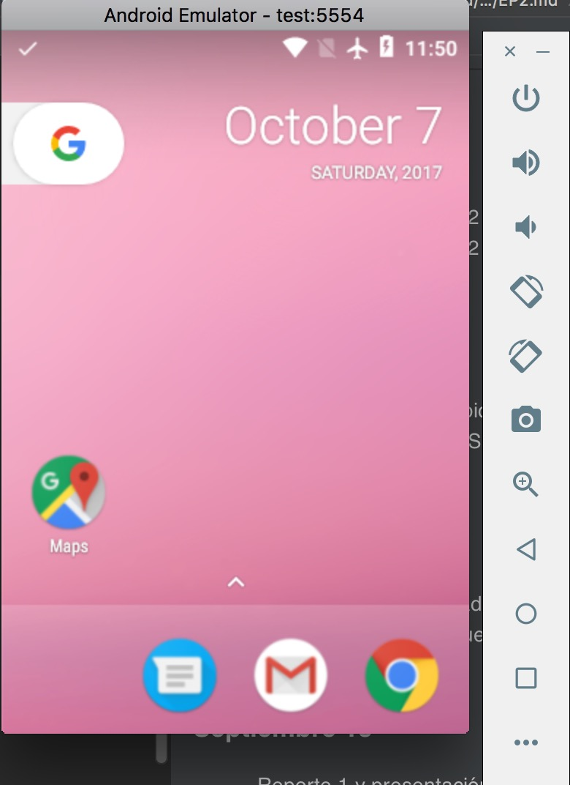
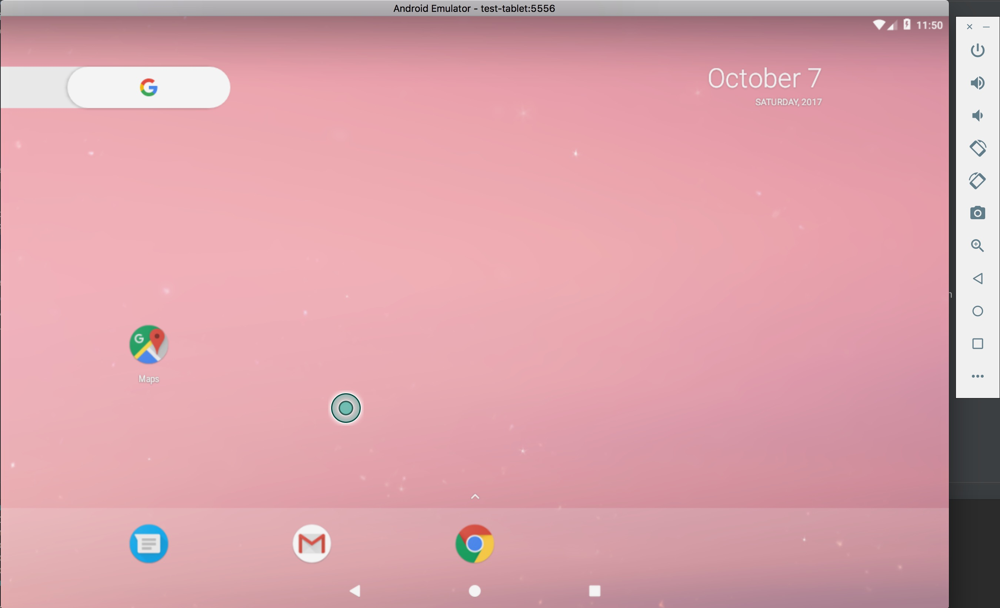
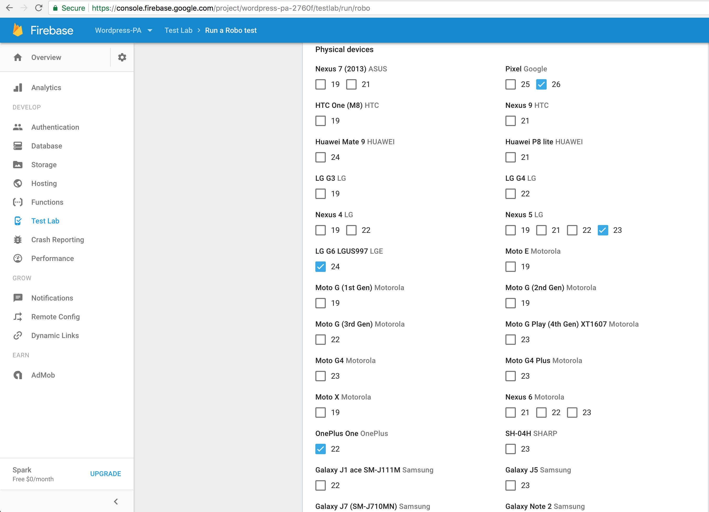
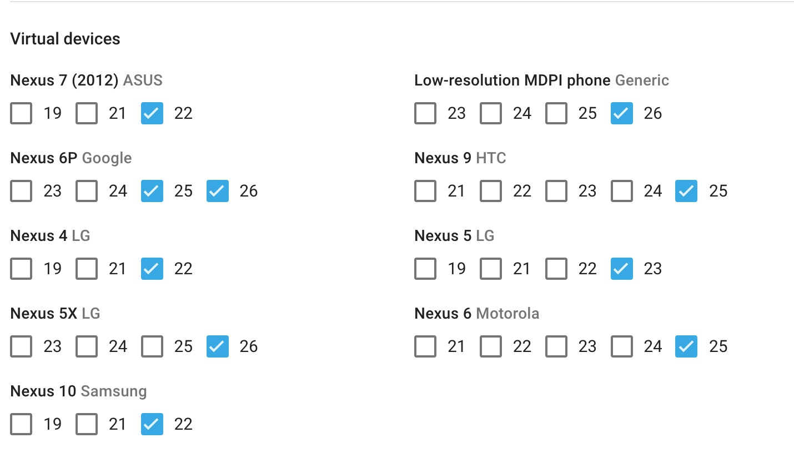
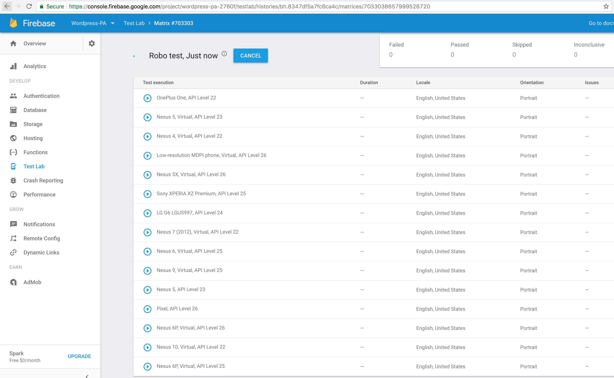
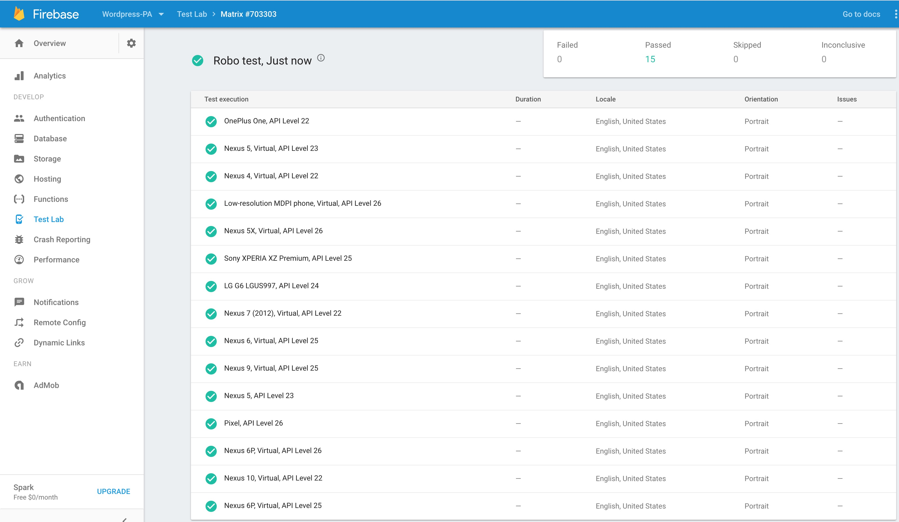
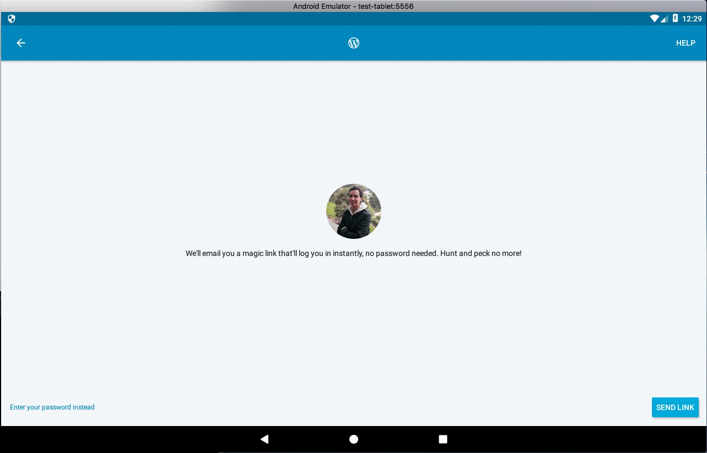

# Resultados EP1 - WordPress

### Bitácora
1. Se crearon los dos emuladores, uno de celular y otro tablet. Se creó un script para esto.
1. Se descargó e instaló la aplicación, en versión 8.2, en ambos emuladores. Se creó un script para esto
1. Se configuró gmail (necesario para iniciar sesión en WordPress) y 
1. Se inició sesión en WordPress para acceder a todas las funcionalidades
1. Se corrieron pruebas pequeñas de mil eventos para configurar el script.
1. Se corrieron las pruebas de los monkeys 10 veces. El script creado corre los monkeys de forma paralela.
1. Se documentó resultados de monkeys.
1. Se creó un test en Firebase test lab, se subió el apk y se seleccionaron 15 dispositivos (10 virtuales, 5 físicos)
1. Se guardó la plantilla y se corrieron los tests.
1. Se documentó resultados de Firebase test lab
1. Se documentó defecto de no poder hacer login con contraseña en dispositivos pequeños

### Emuladores

##### Celular

##### Tablet

### Monkeys
Con el script [correr_monkeys.sh](scripts/correr_monkeys.sh) que corre monkeys con un seed y varias opciones, se corren
monkeys con 100 mil eventos en ambos emuladores (celular y tablet). Se corrió el script 10 veces. La ejecución en el 
celular tuvo un crash de sistema una vez. La ejecución en la tablet no tuvo ninguno problema en ninguna ejecución. La
ejecución de los monkeys se demoraba en promedio 19-20 minutos. En la carpeta logs está la última ejecución de la tablet
y la ejecución con crash del celular.

### Firebase test lab

##### Dispositivos:

##### Corriendo

##### Resultados

No se encontraron fallas. La 15 ejecuciones fueron satisfactorias.

### Fallas/defectos encontrados
- Hubo un crash al correr el monkey en el celular, pero no fue de la aplicación, fue de android. [log](logs/cel_error.txt)
- Al hacer login en un dispositivo pequeño, no es posible utilizar la contraseña, se obliga a usar el link enviado al correo.
Estas imágenes muestran como se muestra la opción para usar contraseña en la tablet, pero no en el celular:

  

  