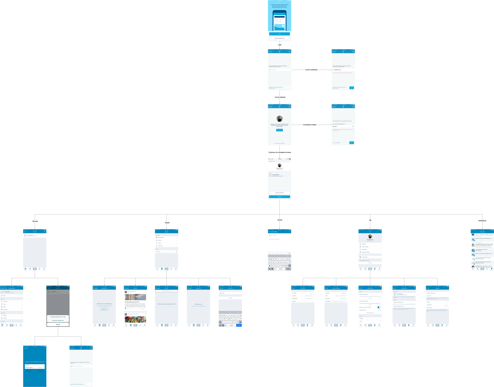

# Resultados EP1 - WordPress

### Bitácora
1. Se descargó e instaló la aplicación, en versión 8.3, con tamaño de 51.7 MB en un iPhone 6
2. Se procedió a explorar su interfaz y funcionalidades, tomando fotos en el proceso, buscando posible fallas y errores.
3. Se realizó el diagrama de flujo de interfaz para tener una mejor idea de la aplicación.

### Diagrama

El archivo [Diagrama_UI.xml](Diagrama_UI.xml) se puede abrir en [draw.io](https://www.draw.io)

### Fallas/defectos encontrados
- Ninguna falla encontrada
- No hubo *crashes*
